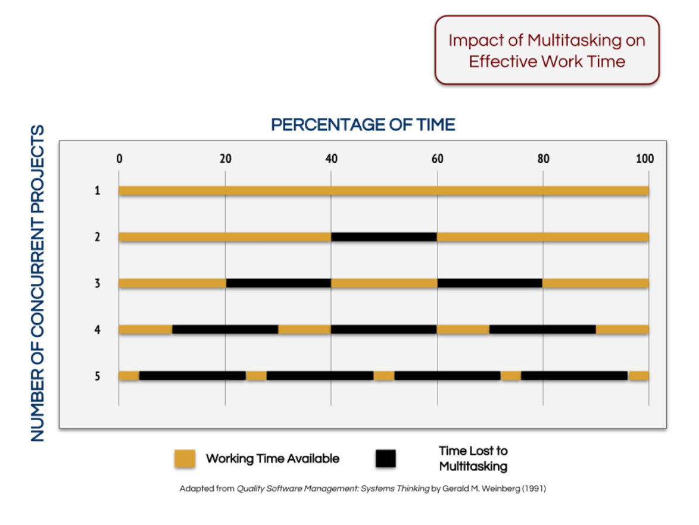

# Переключения и отвлечения

Помимо расфокуса, люди сейчас часто страдают многозадачностью. Вытесняющая многозадачность хорошо работает в операционных системах, позволяя компьютеру не зависать при работе. Однако для людей многозадачность означает «потери». Подумайте:

* Если ваше внимание распределено между 5 проектами одновременно, сколько внимания достается каждому?
* Если ваше внимание распределено между 5 задачами одновременно, сколько внимания достается каждой задаче? Насколько растет вероятность сделать ошибку? Сколько издержек вы несете на переключение между делами?

Можно порассуждать на эти темы в [клубе](https://systemsworld.club/) [МИ](https://systemsworld.club/)[М](https://systemsworld.club/).

В книге Tame Your Work Flow (альтернативное название – The Book of TameFlow) Стив Тендон, разработчик постголдраттовской теории ограничений, которую можно применять к знаниевым проектам, приводит следующие данные о стоимости переключений в ходе реализации проектов:

Если у команды одновременно идет один проект, то 100% времени имеется для реализации этого проекта. Добавление дополнительного проекта отнимает 20% от доступного рабочего времени. При 5 проектах бОльшую часть времени команда не работает, а переключается!

Многозадачность (много задач одновременно в процессе) так же плоха, как и многопроектность. Наличие многозадачности означает, что агент хаотично открывает новые задачи, пытаясь оптимизировать «вход» – входящий поток работ, и практически не уделяя внимание «выходу» (выпуску результатов работы). В итоге копится список задач в колонке «В процессе», берутся все новые задачи, старые теряются, потом срочно делаются в режиме героя перед дедлайном.

Многозадачность означает хаос, потеря фокуса означает хаос в деятельности агента – личности или команды. Тогда как устранение хаоса и переход к последовательному выполнению работ и проектов позволяет концентрировать усилия и прочие ресурсы на наиболее важном в каждый момент времени. Убирая многозадачность и многопроектность, получаем:

* Ускорение в выполнении работ,
* Увеличение производительности труда *без затрат* (буквально работаем меньше, но над самым важным, по принципу Парето),
* Уменьшение числа переключений – снимается лишняя когнитивная нагрузка.

Меньше переключений = больше производительность труда без лишних затрат – повышается скорость выпуска результатов – (если найдено ограничение) увеличивается выпуск предприятия – товары и услуги быстрее меняются на деньги, компания начинает зарабатывать больше (или, если не начинает, то пристально изучает рынок: на том ли рынке она работает и можно ли на нём заработать больше в принципе).

Чтобы получить ускорение, делая меньше, нужно также разобраться с **отвлечениями**: внутренними и внешними. Для начала желательно разобраться с **внешними отвлечениями**: включить режим «Фокусирование» на компьютере (есть практически на каждой операционной системе) и на телефоне, при необходимости установить приложения, прерывающие использование соцсетей, например, onesec для телефона или Minus.app для макбуков. Затем выделить время на сфокусированную работу: либо выполнять ее там, где вас не могут дернуть (например, в переговорке на работе, отдельном кабинете дома), либо приучать коллег и домашних к тому, что вас нельзя дергать в определенные периоды. Можно установить некоторый ритуал для этого: например, закрытая дверь или красный стикер / флажок на столе означают, что вас сейчас нельзя беспокоить.

Когда разобрались с внешними, можно перейти к **внутренним отвлечениям**. Они часто происходят из-за усталости или банального недостатка ресурсов на выполнение сложной работы: нужно больше усилий, чем вы можете приложить сейчас в текущем состоянии – и вы начинаете отвлекаться. Поэтому если замечаете, что много отвлекаетесь – определите для начала, не происходит ли это из-за недостатка ресурсов. Если ответ «да», обычно выгоднее пойти отдохнуть или устроить небольшой перерыв, чем бесконечно тупить над задачей.

Приходящие в голову новые мысли также становятся причиной отвлечений. В таком случае можно быстро записать в список дел пришедшую вам в голову идею – а потом выделить время на то, чтобы обработать эту информацию. Обычно это помогает. Кроме того, помогает и практика Помодоро, которая будет обсуждаться в следующих разделах.

Если вам трудно удерживать внимание в течение нескольких минут, вы постоянно отвлекаетесь, и «разгребанием дел» это не решается, стоит обратиться к врачу-неврологу или специалисту по расстройствам внимания, чтобы исключить физиологические проблемы со здоровьем.