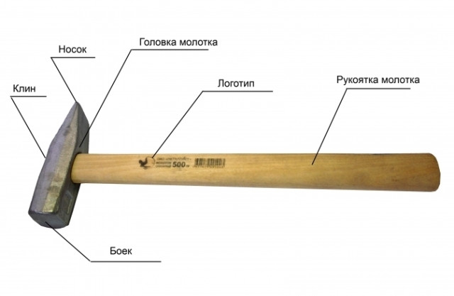
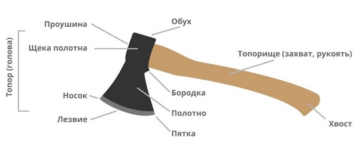

# Альфа коммерческой возможности ведения проекта

Описываемый концепцией использования ход «от потребностей (что мы хотим от надсистемы, если в её состав включить неизвестную пока целевую систему) к описанию целевой системы с её обычно неизвестными на момент начала проекта свойствами» сам по себе нетривиальный. Этот ход включает по факту в себя **изобретение**: предложение целевой системы как аффорданса в конструкции надсистемы, удовлетворящей потребности в функции этой надсистемы.

Скажем, наша целевая система должна быть «забивало» для гвоздей в какой-то надсистеме (столярная мастерская). Мы «идём на рынок» и ищем для «забивала» аффорданс изо всех представленных на рынке конструктивов: микроскоп дороговат, камень непрочный и неудобный, плоскогубцы слишком лёгкие для передачи энергии гвоздю. Ок, давай сделаем сами что-то железное тяжёлое, которое удобно держать, но не плоскогубцы — они вроде хороши, но их бы утяжелить. Назовём этот аффорданс «молоток» (маленький молот, а молот от «молотить» — стучать, бить). Рука взаимодействует с тяжёлым (но полегче, чем молот) молотком, разгоняя его, а энергия затем передаётся гвоздю, загоняя его в доску.

Добавим ещё один сценарий использования: бьём молотком не по гвоздю, а по чему-то хрупкому, чтобы расколоть. Для гвоздя нужно иметь плоскую поверхность бойка, чтобы легче попасть, а для колки всё то же самое, но хорошо бы малую поверхность клина при ударе, чтобы больше энергии уходило через меньшую площадь. Итак, нам нужен тяжёлый объект (предположительно металл), в котором есть большая и маленькая площадки, который приводится в движение рукой. И вот он будет не только в мастерской «забивалом», но и при нужде «разбивалом».

Эта идея приходит в головы разработчикам двух фирм. Они придумывают более-менее одинакову концепцию системы (тяжёлая металлическая часть для передачи энергии, снабжённая удобной для держания рукой деревянной рукояткой). Но одна фирма специализируется на функции «забивала» (не исключая побочно выполняемой функции «разбивала») и называет свой продукт «молоток» с плоским бойком и клином с острым носком в головке молотка:

Другая фирма специализируется на функции «разбивала» и выходит на рынок с «топором», где клин делается тонким (полотно) и ещё затачивается для получения лезвия с минимальной площадью, а для «забивала» используется обух:

Проблема предложения целевой системы в том, что для понятного набора функций системы нужно предложить её конструкцию из подсистем. Если концепция системы непонятна (непонятно, из чего делать систему), то никакое описание нужных функций не поможет. Если Бэббиджу было непонятно, что вычислитель надо было делать из вакуумных ламп (которых в его времена просто не было), а изобретателям самолётов до братьев Райт было непонятно, что двигателем там должен быть лёгкий и мощный двигатель внутреннего сгорания (а не распространённая раньше паровая машина) — проекты не могли быть удачными. Скажем, скатерть-самобранка хорошо понятна в части сценариев её использования дома и в ресторане, но как и из чего её сделать?! Надо синтезировать концепцию системы, а также каждой подсистемы, и так на много уровней вниз — если это сразу не удалось, то не факт, что удастся в ходе проекта. А если удалось, то не факт, что на предлагаемое инженерное решение будет спрос, вложения в разработку (включая производство) и маркетинг (это могут быть тоже немалые затраты) окупятся.

В случае потребностей конструктивные решения и для надсистемы (что там может быть целевой системой) и для самой целевой системы (из чего её сделать) обычно не так очевидны, о них должно быть сделано рациональное предположение (предпринимательская гипотеза), затем (логически, в реальном времени там сложные отношения) предложена концепция использования, затем такая концепция целевой системы (хотя бы на уровне идеи), которая могла бы удовлетворить концепции использования, затем можно попробовать такую систему сделать (что не факт, что просто), затем продать — и если это удалось, то гипотеза подтверждается, а если нет — не подтверждается (хотя даже тут не всё остаётся понятным: может быть, проблема в ценообразовании, а может — просто плохо продавали, умели сделать, но не умели продать).

Коммерческая возможность проекта увязывает два неизвестных вероятностных (предпринимательские гипотезы вероятностны!) описания двух разных систем (надсистема с концепцией использования и целевая с концепцией системы) и исключает разные неприемлемые варианты типа запроса на скатерть-самобранку (легко предложить концепцию использования, нелегко предложить конструкцию системы) или дешёвый («чтобы был не дороже билета на самолёт, иначе наш маркетинговый отдел возражает!») пассажирский транспорт на Марс. Это исключает и вариант «вот наши инженеры сделали Глюклу, она очень хитро устроена и хорошо издаёт забавные звуки (глюкает), когда крутится в воде, теперь мы не знаем, куда бы её приткнуть — где бы мог пригодиться такой сервис? Никто не знает, где нужна такая функция?».

Конечно, при этом нужно учитывать минимальное число видов описаний как в концепции использования для надсистемы как прозрачного ящика (функциональное, конструктивное, размещения/компоновка, стоимостное).

А ещё не надо считать, что в концепциях использования и системы можно писать банальности, которые всем известны — типа «интерес в том, чтобы система была дешёвой». Это проверяется путём подстановки слова «обувь» вместо названия системы. Скажем, написано «глюкла должна быть дешёвой» — «обувь должна быть дешёвой». Хорошо звучит, никакого онтологического дребезга. Значит, мы сказали какую-то общеизвестную истину, которую можно и не говорить, «спасибо, Кэп»[^r7-1].

В любом случае, повторим ещё раз (ибо все инженеры-менеджеры по десять раз задают этот вопрос): **алгоритма выдвижения предпринимательской гипотезы как идеи проекта нет, это сугубо творческий акт, никаких чётких последовательностей шагов, гарантированно ведущих к успеху!** Это «поиск аффордансов в нише», как говорят вслед за биологами специалисты по дизайну. Affordance тут один из синонимов к opportunity, по-русски это всё будет «возможности»[^r7-2].

Альфа коммерческой возможности (opportunity/«возможно делать», не путать с possibility/«вероятно/возможно существование») ведения проекта нужна для отслеживания в ходе проекта по созданию и развитию (или даже просто какому-то изменению уже имеющейся, brownfield) целевой системы как формулирования этой возможности (и затем визионер как шумпетеровский предприниматель говорит: «да, моя оценка — будет выгодно, работаем»), так и последующего отслеживания, что возможность не исчезла по ходу проекта (при этом система может развиваться, возможность ведения проекта необязательно исчезает с выпуском первой версии). Проект возможен, только когда:

* его целевая система будет кому-то нужна, и за неё смогут платить — есть потребность, неудовлетворимая без целевой системы, и за неё готовы платить (сегодня это обычно означает не только «заплатить» однократно, но и «платить» за развитие),
* её какое-то оргзвено (один человек, коллектив, предприятие, производственная кооперация) может сделать и дальше развивать не себе в убыток.

Можно возразить, что не все проекты связаны с какими-то коммерческими возможностями (скажем, часто в пример приводят политические проекты). Нет, это не так. Если денег на пропитание команды нет, то команда не будет работать, займётся чем-то другим, чтобы её члены могли банально выжить. Если же люди работают, не требуя оплаты, да ещё и оплачивают работу своего оборудования (включая компьютеры и связь), то это просто означает, что они сами в двух ролях: члены организации/команды/коллектива проекта, а ещё и во внешних проектных ролях — пользователей, заказчиков, плательщиков. Разговор ведь функциональный, про роли, а не про конкретных агентов (неважно, эти агенты люди или даже целые предприятия).

В «некоммерческих проектах» придётся всё равно оценивать их выполнимость: понимать, какая там будет конструкция, определять методы разработки, планировать, для чего определять потребность в ресурсах, так или иначе определять ту самую «коммерческую/ресурсную/бизнес возможность». И тут нужно не ошибаться: например, если вы помогаете голодным в Африке, то заказчики::«внешние проектные роли» тут спонсоры/благотворители, а выпускать будете сытых/бенефициаров::«целевая система»! Заказчики не сами голодные, а те, кто платит за их сытость! Голодные тут бенефициары, а не заказчики благотворительности! И если благотворителей нет, а голодных много, то «нет коммерческой возможности вести проект», накормить никого не удастся, проект невозможен.

**Нужно быть очень внимательным при обсуждении альфы коммерческой возможности в «некоммерческих проектах»! Там часто очень контринтуитивные рассуждения.** **Если вы, например, хотите затеять небольшую войну как проект, то какие-то люди могут посчитать, что у них от вашего проекта будет не прибыль, а убыток, и будут готовы заплатить деньгами, другими ресурсами, собственным трудом за то, чтобы помешать вашему проекту: и «маленькая победоносная война» закончится крахом по ресурсным соображениям. Это неважно, речь идёт о горячей войне, холодной войне или торговой войне. Альфа «коммерческая возможность» говорит о том, быть проекту или не быть, о ней нельзя забывать в ходе всего проекта (как и обо всех остальных).** **И помним, что её нужно отслеживать всё время проекта: системы не только создаются в их первой версии как** **MVP, но и постоянно развиваются, участвуют в техноэволюции.**

Альфой коммерческой возможности занимаются главным образом (это подробней обсуждается в руководстве по системному менеджменту в в разделе про орг-стратегирование):

* Визионер в команде инженеров целевой системы — он отслеживает, что коммерческая возможность не ускользает, оценивает будущее: даёт оценку, что развитие системы даёт возможность получать деньги от продажи продукта или работ какого-то сервиса.
* Бизнесмен в команде менеджеров — он отслеживает, что реализация этой коммерческой возможности не приведёт к уменьшению стоимости фирмы (например, проект может не соответствовать стратегии фирмы, инвесторы могут посчитать, что фирма уменьшит свою стоимость в силу репутационных рисков и т.д.).

Альфа коммерческой возможности — важная альфа (если заведомо нет ресурсов на проект — команда не должна его делать, даже если очень хочется), как и все альфы, она меняет свои состояния (в том числе и откатывается по состояниям назад!) в ходе всего проекта. Инженеры целевой системы и даже менеджеры часто забывают об этой альфе сразу после заключения контракта: «приходите через полтора года, когда система будет готова». Часто это ещё и контракт на изготовление одной версии системы, да ещё и на базе устаревшей идеи «требований». Такая забывчивость — часто фатальная для проекта ошибка. Возможность выполнения проекта успевает исчезнуть прямо во время выполнения проекта. Нет ведь «требований», есть «гипотезы» по поводу как надсистемы, отражённые в концепции использования, так и системы, отражённые в концепции системы и архитектуре системы, а ещё есть непрерывно и быстро изменяющийся мир с его многочисленными привходящими обстоятельствами. Если возможность проекта исчезла, а организация проекта продолжает тратить ресурсы на создание целевой системы, создание этой системы не окупится, некому будет за эту систему заплатить.

Это одна из самых сложных альф, она отражает взаимоувязанность решений самых разных проектных ролей, и внутренних, и внешних. И она существенно привязана ко времени: каждый день меняется ситуация на рынке, и каждый день меняется ситуация в разработке. Поэтому оценивать состояние альфы нужно часто, а мониторить её состояние нужно в ходе всего проекта, а не только при заключении контракта.

Альфа коммерческой возможности в ходе проекта проходит следующие состояния (достижение которых можно считать milestones, «контрольными точками» для управления проектами), но их нужно понимать не только как контрольные точки в выпуске только первой версии системы (чаще всего это MPV, minimal viable product, минимальный жизнеспособный продукт), но и инкрементов в улучшениях — каких-то новых фич системы, каких-то модернизаций самой системы, улучшающих её способность удовлетворить потребности, быть аффордансом в нише, которой занимаются внешние проектные роли[^r7-3]:

* *Выявлена (identified):* найдена идея; найден как минимум один исполнитель проектной роли, желающий сделать инвестицию в понимание коммерческой возможности; определены другие проектные роли.
* *Нужно решение (solutionneeded):* установлены потребности; определены проблемы и их причины, имеется концепция использования, целевая система/solution одобряется внешними проектными ролями как нужная, был предложен как минимум один вариант концепции системы, одобряемый внутренними проектными ролями.
* *Польза установлена (valueestablished):* польза[^r7-4] от реализации проекта была определена количественно; влияние решения/solution/целевой системы на внешние проектные роли понятно; польза системы внешними проектными ролями понимается; критерии успешности ясны; результаты ясны и выражены количественно.
* *Жизнеспособна (viable):* целевая система возможна с учётом всех известных ограничений; риски приемлемы и управляемы; проект выгоден; причины для создания целевой системы (или её инкремента/фичи/модернизации) понимаются; ясно, что проект как реализация коммерческой возможности жизнеспособен.
* *Реализована (addressed):* коммерческая возможность реализована; целевая система введена в эксплуатацию; внешние проектные роли удовлетворены;
* *Извлекается выгода (benefitaccrued):* проект создания целевой системы принёс выгоду; возврат на инвестиции приемлем.

Нужно работать какими-то методами, чтобы альфа возможности двигалась по своим состояниям. Достижение каждого состояния альфы «возможности» проверяется прохождением вышеупомянутого чеклиста, и свидетельствуется какими-то артефактами/рабочими продуктами. Например, состояние описаний свидетельствуется документами тех или иных моделей надсистемы, целевой системы и систем в цепочках создания. Состояний альф может свидетельствоваться в простых случаях и просто отметками в чеклисте, если мы верим, что поставивший эти отметки лично убедился в достижении требуемого чеклистом состояния. В нашем руководстве мы не будем подробно рассматривать методы этой работы, это предмет системной инженерии и системного менеджмента, по этим методам работы у нас отдельные руководства.

Сама себя альфа коммерческой возможности не двигает, возможность бизнеса сама себя не выявляет, «инициативы» по проекту сами по себе не ведут к коммерческому успеху. **«Безумные изобретатели» предпринимают безумные проекты, но** **эти проекты часто** **не ведут к выгоде—** **там** **нет** **планомерной** **работы с альфой коммерческой возможности, нет разговора о методах этой работы!**

Альфа коммерческой возможности весьма медленно переходит в состояние «извлекается выгода», часто это занимает несколько лет. Для этого нужна упорная работа команды проекта, в том числе с альфой возможности работают и фундаментальные методы мышления интеллект-стека (физика, онтология, рациональность, исследования, этика, риторика, методология, системная инженерия в числе них), а также понимание того, что надо будет проект как-то организационно оформлять (системный менеджмент).

Состояние альфы коммерческой возможности может характеризоваться самыми разными документами: «бизнес-планом», «концепцией», «обоснованием инвестиций/инвестиционным меморандумом», «бюджетом проекта», «рыночным исследованием», «проектным предложением» и т.п. Эти документы в свою очередь отражают состояние «концепции использования», «концепции системы», различных моделей, которые разрабатываются в ходе орг-стратегирования (в руководстве по системному менеджменту подробно разбираются три такие модели — бизнес-модель, модель оргразвития и модель целеполагания). Так что альфа коммерческой возможности может иметь в качестве своих подальф самые разные подальфы самых разных других альф.

Коммерческая возможность выполнить проект — это альфа, имеющая дело с наименее алгоритмизируемыми методами: «предпринимательством по Шумпетеру» как предсказанием будущего, изобретательством и прочим творчеством. Повторим, что методы перевода этой альфы по её состояниям обычно опираются не на прикладное, а на фундаментальное мышление «из первых принципов», ибо требуют решения проблем, которые раньше не встречались, и очень часто — в предметных областях, которых ещё нет (если компания первой выходит на рынок в надежде его захватить раньше, чем придут конкуренты). Прежде всего методы работы для продвижения состояний этой альфой связаны со способностью предугадать будущее, а это делается на основе хороших представлений об устройстве мира. В частности, наши руководства для инженеров-менеджеров дают ровно такую модель, мета-мета-модель мира.

[^r7-1]: <https://ru.wikipedia.org/wiki/Капитан_Очевидность>

[^r7-2]: <https://ru.wikipedia.org/wiki/Возможности>

[^r7-3]: Формулировки условий прохождения контрольных точек даны по мотивам упрощённой версии стандарта Essence, представленной в карточках состояния альф фирмы Ivar Jacobson International, <https://www.ivarjacobson.com/publications/tools/alpha-state-cards-pdf-version>.

[^r7-4]: Переводим value как «польза». Разговор о «пользе» обычно получается конкретным и содержательным, разговор о «ценности» абстрактным, слово «ценность» в русском языке не сосредотачивает обсуждение на вопросе «зачем вообще нужна ваша система?». Ценность в русском языке — это дороговизна вне ситуации использования, а польза — это нужность с силой достаточной, чтобы заплатить. Нам важен акцент на времени эксплуатации, на использовании, на полезности для чего-то (функции в надсистеме), пользе.
