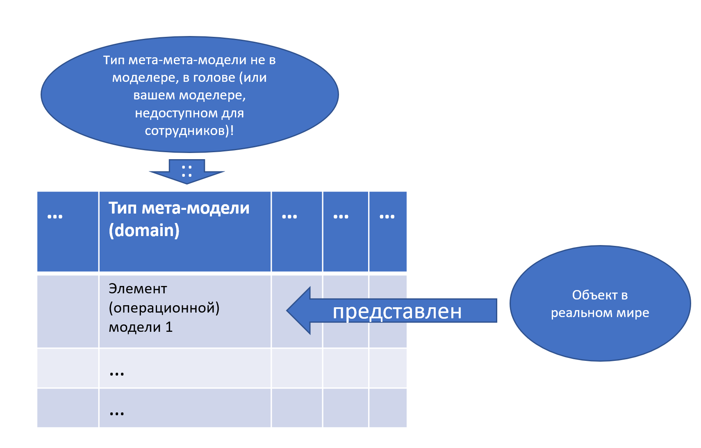

# Альфы — общий объект отслеживания для организации

С одной стороны, многие члены организации/команды/коллектива/«рабочей группы»/кооперации проекта как индивидуальные оргзвенья, играющие определённые оргроли в инженерном процессе проекта, в порядке разделения труда занимаются каждый «своими» альфами, проводя работы по продвижению их состояний. Но они, конечно, договариваются с коллегами по поводу всех этих изменений, удерживая во внимании согласованность всех работ, направленность их на успех проекта — и всячески стараясь содействовать ускорению выпуска (помним о критерии операционного менеджера: увеличение скорости выпуска, то есть ускорение выпуска, для чего делают рывок).

Далее мы не будем перечислять все возможные синонимы организации как набора агентов с их необходимым для выполнения работ по созданию и развитию какой-то целевой системы мастерством и инструментами (оргвозможность), а также с понятным разделением труда и разделением работ внутри организации, а также понятными полномочиями по распоряжению трудом агентов и капиталом (инструментарием, включая здания и сооружения). Поскольку мы в «Методологии» главным образом занимаемся инженерным процессом, методом создания и развития систем, то организацию будем рассматривать прежде всего в её функциональном рассмотрении, как взаимодействующие оргроли, абстрагируясь от оргзвеньев, которые эти оргроли играют.

Граф создателей системы подразумевает, что все члены::роли команды берут коллективную ответственность за все альфы проекта, а не каждый только за свою. В системном менеджменте это высшая степень взаимодействия — **сотрудничество**. И тут говорим даже о сотрудничестве в предприятии как графе создателей в целом по разным видам систем, включая сообщество пользователей, сообщество клиентов (клиентуру — те пользователи, которые реально заплатили деньги, ибо многие пользователи «пользуются, но пока не платят»), инвестуру, организованное в разные команды сообщество сотрудников предприятия (и даже с его подрядчиками — сотрудников расширенного предприятия), целевую систему, в том числе подсистемы целевой. И ещё надо создавать в графе создателей не только команды, но и их инструментарий. Сложно? Сложно, но внимание в этой сложности вполне можно удержать, моделируя такие графы и документируя эти модели.

Меньшие степени взаимодействия, чем «сотрудничество», приводят к другим результатам. Например, при **кооперации** результат одной операции подаётся на вход другой операции, но ответственности за итог в целом никто не берёт. Если кто-то выдаёт нитки, а кто-то шьёт парус, то кто-то может выдать гнилые нитки, а кто-то шить из них парус — и тот, кто шьёт, будет шить великолепно (и получит за своё шитьё премию), но парус порвётся! А тот, кто выдаёт гнилые нитки, тоже будет уверен, что сделал своё дело отлично. Скажем, нитки сгнили по дороге к тому, кто шьёт — какие претензии к изготовителю ниток? Никаких! И к выдающему гнилые нитки претензий нет — он честно делает своё дело! В результате: кооперация есть, премии вроде как заработали все, а сотрудничества нет — в итоге парус рвётся, деньги на премию заказчик не платит, да и за сам рвущийся парус не платит, у фирмы, продавшей шитый гнилыми нитками парус, «из ниоткуда» (никто ведь не виноват, все честно делали своё дело!) образуются проблемы.

Конечно, каждая новая степень взаимодействия включает в себя и предыдущие (нет сотрудничества без кооперации)[^r7-1]:

* **Игнорирование** (ignorance) того, что делают другие агенты, можем даже нанести им вред. При этом иногда заявляют «ничего личного, это бизнес» — и что самое интересное, и заявитель такого верит, что это отличное оправдание, и даже те, кому вредят, вроде как «понимают мотивы». А поскольку игнорируем, то никакого общения, делами других не интересуемся, свои дела никому не показываем.
* **Информирование и общение** (networking): готовы общаться, но не готовы ничего менять в своих планах и действиях. Если кто-то готов подстроиться под нас, то и хорошо. Но сами работаем, как работаем. Скажем, вывешиваем часы своей работы — но не готовы их менять даже когда кому-то очень надо.
* **Координация** (coordinated networking): готовы поменять какие-то свои планы и действия. Например, поглядеть на часы работы соседа и прийти в его рабочие часы. Заполнить форму, какую от меня требуют в той системе, в которой требуют, а не написать заявку в произвольном формате и отослать личным письмом.
* **Кооперация** (cooperation): участвуем в разделении труда и ресурсов, то есть договариваемся о том, как взаимодействуем на входных и выходных интерфейсах, согласовываем всё с соседями. При этом ответственность за то, что всё в целом будет как надо, у участников кооперации отсутствует. Если пиджачок сшит криво, и он ко мне попал на пришивание пуговиц, то я пришью пуговицы крепко, зубами не оторвёшь: к пуговицам точно претензий не будет, а что пиджачок в итоге кривой — не моя забота. Все рабочие процессы работают как часики, инженерный процесс в целом — не факт, что вообще работает.
* **Сотрудничество** (collaboration): делёжка не только трудом и ресурсами, но и ответственностью за общий результат всех участников работы. Но это труднодостигаемо, ибо требует удержания у каждого участника понимания не только его собственных операций, но и их влияния на результаты в целом (по факту — требует системного мышления от участников кооперации, удерживания внимания на довольно длинных цепочках рассуждений о причинах и следствиях).

Конечно, это всё крайнее упрощение. Например, орг-архитектура просто требует некоторой автономизации разных оргзвеньев — это означает, что некоторые просьбы нужно обязательно игнорировать. Так что по факту каждая из этих ступенек включает все предыдущие, и в сотрудничающей организации вы встретите по факту и все остальные виды поведения. Но вот наоборот неверно: если у вас доступна только координация, то скооперироваться и уж тем более сотрудничать будет трудно. В разных оргзвеньях большой организации вполне может быть разный уровень готовности сотрудничать, этим специально в менеджменте занимается практика лидерства как «катализация сотрудничества».

Разделение ролей на подроли — это разделение труда, но как именно назначать выполнение работ по разным методам на оргзвенья (назначать оргроли на оргзвенья — это просто другая формулировка того же самого) в каждом рабочем проекте нужно решать отдельно.

Проблема отсутствия сотрудничества может появляться даже, когда все роли исполняются одной личностью (одна личность выполняет работы разных методов, задействует несколько разных видов мастерства). Агент легко может не согласовать действия своих разных ролей между собой. Причины разные, например, желание получить оплату за две работы, которые совместно не улучшат систему, а ухудшат её, или банальная несобранность, или просто непонимание происходящего. Скажем, губернатор в своей речи заявляет, что сделает всё возможное, чтобы привлечь в регион иностранные инвестиции, создать максимально благоприятный инвестиционный климат, ибо без инвестиций будет всё очень плохо, но через три минуты в той же речи говорит, что в регионе появилось слишком много компаний с иностранным владением, и он будет с этим бороться! Это противоречие самому ему незаметно, ибо говорили от его имени разные роли с разными интересами. Такое встречается сплошь и рядом.

**Польза от** **системного** **и методологического** **мышления—** **поднять скорость и точность согласования своих работ в условиях** **коллективного сложного труда, скооперироваться и сотрудничать** **в коллективном сложном труде!** Для этого агенты договариваются:

* Об инженерном процессе и составляющих его методах (в том числе методах менеджмента, например, метод операционного менеджмента).
* О том, какие роли в инженерном процессе кто из агентов будет играть.
* Какие предметы составляющих методов инженерного процесса будут менять свои состояния (альфы).
* Все согласования делать в масштабах графа создателей, причём привязывая эти согласования к ускорению выпуска.
* Все согласования делать в режиме «непрерывного всего», ибо каждый день будет новая ситуация в проекте — и надо будет передоговариваться (договориться раз и навсегда не получится!).

И дальше надо будет непрерывно находить конфигурационные коллизии в проекте — и устранять их. Скажем, найти, что нитки сгнили — и понять, что делать дальше. Уж точно не шить парус гнилыми нитками, приговаривая, что «это не моя забота, где-то там наверху разберутся»! На конвейерах автомобильных заводов есть даже не право, а обязанность для рабочих остановить весь конвейер, если они заметили брак.

Например, можно взять **подальфу** **концепции использования для альфы описания системы**. Эту альфу можно равно считать как описанием целевой системы как чёрного ящика, так и считать описанием прозрачного ящика для надсистемы, связывающим потребности некоторых внешних проектных ролей (заказчиков, пользователей и т.д.) с описанием целевой системы как чёрного ящика, входящего в прозрачный ящик надсистемы как окружения целевой системы. Вот пример состояний для этой альфы (не берите их в свой проект прямо в таком виде, как они тут описаны! Обязательно адаптируйте их так, чтобы они были осмысленны именно в вашем проекте, чтобы команда понимала эти состояния и согласилась с ними!). Концепция использования (или её инкремент) проходит состояния (англоязычные термины взяты по мотивам стандарта OMG Essence):

* **Замышлена** (conceived), внешние проектные роли согласны в необходимости новой системы для удовлетворения потребностей.
* **Ограничена** (bounded), функции новой системы в её окружении понятны.
* **Непротиворечива** (coherent), концепция использования непротиворечиво описывает существенные характеристики новой системы.
* **Приемлема** (acceptable), концепция использования описывает систему, которая приемлема для проектных ролей.
* **Учтена** (addressed), функции достаточно реализованы воплощением системы так, чтобы это было принято внешними проектными ролями как удовлетворение их потребностей.
* **Удовлетворена** (fulfilled), на текущий момент потребности внешних проектных ролей удовлетворены.

Разработчиков целевой системы (визионеров, проектировщиков, методологов, технологов и операторов) интересует прежде всего «воплощение целевой системы»::альфа, но они также могут оказывать какое-то влияние на её надсистему (например, предлагая владеющим ею внешним проектным ролям немного изменить какие-то системы в окружении целевой, чтобы улучшить взаимодействие целевой системы и системами в её окружении). Но для того, чтобы получить желаемое состояние воплощения целевой системы, разработчики должны её спроектировать. Поэтому у разработчиков предметом интереса будут также и состояния альфы описания системы, в том числе состояние её подальфы «концепция использования». Дальше их будет волновать не просто состояние альфы воплощения системы самой по себе, но как удовлетворяющей альфе описания системы, в том числе подальфе концепции использования. Впрочем, и альфа внешних проектных ролей их тоже интересует — потребности-то от них, а концепция использования показывает, как их удовлетворить целевой системой. Получается, что разработчики в целом должны отслеживать подальфу концепции использования.

Мы не будем дальше писать тип, как в предыдущем абзаце «альфа описания системы», или даже «описание системы»::альфа. **Люди не произносят названия типов, это вы должны сами внимательно следить за тем, какие типы у понятий, скрывающихся за терминами! Не говорят** **«система самолёт»,** **говорят просто** **«самолёт».** **Не говорят** **«альфа описания системы»,** **говорят** **«описание системы»** **(но это альфа/предмет интереса: объект, на котором вы должны удерживать ваше внимание в** **ходе всего** **проекта).**

**Если что-то меняется в проекте и эти изменения важно отслеживать—** **это и есть альфа (чаще всего подальфа какой-то из основных альф, возможно из области интересов дальше по цепочке создания).** То же про «проектную/трудовую/деятельностную/инженерную роль» как тип. Не пишем «трудовая роль бизнесмена», «проектная роль проектировщика», пишем «бизнесмен», «проектировщик». Только иногда мы будем напоминать, что речь идёт именно об альфах, или проектных ролях, или системах. Но **вы должны отслеживать типы объектов, задействовать** **«машинку типов»** **в своём мозгу! Иначе вы не сможете привязать знания о типе, которые вы узнали из нашего** **руководства,** **к объектам в реальности.** **Грубо говоря:**

* **в голове** **удерживаете** **типы мета-мета-модели из** **фундаментальных дисциплин** **(например,** **наших** **руководств по** **системному** **мышлению** **и методологии),**
* **в заголовках** **столбцов** **табличек** **(в том числе табличек чеклистов)** **прописываете** **типы из мета-модели предметной области** **с принятыми в** **учебнике (метаУ-модель) или в текущей ситуации на** **предприятии** **(метаС-модель)** **терминами. То есть вы** **выбираете из «почти синонимов» то, что будет понятно окружающим людям. Но эти типы в заголовках столбцов табличекбудут** **типизированы типами мета-мета-модели трансдисциплин** **«в голове»,**
* **в** **ячейках строк** **табличек** **будутзначения характеристик объектов операционной модели (модели экземпляров из реального мира),** **явно** **классифицированные** **типами мета-модели** **(или метаУ-модели, или метаС-модели)** **в колонках, которые** **неявно («в голове»)** **классифицированы типами мета-мета-модели.**

**Отслеживать нужно все три уровня моделей! Без типов мета-мета-модели** **(типов из наших** **руководств, удерживаем внимание на них «в голове»)** **вы плохо будете выделять важные объекты внимания** **в предметных областях (из учебника, или на предприятии), наверняка забудете продумать** **культурно-обусловленные/«цивилизационно известные»** **важные характеристики системы и проекта, сделаете новичковые ошибки (или просто ошибки из-за** **несобранности личной или коллективной), не сможете корректно записать модели, что обязательно приведёт к утере коллективной собранности.**

**Если вы не поняли, что написано в этих выделенных абзацах, вам нужно повторно** **обратиться к освоению рациональной работы и системного мышления по нашим руководствам,** **выполнить** **в этих руководствах** **все** **задания по моделированию. Это обязательный** **пререквизит к** **освоению методологической работы по нашему руководству.**

Визионера, который принимает решения о том, стоит ли ввязываться в создание и развитие системы (или какой-то фичи в системе), интересуют внешние проектные роли и коммерческая возможность (он должен подтвердить наличие «рынка», который он определяет как достаточное число клиентов — платёжеспособных агентов с потребностями, которые можно удовлетворить создаваемой в проекте системой). И поэтому его интересует трассировка/соотнесение характеристик целевой системы с потребностями внешних проектных ролей (клиенты — это одна из внешних ролей, хотя и очень укрупнённая), он контролирует сфокусированность инженерной команды на создании успешного воплощения системы, то есть которое удовлетворит потребности (то есть не «наша система хорошо работает», а «надсистема нашего клиента с нашей системой в её составе хорошо работает»). Конечно, визионер тоже «докручивает» это инженерное рассуждение до менеджерского интереса в ускорении выпуска, как это обсуждалось в «Рациональной работе». В любом случае, визионер тоже заинтересован в отслеживании концепции использования в ходе проекта.

Операционного менеджера (в небольших проектах эту роль играет назначенный на должность «руководитель проекта», «тимлид») интересует система создания, сама организация проекта. Операционному менеджеру нужно выделять время и ресурсы разработчиков, но для чего? Для продвижения состояний всех альф проекта, включая подальфу концепции использования: ибо если операционный менеджер не будет планировать и дальше координировать выполнение работ проекта, то альфы не будут менять свои состояния. Работы сами себя не сделают, надо, чтобы организация проекта их сделала, у неё на это были ресурсы. Так что операционный менеджер тоже отслеживает в ходе всего проекта состояние подальфы концепции использования.

«Станочный парк» многих проектов сегодня часто соответствует «парку корпоративных информационных систем». За них отвечает инженер производственной платформы. Чаще всего эта роль выполняется оргзвеньями под руководством CTO и/или CIO. В их ведении обычно и инженерный процесс (метод разработки), в том числе поддержка составляющих этого метода необходимым инструментарием. Для метода разработки концепции использования целевой системы инженер платформы должен предусмотреть моделер, её поддерживающий (например, для практики use case выбрать какой-то моделер, позволяющий записывать результаты моделирования), а также предусмотреть управление конфигурацией для версий концепции использования (версий документов с моделями, входящими в концепцию использования целевой системы). Так что инженер производственной платформы тоже занимается подальфой концепции использования.

Так можно продолжать и дальше: оказывается, что одной из подальф описания системы (концепцией использования) занимаются самые разные роли, которые своим главным предметом имеют вроде как другие альфы: кто-то меняет состояние этой подальфы, кто-то выделяет на это изменение ресурсы и планирует время, кто-то предоставляет технологии для выполнения практики изменения состояния альфы, кто-то озабочен доступностью внешних проектных ролей для ведения с ними переговоров по выявлению потребностей. И всё это для того, чтобы изменения концепции использования стали возможными, и тем самым продвинулось и описание системы в целом. Но в целом с состояниями подальфы концепции использования согласовываются состояния очень многих альф и их подальф, включая альфы и их подальфы по всему графу создателей.

Примерно то же самое происходит и со всеми остальными альфами и подальфами, а не только с концепцией использования: состояния всех из них изменяются организацией проекта не порознь, а в тесной взаимосвязи, их изменения уторговываются, согласуются, о них договариваются, об их изменениях коллеги сообщают друг другу.

**Организация/команда/коллектив проекта** **совместно обсуждает текущее состояние альф** **и подальф** **проекта и** **на основе этого обсуждения** **планирует работы** **по каким-то методам** **по достижению следующих состояний, далее** **выделяет ресурсы на выполнение** **планов** **и отслеживает их выполнение** **(и это не строгая последовательность шагов, это функциональное максимально абстрактное описание инженерного процесса, помним про плохую выразимость методов «пошаговыми процедурами»).**

**Команда** **договаривается о том,** **что такое** **в жизни эти альфы,** **каковы их состояния** **(адаптирует к ситуации своего проекта типовые наборы альф, подальф, их состояний, контрольных вопросов к состояниям),** **договаривается о том, какие рабочие продукты будут отражать эти состояния альф. Затем команда** **сотрудничает в изменении состояний альф. Для** **этого** **команда** **моделирует состояние альф («коллективное мышление моделированием»), удерживает внимание на этих важных объектах («коллективная собранность»).**

**Для какого-то записанного и обсуждённого состояния альф команда выбирает методы работы, планирует работы, выделяет ресурсы—** **и проводит работы.**

Ещё раз: это всё не пошаговый алгоритм, как и большинство других описаний каких-то методов работы организации/команды/коллектива/«рабочей группы» проекта. Так, план работ необязательно «от начала до конца проекта», планироваться и выполняться может каждая отдельная мелкая работа в проекте, и даже не только в ходе начального создания MVP, но и в ходе последующего непрерывного развития системы. Это типичная ситуация, agile, управление работами при этом ведётся в рамках методов кейс-менеджмента, а не классического проектного управления. Главная идея в том, что это командное/коллективное/кооперативное/групповое/организованное **сотрудничество**, координированное удержанием в коллективном внимании всего множества альф и их подальф, а не работа неорганизованных одиночек в разных ролях на разных организационных местах, каждого над своей альфой или подальфой, совершенно независимо от других.

[^r7-1]: По мотивам
    https://www.researchgate.net/publication/200026050\_Collaborative\_Networks\_Reference\_Modeling
