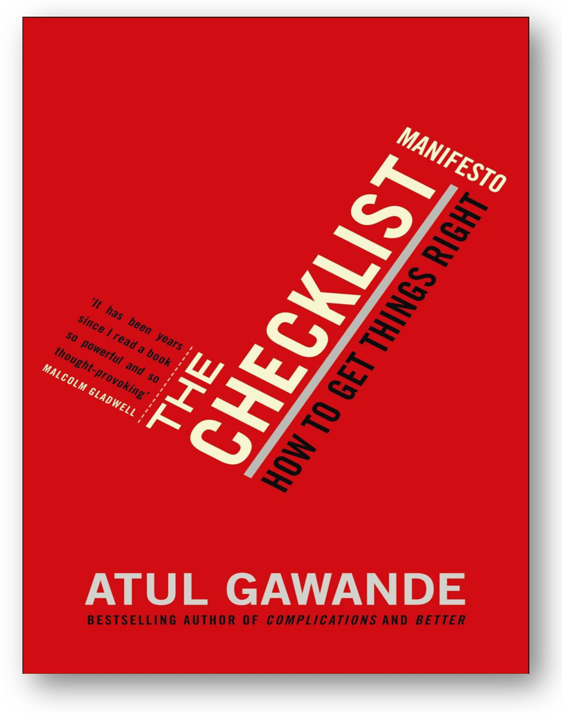

# Всегда используйте текст (аутлайн) и таблицу вместо диаграмм

Итак, если нас интересуют альфы как «чеклист для того, что не должно быть забыто в проекте», то диаграммная форма для их представления не нужна.

Вот пример записи альф из диаграммы в нашем примере в виде списка (первый уровень — это область интереса, второй уровень — альфы):

1. Надсистема целевой системы (время продвижения)

1. Коммерческая возможность проекта создания целевой системы
2. Внешние проектные роли

2. Целевая система (время использования)

1. Воплощение целевой системы
2. Цифровой двойник
3. Методы/сервисы/функции работы целевой системы
4. Работы (оperations) целевой системы

3. Создатель целевой системы (время создания и развития)

1. Инженерная команда целевой системы
2. Оргмодель инженерной команды
3. Метод разработки целевой системы (инженерный процесс)
4. Работы создания и развития целевой системы

Этот список в использовании для мониторинга состояния проекта имеет много преимуществ перед диаграммой:

* Занимает меньше места, на маленьком экране его легко окинуть взглядом.
* Связи между элементами списка не отображаются. В принципе, как это замечается и в стандарте OMG Essence, в проекте все альфы связаны друг с другом — на диаграмме были приведены не все связи/отношения, а только некоторые, просто для иллюстрации того, что эти альфы как-то относятся друг ко другу. Вот мы эти отношения будем подразумевать, просто не прописывать словами.
* Список этот можно сделать в текстовом редакторе, не нужно долго рисовать картинки.
* Если очень хочется, то можно уточнить типы прямо в тексте, например: надсистема::«область интересов», «возможность проекта»::альфа. Это недолго, это понятно, это не требует графического редактора со специальными изображениями для элементов языка, обозначающих типы (скажем, для типа областей интереса — закрашенные определённым цветом прямоугольники с названием типа в специальном поле вверху прямоугольника, для типа альф — значки, по форме напоминающие альфы, с наименованием внутри).
* Главное отличие — его легко редактировать, причём для текста не надо иметь ни специального моделера с поддержкой типов, ни даже просто графического редактора-«рисовалки» без поддержки типов. Например, в этот список можно добавить ещё один уровень вложенности, а в него добавить подальфы (скажем, к внешним проектным ролям добавить пользователя::подальфа, а чуть позже какой-нибудь потребнадзор::подальфа, к «описанию системы»::альфа добавить «концепцию использования»::подальфа и «концепцию системы»::подальфа). Если надо, можно добавить и четвёртый уровень вложенности, подальфы для подальф.
* Текст легко послать по почте, легко открыть для чтения — для чтения и записи текста существует много разного софта, для диаграмм — выбор меньше. Легко показать изменения (revision). Легко искать нужное место в большом списке (поиск по тексту).

Эту же диаграмму (граф создателей) легко показать, проигнорировав показанные в диаграмме отношения между основными альфами, не вложенным списком (аутлайном), а таблицей. Покажем это, добавив ещё и уровень подальф.

По большому счёту (в языке стандарта это вполне допустимо, хотя в жизни не так часто встречается) одна подальфа может быть подальфой двух альф, но мы и тут упростим — не станем этого предусматривать, это не так часто бывает. Мы не будем показывать всё подробно и приводить примеры подальф для альф целевой системы и создателя, и даже сократим имена областей интереса и альф по сравнению с исходной диаграммой. Покажем только сам принцип «как форматировать таблицу»:

|  |  |  |
| --- | --- | --- |
| **Область интересов** | **Альфы** | **Подальфы первого уровня** |
| 1. Надсистема | 1.1. Возможность проекта | 1.1.1. Бюджет |
|  |  | 1.1.2. Конкурентное преимущество |
|  | 1.2. Внешние проектные роли | 1.2.1. Пользователь |
|  |  | 1.2.2. Контрактор |
| 2. Целевая система | 2.1. Физический двойник |  |
|  | 2.2. Цифровой двойник |  |
|  | 2.3. Функции |  |
|  | 2.4. Работы |  |
| 3. Создатель | 3.1. Команда инженеров |  |
|  | 3.2. Оргмодель |  |
|  | 3.3. Метод разработки |  |
|  | 3.4. Работы команды |  |

Даже необязательно объединять пустые ячейки таблицы, их можно просто оставлять пустыми. И необязательно использовать нумерацию. Если вы понимаете (удерживаете в голове, не упускаете из внимания) принципы, по которым устроена эта таблица, вам и вашим коллегам будет всё понятно. Мы ещё и добавили пример состояний для одной из альф, чтобы было понятно, что такое табличное описание легко расширять, и оно очень компактно — ещё и в качестве буллета использовали «птичку», как в чеклисте (это же всё такой витиеватый и необычный, но чеклист! Объекты внимания, состояния которых надо отслеживать!) и даже вставили словесный комментарий, разорвав список состояний альфы. Если вы понимаете, что такое «область интересов», «альфы», «подальфы», «состояния альфы» (это всё было в руководстве по системному мышлению), то вы легко разберётесь. Это просто примеры моделирования с использованием этого языка/language/онтологии/мета-мета-модели в качестве метода описания происходящего в проекте создания и развития системы. Опять немного поменяли имена (помним, что синонимов много, важно понимать смысл, а не запоминать слова). И, конечно, можно использовать как таблицы в Ворде, так и таблицы в Экселе, но ещё и в coda.io, notion.so, Obsidian и других редакторах текста и табличных процессорах, а также productivity tools:

|  |  |  |
| --- | --- | --- |
| **Область интересов** | **Альфы** | **Подальфы первого уровня** |
| 1. Надсистема | 1.1. Возможность проекта | 1.1.1. Бюджет |
|  |  | 1.1.2. Конкурентное преимущество |
|  | 1.2. Внешние проектные роли | 1.2.1. Пользователь |
|  |  | 1.2.2. Контрактор |
| 2. Целевая система | 2.1. Воплощение целевой системы |  |
|  | 2.2. Описание целевой системы |  |
|  | 2.3. Метод работы целевой системы |  |
|  | 2.4. Работа целевой системы   * Инициирована (initiated) * Подготовлена (prepared) * Начата (started) * Под контролем (under control)   Помним, что речь может идти о какой-то версии системы, так что для конкретной версии в ходе развития работа может быть также:   * Закончена (concluded) * Закрыта (closed) |  |
| 3. Создатель | 3.1. Организация |  |
|  | 3.2. Оргмодель |  |
|  | 3.3. Метод создания и развития |  |
|  | 3.4. Работы создания и развития |  |

А ещё таблицы можно транспонировать. Скажем, вы имена альф и их состояний делаете заголовками колонок, а строчки таблицы будут содержать отметки (лучше не «птички», а указание времени) достижения состояний — для каждого объекта (скажем, для каждого из 150 контрагентов в проекте можно вести таблицу состояний подальф контрагента для каждого контрагента. Скажем, у вас контрагенты, для которых мы хотим отслеживать работу. Берём состояния работы из нашей таблички, транспонируем — и получаем табличку, в которой вы моделируете состояние работ с этими контрагентами. **Заголовки табличек—** **это шаблон чеклиста альфы, а вот строчки—** **это чеклист (и в нём вместо «птичек» проставлено время достижения состояния):**

|  |  |  |  |  |  |  |  |
| --- | --- | --- | --- | --- | --- | --- | --- |
| Номер п/п | Контрагент | Работа | | | | | |
|  |  | Инициирована | Подготовлена | Начата | Под контролем | Закончена | Закрыта |
| 1 | ООО «Незабудка» | 2.04.2028 | 6.04.2028 | 7.04.2028 |  |  |  |
| 2 | Уралдаш | 2.04.2028 | 6.04.2028 | 26.04.2028 | 27.04.2028 | 29.04.2028 |  |
| 3 | Василий Петрович | 5.05.2028 | 10.05.2028 |  |  |  |  |
| … | … |  |  |  |  |  |  |

Ещё таблицы можно разбивать на части, совсем необязательно в проекте иметь одну огромную таблицу.

Не пользуйтесь диаграммами (картинками с квадратиками и стрелочками) для моделирования, пользуйтесь **текстами** (не только на естественном языке, но и в виде псевдокода, необязательно даже использовать полностью формальный язык! Вы можете всегда указать в тексте на естественном языке тип какого-то понятия, указать список синонимов для термина, уточнить значение, дать ссылку на литературу), **многоуровневыми** **списками** **(outline), таблицами**.

И помним, что вы должны рисовать эти таблицы не в вашем любимом софте, а в любимом операционном софте того работника, который будет использовать аутлайн.

Когда ваши сотрудники должны освоить работу по какому-то методу, говорят о **постановке метода**, постановке рабочего процесса примерно так, как говорят о театральной постановке: вы должны иметь пьесу, потом раздать роли, потом убедиться, что роли выучены, срежиссировать исполнение (исправить ошибки, наладить взаимодействие актёров), потом убеждаться в том, что в самом спектакле всё идёт именно так, как выучили. Постановка метода включает в себя следующие шаги (помним, что «шаг» тут понятие условное, постановка метода — тоже метод, поэтому «пошаговые процедуры» нехарактерны, всё в жизни будет более запутанно, функциональное программирование с ленивыми вычислениями тут более подходящая аналогия):

1. Опишите метод в форме, пригодной для его изучения (это означает разработку **регламента**/инструкции/«корпоративного стандарта» для рабочего процесса не столько в форме «справочника» или «чёткого алгоритма», сколько в форме учебного материала, удобного для укладывания в голову).
2. Составьте для этого регламента шаблон чеклиста (заголовки таблички, где строчки таблицы будут чеклистами при прохождении каждой работы по рабочему процессу)
3. Убедитесь, что и регламент, и чеклист по шаблону чеклиста к этому регламенту доступны в операционном софте того работника, который будет идти по этим чеклистам. Никаких «всё это доступно на центральном сервере в одном месте, мне удобно как автору регламента, а также удобно для проверки из одного места» (если у вас все задачи отслеживаются в какой-то одном операционном софте для всех сотрудников, то вам повезло. Если работник работает в другом софте — то вам трудно будет отследить целостность выполнения всех методов инженерного процесса в целом, но зато работник будет использовать чеклисты, а не игнорировать их). Помним ошибку авторов первых стандартов описания методов: они были удобны для методологов, неудобны для исполняющих методы работников. Если работник работает в 1С, то это должен быть текст и табличка в 1C, если работает в каком-то приложении, открываемом через браузер, то это должно быть в том же приложении. Не должно быть открытых окошек разных программ в компьютере работника, он будет работать в той среде, где происходит сама работа, а регламент и чеклист просто не будет открывать, ибо они не будут в контексте работы, не будут связываться с рабочим инструментарием, с помощью в работе!
4. Проведите обучение — для этого обязательно пройдите вместе с работником по рабочему процессу и заполните вместе первую строчку в таблице чеклиста. Мало того, что работник будет научен, вы ещё и найдёте неточности-неясности-неопределённости в регламенте (и немедленно его исправите), а также неточности-неясности-неопределённости в шаблоне чеклиста, и тоже их исправите. Если чеклист неудобно держать на экране, вы тоже это обнаружите — и исправите.
5. Установите надзор за заполнением чеклиста. Ибо без надзора вы обнаружите, что чеклист не заполняется по ходу работы (то есть он не действует как чеклист, не помогает собранности), а где-нибудь в конце недели какой-нибудь младший сотрудник ставит все отметки о выполнении операций по всем работам, включая выполнение тех операций, о которых вообще забыли в суете самой работы. Нет, чеклисты нужны для поддержанной коллективным экзокортексом собранности, нужна дисциплина. Governance/надзор/присмотр — это когда работу поручает кто-то другой, но за несоблюдение правил следует увольнение: «если ты разболтан и рассеян настолько, что не в состоянии поставить отметку о выполнении работы, то мы не можем быть уверены, что ты внимателен и точен в выполнении самой работы, поэтому — пошёл вон!».

В любом предприятии есть много рабочих процессов (синоним метода работы!), выполняемых множеством людей, поэтому удержание внимания на постоянно меняющихся предметах этих рабочих процессов — это **собранность,** в данном случае **коллективная собранность,** внимание удерживается с использованием **чеклистов** **во внешней памяти (обычно в компьютерах, редко на бумаге),** а описание методов в ходе их взаимосвязанного выполнения при этом вполне может пониматься как «сборник чеклистов по достижению состояний альф».

По чеклистам как основному средству обеспечения коллективной собранности (мы предпочитаем современное написание «чеклист», а не «чек-лист» как в старых словарях) читаем книгу Atul Gawande, «The Checklist Manifesto», 2009 — и смело считаем эту книгу одним из самых интересных современных материалов по методологии, она подробно описывает, как появляется и поддерживается **разделение труда**(division of labor), то есть разложение методов работы на отдельные составляющие, поручение работ по этим методам отдельным агентам, которые оказываются играющими разные роли в проектах.

**Чтение этой книги—** **обязательная часть** **в освоении методологической работы по** **нашемуруководству. Вы не вычитаете в этой книге ничего принципиально нового, но книга вас убедит, что чеклисты—** **это важно, нужно, и надо их использовать** **в работе. После чтения книги** **инженеры-менеджеры** **перестают рассуждать** **и думать** **о чеклистах,** **но доходят до изменения своего поведения:** **начинают активно** **разрабатывать и** **использовать** **чеклисты, и это спасает их** **и личные, и рабочие** **проекты.** В книге Atul Gawande приводится один из примеров: использование чеклистов при проведении операций в больницах снизило смертность на 30%. Это типичный результат. **Примерно такого же можно ожидать с вашими проектами: смертность вашего проекта может быть снижена использованием чеклистов на треть, а то и больше.**