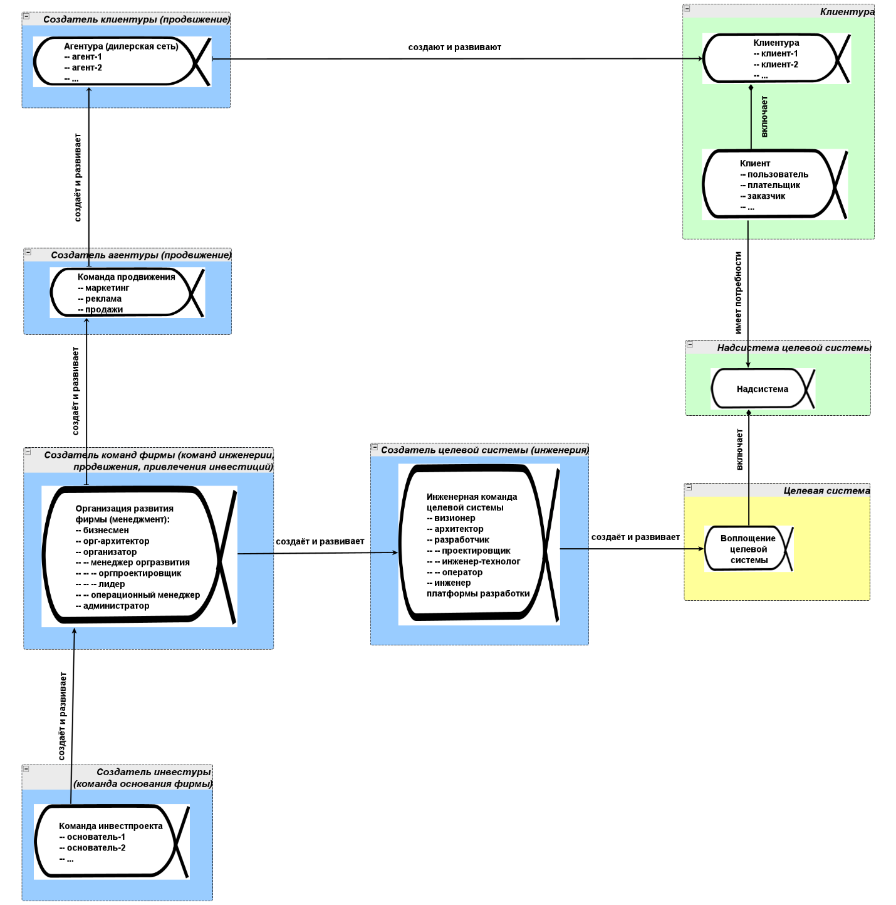
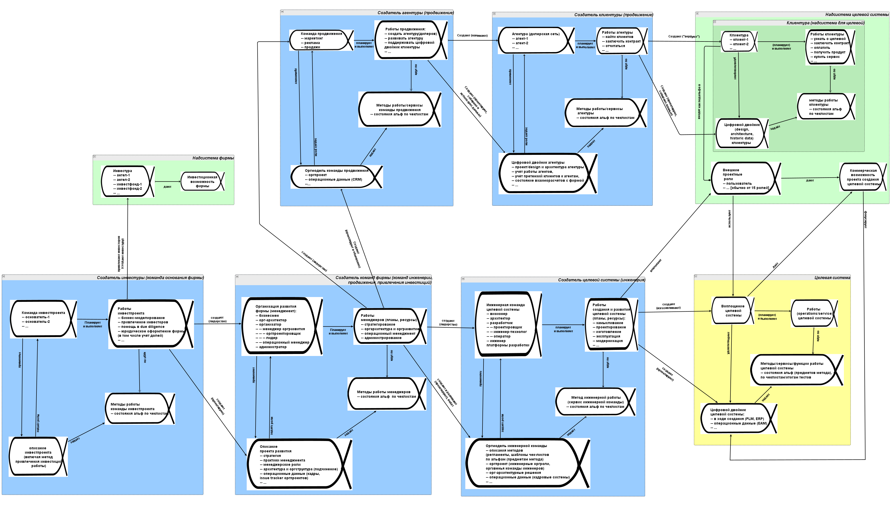

# Области интересов надсистем, целевой системы, создателя

**Областиважныххарактеристик/предметов интереса** (area of concerns) предложены в стандарте языка/language OMG Essence для группировки объектов внимания в проекте по укрупнённым характеристикам связи с какими-то системами. Они настолько укрупнены, что их было предложено называть не интересами, а областями интересов. В основных/kernel объектах из примера стандарта это были области интереса к объектам внимания, связанным с заказчиком/customer, системой»/system и проектом/начинанием/endeavor. Мы оставляем язык стандарта, сохраняем понятие «области интересов», но отказываемся от предложенного примера основных/kernel объектов в пользу более подходящего к нашему случаю примера не работы одной команды, а работы множества команд в графе создателей.

Нам нужно удержание коллективной собранности на согласованных изменениях в ходе инженерного процесса не только командой разработчиков и её менеджеров, но и самыми разными командами графа создателей предприятия или даже расширенного предприятия. Даже если эти разные команды, состоящие из ролей составлены из одних и тех же агентов-исполнителей этих ролей в небольших проектах, нам надо, чтобы в любой момент участникам рабочего проекта было понятно:

* что уже сделано (достижение необходимых состояний предметов метода будет отмечено в чеклистах), а
* что ещё не сделано (это в чеклистах отмечено ещё не будет, а чтобы было отмечено, то надо выбрать подходящий вариант метода для известной уже его сигнатуры, запланировать работы, выполнить работы, проверить достижение результата работ по чеклисту).

«Важная характеристика»/«предмет интереса» — это тема «озабоченности»/concern множества ролей. Она выражается явно каким-то методом описания/viewpoint, это не «чего ролям хочется достичь». «Чего хочется достичь» — это будет не сама характеристика, а предпочтения проектных ролей для этой характеристики, сам интерес в предмете этого интереса как шкале для отметки предпочтений —роли могут двигать целевые характеристики в разные стороны, для этого они используют удобные для этого методы описания. И роли договариваются между собой по поводу реализации своих предпочтений в этих важных характеристиках.

Напомним, что мы уже приводили пример упрощённой (без альф описаний системы, методов, работ) диаграммы графа создателей для предприятия в целом в подразделе «Граф создателей» второго раздела нашего руководства, на ней были показаны отношения создания, развития, изменения состояния (стрелочки «создаёт и развивает») между системами в графе, и делалось замечание, что все эти системы ведут по таким отношениям к целевой системе. Повторим эту упрощённую диаграмму графа создателей как провайдеров сервисов, меняющих состояния каких-то предметов своими сервисами[^r7-1]:

Для каждой альфы системы даны её подальфы, для создателей обычно — это альфы ролей (прикладных инженерных или менеджерских — объясняются подробно в руководствах по системной инженерии и системному менеджменту).

Если это группа агентов/оргзвеньев, которые играют какие-то роли (например, клиентура или просто «внешние проектные роли»), то будем создавать чеклисты для подальф, чтобы отслеживать изменения состояний отдельных агентов в группе. Подальфы важны, ибо часто нельзя сказать, что достигнуто какое-то состояние для альфы в целом, но можно — для подальф. Подальфы добавляют «разрешение»/resolution в модель, примерно так же, как добавка разрешения матричного экрана позволяет рассмотреть больше деталей изображения. Если у вас экран 8x8 пикселей, то вряд ли вы поймёте, что же у вас на нём изображено. Если же разрешение 4K UHD (3840 × 2160), то вы не только увидите, что изображено, но и увидите состояние того, что изображено. Например, на вопрос о том, в каком состоянии клиентура, вы могли бы отвечать «Клиенты 3, 5, 8 в процессе перезаключения договора, клиент 64 вчера отказался от наших услуг и мы проводим дополнительную с ним работу, от клиентов 39, 40 и 35 ожидаем оплаты, остальные обслуживаются». При этом у вас есть и альфа «клиентура», ибо если её нет, то что вы развиваете? Развиваете вы как раз клиентуру, наращиваете число клиентов в целом, увеличиваете лояльность, считаете показатели юнит-экономики[^r7-2].

Вы также должны адаптировать набор подальф для ваших проектов, да и сами альфы тоже нужно адаптировать — как минимум, взять терминологию, понятную для участников вашего проекта, но ещё и изменить состав альф. Граф создателей во всех предприятиях ведь разный, инженерные процессы всех создателей — разные. Так, альфы диаграммах текущего подраздела чуть-чуть в этом плане отличаются от альф упрощённой диаграммы, приведённой в предыдущем разделе — и по самим альфам, и по предложенному в них набору подальф.

А теперь покажем группу из четырёх альф в каждом звене графа создателей масштаба предприятия, добавим немного дополнительных подробностей, просто чтобы оценить топологию графа создателей, когда начинаем его разворачивать для отслеживания не только самих систем, но и их описаний и их работ. Эту диаграмму вы уже видели, она была в руководстве по системному мышлению в разделе «Системное описание предприятия», подразделе «Системное описание (предметов) деятельности предприятия» [^r7-3]:

Каждая система создания в своей области интересов имеет работы, которые она выполняет в готовом своём состоянии и её описание (включая её системное описание, но и описание методов её работы, и планы работ), а каждая перечисленная альфа ещё и включает подальфы, которые тоже надо будет как-то отслеживать в ходе проекта.

Тут, конечно, становится понятным, что область интересов создателя во внимании держит создатель создателя (скажем, для инженерной команды целевой системы как организации инженерного проекта это может быть какая-нибудь служба развития как организация, занимающаяся постановкой инженерного процесса в большой многопроектной компании). Так что без письменного удержания в коллективном внимании большого и подробного графа создателей как организационной модели, не обойтись. При этом граф создателей должен быть доведён с уровня абстракции мета-мета-модели организации (как на нашем примере диаграммы: только типы типы языка Essence из нашего руководства, например, типы «альфа», «состояние альфы») до уровня мета-модели организации (альфы, их состояния как шаблоны чеклистов тут), и потом ещё и модели организации (сами чеклисты по их шаблонам, где отмоделированы состояния объектов предметов метода).

Заметим, что в графе создателей моделируется не только организация, но и сама целевая система. Метод работы целевой системы (функция системы) в части его разработки и воплощения (насколько можно говорить о «воплощении поведения»: воплощается система, которая ведёт себя нужным образом) похож на метод работы сотрудников фирмы («рабочий процесс»), но там немного меняется язык и акценты, если речь идёт о не слишком живой системе, а какой-нибудь киберфизической системе:

1. Опишите функцию в форме, пригодной для её изучения и выполнения системой (это означает разработку модели, а то и исполняемого алгоритма для функции). Узнали «подготовьте регламент/инструкцию в форме, удобной для загрузки в голову сотрудника»?
2. Составьте для функции набор тестов состояния (впрочем, с этого можно начинать — test-driven development, TDD, когда тесты на достижение правильных выходных состояний системы для самых разных входных состояний разрабатываются заранее. Помним, что все эти «шаги» и их порядок — условны, жизнь сложнее, методы на чёткие «шаги» обычно не делятся, поэтому там термин «разложение на составляющие», а вы тут читаете именно «описание метода описания метода и надзора над его соблюдением», как бы странно рекурсивно это ни звучало). Узнали «подготовьте шаблон чеклиста»?
3. Убедитесь, что и описание метода, и результаты тестирования (замеры состояний) хранятся по возможности в самой системе, хотя тут могут быть и варианты. Это и есть «цифровой двойник», digital twin. Узнали про «убедитесь, что регламенты и чеклисты не в вашем софте, а в операционном софте сотрудника, который их исполняет»?
4. Проведите наладку — для этого в ходе разработки обязательно проведите испытания в самых разных режимах и обнаружьте несовпадение ваших моделей с реальностью. Исправьте ошибки по возможности до выхода в эксплуатацию. Инженерные обоснования (quality assurance) обязательны (подробнее — в руководстве по системной инженерии). Узнали «пройдите по чеклисту вместе с сотрудником»?
5. Не забывайте проверять, что там происходит с цифровым двойником, и как используются его данные для подстройки системы под условия использования. Узнали «организуйте надзор за честным заполнением чеклиста»?

Понятно, что провести эти составляющие метода в жизни очень трудно, если использовать диаграммные представления функций, хотя попытки сделать инженерные модели в виде диаграммных представлений постоянны — «принципиальные схемы» как типовой метод функциональных описаний очень привлекательны. Но только до тех пор, пока они не становятся сложны и поэтому запредельно трудоёмки в изменениях, а также пока их не надо использовать в составе цифрового двойника. После этого неизбежен переход к текстовым (или хотя бы табличным) моделям. Помним историю с Modelica и JuliaSim из первого раздела, она типична.

Для организаций всё то же самое. Для их моделирования регулярно пытаются использовать дорогие средства моделирования картинками. Обычно это приводит к тому, что какой-нибудь рабочий процесс пытаются нарисовать в дорогущей системе моделирования организационной архитектуры в её старом понимании, где каждая лицензия на вес золота (и поэтому такие диаграммы не становятся рабочим инструментом, они — экзотика для нескольких сотрудников, ключевое слово тут обычно ArchiMate, диаграммный язык описания организаций. Мы его не рекомендуем). Дальше переходят (от безысходности, ибо денег на массовую закупку подобного инструментария обычно нет, да и в сопровождении это довольно дорого) к, например, Visio — и тут же оказывается, что у инженеров рисовалками служат САПР, и диаграммы эти буквально открыть нечем. Инженеры предлагают рисовать это в САПР («это же просто большая рисовалка, и нужны эти диаграммы нам, а не менеджерам — вот давайте у нас рисовать»), но тогда вопрос об открытии диаграмм у менеджеров — и тоже вопрос с правами доступа и лицензиями, а также обучением работе на САПР для «нарисовать оргмодель» становятся запредельно высоки.

Так что в нашем руководстве диаграмму графа создателей мы привели «картинкой» ровно для того, чтобы показать: как только делаем в моделировании такого сложного объекта, как предприятие ход в сторону модели реальной сложности, а не сверхупрощённого примера «для иллюстрации в учебнике», так получаем сложности в работе с диаграммной формой «из ниоткуда». Ни открыть на любом рабочем месте, ни исправить на любом рабочем месте: получили «узкое место» в методологической работе просто «из ниоткуда», из мифов про преимущество картинок перед текстами и таблицами.

Диаграмма в нашем пример уже разрослась так, что уже практически не читаема, а ведь это до сих пор упрощённый пример, без подальф. Изображение в руководстве уже стало слишком мелко, чтобы его можно было разглядеть на экране, если это не экран размеров больше, чем стандартный лист A4. Если удерживать графическую форму, то при обязательной адаптации к условиям своего проекта (длина путей в графе создателей, наименования альф и подальф, и это мы ещё не перешли к чеклистам, это только шаблон для чеклиста, будущие «имена колонок» в таблицах) уйдёт непозволительно много времени на всяческие «выравнивания» и «разводку» (сразу предупредим: какая-то «авторазводка» работать не будет!).

Поэтому вспоминаем материал предыдущего подраздела о том, как изо всего этого сделать списки и таблички, чтобы можно было работать. Когда мы начнём рассматривать подальфы всех этих альф и дальше состояния всех этих альф и подальф, то графическая форма будет вообще непригодна для работы, надо отобразить очень много объектов. Так что задействуем табличное моделирование в универсальных моделерах (при этом любой софт, который может работать с табличками, даже MS Word, мы считаем универсальным моделером). Подробней организационное моделирование рассматривается в руководствах по системной инженерии и системному менеджменту.

Мышление о системах в графе систем-создателей однотипно: там везде будет внимание к системе, её описанию, методе её работы и работе. Это верно и для систем-создателей, и для целевых систем. По идее, так же должно быть устроено мышление о надсистемах, но их в окружающей целевую систему и создателей Вселенной бесконечно много, и поэтому там каждый раз нужно отслеживать какие-то отдельные важные для тех или иных звеньев в цепочке создания надсистемы и потребности внешних (для команд создателей в нашем проекте) проектных ролей для создателей этих надсистем, и какие-то альфы могут быть весьма нетиповыми, например, «коммерческая возможность ведения проекта» (эта альфа есть и в числе оригинальных основных/kernel альф OMG Essence).

Ещё трудно разобраться с цифровым двойником: можно долго спорить, кто какое описание системы для какого времени и какой степени готовности системы делает «обычно», «обычно в нашей предметной области», «обычно в нашей компании», «в нашем проекте, который уникален». Можно долго обсуждать, насколько система способна описать и построить сама себя. Если мы делаем создателя, это нельзя сбрасывать со счетов: иногда мы делаем железку, а иногда и личность, или даже организацию, и даже время от времени занимаемся сообществами и обществами как целевыми — но тут всегда можно использовать разделение труда, делить на роли и обсуждать каждую роль одного агента отдельно. Скажем, это не «я почесал себя», а «моя правая рука почесала мою левую руку под управлением моего мозга» (все эти парадоксы «самого себя» снимаются обычно после перехода на один или пару системных уровней вниз).

Не бойтесь модифицировать приведённые в нашем руководстве основные альфы, наборы их подальф, контрольные вопросы чеклистов для состояний этих альф. Наоборот, бойтесь их не модифицировать. Хотя наши инженеры-менеджеры и говорят, что 75% примеров альф из нашего руководства можно использовать в проекте без модификации, вам может повезти сильно меньше. Только вы внутри проекта сможете сообразить, какие именно альфы и их подальфы вам нужно отслеживать, и только вы сможете сообразить, что можно взять для моделирования их чеклистов из нашего руководства, а что надо будет создать самим. **Сам стандарт** **OMGEssence** **настаивает, чтобы чеклисты альф были адаптированы командой проекта: это даёт некоторую надежду, что команда понимает, что говорится в контрольных вопросах этих чеклистов.**

В целом хорошо бы следовать предложенному набору основных альф. Как минимум подумать: не забыли ли вы отслеживать их состояние в проекте? Отслеживать не «устно», а «письменно»? Если эти альфы и их контрольные вопросы не подходят для вашего проекта, то за чем надо в вашем проекте следить, чтобы не пропустить подумать о каких-то важных событиях (события изменения состояния каких-то предметов метода разработки) и необходимых для наступления этих важных событий работах?

Каждая организация проекта (инженерного целевой системы, проекта развития, проекта основания) работает/используется/эксплуатируется в своём времени использования. Одно и то же время для обсуждения создателя будет временем создания целевой системы и временем работы/эксплуатации/использования/функционирования создателя. Поэтому внимательно смотрим, о каком времени идёт разговор и используем подходящие для этого времени описания (преимущественно конструктивное для времени создания, преимущественно функциональное для времени использования, полная стоимость владения с учётом обеих этих времён).

Планирование этих работ/operations/services целевой системы не всегда делает сама целевая система (если эта система не очень живая, то это может делать оператор из системы создателя или кто-то из окружения целевой), поэтому планирование на отношении связи между воплощением системы и её работами на диаграмме взяли в скобки. По большому счёту, в момент времени работы/эксплуатации целевой системы она может при достаточной степени агентности/автономности/сознательности планировать (заранее или «на лету»/on the fly) свои работы сама, при этом, конечно, для того, чтобы не запутаться, обязательно проходим на системный уровень вниз: что там планирует, а что исполняет планы из подсистем (помним про «моя правая рука почесала мою левую руку по методу, который выбрало моё мастерство чесания, и по плану, который составило моё мастерство планирования собственных движений»).

Составить план (что и когда с какими ресурсами делать), а потом его исполнить могут и самые простые системы, типа предохранителя в электрической цепи, который «срабатывает» ровно тогда, когда нужно, «планирует на лету свою работу». Тем не менее, какой-то станок включается иногда сам, но иногда его включают извне, а он сам только работает. В каждом конкретном проекте это всё нужно обсуждать и адаптировать системную схему проекта к конкретной ситуации, всё-таки безмасштабность и деантропоморфизация мышления в методологии ещё не сильно развита, думать о системах как обладающих разной степенью разумности (включая системы с развитым AI) люди ещё не научились, и на каждом сочетании масштабов и с учётом огромного разнообразия систем могут быть какие-то особенности. Важно, чтобы вы не боялись менять и состав основных альф, и их подальфы, и число звеньев в цепочках создания, и контрольные вопросы к графу состояний альф и подальф.

В организации проекта развития альфой работы занимаются операционные менеджеры, используя практики управления работами/операционного управления. Хотя они приписываются обычно к инженерам в состав инженерной команды, но по ролевой сути дела они там «боссы», «казачки засланные» из создателя инженерной команды, службы развития. Они так и ощущаются инженерами, как «внешние», не члены команды, а «боссы», если играющий их роль агент занимает отдельную чисто менеджерскую должность и не совмещает менеджерскую роль с ролью инженера целевой системы, то есть не принимает каких-то важных инженерных решений.

Длина вроде как типовых цепочек создания для графа создателей в разных организациях может существенно различаться, там не так уж и много «типового». Так, клиентура в маленькой компании может создаваться службой продвижения непосредственно. А в большой компании — сначала служба продвижения создаёт агентуру, а потом уже агентура создаёт клиентуру. Точно так же можно рассматривать и вставку в цепочку создания какого-то оборудования: разработчики создают игровые сеансы не непосредственно, они создают игровые программы на устройствах игроков и серверную часть этих программ, а уже эти программы создают игровые сеансы. В появляющееся в цепочках создания оборудование можно включать и людей (скажем, система колл-центра на базе AI обрабатывает 90% звонков, но 10% звонков переключаются на людей — и мы считаем их «такими специальными станками, цели для ближайшей автоматизации/цифровой трансформации/интеллектуализации» — и для «неживой» и «живой» части таких систем можно обсуждать различные цепочки создания, различные производственные технологические платформы). Смотрите внимательно, сколько звеньев включать в якобы «типовые, сразу понятные» цепочки создания. Очень часто число этих звеньев недооценивается и обсуждать проект становится сложно из-за явных пропусков таких звеньев: по факту это вы пропускаете важные объекты внимания, они остаются без своих чеклистов, в какой-то момент проекта вы просто о них не вспомните, и дальше обязательно реализуются какие-то связанные с ними риски.

Инженерия производственной платформы (современный подход к DevOps/SRE как к platform engineering, подробнее будет рассказано в руководстве по системной инженерии), в том числе создание административных служб предприятия (подробнее будет рассказано в руководстве по системному менеджменту), на примерах диаграмм в текущем подразделе не показана. Но там применимы все те же рассуждения, что в руководстве по системному мышлению приводятся для графа создателей: инженер платформы разработки создаёт «большой станок» (в случае ракеты это завод ракет, в случае софта — это inner development platform, в случае системы-предприятия — это административные службы) и обеспечивает его работу, обучает инженеров работать с его помощью (для чего пишет регламенты/руководства по инженерному процессу, который задействует эту производственную платформу как инструментарий), и уже на этом «большом станке» изготавливается описания целевой системы, а затем и сама целевая система.

Вам нужно предусмотреть это, когда будете адаптировать основные альфы для вашего проекта. Этим занимаются чаще всего исполнители ролей CTO/CIO (chief technology/information officer, в современном мире «станочный парк» стал во многом «парком» корпоративных информационных систем, «главный инженер» и «главный айтишник» — это одно и то же по их задачам), или выделенные ответственные за DevOps, и этих инженеров производственной платформы не надо путать с инженерами целевой системы: одни проектируют и эксплуатируют завод, а другие проектируют и эксплуатируют целевую систему, изготавливаемую и проверяемую на этом заводе.

В приведённой нами диаграмме графа создателей для предприятия наличие по факту двух инженерных команд (целевой системы и инженерии внутренней платформы разработки) не показано, только показана роль инженера платформы. Впрочем, команд разработчиков тоже может быть много для разных частей системы, а архитектор::роль может быть реализован одной командой (не одним человеком! Командой с их моделерами!)::оргзвеном на все команды разработчиков. Будьте внимательны в моделировании прикладной инженерии, там не всё так просто, как в примере из текущего подраздела. Подробней — в руководстве по системной инженерии, а в руководствах по инженерии личности и системному менеджменту можно посмотреть примеры.

В вашем проекте внимание наверняка нужно будет уделить большому числу альф — и сразу рекомендация: используйте «мышление моделированием», будьте собранными! Не держите ваши мысли только в голове. Делайте списки и таблички, как это описано в нашем руководстве, размышляйте над ними, показывайте коллегам, тратьте на это достаточно времени. Это время окупится: вы потом не будете тратить часы и часы на разных совещаниях, чтобы разобраться со всеми недоразумениями, но и это не главный выигрыш — вы не будете тратить время и другие ресурсы на то, чтобы что-то переделать, не будете тратить время на rework. Чеклисты нужны для того, чтобы не было катастроф в проекте: девять раз из десяти они излишни («мы и так всё знаем, всё делаем»), а один из десяти раз прохождение тщательно спроектированного чеклиста спасёт проект!

Какая альфа главная в основных альфах графа создателей? С одной стороны, все альфы. Отслеживать изменения в проекте нужно всех альф, ни одной не забывать. Но «**главная среди равных»—** **альфа воплощения системы, привязывающая все рассуждения к физической реальности.** Системы материальны, они гарантируют адекватность проекта, предупреждают отрыв мышления от реальности. Привязка всех остальных альф к альфе воплощения системы помогает избегать оторванных от физической реальности рассуждений, которые могут оказаться фантазиями.

**Воплощение системы—** **это и есть целевая система в её физическом виде, её создание и есть цель проекта.** **Когда вы ведёте переговоры с самыми разными ролями в проекте (внутренними и внешними), обязательно явно обсуждайте цепочку создания от вас и от них до целевой системы проекта. Доводите эти разговоры до момента, когда будет понятно, что будет лучше для целевой системы:** **вы её быстрее сделаете, предотвратите ошибки, сделаете дешевле для команды и более желанной для внешних проектных ролей. Это и есть предмет разговоров-переговоров в проекте.** **Не забывайте затем от обсуждения целевой системы (этого достаточно, чтобы договориться с инженерами) переходить к обсуждению увеличения скорости выпуска—** **без этого вы не договоритесь с менеджерами.**

[^r7-1]: Картинка высокого разрешения — <https://ic.pics.livejournal.com/ailev/696279/215914/215914_original.png>

[^r7-2]: <https://theaccountancycloud.com/blogs/understanding-unit-economics>

[^r7-3]: Диаграмма в высоком разрешении — <https://ic.pics.livejournal.com/ailev/696279/212554/212554_original.png>, файл для редактора графов yEd — <https://disk.yandex.ru/d/qMDMgCZTkkT4-w>
