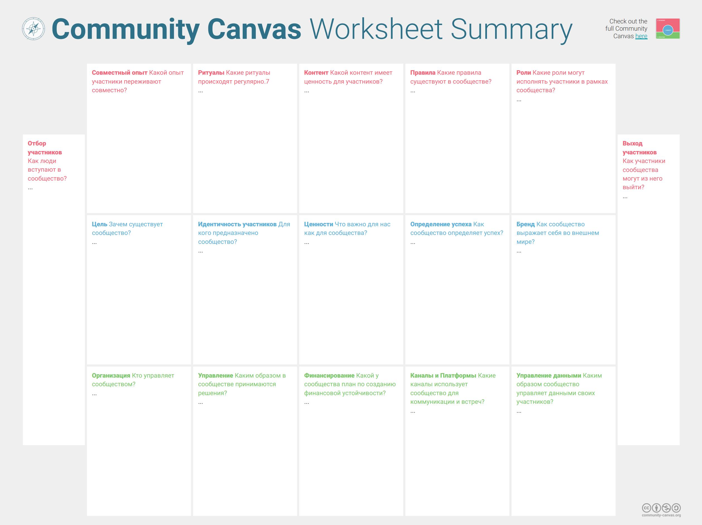

# Пример: альфа «культура» для сообществ

Социологические и социопсихологические теории в инженерии сообществ нам пока не слишком помогут[^r7-1], а инженерный подход сразу приводит к рассмотрению графа создателей сообщества. Создатели сообщества сегодня называются чаще всего менеджерами сообщества, ибо менеджмент сообществ оказывается во многих аспектах близок к менеджменту организации в целом:

* Организация рассматривается с одной стороны как сообщество её сотрудников, разделяющее какую-то организационную культуру (методы общения и отношения друг ко другу, разделяемые членами этой организации).
* Собственно «организация» как группа людей с понятными полномочиями по распоряжению трудом и капиталом, ведущая скоординированную работу по созданию каких-то систем-продуктов и/или предоставлению сервисов.

Если мы берём какое-то сообщество, которое не представляет собой «рабочую силу организации», то можно рассматривать его с двух позиций восприятия:

* Члена сообщества, который получает какой-то опыт/впечатления, проходя своё путешествие в это сообщество, нахождения в сообществе, ухода из сообщества. Это мы обсуждали в нашем руководстве: community member journey и community member experience.
* Менеджеров сообщества, ибо они пытаются организовывать и развивать какие-то сообщества (жителей территории, любителей спорта, увлекающихся каким-то хобби и т.д., но так же и сообщества клиентов, пользователей, инвесторов организации) примерно так же, как они занимаются развитием сообщества самих сотрудников. В этом плане работа менеджеров сообществ и HR служб компаний отличаются не сильно.

Рассмотрение тут функциональное, ролевое, методологическое: одни и те же агенты могут быть одновременно и участниками сообщества, и его менеджерами. «Инженеры сообществ» говорить не принято, это можно услышать ещё реже, чем «инженеры предприятий». Чаще всего говорят «менеджеры сообщества», но эту роль могут назвать и «организатор», «орг» — тут примерно та же терминология, что и с «мероприятиями», которые, по большому счёту сводятся часто к «мероприятиям в рамках управлению сообществами», то есть мероприятиям по созданию, развитию, обучению сообществ, вовлечению членов сообщества в какую-то профильную культуру.

Если мы будем говорить о «создателях сообщества», то речь идёт необязательно о «создателях с нуля», речь может идти и о развитии, и о поддержании или наоборот, сознательном развале сообщества, если кто-то из агентов посчитает его неприемлемым. Тут термин создатель/constructor формально указывает просто на системы из графа создателей. Как всегда, надо восстанавливать значения терминов не из «определений» и «словарей» (их множество!), а из контекста. Смысл слов ищется главным образом в их употреблении, а не в словарях! Словари могут помочь, но могут и запутать, и вовлечь в пустопорожний «спор о терминах».

В руководству по системному мышлению отмечалось, что групповые объекты вполне можно считать системой, если рассматривать их без отрыва от рассмотрения их среды/environment как надсистем. В зависимости от проекта сообщество можно или считать целевой системой с каким-то обществом как надсистемой (и там ещё надо показать часть-целое, что может быть непросто), или даже считать подсистемой создателя, нужной для его функционирования в его собственной надсистеме (скажем, для выживания в конкурентной среде, удержания границ) или даже вообще не считать системой — считать множеством членов (как не считаем системой партию деталей, а системой считаем каждую деталь, выпущенную на заводе-создателе по общему для всех этих деталей проекту/design), но это будет только в том случае, когда нас не интересуют эмерджентные характеристики сообщества.

Сообщество при этом мы посчитали состоящим из каких-то членов, у которых есть мастерство культуры, практикуемой этим сообществом. И тут мы опять попадаем в предмет рассмотрения методологии: культура — это просто метод, которым пользуется какое-то сообщество. Сообщество инвесторов состоит из агентов с мастерством инвестирования, сообщество клиентов состоит из агентов с мастерством покупки продуктов или сервисов, сообщество свободных художников состоит из агентов с мастерством свободы (если они договорились, по каким методам ведут себя «свободные» агенты) и рисования.

Какие культуры надо рассматривать, когда мы говорим о сообществах? Чтобы системно описать изменения в ходе создания и развития сообществ, нам потребуется отслеживать альфы минимально в трёх областях интереса:

* Создателя (менеджер/builder/developer/орг) сообщества, причём их может быть множество — в том числе они могут и конкурировать, в том числе там могут быть сложные графы создателей.
* Самого создаваемого и развиваемого сообщества как целевой системы.
* Отдельных членов сообщества как подсистем целевого сообщества-системы.

Ничего необычного. Если вам встречается какой-то «странный объект в странной предметной области», вы просто используете системное мышление — и появляются реально важные объекты, которые будет понятно, как описывать. Сообщества тут не исключение.

В каждой из областей интереса мы обычно выделяем четыре основные/kernel альфы как предметы метода, отслеживаемые в ходе проекта: воплощение системы, описание системы, метод работы системы, работы системы. Это означает, что для трёх упомянутых областей интереса мы сходу получаем 12 альф, которые надо бы отслеживать в ходе проекта, причём там сразу намечаются усложнения:

* Создатель дальше будет раскрываться как целый набор создателей в каком-то графе создателей сообщества. Какое там было путешествие менеджера сообщества? Откуда он пришёл, кто его привёл, кто научил? Кто влияет на его решения или вообще может его заменить? Кто там его конкуренты (влиять на сообщества много кто хочет, и часто это влияние конкурирующее!), кто союзники?
* Сообщество можно раскрывать и как набор подальф «член сообщества», но по факту будет сложнее: члены сообщества будут выступать как полноценные системы в этом сообществе и могут моделироваться каждое полноценными четырьмя основными альфами (как и в случае «инженерной команды»).

Конечно, в корпоративном контексте сразу речь пойдёт о ролевых сообществах сотрудников, пользователей, клиентов, инвесторов, жителей тех районов, где размещены предприятия, сообществах поставщиков. Но все эти рассмотрения могут быть использованы и не для корпоративных контекстов — для какого-нибудь кружка вышивания крестиком или саморегулируемой организации (не все саморегулируемые организации уполномочены государством, политические партии и их объединения вполне могут таковыми быть, иногда такой подход называют «партией нового типа», начиная от партии большевиков). Впрочем, у нас руководство не по управлению сообществами, а по методологии, поэтому дальше эту тему раскрывать не будем, а отошлём сразу к руководству по системному менеджменту, где рассматривается менеджмент и организаций, и не слишком организованных сообществ.

Для методологии важны культуры, состояния которых отслеживаются альфами «метод» и их подальфами в соответствующих областях интереса. Конечно, такая альфа для сообщества будет называться не «метод», а «культура»:

**1. Культура** **члена сообщества.** Её можно разложить на составляющие, которые можно отслеживать подальфами альфы «культура» в области/зоне/area интересов члена сообщества:

* **Культура** **мышления** (превращения проблем в задачи), определяемая общим интеллектом, получаемым образованием (подробней — в руководствах по инженерии личности и интеллект-стеку). Грубо говоря, члену сообщества надо быть образованным человеком или AI-агентом (интернет тем и хорош, что на другом конце мира с тобой может разговаривать не только человек — и это оказывается не так важно). Конечно, стая диких собак в городе — тоже сообщество, но всё-таки мы тут про другие сообщества, и вот сообщество (иногда само сообщество в таких случаях называют «культурой», поэтому повторим, что тип понятия лучше определять не по словам-терминам, а по контексту) дикого племени в амазонском лесу (tribal community) или сообщество физиков, интересующихся квантовой гравитацией (community of practice) всё-таки разные виды сообществ. Про то, как строятся детские сообщества, как они связаны с общим интеллектом и культурой развитой цивилизации, можно почитать в книге «The Lord of The Flies»[^r7-2]. Интеллект для участника сообщества лишним не бывает, для участия в людских сообществах нужно иметь минимальную культуру мышления. Впрочем, как показывают сообщества астрологической практики, сообщества арома/арт/танц/театр/чегоугоднотерапии от всех болезней, сообщества заговора причёсок на любовь и деньги, сообщества снятия порчи, сообщества конспирологов и т.д. — интеллект и в современном городе необязателен, сообщество можно найти себе для любой силы интеллекта. Детям сейчас нравится быть квадроберами[^r7-3] и хоббихорсерами[^r7-4], родители оплачивают их увлечения, эти увлечения могут оставаться и во взрослом обществе. Но в любом случае — культура мышления какого-то уровня у члена сообщества должна быть, её надо обсуждать явно.
* **Культура обучения** (включая прикладное обучение, но и непрерывное образование — общее умение учиться). Будущему члену сообщества очень часто надо дополнительно учиться профильной культуре сообщества, нельзя ожидать, что без обучения можно стать полноценным членом сообщества. Скажем, не научился бухгалтерскому делу — не будешь нормальным членом сообщества бухгалтеров, не научился танцевать парные танцы или хотя бы диджеить — не будешь в сообществе социальных танцев, не научился бояться пауков — не будешь в сообществе боящихся пауков. Пример с арахнофобией как «выученному мастерству» взят из литературы по нейролингвистическому программированию (оригинальному НЛП): там прямо говорят, что «мозг научился бояться пауков, это означает, что его можно научить не бояться», психотерапия тем самым заменяется разными вариантами моделирования «человеческого совершенства»/«human excellence» и затем научению отмоделированного мастерства методами «нейролингвистического программирования», то есть «программирования мокрой нейронной сети словами». причём необязательно методами именно старинного (из 70х годов прошлого века) оригинального НЛП. Подробней это будет разбираться в руководстве по инженерии личности, но тут мы культуру обучения берём не с позиции внешнего учителя, а как культуру обучения себя («внутреннего учителя» с его мастерством мотивировать себя на обучение и выбрать методы этого обучения и «внутреннего ученика» с его мастерством быть собранным в ходе тренировок). В руководстве по инженерии личности указаны роли ученика, и их немало. Для выполнения всех этих ролей нужна некоторая степень мастерства исполнения этих ролей, иначе обучения не будет. Скажем, нужно иметь некоторую степень собранности, чтобы ученик вообще чему-то научился. И даже при наличии «мастерства учиться» профильной культуре сообщества до какого-то приемлемого этим сообществом уровня нужно учиться много лет.
* **Профильная культура сообщества**. Конечно, тут возможны самые разные градации мастерства, но это ровно тот метод, работа по которому отличает членов одного сообщества от другого: кто-то инвестирует, кто-то покупает продукты, кто-то занимается конкретным видом спорта, кто-то «болеет» за спортивную команду. Дело тут не столько в «знании», во владении мастерством. Можно знать, но ничего не делать. Скажем, степени квалификации МИМ[^r7-5] предполагают переход от «специалиста», который может поговорить о предмете интереса сообщества организаторов работы к «практику», который что-то там умеет сам сделать, а дальше «мастеру», который будет носителем SoTA мастерства и будет практиковать профильную культуру (в том числе будет её проводником, будет обучать этой культуре), а дальше степень квалификации «реформатор» предполагает уже не просто практикование какой-то культуры, но и развитие культуры, smart mutations для этой культуры, и там можно стать ещё и «революционером», если удастся предложить какой-то крупный эволюционный сдвиг, выйти на новый уровень оптимизации. Грубо говоря, в сообществе композиторов я могу рассуждать о композиторстве (специалист), но сочинять могу не уметь. Могу иногда что-то такое сочинить на совсем любительском уровне (практик). Но могу практиковать образ жизни композитора, иметь композиторское мастерство, показывать образец того, что означает быть композитором — активно сочинять! Реформатор — это тот, кто развивает предмет, продвигает нестандартные методы композиции, содержательно продвигает культуру, устанавливает планку для мастерства композиции. Но «революционер» — это когда устанавливается новый уровень планки для мастерства композиции, скажем, Арнольд Шёнберг был революционером, он предложил новый метод музыкальной композиции, додекафонию[^r7-6]. В сообществах, где надо просто жить вместе и не драться, профильная культура — это «культура общежития». В сообществах финансовой взаимопомощи — культура давать и брать деньги. В сообществе плоской Земли надо обычно просто хорошо разбираться в вопросе и популяризовать имеющиеся идеи, но неплохо бы и развивать теорию (скажем, вносить и развивать идеи вогнутой Земли, даже жизни внутри Земли[^r7-7]), выходить на уровень квалификации реформатора. Во всех сообществах В мастерской инженеров-менеджеров слово «мастер» используется и как «агент с какой-то степенью мастерства в каком-то методе работы», и как «агент, у которого вполне определённая по заранее установленной шкале[^r7-8] степень мастерства в методах оргразвития», то есть «мастер оргразвития». Часто не обсуждают культуру/метод, а обсуждают «мастерство выполнения метода» у членов сообщества. Так что внимательно смотрим за контекстом, а омонимия для «мастера» («мастер своего дела» и «мастер оргразвития» как минимум) в наших руководствах указана. В сообществах обращают особое внимание на уровень владения мастерством какой-то культуры, социальный статус членов сообщества в сообществе во многом определяется именно мастерством выполнения работ по профильной культуре сообщества: член кружка вышивания крестиком оценивается по тому, как качественно и быстро он вышивает, танцор — по качеству его танцевания.
* **Культура сотрудничества/collaboration** и собственно «духа сообщества». В сообществах регулярно затеваются какие-то проекты. Для этого появляются наложенные/overlay (состоящие из членов сообщества) организации, в которых будет задействовано разделение ролей в достижении общих целей — участникам сообщества надо будет вписываться в какие-то проектные команды. Быть членом команды, имея достаточно собранности для удерживания роли — вот это оно и есть «культура сотрудничества». Давать обещания, выполнять обещания вовремя, удерживать ответственность не только за результат своего кусочка работы, но и за результат проекта в целом. Когда говорим о том, что каждый отдельный член сообщества занимается профильной культурой (например, покупает мотоциклы Харлей Дэвидсон и разъезжает на них, или печатает на 3D-принтере в maker community, или просто «является членом общежития» в какой-то коммуне), ему надо собственные дела как-то увязывать с делами остальных членов сообщества. Так, в сообществах практики надо помогать друг другу в обсуждении трудных проблем, в социальных танцах надо формировать пары и соблюдать правила поведения на вечеринках. В онлайн-сообществах надо совместно бороться со спамом, либо поощрять разговор матом («контркультура» — это тоже культура!), либо наоборот — не поощрять, соблюдать какие-то этические стандарты в своём поведении. В добровольческих (филантропия и меценатство, но не деньгами, а работой) проектах понимать, что «бесплатного обеда не бывает» и вся «бесплатность» мнимая, отслеживать поэтому траты своего времени на добровольную работу и ценить трату времени других членов — понимая, что там может и должно быть сделано бесплатно, а что кто-то должен оплатить. В организациях тут сразу идёт речь о «корпоративной культуре», которая главным образом и понимается как «культура сотрудничества» (хотя в широком смысле слова она включает не только методы, которыми достигается сотрудничество членов организации, но и все остальные методы работы — в том числе стили/методы/культуры инженерии, менеджмента, маркетинга и т.д.). В корпоративной (корпорация — сообщество сотрудников, на котором существует наложенная организация с понятными полномочиями по распоряжению ресурсами) культуре тоже довольно много обсуждается метод достижения приемлемой степени сотрудничества (например, core protocols[^r7-9]). Когда обсуждают тематику сообществ в её «социальности», именно эта культура сотрудничества становится центральной: «своих не выдаём», «один за всех и все за одного» и прочие коммунистические слоганы, идеи колхоза и всяческих коммун именно тут, причём эти идеи борются с идеями рациональной организации какого-то труда. Собиратели марок, спортивные клубы, «кровавый энтерпрайз» разработки софта в крупных организациях, мафиозные организации — все они различаются способом, каким налаживают культуру сотрудничества, хотя не все эти сообщества можно назвать полноценными «организациями».
* **Ситуационная культура сообщества**. Тут практикование уникальных ритуалов и обычаев сообщества, участие в конкретных мероприятиях, «общая идентичность» (чаще эта «идентичность» означает общую историю как участие в каких-то событиях, признание каких-то принципов важными — «общие ценности», знание символов — что они означают и почему важны, иногда вообще что-то абстрактное трудновообразимое, типа признания «исторической родины», или желание быть меховым зверем). Тут же всякие важные принципы в принятии решений о действиях («ценности сообщества», причём под этим словом все понимают крайне разное, лучше бы его не использовать). Можно думать о профильной культуре и культуре сотрудничества/collaboration как о метаУ-моделях, «как в учебниках», а о ситуационной культуре — как о метаС-модели для этих культур, «как это принято у нас». И сюда же входит культура осознания (наличие у члена сообществам мастерства/умения осознать), что член сообщества — не только член местного сообщества или участник конкретного мероприятия, но и часть более крупной социальной группы — несмотря на то, что этот участник сообщества может не знать всех членов этой социальной группы лично.

**2. Культура** **создателя/менеджера/организатора/орга/builder/developer сообщества.** Она может быть разложена на несколько составляющих её культур, которые можно отслеживать подальфами альфы «культура» в области интересов менеджера сообщества:

* **Культура менеджмента** **сообществ**. Тут, конечно, есть особенности, включая коллективное управление собственностью (если она есть), отсутствие иерархии в управлении (в том числе и отсутствие власти благосклонного диктатора[^r7-10]). Тут и организация сообщества «на пустом месте», и коллективное стратегирование в сообществе, и «управление мероприятиями»/«event management»[^r7-11], вузовская специальность. Впрочем, и community management тоже сегодня специальность, которой учат в вузах. В эту культуру, как и в любую другую культуру менеджмента входит ещё и обучение членов сообщества всем их культурам (тут мы подразумеваем, что культуры членов сообщества отличаются от культуры сообщества там, где сообщество само агент и следует методам, которые распространены у других сообществ — поэтому говорим о культурах членов сообщества. Впрочем, это уже нюансы — «культура сообщества» довольно многими будет понята как «культура, которую разделяют члены этого сообщества»), создание альянсов (внутри сообщества прежде всего, но и с другими сообществами), взаимная поддержка в сотрудничестве — лидерство (ибо членов сообщества надо культуре сотрудничества научить), укрепление доверия, разрешение споров, нетворкинг и всякое другое. По большому счёту, это классический менеджмент, только с той особенностью, что сообщество есть, а вот его организации и проекта по созданию какой-то системы у этой организации — нет. Профильное руководство тут — по системному менеджменту.
* **Культура продвижения**. Тут довольно много всего, ибо это «маркетинг, реклама», но немного особенная и без «продаж» — нет товара, нет сервиса (хотя вы, конечно, можете заманивать в какую-нибудь церковь как победившую секту или секту как проигравшую церковь через предложение сервиса «спасение в загробной жизни»). Речь тут идёт о разных способах «вербовки» в члены сообщества, хотя язык при этом используют более мягкий и безоценочный — вовлечение/engagement. В этой роли орг сообщества может быть назван advocate, ambassador, evangelists (техноевангелисты каких-то технологий — это как раз про «затаскивание в сообщество применяющих новые технологии/методы»), группы таких оргов будут называться activist groups.

Конечно, и член сообщества, и создатель сообщества (инженер сообщества, хотя повторимся: сегодня более уместно тут говорить «менеджер», иногда «организатор») — это, конечно, роли. Поэтому возможны разные варианты раскладки ролей по агентам, исполняющим эти роли:

* Какой-то агент может просто совершать своё «путешествие» из «чужих людей» в «члены сообщества», а затем начать предпринимать осознанные или даже неосознанные усилия для того, чтобы как-то «поддержать сообщество».
* Может быть и так, что ростом и благополучием сообщества будет заниматься какая-то внешняя организация, скажем, сообщество клиентов создаёт и развивает служба продвижения какой-то компании. Тут можно говорить в разных терминах, всё зависит от референтного индекса и разделяемых идей коммунальности. Например, есть вариант рассмотрения как «разведение домашних животных», клиентура или даже инвестура «как стадо коров» — стадо тут часть фермерского хозяйства, клиентура как сообщество может считаться частью «хозяйства компании». В подобного сорта рассмотрении можно найти множество аналогий: «создание и развитие стада» (время создания), и «эксплуатация — дойка и переработка молока» (про мясо умолчим, но в военных сообществах молоком не интересуются, а пушечным мясом — вполне). Примеры тут могут быть и менее «обидные», из мира животных (это одно из проявлений паразитизма, которое иногда оказывается ведущим к симбиозу). Например, отдельные виды муравьёв разводят тлей, речь идёт о самых разных видах и вариантах такого симбиоза[^r7-12]. Ключевым рассмотрением тут будет культура: какие сервисы оказывают орги и сообщество как целое друг другу (организация с входящими в её состав подсистемами оргов и ролевыми сообществами). Как отличить от рабовладения, от крепостничества, феодального закрепления (тут ведь тоже много разных степеней «ужасности»)? Это решается контекстом. Для кого-то и работа по найму в фирму — рабовладение у капиталистов, для кого-то и жизнь под государственной диктатурой — полностью свободный выбор гражданина (хотя там и есть хитрый перескок на уровень общества, избирательное право, выборы или их отсутствие). Ещё один пример—сообщества (их много!) менеджеров сообществ (есть и англоязычные[^r7-13], и русскоязычные[^r7-14]). Конечно, для сообществ тоже можно построить граф создателей. Так, каких-нибудь клиентов сети парикмахерских будет развивать как «сообщество любителей шикарных стрижек» менеджер сообщества, нанятый парикмахерской. Этот менеджер сам будет членом сообщества менеджеров сообщества (например, русскоязычного сообщества менеджеров сообщества), но и у этого «сообщества менеджеров сообщества» есть свой организатор[^r7-15].
* вариант, сотрудников как сообщества: тогда говорят о корпоративной культуре, и там всё то же самое, только методы работы будут иметь другие названия, например, не «вербовка» или даже «вовлечение», а «найм»/recruitment.

Все эти субкультуры менеджмента сообществ отличаются от общей культуры менеджмента ровно отсутствием «организации» как иерархической структуры управления с понятным подчинением, чётким управлением ресурсами, которые инвестированы в организацию, отсутствием явной общей цели, отсутствием коллективного создания и развития какой-то системы в форме проекта с глубоким разделением труда. «Перегибы» тут в том, что из менеджмента сообществ в организационный менеджмент проникают социалистические идеи (обычно это идеи каких-то «плоских» или «бирюзовых» организаций), и они сопровождаются идеями утопических проектов, отсутствием достижимых целей («для самурая нет цели, только путь» — для компаний это возможно, пока она проедает деньги инвесторов, а после этого надо всё-таки иметь какую-то эффективность производства, нужна не семья, не сообщество — нужна ещё и эффективная организация).

Конечно, любая организация (наложенная/overlayed на сообщество сотрудников!) — это система систем (SoS), подразумевающая автономность отдельных подсистем. Люди ведь самопринадлежны. Так что люди (про AI-системы пока не говорим) там одновременно и самопринадлежные личности, и входят в состав оргзвеньев организации (поэтому выполняют роли, назначенные оргзвеньям), и одновременно они участники/члены сообщества сотрудников — и выполняют роли членов этого сообщества, практикуют корпоративную/организационную культуру.

И тут же идёт поворот к сервисной ориентации и поворот к построению brand community — маркетинг работает на создание и поддержание пользовательского (сервисный же поворот!) сообщества. Так что менеджмент организационный и менеджмент сообществ оказываются тесно связанными.

В любом случае, мы избегаем слов «самоорганизация сообществ», ибо это запутывает. Если я почесался («самоорганизовался на почесание»), то лучше сразу идти на уровень вниз и выделять роли — «моя левая рука, организованная моим мозгом, почесала мою правую руку» и всё, никакого «само». Конечно, можно выделять какие-то каталлактические[^r7-16] эффекты (это подробно обсуждалось Хайеком и прочими исследователями «спонтанного порядка»), но пока давайте разбираться с ситуациями выделения ролей организаторов, в том числе выделения ролей конкурирующих организаторов — в том числе рассматривать стратегирование с конкурирующими идеями.

В качестве иллюстрации разных тем обсуждения в менеджменте сообществ приведём пример[^r7-17] канвы, используемой как чеклист создателями сообщества:

А теперь посмотрим на составляющие культуры члена сообщества и менеджера сообщества ещё раз, но без подробных разъяснений и с указанием ролей и подролей, просто чтобы «увидеть лес за деревьями»:

1. Культура члена сообщества — роль в зависимости от роли для профильной культуры сообщества (сотрудник, пользователь, клиент, игрок, хоббист, земляк...):

* культура мышления (проявления общего интеллекта, получаемого образованием) — личность (кошек в сообщества не берут, интеллектом не вышли)
* культура обучения — ученик (чаще всего указывается даже не просто «ученик», а ещё и «где учился», чтобы оценить косвенно умение учиться)
* профильная культура сообщества — по факту вот эта культура и будет транслироваться до уровня роли члена сообщества и выходить в название (сотрудник, пользователь, клиент...)
* культура сотрудничества и «духа сообщества» (в организациях — «корпоративная/организационная культура») — тут «участник команды»/сотрудник
* ситуационная культура сообщества — обычно тут всё то же, что в профильной культуре, только ещё и знание сленга и недоступного извне знания, роль — «свой» (противопоставляется роли «не наш, чужой»), но по сути дела это опять-таки относится к конкретному варианту разложения культуры для заявляемой сигнатуры культуры члена сообщества.

2. Культуры менеджера (организации или сообщества, тут не так важно) — роли орга/менеджера:

* менеджмент (и мы не разделяем тут менеджмент организаций и сообществ — всё это менеджмент, организационный или сообществ).
* продвижение (если роль сотрудника, то заполнение вакансий по наинизшей цене, если роль клиента — то пополнение рядов клиентов с наилучшей юнит-экономикой, если роль любителя культуры — то пополнение рядов любителей культуры какими-то попытками просвещения в порядке меценатства и филантропии).

[^r7-1]: Серия постов <https://ailev.livejournal.com/1735626.html>, <https://ailev.livejournal.com/1735885.html>, <https://ailev.livejournal.com/1736164.html>

[^r7-2]: <https://en.wikipedia.org/wiki/Lord_of_the_Flies>

[^r7-3]: <https://ru.wikipedia.org/wiki/Квадроберы>

[^r7-4]: <https://ru.wikipedia.org/wiki/Хоббихорсинг>

[^r7-5]: <https://ailev.livejournal.com/1723294.html>

[^r7-6]: <https://ru.wikipedia.org/wiki/Додекафония>

[^r7-7]: <https://ru.wikipedia.org/wiki/Полая_Земля>

[^r7-8]: <https://ailev.livejournal.com/1723294.html>

[^r7-9]: <https://thecoreprotocols.org/>

[^r7-10]: <https://en.wikipedia.org/wiki/Benevolent_dictatorship>

[^r7-11]: <https://en.wikipedia.org/wiki/Event_management>

[^r7-12]: <https://www.vokrugsveta.ru/quiz/240/>

[^r7-13]: <https://www.cmxhub.com/>

[^r7-14]: <https://rcommunity.ru/>

[^r7-15]: <https://compot.me/>

[^r7-16]: <https://ru.wikipedia.org/wiki/Каталлактика>

[^r7-17]: <https://raw.githubusercontent.com/communitycanvas/documents/master/translations/russian/Community%20Canvas%20Worksheet%20Summary%20-%20Russian.pdf>
