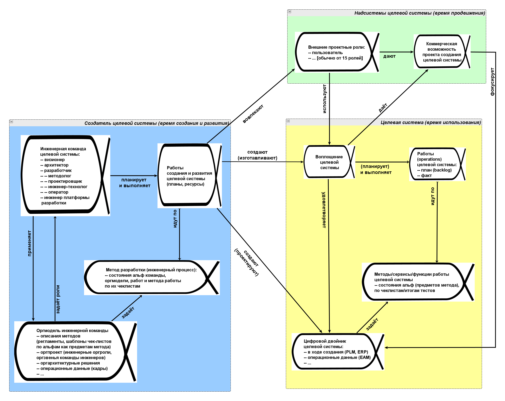

# Диаграмма системного описания графов создателей

Выполнение работ означает два факта:

* Собственно затрату ресурсов на преобразование рабочих продуктов. Вася проработал два часа, забил сто гвоздей.
* прохождение предметами метода в ходе выполнения метода предписанных состояний, в том числе заданных конечных состояний предметов метода. Сто гвоздей оказались забитыми по шляпку, результат достигнут.

Дальше мнение о том, что такое «выполненная работа» может разделяться, как мы знаем из весёлых школьных диалогов: «-- ты выучил уроки? — Я учил! — я понимаю, что учил, но выучил ли?» или из физики «-- я двигал шкаф, аж вспотел! — но сдвинул ли? — нет, но я двигал! — тогда работа равна нулю». Всё-таки об успехе выполнения работы мы судим не по факту затрат ресурса, прежде всего времени создателя с его инструментарием и каких-то расходных материалов, но по достижению ожидаемого состояния предметов метода. Урок должен быть «выучен», шкаф «передвинут».

Состояние предмета метода даётся причастием, которое означает временный признак предмета (в данном случае — предмета метода) в отличие от прилагательного, которое означает обычно постоянный признак. **Причастие** — это особая форма глагола, которая отвечает на вопрос прилагательного (какой? Какая? Какое?). Иногда это даётся как «особая форма глагола», иногда как «отглагольное прилагательное»[^r7-1]. Глагол тут — какая-то операция, применение метода к его предмету: «гвоздь забит» означает, что для гвоздя была выполнена работа по методу забивания. Причастия имеют разную форму, нас больше всего интересует **краткая форма страдательного залога прошедшего времени** («проверен», полная форма была бы «проверенный»), краткая форма изменяется по родам и числам[^r7-2]. К такому причастию (в отличие от прилагательного) можно задать и вопрос «каков?» и «что с ним сделано?» (с учётом числа и рода). Солнце жёлтое (с ним ничего не сделано), но Солнце закрыто (его закрыли). Вот нас интересуют результаты работ: состояние на конец какой-то работы, каких-то взаимодействий. Что-то сделать можно даже с Солнцем (например, закрыть его зонтиком или тентом).

С одной стороны, слова мало что означают — нас интересуют главным образом понятия. С другой стороны — у нас нет ничего, кроме слов, чтобы выражать эти понятия, размахивание руками и даже рисование картинок обычно не так много проясняет, какие именно понятия были использованы. Поэтому мы предельно внимательны к языку.

Тем самым получается, что для отслеживания выполнения работ надо отслеживать не просто состояния предмета работ (рабочих продуктов, например, в проектировании — проектной документации, в которой отражены какие-то проектные решения), но состояние предмета метода — например принятых проектных решений, предмет метода проектирования.

В руководстве по системному мышлению было введено понятие альфы как специального объекта, предназначенного для отслеживания состояний предмета метода. Особенностью альфы является то, что она игнорирует онтологический статус предмета метода. Скажем, альфа (воплощения) системы отслеживает состояния системы начиная с сырья, когда никакой системы ещё нет, но есть сырьё. Альфы служат для маршрутизации внимания в ходе отслеживания выполнения работ по их методу, они не отражают статическое онтологическое моделирование, когда каждый объект называется одинаково, независимо от его состояния по мере возможной сборки-разборки и даже прохождения проектирования как описаний «возможного будущего» (сама фраза «система существует в виде описания» формально-онтологически некорректна). Рассуждения об альфах поэтому полуформальны, моделирование альф тоже полуформально. Язык описания методов работ (по-другому — метод описания, задающий способ означкования для заданных типов понятий предметной области, viewpoint), основанный на альфах имеет уровень формальности **псевдокода/pseudocode**[^r7-3]. Псевдокод выражает какие-то алгоритмы (в том числе выражает алгоритмы через описание машины с конечным числом состояний, finite-state machine[^r7-4]) средствами, принятыми для описания алгоритмов, но итоговый записанный на псевдокоде алгоритм предназначен прежде всего для чтения человеком, но не для исполнения на классическом компьютере. Сейчас ситуация «чтения человеком» меняется довольно быстро, ибо чтение может быть и AI-агентом, задействующим большие языковые модели. Но в целом уровень формальности псевдокода меньше, чем уровень формальности классической алгоритмики или (помним об эквивалентности Curry-Howard) классической логики.

Итак, для того, чтобы отслеживать выполнение работ в проекте:

* Надо иметь метод описания состояний прежде всего предметов метода, например, использующий понятие альфы для моделирования этих изменяющихся состояний.
* Для коллективного отслеживания выполнения коллективных работ (все неприятности будут «на стыках» между исполнителями работ) необходимо вести записи состояний предметов метода. Современная коллективная собранность обеспечивается не «ментальным напряжением» работников, а использованием моделеров. Память о состоянии предметов работ (насколько движутся работы) и состоянии методов работ (о том, насколько успешны в достижении результата — это не про то, идут ли работы!) должна быть поддержана не столько «мозгом» работника, его кортексом, сколько экзокортексом — внешней памятью (необязательно компьютерной, но сегодня это чаще компьютерное моделирование). Надо иметь моделер для выбранного метода описания предметов метода.

Стандарт OMG Essence[^r7-5] предложил в качестве **метода описания**/viewpoint инженерных процессов (составляющих рабочих процессов) **язык**/language как набор понятий (онтологию, задающую типы моделируемых объектов) и средства графического и текстового «означкования» для записи моделей. Кроме языка моделирования в качестве примера для начала описания первые версии стандарта OMG Essence предложили также набор из семи **основных**/kernel (essence, существенный, основной, в самом стандарте эти семь альф названы kernel, но сам стандарт называется essence: «The kernel is a stripped-down, light-weight set of definitions that captures the essence of effective, scalable engineering in a practice independent way») **альф**проекта **программнойинженерии.** Есть в стандарте и другие типы основных объектов — основные области интересов, основные работы, основные компетентности. Но мы пока будем использовать только основные альфы. Последующие версии стандарта объявили этот стандарт более общим, приложимым к **системной инженерии** в целом. Этими семью альфами как основными объектами внимания к предметам методов разработки были: коммерческая возможность, проектные роли, требования, воплощение системы, работа создателя, команда создателя, метод (way of working) работы создателя.

Эти семь основных альф стандарт разложил в **основные**/kernel **области интереса**, в которых размещались тесно связанные основные альфы — это были области интересов заказчика (customer), предлагаемого проектного решения (solution, акцент на индивидуализированный результат «под ключ»), а также проекта/project (endeavor). Все остальные альфы (объекты пристального коллективного внимания) проекта предлагалось считать подальфами этих основных.

Этот набор семи основных альф был получен путём экспериментального ответа на вопрос: какие объекты внимания команды присутствуют в каждом проекте разработки? Было рассмотрено более 250 программистских проектов, и в основные альфы попали только те, которые встречались буквально в каждом проекте — это были работы примерно 2009-2014 годов в рамках инициативы SEMAT[^r7-6].

Но это было ещё до момента, когда из проектов программной инженерии ушли «требования», ещё до того момента, как была признана важность архитектуры в каждом проекте, да и само понятие архитектуры изменилось. В те времена не во всех проектах встречалась архитектура системы, но во всех проектах встречались требования — таким образом, в основные альфы изо всех описаний системы попали только требования, но не попала архитектура. А исходный код и вовсе отнесли не к описаниям системы (такой альфы и не было), а посчитали чуть ли не самой системой (легко спутать работающую программу и её исходный код, что и сделали разработчики стандарта). Увы, текущая версия стандарта (2.0 beta1 от июня 2024 года) сохраняет все эти основные альфы.

Стандарт предлагал брать его язык/language (который вводил сам тип «альфа» как меняющий свои состояния объект внимания в проекте), но проводить его адаптацию в части набора основных/kernel альф. Стандарт по факту продолжает линию языков описания «инженерных процессов»/«методов разработки» (а ранее — «моделей жизненного цикла»), которые развивались в рамках ситуационной инженерии методов. Более ранние стандарты ситуационной инженерии методов предлагали какие-то свои варианты языков/language для описания объектов внимания в проекте, но они были ориентированы на методологов (SPEM, ISO 24744). OMG Essense был более продвинутым стандартом, ибо его главное отличие было заявлено как ориентация не на «удобную запись моделей методов», но «простое чтение метода» людьми-разработчиками как его пользователями, а не «далёких от народа» методологов. Поэтому стандарт сделал шаг работы «за методологов» и команда стандарта выполнила первый шаг моделирования разработки — предложила пример моделирования типами языка/language стандарта каких-то основных/kernel объектов внимания, прежде всего это набор из семи основных/kernel альф. Это отличало стандарты первого поколения ситуационной инженерии методов (они предлагали только language) от OMG Essence как стандарта второго поколения (language и пример kernel, который можно в простых случаях брать как первое приближение к важнейшим объектам внимания в проекте, сразу можно было отслеживать их состояния — в первом поколении стандартов инженерии методов этого не было).

Разработчики стандарта предложили, что в каждом проекте будут потом просто добавлять к этим основным семи альфам в трёх основных/kernel областях интересов какие-то подальфы, которые будут отражать особенности каждого конкретного рабочего проекта, но для большинства проектов этих семи основных альф будет достаточно. Помним о коварном характере приставки «под-», каждый раз означающей что-то своё, и только для «подсистемы» обычно это отношение «часть-целое» — в случае «подальфы» это «под-» тоже коварно. Отношение между альфой и подальфой определяется весьма нестандартно, как «содействует продвижению состояния»: если продвинулось состояние подальфы, то считаем, что немного продвинулось состояние основной альфы.

С OMG Essence как стандартом моделирования инженерного процесса было проще работать: он «из коробки» уже что-то говорил не только про язык описания «метода разработки»/«инженерного процесса», но и про сам метод разработки: за какими именно альфами надо следить в проекте, какие состояния каких альф ожидать.

Но представления о лучшем на сегодняшний день (SoTA) типовом методе разработки поменялись, поэтому мы не можем оставить основные альфы из стандарта. Мы немного доработали[^r7-7] этот набор основных/kernel альф и областей интереса, сохранив язык/language стандарта ещё в 2015 году, для целей охвата проектов не только программной, но и «железной» системной инженерии. Это вполне предусмотрено и самим стандартом: в нём говорится, что можно оставить язык/language, но заменить основные понятия, предлагаемые на этом языке (kernel: конкретный набор альф из нескольких конкретных областей интереса, к которым предлагалось потом привязывать все остальные альфы как подальфы) на какие-то другие, более подходящие. Эта доработка оказалась удачной, но не окончательной. Дальше мы провели ещё несколько доработок основных альф и областей интереса — и представляем в нашем руководстве самый свежий вариант 2025 года, где повторяется для каждой из систем (целевой и её создателей, систем в окружении и их создателей) паттерн из четырёх основных альф: воплощения системы, описания системы, метода работы системы и работы системы.

**Вы тоже должны дорабатывать набор основных/kernel** **альф для вашего** **рабочего** **проекта (наставления** **нашего** **руководства** **тут только ориентир!), но использовать язык/language** **этого стандарта,** **то есть** **типы «альфа», «область интереса», «рабочий продукт»** **и другие типы тамошней мета-мета-модели.**

Основные альфы в стандарте было предложено считать связанными, это отражалось в диаграмме альф проекта разработки проекта, которую мы бы считали **диаграммой графа создателей**. Мы приведём её не для основных/kernel альф из стандарта, а для доработанного нами основного набора альф.

На этой упрощённой диаграмме мы видим три области интереса:

* **Область интереса надсистем,** главным образом там рассматривается **время продвижения**, «чтобы узнали и использовали — причём заплатили за это». «Время» тут рассматривается в контексте «непрерывного всего», означая время работ по созданию клиентуры как множества клиентов. Продвижение — это работы по маркетингу, рекламе, продажам: чтобы проект состоялся, надо найти клиентов, которые готовы оплатить создание и развитие системы, и дальше убедиться, что клиент доволен: созданная и развиваемая система успешна. В OMG Essence это примерно соответствует customer area of concern, обычно на диаграммах это закрашивается мятным (оттенок зелёного) цветом[^r7-8]. Один из предметов интереса в этой области интереса — «**внешние** **проектные** **роли»**::альфа (то, что это альфа — означает, что в проекте будет отслеживаться смена состояний внешних проектных ролей, причём там указано, что этих ролей будет от 15 разных, то есть отслеживаться будет не просто эта альфа, а ещё и от 15 подальф этой альфы). Ещё один предмет интереса — **«коммерческая** **возможность»**::альфа, это сама возможность выполнить проект безубыточно. Альфа коммерческой возможности будет включать в себя подальфы надсистемы и потребностей (потребности — это ожидания внешних проектных ролей в поведении надсистемы, поэтому потребность может быть подальфой и внешней проектной роли: продвижение потребностей к удовлетворению продвигает и коммерческую возможность к моменту получения прибыли от проекта, но также и внешнюю проектную роль к состоянию удовлетворённости в использовании целевой системы) Для возможности выполнения проекта важна ожидаемая от него прибыль (превышение дохода от проекта над затратами на него), это тоже подальфа возможности. Если не отслеживать в ходе всего проекта альфы зоны/области интересов надсистемы, то результаты проекта могут оказаться никому не нужными, проект не будет оплачен — возможность выполнения проекта может исчезнуть в любой момент времени проекта, внешние проектные роли в любой момент могут перестать поддерживать организацию проекта материально, «продукт у нас есть, но его никто не покупает». Благотворительные проекты, которые оплачивают сами агенты-члены команды инженеров? Пожалуйста, тут разговор идёт о ролях, а не об агентах. Но если они не довольны тем, что сами же делают — проект прекратится за отсутствием возможности, хотя эту возможность и трудно будет назвать «коммерческой». Но ресурсов для разработки не будет, или ресурсы будут, они будут потрачены, но кто-то понесёт убытки — и это вопрос этичности: можно ли считать проект успешным, если внешние проектные роли несут убытки, а команда проекта получает оплату за не нужную никому работу, «нерациональную работу» в проекте.
* **Область интереса целевой системы,** в OMG Essence это solution area of concern, на диаграмме обычно жёлтого цвета. Эта область интересов относится главным образом ко **времени использования**. Мы видим там основные альфы kernel какой-либо системы — самой **системы** (в данном случае — **целевой,** физический двойник), её **описания** (в данном случае — **цифровой двойник**, нас ведь особо интересует время использования/эксплуатации, поэтому важно, чтобы описание включало в себя описание времени использования — акцент понятия цифрового двойника как раз на этом, «описание не только проекта/design, но и времени использования»), затем **работа** системы и **функция/метод работы** системы. Это то, чем в организации проекта будут заниматься самые разные инженеры целевой системы: их задача получить 1. воплощение системы, которое соответствует 2. описанию и 3. работает по выбранному 4. методу. Вот это всё и будет важными объектами внимания в проекте, и вот эти четыре основные альфы потом будут повторяться в самых разных областях интереса (тут их на диаграмме всего три, но в более сложных графах создателей их будет много больше).
* **Область интересов создателя** относится к выполняющей проект организации, главным образом **во время создания системы,** в оригинальном OMG Essence это была область интересов Endeavor (предприятие, проект, начинание), на диаграммах обычно голубого цвета. Там те же наши четыре основные/kernel альфы, только система — это уже инженерная команда (система-создатель целевой), её описание — это оргмодель, метод работы системы — это «метод разработки»/«инженерный процесс», а работа — это работы создания и развития целевой системы (работы инженерного процесса). Внутри каждой альфы вы видите некоторые предложения по составу подальф.

Основных альф получается четыре для каждой системы (чётко видны две практически одинаково устроенных области интереса: целевой системы и создателя, хотя в области интереса надсистем диаграмма отходит от этого принципа, но там всегда можно выделить отдельные надсистемы и их создателей, которые потом можно так же отмоделировать четырьмя основными альфами):

* Воплощение системы, которое проходит состояния её создания и развития до состояния использования, где она производит какие-то работы какой-то функции/метода.
* Описание системы (проект/design — все необходимые для создания и развития системы модели), которое постепенно появляется в ходе создания и развития системы, а затем и в ходе использования/эксплуатации (в случае создаваемой системы это «и в ходе использования тоже» акцентируется термином «цифровой двойник»)
* Метод/функция работы системы в ходе её использования, уточняющий что там меняется из предметов метода, на базе какой теории/объяснений, какими инструментами. Метод, конечно, подчёркивает время использования (или использования созданной команды инженеров, или использования целевой системы).
* Работы системы в ходе её использования: планы работы или вычисляются по ходу дела, или тоже задаются в описании, но отдельная альфа работы подчёркивает переход от времени создания системы ко времени использования/эксплуатации. Помним, что воплощение системы в конечном итоге работает, а не только создаётся! Если целевая система — самолёт, то это работы самолёта, а не команды создателей самолёта. Если речь идёт о команде-создателе, то это работы команды создателей, а не «создателей создателя» (менеджмента, который создаёт команду инженеров).

Основных/kernel альф на диаграмме не четыре, а больше, ибо добавляются:

* Повторение основных четырёх альф по графу создателей, в случае примера диаграммы очень короткого (целевая система создаётся одним создателем — инженерной командой), из двух узлов: организация рабочего проекта создания и развития системы (то есть команда инженеров) создаёт объекты интересов целевой системы: саму систему и её описания. Эта команда-создатель (то, что это создатель целевой системы, отдельно указано в области интересов, которая выделена голубым цветом) воплощает/реализует (создаёт в физическом мире новую или каким-то образом дорабатывает состояние уже имеющейся в физическом мире) целевую систему (указана в области интересов, которая выделена жёлтым цветом). Часто создатель будет также и оператором созданной системы (появился даже слоган «ты это построил, ты и будешь это эксплуатировать, будешь оператором», **youbuildit,** **yourunit!**), работа команды инженеров не прекращается после создания. И ещё идут работы развития. Это повторение «мотива/паттерна из четырёх альф» легко продолжить в обе стороны (и после целевой системы, и перед командой — граф создателей может быть достаточно разветвлённый). Например, легко можно представить, что если целевой системой будет станок, то работы станка будут что-то там создавать в какой-то целевой системе клиента. В приведённом примере диаграммы (повторим, это только пример использования основных альф! Дальше мы покажем больше других примеров!) показано всего два повторения набора четырёх основных альф: для создаваемой целевой системы (жёлтый фон области интереса целевой системы) и для создателя целевой системы (голубой фон). Связаны альфы по большому счёту все со всеми (продвижение по состояниям всех альф зависит друг от друга), но для удобства чтения показаны подписанными стрелками только некоторые отношения как внутри отдельных областей интереса, так и за их пределами.
* Кроме того, у всех систем есть надсистемы. К области интересов надсистемы приписывается и надсистема целевой системы, и внешние проектные роли из графа создателей надсистемы. Область интереса надсистем выделена мятным цветом. В минимальной диаграмме она показана одна для целевой системы (относится к окружению целевой системы, для которого существуют потребности внешних проектных ролей, дающие коммерческую возможность проекта), поэтому и единственное число — «надсистема». Дальше можно рассматривать несколько разных областей интереса к разным надсистемам для разных систем из графа создателей (например, в графе создателей могут оказаться несколько оргзвеньев из крупных организаций, эти организации будут надсистемами для этих оргзвеньев).

Все альфы проекта тесно связаны отношениями, на диаграмме показаны отнюдь не все отношения — это просто напоминание о том, что связей много, и причины и следствия в проекте (как и в любой системе) могут быть существенно разнесены во времени и пространстве. Самих альф тоже много больше, чем основных. Для каждой альфы можно предложить многочисленные подальфы, о которых подробней будет рассказано позже. Какие-то подальфы предложены даже в маленькой диаграмме из примера, они указаны в коротких списках внутри основных альф. И помним, диаграмма показывает только два звена из большого графа создателей, а эти графы создателей обычно существенно больше (пять-шесть звеньев в цепочках создания в таком графе — это не предел).

Диаграмма графа создателей — просто чеклист для альф как объектов, для которых проводится отслеживание состояния в ходе всего проекта. Надо не забыть отслеживать состояние всех этих альф и подальф. «Не забыть» — это главное. **Графическое/диаграммное** **представление** **альф—** **не главное. Главное—** **это всегда помнить об этих** **альфах как важнейших** **объектах внимания и оценивать изменение** **их** **состояний.**

Состояния альф проекта (в «альфы» мы включаем как основные альфы, так и их подальфы, которые по типу — тоже альфы) нам нужны, чтобы в ходе выполнения проекта выбирать методы изменения этих состояний в нужную сторону, планируя затем работы по этим методам каким-то оргзвеньям. Но и после того, как работы запланированы (и это записано!), коллективную собранность не теряем, коллективное внимание участников проекта к альфам и их состояниям сохраняем — проверяем, какие работы закончились так, как и ожидалось, а что оказалось неожиданным. Так и продолжаем этот цикл «подумали, что сделать — сделали» в ходе всего рабочего проекта по созданию и развитию системы (и, конечно, это включает не только время создания, но и время использования системы, а также методологическое время).

[^r7-1]: <https://ru.wikipedia.org/wiki/Причастие_(лингвистика)>

[^r7-2]: <https://repetitor.1c.ru/russian/prichastie/>

[^r7-3]: <https://en.wikipedia.org/wiki/Pseudocode>

[^r7-4]: <https://en.wikipedia.org/wiki/Finite-state_machine>

[^r7-5]: <http://www.omg.org/spec/Essence/>

[^r7-6]: <https://en.wikipedia.org/wiki/SEMAT>

[^r7-7]: Towards a Systems Engineering Essence, <http://arxiv.org/abs/1502.00121>, опубликовано в краткой форме также в Software Engineering in the Systems Context, <https://www.amazon.com/Software-Engineering-Systems-Context-Jacobson/dp/1848901763>

[^r7-8]: <https://get-color.ru/code/3eb489>
