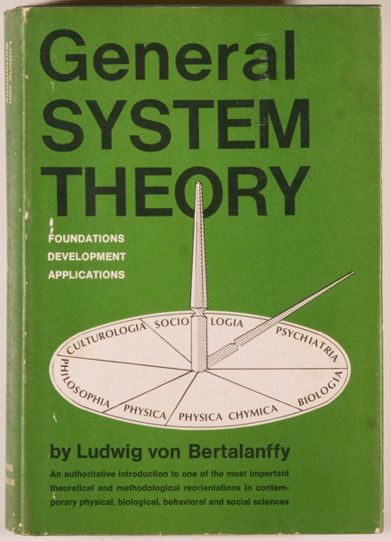
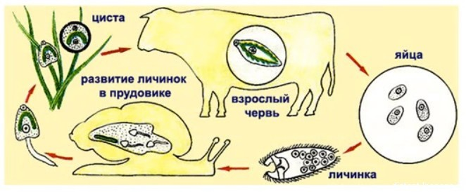

# Биологический жизненный цикл, нулевая версия

Поскольку системный подход поначалу развивался на примерах относительно простых физических, а затем (фон Берталанфи был биологом) сложных биологических систем, то часть его терминологии осталась с времён зарождения общей теории систем. Вот сборник работ фон Берталанфи, 1940-1968, это как раз про первое поколение системного подхода:

Так, биологи хотели найти подходы к обсуждению таких сложных объектов, как заливной луг со всеми его взаимосвязанными сотнями видов растений, животных и сменой времён года — а слов для этого обсуждения не было. Они эти слова придумали, например «жизненный цикл». Вот жизненный цикл печёночного сосальщика[^r7-1]:

Этот паразитический плоский червь проводит свою жизнь в разных состояниях (яйца, личинки, цисты, взрослого червя), проходя метаморфозы (полную перестройку своей внутренней структуры) за время своей жизни. При этом никто не замысливает и не проектирует систему червя, нет таких стадии в жизненном цикле биологического объекта, нет «замысливания» и «проектирования». «Проект/design червя» делала дарвиновская эволюция, она безлична и бесцельна. Никто также не изготавливает систему червя, полностью документированную в его ДНК в форме генома (геном очень условно можно считать «проектом/design» биологического организма): все эти стадии изготовления происходят без вмешательства человека, это и есть жизнь. А ещё всё повторяется, начиная с яиц червя. И там ещё в «изготовлении» участвуют и другие существа (крупный рогатый скот, прудовик), а не человек.

В инженерии/деятельности/практике как создании систем самого разного масштаба всё не так (если игнорировать время эволюции/развития систем как вида):

* **целевые системы сами не растут и не проходят метаморфозы**, их придумывают, проектируют, изготавливают, эксплуатируют, модернизируют, выводят из эксплуатации системы-создатели, то есть люди с их инструментами (средствами производства). Это означает, что в самих системах никакой жизни нет, **жизненный цикл оказывается не жизненным, системы создания ведут целевую систему по её циклу, а не она сама продвигается по своим состояниям**.
* **Целевые системы не несут яиц, не живородят, не размножаются вегетативно**.**Даже роботы не живородят, не формируют личинок и куколок, не проходят метаморфозов!** **Это означает, что жизненный цикл не замыкается, не повторяется. То есть это не цикл**.

Жизненный цикл оказался для неживых систем не жизненным и не циклом, но сам термин остался, причём он постепенно менял своё значение. Проблема в том, что многие из этих «исторических» значений используются до сих пор, наряду с современными значениями, и это создаёт путаницу при обсуждении проектов по созданию и модернизации самых разных систем.

Более того, даже для живых систем (бактерии в биореакторе, стадо коров на ферме, поле генно-модифицированной пшеницы, гектар леса) также применяется мышление про создателя (биоинженера, фермера, агронома, лесника) и его целевую систему, и то, как создатель создаёт свою целевую систему. Никто сегодня не предполагает, что есть жизненный цикл коровы, который она проходит самостоятельно без фермера, поколение за поколением живя в лесу. И лес — за ним присматривает лесник, если мы изменяем лес к лучшему.

Жизненный цикл по факту означает происходящее с одним организмом, то есть не включает обсуждение мутаций. Если включить в рассмотрение другой масштаб времени, эволюции, на котором обезьяны превратились в людей, а динозавры в птиц, то это уже не будут называть «жизненным циклом», а назовут **эволюцией/развитием**. Техно-эволюция/техно-развитие носит другую природу, нежели дарвиновская эволюция: основные знания об устройстве как целевой системы, так и создателя находятся не в самих этих системах (геном: совокупность наследственного материала), а в системах-создателях (мемом: совокупность материала с «проектной документацией», хотя тут тоже можно делить дальше на меметическую эволюцию человеческой культуры, где мемом хранится в книгах, мозгах и материальной культуре в форме «шаблонов вещей», и техническую эволюцию, где мемом именно в проектной документации, текстах технических стандартов, учебников инженерии). Мы редко будем рассматривать развитие живых систем в ходе дарвиновской эволюции, но часто будем рассматривать развитие систем в ходе техно-эволюции. Поэтому мы будем сокращать: не говорить «техно-развитие», а говорить просто «развитие», но в случае эволюции мы всё-таки будем частный случай техно-эволюции на основе проектируемого мемома называть именно техно-эволюцией, чтобы не путать её с дарвиновской биологической эволюцией на основе мутирующего генома.

[^r7-1]: Это знание входит сегодня в содержание ЕГЭ: <http://distant-lessons.ru/ploskie-chervi.html>
