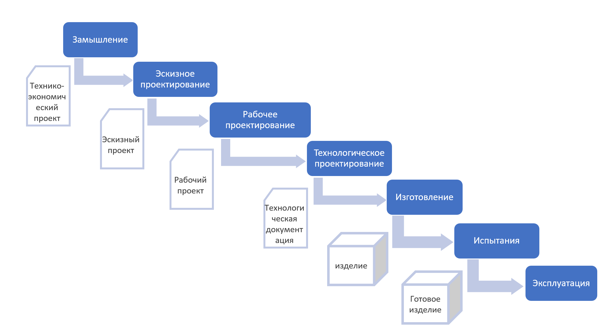
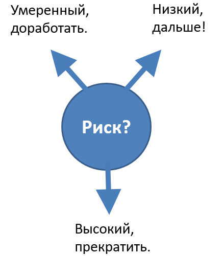

# Провал водопадной модели жизненного цикла

Недостаточность и ограниченность описания жизненного цикла как поведения создателей (view) через метод описания (viewpoint) последовательностей крупных работ как стадий жизненного цикла с каждым годом становилась очевидней. Назревала необходимость смены метода описания поведения создателей.

Во всё большем и большем числе проектов (начиная с айтишных проектов) признавали, что нельзя сделать никакого предварительного (up-front) планирования отдельных работ. Разработка (проектирование и конструирование, получение пробных экземпляров, налаживание производства) везде велась, как судебные дела, «непрерывно открывающимися обстоятельствами», и только массовое производство/изготовление можно хоть как-то было планировать, ибо к этому моменту уже было хотя бы известно, что производить, и какие нормы производительности хотя бы примерно существуют. А нормы мыслительной деятельности и количество порождённых и раскритикованных гипотез в ходе разработки — этого оценить нельзя. Инженеры на невозможности up-front/предварительного планирования и строго последовательного выполнения заведомо успешных мыслительных/**знаниевых работ (knowledgeworks)** настаивали, менеджерам это не нравилось, они требовали чётких планов, затем оценки инженеров по поводу планирования (гипотезы!) менеджеры объявляли обещаниями (помните бандитское «никто тебя за язык не тянул»? вот это как раз оно — превратить оценку в обещание) и далее выдавали оценки как безусловные требования к исполнению — но планы всё равно расходились с фактом. Фактическая жизнь в проектах шла одним образом, но в учебниках продолжали писать, «как надо»: планировать постадийную работу, да ещё и обязательно «сверху вниз», декомпозицией всех работ проекта!

Наборы различных типовых последовательностей работ получили название **моделижизненного** **цикла** (life cycle model[^r7-1], вид/форма жизненного цикла, модель тут как образец/шаблон/паттерн).

Модели жизненного цикла грубо можно разместить между двух крайностей:

1. Методы работы и работы-стадии совпадают и для их выражения хватает «колбаски» с интерфейсами между работами, названными по методам. Эта колбаска читается как квази-модульная диаграмма: по ней обсуждается «видимость» работ, как обычно в модульных диаграммах — нельзя из работ одной стадии затребовать ресурсы соседней стадии.
2. Методы работы и работы-стадии/фазы/этапы не совпадают и для их выражения нужны какие-то сложные представления для разложения методов. Это разложение методов даже внешне похоже на принципиальные схемы с их «логическим, а не физическим временем» и «потоками альф, меняющими по мере прохождения обработок состояния». Квази-модульные диаграммы пошаговых «колбасок» с их квази-интерфейсами тут никак не помогают.

Первый вид жизненного цикла (квинтэссенция подхода 1.0, «проектное управление с непересекающимися стадиями») получил название «**водопад»** (cascade, каскад). Работы каких-то методов (например, эскизное проектирование) жизненного цикла выполняются однократно, результирующие предметы этих работ (предметы работы называют обычно рабочие продукты, артефакты, а результирующие предметы работ — output) однократно и одномоментно передаются как input-ресурсы для следующих работ, и в теории считается, что больше к этим методам работы никакого возврата нет, ибо выполняются работы последующих этапов по последующим методам работы. Скажем, после выполнения работ по эскизному проектированию эскизный проект как их результат становится входным предметом работы для рабочего проектирования, и повторно эскизного проектирования уже в проекте не будет. **Водопад/каскад течёт всегда сверху вниз, назад возвратов нет!** Для более убедительной иллюстрации этого «невозвратного» хода работ традиционную «колбаску» начали рисовать как ступени настоящего водопада, но это всё та же «колбаска»:

Между стадиями осуществлялись действия по инженерным обоснованиям (проверки, приёмки, испытания, экспертные оценки) результатов предыдущих стадий, при этом **принималось решение о продолжении работ, возврате на доработку или прекращении работ** **по всей системе.** Эти инженерные обоснования с принятием решений между стадиями жизненного цикла для всей системы по итогам оценки рисков успешности проекта на разных стадиях его реализации получили название **гейтов** (gates, ворота — не путать с **milestones/вехами**, которые не связаны с решениями о прекращении всего проекта в целом и служат лишь для контроля скорости его прохождения. Ворота могут быть закрыты, а вот вехи просто отмечаем глазами на обочине). Вообще-то решений в гейтах обычно не два типа (go — no go), а три (доработать результат стадии и повторить гейт; переходить к следующей стадии; остановить проект):

То, что могут быть приняты решения о доработке, ничего не меняло: формально гейты понимались как экзамены после работы: их прохождение считалось принадлежащим предыдущей стадии жизненного цикла, поэтому это только говорилось, например, «эскизный проект вернули на доработку» — просто это означало, что стадия эскизного проектирования ещё не закончилась. А вот если уже гейт пройден, то всё — на доработку уже ничего не возвращалось.

Водопадная модель жизненного цикла оказалась для проектов с существенной долей работ с новыми для разработчиков видами систем полной утопией, она более-менее выполнялась лишь в проектах, где можно было накопить огромный опыт сборки/изготовления (но не проектирования, в проектировании как раз были сбои этой модели жизненного цикла) многочисленных очень похожих систем «из вещества» (там небольшая вариативность), например, гражданское (жилищное) блочное строительство. А вот какой-нибудь новый самолёт или даже турбокомпрессор в жизни так проектировать оказывалось нельзя, хотя во всех учебниках инженерии говорилось, что «только так и надо».

Особенно ярко это проявлялось в айтишных (как программная, так и компьютерная инженерия) проектах. После выполнения работ по любому виду инженерии (синоним метода работы!) «водопадного жизненного цикла», после всех гейтов с проверкой результатов всех стадий работ независимыми экспертами, после всех ожиданий, когда все рабочие продукты соберут по их состоянию готовности на конец стадии, всё равно при попытке работы с этими результатами предыдущих стадий находились ошибки и недоработки и приходилось выполнять повторно работу по методам предыдущих стадий жизненного цикла.

В те времена (60е-90е годы 20 века) типично было, например, указание на «инженерию требований»::метод в ходе стадии/фазы/этапа работ «формирование требований» — понятно, что разработанные требования говорили «какая обязана/должна быть система, чтобы быть успешной», и дальше ожидалось, что можно просто спроектировать и изготовить систему, соответствующую этим требованиям для гарантированной успешности. То, что в требованиях могут быть ошибки — так их же проверяли! То, что проверяющие сами могли чего-то не знать — это не обсуждалось. То, что в требования могло не попасть что-то важное, и поэтому проверяющие это не могли проверить — не обсуждалось. То, что требования могли устареть за время разработки и полностью соответствующая им система будет поэтому неуспешна — не рассматривалось. При этом «семеро одного ждут», например, если речь идёт о требованиях — то это будут абсолютно все требования, и если не готово даже какое-то второстепенное требование, то его будут ждать. Проекты шли безумно медленно, а поскольку всё время приходилось таки возвращаться к работам по методам предыдущих стадий, то стоимость работ тоже оказывалась постоянно в разы выше ожидаемой. «Как в учебниках» ни у кого водопадная модель жизненного цикла не работала. Впрочем, она и сейчас не работает: проблема была с самим таким подходом.

Требования постоянно оказывались не «долженствованием», а «мы чуток ошиблись, гипотеза не подтвердилась», «мы тут не уточнили, давайте сформулируем по-другому». Пробы и ошибки всё равно были, новые и новые переделки/reworks не позволяли хоть как-то соотносить запланированные стадии жизненного цикла и реально ведущиеся работы.

**Как образец/«типовой вариант»/концепция/модель жизненного цикла** **«водопад»** **оказался утопией, типа менеджерского философского камня или эликсира бессмертия: очень привлекательно, но абсолютно нереалистично, нереализуемо.**

**Проблема в том, что следование этой утопии в планировании и отслеживании планов во многих организациях происходит до сих пор! В договорах, планах и отчётах** **до сих пор можно найти** **именно** **«водопад»,** **а то, что в жизни всё совсем не так,** **никак не влияет на** **эти документы, поэтому они не отражают реальную жизнь.**

**Этаситуация известна как** **проблема «а чо такова?»**[^r7-2]**, то есть проблема непринятия всерьёз логичных рассуждений, игнорирование важности соответствия жизни и описаний жизни. Это всё равно как знать, что суеверия—** **плод фантазии, но всё-таки следовать им. «Водопад» оказывается утопичен, фантазиен, но всё-таки люди считают, что он хорошо описывает проект и дальше пытаются ему следовать.** **Почему? Ответ обычно—** **«он же прост! Не надо усложнять». Ну, 2\*2=3 тоже просто, но не работает. Но в этом случае почему-то ошибку исправляют, а в случае водопада—** **нет, менеджерам он выгоден, можно всегда обвинить инженеров в том, что они не справились.**

Использующим «водопадную» концепцию/модель жизненного цикла в своих проектах инженерам приходилось признавать, что с каждым инженерным методом приходится работать в ходе всего полного жизненного цикла. Те же самые «утверждённые требования», которые давно устарели, но до сих пор используются в «реальном секторе», который очень консервативно меняет свои методы работы, приходится менять по многу раз и на поздних стадиях проекта, иногда чуть ли не в момент окончания работ, чтобы получить приемлемые инженерные обоснования — особенно когда в момент старта работы заказчик задавал эти требования явно нереалистичными, а договор с этими требованиями подписывали «коммерсы»/продавцы с непрофильным образованием, даже не согласовывая с инженерами.

Работы по разным инженерным методам приходилось проводить независимо от «водопадной» модели жизненного цикла, каждый метод работ при этом оказывался задействован на всех стадиях водопада — как мы видели в горбатой диаграмме. Для этих работ приходилось выделять ресурсы, которые не были запланированы. И были неудобные работы, которые нельзя было отнести к какой-то стадии водопадного жизненного цикла: особенно ярко это проявлялось на примерах «управления работами»/«операционного менеджмента», «управления конфигурацией» и прочих «управлениях», которые требовали ресурсов для своего выполнения на всех стадиях «водопада», их принципиально непонятно было как выносить на какую-то обособленную во времени стадию — разве что декларировать наличие «перекрывающихся и параллельных стадий» (что, впрочем, тоже делалось) и приписывать эти «работы во всех стадиях» к этим «стадиям работ, длиной в целый проект», но это как раз было уже издевательством над самой идеей фаз/стадий/этапов. Это означало, что никаких этапов и нет вовсе!

Убеждение, что «мы утвердим очередной рабочий продукт, например, архитектурное решение, и больше никогда к нему не вернёмся», оказалось ложным. Нет, так не получалось — и стало очевидно, что так никогда и не получится.

Зародилась концепция «непрерывного всего», в которой декларировалось, что придётся постоянно работать над изменениями — да ещё и подразумевалось, что проект при этом никогда не кончится (несмотря на все подписанные контракты, «никакой контракт по проекту не является последним»).

Деление на стадии при принятой концепции «водопада» в жизненном цикле оказалось отражённым не столько на реальных работах (они идут как надо, а не как задокументировано в планах! Иначе они просто не будут сделаны!), сколько на договорной документации и официальных документах, которые должны быть подписаны — а затем идти в архив.

«Водопад» путает классических инженеров в части описания того, какими методами они работают, а менеджерам/«инженерам предприятия» даёт нереалистичные оценки как в части рациональной организации работ (оргпроект не показывает реалистично, как предметы работ проходят по оргзвеньям), так и в части операционного менеджмента (работы оказываются совсем не такими, какие можно ожидать, и происходят они в неожиданные моменты — предсказания модели «водопада» очень плохие). А затем лживый водопад, отражённый в официальной документации проекта оказывается очень удобным для наказаний — и инженеров, и (к их полному изумлению) менеджеров.

**Каждый раз, когда люди говорят** **«у нас принята водопадная модель» —** **это означает, что они думаютпро свой проект стадиями** **«колбаски»,** **а в жизни у них не-пойми-что, но только не эта** **«колбаска»** **с последовательным продвижением по стадиям.** Тем самым описание проекта сильно отличается от жизни, а это недопустимо, это само по себе вносит риск в проект!

Если у вас на чертежах собачья будка, а в жизни это получается скворечник — то к такому проекту/design будут вопросы. Но если на «чертежах» самого проекта (то есть в договорной документации, в отчётных документах — это и есть «проект/design проекта/project») «водопад», а в жизни получается какая-нибудь **спираль** **или что-то другое, лучше отражающее непрерывные изменения, цикличность/продолженность/непрерывность** **развития** **системы**, то принято делать понимающее выражение на лице и не менять ситуацию. По факту это означает, что люди с понимающим выражением лица готовы к наказанию невиновных, а растранжиривание ресурсов проекта их не волнует — это же не их ресурсы, «ничего нельзя сделать». Сделать можно: если модель системы не позволяет рассуждать о системе без ошибок, то модель меняют. Проектные описание должны всё-таки соответствовать как-то описанной системе, иначе зачем их делают? Если «водопадная модель жизненного цикла» не соответствует тому, какой получается проект, жизненный цикл (проводимые работы) оказываются не соответствующими модели, то надо выкидывать к чёрту водопадную модель, а также официальную проектную и договорную документацию, соответствующую этой модели жизненного цикла.

Менеджерам и особенно госчиновникам в военных проектах гейтовая схема была очень удобна, ибо она позволяла легко организовывать финансирование проектов, деля деньги по их стадиям. **Проектные управляющие до сих пор пользуются гейтовой схемой** **из** **«водопадной»** **модели** **как основным описанием** **для организации своей** **проектной** **работы.** **Страдают при этом не менеджеры, страдают инженеры-технари.**

Например, расчёты 1D-моделирования показывают, что необходимые характеристики системы принципиально не могут быть выполнены — и надо вернуться к концепции использования. Высказанные в ней гипотезы/догадки оказались опровергнуты (вспоминаем наставление по творческому мышлению из руководства по системному мышлению). Это не так трудно, но разработанная по «водопадной» модели жизненного цикла документация говорит, что нужна не концепция использования, а уложенные в архив требования — и вот «требования» (которые по определению не гипотеза) оказывается менять очень трудно. При этом у менеджеров финансирование работ на разработку требований уже закончено (они ж вроде уже разработаны!), концепция использования вообще не учтена, ибо в голове нет понимания, как устроены современные инженерные методы разработки, в которых требований не предусмотрено. Инженерам-технарям (или не технарям, а из других сфер деятельности, где они даже «инженерами» не называются — мы же рассматриваем общий случай) средства на доработку концепции использования поэтому не дают, «поезд ушёл».

Конечно, дорабатывать самые разные описания системы в жизни таки придётся, но это будут «формально неучтённые работы», на которые будут потрачены специально спрятанные хитрыми бухгалтерскими приёмами для подобных случаев деньги предыдущих этапов. В проектах с официально принятым «водопадом» в качестве модели/концепции жизненного цикла всегда будет наблюдаться управленческий хаос, существовать непримиримые конфликты менеджеров (инженеров организаций) и инженеров-технарей (прикладных инженеров целевой системы).

Утопичность «водопада с гейтами» в середине 80х годов 20 века уже всеми осознавалась, её надо было преодолевать содержательно: предлагать другие, более реалистичные концепции/модели жизненного цикла, позволяющие обсуждать многократное выполнение работ по каким-то методам, выбираемым «в силу открывающихся обстоятельств» (как в судебных делах: крутые повороты дела с каждой найденной уликой, с каждым подтверждённым алиби, захождение в тупики, нахождение новых свидетельств: это исследовательская деятельность по выдвижению догадок и их проверке, то есть творчество/«знаниевая работа»).

Нужны были концепции/модели жизненного цикла, позволяющие описать возможность выполнения работ по методам, логически ожидаемых в начале жизненного цикла, но по факту выполняемых в ходе всего проекта: это методы описания «чёрного ящика» (проектирование сценариев использования, концепции системы), работы по которым могут идти и при почти завершённом проекте, методы описания «прозрачного ящика», работы по которым могут идти и при едва начавшемся проекте (например, проверка реализуемости имеющимися конструктивами) и прочие ситуации с выдвижением догадок и их проверкой, многочисленными улучшениями отдельных частей системы в ходе развития системы. То, что казалось «нестандартным», «досадным отходом от нормального хода дел», оказалось как раз нормальным ходом дел, это и было «стандартным»! Водопад половину времени шёл вверх, ещё и прыгая через много ступенек вверх — и это нормально, так было везде! Это и надо отражать в планах работ, это надо как-то уметь финансировать, а не запрещать.

**Аналогия расследования преступлений, лечения болезней и выполнения изысканий (какая-нибудь «разведка», например, «разведка недр») с инженерной разработкой оказывается не случайна. Инженерная разработка—** **это тоже исследование того, как создать систему, как сделать её успешной на рынке и как удерживать это первенство на рынке много лет**. Возможно, для этого удержания на рынке надо будет существенно менять систему с каждой новой её версией. Например, в автомобилях от версии к версии заменяя аналоговое управление на множество цифровых контроллеров, а затем и двигатели внутреннего сгорания на электромоторы, а бензобаки на аккумуляторные батареи — при этом в какой-то момент новая система будет не похожа на предыдущую настолько, что текущее мастерство предприятия не сможет её выпускать. Так, когда-то Nokia могла отлично выпускать самые разные модели телефонов, но смартфон оказался слишком отличным от телефона — и проект по выпуску телефонов Nokia пришлось прекратить.

Границы проекта при этом не сводятся к изготовлению одного экземпляра или даже «малой серии» системы. «Не жизненный, но цикл» — при этом не гарантируется одинаковость каждого прохождения цикла, этот возврат к развитию/эволюции оказывается не так легко описать: надо описывать заранее неизвестное! Нельзя просто сказать, что «повторяем водопад много-много раз, после первого прохождения будет второе и так много раз»! Нет, нужна была не модель «множества водопадов по пути к цели».

В расследовании каждая новая открывшаяся улика может существенно изменить все последующие работы в расследовании. В инженерии новых систем так же: какой-нибудь инженерный расчёт может заставить существенно изменить ранее предложенную конструкцию, и это изменит и все запланированные ранее работы. Это только какие-нибудь стройки типовых зданий идут без неожиданностей, там всё можно запланировать заранее, накоплен огромный опыт, но уникальные здания и сооружения тоже мало поддаются планированию. Но беда в том, что дальше появятся новые конструкционные материалы, расчёт надо будет повторить, он даст другие результаты, конструкцию опять придётся менять! А потом поменяются методы монтажа, и всё опять придётся повторять — но с другими результатами. То есть вроде всё повторяется, но и не повторяется в части работ, повторяются методы, но даже и методы меняются.

[^r7-1]: слово «модель» тут используется в смысле обозначения группы похожих жизненных циклов, «модельного ряда», а не в смысле «упрощённого объекта, сохраняющего лишь важнейшие свойства моделируемого объекта», поэтому при переводе мы иногда будем использовать и термин «вид жизненного цикла».

[^r7-2]: <https://ailev.livejournal.com/1653635.html>
