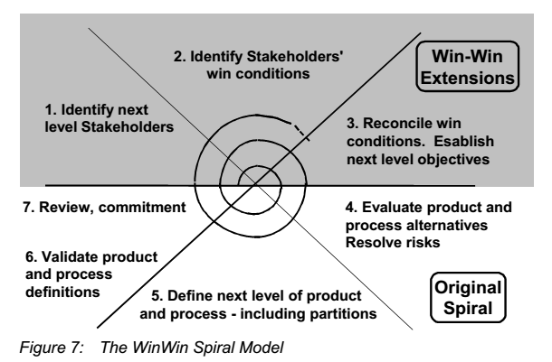
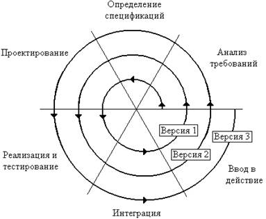

# Жизненный цикл 2.0: от стадий работ к методам разработки

Как ни крути, без описания методов/«инженерных практик» внятно описать, как же устроены работы, в проекте не получалось. Поэтому в 80х годах прошлого века была предпринята радикальная замена водопадной модели жизненного цикла с приматом описания последовательности работ-стадий (жизненный цикл как «план работ») на другую, больше похожую на функциональную модель — представление разложения методов создания и развития целевой системы. **Работы в этой** **новой** **модели учитывались как развёртка** **во времени** **применения** **агентами** **тех или иных** **методов инженерии, а сама линия времени как символ выделения ресурсов для** **выполнения работ по указанным методам** **была нарисована** **вместо** **линейного** **«водопада»** **как** **спираль.**

Этот **спиральный жизненный цикл**[^r7-1] был предложен Barry Boehm в 1978 году на примере айтишных проектов, успешно реализован им 1981 и опубликован 1988 году — задолго до появления «горбатой диаграммы» в RUP (напомним, она появилась в 1996 году, и тоже у айтишников — пелетон в инженерии растягивается на десяток-другой лет). Вот один из поздних вариантов изображения этой «спирали»:

На рисунке показан вариант спирального вида жизненного цикла 1989 года, когда уже невозможно было игнорировать тот факт, что в системный подход пришло понятие «проектных ролей»/stakeholders, и начали довольно плотно заниматься не только изменениями состояния самой целевой системы в ходе проекта, но и тем, что делают создатели — это пришло второе поколение системного подхода.

К методам работы, изменяющим состояние продукта (целевой системы), которые указаны на белом поле, добавились методы работы с проектными ролями, на диаграмме они показаны на сером фоне. Process definitions — это как раз описание/проектирование/definitions модели жизненного цикла, который стал называться **process/метод разработки**. Это добавляло путаницы: process понимался как просто «поведение» и дальше рандомно разные люди относили его то к методам разработки, то к работам.

Но всё-таки с годами акцент постепенно перемещался с работ на методы работ: их называли рабочими процессами, практиками, видами инженерии. Работы и практики плохо ещё различали, но от «пошаговых рабочих процессов» (последовательностей работ, пошагово представляемых как планы работ) стали переходить к «рабочим процессам», понимаемым уже функционально, как «метод работы».

**Мы в** **руководстве** **чаще говорим о «процессе разработки» как об общем методе инженерной работы в проекте (все методы выполняемой в проекте работы), а** **о** **«рабочем процессе»—** **как одном из частных методов в разложении «процесса разработки».**

В первом десятилетии 21 века «рабочий процесс» означал уже метод/практику/способ/культуру/технологию работы, хотя это ещё и было «смутное время» в плане онтологической природы «процесса». В «управлении процессами», крайне модном в тот период варианте методов управления работами, процессы описывали то работы (и шаги работ, привязанные к моментам времени и ресурсам), то методы этих работ (в том числе и разложения этих методов, не привязанные к моментам времени и ресурсам). В какой-то мере эта путаница со значением термина «процесс» идёт и сейчас. Но обратите внимание: по популярности управление процессами вроде как соперничало с управлением проектами, но управлением проектами занимались операционные менеджеры, за окончание проекта вовремя полагалась премия. А вот управлением процессами занимались айтишники и «службы качества», хотя гипотеза, что управление процессами как-то поднимает качество, в итоге не подтвердилась. Никаких премий за выполнение процесса не полагалось, но полагались штрафы за нарушение методов работы. По факту управление процессами оказалось «про методы», а не «про работы».

**Вы должны каждый раз при употреблении слова «процесс» пытаться понять: вам говорят о работах или о практиках! Важно, конечно, обсудить и практики, и работы (и многое другое).**

Работы в спиральной концепции/модели жизненного цикла представлялись как идущие по спирали задействования методов: на каждом витке спирали предполагалось, что в работах задействуются последовательно все методы инженерной работы (продукт как бы разрабатывается до конца на каком-то уровне детальности — такой вот «микроводопад», повторяющийся раз за разом над одними и теми же рабочими продуктами), после чего цикл повторяется много раз, пока продукт не будет окончательно готов. Так была отражена идея «итераций», подразумевающая многократное выполнение работ по каждому инженерному методу по ходу спирального жизненного цикла.

На каждой итерации разработчики что-то добавляли к функциональности системы, проводили новые испытания, что-то понимали в проекте новое, исправляли ошибки — каждый раз проводя очередную как бы полную разработку и изготовление системы, но не с самого нуля, а начиная с итогов предыдущей итерации. Начинать предполагалось с создания прототипа — версии системы с неполным функционалом (идеи MVP тогда ещё не было). Потом выяснилось, что в более чем половине проектов прототипа вполне хватает для начала эксплуатации (то есть по факту реализовывался MVP как прототип), а разработка более совершенной «производственной версии» не нужна. Что происходит после начала эксплуатации, разработчиков тогда интересовало мало — а ведь сейчас основное развитие системы обычно происходит как раз после MVP, после начала эксплуатации.

В момент предложения спиральной модели она была очень несовершенным вариантом модели жизненного цикла. Эта начальная «спираль» подразумевала много-много идущих подряд «водопадов» с последовательностью прототипов, это наследовало все недостатки водопадной модели. Список выбранных для этой модели жизненного цикла инженерных методов был отнюдь не полный для жизненного цикла от замысла до уничтожения уже использованного воплощения системы, а ограничивался испытаниями (эксплуатация и вывод из эксплуатации опускались).

Эти все недостатки не помешали спиральной модели считаться основой неутопических вариантов жизненного цикла, а главное ограничение, которое было потом снято — это строгая последовательность задействования ограниченного числа инженерных методов в спирали и разработка каждого нового прототипа с нуля. Но **остались идеи** **«постепенного улучшения системы через ряд версий, начиная с прототипа»** **и** **«многократного задействования** **методов инженерной работыво время всего проекта, а не в какое-то заранее заданное время».**

«Горбатая диаграмма» из RUP 1996 года как раз представляет собой гибридный вариант спиральной модели (выделены отдельно методы инженерии, введены «итерации» как повторения работ по всем методам инженерии) и водопадной модели (введена линейная ось времени, последовательные стадии жизненного цикла, хотя и признаётся, что на каждой стадии жизненного цикла будут работы всех инженерных методов, определяемых их дисциплинами).

Последний вариант спиральной модели жизненного цикла носит название «**модель пошагового спирального выделения ресурсов**» (Incremental Commitment Spiral Model). Эта модель жизненного цикла разрабатывалась Barry Boehm, Jo Ann Lane,‎ Supannika Koolmanojwong, Richard Turner в 2006-2014 годах как продолжение работ по развитию идей спирального вида жизненного цикла. Эта модель жизненного цикла используется в военных инженерных проектах США[^r7-2].

Вот один из типичных вариантов «спирали», в которой укрупнённые старинные инженерные практики/процессы/методы работы (в современном варианте не было бы, например, «анализа требований») раскладываются по линии времени:

Тут даже можно усмотреть идеи «непрерывного всего», если считать, что речь идёт о выпуске новых и новых версий системы как идеи развития системы, но можно долго критиковать такое изображение: методы инженерии показаны не столько как методы, сколько как работы «водопада», которые в нужной последовательности просто исполняются не для одной системы, а для последовательности версий. Вроде хотели уйти от водопада, но показали «водопад из водопадов».

Тем самым произошёл переход от

* «проектного» (версии 1.0) понимания жизненного цикла как цикла работ создателей. Это менеджерски-логистический взгляд на системы создания, ведущие работы с производством и потреблением ресурсов проекта в строго запланированное время. Акцент тут делается на своевременное выделение ресурсов и учёт рабочих продуктов, контроль выдаваемых обещаний и приёмок-сдач (координационные акты DEMO) к
* методологическому пониманию (версии 2.0), где на первый план выходит полноценная концепция жизненного цикла как представление метода разработки в его разложении на частные инженерные методы работы, но ещё и отражение работ, которые ведутся по этим методам.

**Сегодня чаще всего про** **«процесс разработки»/«инженерный** **процесс»/«создание и развитие системы» говорят вообще без использования термина «жизненный цикл», окончательно уходя от всех ассоциаций с «водопадом» и стадиями, а также уходя от всех этих «рождений» и «смертей» как указаний на однократность и конечность.**

«Инженерный процесс»/«процесс инженерии»/«engineering process» — предпочтительный термин. Термин «процесс разработки»/«development process» используется в двух значениях:

* Именно метод/процесс разработки как противопоставление другим методам из разложения полного инженерного метода (визионерство, архитектура, создание производственной платформы, подробнее будет в руководстве по системной инженерии).
* Полный метод/процесс инженерии, где разработка только один из методов в разложении. Это появилось как историческое название: когда-то инженеров интересовала главным образом только «разработка», даже без изготовления (хотя его важность признавалась — но всё-таки речь шла о разработке как проведении НИОКР — до получения работающего прототипа, который потом «шёл в серию»), и уж точно без эксплуатации и ликвидации. Но потом времена поменялись, и термин «разработка» остался — но в границы «разработки» попала практически вся инженерия, включая и эксплуатацию.

Инженеры целевой системы (прикладные инженеры) и инженеры организации создателя (то есть менеджеры, создающие команду прикладных инженеров) договариваются о методе/процессе инженерии:

* прикладные инженеры предлагают «по каким методам будем работать, чтобы целевая система была успешной»,
* менеджеры предлагают способы организации работы (создают и развивают оргвозможности для работы по предложенным методам, причём так, чтобы была успешна и система-создатель, то есть была успешна организация).

Инженеры и менеджеры должны договориться, явное моделирование инженерного процесса (ранее — концепция/модель жизненного цикла) нужно как раз для достижения этой договорённости.

Понятно, что инженерия фаянсового унитаза, посадочного лунного модуля, мастерства артиста кино, генномодифицированной кукурузы, транснационального холдинга — разные в части метода инженерии (или метода/процесса создания и развития этих систем, или концепций/моделей жизненного цикла этих систем, терминология тут может быть использована самая разная, в ходу термины самых разных поколений понимания того, как надо описывать методы работы по созданию и развитию систем, а также каким образом организованы работы по этим методам).

**Тем не менее, начинать любые** **договорённости о процессе создания и развития системы** **(то есть** **рассуждения** **о** **том, каким способом работают создатели в** **их** **графе)** **всегда** **нужно** **проводить согласно системной мантре:**

* **Начинать с целевой системы в её окружении во время** **эксплуатации как чёрного ящика** **(концепция использования, сценарии использования)**
* **Затем рассматривать** **«как работает», прозрачный ящик (функциональное моделирование прежде всего, 1D-моделирование)**
* **Затем рассматривать «из чего может быть сделано», надо найти конструктивы как аффордансы для функциональных объектов**
* **Затем надо рассматривать способ, которым это всё можно сделать, то есть метод инженерии, «инженерный процесс». В хорошем инженерном процессе предусмотрены и первые шаги по этой системной мантре.**
* **И только тут надо рассмотреть, какие роли должны выполнять этот инженерный процесс в его разложении на отдельные методы инженерии, кто мог бы исполнить эти роли** **и каков должен там быть граф создателей.**

**Набирать** **новых или перераспределять по проектам имеющихся сотрудников** **нужно только после того, как становится понятно,** **какими методами они должны работать, а также какого уровня мастерство у них для этого должно быть. Ответ на вопрос «какими методами они должны работать»—** **предмет прикладной методологии, а фундаментальная методология отвечает на вопрос о том, что можно ожидать от прикладной методологии, как представлять её методы.**

Инженерные процессы (процессы разработки, модели жизненного цикла) очень часто представляют суперупрощённо в форме функциональных диаграмм, где показаны потоки предметов инженерных методов. Время на этих диаграммах «логическое», функциональное, форма представления потоков работ и предметов метода произвольная. Но **всё чаще и чаще вместо подобных диаграмм производят табличное моделирование проекта, включающее прежде всего модели альф** **(предметов метода, функциональных объектов)** **с их состояниями—** **и дальше выходят на методы, которые двигают альфы от состояния к состоянию** **в их графе состояний (чаще всего там даже не сложный граф, а какая-то простая цепочка).**

Управление работами производят путём связи альфы с рабочими продуктами и кейсами, предметами которых будут рабочие продукты для этих альф. Кейсы отслеживаются в софте управления работами: управления кейсами/issue trackers, управления проектами, управления процессами, управления программами или просто в универсальных моделерах типа coda.io или notion.so, которые позволяют отмоделировать в том числе и метод инженерии. Подробней об управлении работами (операционный менеджмент) будет рассказано в руководстве по системному менеджменту. А вот как моделировать движение альф по их состояниям — предмет методологической работы, рассматривается в нашем руководстве. Прикладная методология заставит выбрать правильный метод, правильные предметы метода, состояния этих предметов метода. Но наше руководство по фундаментальной методологии расскажет, как это всё описать, а также какие ошибки не надо делать в ходе рационального выбора метода.

Часто на диаграммах инженерного процесса (жизненного цикла, метода разработки) приводят только методы работ. Эти диаграммы практически полностью будут функциональным описанием создателя системы как «прозрачного ящика», причём чаще всего без показа ролей, а только с показом функций/методов, выполняемых ролями и потоками предметов метода, проходящими обработки по этим методам. Гибридизация с представлением работ происходит сегодня много реже, ибо планирование работ в современных методах инженерии происходит «на лету», непонятно как показывать работы (разве что иногда показывают тип «работа/task» или «пакет работ»/ «work package»). Диаграммы работ не называют диаграммами инженерного процесса, процесса разработки, жизненного цикла, но называют диаграммами проектного управления (например, диаграммы Ганта[^r7-3]), верный признак диаграмм работ — там физическое время, а не «логическое».

Помним: в описаниях методов нельзя сказать, кто (агент) и когда (астрономическое время) что-то делает. Но можно сказать, с какими предметами что делается и какой ролью, хотя непонятно, кем и когда эта роль будет исполнена и даже непонятно, какой рабочий продукт или конструктив будет предметом метода. Думать про диаграммы с методами работы нужно как про **«принципиальные** **схемы** **организации», которыепоказывают поток альф через меняющие их состояние** **методы работы** **оргролей (и это в операционном менеджменте будет соответствовать протоку рабочих продуктов через меняющие их** **кейсы::работы оргзвеньев).**

[^r7-1]: <http://www.sei.cmu.edu/reports/00sr008.pdf> и сравнение авторами водопадной и спиральной модели через десяток лет от этого момента <https://resources.sei.cmu.edu/asset_files/SpecialReport/2000_003_001_13655.pdf>

[^r7-2]: <https://www.amazon.com/dp/0321808223/>

[^r7-3]: <https://ru.wikipedia.org/wiki/Диаграмма_Ганта>
