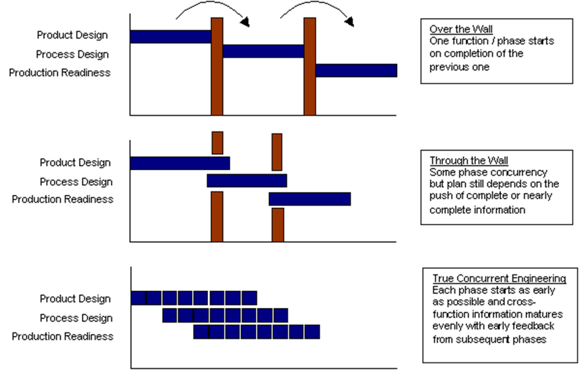
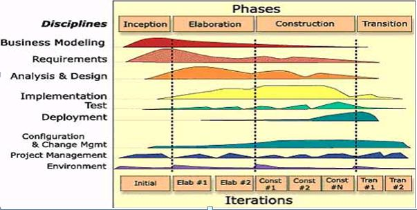

# Проблемы с жизненным циклом 1.0

Но не успело новое (по сравнению с жизненным циклом как сменой состояний целевой системы, из биологии, нулевая версия) понятие жизненного цикла (как поделённых на стадии работ создателей, первая версия) прижиться, как начались проблемы: **в реальных проектах по созданию систем массово** **начала вырождаться стадийность.**

Сначала в **agile**[^r7-1] (гибких) подходах к разработке софта появились не тематические по видам работ «стадии», а безымянные «итерации» какой-то фиксированной длины — и на этих итерациях было очень трудно отследить, какая же там преимущественная тематика работ, чтобы по ним назвать стадию/фазу/этап. По факту там в каждой итерации и замышляли кусочек системы, и разрабатывали её, и делали, и испытывали, и эксплуатировали, и вроде как понятно было, что всё это нужно обсуждать, но вот идея «стадия как время ведения каких-то одних видов работ, а потом другая стадия как время ведения других видов работ» не выжила. Тем самым и провалилась попытка назвать работы в их крупном делении по имени метода — скажем, «изготовление» отсылало к содержанию работ в стадии, а при переходе к итерациям — все признаки «этапа» были, а вот отсылки к преимущественным методам работ исчезли. Это похоже на то, как был «лакокрасочный цех», а потом там стали делать и сборку, и тестирование, и даже сварку — и пришлось назвать «цех №4», специфика метода работы исчезли. Так и тут — этапы/фазы/стадии стали номерными, их специфика исчезла, красивые картинки «типового жизненного цикла» перестали описывать жизнь.

Эпоха «водопада/каскада/cascade» как «последовательного прохождения стадий жизненного цикла, как вода течёт в водопадах всегда сверху вниз» закончилась даже до появления полноценной идеи «непрерывного развития», в которой множество линейных жизненных циклов и системы в целом, и её фич замыкались в изначальное «квазибиологическое» кольцо/цикл. Квазибиологическое кольцо, когда никакая версия системы не является последней — это всё-таки техно-эволюция, когда создатели делают всё новые и новые версии системы, но не система делает себя сама снова и снова как в дарвиновской биологической эволюции (в техноэволюции мутации не случайны, это smart mutations, а наследственный материал не реплицируется вместе с системой — он хранится где-нибудь в конструкторском бюро). Но это уже была эволюция, не «от рождения до смерти» даже с учётом проектирования, и даже не «круговерть рождений и смертей», как в биологической эволюции, а круговерть доработок системы — и доработок в замысливании, и доработок в разработке, и доработок в изготовлении — типичная инженерия из идеализированной greenfield («с нуля») инженерии превратилась в повсеместную brownfield (не с нуля, доработка уже имеющегося) инженерию.

Затем в строительных проектах появилась **параллельная инженерия** (concurrent engineering), в которой намеренно в параллель/одновременно выполнялись работы, ранее считавшиеся строго разнесёнными по разным последовательным «тематическим» стадиям жизненного цикла: одновременно велось и проектирование, и изготовление системы, а какие-то неполные версии системы ещё и начинали эксплуатировать (например, крыло недостроенного здания).

Тем самым в начале нулевых годов 21 века возникли вопросы к идее о том, что работы на стадиях жизненного цикла ведутся с каким-то определённым состоянием целевой системы и поэтому группируются по каким-то методам. Система разными своими частями находилась в разных состояниях, а все методы работ применялись одновременно к разным частям системы: если корабль красили, то не как раньше — сначала зачищали всю поверхность, потом всю её грунтовали, потом всю красили, всю сушили. Нет, чаще всего сначала зачищали кусочек, потом его грунтовали, и одновременно начинали зачищать следующий кусочек, потом первый кусочек красили, второй грунтовали, а третий начинали зачищать — и «сначала» и «потом» оказывалось сугубо локальным для кусочка, а не глобальным для всей целевой системы. Стадии «зачистки», «грунтовки», «покраски», «просушки» оказывались перекрывающимися во времени/параллельными/concurrent, то есть они перестали быть последовательными стадиями, группировкой последовательности работ! В этом месте программисты могут вспомнить, как соотносятся декларативные функциональные описания и выполняемые на компьютере с хорошим распараллеливанием в процессорных ядрах императивные команды машинного языка. Описание жизненного цикла в его первой версии выглядело как процедурное, «последовательность крупных шагов», но оказалось функциональным!

С одной стороны, последовательность работ как «крупных шагов общей пошаговой процедуры создания системы» (в том числе и шагов какого-то одного шага создания какой-то подсистемы, даже не начального шага) была всем очевидна (красить нельзя без грунтовки, грунтовать без очистки), а с другой стороны — нельзя было сказать, что «вот система в целом очищена, а теперь загрунтована, а теперь покрашена». Время для системы в целом при описании последовательности видов работ (это уже обсуждаем не ресурсы, а содержание! Функциональное рассмотрение, а не конструктивное! Виды работы — это прямая отсылка к методу/способу ведения работ! Внимательно следим за словами!) оказалось логическим/функциональным/содержательным (применяемым при рассуждениях о методах), а не физическим с секундами, минутами, часами, днями (применяемых в рассуждениях о работах). Сами работы — работы с материалами/конструктивами, а вот виды этих работ в части их содержания оказались чем-то другим, содержание работ и их «логическую» последовательность/взаимосвязь нужно было обсуждать другим способом, и объекты «видов работ» (это методы!) оказывались функциональными/ролевыми объектами — предметами методов.

Разговор о «стадийности» жизненного цикла всё больше и больше становился условным, а не сущностным/содержательным. Работы и ресурсы обсуждать было продуктивно (операционный менеджмент!), а вот стадийность работ — уже нет. И поэтому понятие жизненного цикла как набора стадий как «укрупнённых работ похожей направленности» стало не очень удобным в использовании.

Вот типичная картинка объяснения перехода к параллельной/concurrent инженерии (и на ней хорошо видно, что сроки всех работ по созданию системы при этом существенно сокращаются)[^r7-2]:

Вторая проблема понимания жизненного цикла как последовательности крупных «тематических» работ: передача предметов работ между работниками обсуждалась с точки зрения «потока работ»/workflow, операционного менеджмента, доступности ресурсов в проектном управлении. Результаты/выходы/output предыдущих работ становятся доступны для следующих работ как входы/input. Это было очень удобно, когда речь шла о точном ответе на вопросы стадии «как сделать работы в части задействования ресурсов»: «когда и кем будет выполняться работа, когда она будет закончена?». Но когда обсуждались функциональные вопросы (как вообще этот набор работ создаёт систему с нужными свойствами? Почему именно эти ресурсы, эти работы, а не какие-то другие?), то есть вопросы по методу/способу/технологии работ (а не как быстрее или с меньшим использованием ресурсов, то есть инженерный вопрос, а не операционно-менеджерский), то понятий не хватало. Нужно было обсуждение ещё и того, как и зачем менять содержательно набор работ (методологическое обсуждение, его не было в классическом проектном управлении), а не оптимизировать время запуска каждой предварительно известной откуда-то работы или оптимизировать ресурсное снабжение каждой предопределённой кем-то работы — информации категорически не хватало: нужна была информация о видах работ, назначении работ и их содержании, а не о самих работах и их ресурсах безотносительно их содержания. Нужно было вводить в обсуждение не только понятие работы (по каким-то методам, но явно это не обсуждалось), но и метода работы.

Представление жизненного цикла как работ в управлении проектами очень нравилось операционным менеджерам, а вот для инженеров целевой системы оказывалось недостаточным, как это обычно и бывает в системном подходе: область интересов инженеров отличалась от области интересов операционных менеджеров, занимавшихся ресурсами систем создания. Для планирования и ведения длинных последовательностей работ по созданию и развитию системы нужно было выходить на функциональное/ролевое представление производителей работ, то есть обсуждать не столько оргзвенья, сколько их роли и методы, которыми они ведут работы. Надо было отвечать не только «когда какие будут работать создатели», но ещё и на предыдущий вопрос «какими методами надо делать успешную систему, и какие для этого нужны будут создатели». Что именно делает создатель Вася Пупкин — всегда непонятно без понимания его текущей роли, а роль непонятна без рассмотрения метода работы, в том числе того, какие предметы метода будет менять задействование метода. Вася Пупкин своей «работой» играет роль Отелло? Принца Гамлета? Офелии? Видно, что Вася Пупкин занят, работает. Но что и зачем он делает?! Что делает та или иная работа для менеджера-проектировщика (который вроде как должен её запроектировать) непонятно, нужно смотреть на задаваемое прикладным инженером «содержание работы»/«способ работы»/метод/практику/«функциональную ипостась работы».

Рассмотрение поведения создателей в их графах не только как работ, но и как методов/функций, а создателей не только как конструктив-ресурсов, но и как оргролей/«проектных ролей» в рассмотрении жизненного цикла системы произошло не сразу. Создатели ведь были в проектном управлении прежде всего «ресурсами», конструктивами в выполняющей проект «организационной машине», они как функциональные объекты поэтому воспринимались только в прикладной методологии операционного менеджмента: как проводящие через себя потоки работ!

Создатели не рассматривались как системы, то есть как функциональные/ролевые объекты — с точки зрения их оргролей в графе создателей. «Оргроли» при этом — всё те же функциональные/ролевые объекты, которые воплощаются оргзвеньями. «Орг» просто подчёркивает, что речь идёт об организации, то есть существует договорённость о том, кто может просить агента-исполнителя роли выполнить работы этой роли. Проектная роль — тут подчёркивается, что речь идёт о проекте. **Оргроли, проектные роли, деятельностные роли, культурные роли, инженерные роли —** **это всё роли создателей, при этом отсылки уточнений этих «ролей» идут иногда к надсистемам (оргроль—** **роль в организации как надсистеме для роли-подсистемы), иногда к работам (проектная роль—** **роль, участвующая в работах проекта), иногда к синонимам метода (виды деятельности, культуры, инженерии—** **для деятельностной, культурной, инженерной роли).**

В любом варианте терминологии она указывает на функциональные/ролевые объекты, которые выполняют содержательные действия в организационной системе как системе создания целевой системы (включая весь граф создателей, если это оказывается нужным, и там может быть множество самых разных организаций). Об этой же оргсистеме говорилось и как о «системе ведения жизненного цикла целевой системы» (включая в неё все отдельные организации, которые появлялись там на разных стадиях жизненного цикла), а сейчас говорят как о «системе создания и развития целевой системы», то есть системе-создателе или даже просто создателе. Понятие «жизненного цикла» со всей его многозначностью сейчас исчезает, а «создание и развитие системы» понимаются и как работы создания и развития систем, и как методы создания и развития систем.

Переход к диаграммам с ролевыми объектами типа принципиальных/функциональных схем для систем создания произошёл постепенно (и помним, что во всех этих диаграммах было отражено не создание и последующее развитие/эволюция системы, а однократное прохождение «не жизненного не цикла» — это «отрезки», а не «кольца/циклы»).

После классических «колбасок» для стадий жизненного цикла поначалу появилось множество гибридных диаграмм, пытавшихся отразить сразу и конструктивную/логистическую и функциональную/назначения ипостаси жизненного цикла как и работ по методам и методов работ. И это не случайно: **ключевые/концептуальные** **решения по устройству жизненного цикла—** **это решения о том, какие** **методы создания и развития систем будут задействованы и дальше как эти методы будут** **задействованы** **в ходе работ.**

Это принятие решений по методам/способам верхнеуровневой росписи методов по работам (например, проектирование как метод работы будет только одной работой где-то ближе к началу проекта, или же оно будет длиться всё время проекта понемножку, даже и ближе к концу проекта тоже) стали называть **управлением жизненным циклом** (life cycle management, ср. work management/управление работами, а типовые решения на эту тему — **моделями жизненного цикла** (слово «модель» тут надо понимать в значении «образец для повторения»).

В управлении работами (операционном менеджменте) нет решений по методам работ создания и развития системы: не идёт речь о содержании работ, их технологии, то есть о методах/практиках/«видах инженерии», но только о длительности работ и потребных ресурсах безотносительно к «способу выполнения работ»/«way of working»/методу.

Одной из самых известных гибридных для управления жизненным циклом и управления работами диаграмм жизненного цикла является **горбатая диаграмма** (hump diagram) из методологии rational unified process (RUP)[^r7-3], она представляет собой спектр разложения интенсивности работ по шкале методов создания системы, при этом каждое значение объёма работ ещё раскрыто в отдельный спектр по времени ведения проекта:

В этой диаграмме 1996 года уже видно, что кроме безымянных «итераций» как групп работ, по-старинке разбитых на стадии/фазы во времени, появился новый тип объекта, метод, именованный по его теоретической инженерной или менеджерской **дисциплине** (discipline, теория, объяснения, алгоритмы, описывающие метод).

Метод работы и есть культурно-обусловленное функциональное/ролевое поведение создателей. Работы оргзвеньев задействуют методы работы культурно-обусловленных оргролей, а жизненный цикл состоит как раз из работ по этим методам/практикам, называемых по их дисциплинам, объясняющим работу с предметами метода всем наличным инструментарием создателя-в-роли.

Роли и методы неразлучны, всегда вместе, как любые объекты и их поведение. При этом напомним, что методы реально исполняются в жизни в ходе ведения работ по этим методам, а дисциплины/теории их описывают. Системный архитектор (роль) задействует методы системной архитектуры (поведение роли). Авиапредприятие (роль) выполняет методы строительства самолётов (поведение роли).

Не надо сочинять каждый раз роли и методы их работы «с нуля», надо брать их из культуры, большинство из них культурно-обусловлены, они определяются успешно реплицирующимися (и при этом эволюционирующими) мемомами этих методов. Если мемом хорошо распространён, то вместо «метод» часто говорят «культура». Скажем, колоть орехи микроскопом — это можно обсуждать как метод, культурой это не назовёшь. А вот колоть орехи даже и молотком — уже можно говорить о культуре, это довольно распространённая практика (практика — это тоже синоним метода!).

Если раньше культура свидания включала паттерн/шаблон «под часами» (хороший ориентир плюс возможность сверить время), то сейчас мобильная связь привела к тому, что этот паттерн не выжил — свидание назначается в приблизительно условленном месте в более-менее приблизительное время, а «точная встреча» уже корректируется с учётом доступной технологии (вчера ещё это был созвон голосом «по мобильнику», а сегодня это уточнение в чате в смартфоне). Культура свидания изменилась, эволюционировала. Культурная обусловленность:

* Включает общеизвестность мемома метода: если кто-то что-то как-то делает, то он вряд ли придумал свой метод сам. «Взял из воздуха» — это задействовал те мемы, которые у него уже были. Может быть, где-то уже есть мемы и получше, более современные. Но «изобрёл метод» — это крайне редкая ситуация, скорее всего вы изобрели какую-нибудь первую несовершенную версию метода, описанного ещё лет десять назад и сильно продвинувшуюся за это время. Но надо поинтересоваться (погуглить, спросить AI-ассистента), чтобы узнать о SoTA методе, узнать о его дисциплине.
* Привязана ко времени. Так, дисциплина Requirements (полностью — requirements engineering, причём engineering тут тоже синоним «метода»: указывается «вид инженерии») в диаграмме 1996 года была очень и очень современной, культурно-обусловленной, SoTA. А сейчас это воспринимается как анахронизм, привет из прошлого.

Как проверить культурную обусловленность? Обычно по культурно-обусловленным методам работы есть учебники, курсы, монографии, статьи, посты в блоге, регламенты, руководства, инструкции, корпуса знаний (body of knowledge). А если это кулибинство/«я сам придумал!»[^r7-4], то учебника/руководства обычно нет — и дальше вам принимать решение: учебника нет, потому как речь идёт о фронтире, и учебник не успели написать, или учебника нет, потому как этот кривой свежесочинённый метод работы отражать в учебнике ни в коем случае нельзя, или просто не знаем об учебнике (но он в реальности был, а как работать по этому методу мы подглядели у человека, который по этому учебнику учился. Но о том, что он учился по учебнику, мы даже не знаем. Ну, или даже там устная традиция, как в восточных единоборствах, «секреты мастерства» передаются из поколения в поколение только устно. В литературе это было во времена до книгопечатания: былины и эпосы, с методами всё то же самое). **Методология** **не учит, что делать в этом случае—** **понятно, что вы должны стратегировать (выбрать какой-то метод работы в ситуации, когда он вам вначале неизвестен), но методология** **заставляет** **удерживать во внимании** **методы** **работы и интересоваться их культурной обусловленностью, вы не можете уйти от осознанного выбора метода работы, осознанного стратегирования.**

Работы по методам, описанным разными дисциплинами на «горбатой диаграмме» как-то распределены по времени жизненного цикла в его начальном (1.0) представлении («жизненный цикл — это последовательность работ»). В RUP это работы по практикам организационного моделирования (business modeling, помним про перевод business как «организационный»), инженерии требований (уже устарела со времён популярности RUP), анализа и проектирования (анализ как отдельный метод работы не рассматривается, он включается в проектирование), разработки (границы этой практики определяются сейчас по-другому, ведь диаграмме около 30 лет!), испытаний (сегодня это инженерные обоснования, quality assurance), разворачивания (но вот delivering как «введение в эксплуатацию» в RUP нет, это не считалось трудозатратным — «акт подписать»), управления конфигурацией и изменениями, управления проектом, работы с окружением/environment. И это никак не закольцовано, хотя и выделены «порции работ по всем методам создания и развития вместе» как «итерации» — но это просто отражение «постепенного достижения конечного результата», а не получение сначала MVP (создание), а затем развитие, развитие, развитие, то есть не длительная эволюция без явного достижения заранее определённой цели. Нет, подразумевается, что «определили требования, повозились с проектированием и изготовлением, убедились, что удовлетворили начальные требования — всё, проекты жизненного цикла закончены, даже если этих проектов было несколько, всё развитие как продолжение работы над системами подобного класса — за рамками жизненного цикла».

Деление работ на стадии/фазы/этапы, а потом на более и более мелкие работы в классическом **разбиении** **работ** (work breakdown structure, WBS) относят к методам проектного управления, в то же время методология обсуждает разложение методов работы создателей (названные на «горбатой диаграмме» по их дисциплинам) как **разделение труда** (division of labor). Виды труда — это один из синонимов «метода».

Разделение труда на качественно различные виды не нужно путать с разделением/разбиением работ, которое обычно связано с количеством ресурсов, но не видами работ, то есть методами. **Разделение работ** обсуждает, как много работы можно разбить по ресурсам (например, если нужно выполнить однородную работу вдвое быстрее, то нужно поставить вдвое больше людей, или использовать станок с большей производительностью), а вот **разделение труда** обсуждает, как более общий метод для одного исполнителя с одной ролью разложить на частные методы, у которых в качестве их исполнителей возможны разные агенты, которые получат разные роли как подроли общей роли для выполнения более общего метода. Помним, что разбиение ролей на подроли — это функциональное разбиение/декомпозиция, или функциональный синтез, если говорить об объединении подролей в роли. По факту роли тут — это системы-создатели и их под-системы, то есть два агента вполне могут выступать как система, если они выполняют общую роль с частными их подролями. Скажем, два агента танцуют вместе как «танцевальная пара», каждый из них при этом будет подсистемой — лидером и фолловером соответственно, ведущим и ведомым, и это не гендерные роли «партнёр» и «партнёрша», это танцевальные роли! Роли — это системы в их функциональном рассмотрении! Другое дело, что эти системы не существуют, пока их не воплощают какие-нибудь конструктивы, материальные объекты.

В ходе разделения труда мы имеем ситуацию, когда исполнитель частного метода может увеличить степень своего мастерства, ибо он не должен тратить время на выполнение всего общего метода и может достичь степеней мастерства выше, чем по начальному общему методу без разделения труда. А если мастерство выше — то ошибок меньше, если меньше ошибок — меньше переделок уже сделанного, если меньше переделок — скорость выполнения проектов выше. Это означает, что даже если методы задействуются не параллельно (то есть при разделении труда все исполнители методов из разложения этого общего вида труда трудятся одновременно), а последовательно (исполнители методов работы работают один за другим), общее время работы будет сильно сокращено. Запоминаем причинно-следственную цепочку:

* выше мастерство — меньше новичковых ошибок,
* меньше ошибок — меньше надо их исправлять, что-то переделывать,
* меньше время переделок — меньше время выполнения проекта.

Врач раньше занимался всеми дисциплинами, а потом прошло глубокое разделение врачебного труда, и врач-гинеколог начинает существенно отличаться по своим методам работы от врача-дантиста. Он не так хорошо лечит зубы, но и дантист не так хорош в гинекологии. Веб-мастер занимался всеми работами по небольшому вебсайту, а потом прошло глубокое разделение труда, и этими же работами занимаются программист бэк-энда, программист фронт-энда, дизайнер, контент-менеджер, редактор и ещё много других деятельностных ролей. Инженер раньше был «просто инженер», а сегодня без уточнения того, какой именно это инженер, сказать ничего нельзя. И так со всеми методами создания и развития систем. Там, где был один учебник одной дисциплины, появляется десять учебников по десяти дисциплинам, разложение методов происходит глубже и глубже.

**Работы—** **это про количество работы** **для имеющихся ресурсов** **и её скорость, а** **методы/практики/стили работы (виды труда, инженерии, деятельности)—** **это про** **назначение и** **разнообразие** **способов** **работы** **задействованных в проекте ролей** **и их уместность/полезность/назначение** **в проекте.** **Что нужно? Нужно и одно, и другое!**

На горбатой диаграмме в строчке каждого метода работы показано, что интенсивность работ по этим методам разная в разные моменты жизненного цикла (и это будет отражаться также и в ходе закольцовывания такой диаграммы или разбития её на поддиаграммы для множества команд, занимающихся развитием тех или иных фич системы в ходе её развития/эволюции, а не только однократного проектирования-изготовления-использования, как это подразумевается оригинальной линейной диаграммой): агенты, специализирующиеся на выполнении методов работы в разных ролях то больше, то меньше задействованы для выполнения работ жизненного цикла по мере прохождения проекта. Тем самым на графике зависимости интенсивности работ от времени появляются «горбы» максимального количества работ по каким-то методам, отсюда и название «горбатая диаграмма». Это важно, что в «колбасках» водопадных методов считалось, что никаких работ, например, по проектированию, нет за пределами времени прохождения этих работ как стадии/фазы/этапа проекта. А в горбатой диаграмме впервые было признано, что кроме собственно «горба» в разложении работ по времени, работы по всем методам проходят в самое разное время проекта, какие-то работы по проектированию могут быть и далеко за пределами прохождения основной массы этих работ, за пределами «горба».

Конечно, работы — это взаимодействующие продукты/агенты/конструктивы::ресурсы, участвующие в выполнении действий какого-то метода работы из жизненного цикла. Но все эти работы мы представляем ещё и как набор паттернов/шаблонов такого взаимодействия — и это будет рассмотрение уже не собственно работ, а метода работ. Метод работ и работы по методу неразделимы, ибо 4D экстенсионализм не разделяет конструктивы, проводящие работы и роли, задействующие методы — это одни и те же места в пространстве-времени, значит это одни и те же объекты, просто они рассматриваются в их разных аспектах.

В 21 веке описания жизненного цикла перестали обсуждаться как описания только большой работы по созданию системы, поделённый на стадии/фазы/этапы. Эти описания включили в себя и методы: основные (не все! Описания жизненного цикла обычно делаются на уровне разделения по методам работы основных культурно-обусловленных проектных ролей, глубокого разложения методов работы они не подразумевают). Концепция создателя::система как концепция системы — это не только функциональная/ролевая декомпозиция ролей как подсистем создателя, но и разложение/синтез методов (стратегирование: определение их методов работы), как вам удобней говорить, синтез или разложение, а ещё не только конструктивный/продуктный/модульный синтез организации в её конструктивном разбиении на оргзвенья, но и декомпозиция/синтез работ, тоже уж как удобно говорить — о разбиении работ или синтезе работ, одно и то же дерево можно описывать как сверху вниз (разбиение, «деревья» графов растут обычно корнями вверх) или снизу вверх (синтез).

**Упоминание жизненного** **цикла (линейного однократного «не цикла» или** **даже** **включающего развитие/эволюцию системы** **«цикла, хотя и без размножения»)—** **это** **указание на рассмотрение методов работ и самих работ систем-создателей (одной или множества, с учётом графа создателей, или только небольшой его части).** **Для полноценного системного рассмотрения создателей нужны и оргроли** **с оргзвеньями, и их методы работы с работами по этим методам. А дальше всё равно потребуются размещения и стоимость, а также многие другие описания.**

Переход к горбатой диаграмме был важен. С ней при создании скворечника рассматривались бы плотницкие методы работы, выполняемые плотником::роль, реализованные плотницкими работами, выполняемыми Фадеем::оргзвено. Но всего несколько лет в жизненном цикле (или по-другому — «проекте» из проектного управления) рассматривались бы работы Фадея::оргзвено, и неважно по каким методам (плотницкие методы подразумевались, но явно не обсуждались, это было на усмотрении самого Фадея). Сегодня понятие «жизненного цикла скворечника» было бы размыто, и больше бы говорили про программу создания и развития скворечника — ибо ожидались бы какие-то непрерывные улучшения в конструкции и материалах скворечника, способах и масштабах его изготовления, и ещё бы в рассмотрение попало не просто рассмотрение плотницких методов, но и мастерство агента, который должен будет выполнять роль плотника. Дальше можно было бы обсуждать: поручать пилить доски и сколачивать скворечник Фадею или Фоме, какой уровень мастерства в каком методе от них ожидается, какой им нужен будет инструментарий.

Жизненный цикл атомной станции на сегодня рассматривается как набор методов (набор рабочих процессов, ибо это же синонимы!) замысливания, проектирования, сооружения, эксплуатации, модернизации (увы, мы тут не можем говорить о развитии — отрасль серьёзно зарегулирована), ликвидации, реализуемый работами, выполняемыми проектными, строительными, монтажными, эксплуатирующими организациями в самых разных организационных ролях: основателя компании, линейного/операционного менеджера, инженера в целевой предметной области. А всего несколько лет назад обсуждались бы прежде всего работы как «стадии», а не методы этих работ, «рабочие процессы».

Жёсткие условия госрегулирования делают очень трудным разговор о развитии/эволюции атомной станции, поэтому вопрос развития даже не ставится: «модернизация» по факту идёт только как «продление срока службы энергоблоков» (по факту это ремонт, а не улучшение со smart mutations в проекте/design атомной станции) — именно так понимается «управление жизненным циклом» на объектах атомной энергетики. В любом случае, обсуждаются (инженерами АЭС) по линии управления жизненным циклом прежде всего методы работы в форме рабочих процессов, а не наборы работ в форме, например, планов работ — работы обсуждаются по линии операционного менеджмента, управления работами. При этом, конечно, разделение труда и разделение работ согласовываются между собой, рабочие процессы и работы по ним тоже согласовываются. Это всё просто два (функциональный и конструктивный) взгляда на одно и то же — поведение каких-то объектов в реальном мире.

Обсуждение методов при этом первично: если не знаешь, как ты будешь работать, то ничего про саму работу сказать нельзя. Скрепить две детали — каким методом надо будет работать? Если не знаешь, сварка это, проклейка, болтовое соединение — ничего сказать про работу нельзя, в том числе нельзя выбрать работника, ибо от работника потребуется какое-то определённое мастерство, а мастерство определяется владением дисциплиной/теорией/алгоритмом метода работы. Поэтому метод работы и роли обсуждаются всегда логически сначала, а работа и ресурсы для неё (оргзвенья) всегда логически потом, хотя в реальном течении времени они итеративно утрясаются так, чтобы удовлетворять условиям доступности ресурсов в проекте, экономической эффективности и прочим орг-архитектурным характеристикам, которые должны быть удовлетворены создателями.

Жизненный цикл даже энергоблока АЭС — это разговор не про саму АЭС и её характеристики, это разговор про создателей АЭС (проектные и строительные организации, поставщики оборудования и прочие организации из графа создателей АЭС) и орг-архитектуру этой организации создателей (которые ещё и создают и развивают друг друга, там ведь отношение создания и развития в графе создателей).

Cоздатель АЭС — это набор связанных разными видами соглашений организаций, так называемое расширенное предприятие, extended enterprise, поэтому говорим не просто про архитектуру, а организационную архитектуру.

**Создатели** **имеют** **свои** **первичные названия,как и любые системы—** **по основной** **их роли, а роли—** **по выполняемым** **функциям/методам работы, а функции/методы работы называются по их дисциплинам/теории/объяснениям.** Вопрос именования систем подробно разбирался в руководстве по системному мышлению. Парикмахерская выполняет работы своего сервиса (это синоним метода! Только над чужими системами) как оргзвено::ресурс (например, как частный парикмахер Ольга, как предприятие ООО «Причешем», или подразделение холдинга Всёрежьчешиукладка), но метод своей работы «стрижка и укладка» выполняет как «парикмахер»::оргроль. Сам термин «парикмахерская» (или барбершоп) тут — просто обозначение места работы парикмахеров[^r7-5]. Какие методы работы будут у парикмахера? Что можно сказать про разложение метода, которое они используют? Разложение метода зависит от предмета метода, например, речь идёт о методах работы с мужскими волосами (например, стрижка бороды и усов) или методах работы с женскими волосами. В зависимости от этого выбираем агентов-парикмахеров с необходимой степенью мастерства в разных методах парикмахерских работ.

В оргроли может быть не только человек (на сегодня это самое маленькое оргзвено, агенты сегодня главным образом люди, но думаем и о системах AI), но и на оргроль можно назначить любое другое оргзвено из группы людей и их инструментария.

Главное тут не впадать в сверхобобщение: оргроль «клиника» или ещё более обобщённое «лечебное заведение» обычно не даёт возможности содержательно обсуждать методы лечения. «Лечебное заведение»::оргроль выполняет слишком много методов работы для своих пациентов::«целевые системы», и на самых разных системных уровнях этих пациентов. Лучше бы такие «сверхроли» сразу дробить до ролей с более-менее понятными и обозримыми методами работы, которые мог бы выполнять отдельный человек как оргзвено. Проектные роли не «клиника», а «врач», «техник медицинской аппаратуры», бухгалтер. Ещё лучше — не «врач», а «гинеколог» и «дантист». Все рекомендации «Системного мышления» по выявлению и именованию систем надо соблюдать и с оргролями (они тоже функциональные части, только систем создания!), а не только с функциональными частями целевых систем: адрес предмета обсуждения лучше бы давать точно, без «на деревню дедушке Константину Макарычу».

А оргзвено? Для каждой более мелкой роли будет обычно более мелкое оргзвено — концепция системы (в данном случае концепция создателя и даже более точно — концепция организации организации) расскажет, какие оргзвенья воплощают какие роли, то есть назначены на какие виды/методы работ:

* для клиники — предприятие (клиника::роль, предприятие::оргзвено);
* для врача — не слишком понятно, что, в силу общности роли в плане разнообразия методов работы (и это должно напрягать: модульный синтез для «врача» будет трудным);
* для гинеколога — человек, «обладающий мастерством в»/«знающий дисциплину и управляющийся с инструментарием»/практикующий гинекологию::метод, занимающий позицию в штатном расписании и распоряжающийся в силу этого необходимыми для его работы инструментами. Это описано оргзвено размером с одного человека.

Является ли сообщество, или общество, или даже человечество оргзвеном? Вряд ли: «орг» тут означает организованность, то есть известность всем тех агентов, которые распоряжаются ресурсами оргзвена. С натяжкой можно говорить, что в социалистических диктатурах всеми ресурсами понятно кто распоряжается (диктатор, и дальше идёт какое-то делегирование полномочий диктатора «на места»), но это на больших масштабах оказывается крайне неэффективным в части распределения труда. Потребности людей в масштабах общества учесть невозможно, организовать (наладить систему поручений что-то делать) труд так, чтобы число производимых шнурков как-то билось с числом производимых ботинок оказывается в масштабах общества нерешаемой задачей (до сих пор калькуляционный аргумент Мизеса, который это формулирует, не опровергнут — и никакой рост возможностей вычислительной техники эти рассуждения не опровергает[^r7-6]). Так что в нашем руководстве мы ограничиваемся оргзвеньями минимально как отдельными личностями (существа как оргзвенья не подойдут, кошечек и слонов не организуешь, у компьютеров достаточного уровня интеллекта ждём), а максимально как компаниями/организациями и даже расширенными организациями (независимые фирмы, связанные договорами для создания каких-то сверхкрупных объектов, например, атомной электростанции) со всеми их компьютерами, станками и другими инструментами.

В системном менеджменте не ограничиваются обсуждением только мастерством оргзвена в проведении работ по какому-то методу. Сегодня там большое внимание уделяют понятию **оргвозможности/capability** для указания ресурсной доступности выполнения работ какими-то способами/методами. Нужно не только иметь все ресурсы (инструменты, мастерство, какие-то расходные материалы) для выполнения работ по методу, но и иметь полномочия по распоряжению ресурсами, нужными для выполнения этих работ. По большому счёту, в системном менеджменте интересует не «теоретическая возможность выполнения работы» (все люди обучены и имеют мастерство необходимой степени, оборудование настроено, материалы есть — **«рабочий процесс** **поставлен»,** рабочий процесс тут — синоним метода), а реальная организационная возможность (рабочий процесс поставлен, ресурсы есть, плюс выдано полномочие работать по этому процессу, тратить на это ресурсы).

Переход от состояния организации «рабочий процесс поставлен, по идее можно работать» до «а вот теперь и правда можно работать» может занимать много лет, это иногда квалифицируют как «отсутствие политической воли». Вы можете уметь пользоваться новейшим гвоздезабивальным автоматом, и этот автомат может быть уже закуплен и развёрнут, и закуплен запас специальных гвоздей для этого автомата, но команды им пользоваться не будет, не будет проявлена та самая «политическая воля» — и вы будете забивать обычные гвозди камнем или микроскопом. Молотка у вас тоже не будет, ибо «мы же только что купили гвоздезабивальный автомат! Он полностью заменяет молоток, и даже лучше!». Вот это типичная для организационного менеджмента ситуация, в которой мы должны отличать метод работы («как это обычно делается», описана в учебнике, уровень метаУ-модели) от рабочего процесса (тот же метод работы, но уже не как в учебнике, а как вы собираетесь работать в условиях вашего предприятия, уровень метаС-модели, «ситуационный метод работы», в текущей ситуации, а не «из учебника»), от оргвозможности («как мы это будем делать у нас в проекте», только то, что разрешено, при этом ещё и помним, что «власть не дают — её берут», и тут неявно мы затрагиваем вопрос об агентности оргзвеньев, их настроенности на изменение ситуации).

Повторим: когда мы говорим об оргзвене и рабочих процессах, чаще всего мы говорим об оргвозможности — то есть это не «оргзвено, которое просто есть», а «оргзвено, которое вполне способно выполнять работы согласно оргроли, на которую его назначили, то есть вести работы/сервис по указанному рабочему процессу, и имеет для этого не только мастерство, инструменты и материалы, но ещё и полномочия». **Как сделать так, чтобы появилась оргвозможность—** **это рассказывается в** **руководстве по системному** **менеджменту, появление новых оргвозможностей—** **это и есть организационное развитие.**

[^r7-1]: <https://ru.wikipedia.org/wiki/Гибкая_методология_разработки>

[^r7-2]: <https://www.isene.se/pppp/>

[^r7-3]: <https://en.wikipedia.org/wiki/Rational_Unified_Process>

[^r7-4]: <https://vk.com/club45696675>

[^r7-5]: <https://ru.wikipedia.org/wiki/Парикмахерская>

[^r7-6]: <https://ru.wikipedia.org/wiki/Калькуляционный_аргумент>
