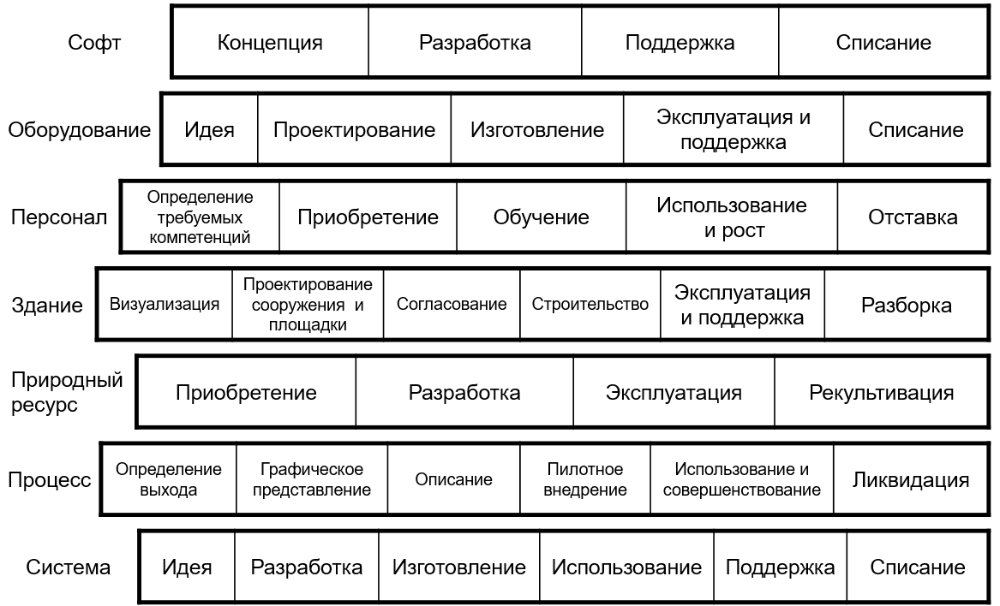
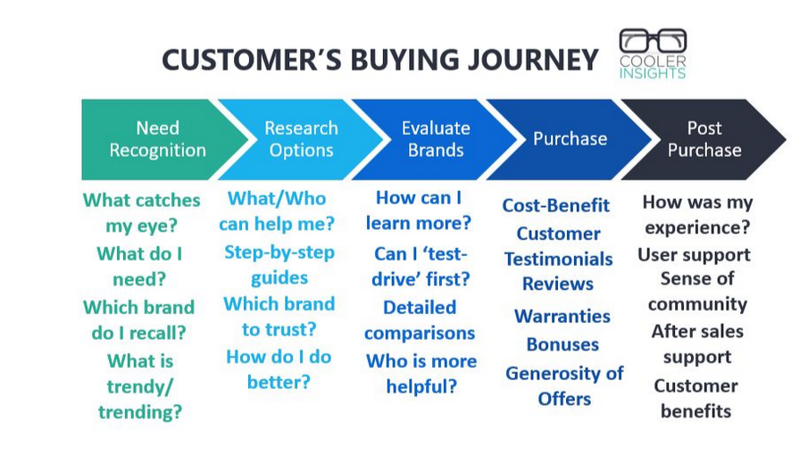
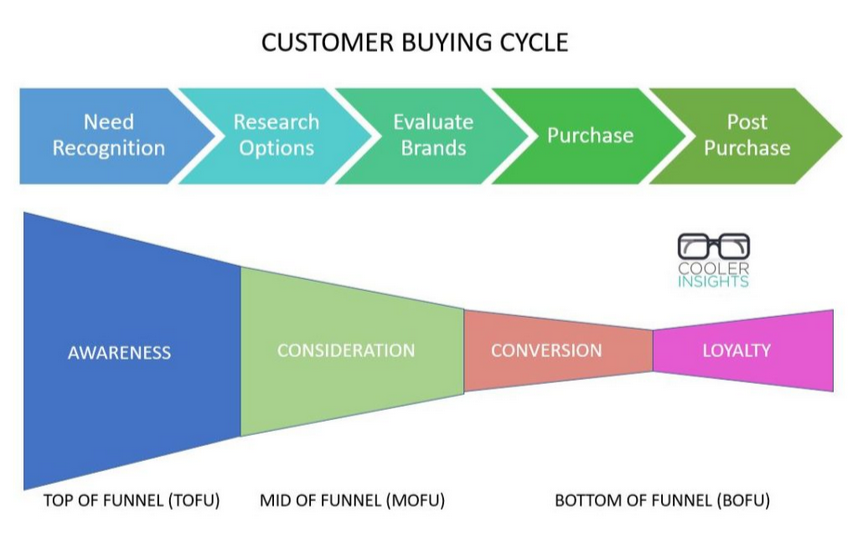

# Управление последовательностью работ

Создание и развитие целевой системы делается оргзвеньями::конструктивы — организованными агентами (людьми, системами AI, их коллективами) с материалами и инструментами, находящимися в распоряжении этих организованных (то есть с понятными полномочиями по распоряжению трудом, материалами и инструментами) агентов. Чаще всего оргзвенья сами не инициируют работы. В коллективной деятельности одни оргзвенья имеют полномочия просить сделать работу у других оргзвеньев, у которых есть обязанности такие просьбы выполнять — это и есть **организация**. Если вы попросите в пиццерии пиццу, то вам выполнят работы по её приготовлению — и это само по себе факт замечательный. Попробуйте попросить в пиццерии приготовить вам летние босоножки, и посмотрите, что будет после этой просьбы.

Граф создателей системы подразумевает, что все члены::роли команды берут коллективную ответственность за согласованные между собой изменения всех предметов работы проекта, а не только за изменениях собственных предметов работы. В системном менеджменте это высшая степень взаимодействия — **сотрудничество**(в нашем руководстве мы забежим немного вперёд и дадим краткие характеристики меньшим степеням взаимодействия создателей в проекте: игнорирование друг друга, информирование и общение без изменений чего-то в своей работе, координация как готовность хоть что-то поменять, кооперация как совместная работа без принятия ответственности каждого за общий результат и, наконец, сотрудничество как принятие всей командой проекта ответственности за общий результат).

Взаимодействие в команде и есть предмет одного из составляющих методов системного менеджмента: **оргразвития/«organizationaldevelopment»/«организационного управления»/«organizationalmanagement»** (в разложении этого метода будут методы прикладной **методологии** той или иной инженерии, методы **оргпроектирования** и **лидерства**). Предмет метода — это означает, что оргзвено проходит ряд состояний по шкале «сотрудничества»: от начального игнорирования друг друга в работе до конечного сотрудничества с принятием общей ответственности за результат коллективной работы. Оргразвитие занято вопросом освоения новых для организации методов работы: вопросом о том, кто кого (оргзвенья) о чём (работы по каким-то методам) имеет право попросить так, что просьбы вызывают их выполнение, а не удивление, вопросы и сопротивление вместо сотрудничества.

Конечно, чтобы работы были выполнены, надо ещё создать **организационную возможность (capability)**:

* У оргзвена есть мастерство выполнения метода и все необходимые инструменты и материалы.
* У оргзвена есть полномочия выполнять работы по методу (то есть выполнять оргроль).
* Известно, кто может давать предметы метода на входе и известно, кому отдавать результаты на выходе (если это конвейер, то принимать работу нужно от одних оргзвеньев, а отдавать её — другим).

Конечно, в организационном контексте не так часто говорят слово «метод», но используют самые разные другие синонимы. Часто, например, говорят «практики» (practice), не менее часто используют и понятие «рабочие процессы» и даже кривой термин «бизнес-процессы» (в западных стандартах по IT рекомендуют business process менять на organizational или organization process в зависимости от того, что принято, на русском это «оргпроцессы» или «административные процессы»). Давайте предыдущий абзац про создание оргвозможностей повторим, заменив «метод» на синоним — «рабочий процесс».

«Конечно, чтобы работы были выполнены, надо ещё создать **организационную возможность (capability)**:

* У оргзвена есть мастерство выполнения рабочего процесса и все необходимые инструменты и материалы.
* У оргзвена есть полномочия выполнять работы рабочего процесса (то есть выполнять оргроль).
* Известно, кто может давать входы рабочего процесса и известно, кому отдавать выходы (если это конвейер, то принимать работу нужно от одних оргзвеньев, а отдавать её — другим)».

Это не два одинаковых абзаца! Как видите, кажется, что ничего не изменилось, но «предметы метода на входе» были согласно традиции обсуждения рабочих процессов названы входами/input, а предметы метода на выходе метода названы выходы/output: замена терминологии. При этом мы свободно говорим про мастерство выполнения метода/«рабочего процесса» оргзвеном, ибо минимальное оргзвено — это один человек, но это может быть и какое-то подразделение или даже коллективный орган (скажем, собрание акционеров какого-то предприятия, научно-технический совет, комиссия, рабочая группа проекта) или даже какое-то предприятие (скажем, предприятие, входящее в холдинг — «дочернее или зависимое общество»).

Обсуждение оргзвеньев идёт как конструктивов:

* Какие оргзвенья выполняют какие оргроли (какие части конструкции выполняют какие функции — воплощают какие функциональные объекты, в данном случае просто речь идёт о конструкциях из людей и компьютеров с иными инструментами, зданиями и сооружениями)
* Как из оргзвеньев на каких оргинтерфейсах собирается вся организация как целое (из каких конструктивов на каких интерфейсах собирается целая система, как её собрать без лишних зависимостей, задача архитектора), как там работает логистика.
* Как сделать так, чтобы сотрудничали: чтобы оргзвенья выполняли работы, а не артачились, задача лидера.
* Как сделать так, чтобы у них были полномочия работать («делегирование», задачи начальствования).
* Как сделать так, чтобы умели работать по методу (было мастерство сотрудников)
* Как сделать так, чтобы наладить управление работами, чтобы всё было вовремя (ресурсы были, старт работ был оптимальный).

Системное мышление позволяет рассуждать про создателей и создаваемые ими системы с использованием одних и тех же понятий, хотя терминология может отличаться (например, в создаваемой системе это может быть «функция», в создателе это может быть «рабочий процесс»). И то же верно про системы в графе создателей, верно про системы в окружении создаваемых систем. При этом все рассуждения создателей по координации в их обширных графах строятся вокруг целевой системы — как той, о которой можно поговорить со всеми остальными в этом графе создателей, и тебя поймут как «радеющего за общее благо». **В этой понятийной (но не терминологической!) компактности—** **сила фундаментальных дисциплин. Вы уже знаете что-то про все встречаемые вами системы, какие бы они ни были, насколько бы ни была незнакомой предметная область и проект по созданию незнакомого вам вида систем.**

В подходе к описанию предприятий DEMO[^r7-1] (подробней будет в руководстве по системному менеджменту) каждая работа проходит следующий цикл взаимодействия оргзвеньев:

* **Работа затребована** оргзвеном-инициатором, часто в виде её появления в каком-то **плане** (с заданной последовательностью выполнения работ, а если план-график, то и указанными сроками выполнения) или бэклоге (**backlog**, набор работ к выполнению — но без указания строгой последовательности их выполнения, в том числе сроков): **координационный акт**, речь идёт об информационном мире поручений-согласований-обещаний оргзвеньев, но не о реальной физической работе по изменению мира или даже работе по изменению описаний системы.
* **Работа принята** **к исполнению** оргзвеном-исполнителем, это тоже координационный акт.
* **Работа выполняется** оргзвеном-исполнителем. Это **производственный акт**(production act), реальное выполнение работы. Именно это учитывается в жизненном цикле целевой системы, над которой выполняется работа. **В жизненном цикле обсуждаются только производственные акты**, а не координационные акты! Учёт координационных актов и требуемых на них трат ресурсов и задержек времени на «согласование» и «выдачу поручения» (иногда нужно год интенсивно работать, чтобы получить разрешение на пятиминутную реальную работу) ещё ждёт адекватного отражения в методологии. Пока же это рассматривается в дисциплине рациональности как «рациональное принятие решений» на базе теории принятия решений[^r7-2].
* **Результаты работы** **предъявлены** к приёмке оргзвеном-исполнителем, это координационный акт.
* **Результаты работы** **приняты** оргзвеном-инициатором работы, координационный акт.

Вы должны были заметить, что DEMO тем самым предлагает набор состояний работы, по нему легко сделать чеклист по прохождению этих состояний. Работа тут будет предметом метода «взаимодействие оргзвеньев» (работа::«предмет метода» «взаимодействие оргзвеньев»::метод), это мы обсуждаем методы ведения работ — прикладная методология операционного менеджмента. Хотя некоторые исследователи и говорят, что фундаментальная методология должна включать в себя и обсуждение методов, и обсуждение работ, ибо они неразрывны — в жизни мы просто смотрим на одни и те же действия забивающего гвоздь работника как на мастера, выполняющего метод и как на ресурс, выполняющий работу.

Деление на координационные и производственные акты в обсуждении работ важно, чтобы делать правильные оценки времени на выполнение работы: **от момента затребования работы до момента принятия** **результатов** **работы на координационные акты** **легко** **может уходить до** **60% времени, и только** **40% времени на проведение самой работы,** **а** **в случае знаниевых** **(проектных, а не изготовления физического воплощения)** **работ это может быть и 80% на 20% в среднем,** **ибо работы по «обоснованиям решений** **о том, что надо сделать» очень трудоёмки сами по себе: надо не просто запросить работу, но и обосновать то, что её надо выполнить (это может быть более трудоёмко, чем сама работа!), и надо не только предъявить результаты работы, но и обосновать то, что эти результаты приемлемы.**

Время прохождения цикла взаимодействия оргзвеньев по забиванию гвоздя тем самым может занимать в разы больше времени, чем время выполнения самих работ, затрагивающих физический гвоздь, как производственных актов. Забить гвоздь — пять минут, а договориться о том, чтобы гвоздь таки был забит — может быть и пять дней, и пять месяцев.

Нежелание выделить ресурсы на быстрое прохождение работ по координационным актам (нужных для ведения работ по продукционным актам, при этом нужно понимать, что координационные акты требуют не только коллективной чисто мыслительной/вычислительной работы, но и каких-то работ по экспериментам, получению дополнительной информации, работ по получению доступа к лицам, принимающим координационные решения) часто называют в организациях **«отсутствием** **политической воли»**: все материальные возможности для ведения работ есть, но работы не ведутся, ибо решения о выделении ресурсов для их проведении полномочными оргзвеньями не принимаются, для выполнения работ нет оргвозможности/capability!

Иногда это и впрямь не хватает коллективной или даже персональной собранности («политической воли»), иногда это рациональное нежелание вкладывать ресурсы в условиях жесточайшей неопределённости или даже вредности (нельзя, например, вкладывать ресурсы в то, чтобы драить палубу тонущего корабля — хотя все уборщики будут считать, что просто злые менеджеры не дают им работать, забыли о них, не разбираются в чистоте палуб и истинных потребностях в уборке), а снятие неопределённости может тоже требовать ресурсов, которые тоже не будет «политической воли» вкладывать!

Как планировать работы — по полному времени координации+производства работ, или только по актуальному времени потребления ресурсов? Разные школы **управления работами** (проектного управления, управления процессами, управления программами, управления кейсами — тут тоже изобилие синонимов) отвечают на этот вопрос по-разному. Управление работами как раз занимается **планированием работ** и **контролем выполнения работ,** где работы — это поведение оргзвеньев/оргединиц. Управление работами не обсуждает то, как правильно выполнять работы создателей так, чтобы они меняли создаваемую и развиваемую систему в нужном направлении (т.е. без обсуждения оргролей и их методов работы).

В предметах метода (они же — предметы интереса) управления работой нет функциональности происходящих с системой действий по методам создания и развития системы, то есть в управлении работой не рассматриваются функции/методы/культуры работ создателей, создатели не рассматриваются как оргроли/функциональные части, выполняющие практики с каким-то назначением, но только как конструктивные части-ресурсы, которые не важно что именно делают содержательно, но важен факт их наличия или отсутствия в нужном месте в нужное время для выполнения работы, а наличие мастерства и инструментария, равно необходимых для выполнения работ по методу с предметами этого метода учитывается просто как «разные ресурсы».

**Оргзвенья играют оргроли, оргроли реализуются/воплощаются** **оргзвеньями (функциональные объекты реализуются конструктивными, это отношение реализации/воплощения, помним** **4Dэкстенсионализм).Оргроли выполняют** **методы** **работы** **(функциональное/ролевое/** **«прикладное** **инженерное»/содержательное** **рассмотрение), а оргзвенья выполняют работы** **по методам** **(конструктивное/логистическое/«операционного менеджмента»** **рассмотрение).**

С момента начала использования понятия «жизненный цикл» в его первой (после нулевой «биологической») версии в проектах системной инженерии в него стали включать и время работ, которые происходили в начальный (до изготовления частей будущей системы) период времени, т.е. время работ по описанию будущей целевой системы и документированию этих описаний («знаниевые работы», knowledge works) — работы «с битами», а не «с атомами», то есть работы не с самим воплощением системы, не работы по изготовлению-сборке. Такого в биологических системах не бывает в силу центральной догмы молекулярной биологии[^r7-3]: «проектирование» там делает эволюция, информация генома правится только мутациями и может потом быть унаследована, её нельзя «спроектировать».

Геном и мемом отличаются в работе с ними: дарвиновская эволюция генома не может полагаться на «умные мутации», а техно-эволюция (даже если речь идёт о генной инженерии, где проектированием мутаций занимаются люди и системы AI) — может. В дарвиновской эволюции идут изменения всего организма, поскольку феном разворачивается из мутировавшего генома и очень трудно получить изменение какой-то одной части конструкции организма, а вот в техно-эволюции вполне можно (и даже нужно, такая цель инженерами-архитекторами ставится явно) оперировать изменениями только в рамках одного тщательно спроектированного модуля, внося изменения и в мемом (он хранится отдельно от создаваемой системы, например, в конструкторском бюро) и в феном готовой системы.

Помним: геном и мемом — это наследуемый материал (гены в ДНК и мемы на каких-то носителях информации, например в PLM-системе[^r7-4] в машиностроении или репозитории кода в программной инженерии), а феном — это проявленный в организме наследуемый материал. Техноэволюция идёт быстро, и в жизненный цикл (то есть не жизненный и не цикл) заодно попали стадии/работы, в которых идёт работа по получению и развитию мемома (иногда в промышленности это идёт как «проектная документация») целевой системы, проекта/design целевой системы. Слово «проект» в русском языке имеет не только значение проекта/project::работы по созданию системы, но и значение проекта/design как мемома создаваемой системы, то есть описания ещё не реализованной системы. Мы будем отличать проект-работы и проект-описание-системы как **проект/project** и **проект/design.** В жизни нужно различать эти значения, как обычно — по контексту, смотреть на «что хотели сказать», а не на употреблённый термин. В трудных случаях — переспрашивать. На вопрос «ты сделаешь мне проект сепульки?» надо уточнять — сделать только описания системы (design), или вообще сделать саму сепульку (project) — как описания системы, так и изготовление самой системы?

С момента включения стадий проектирования (работ с мемомом будущей системы) жизненный цикл вообще перестал ассоциироваться с изменением состояний воплощения системы (на чём был сосредоточен жизненный цикл биологических живых систем), а значение термина перешло полностью на работы систем создания как с описаниями, так и с воплощениями целевых систем. **Жизненный цикл перестал быть жизненным, перестал быть циклом и перестал быть жизненным циклом самой системы—** **он просто через именование целевой системы стал указывать на работысоздателей.** И ещё окончательно по сравнению с биологией и физикой исчезло понятие «эволюция» в пользу «однократного проектирования», «нециклового прохождения жизненного цикла».

Целевая система осталась только как «объект проекта», объект для группы работ, объединённых понятием «жизненный цикл объекта проекта»: указание того, над чем идут эти работы жизненного цикла. Иногда вместо проекта появлялись и более мелкие деления работы — кейс/case (из управления кейсами: аналог проектного управления, не требующий up front планирования, позволяющий планировать «на лету») или управления задачами/task (как правило, это то же самое, что управление кейсами, разница в нюансах).

Когда говорят «жизненный цикл чего-то», то это в первом поколении значения этого выражения — работы создателей по созданию этого «чего-то». Жизненный цикл гвоздя — это работы завода::создатель, выпускающего гвозди, «сети торгующих гвоздями дистрибуторов»::создатели, плотника::создатель (причём плотник тут даже не «оператор» времени эксплуатации, ибо оператора гвоздю, когда он держит соединение, то есть эксплуатируется, не требуется, плотник тут — инженер по вводу в эксплуатацию, «наладчик»!). Сам гвоздь при этом ничего не делает, не «живёт». Делают с ним, жизненный цикл гвоздя указывает не на работы гвоздя, а на работы создателей с гвоздём как предметом работ.

**Вскоре** **повсеместно** **жизненным циклом** **стали** **называтьуже** **не сам отрезок времени** **жизни целевой системы** **«от рождения до смерти»,** **а** **работы** **как выполнение** **сервисовсистем** **создания: совокупность стадий/фаз жизненного цикла в его понимании первого поколения.** Эти работы упоминались на всём времени существования системы: от появления первых описаний до ликвидации использованного и уже не нужного никому воплощения. Создание оказалось ведением жизненного цикла как ведением работ, необходимых для изменений состояний целевой системы в ходе её «жизни» как изменений внешними силами.

Сама создаваемая (целевая или «наша») система при этом просто была маркером, который позволял отметить все относящиеся к системе (как к воплощению системы, так и к описанию системы) работы, кто бы их ни производил в самых разных предприятиях, которые занимались системой на всём «протяжении жизненного цикла» («протяжение жизненного цикла»::«отрезок времени, на котором ведутся работы»).

Когда говорили «жизненный цикл АЭС», то имели в виду разбитые на стадии/крупные работы все работы с АЭС, которые выполняли своими сервисами многочисленные предприятия/оргзвенья от момента замысла АЭС и поиска денег на её проектирование и строительство до момента вывода её из эксплуатации с получением после этого зелёной площадки. Когда говорили «жизненный цикл танцевального перформанса», то имели в виду работы по его замыслу, его постановке, возможной серии самих исполнений перформанса. Эти работы мыслились как что-то целостное, кто бы ни занимался ими в самых разных командах всё это время с момента замысла перформанса до момента прекращения его просмотра (помним, что перформанс мог ещё жить и на записи, поэтому его жизненный цикл необязательно завершается в момент исполнения).

Итак, **жизненный циклсоздаваемой системыв версии 1.0 означает просто последовательность работ, которые производят** **создатели этой системы.**

Изображались такие жизненные циклы 1.0 с периодизацией работ очень просто: такими «колбасками», в которых поминались производимые последовательно крупные работы каких-то периодов времени внутри периода времени всей работы. Эти крупные отрезки времени внутри всего времени работ по изменению состояний системы были названы **стадиями/фазами жизненного цикла**. Вот примеры такого изображения жизненного цикла разных типов систем из стандарта ISO 15288, и обратите внимание на то, что каждое название стадии там говорит о работах создателей, а не о состоянии создаваемой системы (хотя иногда и случаются наименования состояния, но они используются как альтернативное название проводимых работ для достижения этого состояния, в духе положений PRINCE2 о том, что работы лучше бы называть по их результату как выполнению метода — конечному состоянию предмета метода):

Нижняя строчка с создаваемой «системой» там представляет собой один из вариантов **типового/обобщённого** **жизненного цикла**, который в том или ином виде может быть определён для почти каждого типа целевой системы. В нашем руководстве мы вместо «идея» говорим «замысливание», вместо «использования» и «поддержки» — «эксплуатация», вместо «списания» — «ликвидация/уничтожение». Вы можете предложить и свой вариант: главное тут в том, что жизненный цикл распространяется и на работы с описаниями системы (проектирование/разработка), и на работы с воплощением системы (изготовление, эксплуатация).

В этом первом поколении жизненный цикл обычно ещё не включает в себя работы по созданию создателей (учёт графов создателей). Чтобы построить атомную станцию или мост, нужно организовать стройку, построить целый посёлок в месте строительства, доставить туда необходимую строительную технику. А если это совсем что-то новое разрабатывается, то иногда и проектный институт нужно создать, а не только стройку. Это всё графы создателей, они в современном системном мышлении обязательны к рассмотрению, планирование работ по созданию создателей тоже обязательно. Но мы тут пока говорим о первом поколении — и это «первопоколенческое» понимание до сих пор широко распространено, получавшие образование лет двадцать назад инженеры и менеджеры его широко используют, в литературе полно этих «колбасок», так что с этим первым поколением понимания жизненного цикла вам нужно разобраться хотя бы для того, чтобы общаться с этими людьми.

В «колбасных» диаграммах жизненного цикла часто стадии использования/эксплуатации и поддержки/«техобслуживания и ремонтов» показывают даже не последовательно, а в одном и том же месте «колбаски» (или название в одном «ломтике» колбаски, как показано на картинке, или даже сам ломтик делят на две «перекрывающихся стадии», две половинки по горизонтали). И в этот момент приходится признавать, что стадии жизненного цикла не так уж и последовательно следуют друг за другом, они могут пересекаться — то есть работы разных стадий могут выполняться в одно и то же время, это явно подчёркивается во всех «стандартах процессов жизненного цикла».

Вот этот же жизненный цикл системы, но там уже используются не ломтики «колбаски», а «шеврончики вправо», означающие порядок выполнения работ — следования друг за другом стадий/фаз/этапов как более мелких работ всей общей работы «проекта создания системы»/«жизненного цикла системы». Это указание на то, что «сначала надо замыслить, а потом только проектировать, и только после этого изготавливать, и только после этого эксплуатировать»:

На этой картинке уже нельзя указать точные моменты времени, когда начинается одна стадия/фаза/этап и заканчивается другая, и это намеренно — стрелочка одной стадии буквально входит в хвостик другой стадии так, что нельзя провести вертикальную линию, чётко отделяющую один «шеврончик вправо» от другого.

Иногда этот факт размытого времени перехода из одной стадии в другую отражают тем, что ломтики в «колбаске» разделяют не прямыми линиями, а диагональными — типа как работы одной стадии потихоньку заканчиваются, а другой стадии потихоньку начинаются, нет момента резкой остановки работ стадии и резкого начала работ других стадий. Это точнее соответствует тому, что видим в жизни: работ в каждой стадии обычно много, и когда работы одной стадии начинаются (например, начинается изготовление каких-то частей-конструктивов будущей системы), работы другой стадии вполне могут ещё продолжаться (например, проектирование других деталей будущей системы оказывается ещё не закончено).

**Сам термин** **«жизненный цикл», данный без уточнений,всегда означает** **«полный»,** **то есть** **от** **работ** **создателей** **по** **замыслу** **до** **работ** **по** **«прекращению** **существования»/ликвидации/уничтожению/списанию/«выводу** **из эксплуатации»** **проэксплуатированной** **целевой** **системы.** **Это всё работы создателей,** **а не создаваемой системы:** **целевая система себя не замысливает, это создатели** **её замысливают!** **И то же с другими стадиями, системы обычно сами себя не создают, не эксплуатируют, не ликвидируют.**

В этом требовании полноты учёта всех стадий жизненного цикла (а не только входящих в какой-то один частный проект, например, проект разработки как создания проектной документации, без учёта остальных стадий) была сила системного подхода и продвижение по сравнению с биологией: думать надо было не над системой «от рождения до смерти», но о создателях системы (второе поколение системного мышления) и начинать думать надо было задолго до рождения/изготовления системы, с момента её замысливания. Но это было мышление о работах, а не методах работы, «операционный менеджмент», «управление проектами».

Методология (обсуждение способов выполнения работ, а не только последовательности выполнения работ и группировки работ в стадии/фазы) пришла чуть позднее. Идея безмасштабности создателей (например, понятие создателя/constructor из constructor theory Дэвида Дойча) пришла ещё позже, по большому счёту эта идея ещё даже не вошла в методологический мейнстрим, это ещё фронтир. И уж совсем недавно пришла идея, что однократным проектированием-изготовлением дело не обходится, системы эволюционируют, они непрерывно развиваются — но не столько развиваютСЯ (сами себя развивают), сколько их развивают их создатели, ведут техно-эволюцию систем как вида, а не как экземпляра или серии одинаковых экземпляров.

Эти «колбаски», пошаговое выполнение каких-то стадийных обработок повсеместны. Скажем, «воронка продаж»[^r7-5] — это та же самая «колбаска», хотя графическая форма и может отвлечь от понимания её сути. Вот пример[^r7-6] воронки цифрового маркетинга как один из многочисленных вариантов воронки продаж:

Эти «воронки продаж» рисуются в самых разных вариантах формы/фигуры уже знакомой «колбаски» жизненного цикла, фигуры конуса, напоминающего реальную «воронку», но сегодня чаще всего — в форме, напоминающей песочные часы. Широкая часть вверху — это верх воронки, подразумевающей, что в неё заходит большое количество людей, которые каким-то образом проходят разные операции по их обработке (их надо поймать, сообщить о продукте или услуге, снять возражения), постепенно поднимая готовность купить. На каждой стадии в самом верху и в середине воронки какие-то люди не поддаются задуманной обработке, поэтому дальше проходит небольшое их число. Этих людей называют по достигнутому их состоянию с точки зрения продвиженца (reference index тут — как это видит компания):

* посетитель/зритель, любитель/отслеживающий, зашедший на вебсайт,
* читатель содержания вебсайта, а дальше совсем уж специфическая терминология
* lead — возможный клиент, можно передавать от службы маркетинга как сервис-провайдеру «ловли и уговоров» потенциального клиента службе продаж как сервис-провайдеру продажи. Служба продажи работает с
* prospect, потенциальный клиент — и доводит его до состояния платежа,
* customer — «платящий клиент». Далее воронка расширяется, ибо мы от одной продажи переходим для одного клиента ко множеству продаж: это будет
* «возвращающийся клиент» (repeating customer) и в конечном итоге
* «пропагандист торговой марки» (brand advocate).

Как можно было бы именовать стадии наших «колбасок»? По-разному:

* По названию предмета обработки в конце такта/фазы/стади обработки или по состоянию на начало такта/фазы/стадии. В примере воронки цифрового маркетинга мы видим картинку ровно такую.
* По названию характеристики предмета работ, которую мы хотим получить на выходе обработки. В примере воронки цифрового маркетинга мы это видим «на полях» — это awareness, consideration, conversion, loyalty, advocacy.
* По названию работы, которую мы хотим выполнить — предыдущие варианты картинок главным образом задействовали этот способ (в инженерии это было бы «замысливание», «проектирование», «изготовление», тут как раз похожий подход).
* По названию создателя, который будет занят этой фазой работы (это редко, но всё-таки бывает). В иллюстрации вы видите довольно интересные «обработчики» людей, которые вполне можно назвать инструментами провайдеров сервиса превращения «аудитории» в «клиентов»: короткие видео, вебсайты, landing pages. Понятно, что их тоже делают какие-то службы компании, но саму обработку делают не люди, а созданные ими инструменты, это и подчёркивается. И это самые разные инструменты: короткое видео как инструмент с точки зрения продвиженца играет примерно ту же самую роль как «влиятельный блогер» или «соревнование любителей».

Главное тут — это понимать, что речь идёт ровно о той же самой «колбаске» жизненного цикла в её самом примитивном понимании. Дело не меняется, если поменять «позицию восприятия»/reference index. Скажем, возьмём клиента — который будет проходить через свои обработки продвиженцами примерно так же, как автомобиль проходит через разные стадии мойки и рассказывает про свой опыт (меня почистили от грязи, намочили, намылили, смысли, промыли от разводов, высушили) из первой позиции восприятия. Или дом: «меня замыслили, спроектировали, изготовили, теперь во мне живут, скоро меня сломают». Для автомобиля и дома такое, конечно, не очень характерно. Но в службах продвижения продуктов и услуг такое появилось, но мы видим, что изменилось тут не много — это та же «колбаска» стадий[^r7-7]:

Тут стадии даются как будто я иду в **путешествие/journey** по рабочим станциям и прохожу последовательно какой-то предписанный мне продвиженцами (маркетёрами и «продажниками») маршрут: сначала понимаю, что мне надо, затем исследую варианты, затем оцениваю разные торговые марки, затем покупаю, затем что-то происходит после покупки.

Но тут же мы забываем новый язык с термином «путешествия» и возвращаемся к привычному «циклу» покупки[^r7-8]:

Тут просто примерно сопоставили «что делает будущий клиент», «каких состояний должен достигнуть клиент», а как сопоставить обработки для этих состояний — это мы уже знаем, будет классический «жизненный цикл».

Да, всё то же самое — это жизненный цикл 1.0, хотя и с некоторыми нюансами по именованию стадий и (поскольку чуть дальше от инженерии) большей красочностью в изображении и меньшей строгостью к типам объектов в названиях стадий[^r7-9]:

[^r7-1]: Jan L.G. Dietz, Hans B. F. Mulder, Enterprise Ontology: A Human-Centric Approach to Understanding the Essence of Organisation, 2020

[^r7-2]: <https://ailev.livejournal.com/1619025.html>

[^r7-3]: <https://ru.wikipedia.org/wiki/Центральная_догма_молекулярной_биологии>

[^r7-4]: <https://www.gartner.com/reviews/market/plm-software-in-discrete-manufacturing-industries>

[^r7-5]: <https://en.wikipedia.org/wiki/Purchase_funnel>

[^r7-6]: <https://coolerinsights.com/2016/09/how-to-optimize-your-digital-marketing-funnel/>

[^r7-7]: <https://coolerinsights.com/2016/09/how-to-optimize-your-digital-marketing-funnel/>

[^r7-8]: <https://coolerinsights.com/2016/09/how-to-optimize-your-digital-marketing-funnel/>

[^r7-9]: <https://www.runsensible.com/blog/digital-marketing-funnels-for-beginners-an-all-inclusive-guide/>
