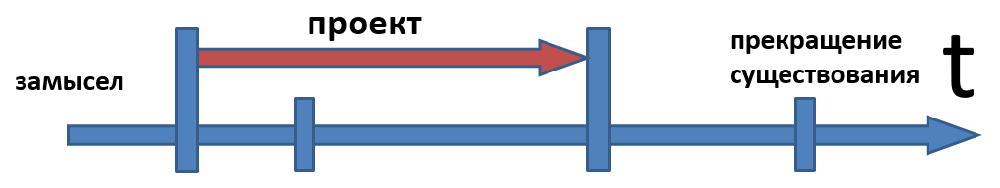

# Жизненный цикл проекта

Но поскольку уже было понятно, что речь идёт о работах, а естественной максимальной (соразмерной стадиям ЖЦ) единицей работ в проектном управлении стал «проект» (project, а не design), то появился ещё один термин: <strong>жизненный цикл проекта</strong> (project life cycle) — он означал те работы полного (от замысла до ликвидирования системы) жизненного цикла, которые попадали в рамки конкретного проекта с конкретными организаторами. Проекты эти обычно совпадали с работами, проводимыми для каких-то полных стадий жизненного цикла, одной или нескольких — скажем, только разработка, только изготовление, только эксплуатация. Это называлось «естественным делением жизненного цикла», потому что разные проекты часто выполнялись разными организациями — и нужно было как-то выделять части жизненного цикла, за которые несла ответственность проводящая проект организация/оргзвено.

По факту системное мышление и «проектное управление»/«управление проектами»/«project management» (и все они вместе как части процессного управления — отсылка к процессам, понимаемым как «пошаговое выполнение работ») на первых порах так и были связаны: жизненным циклом системы (термин из системного мышления) называли происходящие по поводу создания системы работы (предмет проектного управления), а работы уже делились на проводимые в разных проектах, там делились на проходящие в разных стадиях/фазах/этапах проектов.

В этот момент в самом системном мышлении не очень было принято думать о создателях. В биологии этого по принципу не было, хотя и могли рассматривать родителей, выкармливающих детёнышей, но в технических проектах инженеры «железных», программных и киберфизических систем редко думали о системах создания так же тщательно, как о своих целевых системах, о создателях предоставлялось думать менеджерам и основателям компаний/«предпринимателям» с их неясным набором ролей. Поэтому проектное управление как менеджерское движение в 80х и 90х годах прошлого века довольно много сделало для того, чтобы в системном мышлении появились мысли не только о системах окружения (время эксплуатации), но и о системах создания (время создания), а методология из философского учения о методах познания стала вполне общей фундаментальной дисциплиной для всех сфер человеческой (AI-агентов ещё не было) деятельности. В том числе при развитии идей первого поколения понимания жизненного цикла (работы, организованные в проекты) начали появляться методологические стандарты первой волны и понятия инженерии методов и <strong>ситуационной инженерии методов</strong>[^r7-1], проекты требовали в том числе и каких-то средств для описания методов работы — но это ещё не меняло самого восприятия жизненного цикла, это были именно проекты::работы.

По большому счёту и «проектные роли»/«stakeholders» как методологическое понятие пришли в жизнь в существенной мере по линии проектного управления: они же часто входят в состав различных создателей как их функциональные части! Если я разработчик шестерёнки для часов, то разработчик часов (концепция использования часов, задающая ориентиры для значений точности хода и т.д., это будут потребности для проекта шестерёнки, концепция часов, где он предложил шестерёнки вместо электроники), который будет принимать от меня результат — воплощение шестерёнки, вот эта роль и есть внешняя проектная роль «заказчика» для моего проекта шестерёнки, причём там эта роль может быть и дальше разбита — проектировщик часов, технолог производства часов как сборки их из готовых шестерёнок (то есть «заказчик» вдруг распадётся на подроли, и кроме инженерных ролей разработчика и технолога производства появится ещё и менеджер, финансист, юрист, логист и т.д.). А в проекте часов для всех тамошних ролей это будет стадия жизненного цикла часов «создание деталей часов», где будет учтена моя работа проекта по созданию шестерёнки. Если не вводить понятия «роли», то в таком проекте легко запутаться: кто что может делать, кто на что влияет, какие «зоны ответственности», кто кому за что платит, кто делает оценки сроков, кто эти оценки сроков учитывает при планировании. Но и с ролями тоже будет непросто, ибо роли-то будут играть оргзвенья — и спрашивать нужно будет с оргзвена, играющего роль (спросить с Принца Гамлета за то, что он не выдал свою реплику вовремя нельзя, но можно спросить с Васи Пупкина, который вдруг решил сделать перерыв в своей игре по роли или всё-таки играл, но исключительно плохо — отвлекаясь на массу других дел). Проектное управление вроде бы обсуждает роли — но в связи с выполнением работ, поэтому больше внимания не ролям и их методам работы, а всё-таки оргзвеньям и работам.

Особо нужно отметить о времени жизненного цикла в его 1.0 понимании:

* Понятие жизненного цикла — всегда полные работы на всём протяжении от замысла до ликвидирования системы (это влияние системного мышления)
* Жизненный цикл проекта — работы только на тех стадиях полного жизненного цикла, которые административно входят в проект, подчинение целям проектного управления.
* Возврат к идее цикла, ибо «жизненный цикл» будет выполняться с разными версиями системы, понятие «жизненный цикл» при этом уходит, понятие «проект» остаётся, но это будет «проект по созданию и развитию системы», ключевое слово тут «развитие», подразумевающее «эволюцию системы как вида».

Всё это — работы создателей, но мышление о создателях не ограничивается понятием жизненного цикла, постепенно от этого понятия отказываются. Хотя ещё кроме понятия жизненного цикла в версии 1.0 будет и понятие жизненного цикла 2.0, и там будет речь об оргролях и методах работы создателей. Но потом понятие «полного жизненного цикла» дало сбой, ибо проект перерос жизненный цикл одной системы и жизненный цикл проекта как часть полного жизненного цикла стало уже совсем неудобно применять. Так, в проект начали включать не только работы создания, но и работы развития системы, то есть прохождения многих «полных жизненных циклов системы» в рамках «ещё более полного жизненного цикла». Поэтому всё чаще и чаще вместо упоминания понятия «жизненный цикл» начали просто упоминать «создание и развитии системы», включая туда в том числе и время эксплуатации/использования и выкидывания самых разных получившихся в ходе развития вариантов уже готовой, но ставшей ненужной (просто необратимая поломка или даже моральное старение) системы. Создание системы понимается теперь как выпуск MVP, а развитие системы — всё, что происходит потом с самыми разными версиями системы с улучшаемой функциональностью.

Часто жизненный цикл системы в методе его описания 1.0 (т.е. в представлениях проектного управления) обозначали просто линией времени с засечками для разграничения его стадий/фаз (упрощённая «колбаска»), при этом он всегда обозначался полный: от работ по замыслу до работ момента прекращения существования. <strong>В</strong> <strong>этом указании полного жизненного цикла</strong> <strong>был смысл системного мышления, удерживать коллективное внимание</strong> <strong>всех команд всех проектов на всех работах по поводу системы, а не только на работах одной из команд одного проекта.</strong> <strong>Как всегда, системное внимание разворачивает мышление вовне, от границ одного проекта</strong> <strong>как работ одного</strong> <strong>создателя</strong> <strong>к объемлющему проекту</strong> <strong>как работе</strong> <strong>создателей из</strong> <strong>их</strong> <strong>большого графа.</strong>

Но на такой линии с засечками для стадий вполне можно было указать и жизненный цикл проекта, который поначалу понимался как часть полного жизненного цикла системы, мышление о проекте как выходящем за пределы одного жизненного цикла ещё не было развито, концепции «непрерывное всё» ещё не было. Например, жизненный цикл проекта мог включать в себя только работы по замыслу и проектированию/design, или только работы по изготовлению/воплощению системы как физического объекта, или только работы по эксплуатации — тут были самые разные варианты, в проектном управлении термин был удобен, а инженеры думали работами и ответственностями оргзвеньев, а не методами работ и мастерством выполнения ролей.

Поскольку проект в классическом project management имеет конкретные даты начала и конца, конкретные ресурсы, то «жизненный цикл проекта» понимается просто как проект из проектного управления, а большие куски жизненного цикла, или даже полный жизненный цикл понимаются уже не как проект, а как <strong>программа</strong>(иногда даже пишут полностью <strong>программа проектов</strong>[^r7-2], иногда <strong>программа работ</strong>). В проектном управлении программа — это набор проектов, посвящённых какой-то цели, но проекты из этого набора планируются по мере осознания в них потребности, а не сразу в момент старта программы.

Так, в военной системной инженерии киберфизических систем про жизненный цикл какого-то военного самолёта могут говорить как о программе этого самолёта — это ровно вот эта подмена нейтрального для самых разных практик/деятельностей/инженерий (киберфизики, менеджмента, основания предприятий/предпринимательства) понятия жизненного цикла понятием из проектного управления, которое сегодня развилось из просто project management в program and project management (иногда этот переход от «просто к проектов» к «проектам и программам проектов» называют «третье поколение проектного менеджмента», совместное мышление о программах работ и проектах как частях программы работ). При этом при переходе от проекта (от даты-1 до даты-2) к программе переходят к «открытой дате окончания» (её просто не указывают, «работы над системой можно только начать, их нельзя закончить», это неявно отражает переход к концепции «непрерывного всего», но всё-таки с удержанием идей классического проектного и программного управления).

Проектные и программные менеджеры сегодня (прошли десятки лет с момента появления дисциплины!) уже утеряли связь с системным подходом и методологией, и чаще всего думают о просто «программе работ», связанных с целевой системой, нежели об этих работах как о «жизненном цикле» какой-то системы и уж тем более не думают о времени развития, «программе развития»/«программе работ создания и развития» — и тут же теряют понимание целостности системы, которая берётся в системном мышлении как целое, в том числе в третьем поколении — как развиваемый вид целого. Тут также происходит и утеря мышления о методах/способах созданиях систем, то есть утеря методологического мышления. Итого: в обсуждаемой картинке «жизненного цикла проекта» не хватает выхода на полный жизненный цикл, а также выхода в развитие системы, за пределы жизненного цикла, так что приведённую картинку нужно из линии сделать кольцом, а ещё лучше бы чем-то типа витой пружинки, чтобы учесть время (тот самый «не жизненный, но всё-таки цикл»), и «не жизненный, но цикл» проекта изображать как части такой «пружинки».

Всё сразу запутывается в этих сложных представлениях, поэтому от графических представлений в моделировании «не жизненного, но цикла» в рамках изображения техно-эволюции быстро отказываются, разве что иллюстративно на диаграммах всяких «методов разработки» рисуют те или иные кольца (мы приведём примеры чуть позже), и эти кольца ещё и не учитывают создание и развитие создателей в их графе. Так что сейчас <strong>и рисуют на диаграммах, и обычно просто говорят о создании и развитии целевой системы, а слова «жизненный цикл системы» опускаются, просто «создание и развитие системы».</strong>

Программа работ чаще всего имеет единого для всех входящих в неё работ управляющего программой, но вот в классическом системном мышлении второго поколения жизненный цикл не требует выделения роли управляющего программой или проектом на всём протяжении жизненного цикла. Системное мышление — фундаментальный метод мышления, это не прикладная дисциплина типа программного и проектного управления, которая подразумевает работу прикладного мастера, владеющего прикладной практикой менеджмента, какого-то из видов классической инженерии, культурного строительства, образования или прикладной практикой какой-то иной деятельности по созданию самых разных систем.

«Программа партии/движения» — это ведь тоже программа работ, где создатель — коллективный агент, такой как партия/«общественное движение»::сообщество! И «Программа» уже обычно не содержит терминологии «жизненного цикла», она как-то ближе в её понимании к идеям создания и параллельного с использованием непрерывного развития системы, а не просто «задумали, спроектировали, затем родился — жил — умер».

В ходе полного жизненного цикла системы и уж тем более в ходе всего времени развития/эволюции системы выполнять работы могут люди из разных организаций (и они могут включать и представителей разных сообществ и обществ на должностях как раз этих «представителей»), управлять работами будут полномочные для этого люди из этих разных организаций/предприятий/оргзвеньев, а методология на основе системного подхода поддержит целостность представлений о всех работах от замысла системы до её ликвидации, а не только работах программ и проектов отдельных организаций.

Тем самым понятие «жизненный цикл» в его самых разных изводах переносит фокус рассмотрения целевой системы на её создателей, а также из времени эксплуатации системы переносит рассмотрение на время создания. Окружение создателей — иное, нежели окружение целевой системы. Разбиения (иерархии по отношению часть-целое) создателей (их называли иногда «системы ведения жизненного цикла») совсем другие, чем разбиения целевой системы. И между целевой системой и создателем отношение не часть-целое, а создания (то есть оно учитывает методы ведения самых разных стадий работ, да ещё и в их непрестанном повторении для развивающихся версий системы: замысливания, проектирования, изготовления, проверки, обслуживания, модернизации и даже уничтожения после эксплуатации каждого экземпляра системы, но ещё в цикле для развития мемома — проекта/design системы как вида).

Садовник создаёт (в данном случае замышляет, проектирует, выращивает, эксплуатирует, ликвидирует) цветок: ведёт работы по методам замысливания появления цветка в конкретном месте, посадки семечка, полива семечка, а потом и растения, удаления сорняков из окружения растения, удобрения почвы для благоприятного окружения цветка, а после цветения выведения из эксплуатации (ликвидации/выкидывания) уже отцвётшего цветка. Цветок ничего не делает сам, все работы его жизненного цикла делает его система создания в лице садовника.

Система создания цветка не часть его окружения (садовник не часть каких-то систем окружения цветка, времени эксплуатации. Если агент, играющий роль садовника и любуется цветком, то это будет другая роль, не садовника). Системы окружения (время эксплуатации!) не части создателей (время создания!), создатели не части систем окружения, они рассматриваются в разных временах. Я жарю шницель: шницель не часть меня, я не часть шницеля! Это другое отношение, отношение создания. Я рисую/описываю дерево: дерево не часть меня, я не часть дерева, я и дерево не части описания, описание не часть меня или дерева. Есть и другие отношения, кроме отношений «часть-целое»/композиции. <strong>Отслеживайте типы объектов, но отслеживайте и типы отношений, минимально это классификация, специализация, композиция, реализация/воплощение, создание. Без знания теории понятий (работа с типами и отношениями объектов) и онтологии (учение о многоуровневой нарезке мира на объекты, находящиеся друг с другом в каких-то отношениях) системное мышление невозможно!</strong>

<strong>Итого: жизненный цикл в начальном (1.0) понимании—</strong> <strong>это по-крупному</strong> <strong>разбитыена стадии/фазы/этапы</strong> <strong>все работы создателей надзамысливаемой, разрабатываемой, воплощаемой, эксплуатируемой, уничтожаемой</strong> <strong>целевой системой.</strong> <strong>По инерции</strong> <strong>сейчас</strong> <strong>в такое понимание включают и работы развитияMVPдо следующих версий системы, но раньше этого не было, всё мыслилось как «однократный проход по жизненному циклу», однократное выполнение работ над одной версией системы.</strong>А уж одна создающая организация выполняет все эти работы, или много разных, занятых разными жизненными циклами проекта — это менее важно. Главное тут было — не забывать о полноте жизненного цикла, уйти от жизненного цикла отдельного проекта к полному жизненному циклу.

[^r7-1]: <https://ailev.livejournal.com/750878.html>

[^r7-2]: <https://ru.wikipedia.org/wiki/Программа_проектов>
