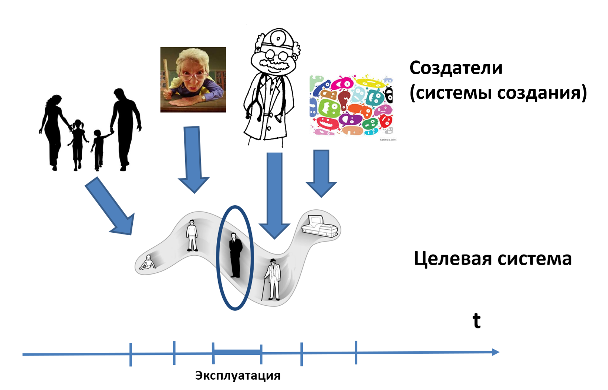
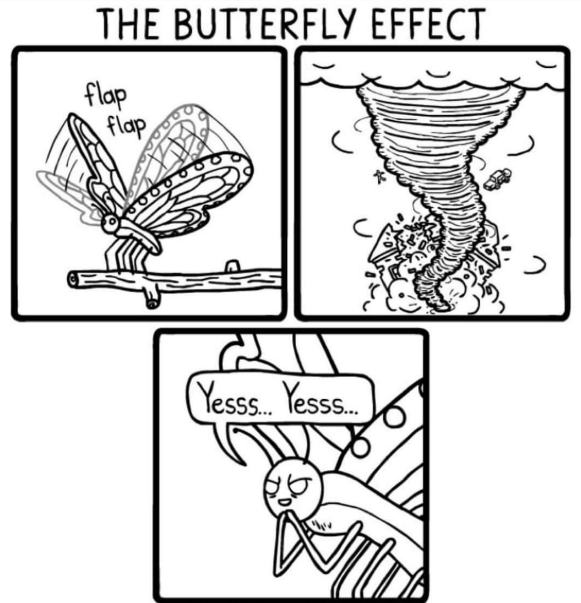

# Время эксплуатации: пример человека

<strong>Эксплуатация/использование/</strong>operations/функционирование/задействование — это раньше понималось как стадия/фаза/этап жизненного цикла. Но там было несоответствие: жизненный цикл вроде был весь работами создателей, а тут вдруг речь шла о работе самой системы. Поэтому единообразного рассуждения про все-все стадии жизненного цикла не получалось: на стадии эксплуатации начинались трудности, ибо с работ создателей в их графе мы вдруг переходили в обсуждение работ самой системы. Ситуацию не очень спасало то, что начинали говорить про действия оператора — тот, по идее, не создавал систему, но активно с ней взаимодействовал в момент работы, то есть проверял, настраивал на оптимальные режимы работы, а иногда и проводил обслуживание (например, заменял расходные материалы, смазывал) и даже мелкий ремонт, не затрагивающий функциональности. Это вроде как не мешало рассматривать систему как уже работающую, но работу оператора — как работу создателя.

Остроту вопроса про оператора, который вроде бы «создатель», но создаёт-в-момент-функционирования, снижает тенденция заменять операторов на автоматы, начиная с центробежного регулятора Уатта для паровых машин, заканчивая автоматизацией работы логиста в сети поставок/supply chain и даже операционного менеджера на предприятии. Это общий тренд: первые ламповые телевизоры имели по шесть рукояток настроек с каждого бока, чтобы зрители могли подстраивать плывущие параметры аналоговых схем, а современные телевизоры никаких «настроек» вообще не имеют. Хотя в телевизоре можно залезть глубоко в меню и настроить один раз приятную для какого-то зрителя цветность и яркость, но это не требует выделенной роли оператора и такую настройку производят явно не сотрудники завода-изготовителя, а сам пользователь — это не столько «оперирование», сколько часть «пользования». А уж сколько менеджеров среднего звена как «операционных менеджеров» заменил софт issue tracker, так и сказать нельзя. Очень часто оператор именно что налаживает работу целевой системы, а не собственно «работает на системе, пользователь» — так что он может рассматриваться как создатель и его действия логически относят не ко времени эксплуатации, а ко времени создания. Так, на поверку кто-то на должности операционного менеджера (должность с названием таким же, как роль!) чаще всего выполняет не столько эту роль «оператора созданной уже организации», то есть роль операционного менеджера (планирует и отслеживает факт начала работ, выделения ресурсов под работы с целью увеличить скорость выпуска продукта, берёт новые работы только с учётом текущей пропускной способности предприятия), сколько роль менеджера по развитию (то есть занимается методологией, оргпроектированием и лидерством).

Более того, поскольку иногда у системы есть ещё и люди-пользователи (то есть система имеет интерфейс для работы с людьми, а не только интерфейс для работы с «нечеловеческим» окружением), то ещё и оператор путался с пользователем (скажем, оператор смартфона и пользователь смартфона — обычно один и тот же человека: сам настраивает «под себя», сам пользуется). Пользователя же обычно не считают создателем из графа создателей, а считают относящимся к окружению времени эксплуатации. Конечно, это не всегда. У шестерёнки в часах нет людей-пользователей и нет людей-операторов, а вот у самих часов — есть. А если это механические часы, то завод этих часов можно обсуждать — часть использования («любишь смотреть время — люби и часы заводить»), или всё-таки это работа оператора.

Так что создатели могут быть операторами, ремонтниками, модернизаторами, но их работу относим по большей части ко времени создания, а вот если есть пользователь (получатель сервиса от системы), то взаимодействие с ним — время использования, описывается это взаимодействие сценариями использования (use cases).

Все работы по методам «инженерного процесса»/«жизненного цикла»/«создания и развития» какой-то системы делаются создателями для того, чтобы система могла выполнить свою функцию в надсистеме во время использования: нанесения системой непоправимой пользы окружению. Иногда эта польза демонстрируется путём предъявления довольно длинной причинно-следственной цепочки рассуждений, рассматривающей разветвлённый граф создателей, но это не меняет рассуждения.

Вот схематически это показано на примере сверхсложной системы — человека, и мы обращаемся при этом для простоты к нулевой биологической версии понимания жизненного цикла — «от рождения до смерти».

Сам человек тут показан как система, которую делают (а не которая сама растёт-развивается). Напомним онтологию человека (она даётся в руководствах по системному мышлению и инженерии личности): в человеке выделяют организм (физическое его тело) и личность как сумму мастерства во всех возможных методах работы, которые есть у человека.

В отличие от классических биологических жизненных циклов тут показан не жизненный, и не цикл — ибо не рассматривается цикл биологической жизни человека, биологическая жизнь и смерть входят в предлагаемый метод описания (viewpoint) методов работы создателей только как часть важных состояний целевой системы, а акцент делается на методы работы и роли создателей человека, как бы странно это ни звучало.

Человека рожают (показана семья как создатели, выполняющие работы по методам рождения и выкармливания людей), учат (школа/учительница как создатель, работающий по методам обучения людей), и в этот момент, когда целевой человек ещё не вырос и не выучен, он не является полностью дееспособным, «не владеет собой» (в том числе и юридически! Нет совершеннолетия — не может распоряжаться своей судьбой, хотя права на себя потихоньку отдаются с каждым годом).

Даже в момент «изготовления» (выращивания и обучения) личность человека-агента уже может иметь в себе две функциональных части (то есть две роли): одна часть будет учиться и тем самым будет целевой системой для проекта выращивания дееспособного человека, а вторая часть уже будет учителем::создатель для этой первой части, наряду с внешними создателями — родителями, учителями. На схеме это вроде как не отображено, но не факт: это ролевая картинка. И какой-нибудь Теодор в десятилетнем возрасте может вдруг стать не только Теодором-учеником, но и одновременно Теодором-учителем (и перед этим Теодором-тьютором, чтобы подобрать для себя то, чему он хочет научиться), и пойти по какому-нибудь самоучителю (что вряд ли), или даже тихо пытаться научиться нарисованным на экране мечом бить нарисованных на экране монстров в видеоигре (что очень вероятно). Подробней о множестве ролей личности, которая пошла учиться, будет рассказано в руководстве по инженерии личности, которое посвящено главным образом тому, как учить интеллектуальных агентов, у которых мышление реализовано нейронной сетью, главным образом людей с их «мокрой нейронной сетью» в мозге.

После того, как логическое время получения жизненного мастерства закончилось, наступает момент эксплуатации: выученное человеком мастерство начинает работать — личность эксплуатирует сама себя, у этой личности признаётся дееспособность, самопринадлежность (и тут могут возникнуть трудности, если этот человек не может встроиться в какую-то надсистему: так, мало кому нужны люди, умеющие нарисованным мечом бить нарисованных монстров, а уж люди, тупящие в социальных сетях на просмотре мемасиков и подавно ни в каких надсистемах как создатели чего бы то ни было не нужны, то есть интересуют какие-то степени мастерства, за работу по которым могут заплатить).

Во время эксплуатации мы рассматриваем работу личности в операционном/эксплуатационном/рабочем/системном окружении из множества самых разных систем, с которыми личность взаимодействует в ходе своей эксплуатации/использования/работы. Физически личность делит время между этой эксплуатацией (собственной работой) и «ремонтом» организма (работой создателей над организмом — врачи рассматриваются как создатели, работают в логическое время создания, а не время эксплуатации) с «модернизацией» как личности, так и организма (учёба, физподготовка — тоже создатели работают в логическое время создания). Такое совмещение эксплуатации и ТОиР (техобслуживание и ремонты) чаще всего в моделях инженерных процессов (а раньше — моделях жизненного цикла) не отражается.

Затем доктора нашего человека его главным образом лечат (эксплуатация закончена, человек больше не работает — выведен из эксплуатации), а потом микробы прекращают существование организма (метод ликвидации). Альтернативная реализация методов ликвидации организма в данном случае — кремация, там без микробов.

А как же развитие человека как системы, ведь говорим о создании и развитии? Тут несколько вариантов:

* считаем, что человек в своём развитии проходит множество версий, то есть «вчерашний» человек не равен «сегодняшнему» — и тело ведь можно развивать, выпуская более мускулистые и здоровые версии, получаемые от каких-нибудь тренировок в спортзалах и от посещения правильных докторов, и личность можно апгрейдить.
* рассматриваем «биологический жизненный цикл» с деторождением (и пытаемся сделать детей этого человека умней и здоровей, чем он сам), переходя к развитию не одного человека, но вида людей
* переносим акцент на развитие не самого человека, а мемома: речь идёт о порождённые нашим целевым человеком в ходе «эксплуатации» мемы — они будут реплицироваться, добавляя что-то в развитие коллективов, обществ, сообществ, человечества. Одна из форм — создание этим человеком книг, курсов, руководств, стандартов, регламентов, инструкций, постов в блогах. Другая форма — создание учеников, которые будут реплицировать новое знание, порождённое в ходе жизни нашим человеком-с-картинки.

Ход на развитие — это ход в эволюцию, преодоление ограничений одной версии системы, даже если система эта — человек. При этом в силу самопринадлежности (ну, или агентности — речь идёт об интеллектуальных агентах) какие-то роли человека будут подсистемами-создателями этого человека. Чтобы не впадать в какие-то парадоксы, мы можем считать, что это не «человек делает сам себя», а какие-то части человека делают другие части. Скажем, правая рука накладывает мазь от ушиба на левую ногу, а мозг этим управляет. Это позволяет рисовать функциональные диаграммы того, как части человека или даже части личности помогают изменять друг друга.

Так из чего же состоит «жизненный цикл человека», «процесс разработки человека», «создание и развитие человека»? Из методов работы всех создателей (родителей, учителей, самого человека в «работе над собой», докторов и даже микробов), разложенных в картинке на шкале времени как попытке изобразить старинный «водопадный жизненный цикл» — со всеми уже обсуждёнными проблемами такого. Поэтому <strong>мы можем рассматривать это представление «жизненного цикла на шкале времени»,</strong> <strong>просто игнорируя шкалу времени—</strong> <strong>по факту там представлено классическое разложение методов создания по какой-то шкале, просто шкала выбрана по принципам, близким к принципам построения горбатой диаграммы: считаем, что какие-то методы создателей больше</strong> <strong>задействуются</strong> <strong>в одни физические периоды времени, а какие-то в другие—</strong> <strong>но понимаем при этом, что по большому счёту какие угодно методы срабатывают в какие угодно периоды. Скажем, учится человек всю жизнь—</strong> <strong>но</strong> <strong>в «колбасном» жизненном цикле</strong> <strong>условно</strong> <strong>будет</strong> <strong>показано, что «учится в возрасте школьника и студента», а не всю жизнь/</strong> <strong>Время «колбасок» привязано оказывается к возрасту, это оказывается физическое время работ, а не логическое время методов работ в разложении методов развития человека.</strong>

Системное мышление обращает внимание тут на типы объектов: целевую систему, системы в окружении, системы в графах создателей, методы работы и работы по этим методам — и так далее по мантре системного мышления. В рассуждениях про создание и развитие человека (раньше это бы назвали «жизненный цикл человека») должны быть учтены они все, все оставаться во внимании при мышлении о развитии человека. Если вы о чём-то из этого списка не подумали, то в проекте вас ждут сюрпризы, и не все из них будут приятными.

Пример с человеком очень провокационен, ибо человек самопринадлежен, и он может занимать роли как создаваемой системы, так и создателя системы, а ещё в нём есть части личности, которые могут одновременно исполнять конфликтующие роли. И тут, конечно, многоуровневая этика со всеми этими вопросами про подчинение человека интересам общества, которые легко спутать с интересами отдельных людей из этого общества, а также попытки защищать интересы не общества, а человечества, или даже «всех чувствующих существ», или даже просто упорядоченной жизнью части вселенной.

Слово «эксплуатация» (в любых вариантах, «использование», «работа») по отношению к какому-нибудь насосу — нейтрально, к роботу — нейтрально, а вот для человека и даже для животных оно крайне эмоционально окрашено. По отношению к человеку плохо говорить о его «проектировании» и «производстве» в любом смысле этих слов. Идеи евгеники[^r7-1] постоянно появляются и постоянно критикуются.

К идеям проектирования какого-то мастерства отношение не лучше: с одной стороны, можно учиться чему хочешь, с другой стороны — жёсткий контроль за учительством, включая законы о запрете на профессию, а также предписание общего образования по одной и той же учебной программе для миллионов граждан страны. И слово «проектирование» в отношении мастерства не принято говорить, от этого стараются уходить. Плохо говорить и «изготовление мастерства», тут тоже сильны традиции.

Пример инженерии человека (включая тело, причём не только лечение как ремонт, но и изменение тела для развития его возможностей) и инженерии личности (альтернативное название для обучения в целом и образования в частности) подробней разбирается в руководстве по инженерии личности.

Пример с «инженерным процессом» для человека крайне полезен, чтобы понять принцип: одно и то же системное мышление с обязательным учётом границ его применимости можно использовать для снижения сложности разбирательства с самыми разными целевыми системами в самом разном системном окружении и самыми разными создателями. Способ размышления не меняется, понятия не меняются, но вы можете всегда выбрать политкорректную терминологию. Вопросы же останутся, никакая политкорректность от этих вопросов не спасёт. Смерть для людей останется смертью, даже если политкорректно назвать её «освобождение от страданий», рождение останется рождением, даже если поэтически обозвать его «приходом в этот мир». Системное мышление не даст шанса о чём-то забыть: заставит обсудить вопрос о <strong>методе</strong> создания и развития системы, предупредит, что обсуждать только <strong>работы</strong> создания и развития системы без обсуждения <strong>методов этих работ</strong> — нельзя. <strong>Если есть работа, она всегда идёт по какому-то методу.</strong> <strong>При этом выбор метода ограничен не только инженерно или экономически, он часто ограничен ещё и этически.</strong>

Пример с созданием и развитием людей (при этом создание людей как-то совсем не принято обсуждать инженерно, а вот развитие — трудно, но можно) лишний раз подчёркивает условность отнесения работ к разным стадиям старинного понятия «жизненный цикл» и необходимость перехода к обсуждению методов/практик/способов/культур/технологий работы, видов инженерного труда по созданию и развитию успешной системы. Инженерный подход даёт возможность задуматься и о том, что считать успешной системой. Скажем, если я себя считаю успешным — действительно ли это так? По отношению к себе я представляю как агент только часть проектных ролей!

Всё это сложней, ибо человек может не только учить сам себя, быть станком для самого себя, поэтому развитие будет и у него тоже, но он может ещё и учить других людей, учить компьютеры и роботов (включая системы AI), и принимать участие в графах создателей каких-то развивающих систем (например, оставлять знание в форме, удобной дальше для обучения). Конечно, человек может это делать абсолютно впустую, без какой-то видимой пользы — эволюция бездушна, и именно эта линия репликации новых мемов этого конкретного человека может оказаться неудачной, «жил впустую», как вроде как впустую жили динозавры и саблезубые тигры — и потом вымерли. Но не факт, что они жили «впустую», ибо они ещё существенно влияли на выживание других видов. Так и люди, чьи идеи/мемы потом «вымерли» в их книгах, или детях, или рабочих продуктах, вполне могли самим наличием этих идей в их времени и их месте существенно повлиять на судьбу тех идей, которые потом смогли отреплицироваться. Или не могли, динозавры вот вымерли — и каждый конкретный динозавр не очень понятно, как повлиял на жизнь каждого конкретного человека. Всё-таки надо рассматривать самые очевидные причинно-следственные связи и не преувеличивать влияние отдельных шагов развития своих систем и себя лично на эволюционное развитие человечества в целом.

Сами работы по самым разным методам самой разной инженерии (в зависимости от специфики системы и специфики создателей системы) вы будете выполнять в самых причудливых конфигурациях: последовательно, параллельно, сжато или растянуто во времени в зависимости от ресурсов, одним мультиспециалистом или сотней «узких спецов», это будет зависеть от конкретной проектной ситуации. Но если в проекте нужно принимать архитектурные решения (каким-то методом архитектурной работы), то вам придётся предусмотреть оргроли для этой архитектурной работы по этому методу, затем создать оргвозможность — архитектурные решения сами себя не примут и не задокументируют, не объяснят себя проектировщикам и не проверят, выполняют ли их проектировщики в своей работе, а потом ещё и сами себя не изменят, когда выяснится (кем?), что текущий набор архитектурных решений неадекватен и их надо срочно менять.

Если вам нужно привести какой-то объект в какое-то состояние:

* Надо понять, каким методом вы это можете сделать: объект при этом будет предметом метода
* Надо понять, если ли у вас оргвозможность сделать (и создать эту оргвозможность, если её нет)
* Надо запланировать и выполнить работу с этим объектом как предметом работы.
* Даже если в проекте принята другая терминология, надо как-то выдержать само вот это размышление, оно тут часть системной мантры.

[^r7-1]: <https://en.wikipedia.org/wiki/Eugenics>, <https://ru.wikipedia.org/wiki/Евгеника>
