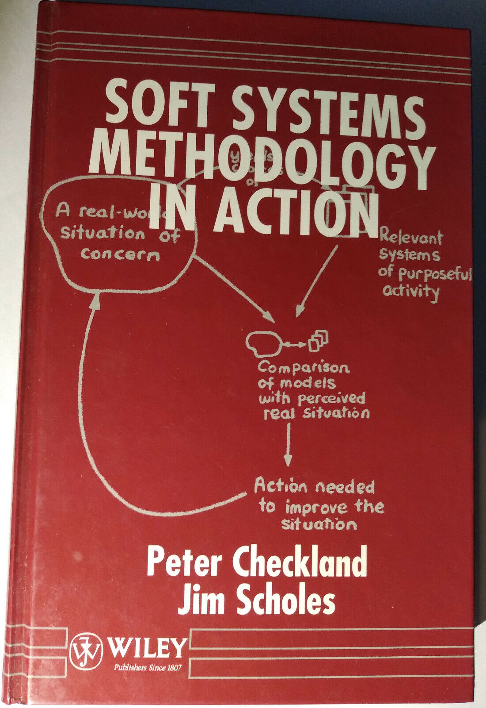

# Жизненный цикл системы 1.0: работы, меняющие состояния целевой системы

Поначалу <strong>жизненный цикл</strong> (life cycle) просто обозначал отрезок времени, во время которого происходили проводимые системами создания <strong>работы</strong> с целевой системой, при этом по аналогии с биологическим циклом последовательно проходящие работы относили к разным <strong>стадиям</strong> (stages), иногда называемым <strong>фазами</strong> (phases) <strong>жизненного цикла</strong> — отрезкам времени, в которых система была в каком-то состоянии. Никакой эволюции, никаких гипотез об успешности, только выполнение требований, что и было «успехом». Хотя прототипы могли рассматриваться, но это были «последовательные приближения к окончательному варианту», никакого «бесконечного развития», «непрерывного всего», а «достижение цели»: результата работ как системы, соответствовавшей «утверждённым требованиям».

Жизненным циклом чайника называли отрезок времени, в течение которого с ним проводились работы (чайник ведь сам себя не сделает, это не биология — все работы с ним должны провести какие-то внешние по отношению к нему системы создания). Эти системы создания должны решить сделать чайник (а не кофейник), задокументировать требования, затем (последовательность важна! Сначала требования, потом проектирование — это будут «стадии») запроектировать чайник (выбрать внешний вид и материалы), сделать чайник (согласно проекту закупить материалы и изготовить), затем использовать для заварки чая (эксплуатировать), затем разбить и выкинуть. Вот всё это <strong>время прохождения работ</strong> <strong>создателя</strong> с чайником как целевой системой и называли «жизненным циклом»::«отрезок времени», а сами <strong>работы</strong> в их самом верхнеуровневом разбиении: принятие решения о чайнике, проектирование чайника, изготовление чайника, эксплуатацию чайника, ликвидацию чайника называли «стадиями/фазами жизненного цикла»::работы. Обратите внимание на разницу в типах объектов: жизненный цикл — это отрезок времени (измеряется в часах), а стадии — это работы, когда кто-то что-то с чем-то делает, меняет мир. Работы — это <strong>динамический объект/изменение/поведение</strong>, а не <strong>отрезок</strong> <strong>времени</strong> существования этого объекта, то есть отрезок времени, пока идут изменения. Жизненный цикл был «двадцать лет», делился на «сформулировать требования к забору», «спроектировать забор», «построить забор» (и вот уже прошло два года), «следить, чтобы забор был в рабочем состоянии» (восемнадцать лет), «разобрать забор и выкинуть строительный мусор» (последние две недели из двадцати лет жизненного цикла).

Назовём это понимание «жизненным циклом v1.0»[^r7-1], оно разрабатывалось где-то в 70-х годах прошлого века, и не только в системной инженерии, но и в менеджменте, который в те времена считался более-менее «психологической» особой дисциплиной, а не просто изводом системной инженерии для организационных систем. В системном подходе уже тогда признавали непосредственно выходящими из него не только системную инженерию, но и operations research/исследование операций[^r7-2] — исследование работ/operations с целью принятия лучших решений по ускорению их прохождения. Исследование операций скоро перестало быть «аналитикой», то есть только исследованиями, и в его синтетической/управленческой ипостаси стало operations management (<strong>операционное управление</strong>, акцент не только на понимании и отчётах, но и на действиях на основе этих исследований — собственно управлении, изменении ситуации в части <strong>ускорения прохождения потока работ через производящие эти работы ресурсы</strong>).

Дальше это направление управления работами/операционное управление/операционный менеджмент на базе каких-то представлений тогдашнего системного подхода развилось в классическое проектное управление/project management, как его понимают сегодня в менеджменте (хотя к нему кроме собственно управления операциями добавилась сегодня ещё и организация команды проекта, это подробней объясняется в руководстве по системному менеджменту[^r7-3]). Мы же считаем операционный менеджмент эксплуатационной (то есть происходящей с уже созданной системой) инженерией организационной системы.

Одна из самых популярных книжек по проектному управлению, вышедшая первым изданием ещё в июне 1979 года, это Harold Kerzner «Project Management: A Systems Approach to Planning, Scheduling, and Controlling». То есть <strong>управление проектами</strong> <strong>в момент его появления</strong> <strong>было применением системного подхода к планированию, построению графика работ и контролю выполнения работ</strong>. Это похоже на то, как понималась в те времена и классическая «железная» системная инженерия: применение системного подхода к инженерной работе.

Конечно, использование системного подхода в менеджменте не ограничивается сегодня только операционным управлением. По сути, весь менеджмент как специализация системной инженерии для создания и развития организаций строится на базе системного подхода. И это уже был системный подход второго поколения, которое ассоциируется главным образом не с работами фон Берталанфи, а с более поздними работами по «мягким системам» (soft systems), под которыми понимались прежде всего системы-создатели из людей с их инструментами. К таким системам из людей (организациям) оказались неприменимы жёсткие требования «как к железным системам», которые были характерны для системного подхода первого поколения, рассматривавшего главным образом какие-то не слишком живые целевые системы, но не граф создателей из людей и их коллективов. Графы создателей (хотя и в чуть другой терминологии) с их коллективами и менеджментом как «инженерией организаций» — это уже предмет второго поколения, наиболее характерны там работы Питера Чекланда. Вот его сборник работ в соавторстве с Jim Scholes, 1972-1981:

Понятие жизненного цикла 1.0 как времени производства работ создателя с создаваемой целевой системой (о цепочках создания речь не заходила) активно разрабатывалось и в системной инженерии, и в менеджменте, а именно — в классическом проектном управлении (project management) для принятия решений о планировании и составлении графика работ в инженерных проектах.

<strong>Работы</strong> — это экземпляры поведения создателей (в проектном управлении — это были всегда люди, хотя по факту это могут быть и менее интеллектуальные агенты, например, роботы или даже станки), описываемые как взаимодействие <strong>ресурсов</strong> (экземпляров создателей, выполняющих какие-то действия по методу работ, и экземпляров предметов этих методов работ). В проектном управлении особенно подчёркивают, что это «экземпляры». Например, в программах проектного управления вы не можете ввести работу «забить гвозди» без даты. Нет, вы обязаны привязать её к определённому времени, без времени ввести эту работу не получится: программа так отслеживает, чтобы вы не перепутали метод работы (шаблон/паттерн/образец!) и задействование метода самой работой.

Так что работа — это Анастасия забивает гвозди молотком в доски 16 мартобря 2028. Забивание гвоздей 16 мартобря — это и есть работа, которую она выполняет, а Анастасия, молоток, гвозди, доски — это всё ресурсы, которые должны провзаимодействовать в момент работы и поэтому должны наличествовать. Нет ресурсов — нет работы. Так что управление работами (work/operations management, операционное управление) сводится к тому, чтобы оптимально распорядиться ресурсами: выполнить максимальное количество работ с минимальными ресурсами. Как? Например, вы можете пригласить Анастасию забивать гвозди на один день — 16 мартобря 2028, заплатить за один день. А можете пригласить на месяц и договориться платить зарплату месяц, а задействовать только один день — 16 мартобря 2028. Можете закупить гвозди и доски за два года до планируемой работы, а можете закупить так, что они прибудут сразу 16 мартобря 2028 и даже не успеют попасть на склад, а будут выданы сразу «в монтаж» Анастасии. <strong>Операционное управление, цепочки поставок (supplychains), логистика, исследование операций—</strong> <strong>всё это методы максимизирования прохода/throughputработ и предметов метода по</strong> <strong>какому-то графу</strong> <strong>создателей</strong> <strong>за счёт снятия логистических (ресурсных, в том числе</strong> <strong>транспортных, то есть наличия ресурсов для работ вовремя) ограничений.</strong>

Работы чаще всего называются не по их цели (сигнатуре метода), а по их текущему содержанию, подразумевающему уже выбранный метод — не «скрепление досок», что может предполагать и клеевое соединение, и гвоздевое, а именно «забивание гвоздей», хотя тут есть множество и других вариантов. Выбор методов работы включает предложение многих альтернатив, затем выбор для реализации работой одной из этих альтернатив. И вот при планировании работ работа называется обычно по выбранному методу (разложение метода до какого-то уровня известно), а не сигнатуре — отражается то, что решение по выбору метода уже принято. Варианты, конечно, могут быть. Если вы вызвали сервис-провайдера для оказания какой-то услуги (то есть для выполнения работ по методу/сервису), то разложение метода может быть известно только провайдеру, и он сам примет решение, что там с методом работы — а вам нужна от него будет только сигнатура метода плюс указание на работу (дата, к которой вы будете давать предмет метода работы, а провайдер обеспечит наличие создателя, который выполнит операции метода/сервиса над этим предметом работы).

В любом случае, работы оказывались оказанием сервисов систем-создателей как провайдеров этих сервисов (помним онтологию сервиса и сервера/провайдера из руководства по системному мышлению). Сеансы сервиса, рассматриваемые как работы, совсем уже теряли специфику паттернирования: это просто было поведение каких-то <strong>ресурсов</strong>, участвующих/participate в работе::поведение/изменение.

Анастасия с её молотком как оргзвено::конструктив плотника::роль, материальные и наличные гвозди, молоток и доски — ресурсы, без доступности которых выполнение работы плотника (в части ресурсов «плотник» — это оргзвено Анастасии с молотком как инструментом и гвоздями как расходным материалом) невозможно. Работы выполняют создатели в момент эксплуатации, метод работы важен, но рассматривается отдельно — и один раз, а работ по методу может быть множество. Анастасия может бить гвозди молотком, может использовать электрический гвоздезабиватель — это будет учитываться инженерами, но для операционных менеджеров важно только одно: чтобы 16 мартобря 2028 года встретились все необходимые ресурсы: Анастасия, гвозди, доски, и стал доступен для следующих операций ресурс «скреплённые гвоздями доски». Зачем нужен этот ресурс «скреплённые гвоздями доски»? Это пусть решают инженеры, обсуждающие методы работы с их разложением. Менеджеры обеспечат всё «в срок, в бюджет» и чтобы общий проход всех ресурсов по предприятию был максимален (включая проход чужих ресурсов, которые принесли для обслуживания), для этого каждый экземпляр предмета метода должен быть откуда-то получен, обработан и передан на следующую операцию.

В мире принято платить не столько за работы, сколько за результаты работ. Если платят за работы, то как-то само собой получается, что результатов нет и нет, а работы становится больше и больше — скажем, у врачей есть проблема лишних назначений, ибо им платят не за то, что они вылечивают, а за то, что лечат. Мы не будем рассматривать такие ситуации. Так что операционное управление в типовом случае занято максимизацией прохода/throughput: выпуск предметов общего метода работы организации за пределы организации — и за каждый выпущенный предмет метода поступает оплата. Больше продукта в выпуске (то есть растёт скорость выпуска, «проход» — выпуск единиц продукции в единицу времени, первая производная по времени) — больше оплата (то есть растёт скорость «впуска» оплаты). Максимизируем проход как «скорость выпуска» (то есть максимизируем проход работ и предметов работ по графу создателей), тем самым максимизируем скорость прихода оплаты<strong>.</strong> <strong>Работы характеризуются не тем, чтобы выполнить побольше работ, а тем, чтобы выполнить работ поменьше, но выпустить продукта (включая чужого, ситуация сервиса) побольше.</strong> <strong>Целью операционного менеджмента является максимизация прохода/throughput</strong> <strong>при минимизации задействования ресурсов.</strong>

Если у вас сдельщина по результату работ — будет мало работы, много результатов. Если сдельщина по самой работе, то будет много работы, а результатов работы — мало, значительная часть работ будет бесполезной.

Главное — это понимать, что операционный менеджмент в конечном итоге сведётся к правильному размещению во времени <strong>«потока/flow</strong> <strong>работ»/workflow</strong> по ресурсам-создателям, которые ведут эти работы по каким-то методам. По-русски вместо «потока» для работы говорят «ход», отсюда и неминуемые «шаги» работы, но в английском используются разные слова, чтобы подчеркнуть аспекты непрерывности потока и дискретность шагов — в английском работы текут!

Так что организация коллективной работы для «управляющего работами»/«операционного менеджера»::роль — это сеть рабочих станций, по которой текут работы. По факту он так и представляет организацию, для него именно это принципиальная схема организации — и поток работ, сводящийся к потокам предметов этих работ, переходящих от одного создателя к другому создателю тут мало отличается от потоков тепла в принципиальных тепловых схемах, «потоков электричества»/«электрических токов» в электрических принципиальных схемах, потоков жидкости в принципиальных гидравлических схемах, всё то же самое. Для управляющего работами прикладная (в его предметной области операционного управления) методология занимается методами работы с работами (причём работы даже абстрагированы от «работ по методу», отрыв от сущности работ, но внимание к ресурсам). Для него организация функционально представлена «рабочими станциями» (создателями как ресурсами) и между этими станциями текут какие-то предметы работ, результаты работ измеряются по проходу/throughput организации, например, «штуки продуктов в час». Это функциональное рассмотрение: его «операционный менеджмент»::метод работает с ресурсами::«предмет метода», а операции метода в разложении метода «работа организации» — это отдельные работы.

[^r7-1]: Тут можно говорить о первом поколении понимания жизненного цикла, но пошутим в духе современных обозначений версионирования, назовём это версией 1.0 — так же, как мы пошутили насчёт второго поколения самого системного подхода (после рассмотрения в нём проектных ролей), назвав его системным подходом 2.0.

[^r7-2]: <https://en.wikipedia.org/wiki/Operations_research>

[^r7-3]: <https://system-school.ru/systems-management>
