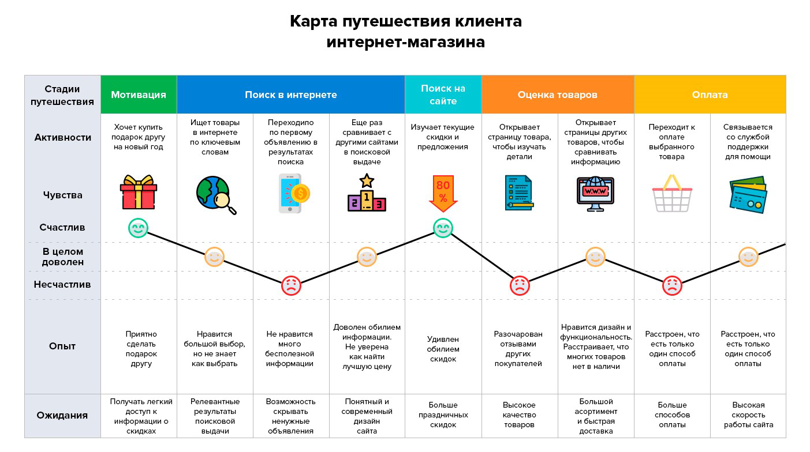
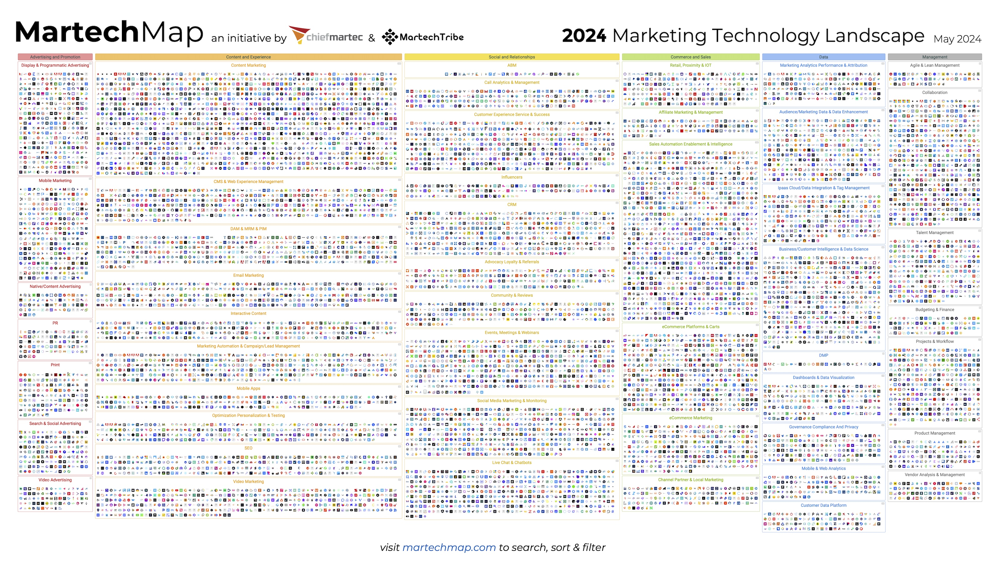

# Клиентоориентированность и управление впечатлениями

Итак, предметы метода (важнейшими из которых являются целевые системы, затем самые разные системы в окружении, подсистемы целевых, затем самые разные системы в графе создателей, но для каких-то методов это могут быть и описания, которые мы будем обязаны отслеживать в их привязке к системам, и даже поведения, например, сами методы и работы по методам) проходят в ходе их обработки на каких-то рабочих станциях некоторые смены состояния, которые сменяют друг друга в причудливом графе их состояний.

Мы можем излагать это самыми разными словами. Основная терминология нашего руководства взята из инженерного процесса в его современных версиях непрерывной/agile разработки. Но речь идёт об общих паттернах деятельности и общих паттернах описания этой деятельности. Experience management (тут намеренно опущено слово customer, ибо мы собираемся сейчас обобщить эту онтологию) говорит, что рассказ таки нужно вести с точки зрения изменения состояний создаваемой и обсуждаемой системы, причём в случае интеллектуальных агентов принимая во внимание:

* их впечатления: если агент самопринадлежен (люди), то «не нравится» или «нравится» будет побуждать агента к действию. С впечатлениями работают теории мотивации, которые по сути являются психологическими теориями (поэтому удовлетворительных таких теорий сейчас нет, у психологии как науки сейчас и в ближайшем будущем большие проблемы с воспроизводимостью результатов и надёжностью предсказаний тамошних теорий, подробней будет в руководстве по инженерии личности).
* их агентность (способность инициативно что-то сделать). Конечно, агентность в широком смысле есть у всех систем, но тут имеется в виду агентность разумного существа (да, и AI-системы тоже). Если фрезерный станок обрабатывает заготовку, то заготовка вряд ли убежит, если ей что-то не понравилось. Если продавец «убалтывает» потенциального клиента что-то купить, то этот клиент вполне может уйти в любой момент, не поддаться «гипнозу по выверенному скрипту». Как в любой момент может уволиться сотрудник, если он недоволен своей работой или недоволен человеческими отношениями на работе (а работой даже может быть доволен), или всем доволен, но понимает, что у него маленькая зарплата, или даже просто ему лень и он объявил себя «выгоревшим».
* неопределённости результатов одной (или даже множества) обработок, ибо результатом коммуникации (обработки чужой нейронной сетки) является её результат, а не намерение того, кто затеял эту коммуникацию. Если вы любя сказали человеку «идиот», а он вдруг дал вам по морде, то результат коммуникации — не воспринятая этим человеком ваша любовь, а ваше состояние «получил по морде». В производстве то же самое: если вы гнёте заготовку методом ABCDE, а она вместо того, чтобы согнуться, вдруг ломается, то результат — не ваше намерение получить результат метода ABCE, а состояние «заготовка поломана».

Можно использовать понятие «путешествия» по «точкам контакта» в том числе для «путешествия программной системы» или «гаджета». Вырисовывается некоторая онтология путешествия чего угодно, которая везде излагается разными словами, но для нас это изложение одного и того же, описывается одно и то же, и это нужно уметь распознать, чтобы переносить способ рассуждения о методе из одной предметной области с принятой там одной терминологией в другую предметную область с принятой там другой терминологией:

* **Наиболее абстрактное изложение** **в** **терминах** **типов** **мета-мета-модели:** есть альфа::тип как предмет инженерного процесса (в каждой предметной области этот предмет будет называться по-своему). Предмет этот будет особо отслеживаться в части смены своих состояний по всему ходу работ какого-то проекта/кейса. Кейс можно считать закрытым после приведения альфы в конечное состояние. Есть создатели в графе создателей, которые совместно двигают альфу по её состояниям, пытаясь как-то в этом сотрудничать, или хотя бы скоординироваться. Есть инженерный процесс, разложение которого на методы и определяет, что::метод и кем::роль будет делаться с альфой. Есть поток работ, который определяет, что::работа и кем::оргзвено, а ещё и когда::время будет делаться с альфой. По факту же действия идут с рабочими продуктами (ибо альфы всё-таки ментальные объекты, об их состояниях мы судим по рабочим продуктам). Инженерный процесс дальше мы раскладываем на отдельные частные методы во много уровней — и это больше похоже на функциональное программирование, а не на «пошаговое императивное программирование» и тем более не на «иерархическую декомпозицию». А потом у нас кейс-менеджмент, чтобы проуправлять оптимальным временем работы и задействованием ресурсов для затаскивания предмета кейса (он же — предмет метода) в нужное состояние. Для отслеживания состояния альфы для рабочих продуктов используем коллективный экзокортекс: систему версионирования, а для отслеживания кейсов — issue tracker. В экзокортексе держим описания как предмета метода (необязательно даже системы как вещи, могут быть и описания, а ещё альфа как объект внимания может перескакивать между объектами разной онтологической природы по ходу работ с ней), так и описания графа создателей (хотя тут могут создаваться и не системы, но мы широко протрактуем тут граф создателей — агенты, которые меняют состояния предметов метода, ибо для методов со сложным многоуровневым разложением может быть довольно-таки разветвлённый граф создателей).
* **в машиностроении** **в терминах «процесса разработки» или «инженерного процесса»** **с последующим разложением его на** **несколько уровней** **«практик»/practice.** Например, мы создаём и развиваем гравицапу, для которой мы применяем процесс «scaled грави-agile с поправками для цап». Наши самые разные инженеры (архитекторы, проектировщики, технологи и т.д.) двигают альфу гравицапы как воплощение целевой системы по её состояниям от «задумано», через «спроектировано» и «изготовлено» до «используется» и даже «выведена из эксплуатации» (взяты состояния из классического типового «водопадного» рассмотрения), пытаясь как-то скоординироваться. Гравицапа находится в состояниях «как замысел», «как проект/design», «в виде сырья», «готовая» и когда-нибудь «мусор». Чтобы не запутаться, версии проекта храним в PDM (информационная система product data management, хранение данных о продукте, и только о продукте), работы и прохождение состояний — в issue tracker (а поскольку мы современны, то это вместе называем PLM, информационная система product lifecycle management, определяемая как система хранения данных о продукте и ещё чём-то, в данном случае кейсах работы с продуктами, поддержка версионирования и управления кейсами, в софте это обычно в разных системах, а в машиностроении и строительстве — в одной), версии того, что происходит с воплощениями в ходе изготовления храним в ERP (ибо это «ресурсы», речь идёт об enterprise resource planning, и не путайте с «бухгалтерской системой» — в ERP есть алгоритм планирования ресурсов, в бухгалтерских системах его нет), версии в ходе эксплуатации в EAM (информационные системы enterprise asset management, и там ведётся учёт данных о поломках и ремонтах воплощений).
* **в менеджменте в терминах «рабочих процессов»**, где «функциональные единицы», они же оргроли, назначенные на оргзвенья и получившие все полномочия и ресурсы (ставшие оргвозможностями/capabilities) выполняют какие-то методы работы со «входами» и «выходами» как их предметами.
* **В терминах путешествий, контактов, точек контактов и обязательно впечатлений или опыта (experience)** там, где есть автономные интеллектуальные агенты, которые могут запросто сами что-то задумать и сделать. Обычно это люди, но могут быть сегодня и какими-нибудь AI-системами, а также коллективами из них всех (при этом коллективы вроде организации, «лица» мы ещё признаём как-то с натяжкой агентами, иногда даже государства признаём такими «лицами», но вот сообщества и общества, даже клиентуры и даже инвестуры — тут с агентностью проблема[^r7-1]). Если создатели с ними работают, то возникает проблема: агенты ещё и сами себе создатели, поэтому нельзя планово переводить их из одних требуемых состояний к другим –«лошадь можно подвести к воде, а заставить попить — нельзя». Ещё они могут быть сразу в двух или больше состояниях (выделяются подальфы) и появляться у провайдеров разных обработок в заранее неизвестном порядке (ибо ещё и сами ходят, а не их за ручку водят). И ещё у них есть свои впечатления от происходящего. Если эти впечатления (или в другой терминологии — полученный опыт) становятся отрицательными, то всё, можно списывать все предыдущие потраченные на них силы, результата (скажем, покупки) не будет. Впрочем, даже гравицапу можно испортить на любом шаге обработки, это не является чем-то особенным, гравицапа может прилететь на твёрдый пол где-нибудь в ходе строго предписанной последовательности обработок и погнуться, так что идея «путешествия» с незапланированными обработками в незапланированных точках контакта вполне может работать и тут. Понятно, что надо отслеживать experience (впечатления) агентов-людей в ходе контактов/touches (и тут много чего может быть разного в ходе контакта-как-процесса: вовлечение, обучение, формирование впечатлений, взаимодействие и т.д.) с нашими создателями/местами-обработки/местами-контакта/touchpoints. Но ещё можно подумать и о впечатлениях внешних проектных ролей при инженерном процессе с чем-то «не очень живым и агентным», с теми же гравицапами. У гравицапы впечатлений нет, а вот у проектных ролей (и внешних, и внутренних) в ходе проекта создания и развития гравицапы впечатления будут. Кто-нибудь их планирует?
* **… есть и множество других вариантов** **в самых разных предметных областях**. Вы должны понимать, что все эти варианты — попытки разными словами и немного разными понятиями рассказать про одно и то же, про метод/культуру/стиль/способ работы: какой-то создатель в какой-то роли берёт какой-то объект и проводит его через ряд состояний каким-то методом, причём можно разложить этот метод на составляющие, в том числе и разложить роль на подроли — примерно так, как мы обсуждали в первом разделе руководства. И для всех этих вариантов мы понимаем, что легко выразить что-то одно, но чуть труднее — что-то другое, поэтому приходится дорабатывать описания методов, если чего-то не хватает. И использовать при этом терминологию, привычную в той или иной предметной области.

В целом надо запомнить, что описание инженерных процессов работы с «людьми» и «с машинами» людям кажется одинаковым, «есть что-то, его надо провести по состояниям, то есть обработать в несколько стадий». Повсеместно мы получаем попытки работы с людьми «как в машиностроении», причём даже не в современном машиностроении по agile-процессам, а как в старинном машиностроении с классическим проектным управлением, то есть с «колбасками водопадов», строго линейными последовательностями (а не разветвлённым графом с циклами) прохода по ожидаемым состояниям. Если в учебнике все эти «стадии» и «фазы» выглядят красивыми, то в жизни всё будет ни разу не по учебнику: точек контакта заведомо больше, чем мы проектируем, результаты контакта будут не теми, что мы ожидаем, одновременно человек будет казаться находящимся в самых разных состояниях (например, будет одновременно покупать и ваш товар, и товар конкурента — то есть состояние «наш клиент» и «не наш клиент» одновременно). А главное — он самопринадлежный, у него есть агентность, то есть автономность и инициатива действия, способность самостоятельно ставить цели и достигать их, иногда соглашаясь с тем, что ему предлагают всякие желающие его провести по каким-то стадиям «промывки мозгов» (с благими или злыми намерениями — это неважно, или это мошенники, или это наши рекламщики, или это учителя в обучении), но иногда и действуя вопреки, а иногда ещё и действуя агрессивно вопреки, и ещё иногда в кооперации с какими-то другими агентами.

Поэтому вместо всяких там «жизненных циклов» или «стадий-этапов» или даже «инженерных процессов» мы меняем позицию восприятия, говоря о впечатлениях этого агента в какой-то роли, вводим метафору «путешествия» по каким-то точкам контакта, подразумевающую непредписанность маршрута (хотя и есть некоторый «желаемый нами» маршрут, от которого наш агент в любой момент может отойти), да ещё и говорим, что маршрут совершенно необязательно линеен. Мы имеем «карту местности» с этими touchpoints (journey map) и как-то отслеживаем типовые маршруты, по возможности выявляем незапланированные точки контактов, замеряем впечатления пользователя (желательно с использованием actionable метрик — чтобы понимать, что происходит, а не просто знать «агент недоволен, впечатления плохие»).

В маркетинге этот подход уже более-менее мейнстримный, customer journey уже в развитых странах вытеснил sales funnel, но по факту понимается он не как «причудливое путешествие» вместо «строгой последовательности шагов», а как «смена позиции восприятия». «Водопад» в мышлении оказывается бессмертен.

На диаграммах сейчас какой-то гибрид. Посмотрите на картинки: о нелинейном customer journey в тексте говорят «как надо», а иллюстрации приводят такие, что воронка продаж и путешествие клиента оказываются неразличимыми. Это та же «колбаска» прохода разных обработок клиента для перевода клиента в разные состояния, только там вроде как чуть побольше стадий и они более красочно нарисованы (вероятно, чтобы отразить «впечатления»). Вот типичная customer journey map[^r7-2], пример на русском:

Если вы хорошо усвоили материал перехода от «водопада» к «agile» и понимаете, что люди идут по такой карте отнюдь не в указанной последовательности, а уж как придётся, заодно получая информацию отовсюду (в том числе от других магазинов), то вы уже понимаете, что на картинке — утопия, так работать никогда не будет, на реальную жизнь эта картинка не похожа. Увы, большинство картинок journey mapping дают похожие результаты: люди, воспитанные на «водопаде» и школьном алгоритмическом языке выражения «последовательностей действий», выдают желаемое за действительное: показывают метод (а хоть и с точки зрения предмета метода, а не создателя, который применяет метод) как последовательность шагов. Иногда это срабатывает для каких-то не слишком живых систем, но даже для них срабатывает редко, а если речь идёт о людях как системах, которых пытаются привести в какое-то состояние — то и совсем редко, если вы не заставляете их что-нибудь делать под дулом пистолета.

Маркетологи уже договорились, что вообще неплохо бы иметь «бесконечное путешествие» — и продавать, продавать, продавать по up-sales и cross-sales что-нибудь до самой смерти или компании, или клиента, а также вербовать в сотрудники (делать из клиентов собственный touchpoint — загонять в сообщество клиентов, предлагать рекомендовать продукт знакомым, вовлекать в помощь другим клиентам в пользовании продуктом, разгружая свои колл-центры, и т.д.). Это всё было «управление жизненным циклом» клиента, теперь это стало «управлением путешествиями» клиента (customer journey management), хотя картинки и остались почти прежними (на них стадии обработки остались, но результат обработки теперь ещё и включает опыт/впечатления — чтобы не забывали о смене позиции восприятия с «как задумал маркетолог» на «как отреагировал на эту задумку клиент»).

Важно, что «путешествие» — это процесс/метод, поэтому формально для операционного управления там можно поставить управление кейсами (case management) как вариант управления процессами (process management). Ещё и нужно помнить, что клиентов много, там сообщество — клиентура, поэтому редко говорят по отношению к клиентуре об управлении проектами, чаще — управлении процессами. Подробней об этом ещё будет в руководстве по системному менеджменту. Пока же запомним, что в случае личности, с которой вам нужно работать как развиваемой вашим проектом системой, надо дополнительно отслеживать по сравнению с классической инженерией:

* **«Клиентоориентированность»** как смещение референтного индекса с «удобно и важно компании» на «удобно и важно клиенту» — вот это и называют «клиентоориентированность», хотя это очень ограниченный термин. По факту — это «проектная роль-ориентированность» (ибо всё то же самое будет с работниками самой компании, учащимися, инвесторами и так далее). Надо моделировать не только то, что делает с целевым человеком какой-то заинтересованный в «промывке мозга» исполнителя какой-то проектной роли (покупателя, сотрудника компании, инвестора, ученика и т.д.) сотрудник компании, но главным образом моделировать по результатам актуальных замеров происходящее в самом человеке с точки зрения самого этого человека: чему он научается (а не только чему мы хотим научить), например, есть ли у него мастерство лояльности, мастерство пользователя, мастерство покупателя товара (если речь идёт о клиенте).
* Управление впечатлениями. Оценка реальных впечатлений по сравнению с ожиданием этих впечатлений должна оставаться положительной. Нужно моделировать по реальным замерам впечатления по ходу путешествия агента (замерять что-то, а затем косвенно определять впечатления — ибо на постоянные расспросы «потратьте пять минут на то, чтобы оценить наш продукт» люди реагируют уже крайне нервно), а не только иметь проект впечатлений, которые хотят дать сотрудники. Это называют не «клиентоориентированность», а experience management: управление впечатлениями по мере путешествия по точкам контакта. Управлять впечатлениями — это проектировать такие точки контакта, чтобы контакты в них оставляли положительные впечатления, «превосходили ожидания».

Клиенториентированность и управление впечатлениями не так просты, их нельзя огульно применять «в лоб». Например, рассмотрим впечатления клиента «качалки», где на тренировке его встретили, усадили в кресло, вместо него покачались-поотжимались-поподтягивались и даже толкнули штангу, а ему в это время предложили попить апельсиновый сок, затем помогли одеться — и всё, тренировка окончена, можно говорить о положительных впечатлениях от тренировки и ожидать повторного прихода. Не факт, что повторный приход будет.

Или другой вариант: клиента встречает тренер, через час клиент на полусогнутых выползает из этой качалки, думая, что «хорошо, что не надо было скорую вызывать» и «никогда не думал, что я столько подниму». Что там с впечатлениями от этой тренировки::touch в качалке::touchpoint? Голосовать своим кошельком клиент будет за тренировку-развлечение или тренировку-обучение? А если речь идёт о «качалке по высшей математике»? А если речь идёт об освоении системного мышления и методологии по их руководствам для инженеров-менеджеров? Всё в мире впечатлений и их оценок не так однозначно, существенно зависит от культуры той или иной предметной области.

Если у вас не B2C, а B2B проект, всё существенно усложняется, хотя общая канва рассуждений остаётся той же: про впечатления людей. Но разнообразие ролей в B2B проектах даже в случае продвижения (маркетинг, реклама, продажи) будет не один customer и он же user, а много больше (кто-то выбирает, кто-то заказывает, кто-то платит, кто-то получает продукт или услугу). А ведь все роли надо будет «убалтывать» на разное, у всех агентов в этих ролях будут разные путешествия, разные обработки в разных точках контакта, получать они все будут разные впечатления. Впрочем, и в B2C отнюдь не всегда все решения принимает один человек: иногда надо уговорить не пользователя-клиента, а члена его семьи или даже друга, которые и примут решение.

Собранность как удержание (в компаниях — коллективного) внимания на каком-то объекте сегодня обеспечивается не «ментальными практиками», а информационными системами: базами данных, которые помнят о состояниях самых разных объектов, получаемых в ходе их путешествия (и вы к слову «путешествие» сами должны добавить «по точкам контактов» и подумать о разветвлённом графе состояний объекта как предмета метода. Эти состояния меняются в ходе собственно контактов как обработок этих объектов как предметов метода по каким-то методам. Вот это и есть онтологическое мышление: видите одно слово для понятия какой-то онтики, восстанавливаете в этом месте полную онтику). Эти информационные системы служат для усиления возможностей головного мозга, они как бы «внешняя кора головного мозга», экзокортекс (по аналогии с неокортексом — это «новая кора» как часть головного мозга человека, которая отвечает за высшие психические функции). Термин «экзокортекс» был предложен довольно давно, напрямую связывается с нейроинтерфейсами и относится к фантастике и трансгуманистическим технологиям[^r7-3]. В 21 веке стало понятно, что усиливать способности к мышлению (прежде всего за счёт возможности управлять вниманием и обеспечивать надёжную память) могут даже карандаш и бумага, а уж компьютер — тем более. А поскольку собранность (управление вниманием и памятью) нужна не только индивидуальная, но и коллективная, то термин прижился. Мы будем называть корпоративные информационные системы коллективным экзокортексом, чтобы подчеркнуть, что речь идёт прежде всего об удержании коллективной собранности: удержание в корпоративном внимании и обеспечении надёжной памяти для сведений о состояниях самых разных предметов методов, которыми занимается компания. Для обсуждения программного обеспечения, используемого как личные и корпоративные экзокортексы, есть даже чат «Экзокортекс (МИМ)»[^r7-4]. При этом идея экзокортекса продолжает развиваться для других классов программного обеспечения, например, предполагается использование AI-агентов как экзокортекса[^r7-5].

Экзокортексы для «клиентоориентированности» и «управления впечатлениями» будут предлагаться самые разные, часть из них будет прямо поддерживать «водопад» (по-старинке они будут хвастаться тем, что «реализуют классическое проектное управление», как будто это хорошо), часть — кейс-менеджмент (по-современному это и будет «проект» с планированием чаще всего «на лету» и ведением case files, «папок дел»). Ещё часть будет поддерживать старинное «процессное управление», где 95% экземпляров процессов проходят по стандартному маршруту, а 5% становятся дикой головной болью ввиду нестандартности своего путешествия и неминуемых отрицательных впечатлений при нерешении проблем, они занимают 95% времени на внимание к себе. Вот примерно так выглядел вариант процессного управления нулевых годов 21 века, до появления кейс-менеджмента для agile инженерных процессов, где эти 5% кейсов — просто кейсы, штатная, а не «проблемная» ситуация.

Везде будет примерно одна и та же ситуация путешествия какого-то предмета метода по разным его состояниям в ходе получения сервисов-контактов от разных точек контакта, но поскольку предметная область другая, то и названия будут другие. Наши материалы мета-мета-модели и примеры терминологии нужны, чтобы во всём это быстро ориентироваться.

Скажем, только в области маркетинга вам в 2024 будет предложено 14106 софтверных продуктов самых разных типов (MarTech — маркетинговые технологии), и по факту вы можете сказать, что все они поддерживают собранность работников служб продвижения, помогают планировать и реализовывать клиентские путешествия[^r7-6]:

Что из них вам надо? Что не надо? Что из них поддерживает допотопные способы мышления? Что заведомо не сработает?

Понятно, что таксоны в классификации MartechMap взяты «исторически» и ничему осмысленному не соответствуют. Легко найти множество других классификаций (ни один термин в этих классификациях не повторяется, они построены на разных принципах, отражают принципиально разные описания маркетинга! хотя повсеместно повторяются уже знакомые нам слова: marketing, experience, customer, channel, journey). Конечно, все поставщики софта называют свои продукты «платформами», уже давно не «приложениями» и не «комплексами/suite». Эти «платформы» обычно пытаются сделать необъятными в числе поддерживаемых прикладных модулей (тех же «приложений»). Если вы поняли, что путешествие потока заготовок по машиностроительному заводу (отслеживается классом софта ERP, enterprise resource planning) эквивалентно путешествию клиента по точкам контакта, то легко представить, что оно будет отслеживаться каким-то вариантом ECRP как эквивалентом ERP в машиностроении (enterprise client resource planning, планирование клиентских ресурсов предприятия, пошутим так), но тут же эта первая приходящая на ум аналогия не выдерживает критики: на склад «клиентские заготовки» и «клиентские полуфабрикаты» не положишь, «клиентское сырьё» на условиях just-in-time не закупишь.

Поэтому приходится каждый раз разбираться, но это разбирательство идёт не с понятийного нуля, методология даёт выигрыш в скорости разбирательства. Речь идёт о выполнении компанией каких-то аналогов инженерных процессов над агентами, которые планируются к выполнению самых разных внутренних и внешних ролей (в английском всё это будет — stakeholders). Мышление про эти инженерные процессы может быть устроено одинаково, оно включает разбирательство с весьма компактным набором типов, который будет знаком ещё до вашего знакомства с конкретной предметной областью, её методами работы, софтом и другими инструментами, которые поддерживают эти методы. Причём это всё важные объекты, а не «какие-нибудь» объекты. Это именно те объекты, изменения состояний которых в ходе их разработки, развития, изменения надо будет в этой новой предметной области отразить в чеклистах. Можно считать, что список этих объектов (выполняющая метод над предметом метода роль, или организующая путешествие агента для обучения агента и отслеживающая впечатления этого агента роль — можно очень по-разному говорить об одном и том же, и это самое начало краткой онтологии методологии) — это «чеклист методолога», он вами проходится в тот момент, когда вы изучаете новую ситуацию (а ситуация каждый день будет новой даже в старом проекте, жизнь не остановишь).

Пример тут — как рассуждать о том, как какого-то «проходящего мимо агента» готовят к выполнению какой-то роли, организуя его путешествие:

* **Customerjourney—** мы только что довольно подробно рассмотрели вопрос про клиентское впечатление. Отдельно можно говорить о пользовательском (как становятся пользователем продукта, но необязательно платящим, например, на тарифных планах free в бизнес-моделях freemium[^r7-7]) и именно клиентском путешествии как путешествии пользователя, который таки заплатил и находится в финансовых отношениях с компанией, получает «премиальное обслуживание». В любом случае, «клиенториентированность» идёт от клиента, customer. И eXperience management с идеей journey начинался именно на примере customer. Путешествия других проектных ролей с отслеживанием их впечатлений были предложены позднее.
* **Employeejourney** тут идёт по примерно такой же линии рассуждений, только тут не клиентоориентированность, а сотруднико-ориентированность. И тут тоже отход от «водопада» к разным траекториям/путям/маршрутам путешествия по организации, и это тоже надо отслеживать. И там тоже eXperience/впечатление/опыт, вовлечение/engagement, мотивирование, попытки проектирования маршрута и неожиданные места контакта (touchpoints) с неожиданными результатами этих контактов, в конечном итоге — превращения «проходящего мимо человека из целевой аудитории» в кандидата на занятие вакантной должности, а затем сотрудника на этой должности, с возможным ещё карьерным путешествием career journey и тоже обязательным отслеживанием впечатлений и индивидуализацией этих путешествий.
* **Learner** **journey** — тут всё то же самое, и тоже индивидуальные учебные программы при понимании, что без автоматизации ничего хорошего из индивидуализации обучения не получится, а автоматизация труда ученика невозможна.
* **Community** **member journey,** и тут тоже полно всяких «платформ» по поддержке сообществ, и тоже «путешествие, которое мы планируем» существенно отличается от «путешествия, какое было у члена сообщества», а ещё у сообществ не всегда чётко определённое членство и главное — сообщества не имеют чётко определённой одинаковой культуры, которую можно было бы легко поддержать софтом. AI это вроде должен менять, но пока это всё только в далёких планах.
* **Investorjourney,** ибо инвестора надо где-то найти, затем провести с ним переговоры и дальше поддерживать с ним отношения, а этих инвесторов может быть много (впрочем, даже если и один, у него тоже будет «путешествие» по отношению к компании).
* -- ... много всего такого, называемого очень по-разному, и хорошо бы экономить мышление и понимать, что это всё одно и то же, в ходе своего исторического развития ползущее от первого к третьему поколению системного мышления, то есть от рассмотрения «агента в проектной роли» к пониманию того, кто и каким инженерным процессом привёл этого агента к занятию этой проектной роли, а затем продолжает и продолжает развивать этого агента. Надо отличать «водопадные» представления от «путешествий», а также понимать, чем корпоративный софт по поддержке отслеживания «водопадов» отличается от софта по поддержке отслеживания «путешествий».

Экзокортекс для коллективного отслеживания всех этих «путешествий» имеет самые разные названия:

* Для «путешествия» софта или классических инженерных систем будет использоваться internal engineering platform, занимаются этим platform engineers[^r7-8].
* Для «путешествий» клиентов будут использованы системы CRM (customer relationship management[^r7-9]), заниматься этим будут в службе продаж, или CXP (customer experience platform[^r7-10]), заниматься этим будут в самых разных службах (и чаще службах маркетинга, как основных, а не только службах продаж),
* Для «путешествия» сотрудников этим будут заниматься административные системы (employee experience platform[^r7-11]), заниматься этим будет администрация предприятия
* … и так далее.

Не всегда stakeholder journey map (общее название для описания путешествия агента по занятию и развитию какой-то роли) соответствует реальным путешествиям, ибо всегда есть какие-то неосознанные (и поэтому не описанные и не поддержанные соответствующими платформами), но важные состояния агента в этом путешествии, а также всегда есть не осознанные (и поэтому не описанные и не поддержанные соответствующими платформами) влияния в не осознанных точках контакта, которые меняют состояния агента в его путешествии по графу состояний на пути к занятию роли и дальнейшему развитию своих навыков работы в роли. Надо быть всегда начеку, надо заниматься постоянным развитием своих платформ, развитием экзокортекса компании.

Надо выявлять незапланированные части путешествий предметов метода даже для не очень живых продуктов. Например, вы отдаёте на завод информационную модель, завод раздаёт её фрагменты для «изготовления по кооперации» (то есть отдаёт субподрядчикам), там «улучшают» части 3D-информационной модели изделия/продукта, полученные от КБ, причём делают (иногда из самых лучших побуждений!) круглое квадратным и наоборот. Потом все эти изменённые непонятно кем непонятно где (и не проверенные поэтому конструкторским бюро) информационные модели изделия превращаются на заводе в металлические части, которые не могут быть собраны вместе. Почему? Неучтённый в internal engineering platform внешний touchpoint (а теория говорит, что обработки предметов метода могут происходить и в незапланированных точках, это всегда надо ожидать), где информационная модель изменяется подрядчиками завода по каким-то своим соображениям. Как решать эти проблемы? Отследить маршрут информационных моделей и резко снизить затраты времени и нервов (eXperience всех участников инженерного процесса) на согласование изменений информационных моделей с КБ.

Другой пример будет в методе «пропитки» как подготовке к организационным изменениям из руководства по системному менеджменту: решения принимаются не теми, с кем вы разговаривали и кого уговаривали, а какими-то их влиятельными друзьями, с которыми советуются вроде бы «принимающие решения лица». Вы уговорите начальника что-то сделать, но в последний момент он посоветуется со своим другом, который будет против этого просто потому, что не хочет рисковать сам и начальнику будет советовать «не рисковать!». Этот друг ничего не знает про ваши аргументы, вы же не с ним разговаривали! В результате посоветовавшийся со своим другом начальник легко откажется от договорённостей с вами: своему менее разбирающемуся в ваших аргументах другу начальник верит больше, чем вам. А этих друзей будет несколько. Поэтому «убалтывать» надо этих друзей, а поскольку вы не знаете, кто они, то хорошо бы уболтать вообще всех потенциальных «советчиков лица, принимающего решения» — и тогда нужное решение не встретит скрытого сопротивления. Это всё экземпляры общего рассуждения, customer experience management и customer journey тут только примеры (скажем, вам надо убедить купить какой-то продукт не только клиента, но и друзей клиента, поэтому знать о продукте и его свойствах хорошо бы не только покупателю, но и всем вообще людям — вы не знаете, кто будет давать по поводу покупки вашего продукта последний самый важный совет потенциальному покупателю).

Этот поиск незапланированных/незапрошенных/паразитных «рабочих станций»/«мест контакта»/«сервис-провайдеров» — общее рассуждение. Думать надо о путешествии в целом, включая как вами спланированные пункты контакта и спроектированную часть путешествия, так и не вами спланированные (паразитные) пункты контакта и незапланированную вами часть путешествия.

[^r7-1]: <https://ailev.livejournal.com/1735626.html>

[^r7-2]: <https://en.idei.club/39599-customer-journey.html> — на этой странице собрано множество journey maps

[^r7-3]: <https://transhumanism.fandom.com/wiki/Exocortex>

[^r7-4]: <https://t.me/exocortexssm>

[^r7-5]: <https://arxiv.org/abs/2406.17809>

[^r7-6]: <https://chiefmartec.com/2024/05/2024-marketing-technology-landscape-supergraphic-14106-martech-products-27-8-growth-yoy/>

[^r7-7]: <https://en.wikipedia.org/wiki/Freemium>

[^r7-8]: <https://platformengineering.org/>

[^r7-9]: <https://en.wikipedia.org/wiki/Customer_relationship_management>

[^r7-10]: <https://www.gartner.com/reviews/market/digital-experience-platforms>

[^r7-11]: <https://www.zendesk.com/internal-help-desk/employee-experience-software/>
