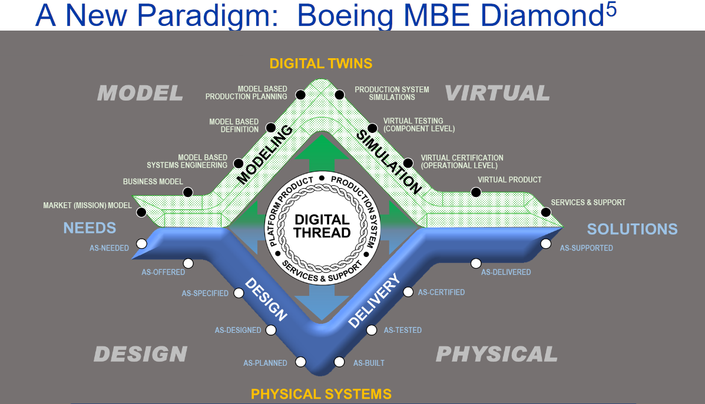

# Элегантность/lean за счёт повышения точности моделирования и изготовления

<strong>Инженерный процесс в целом раскладывается в спектр самых разных методов инженерной работы.</strong> <strong>V-диаграмма выделяет в этом спектре основных две группы методов: «левую часть» и «правую часть» как «методы работы с моделями системы» и «методы работы с физическим воплощением системы» соответственно.</strong>

Для V-диаграммы был сформулирован классический слоган системной инженерии: <strong>все возможные работы</strong> <strong>по методам</strong> <strong>правой части диаграммы нужно переносить в левую часть.</strong> Это означало, что всё, что можно сделать на стадии описания/моделирования будущей системы, нужно делать именно на этой стадии: битами много дешевле оперировать, нежели атомами, особенно если речь идёт о сложных дорогих системах типа самолёта или энергоблока атомной электростанции. Вот данные INCOSE по стоимости исправления ошибок в зависимости от стадии типового жизненного цикла водопадного проекта (2013)[^r7-1]:

|  |  |
| --- | --- |
| <strong>Стадия</strong> <strong>обнаружения ошибки</strong> | <strong>Стоимость исправления</strong> |
| Требования | x1 (единица отсчёта) |
| Проектирование | x5 |
| Строительство | x12 |
| Проверки | X40 |
| Эксплуатация | X250 |

Это иллюстрация хорошо известного вам уже тезиса уменьшения стоимости переделок/re-work: работать надо так, чтобы уменьшать число переделок, ошибки на одних стадиях не пускать на другие стадии. В Tesla на каждой заводской операции есть и входной контроль (чтобы в обработку не попал ошибочный предмет метода, и мы не потратили бы ресурсы на его переделку), и выходной контроль (чтобы брак не попал в работу — и кто-то дальше по конвейеру не потратил ресурсы на ненужную работу, ибо потом всё одно пришлось бы переделывать). Ошибки надо обнаруживать и устранять рано, проверять ошибки надо постоянно, они ведут к чудовищным тратам ресурсов, если обнаружены позже: переделка для поздно обнаруженной ошибки будет стоить очень дорого!

В современных условиях не-водопада этот тезис можно переформулировать так, что:

* Вся возможная подготовка производства (включая тестирование) должна быть выполнена в информационных моделях, а не на готовой системе. Лучше лишняя модель, чем лишний прототип. С этим регулярно спорят, но по мере нарастания точности моделирования эти споры стихают. Раньше первый экземпляр нового самолёта не взлетал. Теперь первый экземпляр самолёта гарантированно взлетает. Прототипирование становится моделированием. Это не исключает того, что мы получим богатый отклик от пользователей, когда к ним попадут первые же экземпляры системы, но эти экземпляры системы будут работать!
* Моделировать будет дешевле, если больше уделять внимание моделированию надсистемы (потребности, концепция использования) и только потом — моделированию целевой системы (начиная с концепции системы, а в ней — с методологических/функциональных описаний). Собственно, это просто отсылка к главному тезису системного мышления: от границы системы думай всегда сначала про окружение, понимай функции системы в целом в этом окружении, и только потом — думай про про части системы: что они должны делать::функция, каковы::конструкция они должны быть, из чего::аффорданс их можно сделать.

Описание системы сводится к её самому разному моделированию. Поэтому примат работ по описанию системы перед работами по воплощению можно трактовать как призыв к максимизации безошибочного (другого нам не надо!) моделирования разного рода по сравнению с работами по изготовлению и наладке физических систем, то есть воплощений системы. Думай, думай с компьютером, моделируй много раз — и только потом один раз сделай в физическом мире.

Современность, конечно, к этому добавила:

* Моделировать нужно будет много раз, ибо «непрерывное всё». Не получится отмоделировать всё один раз под чётко определённые требования: концепция системы постоянно изменяется в ходе проекта, жизнь ведь не остановишь. «Зафиксировать требования» (даже не просто задокументировать, а именно что «зафиксировать», сделать неизменяемыми), а дальше «выполнить требования во что бы то ни стало» (если уже понятно, что гипотеза о том, какова должна бы быть система, не подтвердилась) сегодня считается плохой практикой. Хорошая практика — проверить гипотезы по концепции использования, потом откорректировать по итогам проверки, проверить опять — и так длительно развивать систему после выпуска MVP. А ещё нужно разбить систему на конструктивы/модули, используя знания по архитектуре. Архитектура стала отдельной от разработки с её моделированием дисциплиной, в том числе озабоченной тем, чтобы разработку разбить на максимально независимые части, которые ведутся асинхронно разными командами — и сама идея стадий/этапов/фаз оказывается не работающей, ибо команды асинхронно выпускают новые версии своих частей. Никто никого не держит.
* И делать надо много раз, в том числе не всю систему, а отдельные её части. Если правильно разбить систему на части (максимально независимые, но всё-таки взаимодействующие для получения эмерджентных свойств системы в целом) и организовать способы их взаимодействия, то переделывать можно будет не всю систему, а только часть. И дальше систему нужно будет развивать, переделывая в физическом мире её отдельные части, и это будет эволюционно долго, а не один раз. «Непрерывное всё» включает в себя непрерывную разработку, непрерывное изготовление, непрерывные испытания, непрерывное разворачивание, непрерывный ввод в эксплуатацию всё новых и новых версий системы со всё новыми и новыми свойствами, система уже понимается не как «экземпляр/организм», но как «развивающийся вид из многих заменяющих друг друга поколений экземпляров/организмов».

Моделирования в современной разработке по сравнению с древним «водопадом» тем самым стало не меньше, а больше — просто «много моделируй, а один раз сделай» стало само выполняться много раз в ходе развития системы.

«<strong>Моделирование</strong> в широком смысле — это эффективное по затратам использование чего-то одного вместо чего-то другого для мыслительных целей. Это позволяет нам использовать вместо реальности что-то такое, что проще, безопаснее или дешевле чем реальность для заданной цели; модель является абстракцией реальности в том смысле, что она не может представить все аспекты реальности. Это позволяет нам иметь дело с миром упрощённым способом, обходя сложность, опасность и необратимость реальности»[^r7-2].

<strong>Мы не тратим силы на обсуждение и обработку ненужных деталей моделируемого объекта. Модели—</strong> <strong>это</strong> <strong>«правильные упрощения».</strong> <strong>Обсуждаем только то, что отмоделировано, то, что важно, что нужно.</strong>

Для того, чтобы убедиться в отсутствии ошибок, прибегают к формальному моделированию. Формализация — это дорогая по ресурсам операция, поэтому неправильно формализовывать всё подряд. Поэтому нужно тщательно выбирать то, что именно станет формальной моделью — и не допускать лишней формализации, это трата сил впустую.

Но зато формальную (на основе математики) модель можно относительно легко проверить на формальную правильность — вручную или даже компьютером. В случае возможности сведения к чисто логическим (не численным) моделям это называется <strong>проверкой моделей</strong> (model checking)[^r7-3]. Так, в радиосхеме можно формально удостовериться, что все её компоненты соединены и нет неприсоединённых компонент, все соединения не имеют разрывов (то есть не идут откуда-то в никуда). А теперь представим, что речь идёт о радиосхеме из полусотни миллиардов транзисторов (компьютерном чипе). Конечно, проще сделать проверку модели (то есть проверку проектного описания, по которому потом будет сделан компьютерный чип), затем убедиться, что процесс изготовления воплощения системы по модели точный (иначе бессмысленно делать безошибочные модели — ошибки будут внесены при изготовлении), чем пытаться как-то исправить на всех экземплярах чипа ошибку в отсутствии какого-то соединения, которую «прозевали» в модели, в «радиотехнической» схеме чипа. Это, конечно, упрощённое представление происходящего в разработке компьютерных чипов, но отражает основные идеи. И для всей инженерии эти идеи те же самые — ранняя формализация, раннее обнаружение ошибок, затем высокая точность изготовления по безошибочным моделям. И дальше всё работает с первого раза.

Формальную модель системы можно подвергнуть оптимизации (в том числе компьютерной) по самым разным критериям, в том числе многим ранжированным критериям. С формальной моделью может работать поиск/search — искать вычислительными методами оптимальное решение в пространстве решений (при этом модель может быть даже деформализована для поиска оптимума, речь тут идёт о так называемых дифференцируемых архитектурах[^r7-4]).

Где физический объект (воплощение системы) изготовлять долго и дорого, можно ограничиться быстро составляемой информационной моделью, и всё-таки получить ответ на вопрос — с какой-то степенью точности.

Формальную модель можно не делать руками, а породить/generate компьютером — это решение проблемы сложности. Так, 4 триллиона транзисторов на современном микрочипе[^r7-5] невозможно нарисовать руками на кремниевой пластине, и даже невозможно руками нарисовать принципиальную схему такого микрочипа. Но можно породить и принципиальную схему, и литографическую маску из моделей более высокого уровня абстракции на языке описания микросхем. Получается так, что методы работы потихоньку сдвигаются:

* С изготовления на моделирование: методом проб и ошибок на «проектирование проб — и они оказываются безошибочными». Для уменьшения числа ошибок воплощения моделей в физическом мире поднимается точность моделирования.
* С моделирования «головой» на компьютерное моделирование, при этом размер и безошибочность моделей растут. С изготовления руками на изготовление инструментами, причём компьютерно-управляемыми инструментами, это тоже поднимает безошибочность.

<strong>Метод проб</strong> <strong>(мутаций)</strong> <strong>и ошибок</strong> <strong>(эволюционного выживания)</strong> <strong>остаётся ведущим,</strong> <strong>он</strong> <strong>работает принципиально! Но тренд в том, чтобы уменьшить</strong> <strong>потери ресурсов и уменьшить время разработки даже при большом количестве потраченных ресурсов:</strong> <strong>число материальных проб (с первого раза—</strong> <strong>должно работать правильно!) за счёт множества проб на моделях</strong> <strong>с необходимой точностью</strong> <strong>(smartmutations—</strong> <strong>делаются</strong> <strong>изменения-мутации с максимальной вероятностью достижения целей безошибочного моделирования)</strong> <strong>и затем</strong> <strong>по возможности точного изготовления.</strong>

С использованием компьютерного моделирования резко поднялась точность и безошибочность основанного на проверяемых моделях проектирования и одновременно резко поднялась точность изготовления деталей. Компьютерное управление конфигурацией и изменениями позволили в разы снизить количество конфигурационных коллизий, уменьшить тем самым число переделок. <strong>Этот переход к элегантной разработке (lean,</strong> <strong>«ничего лишнего», никаких</strong> <strong>rework,</strong> <strong>никакихзастреваний на</strong> <strong>workinprogress)</strong> <strong>резко</strong> <strong>ускорило разработки, в разы.</strong>Если вам говорят, что самолёт или автомобиль, а также компьютерный чип сегодня разрабатывать дольше, чем раньше — не верьте: сложность и характеристики этих самолётов, автомобилей и компьютерных чипов просто несопоставимы с теми, что были раньше. Раньше их было бы разработать не просто дольше — их разработать было бы запредельно долго, попросту невозможно. Не было таких методов работы, не было инструментов, и стоимость разработки должна была бы включить и стоимость разработки методов работы со всеми их теориями и инструментарием. И не берите тут примером государственные проекты, там высокое искусство траты дармовых денег налогоплательщиков с их максимизацией по величине и длительности в оплату за ненужные работы и ненужные функции, поэтому разработки ведутся дольше, дороже, а результаты хуже, чем в частном секторе. Космические программы тут не пример успеха, а пример провала — пока речь не зашла о коммерческом космосе в исполнении SpaceX. В этот момент многим государствам пришлось переформатировать свои инженерные космические программы — и они стали ближе к описываемым тут принципам инженерии.

Точность моделирования и точность изготовления (а точность — это следствие формальности моделей и облегчения проверок) привела к потере актуальности традиционной шутки про необходимость для каждой детали «подгонки по месту напильником». Все изготовленные (не вручную!) по тщательно продуманному и отмоделированному проекту/design и методу изготовления (например, на станке с ЧПУ или 3D-принтере) детали просто собираются в целую систему, и она работает как описано проектировщиками. То же относится к мастерству, которое изготавливается в людях и AI-системах при изучении ими какого-то метода работы, хотя тут всё в разы менее формально. То же относится к программной инженерии, к генетической инженерии, к организационному развитию в менеджменте.

Это соответствует одному из слоганов системной инженерии: «с первого раза правильно», т.е. первое же воплощение системы должно быть работоспособно, его не нужно дорабатывать, а дорабатывать нужно описания-модели. Не всегда ещё так получается, не у всех команд и не во всех областях деятельности, но всё чаще, чаще и чаще. Так, из сорока полётов на Марс до настоящего времени только половина закончилась успешно. Но команда системных инженеров Индии сумела отправить на орбиту Марса в 2013 году ракету с первого раза[^r7-6]. Современность к этому только добавляет: никакая ракета на Марс, никакая запущенная в эксплуатацию система не будет у вас последней. «С первого раза правильно» надо делать всё время, моделировать и точно изготавливать нужно всё время — все многочисленные версии развиваемой (как вид) системы.

<strong>Практика интеграции (сборки из плохо подогнанных друг ко другу частей и связанного с этим решения системных проблем) была раньше одной из основных практик системной инженерии, вы можете её увидеть в</strong> <strong>V-диаграмме как «привет из прошлого». Сейчас из</strong> <strong>набора основных практик</strong> <strong>системной инженерии практика интеграции исчезла,</strong> <strong>а</strong> <strong>сборка стала рутинной нетворческой операцией.</strong> <strong>Это произошло главным образом за счёт тщательного системного моделирования (а потом изготовления отмоделированных деталей с большой точностью по размерам и другим физическим свойствам).</strong> <strong>А управление конфигурацией позволило начинать работу по новой конфигурации</strong> <strong>даже тогда, когда предыдущая конфигурация ещё не изготовлена, не испытана, и не эксплуатируется—</strong> <strong>но инженеры-разработчики уже знают, как следующую версию системы сделать лучше.</strong> <strong>Новая версия космического двигателя начинает разрабатываться сейчас раньше, чем текущая успела слетать в космос—</strong> <strong>ибо уже по итогам инженерных обоснований становится понятно, что там можно улучшить, развить. Хорошо налаженное управление конфигурацией в рамках принятого метода разработки позволяет не запутаться с различными версиями проекта/design</strong> <strong>системы и самого воплощения системы, не допустить конфигурационных коллизий, тем самым не допустить переделок/rework—</strong> <strong>и сэкономить время и ресурсы.</strong>

Моделирование по мере развития методов инженерии стало частью разложения методов описания системы (раньше — левая часть V-диаграммы), но модели начали использоваться и при изготовлении системы (раньше — это правая часть V), а в последнее время и при эксплуатации (третья часть дополненной V, перекладина в V‾‾). Для готовой эксплуатирующейся системы эта часть методов инженерии получила название <strong>использование</strong> <strong>«цифрового двойника»/«digitaltwin»</strong>, а сама система (воплощение системы) тем самым стала <strong>«физическим двойником»/«physicaltwin».</strong> Все разные вычислители/computers с моделями, датчики и актуаторы/эффекторы самой готовой системы при этом связаны <strong>«цифровой нитью»/digitalthread.</strong>

Когда просто пытались избавиться от конфигурационных коллизий, автоматизируя передачу данных из одной инженерной базы данных в другую (ручной ввод был и крайне медленным, и крайне подверженным ошибкам, а в строительном проекте надо было передавать данные между моделями в среднем семь раз), это называлось <strong>интеграцией</strong> <strong>данных жизненного цикла,</strong> то есть данные как предмет одних методов инженерной работы передавались «по водопаду» для использования в методах работы следующих стадий жизненного цикла. «Цифровая нить» оказалась удачным маркетинговым термином в этом плане, менеджеры сразу понимали, что это «связь между собой разных компьютеров, как ниточкой», а «интеграция данных» звучала для них абстрактно, при этом расспросы показывали, что это отражение стремительно отживающей своё идеи «водопада».

Методы «мышления моделированием»[^r7-7] в инженерии поддерживаются инструментарием <strong>моделеров/modelers</strong>, а создание внутренней производственной платформы (internal development platform) не только для изготовления («завод»), но и для моделирования в ходе инженерии (различные компьютерные моделеры с функциями автоматизации проектирования, моделирования) — <strong>цифровой инженерией</strong>. Про это будет подробно в учебнике «Системная инженерия», а тут покажем относительно новый, но всё-таки идеологически старый вариант V-диаграммы, который появился в 2018 в связи с вниманием к моделированию в инженерии[^r7-8]:

Этот новый вариант V-диаграммы от Boeing упоминает ещё один синоним для цифровой инженерии: <strong>моделеориентированная инженерия/model-based</strong> <strong>engineering/MBE</strong>. Кроме того, это не V, а MBE-ромб/diamond из двух сложенных своими перегибами V‾‾, где нижняя часть — это классическая V, а верхняя указывает на цифровую инженерию как создание моделеров и исполняемых моделей, которые и порождают модели-описания (например, порождают/generate аэродинамически выгодную форму системы, порождают/generate программу для станка с ЧПУ или программу для 3D-принтера для изготовления какой-то детали из материала). Этот вариант V-диаграммы стал ещё более «метафоричным», ещё более оторванным от реально проходящего в жизни процесса инженерии — ибо в жизни тесно сплетены процессы инженерии систем в графе создателей (скажем, изготовление и разворачивание, настройка моделеров, разворачивание команд инженеров-модельеров), а также тут очень плохо обсуждается независимость разработки разных конструктивов/модулей (а это важно в крупных проектах), плохо обсуждается «непрерывное всё» (когда эксплуатация уже идёт текущей версии, изготавливаются части следующей версии для модернизации текущей версии и проектируются части версии, следующей за изготавливаемой — с жёстким управлением конфигурацией, чтобы чего-то не перепутать).

Тем не менее, эта ромб/diamond диаграмма уже признаёт, что моделирование (проектирование/modeling и имитационное моделирование/simulation) происходит в течение всего «жизненного цикла», а не только в «левой части V». Все остальные недостатки V-модели жизненного цикла в ромб-модели жизненного цикла конечно, остаются, начиная с самого «жизненного цикла». Конечно, системные инженеры «железных» систем уже давно понимают, что развитие систем проходит долго, но продолжают держаться за V-диаграмму и разные другие варианты, напоминающие им однократное прохождение водопада. А вот <strong>в программной инженерии от таких диаграмм уже отказались, и на их диаграммах показывают обязательно какие-то «циклы», означающие развитие: выдвижение гипотез, их проверку, переделки, адаптации к изменившимся состояниям и т.д.</strong>

В любом случае, <strong>поздние (десяток лет назад)</strong> <strong>диаграммные</strong> <strong>представления жизненного цикла разительно отличаются от одномерных</strong> <strong>«колбасных»</strong> <strong>представлений</strong> <strong>только работ</strong> <strong>из недавнего прошлого, они</strong> <strong>чаще всего</strong> <strong>включают не только упоминание «стадий работ», но и отсылают к методам работ, которые преимущественно задействуются на этих стадиях.</strong>

Стадии жизненного цикла в водопадном виде жизненного цикла заканчивались предварительно запланированными <strong>гейтами/gates/воротами</strong>, в которых независимыми экспертами оценивались собранные в единое целое результаты предыдущей стадии/фазы/этапа работ и принималось решение о продолжении проекта на следующей стадии (go/no-go).

Если до заранее запланированного рассмотрения проекта независимыми экспертами (независимость экспертов подчёркивалась: свои считались «необъективными») в рамках прохождения гейта какая-то из команд разработчиков частей системы не успевала закончить разработку своей части и проверку того, насколько её часть не нарушает работу всей системы в целом, то все остальные команды ждали окончания работ этого разработчика, финансирование на продолжение проекта не выделялось. Гейты как раз и были задуманы, чтобы выявить системные риски — то есть риски появления конфигурационных коллизий, неочевидных негативных системных эффектов/эмерджентностей, да и просто непредвиденных трудностей в разработке отдельных частей системы. И вроде как если не включать в рассмотрение в ходе прохождения гейтовых проверок результаты чьей-то частной работы в какой-то команде, то появляется риск неучёта каких-то системных эффектов, каких-то существенных конфликтов между системными уровнями в целой работе: ведь вроде как в системном подходе учат, что «всё со всем связано, причины и следствия разделены в пространстве и времени — но они есть».

В ранних версиях жизненного цикла крупных (прежде всего аэрокосмических, традиционных для системной инженерии) проектов гейтов было порядка пятнадцати, и проект надолго останавливался во всех пятнадцати точках для сведения всех отдельных разработок в непротиворечивое и лишённое конфигурационных коллизий целое и последующего просмотра результатов работ стадии независимыми экспертами. По мере осознания того, что водопадная модель с гейтами является утопией, появления компьютерных систем управления конфигурацией и изменениями и уменьшения числа конфигурационных коллизий, перехода к параллельной инженерии, увеличения надёжности проработки инженерных решений при помощи имитационного моделирования, и экстраординарных усилий по обеспечению независимости модулей не только операционной, но и с целью независимой их разработки (новое понятие архитектуры и новые методы архитектурной работы, подробней о них в руководстве по системной инженерии), число гейтов сокращалось.

В авиации гейтов сначала стало порядка семи, а к 2010 году их стало всего три, при этом даже не все из них связаны с инженерией: например, решение о сворачивании проекта принимается, когда проектирование зашло уже довольно далеко, но не собран достаточный для уверенности в финансовом успехе проекта пакет предзаказов на новую модель самолёта[^r7-9].

Отсутствие заранее запланированных гейтов не означает, что не ведётся управление работами — причём иногда уже в современном варианте управления кейсами, но иногда и старинного классического управления проектами. Оно ведётся, только проходит по <strong>контрольным точкам</strong> (milestones, вехам), представляющим из себя <strong>ожидания достижения определённого состояния какой-то альфыв проекте</strong> <strong>к</strong> <strong>какому-то</strong> <strong>моменту.</strong> <strong>Если контрольная точка не пройдена к её</strong> <strong>запланированному</strong> <strong>моменту времени</strong> <strong>(состояние альфы не соответствует ожиданию), просто принимаются</strong> <strong>все возможные</strong> <strong>меры для её скорейшего прохождения, но из-за этого не останавливаются все остальные работы</strong> <strong>по достижению других контрольных точек, как это было бы в случае гейтов.</strong>

[^r7-1]: <https://www.bristol.ac.uk/media-library/sites/eng-systems-centre/migrated/documents/pdavies-blockley-lecture.pdf>

[^r7-2]: Modeling, in the broadest sense, is the cost-effective use of something in place of something else for some cognitive purpose. It allows us to use something that is simpler, safer or cheaper than reality instead of reality for some purpose. A model represents reality for the given purpose; the model is an abstraction of reality in the sense that it cannot represent all aspects of reality. This allows us to deal with the world in a simplified manner, avoiding the complexity, danger and irreversibility of reality. "The Nature of Modeling.", Jeff Rothenberg, in Artificial Intelligence, Simulation, and Modeling, L.E. William, K.A. Loparo, N.R. Nelson, eds. New York, John Wiley and Sons, Inc., 1989, pp. 75 -92, <http://poweredge.stanford.edu/BioinformaticsArchive/PrimarySite/NIHpanelModeling/RothenbergNatureModeling.pdf>

[^r7-3]: <https://en.wikipedia.org/wiki/Model_checking>

[^r7-4]: <https://ailev.livejournal.com/1464563.html>

[^r7-5]: <https://www.cerebras.net/product-chip/>

[^r7-6]: <https://en.wikipedia.org/wiki/Mars_Orbiter_Mission>

[^r7-7]: Оригинальный текст 2020 года назывался «Мышление письмом/моделированием», <https://ailev.livejournal.com/1513051.html>

[^r7-8]: <https://www.incose.org/docs/default-source/midwest-gateway/events/incose-mg_2018-11-13_scheurer_presentation.pdf>

[^r7-9]: Altfeld, Hans-Henrich. Commercial aircraft projects: managing the development of highly complex products, 2010
