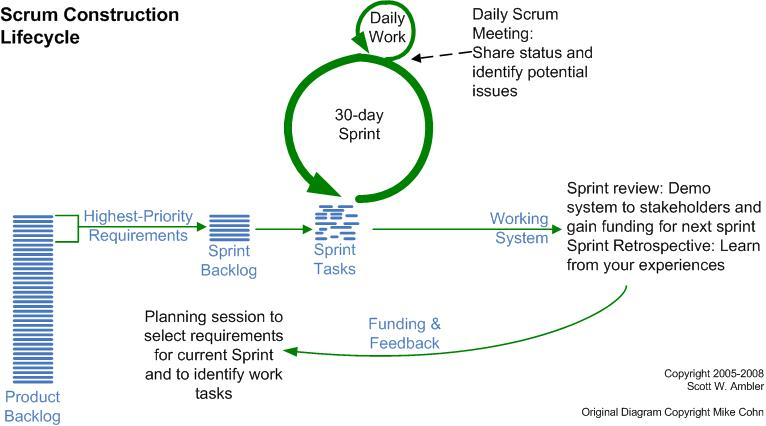
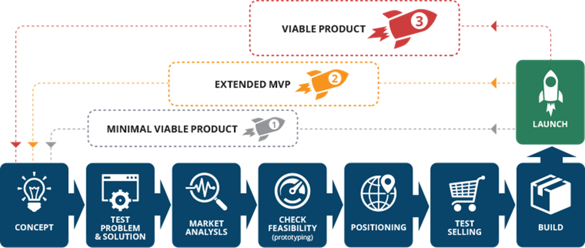

# Гибкие процессы разработки и управление кейсами

Если полный список работ неизвестен, поэтому контрольные точки (milestones, моменты времени получения определённых результатов в ходе проекта) неизвестны, и ресурсы для выполнения работ тоже неизвестны, а планирование ведётся как в судебных расследованиях (case, «судебное дело») от открывающихся в ходе ведения проекта новых обстоятельств (все разработки/development именно таковы: вы не знаете, очередная инженерная гипотеза/идея приведёт к успеху, или её после неудач в инженерном обосновании придётся отбросить и придумывать что-то новое), то от самой идеи проектирования как предварительного/up-front детального планирования приходится отказаться.

В связи с массовым осознанием утопичности «водопада», да ещё и с заранее известным временем выполнения каждой его стадии (особенно стадий замысливания, проектирования, технологической подготовки производства) для подавляющего большинства проектов (кроме совсем уж конвейерных, типа стройки по уже сделанному проекту, но даже проектирование сооружения нельзя заранее запланировать) появилось новое поколение методов создания и развития систем, где <strong>акцент с «создания» переместился на «развитие»</strong>. Эти методы перестали ассоциироваться со «спиралью», которая, как мы помним, совсем не претендовала на продолжительное развитие системы, а просто говорила о постепенном выпуске версий системы, пока не будут удовлетворены заранее сформулированные требования — и тогда проект должен быть закончен, «делаем четыре версии нашей турбины. Первые три будут нерабочие, а вот четвёртая обычно — работает!».

Это «послеспиральное» поколение видов/моделей/концепций жизненного цикла получило название <strong>гибких</strong> (agile, аджайл, эджайл, более правильный перевод был бы «ловкий» или «изворотливый», но в литературе закрепилось «гибкий») методов разработки (agile development process/agile product development). И вот эта терминология «методов разработки» (которые включали в себя и методы введения в эксплуатацию, и даже методы эксплуатации/использования, практики операторов системы) по факту сейчас вытеснила понятия «жизненный цикл» и «управление жизненным циклом». Упоминания «жизненного цикла» остались по факту только в «железной инженерии» больших военных и государственных проектов, где все недостатки связанных с этими понятиями инженерных методов просто замазываются большими деньгами и большими сроками разработки.

Самые разные инженерные процессы, которые относят себя к вариантам <strong>гибких/agile</strong> подразумевают «операционную гибкость», то есть отсутствие заранее назначенного астрономического момента выполнения работы, отсутствие up-front planning/предварительного планирования. Назначение работы (то есть выделение ресурсов) на какой-то метод может произойти в любой момент проекта — скажем в любой момент, а не только в самом начале проекта можно задействовать методы разработки концепции использования. При этом Ivar Jacobson ехидно замечает, что нет таких организаторов инженерии, которые бы признались, что их инженерные процессы негибкие — даже если речь идёт о «водопадах». Ведь «всегда можно передоговориться», это же везде оговаривается. Но в гибких (инженерных) процессах это уже были не отдельные исключения с возможностью передоговориться, внезапность/незапланированность в появлении каких-то работ признаётся как основное в этих «гибких» методах. Признавалось, что учесть новые обстоятельства и передоговориться — это основное в разработке.

Так, требования можно в agile было подкрутить и ближе к концу проекта — а потом реализовать эти требования, это ж одно требование реализовать, а не весь проект переделывать! Но и весь проект переделывать в случае agile не такая уж нештатная ситуация, прототипирование (это ведь именно оно, про несколько полных переделок всей системы) тоже отлично трактуется как вариант agile-подхода к процессам разработки. При этом распространение agile вариантов инженерных процессов как раз и спровоцировало потом отказ от требований, ибо в agile заведомо были «гипотезы», а не «требования».

Особенно ярко невозможность up-front планирования и классического проектного менеджмента проявилась в проектах программной инженерии. Программные системы были очень непохожи одна на другую, и нельзя было заранее в начале проекта даже сделать предположения, какие работы будут включены в план разработки софта поближе к концу проекта — в отличие от зданий, где заранее было известно, что нужно будет делать фундамент и возводить стены, а потом делать монтаж оборудования и внутреннюю отделку, в отличие от самолётов, где сразу понятно, что в составе самолёта будет фюзеляж, крылья, салон, в программных системах нельзя сразу было сказать даже их состав до начала разработки, нельзя было привязать к этому составу up-front план, а если менеджеры настаивали — планы делались, но они оказывались фантазийны. Поэтому приходилось соглашаться с тем, что работы будут вестись без плана, затеи по предварительному планированию разработок софта — дело бесполезное. Это была очень больная мысль и для инженеров, и для менеджеров — но она победила. Примерно этот же отказ от жёсткого календарного планирования в силу его полной бесполезности сейчас проходит и в разработке классического «железа» (самолёты, автомобили, роботы), и в разработке электроники (компьютерные чипы, серверные стойки, датацентры).

Общее для всех этих гибких вариантов «методов разработки»/«инженерных процессов» в том, что они используют в части управления работами <strong>управление кейсами</strong> (case management)[^r7-1]. Вот <strong>классическое определение кейса—</strong> <strong>это</strong> <strong>ситуация, обстоятельства или начинание, которые требуют набора действий для получения приемлемого результата или достижения цели. Кейс фокусируется на предмете, над которым производятся действия (например, человек, судебное дело, страховой случай), и ведётся постепенно появляющимися обстоятельствами дела.</strong>

Управление кейсами по факту обобщает управление проектами и процессами. В кейсе сначала мы имеем <strong>проблему/«нерешённый</strong> <strong>вопрос»</strong> <strong>(issue)</strong>, задающий требуемое конечное состояние предмета кейса. В формулировке кейса будет описание ожидаемого в результате выполнения работы кейса состояния предмета кейса как альфы (предмет метода), реализованной какими-то артефактами/рабочими продуктами. Скажем, «трюковый самокат начал греметь, верните его бесшумность». Состояние кейса в этот момент — открыт issue, предмет кейса — гремящий самокат.

Время выполнения работ по кейсу в его состоянии проблемы/«нерешённого вопроса» ещё неизвестно. Есть только ожидаемое состояние предмета кейса, а не контрольная точка (milestone, ожидаемый момент времени события): известно, что должно быть достигнуто, но пока неизвестно, каким методом и когда это может быть достигнуто, ведь непонятно, что же именно делать!

С проблемой кейса проводится исследование:

* Понимается причина возникновения проблемы (это может потребовать проведения дополнительных работ, они будут запланированы как подкейсы этого кейса). Скажем, трюковый самокат осматривается — находится, что разболтался подшипник (проверяются наиболее вероятные причины того, что самокат гремит[^r7-2]).

+ Проводится стратегирование: находится метод, который с наибольшей вероятностью решит вопрос — то есть переведёт предмет кейса в ожидаемое состояние. Метод может уже существовать, тогда говорят о «шаблоне кейса» и метод будут выполнять как «рабочий процесс» по регламенту/шаблону. Если подходящего метода нет, то стратегирование будет вестись «на лету» (а его результат, если вопрос будет повторяться, станет шаблоном кейса — но только после выполнения работ, когда «задним числом» будет описан метод, которым выполнялись работы). Это методологическая часть, она обычно намертво прикручена к диагностике, если известен шаблон кейса (template как известный метод, которым выполняются работы для проблемы кейса). Скажем, «Если гремит где-то в районе колёс, дело либо в износившемся подшипнике (под замену), либо в том, что плохо закручена ось (подтянуть)». Шаблон метода (заменить подшипник или подтянуть ось) прямо указывается для каждого диагноза. Если шаблона нет — подключаем рациональность: генерируем и проверяем гипотезы, рационально выбирая лучший метод (подключаем общий интеллект и переводим проблемы в задачи), а затем переходим к планированию для получившихся задач.
+ Проводится планирование: оцениваются потребные ресурсы и время, потребное на получение ресурсов и выполнение работы (в том числе и когда метод работ неизвестен в целом, но хотя бы известны возможные первые шаги — планируются они). В результате планирования формулируется пункт плана: <strong>задача/задание на</strong> <strong>работу</strong> <strong>какого-то ресурса (task).</strong>Эти задачи назначаются наресурсы, которые владеют соответствующими оргвозможностями/capabilities выполнять работы для определённых на предыдущем пункте методов работы. Скажем, для самоката планируется подтягивание оси, оценка времени — пара минут, работа назначена Григорию, у которого есть мастерство механика.

В результате управления кейсами в любой момент времени в проекте есть набор кейсов в разных их состояниях, кейсы из которого надо бы закрыть — и этот набор иногда называют <strong>backlog</strong> (чаще всего не переводится, так и пишут «бэклог», хотя иногда пишут «портфель невыполненных работ», но там кроме работ/задач ещё могут быть и проблемы/issues, которые часто путают с задачами). Дальше для того, чтобы определить оптимальное распределение ресурсов по этим работам, могут быть использованы удобные для управления кейсами методы планирования, например, канбан (Kanban for development[^r7-3] для управления кейсами прежде всего, для планирования производственных процессов используется обычно Kanban for manufacturing[^r7-4]) или TameFlow.

И даже после прохождения состояний нерешённого вопроса/issue и запланированной работы/task, жизнь кейса не заканчивается, потому как в рамках управления изменениями конфигурации нужно послать <strong>уведомление/notice</strong> участникам проекта, что кейс закрыт, то есть предмет кейса пришёл в ожидаемое конечное состояние: в проекте уже нужно будет ориентироваться на новую ситуацию с уже решённой проблемой/вопросом/issue, чтобы не было конфигурационных коллизий (например, в случае самоката кто-то мог бы не взять нужный ему самокат, ибо считает его гремящим, а он просто не знает, что этот самокат уже отремонтирован, не гремит — это очень частая ошибка, что не присылают уведомление о закрытии кейса. Там есть ещё такой нюанс, что закрытие кейса надо обосновать, результаты работ должны быть приняты: что для мастера «сойдёт, не гремит», может, например, оказаться недопустимым для его клиента «нет, всё-таки гремит, кейс не закрыт, чините дальше»).

Инструментарий, используемый для гибких методов разработки в части управления кейсами как варианта метода управлении работами — это инструментарий <strong>трекинга</strong> <strong>проблем/«нерешённых вопросов»</strong> (issue tracking, сегодня часто их называют «системы управления задачами», ибо после issue предмет кейса становится работой/задачей, иногда это «системы отслеживания ошибок», ибо ошибка/bug — это как раз «нерешённый вопрос», «системы отслеживания поручений» — ибо каждое поручение это как раз «поручение решить проблему» или «поручение выполнить запланированную задачу»). Название отражает тот факт, что кейсы появляются не в плановом порядке сразу как «работы», они изначально представляют собой <strong>проблему/«нерешённый вопрос»</strong> (issue), требующую своего решения. <strong>Трекеры</strong> (issue trackers, софт для трекинга кейсов[^r7-5]) учитывают эти кейсы по мере их появления. Вопросы (если они признаны важными), превращаются потом в назначаемые на выполняемые конкретными ресурсами задачи/tasks (после определения методов, которые помогут решить вопрос — и дальше планируются и проводятся работы по этим методам), а после выполнения задачи они превращаются ещё в уведомления/notices о завершении. Состояние мира изменилось после решения исходной проблемы/вопроса/issue, и нужно уведомить все заинтересованные в этом проектные роли.

Если появляется возможность что-то спланировать up-front, в управлении кейсами это обязательно делается. Но часто тут план — это просто опыт прохождения какого-то кейса в прошлом, который берётся как шаблон для будущих прохождений. Вот эти записи о прошлом опыте (взятые из папки «Дело», куда записывают всё происходящее в кейсе, case file) и будут называться <strong>шаблоном</strong> (template), если их используют для планирования повторения какой-нибудь удачной последовательности подкейсов — это и будет шаблоном/паттерном работ, то есть методом/способом работ. Если эти шаблоны (описания методов работы, а часто и оценки требуемых на работы ресурсов) готовят не специально обученные программисты таких шаблонов, а сами участники команды проекта, то такое управление кейсами называют <strong>адаптивным</strong> (adaptive), а шаблоны — <strong>шаблонами сообщества</strong> (community template).

Мы различаем:

* управление разработкой и виды/модели процессов инженерии, лежащие в основе управления разработкой. Эти процессы инженерии задают логическую (функциональную, декларативную) последовательность работ («сначала сделай концепцию использования, затем предложи концепцию системы для неё»). Сами работы могут быть совершенно другими — «сделай гипотезу каких-то основных черт концепции использования, затем проверь — можешь ли ты предложить какую-то концепцию системы, потом доработай концепцию использования, потом уточни концепцию системы, потом проведи расчёты на реалистичность для функционального синтеза концепции системы, затем уточни архитектуру конструктивов, вернись к концепции использования с найденными ограничениями, согласуй с заказчиком, заключи договор, доработай архитектуру» — это как оно будет реализовано работами, и то это не факт, что там внутри каждой работы разные методы работ не будут перемешаны, ведь всякие достижения договорённостей между ролями, исполняющими разные методы работы — это тоже работы! Управление разработкой входит в методы инженерии организации, ведущая подроль для управляющего разработкой — прикладного методолога процессов разработки в конкретной предметной области, который выберет вид/модель процесса инженерии/разработки/«создания и развития системы».
* Управление работами в его самых разных вариантах (например, управление программами и проектами, процессное управление, управление кейсами — когда работы уже назначены и нужно просто их запланировать и отследить выполнение), а в рамках этих разных вариантов методы планирования работ (например, метод критического пути или критической цепи для планирования в управлении проектами, канбан для разработки или TameFlow в управлении кейсами). Управление работами (оно же — операционный менеджмент) тоже входит в инженерию организации, но это деятельность не времени создания организации, а времени использования организации. Операционный менеджер — это оператор уже готовой организации.

При этом управление разработкой (дать оргвозможность выполнения инженерного процесса, оно же оргдизайн, оно же оргразвитие, оно же цифровая трансформация и ещё сотни разных имён) и управления работами (операционный менеджмент) тесно связаны в части выбранных методов для инженерного процесса и выбранных методов для самого операционного менеджмента этого инженерного процесса. Причём оргвозможность для операционного менеджмента часто делает организатор, а не сам операционный менеджер (а функции операционного менеджера вообще сейчас переходят к операционному софту, например, тому же софту issue tracker). <strong>Важно запомнить: методы управления разработкой должны соответствовать методам операционного менеджмента. Например, если выбран</strong> <strong>agile</strong> <strong>инженерный процесс, а операционный менеджмент—</strong> <strong>классическое проектное управление, то добра не жди.</strong>

Вот схематическое изображение инженерного процесса одной из самых распространённых методологий (методология/method — ещё один синоним метода, обычно термин применяется, когда речь идёт о предписанном разложении какого-то метода получения результата «под ключ» на составляющие методы) гибкой (agile) разработки, SCRUM[^r7-6]:

В этой диаграмме бросается в глаза её нелинейная/неводопадная форма, в которой выделяются наличие циклов ежедневной работы и месячных «спринтов». Нелинейность, отсутствие предписанной чёткой стадийности выполнения методов — верный признак «принципиальной схемы», функциональной диаграммы.

Суть этой (и прочих диаграмм процессов разработки) в том, чтобы показать, какие там предметы метода (предметы процесса разработки) являются основными объектами внимания, то есть альфами, и через какие состояния эти альфы будут проходить в ходе проекта.

Ключевые события (моменты этих событий как milestones/«контрольных точек», когда альфы будут менять своё состояние) — «выбор требований» (это довольно старая диаграмма, в 2008 году, когда эта классическая и широко распространённая диаграмма была сделана, требования ещё были одной из основных альф рабочего проекта), «демонстрация заказчикам» и т.д. Содержание работ (то есть методы/практики/способы работ) оговаривается разложением общего процесса разработки SCRUM, например, метод проведения планирующих сессий для текущего спринта, метод ежедневных совещаний. Эти методы из разложения SCRUM нужно будет задействовать, чтобы его альфы (например, альфа product backlog, альфа sprint backlog) меняли свои состояния. А дальше работы конкретных оргзвеньев::ресурсов будут менять артефакты/продукты, реализующие эти альфы.

Гибкие методы разработки — это не методы управления работами, а методы создания и развития систем. Скажем, kanban — это один из методов управления работой, TameFlow — это ругающий kanban за его многочисленные недостатки метод управления работой. И TameFlow, и kanban — они вполне могут быть использованы в сочетании с самыми разными вариантами гибких методов разработки. Об этом подробно будет рассказано в руководстве по системному менеджменту — управление работами (оно же — операционный менеджмент) тут один из составляющих методов системного менеджмента. О самих гибких методах разработки и как устроена инженерная работа — это будет рассказано в руководстве системной инженерии. Организация разработки, управление разработкой — это промежуточная дисциплина между инженерией и менеджментом. Содержание её определяется вроде как инженерами, они там обычно методологи, знают SoTA методов инженерной работы, а вот воплощение в жизнь этого содержания, то есть оргархитектура и оргпроектирование, лидерство и администрирование — это делается менеджерами.

Надо разговаривать с инженерами-технарями, чтобы достичь содержательной (как её формулирует прикладной инженер: описывая характеристики работы системы) успешности проекта, а не просто решать вопросы планирования и контроля исполнения работ для минимизации сроков и стоимости их выполнения (это вопросы операционных менеджеров: главное, чтобы «в срок и в бюджет»). Менеджеры и инженеры при этом должны договориться: если у инженеров agile, а у менеджеров up-front planning, то жди беды в проекте и постоянных скандалов. Повторим: <strong>методы разработки и методы управления работами могут быть несовместимы, и поэтому менеджеры и инженеры обязательно должны договориться. Для достижения договорённости</strong> <strong>у них должно быть какое-то знание методологии: они должны понимать природу методов разработки и методов управления</strong> <strong>работами, чтобы суметь обсудить их совместимость, а также не застревать на своих любимых методах, которые они узнали в предыдущих проектах и дальше могут или повторить—</strong> <strong>или покинуть проект, поскольку не в состоянии понять, как адаптировать метод к текущей ситуации.</strong>

Конечно, и методы (в том числе и метод разработки, и метод управления работами) — это тоже альфы, за изменениями их состояний в проекте («не выбрали» — «есть предложение» — «договорились» — «оргвозможность есть» — «успешно работаем по методу» — «успешно совершенствуем метод») нужен глаз да глаз, это важнейшие объекты внимания.

Гибкие методы/методологии разработки очень жестки в вопросах соблюдения принципов и правил. Если под словом «гибкие методы» какая-то команда не в состоянии указать конкретный вариант инженерного процесса и его разложения на составляющие методы инженерии и менеджмента, то верить в успешное завершение проекта этой командой нельзя: вполне возможно, что «гибкостью» команда называет полное отсутствие договорённостей о методах, поэтому команду будет лихорадить, она не сможет ритмично и продуктивно работать (проявляться это будет как постоянные проблемы со сроками, бюджетами и постоянные переделки из-за многочисленных конфигурационных коллизий — работы «без методов работы» будут очень плохо согласованными друг с другом, в них будет полно ошибок «на стыках»).

<strong>При указании варианта</strong> <strong>метода разработки или метода управления работами</strong> <strong>команде не нужно говорить</strong> <strong>SCRUM,</strong> <strong>или</strong> <strong>DSDM</strong>[^r7-7]<strong>,</strong> <strong>или</strong> <strong>OpenKanban</strong>[^r7-8]<strong>,или приводить</strong> <strong>ещё какие-то названия</strong> <strong>больших методологий со многими</strong> <strong>составляющими их методами/практиками. Вряд ли сегодня какая-то команда использует эти методологии во всей их полноте. Но нужно явно и осознанно сказать, какой вид инженерного процесса использует команда и какой вид операционного менеджмента.А ещё</strong> <strong>надо убедиться, что</strong> <strong>есть оргвозможность вести работы:</strong> <strong>все члены команды</strong> <strong>имеют мастерство выполнения этихметодов в целом, мастерство в</strong> <strong>выполнении их составляющих методов, имеют надлежащие ресурсы и полномочия, а также проверять, что команда идёт именно по этим методам—</strong> <strong>это и есть «организовать работу».</strong> <strong>По большому счёту, директор по развитию, главный инженер—</strong> <strong>они должны создать и развивать именно такую оргвозможность для предприятия.</strong>

Какой выбрать вариант процесса разработки? Мы крайне рекомендуем воздерживаться от даже упоминаний традиционного «водопада», всех этих «стадий» и неизбежных «требований», если у вас проект не похож на простую сборку уже спроектированной системы из стандартных деталей, например, стройка типовых многоквартирных домов. Если это стройка типового здания — вперёд, до стадии «отделка» всё будет работать, на стадии «отделка» придётся призадуматься, одни бригады будут красить, другие по свежепокрашенному делать мелкий ремонт — и никакого «водопада» и up-front плана не будет.

Но в проектах, где происходит <strong>знаниевая работа</strong> (проектирование, исследования, моделирование — то есть выдвижение и проверка гипотез), выбор в качестве модели разработки старинного «водопада» с V-диаграммой будет выбором утопии, вроде как выбора «вечного двигателя» в качестве модели для разработки какого-то двигателя. Ответ на вопрос про то, из каких методологий разработки брать какие методы/практики, зависит от профиля рисков проекта, а этот профиль рисков определяется субъективно командой.

Нет двух одинаковых проектов, нет двух одинаковых методов разработки, и даже разработка очередной версии системы может идти уже по новому инженерному процессу: команда проекта приобрела опыт, получила новую информацию о рисках, поэтому она могла изменить часть методов, составляющих «инженерный процесс»/ «метод разработки»/«метод создания и развития системы».

Начали делать концепцию использования, используя user story, потом выяснили, что проект слишком большой — и перешли на более мощную практику use cases. И заодно поменяли софт с поддержки user story на поддержку use cases. А ещё в середине проекта вдруг решили менять архитектуру системы — и по обратному манёвру Конвея (подробнее — в руководстве по системной инженерии) вдруг поплыл и оргпроект предприятия, по-другому организовали оргзвенья для ролей разработчиков.

Конечно, время от времени менеджеры будут настаивать, как в бандитских разборках: «никто тебя за язык не тянул, вот ты сказал свою оценку длительности работы по выбранному тобой методу, а я превращаю её в твоё обязательство» — отсюда лелеемое менеджерами у инженеров постоянное чувство вины за неминуемые изменения и концепции системы, и архитектуры, и времени прохождения контрольных точек. А ведь ничего стыдного в изменениях в ожиданиях в знаниевой работе нет: это всё оценки/гипотезы, часть гипотез просто обязана не подтверждаться! А ещё в ходе разработки меняется внешний мир, меняется проект (и design, и project), это ведёт к изменению профиля рисков, это ведёт к изменению ещё и самого процесса разработки, и это нормально.

Просто нужно помнить, что управляющие работами методами проектного управления всегда и во всём видят несуществующий в природе, но удобный для их рассуждений и действий «водопад», изо всех видов программирования он соответствует «пошаговому исполнению процедур», императивному программированию. Инженерные процессы (это же методы работы!) плохо отображаются императивными программами, «пошаговыми планами работ» — они лучше отображаются функциональными программами, декларативными описаниями. Поэтому классические проектные управляющие будут всегда испытывать непреодолимые трудности при попытках up-front планирования работ. Поэтому <strong>нужно работать с исполнителями ролей</strong> <strong>операционных менеджеров, сильными в управлении кейсами (например, практика/метод</strong> <strong>TameFlow</strong> <strong>или даже критикуемая в</strong> <strong>TameFlow</strong> <strong>практика/метод</strong> <strong>Kanbanfordevelopment), а не в классике проектного управления. Инженерам и менеджерам будет существенно легче договориться!</strong>

И не забывайте вовремя менять методы работы в вашем инженерном процессе. Повторим ещё раз сказанное буквально три абзаца назад: даже если вы делаете подряд два похожих проекта, то в результате выполнения первого проекта команда получает опыт, и профиль рисков для команды во втором проекте будет другим. Это означает, что команда может для следующего похожего проекта (или даже в ходе текущего проекта!) подкорректировать методы/практики/культуры своей работы, изменить метод разработки целиком, или какие-то отдельные составляющие его методы, а также изменить метод управления работой для того, чтобы учесть полученный опыт.

<strong>Современные</strong> <strong>методы разработки, равно как и все остальные методы (методы управления работами, методы инженерии платформы разработки, методы администрирования и т.д.) состоят из множества более-менее независимо используемых</strong> <strong>в проекте</strong> <strong>составляющих методов</strong> <strong>и даже отдельных принципов</strong> <strong>из объяснений/теорий этих методов, и достаточно заменить несколько из них (а не все</strong> <strong>методы</strong> <strong>и принципы сразу, как это было</strong> <strong>бы</strong> <strong>в случае</strong> <strong>полной смены одной «методологии разработки» на другую), чтобы подправить</strong> <strong>ситуацию проекта в</strong> <strong>сторону учёта изменившегося профиля рисков.</strong> <strong>Конечно, не все</strong> <strong>принципы (они лежат в основе</strong> <strong>объяснений/теорий/дисциплин</strong> <strong>методов)</strong> <strong>сочетаются друг с другом, поэтому</strong> <strong>методы работы прикладных инженеров и менеджеров</strong> <strong>нужно продумывать и проектировать перед их воплощением</strong> <strong>в виде оргвозможностей—</strong> <strong>то есть в проекте нужно постоянно вести методологическую работу.</strong>

Неформальные работы по замыслу новой системы обычно начинаются задолго до формального старта первого из проектов по созданию и развитию какой-то системы — будь это новое решение/solution (что-то глубоко уникальное, предназначенное для решения чьих-то конкретных проблем), серийно выпускаемый продукт/product или даже новая версия для уже давно работающей системы (brownfield, «доработка»).

Замысел новой системы или даже новой версии системы (мы не будем их различать) появляется постепенно, его точное начало обычно трудно определить. По факту, проект начинается в тот момент, когда визионер и бизнесмен договорились: визионер считает, что предложенную инженерами систему (решение/solution какой-то проблемы) можно будет выгодно продать, а бизнесмен считает, что это будет полезно фирме — соответствует стратегии, не отвлечёт ресурсы от других дел, не принесёт каких-то репутационных убытков, не испугает инвесторов и т.д. (визионер смотрит на товар и клиентуру, он торгует товаром, а бизнесмен — на фирму и инвестуру, бизнесмен торгует фирмой).

В последней версии стандарта ISO 15288:2023 даже есть «6.4.1. Business or mission analysis process». Суть этого рабочего процесса — понять, какую целевую систему берётся делать команда, и определить, стоит ли её вообще делать, соответствует ли это стратегии компании, чья команда будет выполнять проект. Хотя ISO 15288 и содержит в себе отражение «водопада» в части стадий и V-диаграммы в части вида инженерного процесса, но даже однократное прохождение жизненного цикла (без развития системы) как-то надо начинать! На старте проекта готовится концепция использования (OpCon или ConOps, concept of operations, мы их не различаем, но в разных школах инженерии иногда вводят отличия), но чтобы разобраться, не утопично ли создание системы, проводится и разработка первых версий концепции системы (ибо можно написать отличную концепцию использования скатерти-самобранки, но потом обнаружить, что её не из чего сделать, система утопична).

Окончание жизненного цикла системы на сегодня обычно не планируется, хотя вполне могут обсуждаться ожидания по выпуску первой версии продукта (обычно это MVP — minimal viable product[^r7-9], минимальный жизнеспособный продукт, который и будет потом развиваться).

Дальше система может модернизироваться так, что в её воплощении не останется уже ничего от предыдущей. Берём швабру, через некоторое время ломается ручка, меняем ручку, потом меняем перекладину — это та же швабра? Да, это та же швабра-система (функциональный объект тот же!), только поменялись какие-то модули, конструктивные части. Швабра определяется по её функциональному описанию, если заменить наполнение конкретными модулями или даже поменять размещение, ничего страшного с системой не произойдёт — она останется существовать. Телефон остался телефоном, хотя там уже давно нет проводов, трубки, кнопок номеронабирателя, ни одного элемента классического телефона, просуществовавшего больше сотни лет. Но осталась функция передачи звука на расстояние: теле (далёкий) фон (звук). Хотя и это уже не главная функция, телефоны перестали звонить и используются как терминалы доступа к интернету — а звонки массово заменяются чатами.

Microsoft объявила, что Windows 10 будет её последней операционной системой, при этом непрерывно производит в ней изменения (выпуск Windows 11 широко обсуждался как имеющий чисто маркетинговое значение, смена названия не привела к тому, что сам продукт существенно изменился, более того, изменения в Windows 11 проходят примерно так же, как в Windows 10 — программы и функциональность потихоньку меняется, но не меняется имя продукта. Просто одни программы в составе Windows потихоньку меняются на другие, это происходит уже много лет). Срок службы атомных электростанций сначала делали 60 лет, но сейчас продляют его до 80 лет, проводя частичные модернизации — при этом часть стран хотят избавиться от атомных станций, а часть стран как раз хочет развивать атомную энергетику. Тесла придумала софтверные изменения для автомобиля, поддерживающие его ценность путём модернизации по ходу эксплуатации, электромобили Tesla не нужно вовремя продавать, они перестают морально устаревать: это изменение бизнес-модели автомобильной промышленности[^r7-10].

Жизненный цикл системы оказывается не содержащим чёткое заранее определённое число проектов перед выводом из эксплуатации/уничтожением после использования, и может не иметь чёткого срока окончания. И тем самым понятие «жизненного цикла» перестаёт быть важным. Можно говорить о жизненном цикле организма динозавра, но труднее говорить о «жизненном цикле» вида динозавра, который потихоньку за десяток миллионов лет, или чуточку подольше превратился в птичку. Это уже «ход эволюции» (развития системы, изменения в геноме, ведущие к изменению фенома), а не «жизненный цикл» создания одной системы (геном воплощается в свой феном, феном «прокачивается» и используется — и конец истории). Третье поколение системного мышления привело к тому, что мы говорим о создании и развитии системы, а систему понимаем уже как множество экземпляров системы, которые представляют собой разные версии системы. Это похоже на то, как мы воспринимаем биологические виды в ходе эволюции: тех же динозавров, превращающихся в птичек — и, конечно, это рассмотрение идёт на более длинных промежутках времени, чем время жизни одной версии системы. Операционные системы Android и iOS имеют уже огромное количество версий, каждая версия разрабатывается по полгода-году, но сама разработка этих операционных систем как видов систем занимает уже полтора десятка лет (первая версия Android вышла в сентябре 2008 года, первая версия iOS вышла в июне 2007 года, развитие этих систем продолжается).

В атомной промышленности даже случилась терминологическая коллизия: управлением жизненным циклом (lifecycle management) там называют не методы управления жизненным циклом из системной инженерии, а методы продления срока эксплуатации атомных станций[^r7-11]! К счастью, по мере распространения знаний системного мышления среди работников атомной промышленности, значение термина меняется на общепринятое.

С вот этой бесконечной/неоканчивающейся/открытой/open-ended[^r7-12] разработкой связан ещё один вариант показа стадийности инженерного процесса — как развёртки во времени выпуска версий какой-то системы, roadmap/дорожная карта. Этот термин пришёл из проектного управления[^r7-13], но всё чаще используется для показа ориентировочных сроков выпуска версий системы. Вот пример инженерного процесса, показанного как жизненный цикл спиральной модели с заданным прохождением водопада несколько раз, с упором на методы не столько инженерии или менеджмента, сколько предпринимательства[^r7-14] — и эта диаграмма приведена в совмещении с диаграммой типовой дорожной карты (roadmap, показаны три версии продукта разной степени готовности):

[^r7-1]: <http://ailev.livejournal.com/946134.html>

[^r7-2]: <https://vk.com/@razor_russia-faq-o-samokatah>

[^r7-3]: <https://en.wikipedia.org/wiki/Kanban_(development)>

[^r7-4]: <https://en.wikipedia.org/wiki/Kanban>

[^r7-5]: Кроме трекеров нерешённых вопросов общего вида, были распространены трекеры ошибок в программном обеспечении bug trackers, трекеры инцидентов/заявок пользователей в ходе администрирования IT-инфраструктуры. Постепенно опыт работы с этими специализированными трекерами был обобщён, и сегодня трекеры более-менее универсальны и часто известны как системы управления задачами.

[^r7-6]: <https://en.wikipedia.org/wiki/Scrum_(software_development)>

[^r7-7]: <https://en.wikipedia.org/wiki/Dynamic_systems_development_method>

[^r7-8]: <https://github.com/agilelion/Open-Kanban>

[^r7-9]: <https://en.wikipedia.org/wiki/Minimum_viable_product>

[^r7-10]: <https://cleantechnica.com/2020/08/29/tesla-introduced-a-business-model-the-world-has-not-seen-before/>

[^r7-11]: Например, <https://www.iaea.org/newscenter/statements/nuclear-power-life-cycle-management-managing-nuclear-knowledge-and-nuclear-security> — тут «управление жизненным циклом» чётко связывается не со способом назначения практик на работы, а с удлинением срока службы энергоблоков АЭС.

[^r7-12]: <https://ailev.livejournal.com/1463013.html>

[^r7-13]: В проектном управлении это диаграмма основных контрольных точек проекта, <https://www.productplan.com/roadmap-basics/>

[^r7-14]: <https://hackernoon.com/crafting-your-perfect-product-roadmap-7b42b1033c4e>
