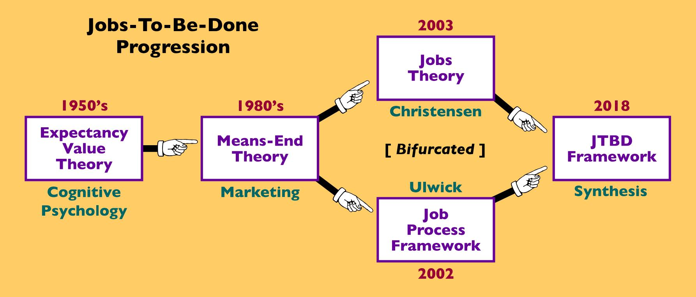

# JTBD: клиентоориентированность? Нет, метод-ориентированность!

Мы стратегируем — и получаем по итогам стратегирования стратегию::метод создания и развития системы, планируем и проводим работы по этому методу, отслеживаем в ходе разработки в конечном итоге альфу (воплощения) целевой системы, которая должна будет удовлетворить потребности (needs) внешних проектных ролей. Некоторые из этих внешних проектных ролей обычно скрываются за словами client, customer, user, consumer. То, что в системном подходе было «от границы целевой системы смотрим сначала всегда наружу, в поведение в окружении во время эксплуатации», в бизнес-литературе выражается тем, что в название методологии разработки вставляют какой-то синоним (как обычно, тысячи их) ориентированности на клиента/заказчика/пользователя и добавляют focused, centered, driven, first, oriented или даже obsessed в название метода (в том числе бизнес-стратегии, метода разработки, предоставления сервиса, организационной культуры — слово "метод/процесс" тут тоже имеет множество синонимов):

* Customer-focused
* Consumer-focused
* User-centered
* User-centric
* Customer-driven
* Client-focused
* Market-oriented
* Customer-first
* Customer-obsessed
* Customer-led
* Human-centered
* Client-driven
* User-driven
* Customer-oriented
* Service-oriented
* Audience-focused

Напомним, что первое поколение системного подхода делало акцент на технические процессы и минимальное внимание на клиентах (1950-1980-е), ещё до водопада была модель code-and-fix, структурное программирование, затем «водопад» (предложен Winston W.Royce в 1970, хотя он сам и не использовал слово «waterfall»).

Второе поколение системного подхода заметило людей-создателей и внешние проектные роли. После чего заговорили о прототипировании (1980-е) и спиральной модели (1986), в программировании возникла идея reuse и объектно-ориентированного программирования для переиспользования (потом эта идея была похоронена архитекторами: «повторное использование» оказалось лазейкой, в которую проникали лишние зависимости между модулями). Но там уже была замечена внешняя проектная роль User — и в HCI (human-computer interaction как одной из ветвей software engineering) появился UCD (user-centered design, 1980-1990e). И уже опираясь на это, появился agile с его манифестом в 2001 году и идеями активного сотрудничества с клиентом в ходе разработки. Примерно в это же время (2000е) — идеи lean development в agile, где пытались применить принципы Toyota manufacturing system, lean construction в строительстве с тщетными попытками планировать непланируемое.

Чего там ещё не было, так это идей эволюционности: всё это было медленным отходом от стадийных методологий, даже спираль понималась как «шаги-обороты пошагового процесса», а не путешествие предмета метода с изменением его состояния в причудливом порядке применения разных методов из общей методологии. Даже там, где речь шла о людях (клиентах, например, в маркетинге), были «водопады», типа той же «воронки продаж» с чёткими сменами состояний. Это всё было как раз до тренда на клиент-ориентированность.

Третье поколение системного подхода с учётом времени эволюции и самой возможности эволюционирования систем (evolvability), инженерной идеей "непрерывного всего" в разработке (прежде всего «непрерывная сборка» и «непрерывный ввод в эксплуатацию») начинается в 10е годы 21 века, с идей lean startup и дальше с переходом от стартапов к управлению инновациями (innovation management) как выражению той же самой идеи, но уже не только для стартапов, а для всех.

Идея lean была взята у производственников (Toyota production system). Она означала, что не должно быть лишних работ. «Ничего лишнего», lean/элегантно — но не только при производстве, но даже и при задумывании продукта, в стартапе. Но как узнать, что там лишнее, а что нет?

Вот тут и появляется в самых разных методологиях «ориентация на клиента»: делается не любая система (первое поколение системного подхода), не система, которая делается в срок и в бюджет и вообще хоть как-то кем-то делается (второе поколение системного подхода), а которую ещё и можно продать, и кроме того её хорошо бы продавать бесконечно! Появляются идеи эволюции систем, включая признание того факта, что система перестала быть развиваемой, «вид вымер» и дальше будет смена вида систем (в стартапах это pivot/виражи).

В случае людей, наконец, признали, что людей нельзя заставить пройти через стадии обработки, которые дают гарантированные результаты. И надо смотреть на ситуацию не только с точки зрения желающего что-то сделать с клиентом, но и наоборот — с «точки зрения»/«позиции восприятия»/«индекса отсылки»/«referential index» клиента.

Появляется множество разных прикладных методологий клиентоориентированности, слово customer становится центральным. Во всех, конечно, voice of customer с неизбежной критикой, ибо customers при их опросах не могут высказать невысказываемое («изречённое дао — не настоящее дао»), говорят одно, а делают другое, вообще не ощущают свои «боли» и даже не догадываются, что у них болит (ибо надо было находить даже не «потребности», а «боль», чтобы уж точно было желание купить лекарство от этой боли), долгосрочное стратегирование у клиентов вообще на нуле и влиять на него оказалось нельзя — и так далее, список критики этих методологий учёта «голоса клиента» длинный. Поэтому первое же развитие в этой предметной области сдвинуло «голос клиента» (понимающийся как голос персонажа из какой-то «целевой аудитории» — аудитория задавалась образом жизни, возрастом, полом и прочими демографическими характеристиками) на метод работы, который хочет выполнять клиент в своих работах, и дальше смотреть на проблемы этого метода. При этом то, что было важно раньше (возраст, пол, семейное положение и т.д.) абстрагировалось. Внимание начало уделяться методам/функциям, поэтому для новой теории клиенториентированности в разработке термин был предложен jobs to be done, а не works to be done. Важным оказалось то, что делает клиент, метод его работы, и это уже было выделение действительно важного — не надо было гадать, что там выделять из всего «потока сознания», который выдавал клиент и который предлагалось хоть как-то учитывать в ранних методологиях клиентоориентированности.

Outcome-driven innovation[^r7-1] от Anthony Ulwick, "What Customers Want: Using Outcome-Driven Innovation to Create Breakthrough Products and Services", 2005. Первый документированный успех «инноваций, ориентированных на общий результат» (outcome), а не на частный результат одной операции (output) был в 1992, патенты по методологии Ulwik получал ещё с 1999 года, затем публикация в HBR в 2002 году, затем — книжка в 2005[^r7-2]. Формально JTBD theory была создана в 1990. В 1990 Ulwik предложил, чтобы компании прекратили фокусироваться на продукте и на клиенте (при этом термин был, помним, «клиентоориентированность»!). Вместо этого компании должны были разобраться с “underlying process” (or job), который клиент пытается выполнить, когда он использует продукт или сервис компании. Грубо говоря, «думай про метод/job, который задействует конечный потребитель, используя продукт или задействуя сервис». Это явная отсылка к методу (job ведь это не «работа» в смысле work, это работа в смысле «занятость каким-то видом труда»). По факту Ulwik в 1990 году предложил искать сигнатуру метода (что с чем клиент хочет делать, и зачем), а дальше компании могли бы предлагать другое разложение метода с использованием своего инструмента. Клиент тогда «наймёт на работу» твой продукт, если метод с твоим продуктом будет получше (дешевле, быстрей, приятней). Всё то же самое, но другая терминология — и оттуда объяснение через какой-то определённый набор метафор.

Это, конечно, главным образом отлично легло на предложение продуктов и сервисов для потребительского рынка (B2C, business to consumers), идеально для всяких «телефонных приложений» и тех ситуаций, когда клиент что-то хочет делать с собой — есть, мыться, слушать музыку, чистить зубы (в руководстве по системному мышлению был пример ручных часов, вспомните).

С идеями Ulwick по outcome-driven development довольно рано ознакомился Christensen (тот самый, который предложил в 1997 году термин «disruptive innovation» и написал «Дилемму инноватора»), он и популяризовал подход с некоторыми добавками своих примеров — он и дал название Jobs-to-be-done (с альтернативным термином-синонимом «outcomes that customers are seeking»), в книге 2003 года «The Innovator Solution», когда идеи Ulwik были известны только по публикации в HBR, то есть ещё раньше, чем вышла книга самого Ulwik.

Подход outcome-driven innovation тем самым начал пониматься как происходящий на основе Jobs-to-be-done theory, которую затем тащили в разные предметные области за пределами b2c. В 2016 году Ulwik выпускает книжку уже с термином в заглавии «Jobs to be Done: From Theory to Practice», где показывает, как теорию превратить в рабочий метод. В том же 2016 году выходит аналогичная книжка Christensen с вариантом этого фреймворка, «Competing Against Luck».

Если сделать этот трюк со сдвигом внимания на метод работы клиента с использованием продукта (job to be done), то Ulwik отмечает многие изменения в онтологизации маркетинговых рассмотрений[^r7-3]:

* The unit of analysis is no longer the customer or the product, it’s the core functional “job” [не просто job, а functional job — это чтобы вы не перепутали с work, job тут не синоним для work!] the customer is trying to get done.
* Markets aren’t defined around products, they are defined as groups of people [сообщества!] trying to get a job done [сообщества объединяются по общим методам/культурам/занятостям своих участников, «занятости» тут отсылают к job]
* Customers aren’t buyers, they are job executors [это у нас исправление ошибки «моментом использования системы будет момент её покупки» выпячивание клиента не как пользователя, а как покупателя. Это самая частая начальная ошибка студентов кафедры технологического предпринимательства, а также тех инженеров-менеджеров, которые себя считают «чистыми менеджерами» — им же надо прежде всего продать, а там хоть трава не расти! Нет, моментом использования будет момент эксплуатации/работы/функционирования системы или результата сервиса].
* Needs aren’t vague, latent and unknowable, they are the metrics customers use to measure success when getting a job done. [эта тема выходит на actionable metrics, что требует вообще отдельного разговора — но об этом мы расскажем позже]
* Competitors aren’t companies that make products like yours, they are any solution being used to get the job done [аффордансы могут быть очень разными, а всё новое приходит сбоку — под конкретную сигнатуру может прийти аффорданс совершенно другой природы, это мы подробно разбираем в теории стратегирования в последнем разделе нашего руководства].
* Customer segments aren’t based on demographics or psychographics, they are based on how customers struggle differently to get a job done. [это мы обсуждаем как переход от «метода персон» к рассмотрению методов и внешних проектных ролей не просто «клиента», а уточняющих эту роль — скажем, «игрок» (и даже разные подклассы игроков, если речь идёт о профессиональном геймдизайне), а не просто «клиент». Интересно, что JTBD постулирует акцент на методе, роль и её именование по сути опускается — чтобы сразу перейти к «сообществу как группе с какими-то культурами работы», но рассуждения с точно названной ролью обычно проще]

В jobs-to-be-done и тем самым outcome-driven innovation стараниями главным образом Clayton Christensen[^r7-4] (самый активный популяризатор теории) появились самые разные варианты понимания метода работы, например:

* Методы-действия (помним, что тут jobs как методы, которыми работает клиент, а не система) как действия (activity), где прямо пишутся «функциональные шаги» (простейшее императивное разложение метода), которые клиент должен предпринять в работе, чтобы получить результат. Инкрементальные улучшения, акцент на «что клиент делает». Это основная линия рассуждений Ulwik, «рабочие процессы клиента с вашим продуктом».
* методы-как-прогресс, который интерпретируется как улучшения (progress), которые хотел бы сделать клиент в своей жизни применением метода — ход на «конечное состояние предметов составного метода — в конце, возможно, длинной последовательности действий, outcome в отличие от output одного шага». Ключевое тут — сдвиг на вопрос «зачем клиент вообще что-то делает», вопросы мотивации, «психология». Тут выходится за рамки улучшений в выполнении какой-то задачи/однократного применения рассматриваемого метода, а спрашивается вообще про контекст, про изменения в мире (состояния предметов метода, может быть и самого клиента), которых хочет достичь клиент. Акцент на изменения в жизни, холизм — и тут не только чисто функциональный аспект, но и «культурный фон» (что там надо получить эмоционально, в части культурных предпочтений и т.д., то есть тут вынимается и теория мотивации тоже, а ещё могут выниматься и социальные теории с их выходом на основания мотивов личности).

Тем самым в JTBD в центре не клиент. JTBD — не клиенто-центрическая методология, она — метод/job-центрическая методология. Когда говорят, что основное в JTBD — это сдвиг продуктоцентричности на клиентоцентричность (или клиентоориентированность, помним, что тут множество синонимов), то хорошо бы поправлять: этот сдвиг идёт ещё дальше — с клиента (персоны и даже роли) на метод и ход на стратегирование для клиента: почему он задействует метод, чего он этим хочет достичь.

Популярность тут пришла и из-за того, что огромное число крупных компаний начали использовать ровно вот эти рассуждения, чтобы выяснить эти самые customer jobs — и дальше предложить продукты с улучшенным восприятием/eXperience того, как прошло задействование метода (грубо говоря, ищется вариант впечатления «мне понравилось, как я сработал вами предложенным методом»). Поэтому появилось огромное число success stories и case studies, в вузах пошло массовое обучение теории JTBD.

JTBD отлично интегрируется со многими клиентоориентированными методологиями разработки, они же — маркетинговые методологии (в классическом понимании маркетинга: определить, чем будет выгодно торговать — и найти аргументы для объяснения клиенту его выгод). Конечно, есть огромное число публикаций по поводу этой теории и результирующего современного фреймворка. Вот, например, картинка из исследования 2020 года с альтернативной версией истории JTBD, преодоление противоречий между job с идеей process и идеей progress, но через job steps, и вы сами с использованием материала нашего руководства отойдите от императивного представления процессов в этой картинке[^r7-5]:

Для «людей с улицы» возникает вопрос «зачем так сложно о простом»? Затем, что «так сложно» можно рассуждать потом не только о простом. Более того, популярность JTBD сегодня велика, но простой эту методологию не назовёшь, в ней множество нюансов. Но если разобраться с методологией как фундаментальным методом мышления, то рассказы о разных прикладных методологиях (вроде той же JTBD) становятся примерами методологической работы. И будет сразу очевидно, что там просто, а где простота только кажется.

Этих методологий, фреймворков, моделей разработки/развития (development тут можно по-разному переводить) не три-четыре, и даже не тридцать-сорок — их сотни и тысячи. В менеджменте и инженерии, равно как в психологии, единой теории или парочки теорий по типу естественных наук (физики или генетики) нет, а ещё рассказывается об одном и том же в самых разных терминах, которые заимствуются из самых разных метафор. Если задействовать типы мета-мета-модели (абстрактную картину мира) из наших руководств, то все прикладные руководства/курсы/регламенты/стандарты/«описания рабочих процессов»/«корпуса знаний» по прикладным методам работы в той или иной предметной области воспринимаются как материал для последующего комбинирования методов: сразу видно, что там в этом инженерном, менеджерском, маркетинговом и т.п. винегрете общее, что отличается, как можно все эти на первый взгляд очень разные методологии комбинировать друг с другом, что там из прошлых поколений (и каких проблем в связи с этим можно ожидать), что там более-менее современное.

[^r7-1]: <https://en.wikipedia.org/wiki/Outcome-Driven_Innovation>

[^r7-2]: <https://strategyn.com/jobs-to-be-done/history-of-jtbd/>

[^r7-3]: <https://jobs-to-be-done.com/what-is-jobs-to-be-done-fea59c8e39eb>

[^r7-4]: <https://en.wikipedia.org/wiki/Clayton_Christensen>

[^r7-5]: <https://innodyn.net/synthesizing-the-two-schools-of-thought-jtbd-progression-part-5/>
