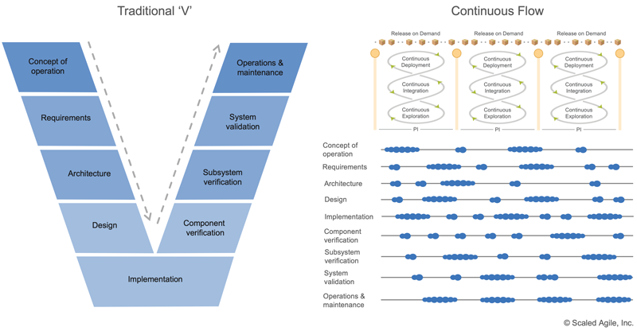
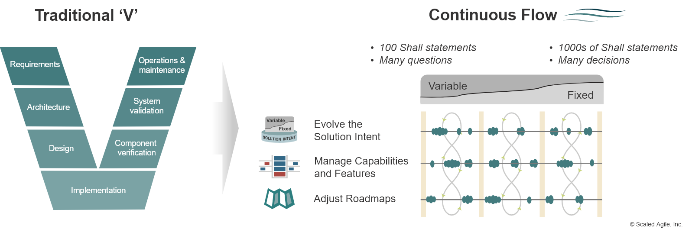

# Выбор инженерного процесса и организация разработки

Наши руководства каждый вопрос рассматривают два-три раза с некоторым интервалом и в немного разных контекстах, чтобы натренировать нейронную сетку человека с учётом кривых забывания (приём spaced repetition[^r7-1]). Увы, человек не компьютер, чтобы сходу загружать в мозг сжатое и компактное описание какого-то мастерства. Людям (да и AI-агентам тоже) нужно каждое новое понятие и описание его связи с другими понятиями предъявить несколько раз, чтобы произошло запоминание и появились ассоциативные связи с уже имеющимся знанием.

Мы тут довольно много написали про то, что создание и развитие систем проходит в целом по какому-то методу, даже если вы не знаете, какому. Если вы не описывали этот метод, не моделировали его важных черт, то это вовсе не значит, что кто-то уже не набил шишек в очень похожих обстоятельствах и не придумал, как избежать этих неприятностей в своих следующих проектах.

Этот метод создания и развития систем мог существовать под разными именами: культура разработки, стиль инженерии, модель жизненного цикла, инженерный процесс, модель разработки, концепция инженерного процесса, метод разработки — нам это неважно. Важно, чтобы вы могли задуматься: всё, что делают конкретные системы (люди, AI, инструменты, целые организации) в графе создателей — это работы по каким-то методам, которые будут в разложении инженерного процесса, разложении метода разработки, разложении культуры инженерной работы или иногда даже корпоративной культуры (подчеркнём, что неважно, какие вы тут выбираете синонимы, в каждом из них есть нюансы, но мы тут не доходим до нюансов, всё это про одно и то же: метод создания и развития систем, которым работают создатели из графа создателей системы).

Вы должны как-то отмоделировать этот метод разработки, представить его в самом общем виде — используя знание из первого раздела нашего руководства по методологии о том, что это довольно сложно, поэтому надо выделить достаточно рабочего времени, а дальше используя знания второго и третьего разделов нашего руководства с примерами методов описания/моделирования методов разработки и указанием на «новичковые ошибки человечества» с предложением таких методов.

Инженерия как метод создания и развития систем быстро развивается, каждые несколько лет меняется понимание того, что такое хорошо и что такое плохо в разработке. Вот ещё недавно было плохо разрабатывать без требований, а теперь плохо разрабатывать с требованиями, зато надо выдвигать и тестировать гипотезы о потребностях! Методы разработки быстро эволюционируют.

**Первая** **очень частая** **ошибкадаже у** **опытных** **инженеров-менеджеров—** **игнорирование** **обсуждения по** **«организации разработки»/«управлениюинженерным** **процессом»/«управлению созданием и развитием системы»/«управлением разработкой»** **(оно же в старой терминологии—** **«управление жизненным циклом»):** игнорирование создания организации, реализующей тот или иной выбранный процесс инженерии. Неважно, о развитии каких систем мы тут говорим: софта, живых организмов, мастерства, организаций, жилых массивов, звездолётов. Главное, что вы должны:

* **Выбрать вид** **инженерного** **процесса** (концепцию процесса разработки, модель жизненного цикла — выберите себе синоним), и затем
* **Выполнить методы организации разработки** (управления разработкой, управления жизненным циклом — выберите себе синоним) для того, чтобы получить оргвозможность выполнения выбранного инженерного процесса.

Участники инженерных (помним, что мы даже обучение людей считаем инженерным проектом, даже менеджмент, даже маркетинг) проектов должны осознавать, каким методом разработки они пользуются и насколько это получается. Конечно, под «разработкой» в таких случаях имеют в виду все методы работы, которые нужны для создания и развития системы — и саму разработку (методологическая работа, проектирование, подготовка производства), и визионерство, и архитектурная работа, работа создания производственной платформы. Конечно, терминология тут может быть другой — в менеджменте могут обсуждать методы бизнеса (вместо «изделия» там продают организацию инвесторам, поэтому «визионер» там называется «бизнесмен»), методы оргпроектирования, прикладная методология там касается менеджмента, архитектурная работа там — орг-архитектурная, а инженерия внутренней платформы разработки — администрирование, то есть создание бухгалтерии, кадровой службы, юридической службы и прочих служб, которые создают и удерживают предприятие. В обучении как инженерии личности опять меняем терминологию: шумпетеровским предпринимателем (который принимает решение по тому, выгодно ли влезать в создание и развитие очередной системы, очередной фичи развиваемой системы, или это будет невыгодно, текущие инвестиции в проект будут больше возможной прибыли от продажи в будущем — и поэтому заниматься проектом нельзя) там выступает не визионер, не бизнесмен, а культуртрегер, а вместо администрации внутреннюю производственную платформу там будет создавать и развивать деканат. То же самое будет в инженерии сообществ: имена ролей и методов для, например, создания и развития клиентуры, будут существенно отличаться от таковых в «железной» и программной инженерии, менеджменте как инженерии организации, обучении как инженерии личности. Но во всех этих случаях надо признавать: есть какой-то метод создания и развития систем, в котором можно выделить основные составляющие его отдельные методы и отдельные выполняющие их роли. А дальше будет коллективная разработка, будет реализовано разделение труда: разные люди с их инструментами, разные AI-агенты, разные организации будут играть разные роли в графе создателей тех или иных систем.

В рабочих проектах не часто услышишь явное обсуждение современных (SoTA) методов разработки. Не так часто в жизни услышишь «непрерывное всё»/continuous everything, иногда это будет или continuous delivering (и дальше подразумевается, что кроме ввода в эксплуатацию там будет и всё остальное), иногда continuous development. Но надо понимать, что непрерывное (то есть повторяющееся, ритмичное) будет задействование методов работы, относимых ко всем раньше однократно/прерывно выполнявшимся стадиям/фазам/этапам жизненного цикла. Непрерывное замысливание (разработка концепции использования, продуктное стратегирование, определение возможной прибыльности работы) — тоже тут, оно происходит не однократно для первого экземпляра системы, даже если системой будет огромный космический корабль или атомная станция. При этом и финансирование работ будет на создание и развитие системы в целом, а не относиться к конкретным экземплярам системы — понимание особенностей организации инженерной разработки крайне важно для принятия адекватных, не оторванных от жизненных реалий, не безумных решений по инженерии предприятий (часто это множество предприятий в графе создателей), которые будут принимать участие в создании и развитии системы.

Это всё методологический разговор, разговор о методах инженерной работы. Но инженеры-менеджеры снова и снова делают «новичковые ошибки» и при попытке обсудить инженерный процесс в целом обсуждают не разложение методов создания и развития системы, а разбиение работ, да ещё и в представлении «пошаговости» для этих работ, утопически предполагая «водопад». Дальше речь идёт об операционном менеджменте, а не методологии (управлении работами, а не управлении инженерией/разработкой): вместо обсуждения проектных/организационных ролей и их методов/способов работы, предметов метода и инструментария, обсуждаются ресурсы, даты старта и длительность работ, ответственные исполнители/оргзвенья. Обсуждать нужно и одно, и другое. Но если что-то не заладилось с методами работы, то никакие поправки во временах старта и в исполнителях этого не исправят. Надо обсуждать выбранный инженерный процесс, моделировать его, а затем исправлять — изменять оргвозможности организации, то есть переучивать людей и перенастраивать инструменты, а дальше перераспределять полномочия по распоряжению трудом и материалами.

**Вторая ошибка** **у** **инженеров-менеджеров—** **это обсуждение методологии в части ролей, а не задействованных** **этими ролями методов работы.** А ведь роль определяется методом работы, а не метод работы — ролью! Так, роль архитектора вроде бы «всем понятно», чем занимается. Но это кажимость, «всем понятно» тут (как обычно и со всеми другими ролями, для которых явно не обсуждаются методы работы) — утопия. По факту архитектор может работать по абсолютно разным вариантам методов архитектурной работы (подробней — в руководстве по системной инженерии):

* По наитию, метод «архитектурного проектирования», какой сложился в голове у агента, играющего роль «архитектор». При этом исполнитель роли даже может ссылаться на авторитетов, например, приводить слова Ральфа Джонсона, что «архитектура — это о самом важном». Или говорить, что «самый опытный разработчик — это архитектор, он не занимается деталями, а определяет общие направления разработки» (не поясняя, что же входит в эти «общие направления разработки», каждый раз это будет «по наитию», «интуитивно»).
* По старинному понятию архитектурного проектирования как создания концепции системы: верхнеуровневый функциональный анализ и модульный синтез. На выходе — «разузловка» (это функциональное разбиение! Принципиальная схема!) и крупные конструктивы, по большей части совпадающие с «узлами». Есть подозрение, что его работа влияет на выполнение «требований качества» или даже «нефункциональных требований», хотя этот термин не рекомендовалось использовать, но не это было главной целью. Главная цель была — чтобы в случае обнаружения переделок (что признавалось возможным, но только вероятно возможным, лучше бы их не было!) не надо было перепроектировать всё с нуля. Поэтому архитектор принимал «важные решения». Сейчас бы сказали, что совмещал функции принятия решений методолога (функциональный синтез, предложение принципиальной схемы), современного архитектора (ограничения на конструктивное разбиение и интерфейсы между конструктивами), проектировщика (совмещение функциональной и конструктивной организации, «изобретение»).
* По современному понятию принятия архитектурных решений, оформленных чаще всего как ADR (architecture decision records). На выходе — несколько десятков ADR, которые ограничивают свободу проектировщиков в выборе конструктивов/модулей, а часто ещё и предписывают использование какой-то платформы для обеспечения связи между модулями. Его задача — добиться оптимальной связности между модулями, чтобы были достигнуты требуемые значения важнейших архитектурных характеристик (которые раньше были «требованиями качества»). Минимизация связности помогает независимой разработке модулей разными командами, максимизация связности — повышению каких-то функциональных характеристик. Архитектор ищет тут баланс.

Сейчас вам уже должно быть понятней, что такое инженерный процесс, метод разработки (раньше — модель жизненного цикла) и вы не путаете

* системноинженерный менеджмент, технический менеджмент, организацию инженерных работ, организационное управление (да, это тоже оно — наладить инженерный процесс!), управление инженерным процессом, управление жизненным циклом (тут тоже огромное число синонимов!) и даже организация разработки продукта (product development) с
* управлением работами, управлением процессами, управлением проектами, управлением кейсами, управлением программами работ, операционным менеджментом.

На всякий случай ещё раз напомним основные отличия этих двух скрывающихся за двумя длинными синонимическими рядами разных методов работы в их самых разных вариантах разложения на составляющие и в самой разной связи между собой.

Обсуждение способов выполнения работ, в каких ситуациях (а не в какой физический момент времени, когда доступны ресурсы) проекта в целом (грубо: весь проект в самые разные моменты по мере возникновения необходимости, или на определённых стадиях/этапах/фазах) будут выполняться те или иные работы с точки зрения их содержательной необходимости (опять же — не с точки зрения доступности ресурсов), выполнение работ в правильном содержательном порядке (опять же, независимо от физического времени и доступности ресурсов, но по «технологическому процессу» — «сначала загрунтовать, потом покрасить, но не наоборот»), согласование результатов работ по ходу их выполнения, чтобы получился результат без конфигурационных коллизий — это всё **организация разработки (productdevelopment),** **системноинженерный менеджмент, организация инженерного процесса и все остальные синонимы для работ по прикладной методологии инженерного процесса, методологии создания и развития систем в каком-то проекте.** Это полуинженерная-полуменеджерская практика. Инженерная она в той мере, в которой речь идёт о методах/способах работы как функциональных/ролевых поведениях, рассмотрение времени функционирования создателей как оргролей, оно же — время создания и развития для создаваемых систем.

Организация разработки, организация создания и развития системы, управление жизненным циклом — у этого метода работы много синонимов, как всегда, с небольшими нюансами в значении для каждого синонима. Попробуйте сочинить сами ещё пару названий. А какое название используется в вашем рабочем проекте? Если никакое — как бы вы это назвали? А как бы вы назвали роль, которая этим методом работает? А кто этим занимается в вашей команде, в вашем предприятии?

Как бы этот метод работы ни назывался, он отвечает на вопрос «как организованы создатели, какое у них должно быть мастерство в выполнении методов работы по их ролям и инструментарий, чтобы по итогам разработки была успешная целевая система, и её успешность удерживалась длительное время в ходе развития?». И дело не ограничивается «аналитикой», то есть просто «ответом на вопрос». Этот метод работ ещё и в качестве результата работ по нему создаёт и развивает оргвозможность выполнения «процесса инженерии»/«метода разработки» для конкретного рабочего проекта.

Методы в разложении полного метода разработки на его составляющие выбирают инженеры, хорошо в них разбирающиеся — по факту это прикладные методологи, владеющие SoTA методов в той или иной предметной области, связанной прежде всего с видом разрабатываемых систем. Понятно, что общий тренд сегодня — уход от «водопада», но всё-таки методы разработки продуктов (product development) в области генной инженерии, железнодорожного транспорта и систем AI имеют свои особенности, их надо знать. Там ещё надо создавать и создателей в графах создателей, как минимум, настроить их инструментарий на конкретную ситуацию проекта. В отличие от бабочки или кошечки, дом сам себя не построит, ракета сама себя не построит, мастерство не самозародится. Кто-то (прежде всего — роль методолога) должен указать, какими методами, какими способами это делать, в какой последовательности, а затем и научить всю организацию работать этими методами (это «научить» будет уже у других ролей, прежде всего лидера, но там ещё нужны будут оргпроектирование и оргархитектура, чтобы лидер смог сработать по оргпроекту, и ещё нужно будет дать полномочия и снабдить ресурсами) — получить оргвозможность. Вот это и делают организаторы разработки/управляющие жизненным циклом.

Менеджерской/управленческой практика организации разработки является в той мере, в которой речь идёт об инженерии не (часто неживой) целевой системы, а инженерии систем создания в их графах, это обычно организации, создающие и развивающие друг друга, а в конечном итоге — целевую систему. Методы работы создателей — это поведение оргролей в каких-то оргзвеньях, а это ассоциируется обычно с менеджментом, хотя речь в данном случае идёт не столько об оргзвеньях (ответственности/полномочиях, модульное рассмотрение организации), а функциональных единицах организации/оргролях, частях «принципиальной схемы» предприятия. Собственно «организованность» как понимание кто кому из оргзвеньев что из работ может поручить, а потом спросить выполнение, при рассмотрении методов работы — ни при чём. Так что методолог — знает, какие бывают инженерные процессы (именно он специалист по всем этим «водопадам», спиралям», «гибким методам», «масштабируемым гибким методам» со всеми их многочисленными вариантами и особенностями для самых разных видов систем). Орг-проектировщик должен понимать, что будут делать те оргзвенья, которые он проектирует (это расскажет методолог, тесно сотрудничающий с инженерами), лидер должен понимать, что ему объяснять людям (а иногда и AI-агентам, а иногда и целым коллективам, целым предприятиям) по поводу того, как эти сотрудники будут сотрудничать в рамках инженерного процесса.

Для оргпроектирования метод разработки должен быть известен (например: надо ли выделять архитектора системы в отдельную службу? Орг-проектировщик и орг-архитектор должны знать, какой выбран метод архитектурной работы в методе разработки, который будет принят в проекте! Это им расскажет методолог — и там ещё будет рассмотрено методологом много разных вариантов этого метода работы. И они затем должны будут предусмотреть агента-исполнителя роли архитектора, чтобы тот начал выполнять свои функции — но про то, что эти функции в разработке потребуются, они как раз и узнают из метода разработки/концепции жизненного цикла).

В том числе организатор разработки традиционно гарантирует целостность конфигурации инженерного процесса:

* ни один рабочий процесс (то есть ни один составляющий инженерный процесс метод работы) не будет пропущен (то есть не будут пропущены, но будут запланированы и выполнены в какой-то инженерно правильный момент работы, реализующие этот рабочий процесс),
* входы одних рабочих процессов смогут работать с выходами других рабочих процессов (например, данные как предметы каких-то методов их обработки будут перекодированы из одних форматов в другие в случае информационных технологий).

А ещё организатор разработки (одно из возможных названий для роли, а исполнять такую роль может и целое подразделение, например, «департамент организационного развития») сначала проверит наличие и доступность необходимого инструментария для выполнения рабочего процесса, а затем проверит, используют ли сотрудники инструментарий так, как это предусмотрено дисциплиной/теорией/объяснениями выбранного метода работы.

Организатор разработки может быть реализованным агентами на должностях директора по развитию (в английском это может быть, например, chief transformation officer[^r7-2]), главным инженера предприятия (главного инженера предприятия не нужно путать с главным инженером проекта, ГИП, который принимает инженерные решения не по поводу создателя, а по поводу разрабатываемой создателями системы. По-английски это будет — CTO, chief technology officer[^r7-3]). Агенты (отдельные люди или даже целые подразделения под руководством агентов на этой должности) лучше всех разбираются в процессах разработки, ведущих к созданию успешной системы выбранного вида, но должность даёт ещё и полномочия для того, чтобы не просто аналитически «разбираться», но воплотить в физической реальности оргвозможность вести создание и развитие систем по выбранному инженерному процессу.

Организатор разработки занимается создателями, а не создаваемой системой. Эта роль — не методолог, не проектировщик и не архитектор создаваемой системы. Его внимание обращено на огрвозможность создания, то есть оргвозможность инженерного процесса.

Организатор разработки — это сложная роль, ибо чтобы обеспечить оргвозможность, ему надо выполнить множество организационных методов/практик в разложении его метода работы (подробней будет в руководстве по системному менеджменту):

* орг-методологическую (роль методолога), в которой он разбирается с SoTA инженерных процессов в предметной области его предприятия,
* орг-архитектурную, где он занимается нарезкой предприятия на оргзвенья и определяет принципы взаимодействия между оргзвеньями такие, чтобы соответствовать архитектуре создаваемой и развиваемой системы,
* орг-проектировочную, где делается оргпроект — указывается, какие оргроли играются какими огрзвеньями, какие они должны иметь полномочия и ресурсы,
* лидерскую, где автономные агенты уговариваются быть не такими уж автономными, а сотрудничать согласно оргпроекту (а не вести себя независимо, или сотрудничать не так, как предусмотрено оргпроектом).

Как именно будут разложены по оргзвеньям эти роли, сколько людей и систем AI, или даже сколько подразделений в самых разных предприятиях расширенного предприятия (extended enterprise, помним обо всех подрядчиках, обо всех головных организациях) будут играть эти роли, как будут отличаться процессы инженерии для разных подсистем целевой системы, для разных «наших систем» в большом рабочем проекте — это каждый раз определяется отдельно, и повторить удачное решение в новой ситуации не получится, каждый раз надо будет что-то менять. И каждый раз надо будет что-то менять и в текущей оргвозможности организации разработки, в текущем инженерном процессе, «непрерывное всё» относится и к менеджменту как инженерии организации.

Управление конфигурацией (термин для создаваемых систем) и организационный учёт (термин для создателей-организаций) тоже часто относят к организации разработки: ведь конфигурация создаваемой системы и объекты организации меняются именно в ходе выполнения инженерного процесса создания и развития системы в целом, а в организации — в ходе организации разработки, организационного развития. Но тут особенность: управление конфигурацией и организационный учёт делаются «по форме», в них только предлагается формат учётных форм и регламенты их заполнения, а вот само ведение конфигурации как создаваемой системы, так и организации создателей дальше ведётся теми ролями, которые делают реальные изменения конфигурации: инженерами-разработчиками, администрацией.

Не ждите, что везде это будет называться как-то одинаково. Практика организации разработки как отдельная практика новая, понятие жизненного цикла по факту только ушло (вместе с «управлением жизненным циклом»), «метод работы» трудно понимаем, инженерный процесс каждый инженер и каждый менеджер понимают по-своему. Так что имена будут везде разные. Скажем, в методе организации разработки SAFe[^r7-4] (они себя называют подходом/framework, scaling agile framework, SAFe, «масштабируемый гибкий подход») определяют переход к непрерывному потоку (continuous flow) в мастерстве (competency) Enterprise Solution Delivery[^r7-5].

Мы видим, что обсуждается организация инженерного процесса, и даже видим традиционное объяснение, чем отличается старинная «V-диаграмма» как одна из «водопадных» моделей от «непрерывного потока» как концепции метода разработки. Мы эту V-диаграмму вам специально подробно разъясняем в наших руководствах, ибо вы будете ещё долго видеть её в самых неожиданных местах, так что должны понимать, о чём эта диаграмма пытается рассказать. А вот то, что потом пришло на её замену, уже не так легко распознать визуально. После ухода от «колбасок» как одномерного водопада, разных форм горбатой диаграммы и V-диаграммы как «двумерного водопада», в визуальных формах изображения «принципиальной схемы инженерного процесса» царит редкое разнообразие. Но если приглядеться, можно увидеть и следы горбатой диаграммы, и следы V-диаграммы, и даже методы инженерии требований в разложении какогото вроде вполне современного инженерного процесса на составляющие его методы работы.

Вот картинка диаграммы из пятой версии SAFe[^r7-6], январь 2020:

А вот вариант этой же диаграммы из версии SAFe 6.0, выпущенной в марте 2023[^r7-7]:

Видим, что «традиционные методы разработки» отступают. От сотни начальных утверждений о будущей системе и множества неотвеченных вопросов в ходе непрерывного хода разработки (flow по-русски всё-таки «ход» в случае как работ, так и разработки, хотя часто переводят и «поток») появляются уже тысячи утверждений о будущей системе, а также накапливается множество принятых решений по поставленным вопросам. Но требований как предмета метода инженерии требований уже нет (хотя какие-то отсылки к ним в других частях документации остаются, но незначительные), остаётся только Evolve the Solution Intent, постепенное формирование намерения/intent иметь конечную форму решения/конструктива системы, при этом видно, что это намерение никогда не оказывается окончательным (часть variable, то есть часть вопросов, не нулевая, а тысячи утверждений о том, какое будет решение всё-таки не формируют собой полностью намерение решения, вопросы остаются).

Мы не будем тут обсуждать сами инженерные методы, их названия, их предметы методов. Скажем, мы не будем сейчас обсуждать возможность названия концепции использования какими-то другими словами, например, «намерение разработать инженерное/программное решение» (да, тут тоже будет полно синонимов с небольшими нюансами в их использовании). И не будем обсуждать, надо ли после создания такого «намерения разработать инженерное решение» обязательно заняться документированием требований к системе (нет, не надо). За подробностями надо идти в руководство по системной инженерии.

Но поддержание разговора об инженерном процессе в целом, организации разработки согласно выбранному инженерному процессу, разложении инженерного процесса на составляющие его методы инженерии вам нужно, чтобы вы вообще поняли, чем занимается ваш маленький проект (на одну команду) или большой проект (на множество команд).

Очень часты случаи, когда кто-то в проекте будет использовать старинную V-диаграмму и всё — и даже не обсуждать это, «без названий», просто работать, как будто в проекте «водопад с неожиданностями» (и у него тогда каждый день будут «неожиданности», ибо «водопад» — утопия). Кто-то будет разворачивать у себя SAFe шестой версии, ибо это промежуточный вариант между «водопадом» и полностью гибкими методами, очень удобно для крупных организаций, менеджерам которых невозможно объяснить невозможность «водопада» и объявить «всеобщую гибкость» (для них разные варианты гибкости — полная невозможность up-front планирования, это для них крушение основ их мировоззрения. Невозможно людям старой инженерной школы признать, что up-front планирование в разработке — это призрак). Кто-то будет говорить, что у него SCRUM — и использовать при этом терминологию и идеи совсем не из SCRUM. Кто-то сам сочинит для себя уникальный метод разработки, и будет прав не меньше, а может и больше, чем его соседи по проекту (но если у него нет методологического мастерства — вряд ли это будет удачной затеей).

Повторим вновь: в разных моделях процессов разработки не будет ответа на вопросы «кто это всё делает» (оргзвенья как ресурсы, оргпроектирование) и «когда делает» (операционный менеджмент, время выполнения работ). Логическое/функциональное «когда» включает «красить только после зачистки» (инженерное замечание), а вот операционное «когда» с конкретными ресурсами («красит Вася в 12:00») — вот этого в «организации разработки»/«организационном развитии»/«управлении жизненным циклом» (и так далее по длинному ряду синонимов для методов организации инженерного процесса) нет, ибо речь идёт о создании оргвозможности (время создания оргвозможности), но не о выполнении этой оргвозможностью работ (время эксплуатации оргвозможности).

Нет экземпляров предметов методов в момент эксплуатации функциональных объектов (эксплуатации/работы ролей) — нет работ с предметами работ. Работами (экземплярами работ, а не работами по их типам/паттернам/шаблонам/методам) занимается **управление работами (operationmanagement, управление операциями, операционный менеджмент** **в форме самых разных вариантов—** **проектного управления, процессного управления, управления кейсами и т.д.).** Операционный менеджмент на входе принимает оргвозможности как предмет своих методов, а дальше занимается выделением этих оргвозможностей как ресурсов для прохождения всех контрольных точек в срок и в соответствии с бюджетом. Управление «инженерным процессом»/«ходом разработки» (не ходом работ!) рассматривается как инженерно-менеджерская (systems engineering management, engineering management), но преимущественно инженерная дисциплина (нужно хорошо знать практики инженерной работы). Управление работами (ходом работ!) — это чисто менеджерская дисциплина (её мастеру нужно хорошо знать практики операционного менеджмента, например, теорию ограничений и TameFlow).

Управление работами абстрагируется от инженерной сути операций, знаний о способах выполнения работ. В управлении работами достигается максимально быстрое и дешёвое выполнение работ, и для достижения этого используются не инженерные методы (например, изменить способ изготовления), а менеджерские (если производительность станка для обработки кучки однородных деталей мала, поставить два станка — при этом неважно, что это за обработка и что за станки, но важна полная стоимость владения станками и скорость обработки этих однородных деталей для принятия решений на этот счёт).

Управление работами и управление разработкой обычно тесно переплетены. Так, в «распожаризации» (мы уже упоминали её, подробности будут в руководстве по системному менеджменту) как методе устранения авралов и «пожаров» в проекте пять шагов, из которых три с половиной — инженерные, а полтора — операционного менеджмента. Получается, что иногда трудно даже в разложении одного метода работы разделить составляющие управления работой и управления разработкой. Но чтобы сохранить чёткость мышления, надо уметь чётко различать эти методы по их предметам и составляющим методам.

[^r7-1]: <https://en.wikipedia.org/wiki/Spaced_repetition>

[^r7-2]: <https://www.mckinsey.com/featured-insights/mckinsey-explainers/what-does-a-chief-transformation-officer-do>

[^r7-3]: <https://en.wikipedia.org/wiki/Chief_technology_officer>

[^r7-4]: <https://scaledagileframework.com/>

[^r7-5]: <https://www.scaledagileframework.com/enterprise-solution-delivery/>

[^r7-6]: <https://v5.scaledagileframework.com/enterprise-solution-delivery/>

[^r7-7]: <https://scaledagileframework.com/enterprise-solution-delivery/>
