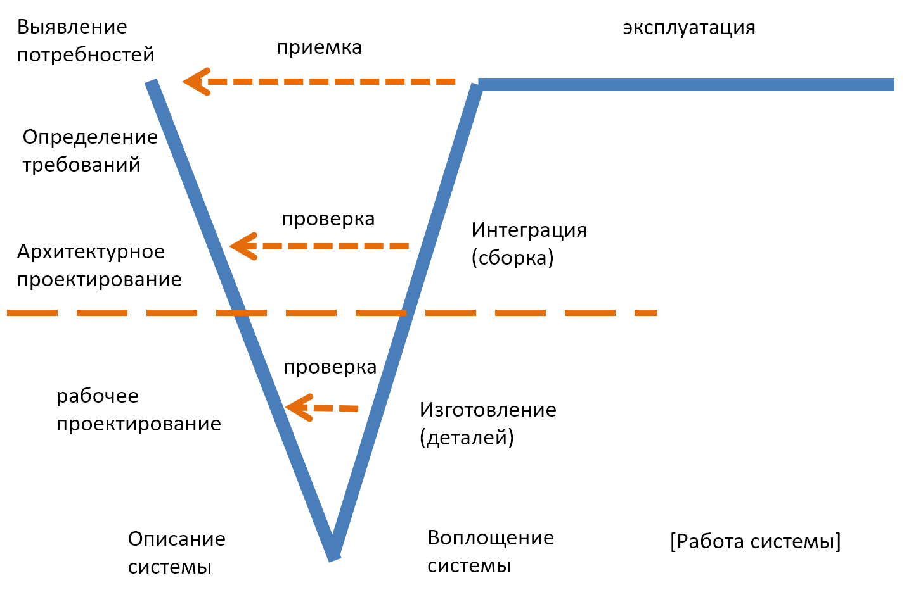

# V-диаграмма

Самым упрощённым, популярным и распространённым визуальным представлением «однократного» процесса инженерии (создания-без-развития) с показом основных практик в их развёртке по «логическому времени» является **V-диаграмма** (V-diagram, Vee diagram), популяризованная в 1991 году Kevin Forsberg[^r7-1]:

Это «культурное наследие» прошлых времён, и его нужно знать хотя бы для того, чтобы мочь поддержать разговор с инженерами старших поколений.

Название этой диаграммы происходит от формы латинской буквы V, а форма выражает «логическую»/функциональную линию времени, перегнутую пополам в точке, где укрупнённая стадия описания будущей системы (работа с битами, system definition) переходит в укрупнённую стадию воплощения системы (работа с атомами, system realization). Это такой упрощённый водопад ещё первого понимания жизненного цикла как работ, поделённых на стадии. На этом первые V-диаграммы обычно и заканчивались, но потом иногда начали изображать и **стадию эксплуатации/использования** (работы/функционирования системы, system operation) как длинный горизонтальный отрезок. На нашем рисунке это «иногда» показано квадратными скобочками вокруг [работы системы]. Внешний вид диаграммы больше стал напоминать квадратный корень, но название «V-диаграмма» осталось. Традиционную для системной инженерии с её «от рождения до смерти» стадию вывода из эксплуатации («смерти») на V-диаграммах изображать так и не начали.

Эти дополнения начальной V отражали постепенное принятие инженерами идей системного мышления:

* сначала идея жизненного цикла проекта/project разработки системы (то, чем занимаются системные инженеры в своём проекте),
* потом охват мышлением стадии эксплуатации (ещё шаг к удержанию внимания на полном жизненном цикле, добавили стадию),
* и только в самое последнее время (уже в 21 веке, начиная со стандарта ISO 15288, первая версия которого вышла в 2002 году) умолчанием является обязательное рассмотрение полного жизненного цикла — в том числе и (инвестиционный, коммерческий) замысел, начиная с проверки соответствия идеи проекта стратегии предприятия, берущегося за проект, и заканчивая выводом из эксплуатации/уничтожением после использования.
* И тут пришла концепция «непрерывного всего», в которой вывод из эксплуатации было чаще всего бесполезно проектировать заранее, ибо после MVP следовало множество стадий модернизации, увеличения сроков эксплуатации и т.д. — и up front планировать что-то связанное с выводом из эксплуатации стало бессмысленно. Поэтому по факту уничтожение так и не появилось в водопадных моделях жизненного цикла, всё так и заканчивалось эксплуатацией — а потом ушло в историю вместе с «водопадом».

Но V-диаграмма была шагом вперёд, ибо это была уже двумерная диаграмма того же «водопада»: в ней стадии/фазы/этапы (работы, разворачивающиеся по неявной линии времени) отражены по горизонтали, а методы работы указаны по вертикали, но ещё и были привязаны к линии времени для указания того, в каких стадиях ожидаются работы по этим методам. В этой диаграмме также отражено старинное представление о методах разработки: не столько современное выдвижение гипотез о том, какая может быть концепция использования, сколько уже устаревшая пара методов инженерии требований 1. «выявление потребностей» и 2. «определение требований» (requirements definition). Подробней о том, что в современной инженерии уже нет разработки требований, будет рассказано в руководстве по системной инженерии. Мы не будем тут менять набор методов инженерии на современный на этой диаграмме, даём её в привычном для предыдущего поколения инженерии виде.

Перегиб линии времени легко понять, если вспоминать, что время в функциональных диаграммах «логическое», это ведь не последовательно идущие шаги работы, а «одновременное» выполнение методов/функций. Так что время на этих двумерных «неколбасных» диаграммах видов инженерных процессов, пытающихся изобразить разложение методов работы в спектр по времени — логическое. Помним про первый раздел: можно, конечно, описать происходящее в принципиальной электрической схеме как «логические шаги по времени», в терминах «сначала-потом», но неплохо бы при этом удерживать во внимании, что в этих цепях ещё и действует закон Кирхгофа, а ещё могут быть всякие нелинейности, связанные с переменным током и индуктивностями. И это логическое «сначала-потом» при объяснении происходящего отнюдь не прямо транслируется в реальное физическое время. Можно, конечно, говорить «ток течёт, сначала поступая на вход нашей цепи, потом проходит трансформатор, потом подаётся на обмотку двигателя», но в реальной физике нет этого «сначала» и «потом» — там другой процесс, а принципиальная схема — она потому и «принципиальная», что отражает очень абстрактное описание принципов работы цепи.

Всё то же самое можно сказать про «принципиальные схемы инженерии», в которых текут предметы методов работы между функциональными объектами, выполняющими какие-то преобразования/transformations этих предметов работы. Тут ещё и сложности понимания в том, что описания инженерных процессов (и как их старинных вариантов — описания моделей жизненных циклов) часто не включали самих создателей в каких-то их ролях, но включали методы работы этих создателей. Это как «чеширский кот», у которого улыбка есть, а кота нет: роли не показаны, а вот методы работы этих ролей — показаны. Думать о таком очень сложно.

Если переходить от методологической действительности к операционной менеджерской, то есть к планам работ и работам, которые обсуждаются в привязке к физически наличным ресурсам и проходят в физическом времени, то диаграммы разных процессов инженерии (раньше — разных моделей жизненных циклов) указывают не строгий порядок выполнения работ, а просто методы инженерии, работы по которым нужно будет выполнять в проекте/project — в их примерной раскладке по стадиям этих работ.

Тем не менее, на V-диаграмме условно можно выделить три «логические» стадии условных работ (ну, или «укрупнённые стадии/фазы/этапы, работы по которым выполняются последовательно»), в которых отчётливо виден «водопад».

Первая из стадий —**описания** **системы** (system definition, замысливание и проектирование, работа с битами, информационное моделирование), когда физической системы/воплощения системы ещё не существует. Словосочетание «описание системы» тем самым используется в двух разных значениях (и никогда в значении «словарное определение» из неправильного перевода system definition!), и его значение определяется из контекста, как и для любого отглагольного существительного:

* Описание как информация о системе (акцент на то, что это описание как содержание «проектной документации», «системной документации», хотя уже и отсылка к «документам» устарела, это всё какие-то информационные модели в базах данных).
* Описание как описывание::работа, обобщённая/укрупнённая стадия жизненного цикла, то есть работы по описыванию системы/созданию описания системы в первом смысле этого слова (информация о системе, а не стадия). И тут даже английская не -ing форма (definition) не помогает: регулярно стадии работы называют не по их процессам, а по их результирующим предметам метода. «Забитый гвоздь» вполне может быть «работой по какому-то из методов забивания гвоздя, дающей на выходе состояние гвоздя «забитый»». Будьте внимательны к типам!

После того, как система спроектирована, линия «логического»/функционального/методологического времени делает перегиб, и начинается следующая стадия **воплощения** **системы** (system realization, реализация тут как «вынос в реальность», получение физического воплощения — изготовление, сборка, наладка). Словосочетание «воплощение системы» тем самым тоже используется в двух словарных значениях:

* Название системы как вещи (система как физическое тело в пространстве-времени, воплощение-существительное в отглагольном существительном: результат работ по воплощению)
* Название работы создателя по её ведущему методу, то есть обобщённой/укрупнённой стадии жизненного цикла (воплощение-глагол в отглагольном существительном: сами работы, приводящие к результирующей готовой системе-вещи).

Сам излом V нужен для того, чтобы удобно показать инженерные **обоснования/assurance.** Эти обоснования делили на два рода:

* **проверки/верификации/verification** — обоснование того, что сделали то, что запроектировали: «мы этого хотели, вот оно». Это было особо актуально в момент, когда вместо сценариев использования говорили о требованиях. Требования описывали систему в её границах, и вот это соответствие требованиям обосновывали.
* **приёмки/валидации/validation** — обоснование того, что сделано то, что надо, то есть учтены потребности, описание надсистемы (а не требования, описания самой системы). «Они этого хотели, вот им» — совершенно другая формулировка.

Различение проверки и приёмки было ещё лет десять назад (когда инженерия требований ещё была важнейшей дисциплиной, разработка требований была повсеместной) крайне важно, ибо часто требования разрабатывались самими инженерами, а от клиента нужно было просто согласиться с этими требованиями — без особого понимания последствий этого согласия. И если, например, система должна была работать под водой, а в требованиях это было опущено, то требования выполнялись, а система под водой не работала — и клиент не получал пользу. Инженеры же говорили: «вы этого хотели — вот вам, платите», клиенты отвечали «мы точно хотели не этого». Инженеры говорили про требования, а клиентам важны были потребности. Поэтому важно было в инженерных процессах показывать (обосновывать!) соответствие и требованиям (например, для каких-то инженерных тестов), и потребностям. Потом понятие «требования» канули в вечность, остались «потребности», актуальность проблемы исчезла. И в существенной мере актуальность V-диаграммы тоже ушла с исчезновением этого различения.

V-диаграмма говорит, что изготовление деталей (неделимых далее, то есть не собираемых из частей конструктивов) системы делается и обосновывается (для деталей — проверяется/верифицируется) в соответствии с проектом/design, стрелки проверки/верификации на диаграмме показывают именно этот факт. Ради показа этих стрелок **проверки соответствия** **воплощения описанию** и сделана сама V-диаграмма: она показывает «инженерный процесс»/«модель жизненного цикла» как упорядоченный «логически» (в целях объяснения) набор методов работы, в котором воплощение/создание/realization (то есть изготовление, сборка, наладка) системы происходит не путём проб и ошибок в физическом мире, а сначала путём размышлений и моделирования системы в ходе замысливания и проектирования, включая архитектурную работу — это всё работы по описанию будущей системы (system definition). Уже созданная/воплощённая (изготовленная в виде деталей, а затем собранная из этих деталей) система проверяется/верифицируется на соответствие её предварительно разработанному описанию — эти проверки изображаются стрелочками проверки на диаграмме.

Последнее, что происходит в ходе воплощения — это приёмка в эксплуатацию/валидация/validation, которая проходит в форме проведения испытаний на соответствие определённым в самом начале потребностям (то есть проверяется, что в жизни происходит не с целевой системой, а с надсистемой, когда в её составе работает целевая система — испытывается надсистема, или, если это невозможно сделать, хотя бы её виртуальная модель/эмуляция/имитация). Скажем, у вас был подводный аппарат, на который устанавливалась система, показавшая великолепные результаты при проверке, но поскольку под водой она не могла работать, то подводный аппарат не работал — всё, приёмка не прошла. А уж как не заплатить деньги за то, что инженеры пытаются навязать клиенту, для которого эта система бесполезна — у клиента всегда будут возможности не заплатить, и это этично. А вот отсуживать деньги за то, что «мы выполнили ваши требования, вы же их подписали» — это неэтично. Поэтому сценарии использования описывают то, что происходит в надсистеме во время использования целевой системы, а не только то, что делает сама система — и у них статус гипотезы, а не требований. Это в существенной мере смягчает этическую проблему при промахе с формулированием требований. Нет требований — нет этой проблемы!

Горизонтальная пунктирная линия, отделяющая верх и низ V-диаграммы, часто использовалась для того, чтобы отделить методы работы для системы в целом (это называли «системной инженерией») от работ по каким-то прикладным предметно-специфичным методам или методам для отдельных подсистем. К работе с системой в целом относили главным образом:

* разбирательство с «методологией разработки»/«инженерным процессом» (тогда это было «управление жизненным циклом», а также системноинженерный менеджмент как получение в инженерной организации оргвозможности вести инженерный процесс в соответствии с выбранным его видом),
* инженерию требований, ибо требования вроде как собирались для системы в целом (что оказалось плохой практикой!),
* системную архитектуру в её старом понимании (создание верхнеуровневой концепции системы), причём это считалось ведущей практикой системной инженерии,
* ввод в эксплуатацию готовой системы (наладку),
* инженерные обоснования (ведение испытаний, проверки и приёмки) успешности системы в целом.

Все остальные методы работы (включая, например, проектирование/design::метод с получением в результате проекта/design, проведение инженерных расчётов по каким-то инженерным отдельным методам работы — теплотехнике, аэродинамике) считались прикладными методами инженерии.

Из V-диаграммы видно, что так «по-старинке» понимаемые методы (их чаще называли «процессы», например в устаревшем уже идеологически стандарте «железной» системной инженерии ISO 15288[^r7-2] это system life cycle processes) системной инженерии встречаются главным образом на начальных и конечных стадиях проекта/project (сейчас при однократном проходе по «жизненному циклу» это была бы концепция использования и концепция системы, включающая современное понимание архитектуры в начале проекта, и испытания на соответствие им в конце проекта), а в середине проекта превалирует работа самых разных других инженерных специальностей, направляемая немногими архитектурными решениями. Современное понимание системной инженерии уже иное: это не какие-то отдельные «системноинженерные» методы работы, а наиболее общее описание сигнатур самых разных методов инженерной работы в их разбиении по культурно-обусловленным ролям, подробней об этих методах («как надо вести инженерную работу») и выполняющих их проектных ролях будет в руководстве по системной инженерии.

V-диаграмма — это одна из первых (это 1991 год, спиральная диаграмма — 1986 год, они практически неразличимы в историческом масштабе) «логических»/функциональных диаграмм, «принципиальных схем жизненного цикла», где появляются методы работы, именуемые по их инженерным дисциплинам/объяснениям/теориям. Её главная новация — разделение работ по описанию и воплощению системы с проверками и приёмками на основе сопоставлений проектной документации и того, что получилось в физическом мире, и ещё явное выписывание методов работ, как и в горбатой диаграмме. V-диаграмма характеризует водопадный/каскадный/cascade инженерный процесс (водопадную модель однократно проходимого жизненного цикла), но переход к двумерному отображению жизненного цикла от «колбаски» уже даёт многое — есть огромное число вариантов V-диаграммы, обсуждающих разные аспекты архитектурных решений по поводу жизненного цикла: каким образом практики задействуются в работах[^r7-3].

V-диаграмма, сохраняющая хотя бы видимость водопадной последовательности применения практик, изображающая «непрерывный прогресс» без возвратов назад и повторений, была не так радикальна, как спиральное изображение жизненного цикла, поэтому полюбилась менеджерам и получила огромную популярность. V-диаграмма активно используется и сегодня, с оговорками, что речь идёт о «жизненном цикле одной фичи» или «инженерном процессе для одной версии системы» и «в проекте у нас много таких V», и ещё при этом замечают, что «этапность работ на этой диаграмме не надо понимать буквально, зато удобно говорить о разделении инженерного труда». И всё-таки это уже «инженерный антиквариат»: знать надо, а пользоваться — не рекомендуем.

[^r7-1]: Forsberg, K., Mooz, H., 1991, "The Relationship of System Engineering to the Project Cycle", Chattanooga, Tennessee: Proceedings of the National Council for Systems Engineering (NCOSE) Conference, pp. 57–65., <http://www.damiantgordon.com/Courses/ISE/Papers/The%20Relationship%20of%20System%20Engineering%20to%20the%20Project%20Cycle.pdf>

[^r7-2]: <https://en.wikipedia.org/wiki/ISO/IEC_15288>

[^r7-3]: <https://incose-ru.livejournal.com/12765.html>
