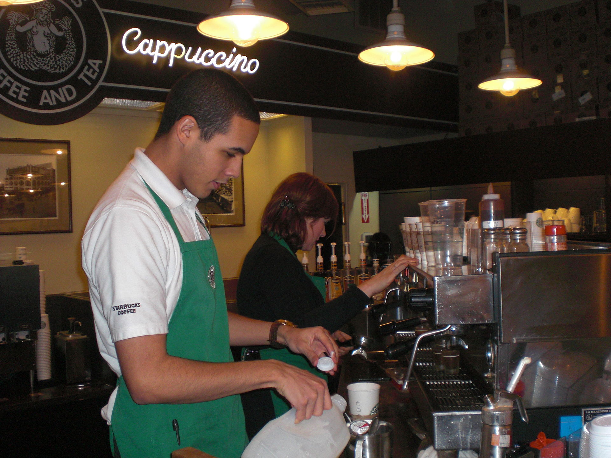
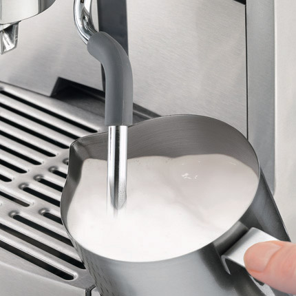
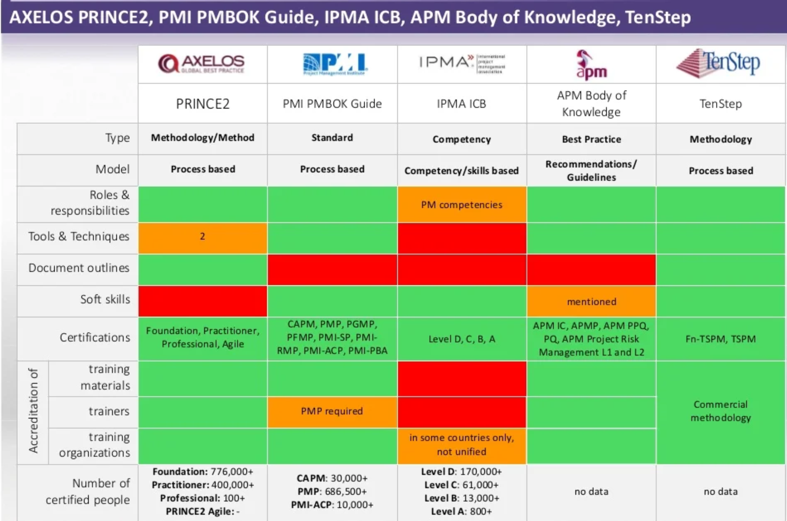

# Вариативность культур

Давайте рассмотрим **«приготовление** **кофе»**::культура/«рабочий процесс»/метод. «Кофе готовит»::метод **бариста**::роль. Мастерство бариста приобретают в школах бариста, где студентов учат знаниям/объяснениям/теории приготовления кофе и тренируют в использовании инструментария.

Есть множество учебных материалов, раскрывающих знания/дисциплину/теорию/алгоритмы приготовления кофе в разных вариантах метода приготовления кофе, например, **приготовления кофе с молоком**[^r7-1]::«вариант метода». В объяснениях/теории приготовления кофе с молоком уделяется внимание вопросу отделения действий, относящихся к особенностям подачи (например, лить кофе в молоко или молоко в кофе) от основы дисциплины: задание вкуса кофе. По факту большинство действий относятся к особенностям подачи в разных странах, разных барах, но сам вкус кофе с молоком зависит только от соотношения кофе и молока.

Приготовление кофе в кофе-машине обычно разбивается на следующие шаги, каждый из которых может быть разбит на более мелкие шаги (это очень похоже на представление алгоритма в императивной традиции, где отдельные операции представляются последовательностью):

1. Отмер и трамбовка кофе
2. Пролив
3. Опциональное приготовление молока и пены

1. Отмер молока и пены
2. Капучинирование

1. Обеспечение пара
2. Контроль температуры
3. Контроль объёма пены
4. Очистка насадки панарелло после капучинирования
5. ???*Простукивание*

3. ???*Простукивание*

4. Латте-арт

1. ???*Простукивание*
2. …

5. Подача

**Простукивание**::метод (это когда бариста стучит питчером/джагом/jug/«сосудом для приготовления молочной пены» об стол) нужно для того, чтобы убрать крупные пузыри и выровнять поверхность молочной пены, чтобы увеличить равномерность её пролива в ходе латте-арта. Дисциплина/«объяснительная теория» простукивания задаёт предметы метода с их состояниями как объекты внимания для контролирования того, что происходит:

* Поверхность молока (состояние по итогам простукивания: без «холмов» пены)
* Крупные пузыри (состояние по итогам простукивания: отсутствуют)

Простукивание у нас условно (с вопросительными знаками и курсивом) показано трижды:

* Предположительно, как последняя операция капучинирования
* Предположительно, как последняя операция приготовления молока и пены
* Предположительно, как первая операция латте-арта

Как правильно? Предписанного ответа на этот вопрос нет. Ответ существенно зависит от вашего проекта, от особенностей «вашего варианта метода»/«принятой у вас культуры» приготовления кофе.

Итак, вы познакомились с культурой/методом приготовления кофе с молоком. Какие вы можете предложить варианты метода? Например, вы можете менять варианты отдельных составляющих методов/практик в разложении этой культуры, например, для приготовления кофе дома:

* Отмер и трамбовку кофе сделать заводским методом, получаем при этом приготовление кофе из капсул (минус все легенды про «свежий помол, иначе теряются ароматы», так как капсулы герметичны и запечатываются в инертной газовой среде. Некуда теряться ароматам, любой химик это скажет).
* Капучинирование можно делать дома индуктивным капучинатором, то есть не нужно пара. Это чуть дольше, но существенно проще, не нужно очищать насадку панарелло (её попросту нет).
* Можно не обращать внимание на особенности подачи, ибо вкус зависит только от соотношения кофе и молока. Дома «красоту» и обычаи что куда лить, в какой посуде подавать, каких слоёв в итоговом напитке добиваться (латте макиато, например, должно иметь при правильном приготовлении три слоя, хорошо различимых в прозрачной чашке) можно игнорировать: вкус будет одинаковый, это как раз и говорит объяснительная теория.
* Предметы метода и настройка инструментов дают огромное число вариантов. Сорт кофе, температура пролива, количество воды в проливе, величина порции кофе, сорт и жирность молока определяют вкус, их вариативность игнорировать нельзя (и они важны как в капсульных машинах, так и в рожковых, так и при любом другом способе приготовления).

При этом важно, чтобы вы представляли, как весь этот «рабочий процесс» выглядит в реальном мире — и обязательно представляли бы то, что происходит до работы по методу (скажем, вы хотите выпить кофе: сколько времени ждать? Всё ведь должно прогреться до нужных температур, плюс время подготовительных операций для разных типов машин) и после работы по методу (например, сколько времени вы будете всё мыть и вытирать от кофе-порошка, молока при разных способах его готовки), должны оценивать риски (например, вероятность того, что вы просыплете порошок кофе или прольёте молоко, а затем всё это будете убирать, или вообще обваритесь в ходе приготовления). Оцените потребности, приходящие от надсистемы: кофе вам нужен только вкусный, и всё остальное неважно, или приготовление и подача должны быть предельно эстетичны и сопровождаться аурой профессиональной правильности. Если примат красоты в подаче, то ваш выбор — большие роскошные сложные кофе-машины, демонстрирующие загадочные сложные операции, которые делает бариста, а также тщательное соблюдение каких-то ритуалов подачи, совсем не влияющих на вкус, но показывающих класс обслуживания.

**Для методолога важно, что он понимает, как вообще устроена эта** **культура: так же, как и любая другая** **«по форме» (по типам мета-мета-модели участвующих объектов), различается только содержание!** **Для него варка кофе, смена подгузников, сооружение атомной станции, проведение выборов президента страны выглядят одинаково** **«по форме» (по типам объектов мета-мета-модели): это всё** **разные методы работы, «инженерные процессы», культуры, «виды труда», поэтому** **понятно как их обсуждать.** **Нужно обсуждать** **варианты этих методов и их** **SoTA, их разложения, спектр мастерства работников по шкалам этих разложений,наличие и доступность инструментария, а также надлежащих предметов метода (обсуждать оргвозможность, а не только сам метод). И выбор метода—** **это только стратегирование. Планирование—** **это следующий шаг, а реальное выполнение работ по плану—** **это ещё дальше, и не забываем о том, что надо ещё и проверить использование результатов работ (иначе можно было бы и не затеваться).**

Каждая прикладная культура работы имеет носителей этой культуры — агентов-мастеров, которых в совокупности называют «профессиональным сообществом», community of practice. Эти сообщества имеют свои своды знаний (в том числе в форме учебников и курсов, руководств и даже в случае религиозных сообществ «святых книг») по рациональным или не очень рациональным объяснениям методов, свои вузы (магистерские программы в вузе, если точнее, ибо бакалавриаты посвящены больше не прикладным объяснительным теориям, а фундаментальным), свои конференции, свои выставки, свои СМИ, форумы и чаты, у них есть свои знаменитости/celebrities как образцы для подражания.

Несмотря на одно и то же название для сигнатуры, варианты методов могут существенно различаться по их объяснительным теориям, инструментам и даже предметам метода. Разные организации часто присваивают себе право говорить от имени какого-то профессионального сообщества, но нужно быть крайне осторожными, чтобы им верить. Так, «системная инженерия» главным образом киберфизических систем как практика развивается самыми разными сообществами системных инженеров:

* IEEE Systems Council[^r7-2], который выпускает стандарты и публичные документы по системной инженерии, а также проводит в том числе IEEE International Systems Conference и издаёт IEEE Systems Journal по вопросам системной инженерии
* INCOSE[^r7-3], International Council of systems Engineering, который тоже выпускает своды знаний и стандарты, а также проводит международные конференции по системной инженерии и издаёт журнал Systems Engineering.
* Сообществами системных инженеров в крупных организациях, например, мы уже приводили пример свода знаний по инженерному процессу системной инженерии, разработанного сообществом системных инженеров NASA[^r7-4], можно привести аналогичный учебник, разработанный сообществом системных инженеров MITRE[^r7-5].

В области классического проектного управления, как варианта управления работами, конкуренция организаций, которые представляют себя как сообщества «профессиональных управляющих проектами», ещё жёстче. В классическом проектном управлении есть множество абсолютно разных вариантов методов, мастерство в работе по этим методам сертифицируется, содержание знаний метода для сертификации во всех таких организациях — разное. Вот сравнение нескольких таких организаций, поддерживающих разные версии практики проектного управления[^r7-6]:

Так что нужно быть внимательным: под одним и тем же именем (сигнатурой) могут скрываться абсолютно разные варианты методов, и наоборот — под разными именами может скрываться один и тот же метод. **Не спорьте о терминах, смотрите содержание.** Содержание в случае профессиональных ассоциаций/сообществ — это содержание, актуальность и рациональность их объяснительных теорий, а не развитый административный аппарат, хорошие организаторские и маркетинговые способности персонала организаций, занимающихся поддержкой сообществ и культуры этих сообществ.

[^r7-1]: <https://www.youtube.com/watch?v=tPlAWK-D6qY>

[^r7-2]: <https://ieeesystemscouncil.org/>

[^r7-3]: <https://www.incose.org/>

[^r7-4]: <https://www.nasa.gov/reference/systems-engineering-handbook/>

[^r7-5]: <https://www.mitre.org/sites/default/files/publications/se-guide-book-interactive.pdf>

[^r7-6]: <https://www.slideshare.net/miroslawdabrowski/axelos-prince2-foundation-en-ip>, слайд 43
