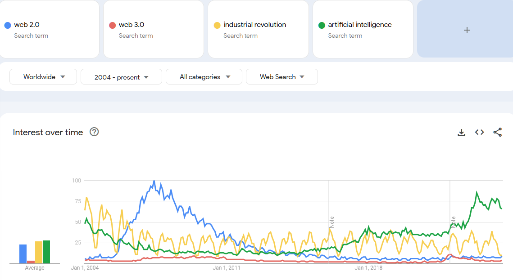
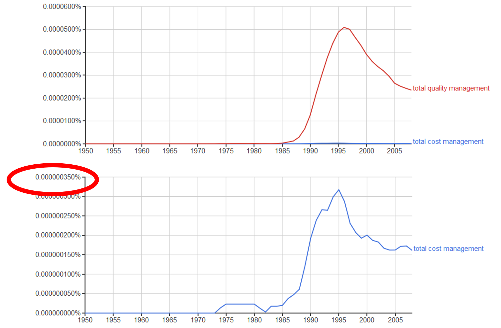
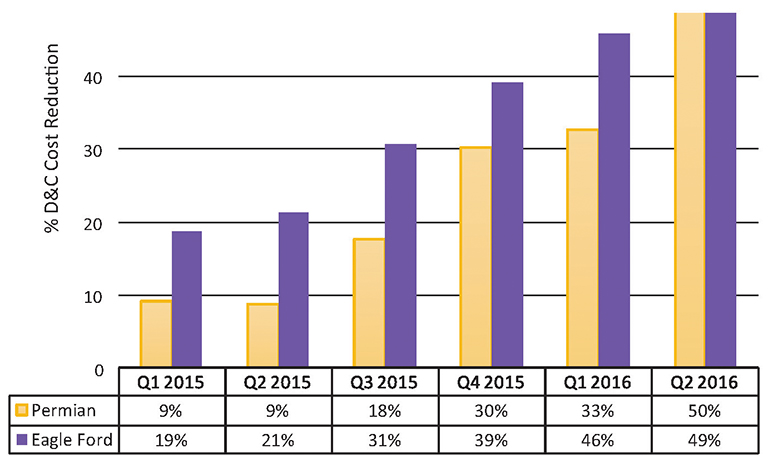

# Эволюция методов

Как всегда в случае эволюции, мы просто вводим ещё один «сверхдлинный» масштаб времени в изменениях системы-как-вида (а не экземпляра системы-как-организма, в техно-эволюции аналогии из дарвиновской эволюции), в этом случае мы системой считаем оргвозможность:

* время создания оргвозможности (время создания мастерства практики в создателе, «вызревание мастера»), это обычно довольно быстро.
* время одного исполнения работы по методу,
* время существования оргвозможности, где метод задействуется многократно,
* время эволюции метода (изменений знаний/объяснения метода, вся необходимая литература о техно-эволюции уже приводилась в руководстве по системному мышлению и ещё больше этой литературы будет в руководстве по системной инженерии: современная версия системной инженерии — это эволюционная системная инженерия).

Конечно, эволюция метода (поведения) сводится к тому, что эволюционирует мастерство (вернее, «популяция мастерства», речь идёт о культуре, но это уже нюанс, подробней будет в литературе из руководства по системной инженерии), основывающееся на знаниях о методе (осознанных или неосознанных, это не важно, но если знание осознанное и письменное, то можно легко накапливать smart mutations. Это трудно, если речь идёт об «устной традиции», эволюция тогда крайне медленная — успешные мутации не накапливаются, а также трудно говорить именно о smart мутациях, они часто случайные, а не тщательно спроектированые).

Всё, что мы знаем про эволюцию, в эволюции практик тоже будет соблюдаться:

* Если метод существует некоторое время, то можно считать, что он как-то субоптимален (то есть не абсолютно оптимален, но лучше многих других, «победил в конкуренции», «наименее плохой»)
* Небольшие «мутации», то есть отклонения от того, что предписывает объяснительная теория метода, изменения в инструментарии очень редко будут приводить к кардинальным улучшениям (эволюционным сдвигам), и это кардинальное улучшение обычно будет связано с переходом ко всё более сложным методам. Чаще всего эти «мутации» будут ухудшать практику («смертельные мутации»), относительно часто они будут нейтральными.
* Вариантов методов, которые дают примерно одинаковые субоптимальные результаты — огромное количество, это явление называется неустроенностью/неустаканенностью (не путать с неудовлетворённостями, термин не из психологии, он взят из физики, обобщение geometrical frustrations[^r7-1]). Нет «единственно верного метода»: 1. Верный метод вообще недостижим, есть приемлемый, субоптимальный (и эта субоптимальность — только на сегодняшний день! Среда, для которой идёт оптимизация, тоже эволюционирует, поэтому статическое рассмотрение «оптимума» опасно). 2. Приемлемых методов с примерно похожей эффективностью — множество, все они наличествуют одновременно, делят одну и ту же эволюционную нишу.
* В большинстве случаев не нужно особо тщательно выбирать конкретный вариант метода и его инструментария, а также вариант исходных предметов метода (сырьё) из более-менее одинаковых. За счёт неизбежных мутаций их эффективность будет примерно равна.
* Учитываем, что разложение метода часто работает рекурсивно на многих системных уровнях, так что важна многоуровневая оптимизация (выбираются решения по методам, которые помогают снять конфликты между разными системными уровнями. Так, если брать практику управления/control как быстрого и точного достижения какого-то заданного состояния системы, то «централизованные одномасштабные системы управления» позволят достигать состояния быстро и неточно, децентрализованные — очень точно, но не очень быстро. Нужно иметь многоуровневую систему управления со множеством обратных связей, задействовать разные методы на разных масштабах, именно это диктует нам современная дисциплина синтеза систем управления[^r7-2]. Если нет учёта многоуровневости — нельзя говорить о том, что вы как-то системно стратегируете, выбирая метод. Ваша оптимизация будет одноуровневой, она не будет снимать межуровневые конфликты).
* Вся эта оптимизация метода временная, речь идёт о динамическом ландшафте приспособленности: эволюция не останавливается и не заключается в бесконечном приближении к какому-то неподвижному оптимуму. Нет, оптимум сам непрерывно движется, что было оптимально вчера — уже неоптимально сегодня, а что оптимально сегодня утром — будет неоптимально уже сегодня вечером!

Иногда говорят о модах и поветриях в методах работы. Мода — это когда новый метод работы (и его теория) уже появился, и мастерство выполнения этого метода становится популярным, знание/теория быстро распространяется по агентам, метод становится «культурой», и так и остаётся популярным.

Это прямая ассоциация с индустрией моды. Скажем, некоторое время назад (первая половина 1960-х) появилась практика носить мини-юбки, и так и осталась до настоящего времени. В 60х это и была «мода». А вот в 1920 годах женщины рисовали брови, ниспадающие наружу-вниз — это быстро прошло и уже забылось[^r7-3], это можно считать «поветрием», неудачной мутацией.

Все эти культуры/стили (синонимы метода!), более и менее удачные, тоже подчиняются законам эволюции, только не дарвиновской, а техно-эволюции. Они тесно связанной с меметикой и особенностями памяти мемов (как и биологическая эволюция связана с генетикой и особенностями памяти генов).

Мемы задают варианты методов в их разложениях так же, как гены задают биологические виды: виды приходят и уходят, новые виды появляются, живут виды разное время и неожиданно по каким-то причинам вымирают или появляются. Трилобиты и динозавры вымерли, млекопитающие остались, люди появились буквально «вдруг» в масштабах времени дарвиновской/биологической эволюции, а насекомые были давно и останутся, видимо, надолго.

Вот и методы работы надо рассматривать как результат эволюции, накопления полезных для чего-то мутаций в знаниях о методе. Мемом (как геном, но из мемов, а не генов — знание о методах, поведении агента) организации состоит из мемов, определяющих организацию, но примерно то же можно сказать и про личность, где небиологическая часть огромна, и про сообщество, и про общество. Мемы приходят и уходят. Вот интерес к некоторым распространённым технологиям (синоним метода!), определяемый на основе интереса к поиску слов, которыми эти технологии обозначаются (на август 2024)[^r7-4]:

Термин Web 2.0 пришёл и ушёл из обращения, но его технологии/методы остались, это было не поветрие, это была острая мода — и термин для этой группы методов появился как раз для того, чтобы отслеживать эту «острую моду». Социальные сети (user generated content) и рекомендательные системы, в которых собирают оценки, которые дали читатели-слушатели-зрители, до сих пор с нами, они никуда не ушли, их и называли технологиями Web 2.0. Web 1.0 был про «порталы» как «точки входа в сеть», порталы вполне остались (скажем, поисковая страница Гугла), но в Web 2.0 упор делался на разные варианты социальных сетей.

Сейчас Web 2.0 не «тренд», а окружающая нас реальность, поэтому название ушло из поисковых запросов. Легко представить множество людей, которые гуглят «мини-юбки» (если бы тогда был Гугл) в 1960х, но трудно представить людей, которые гуглят про них сейчас, наличие мини-юбок уже давно не новость, они просто есть. С Web 2.0 такая же история, как с мини-юбками.

А вот с Web 3.0 другая история. Этот термин появился для обозначения технологий семантических сетей (semantic networks)[^r7-5] в конце нулевых годов 21 века. Термин отражал прогноз для «большого нового тренда интернет-технологий», потом термин подзабылся, ибо семантические сети «не взлетели», они остались довольно маргинальной технологией с не очень большим распространением.

Недавно был маленький всплеск нового употребления термина, но это теперь означает metaverse, виртуальные трёхмерные миры, ещё один претендент на «большой тренд». И был ещё всплеск попыток назвать технологии блокчейна технологиями Web 3.0. До сих пор непонятно, что же может считаться Web 3.0. Похожая история произошла с компьютерами: их было пять чётко выраженных поколений, основанных на разном инструментарии (вакуумные лампы, дискретные транзисторы, интегральные микросхемы, микропроцессоры и большие интегральные схемы, а пятое поколение так и осталось непонятным, что же это такое, хотя квантовые компьютеры и нейроморфные компьютеры пытаются причислить уже к шестому поколению, не разобравшись с пятым).

Искусственный интеллект вышел из острой моды конца 80х годов прошлого века (так называемая «зима искусственного интеллекта»), но после появления ускорителей вычислений интерес к нему возобновился после появления успешных искусственных нейронных сетей в 2012 году, и продолжает расти, особенно с выходом ChatGPT в марте 2023 года.

Конечно, все эти новации были не такими сильными потрясениями, как приход социальных сетей после порталов, то есть появление технологий Web 2.0. Web 2.0 оказался очень сильным потрясением для всего человечества: каждый человек получил методы работы, дающие возможность стать писателем, журналистом, телестанцией, радиостанцией без организаций-посредников. Это был цивилизационный сдвиг, это широко обсуждалось. После появления ChatGPT ситуация меняется, искусственный интеллект очень активно обсуждается, просто терминология ушла от «поколений», моды и поветрия перестали быть хорошо наблюдаемыми.

Какие характерные сроки моды в распространении новой культуры/стиля/технологии/практики/метода? Как всегда в случае эволюции, ничего тут сказать определённого нельзя, но нужно быть очень внимательным. Скажем, методы проектного управления довольно быстро дрейфуют от классических сетевых методов предварительного планирования, хорошо работающих с «сугубо водопадными» жизненными циклами в каком-нибудь типовом строительстве, к кейс-менеджменту, хорошо работающему с гибким/agile инженерным процессом, который хорошо приспособлен к ситуациям не чистой разработки, но исследований и разработок, создания новых систем.

Если взять методы инженерии предприятия (больше известным как «менеджмент»), то там примерно такая же картина с разными вариантами разложения этих методов. Мода — это когда практика приходит, и остаётся. Но бывают и поветрия. Вот использование терминов «тотальный чего-то менеджмент» в базе данных книг[^r7-6]:

Видно, что метод total cost management появилась раньше, чем total quality management, **смысл тотальности** **тут** **в том, что управлением ценой должны были заниматься все сотрудники предприятия прямо на своих рабочих местах, речь шла о «трансдисциплинарности» знаний метода.** Эта идея/мем росла в популярности десяток лет, а потом немного упала в популярности, но в целом осталась. Это была мода. А ещё эта идея/мем мутировала и стала идеей, что так же тотально нужно управлять качеством: каждый должен заняться качеством на своём рабочем месте. И вот эта «вторичная мода» оказалась мощней тотального управления стоимостью, если сравнить графики в одном масштабе (на картинке это первый график), то на фоне графика роста популярности и последующего падения острой модности (но из жизни эта идея никуда не делась!) тотального управления качеством рост популярности раньше появившейся идеи тотального управления стоимостью практически оказывается не виден, нужно приводить график другого масштаба, чтобы разглядеть его форму.

Интернет привёл к тому, что идеи/мемы знаний/объяснений/теорий/дисциплин/алгоритмов новых методов и их мутаций для уже популярных методов распространяются исключительно быстро. Развитие промышленности и компьютерного инструментария дают возможность быстрого размножения реализаций этих мемов в физическом мире (как геном реализуется в клетках и организмах, так и мемом реализуется в мастерстве агентов: людей, систем AI, организаций, новые эффективные методы быстро становятся культурой в сообществах, обществах и даже человечестве, формируют фенотип. И если лет двадцать назад в доинтернетную эпоху мы видели «эволюционный срок» появления нового метода и угасания либо моды на этот метод (но сам метод остаётся! Мода приходит и уходит, но её объект остаётся), либо поветрия (метод вымирает, оказывается эволюционно неудачным) лет так в двадцать, сегодня это явно не больше пяти-шести лет, завтра это будет пару лет года (или уже сегодня такое можно видеть?), а в ближайшем будущем можно ожидать **технологической сингулярности**[^r7-7], одно из определений которой гласит, что это такие времена, когда технологии (синоним метода!), становящиеся культурой (то есть методы, мастерство в которых получает широкое распространение) обновляются так быстро, что ни один человек не может сориентироваться в происходящем, настолько быстро меняется мир — и поэтому смотреть надо на системы искусственного интеллекта, которые будут приобретать агентность (автономность в работе), успевать отслеживать ситуацию и тем самым получат преимущество перед людьми.

Методы с их дисциплинами и инструментарием влияют на вас, ваши организации, сообщества, общества много больше, чем вы можете себе представить. К эволюции этих методов нужно относиться серьёзно — распространение новых культур нужно отслеживать, для этого важно быть прикладным методологом в своей предметной области.

Вот, например, результаты[^r7-8] постановки новых практик менеджмента в компании BHP Billiton за полтора года, и это было ещё десяток лет назад:

BHP Billiton сумела уменьшить за счёт освоения методов элегантного управления (lean management — вариант операционного управления, в котором минимизируется количество лишней работы) стоимость бурения и заканчивания скважин[^r7-9] за 18 месяцев на 50% в бассейне Permian и на 49% в бассейне Eagle Ford. Аналогичные результаты показали и другие нефтегазовые компании, которые применяли lean management. Сам метод минимизирования лишней работы lean появился под этим названием в 1988 году[^r7-10], и он «пришёл, чтобы остаться», мутируя в lean manufacturing, lean construction, lean project management и далее приобретая форму, пригодную уже не просто для промышленного производства, но и для разработки (это будет подробно изложено в руководстве по системному менеджменту).

Так что с методами та же ситуация, что и с биологическими видами: общее число и сложность их растёт, численность популяций носителей мастерства в этих методах существенно меняется со временем (растёт или падает), причём каждый день появляется много новых методов и вымирает много старых.

Например, вот организационные моды и поветрия, которые были собраны Томасом Давенпортом и Ларри Прусаком в 2003 году[^r7-11], сколько из этих методов вам знакомы? Много этих методов стали культурой (то есть мастерство в них широко распространилось), а затем уже вымерло с тех пор, оказалось поветрием — но до сих пор имена этих методов встречаются в литературе. Динозавры-то вымерли, но название «динозавр» встречается много чаще, чем слово для каких-то вполне живущих сегодня видов! Более того, дети сегодня могут различать разные виды динозавров, но могут не различать ныне живущие виды зверей: это особенности бытования культур. С методами работы происходит всё то же самое, что со знаниями про динозавров и людей, будьте внимательны. Вот этот список того, что было модно более двадцати лет назад:

* Activity-based costing
* Activity value analysis
* Adaptive enterprises
* Artificial intelligence
* Attention management
* Balanced scorecard
* Benchmarking
* Brainstorming
* Brand management
* Business modeling
* Cannibalization
* Centralization/decentralization
* Change management
* Chaos/complexity
* Competitive intelligence
* Complex adaptive systems
* Concurrent engineering
* Conglomeration
* Continuous improvement
* Co-opetition
* Core capabilities
* Core competence
* Corporate culture
* Cost-benefit analysis
* Creative destruction
* Crisis management
* Critical-path analysis
* Cross-selling
* Customer relationship management
* Customer satisfaction
* De-layering
* Decision trees
* Diversification
* Double-loop learning
* Downsizing
* e-Commerce
* e-Marketplaces
* Economic value analysis (EVA)
* Economies of scale/scope
* Electronic data interchange (EDI)
* Empowerment
* Enterprise systems
* Entrepreneurship
* Evolutionary modelling
* Excellence
* Experience curves
* Experience economy
* Five forces analysis
* Flat organizations
* Franchising
* Game theory
* Globalization
* Growth/share matrix
* Hawthorne effect
* Hierarchy of needs
* Horizontal organization
* Information ecology
* Information management
* Intellectual capitalism
* Intellectual property management
* Interorganizational systems
* Intrapreneurship
* Just-in-time delivery
* Keiretsu
* Knowledge management
* Lead user analysis
* Leadership
* Lean production
* Learning organizations
* Lifetime customer value
* Loyalty management
* Management by objectives
* Management by walking around
* Managerial grid
* Marketing myopia
* Mass customization
* Mass production
* Matrix management
* Mentoring
* Mission statements
* One-minute managing
* Open-book management
* Operations research
* Organizational ecology
* Outsourcing
* Paradigms
* Pay-for-performance
* Permission marketing
* Portfolio analysis
* Portfolio management
* Process improvement
* Product life cycles
* Profit pools
* Prototyping
* Quality circles
* Quality of work life
* Real options
* Reengineering
* Resource-based strategy
* Restructuring
* S-curves
* Satisficing
* Scenario planning
* Scientific management
* Scientific retailing
* Segmentation
* Services
* Seven S model
* Simulation
* Six Sigma
* Social capital
* Sociotechnical systems
* Spans of control
* Strategic alignment
* Strategic business units
* Strategic planning
* Strenghts, weaknesses, opportunities, threats (SWOT) analysis
* Succession planning
* Supply chain management
* Synergy
* Systems dynamics
* T groups
* Teams
* Technology transfer
* Theories X and Y
* Theory Z
* Time-based competition
* Total quality management (TQM)
* Unbundling
* Value chain
* Value disciplines
* Value migration
* Value proposition
* Vertical/horizontal integration
* Virtual organizations
* Vision
* War for talent
* Wellness
* Yield management
* Zero-based budgeting

Это только то, что показалось авторам списка достаточно известным и популярным в 2003 году.

Вы должны понимать, что даже способов чистить зубы можно ожидать найти в литературе сотню, а уж методов менеджмента — тысячи и тысячи, в них очень легко запутаться и подхватить какого-нибудь давно вымершего «динозавра». Понимание того, что большинство методов даст вам квазиоптимальные результаты, немного должно вас утешить. Но некоторые методы таки дадут крупные оптимизации и приведут к новым уровням оптимизации работы. В менеджменте (инженерия организации) разделение труда в форме конвейерного производства, lean варианты операционного менеджмента «пришли, чтобы остаться» — они уже не «модны», они просто есть.

**Меметическая эволюция** **инженерных процессов, методов менеджмента, способов обучения** **продолжается,** **а** **от эволюции всегда можно ждать неожиданностей. Будьте бдительны, отслеживайте новые практики.**

[^r7-1]: <https://en.wikipedia.org/wiki/Geometrical_frustration>

[^r7-2]: <https://ailev.livejournal.com/1622346.html>

[^r7-3]: <https://www.youtube.com/watch?v=-pCECNvUs2Q>

[^r7-4]: <https://trends.google.com/trends/explore?date=all&q=web%202.0,web%203.0,industrial%20revolution,artificial%20intelligence>

[^r7-5]: <https://en.wikipedia.org/wiki/Semantic_network>

[^r7-6]: <https://books.google.com/ngrams/graph?content=total+quality+management&year_start=1950&year_end=2008&corpus=15&smoothing=3&share=&direct_url=t1%3B%2Ctotal%20quality%20management%3B%2Cc0>

[^r7-7]: <https://ru.wikipedia.org/wiki/Технологическая_сингулярность>

[^r7-8]: <https://onepetro.org/JPT/article-abstract/69/03/42/208691/Succeeding-in-the-Shale-Business-With-a-Lean-Well>

[^r7-9]: <https://neftegaz.ru/tech-library/burenie/147509-zakanchivanie-skvazhiny/>

[^r7-10]: <https://en.wikipedia.org/wiki/Lean_manufacturing>

[^r7-11]: Thomas H.Davenport, Laurence Prusak, 2003, "What's the Big Idea?: Creating and Capitalizing in the Best Management Thinking"
