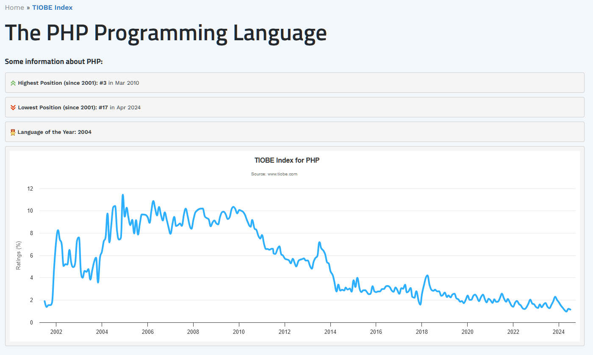

# Совершенствование и развитие

**Совершенствование** (improvement) предприятия как системы создания и развития какой-то «нашей системы» сводится к смене инструментария на более современный, наладке бездефектной работы инструментов, налаживанию хорошей логистики рабочих продуктов между технологическими операциями (выполнение методов операционного менеджмента для ускорения выпуска: элегантность как прекращение выполнения ненужной работы и уменьшение «заделов», в том числе нарезка на осмысленные куски работы вместо произвольных границ между отдельными работами, подстройка под ограничения на поток работ, продуктов, информации, и т.д.).

Методы работы (методы в составе инженерного процесса) при совершенствовании меняются главным образом в части замены инструментария на более производительный и изменения моментов начала и конца выполнения работ в целях их ускорения. К совершенствованию будут относиться и меры по надзору за выполнением рабочих процессов «как надо» (в соответствии с описанной в регламентах, инструкциях, стандартах дисциплиной), а не «как придётся», что поднимет качество выполнения работ и уменьшит переделки/re-work. Это и дообучение сотрудников, и работа с чеклистами и даже автоматизация (сдвиг части работ людей на не очень живых агентов). Главное, что лежащие в основе метода его знания/теории/дисциплины/объяснения/алгоритмы — они не меняются.

Например, при совершенствовании люди переучиваются (training) на работу с новым инструментом, скажем, осваивают новый софт для той же дисциплины: пересаживаются с одного САПР на другой, или с одного issue tracker на другой — ничего не меняя в своём мышлении. При совершенствовании не нужно дополнительно образовываться в части прикладных дисциплин выполняемых методов, читать учебник с новыми понятиями — мышление остаётся тем же. Резал салаты обычным кухонным ножом, поменял нож на профессиональный поварской из лучших сортов стали — всё, затачивать нож надо реже, огрехов в нарезке меньше, но ничего в умениях резки менять не надо. Если в фирме годовой цикл бюджетирования был без поддержки софта, а стал с поддержкой софта — это совершенствование, но не развитие. Развитие — это когда надо будет поменять метод бюджетирования с ежегодного на постояннотекущее, beyond budgeting (будет проходиться в «Системном менеджменте»), для этого развития придётся переучить всех сотрудников, соприкасающихся с тратами средств предприятия. Для совершенствования переучивать не надо, дисциплина не меняется, из неё просто выжимают с каждым шагом совершенствования всё, на что эта дисциплина способна в плане роста производительности.

Хорошим приближением про мышление о совершенствовании будет замечание, что оно идёт по линии изменения фенома: мемом, по которому была сделана система, по факту не трогается — нет новых идей, есть реализация старых идей, эта реализация становится всё лучше и лучше, элегантней и элегантней, усилий тратится меньше, результаты — больше, но по большому счёту ничего не меняется. Совершенствование тут — приспособление системы к среде, не затрагивающее знаний: головы и компьютеры не приходится перепрограммировать новыми знаниями, только подстраивать старые знания к новому окружению и подбирать более удобный и качественный инструментарий.

Если попытаться заново сделать систему с тем же мемомом, то есть действующую по тому же методу (метод у нас определяется его знаниями/объяснениями/дисциплиной прежде всего), то опять придётся всё «подстраивать», совершенствовать, чтобы дойти до похожих показателей продуктивности (скорости выпуска, скорости проведения системой-создателем изменений в окружающем мире). Биологически (где не мемом, а феном) это означает, что растущего утёнка будут кормить получше, лечить получше, тренировать и воспитывать, но лебедя из него не получат — только здоровую сильную утку. Как ни меняй лопату землекопу, как ни тренируй его — экскаваторщика не получишь. Причём замена инструмента с «усовершенствованной лопаты» на тот же экскаватор — это уже будет развитие, ибо придётся переучивать заново всё, что знает землекоп про копание земли, меняться будут знания метода, а не только инструмент.

**Развитие** (development) предприятия/оргзвена (помним, оргзвено — это от одного человека, даже и участвующего part time, а не полный рабочий день) происходит тогда, когда меняются знания, используемые мастерством выполнения метода. Это означает чаще всего, что меняется и поддерживающий это мастерство инструментарий. Поменяли синхронную коммуникацию (совещания) на асинхронную (форумы и чаты)[^r7-1] — и тут же изменились инструменты: исчезли большие столы в комнатах начальников, исчезло изобилие переговорок, зато появились многочисленные треды комментов в самых разных информационных системах, начало работать множество чатов в мессенджерах.

Для возможности развития люди **образовываются** (education, «как в школе и вузе») для получения возможности быстро учиться, осваивать новое, не теряться в новых ситуациях. Затем для освоения новой прикладной дисциплины мышления по новому методу, они изучают новые понятия и их отношения, а дальше обучаются/тренируются (training, часто на рабочем месте) в работе с новым инструментарием поддержки новой дисциплины.

По факту при развитии происходит коррекция мемома, знаний по созданию систем — те самые smart mutations/«умные мутации», которые потенциально (не факт! Это всё «гипотезы», хотя и тщательно продуманные) приведут к получению новых качеств. Скажем, когда подхакивают гены утёнка и он становится больше похожим на лебедя, и если теперь повторять создание системы по этим генам, то сразу и шея бывшего утёнка будет длиннее, и тело крупнее. Это, конечно, не отменяет того факта, что новую систему тоже можно совершенствовать, но шея у даже плохонького «нового развитого утёнка» будет подлинней, и тело покрупней, чем у хорошо тренированного и откормленного «старого долго совершенствованного», а уже если его совершенствовать — то и шея несказанно длинней, и тело существенно крупней. Гены решают всё. Без развития, то есть смены знаний, а не только совершенствования как «надлежащей настройки» при тех же знаниях, будет «лысенковщина»[^r7-2]: попытки получить путём «надлежащего ухода за организмом» такой феном (набор отличительных признаков организма), который можно получить только модификацией генома. Ничего хорошего из такого подхода «много совершенствования даст развитие» обычно не получается: сколько ни совершенствуйте прыжок в высоту методом «ножниц» (знания/алгоритм там — прыгать к планке лицом, перекидывая одну ногу за другой над планкой), двух метров планки вам не преодолеть. Придётся полностью перестроить объяснения/теорию/знания того, как надо прыгать: учить мастерству разворачиваться в полёте к планке спиной и перелетать её лицом вверх — переучивать в прыжке придётся всю технику прыжка, прошивать в виде мастерства новую дисциплину. А заодно менять инструментарий: накачивать другие мышцы в их другой координации, нежели дающие максимальный результат для прыжков «ножницами».

Текущий тренд (впрочем, этот тренд был всегда — просто это было трудно заметить, в развитии работают экспоненциальные законы, и ещё совсем недавно тренд был не так очевиден, об этом будет рассказываться чуть дальше) в том, что **периоды совершенствования становятся всё короче и короче, и всё чаще и чаще приходится осуществлять шаги развития: предприятие/оргзвено начинает использовать незнакомые членам команды** **методы** **работы. Чаще меняться в работах по каким-то методам начинает не только инструментарий, но и весь метод в целом (часто вместе с агентами, которые меняются с имеющих великолепное мастерство в старом методе на имеющих хотя бы едва приемлемый уровень мастерства в новом методе). В** **конкурентной борьбе оказывается недостаточно использовать «лучшие инструменты», необходимо использовать и «лучшее мышление», которое происходит в силу обучения лучшим на сегодня (SoTA)** **знаниям. И** **уж это «лучшее мышление» поддерживать «лучшими инструментами». Скажем, признать, что в текущей деятельности невозможно какое-то планирование** **upfront** **и перейти от классического управления проектами с софтом управления проектами к управлению кейсами и освоить софт трекеров/issuetracker—** **тут описан массовый переход от одного поколения методов операционного менеджмента к другому, который описан в предыдущих двух разделах.**

Интересно, что некоторые наши инженеры-менеджеры воспринимают материал предыдущих разделов как справочно-исторический, «художественную вставку в текст учебника, передышку в изучении». Но нет:

* Описывается логика, в которой обнаруживались проблемы одного поколения методов как методологии, так и операционного менеджмента (дисциплины/знания/объяснения этих методов тесно связаны друг с другом) и решались эти проблемы. С одной стороны, это и впрямь описание. С другой стороны, текущая инженерная культура (культура — синоним «метода работы», только указывающий на широкое распространение) во многом включает в себя обрывки всех этих мемов, всех описываемых вариантов устройства инженерного процесса. Надо смотреть на рабочий проект — ваш или соседа, и там буквально видеть задействование этих мемов. Если от вас требуют спланировать-сбюджетировать разработку, показать стадии работы, то вы попали в культуру «водопада». И дальше вы знаете, какие у вас (ну, или у них — если это не ваш проект, или опять-таки у вас — если ваш проект зависит от их проекта с «водопадом») будут проблемы.
* Самое страшное тут — это взглянуть в зеркало: что у вас в голове? Поднимите вашу переписку, пересмотрите ваши видео. Каким языком вы говорите о вашем инженерном процессе? Например, «итеративность» — вы имеете в виду «спринты» в «непрерывном всём», но почему говорите «итерации»? Или более древние «итерации» из RUP — докрутку в несколько спринтов до заранее запланированного результата? А что понимают под этим ваши коллеги? Какой у них в голове инженерный процесс, как отражаются в этих головах ваши слова? Попробуйте выявить использование терминов в вашей речи, провести контроль типов, буквально понимать то, что вы же говорите. Совпадает ли то, что вы реально сообщаете с тем, что вы думали сказать? Опыт наших учебных потоков показывает — нет, не совпадает. Материал разделов не был использован как учебный, как инструкция для мышления и проверки качества коммуникации.

Всё то же самое надо смотреть и в самых разных других материалах, в которых рассматривается смена инженерной культуры, смена методов работы. Это, например, новостные ленты профессиональных медиа, занимающихся прикладной методологией той или иной предметной области. Скажем, вы пошли учиться самому модному языку программирования для разработки вебсайтов (веб-разработка, «инженерный процесс разработки приложений, доступных в виде интернет/веб-сайта через веб-браузер») — PHP, и вдруг (по историческим меркам — действительно вдруг!) этот язык стал абсолютно немодным. И то же самое произошло с другим самым модным языком — Perl. При этом вы изучили ещё один язык JavaScript, и угадали, он вроде бы немного задержался. Но нет, каждые несколько лет вам приходится выучивать «язык на языке», который вроде бы является инструментом (программный фреймворк), но на деле требует мастерства в некоторых весьма специфических методах веб-разработки. И вам приходится переучиваться каждые несколько лет, хотя вроде бы вы и знаете язык! Ужас же ещё и в том, что «вышел из острой моды» — это ничего обычно не значит, ибо перспектив у метода вроде уже нет, но в мире полно людей, которые пользуются этим методом после долгих периодов совершенствования, и новые перспективные методы на самых первых шагах, не имея шанса показать себя полностью, в глазах многих и многих людей имеют равные примерно возможности со старыми методами и их инструментарием. Вот она, неустроенность (не путаем с конфликтами, не путаем с неудовлетворённостью) — наличие огромного числа вариантов методов с похожей эффективностью для каждой сигнатуры метода. Но если приглядеться, то окажется, что в тех же языках программирования популярность их разительно меняется, скажем, до 2002 года мы ничего не слышали о языке PHP, затем через восемь лет в марте 2010 он оказался третьим по популярности среди всех языков в индексе TIOBE[^r7-3] (ибо на нём программировали Мордокнигу, поэтому довольно много людей сочло, что в их проекте этот язык тоже будет хорош), в апреле 2024 он уже семнадцатый, взлёт и падение прошли за какой-то десяток лет[^r7-4]:

И эта смена методов происходит сейчас повсеместно. Так, космические корабли всегда строили из алюминия. Но оказалось, что алюминий при высоких температурах (а при аэродинамическом торможении космических кораблей температуры весьма высоки) непрочен, его поэтому надо для заданной прочности побольше — а когда его много, то алюминий тяжёл. Сталь при высоких температурах остаётся прочна, поэтому её надо немного для заданной прочности — и стальной корабль оказывается дешевле, легче и крепче алюминиевого. Космический корабль Starship уже делают из стали, так что мастерство делать ракеты из алюминия уже по факту неактуально. То, что огромное число людей продолжает считать космические корабли алюминиевыми, ибо «алюминий легче» — правда. То, что прямо сейчас ракеты летают алюминиевые — правда. Но это будет правдой уже очень недолго, поскольку прототип Starship уже долетел до космоса, инженеры всего мира знают, что стальные корабли лучше. И такое везде, во всех сферах человеческой деятельности: знания развиваются, методы работы развиваются, это означает, что какие-то методы работы надо забыть, а каким-то новым — учиться, старые инструменты — выкинуть, а какие-то новые — приобрести и настроить.

В результате работникам вместо «профессий на всю жизнь» требуется иметь самые разные компетенции, включающие владение самыми разными видами мастерства в самых разных методах. Но это владение каждым мастерством будет полезно только на десяток лет, да и то за этот срок нужно будет несколько раз совершенствоваться: овладевать новым инструментарием для поддержки имеющихся знаний. А потом неминуемо опять развитие: освоение новых методов работы, то есть получение нового мастерства и овладение новыми инструментами для поддержки выбранного метода работы.

Отследить развитие трудно:

* Надо иметь мастерство методолога (владеть фундаментальной методологией, часть хорошего образования, один из методов мышления интеллект-стека), чтобы работать с методами, как объектами первого класса: моделировать их, обсуждать, сравнивать.
* Надо быть прикладным методологом, чтобы обладать кругозором в уже вышедших из употребления (но живущих в народной памяти!) использующихся и перспективных к использованию методов. Надо знать быстро меняющееся SoTA, уметь подобрать метод из огромного их числа, оценив ситуацию задействования метода. Ибо (как всегда в системном мышлении) нет абсолютно эффективных методов, для каждого частного случая будет эффективен свой метод (помним теорему бесплатного обеда, обобщаемую со случая алгоритмов для вычислителя на алгоритмы для создателей/constructors как универсальных преобразователей физического мира)

В методах главное — это знания, описывающие метод. Нет знаний — не можешь воспроизвести метод, даже если совершенно случайно случились работы по этому методу. Но, как и с любыми другими знаниями, они оказываются бесполезными, если нет умения их использовать. Ключевым тут является умение отождествить какие-то функциональные объекты «из учебника» с функциональными объектами (воплощёнными конструктивными объектами) из жизни, а функции/методы этих объектов «из учебника» с функциями/методами этих объектов из жизни. Тут надо вспомнить пример с бразильскими студентами физики из руководства по системному мышлению, пример оттуда же с «яблоками из задачи» и «яблоками из жизни» и множество аналогичных примеров. Это говорилось уже в руководстве по рациональной работе. В методологии это ключевое. Если речь заходит об инженерных процессах (процессах разработки, тут множество синонимов), то надо уметь выделить вниманием инженерный процесс из жизни (в самой жизни, или в каких-то описаниях — текстах, речах коллег, компьютерных кодах, каких-то моделях), а дальше, например, распознать — водопад это, спираль, «непрерывное всё» из гибких методов, эклектический гибрид изо всего этого (как, например, обсуждавшийся уже SAFe), и какой именно вариант — далее можно пытаться понять, какие там могут быть недостатки и достоинства этого варианта и как его можно было бы изменить к лучшему.

Умение увидеть объекты мышления в объектах из жизни (понятийное наведение внимание) и удерживать их во внимании в течение всего хода проекта (собранность, в том числе личная и коллективная) тренируется. Это умение — основное, что отличает людей с хорошим базовым образованием от дилетантов, просто запомнивших наиболее часто встречающиеся последовательности нажатия кнопок на вверенном им инструментарии какого-то оргзвена. Люди с хорошим базовым образованием обычно способны провести элементарное рассуждение в терминах знаний/дисциплины/объяснений/онтологии/правил/алгоритмов метода и грамотно (без новичковых ошибок!) применить инструментарий с учётом области применимости знаний метода — и у них будут smart мутации метода, а дилетанты-кулибины обычно будут предлагать варианты с новичковыми ошибками, и у них будут не smart, а обычные мутации (ошибки репликации! Огромное число мутаций в природе смертельны, удачны мутации крайне редко!) будут приводить к неэффективности и неудачам. Если речь идёт о хорошем владении инструментами, то автоматизмы ими владения не освобождают от мыслительных ошибок из-за невладения знаниями метода. В музыке вы можете играть на саксофоне интуитивно, в танце вы можете танцевать интуитивно, в кулинарии можете готовить борщ интуитивно, но вот если будете интуитивно проектировать ракету, то она вряд ли улетит далеко — нужны знания. В том числе нужны знания о том, как проводить оргразвитие (развитие организации, то есть получение оргвозможности какого-то метода работы). Про оргразвитие подробно рассказывается в руководстве по системному менеджменту. Но идеи развития одного человека или системы AI и оргзвена (команды проекта, стартапа, предприятия) одни и те же, и даже в какой-то мере могут быть распространены на сообщества и общества. Поэтому наше руководство по методологии включает в себя и раздел по теории стратегирования — теории метода выбора метода в ситуации, когда непонятно что делать. Для стратегии вы будете затем получать оргвозможность, чтобы реализовать эту стратегию (метод, выбранный в ходе работ стратегирования). Описание этого выбранного метода — стратегия, затем надо спланировать ресурсы, это планирование, затем получить ресурсы и принять решение о деятельности, затем приступить к выполнению работ по стратегии. Так что наше руководство по методологии в том числе нужно использовать и для стратегирования организационного развития, и для стратегирования личного развития, и для стратегирования развития сообществ.

[^r7-1]: Асинхронная коммуникация сожрёт синхронную, 2020, <https://ailev.livejournal.com/1511183.html>

[^r7-2]: <https://ru.wikipedia.org/wiki/Лысенковщина>

[^r7-3]: <https://www.tiobe.com/tiobe-index/>

[^r7-4]: <https://www.tiobe.com/tiobe-index/php/>
