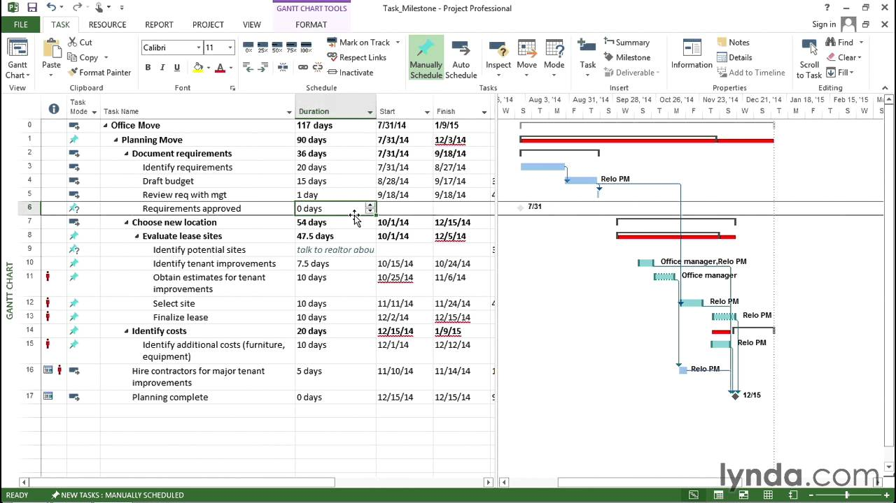
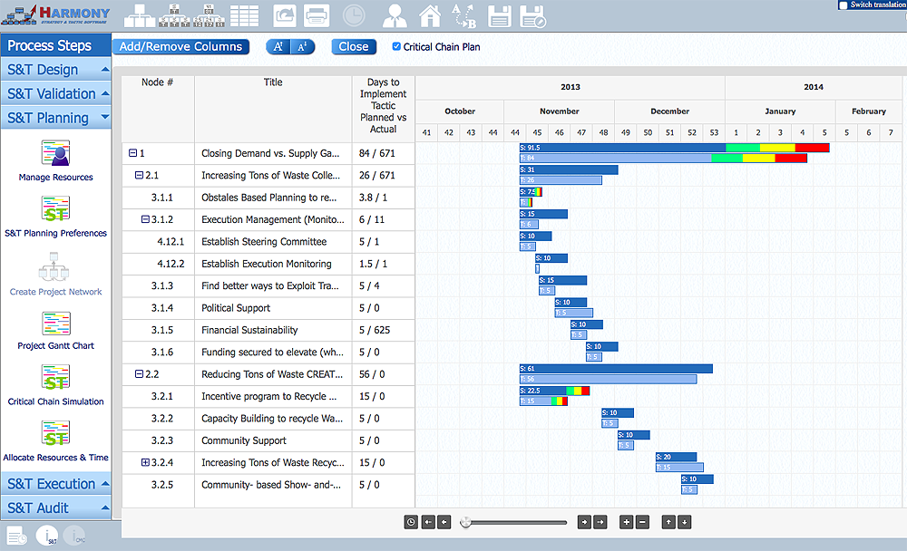

# Инструменты метода как поддержка его дисциплины

Инструменты хорошо видимы (это ж «станки», при этом современные станки — это главным образом софт, заметить «станки», они не «в голове», а «развёрнуты на местности»). Тем не менее, хорошо видимые инструменты без понимания поддерживаемой ими дисциплины мертвы. «Ружьё в руках дикаря — кусок железа», это можно сказать про любой инструмент. **Традиционный капитал** (средства производства) мёртв, если он не поддержан **человеческим капиталом** — образованными в части дисциплины и натренированными на владение конкретным вариантом инструментария данного предприятия сотрудниками.

**Если есть какой-то станок, приспособление, или программное обеспечение, то они обязательно поддерживают какую-то дисциплину/теорию. Не знаешь этой дисциплины—** **неминуемо будешь микроскопом гвозди заколачивать,** **обращаться с ружьём как с куском железа,** **чисто в силу неведения.**

Так, программы проектного управления могут поддерживать самые разные дисциплины проектного управления, которые определяют самые разные наборы подальф альфы «работы». Напомним: альфа — это предмет метода, требующий отслеживания в ходе выполнения проекта, подальфа связана с альфой отношением «если продвинулась по состояниям в графе её состояний подальфа, то это означает, что продвинулась немного и альфа».

Например, управление проектами может быть классическим с предметом метода **критический путь** (critical path), но теория ограничений Голдратта критикует использование предмета метода «критический путь» и предлагает другой предмет: **критическая цепь** (critical chain)[^r7-1] и управление проектом основывается на отслеживании подальфы буфера проекта[^r7-2] альфы «работа». Если вы не понимаете связи между инструментами (в данном случае софт управления проектами) и разными вариантами дисциплин/теории проектного управления с их «специфическими понятиями для отслеживания»/«альфами и подальфами», а купите просто какую-нибудь «популярную программу управления проектами», то вас может ожидать сюрприз: программы будут развёрнуты, кнопки на них будут как-то нажиматься, формы заполняться, но практика управления проектами выполняться не будет, проектам лучше не станет! Подальфы буфера проекта в некоторых методах управления проектами попросту нет, она не существует в дисциплине с критическим путём — и поэтому софт для этой дисциплины её не отражает!

В программе классического (с критическим путём) управления проектами на рисунке нет никаких буферов проекта, поэтому она не поддерживает мышление согласно дисциплине управления проектами теории ограничений, с критической цепью:

А вот эта программа понятие критической цепи (не пути!) поддерживает, «светофоры» управления буферами хорошо видны на её скриншотах:

Если не владеть каким-то менеджерским кругозором в части вариантов дисциплин проектного управления, то можно вообще не понять, почему так различается инструментарий для вроде бы одной и той же практики, а «светофоры буферов» будут казаться особенностями интерфейса программы, а не варианта дисциплины проектного управления.

**Инструментарий различается не столько удобством в использовании, сколько поддерживаемыми дисциплинами: тем, какие понятия в мышлении инструментарий способен отразить.** **Удобный в использовании негодный для дела инструментарий помочь не может, а неудобный в использовании, но годный для дела — плохо, но поможет. Вы сможете различить эти две ситуации, если кроме** **инструментов метода** **обратите внимание на поддерживаемую** **ими** **дисциплину. Она невидима, но вы можете научиться о ней думать.** **Методы/культуры/технологии** **определяются по своим дисциплинам/знаниям/теориям/объяснениям,** **чаще всего** **носят названия** **этих** **дисциплин, а не** **инструментов.**

[^r7-1]: <https://ru.wikipedia.org/wiki/Метод_критической_цепи>

[^r7-2]: <http://tocpeople.com/terminy/bufer-proekta/>
