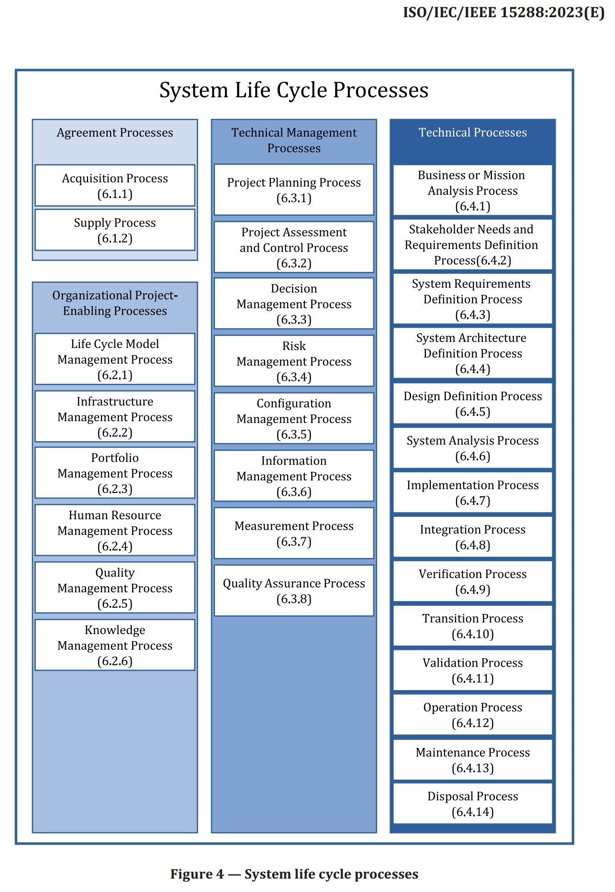
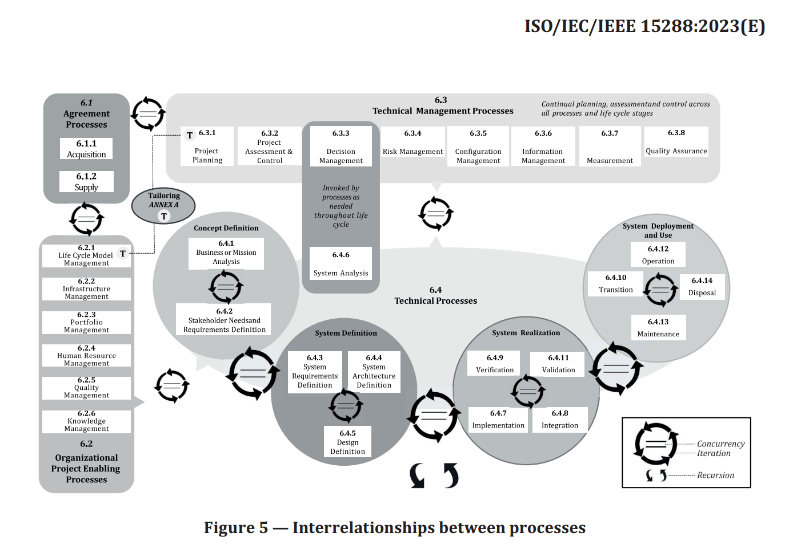

# Стандарты классической системной инженерии

Стандарт процессов жизненного цикла системной инженерии ISO/IEC/IEEE 15288:2023[^r7-1] Systems and software engineering — System life cycle processes является примером документирования метода не в формате свода знаний, но если приглядеться, то это оказывается очень близким форматом. Он устанавливает наиболее общие описания методов создания (но не развития) систем, созданных людьми в ходе системноинженерных проектов. Название «процессы жизненного цикла» как раз отражает, что он стандарт уже прошлого (второго) поколения системного мышления, соответственно, там инженерия ещё времён опоры на «прохождение полного жизненного цикла, от замысла через рождение до смерти», это было остромодно на момент выхода первой версии стандарта в 2002 году и преодолевало понятие «разработки» как только «подготовки к серийному выпуску, но не само производство, не запуск в эксплуатацию, не эксплуатация, не вывод из эксплуатации».

Стандарт определяет необходимый для системной инженерии набор методов создания и развития (в стандарте — «процессов жизненного цикла») какой-то системы. В стандарте определяется возможный набор предметов метода разработки, который может быть признан как «системная инженерия» и набор рабочих продуктов, которые можно использовать для того, чтобы документировать разнообразные описания как предметы метода. Метод управления инженерным процессом там тоже есть, это «процесс управления моделью жизненного цикла».

Эти методы/процессы определены для всего времени создания/«жизненного цикла» (развитие может быть, но явно не предусмотрено) и существования созданной системы. В выполнение этих практик вовлекаются все проектные роли (stakeholders: и внутренние, и внешние), с главной целью — удовлетворить клиента.

Стандарт делит все методы/процессы на 4 группы, часть из них «технические» и относятся к преобразованиям целевой системы, часть «управленческие» и относятся к оргзвеньям/создателям, занимающимся проектами, в которых проводятся работы по практикам из этого стандарта, часть к создателям создателей (методы создания организации команды инженеров, выполняемые какой-то инициирующей этот проект командой менеджеров), часть относится к заключению и выполнению соглашений по закупкам и поставкам. Вот эти четыре группы:

Стандарт задуман так, чтобы проверять: если вы выполняете все эти методы/процессы (то есть готовите указанные там рабочие продукты, которых огромное изобилие), то вы занимаетесь системной инженерией. Если не выполняете — то это просто инженерия, не системная. Единственная поблажка: вы должны для каждого случая сверяться не со стандартом, но с адаптированным стандартом.

Разложение инженерного процесса на методы, описываемые стандартом, может быть применено для создания и развития систем на любом системном уровне целевой системы, стандарт это определяет как «рекурсивное использование стандарта». Но вот как связаны все эти процессы? Тут мы понимаем, что авторы стандарта тут же упёрлись в проблемы описания разложения метода, которые мы обсуждали в первом разделе. Попытка отобразить какие-то процессы на функциональной (развёртка во времени, описание «как работает») диаграмме, да ещё когда нет ролей, а изображены только сами методы/процессы работы этих отсутствующих ролей в стандарте тоже есть, но понятности она не добавляет. Единственное, что — там указано, что могут быть итерации до момента достижения конечного желаемого состояния системы.

Жизненный цикл в стандарте понимается в его одном из самых ранних пониманий — это стадии работ проекта (замысел, разработка, производство, использование, поддержка, выбрасывание), привязанные к нахождению системы в каком-то состоянии. Признаётся, что стадии жизненного цикла могут следовать в самом разном порядке, в том числе перекрываться, формируя самые разные варианты соответствий предложенных методов системной инженерии стадиям работ. То, что стадии работ привязаны к нахождению системы в определённом состоянии и параллельность стадий тем самым означает, что система одновременно находится в разных состояниях — это авторов стандарта не очень заботит. Они просто хотят выразить мысль, что методы и работы должны рассматриваться отдельно. И отсылают за концепциями собственно жизненного цикла к другим стандартам по управлению жизненным циклом (ISO/IEC/IEEE 24748-1 и ISO/IEC/IEEE 24748-2), где этот вопрос соотношения управления работами и организации инженерного процесса рассматривается подробней.

Но тут нужно предостеречь, что этот стандарт, как и все остальные всевозможные своды знаний о методах (BoK), описывает отнюдь не минимум или оптимум использования разных методов для достижения результата какой-то конкретной деятельности в конкретном проекте, а, скорее, возможный максимум в абстрактном проекте с неограниченными деньгами и временем. Эти стандарты особо любимы представителями государственных (и в них особенно военных) кругов, потому как подход «что ещё можно было бы сделать» отлично подходит к ситуациям, когда стороны заинтересованы поднять цену проекта по созданию успешной системы, а влияние проектных ролей, заинтересованных в снижении цены, минимально. Каждая очередная выполненная рекомендация по применению тех или иных инженерных методов будет затратна, а вот даст ли это существенный эффект в расчёте на каждый затраченный рубль или доллар — это не гарантировано.

Поэтому пользоваться такими стандартами и публичными документами нужно только как справочным материалом, но не как руководством к действию: брать из этих документов только тот минимум, который подойдёт для масштабов вашего проекта. А учитывая, что это стандарт предыдущего поколения системной инженерии (до перехода к «непрерывному всему»), то и вообще на него ориентироваться нельзя. Хотя в государственных и тем более военных организациях этот стандарт как раз и описывает метод создания (и даже очень ограниченно развития) системы, каким бы он ни был нерезультативным и неэффективным, это вроде как «эталон понимания того, что такое системная инженерия».

Аналогичный свод знаний в статусе стандарта для заведомо дорогой и заведомо долгой коммерчески невыгодной (то есть требующей госфинансирования) системной инженерии, который существенно объёмней (у него подзаголовок «Энциклопедия», хотя в заголовке «Учебник»), чем ISO 15288, но основан на тех же идеях второго поколения системного подхода и «водопада» — это SEH 4.0 NASA (Systems Engineering Handbook)[^r7-2]. Если вы хотите за государственные деньги с отставанием от всех возможных сроков создать космическую систему прошлого поколения, то вы вполне можете следовать рекомендациям этого свода знаний.

Сегодня в инженерии существует тренд перехода на методологические принципы agile, lean, lightweight methodologies, идеи типа minimal viable product — погуглите все эти понятия, если они плохо вам знакомы. Все эти принципы входят в современный кругозор менеджеров, основателей компаний, инвесторов: нужно выполнять минимум работы (lean переводим как «элегантный», «ничего лишнего»), и главное тут — не тратить ненужных ресурсов на выполнение ненужных работ по ненужным методам. В программной инженерии это уже культура. Аналогичный ISO 15288 стандарт программной инженерии ISO 12207 выглядит уже полным анахронизмом, ибо в программной инженерии новые методологические принципы, соответствующие третьему поколению системного мышления, уже победили. Но во многих других видах инженерии идёт борьба старых инженерных процессов на основе второго поколения системного мышления и понятия «жизненного цикла», а также объёмнейших сводов знаний и новых инженерных процессов, в которых вы не должны выполнять никому не нужную работу и доделывать её обязательно до конца, потому как «так надо», и «так принято», «так прописано в стандарте». Это всё приложение принципа минимального действия в физике к инженерии в целом и к менеджменту (инженерии организации) в частности.

**Если речь идёт о стандартах, описывающих** **какие-то** **интерфейсы, реализуйте их полностью** **и точно,** **причём** **проверьте, какое поколение стандарта вы реализуете (возможно, реализовать нужно сразу несколько поколений стандарта, сразу несколько вариантов интерфейса, для обратной совместимости с предыдущими разработками).** **Но если речь идёт о сводах знаний** **ииных** **стандартах** **методов работы,** **то** **берите из них** **для реализации** **только минимум! Для этого хорошо разбирайтесь в предметной области** **и приемлемых в ней инженерных процессах, чтобы взять** **из этих сводов знаний и стандартов** **реально** **важный минимум, оставив всё неважное** **вне воплощения.**

Как и для любой другой классификации, для технических методов системной инженерии из стандарта можно предложить и альтернативные варианты. Например, наше руководство по системной инженерии использует более короткий список методов (и соответствующих им ролей), которые имеют отличающиеся названия от технических процессов ISO 15288. Это методы визионерства, разработки (и мы уже говорили, что разработку мы тоже раскладываем на множество составляющих методов), архитектурной деятельности, инженерии производственной платформы. Эти же методы в менеджменте и исполняющие эти методы роли называются по-другому: методы бизнеса, организовывания, орг-архитектуры, администрирования. Так что международный стандарт методов системной инженерии вроде как есть, но он устарел. И немудрено: разработки международных стандартов и голосования стран в ISO тянутся годами, методы инженерной работы и менеджмента успевают измениться раньше, чем международная бюрократия успевает менять стандарты и BoK, которые вроде как документируют лучшие практики. Но нет — это становится документированием лучших практик прошлого поколения, причём явно избыточного количества лучших практик (зато удобно отчитываться перед государственными надзорными органами, а также отчитываться об огромных затратах бюджетных денег). Лучшие на сегодня (а не на вчера) практики, то есть лучшие методы работы, надо искать уже не в стандартах и сводах знаний, и даже не в академических журналах — там опоздание в свежести знания будет на год, что сегодня ведёт к отставанию в конкуренции. Знание сегодня распространяется в препринтах, а самое современное вообще сегодня публикуется в блогах, подкастах, докладах на промышленных и научно-практических конференциях.

**Но знать о** **существовании** **стандартов** **и публичных документов** **(типа** **BoK) с описаниями методов надо. Ими руководствуется довольно много людей, с которыми вам придётся разговаривать — и незнание их может быть сочтено профессиональной неграмотностью. Поэтому можно показывать их знание, но совсем необязательно им следовать, вам необязательно воплощать в жизнь старые методы работы из этих стандартов, когда можно сразу воплощать в жизнь современные (state-of-the-art,** **SoTA) методы. Другое дело, что всегда есть риск** **по незнанию** **взять за основу своей работы какой-нибудь неработающий метод. Но брать стандарт или** **публичный документ с заведомо** **устаревшим** **и уже известно по каким причинам не работающим** **методом—** **это** **будет ещё хуже.** Подробней эти «муки выбора метода в условиях неопределённости» будут разбираться в разделе о теории стратегирования.

[^r7-1]: <https://www.iso.org/standard/81702.html>

[^r7-2]: <https://www.nasa.gov/reference/systems-engineering-handbook/>
