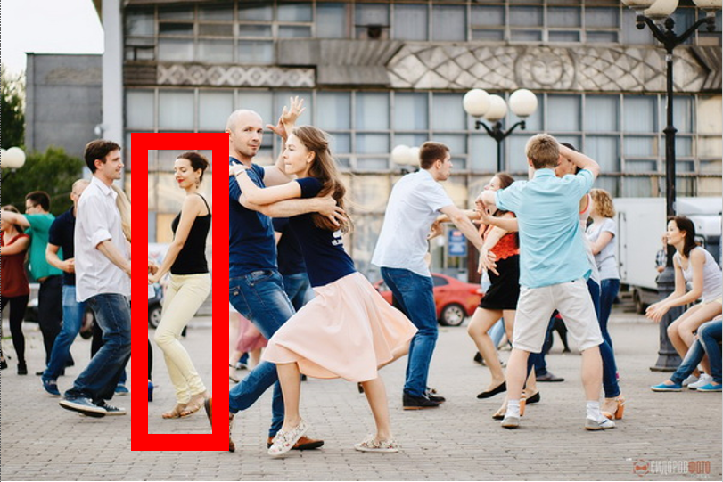

# Системные уровни целевой системы и стратегирование

Методы создателей/агентов/IPU работают с системами каких-то определённых системных уровней как своими предметами. Они учитывают какие-то эмерджентные свойства систем, которые можно найти на том системном уровне, на котором они работают, но нельзя найти на уровне ниже или выше. Метод может работать и с несколькими системными уровнями (говорят, что это «рекурсивное применение метода»), но в целом нужно запомнить, что любая работа требует знания методов минимально для изменений на трёх системных уровнях:

* Того, на котором ведётся работа с системой. Например, работы менеджмента ведутся с системным уровнем организации как системы из множества организованных индивидуальных агентов (людей, систем AI).
* Уровня ниже. Если целевой уровень — это организация и методы менеджмента, то уровнем ниже будет уровень индивидуального агента и там методы различных вариантов инженерии личности, в том числе разные варианты методов коучинга, психотерапии, обучения на рабочем месте.
* Уровня выше. Если целевой уровень — организация, то уровнем выше будут какие-то бизнес-эко-системы, в которые входит организация. Там будут, например, методы организации торговли (организации рынка).

Грубо говоря, если ты строишь стену, то тебе хорошо бы разбираться в:

* стенах и их свойствах, методах работы со стенами (твой уровень),
* кирпичах и что с ними можно делать, растворе (уровень ниже твоего, но тут можно подумать и о других методах строительства стен, например, методе скользящей опалубки — и кирпичей там уже не будет, равно как не будет кирпичей при крупнопанельном строительстве, и в этом надо тоже разбираться),
* зданиях (уровень выше твоего, как здания делаются из отдельных стен — и тут тоже кирпичные здания и здания, получаемые методом скользящей опалубки, или здания, которые получаются методами крупнопанельного строительства).

Поскольку системных уровней много, то приходится удерживать внимание на довольно большом стеке методов, которые получаются разложением общего метода работы, составляющие методы такого разложения будут работать с предметами методов (системами и их описаниями) разных системных уровней. Вам хорошо бы вспомнить материал первого раздела с вариантами методов описания разложений методов. Метод — объект первого класса, с методами надо тоже работать «методами работы с методами», а не как попало!

Собранность тут ключевое: вы должны вниманием выделять какие-то системные уровни, системы на этих системных уровнях будут предметами каких-то методов — и для выбора этих методов надо будет выполнять рациональное стратегирование (а не работать по каким-то методам, которые никто явно не выбирал, выполняя работы, которые никто явно не планировал).

Возьмём пример танцевального перформанса как системы, который был в руководстве по системному мышлению. Вот типичный момент open air-вечеринки/party (которая проводится на открытом воздухе, и даже необязательно вечером):

Попробуйте удержать во внимании фолловера::«роль партнёра в танцевальной паре» на дальнем плане, на картинке это указано красным прямоугольником. На картинке это легко, ибо красный прямоугольник помогает вам управлять вниманием. Если его убрать, ваше внимание наверняка будет отвлечено партнёром пары на переднем плане: он смотрит прямо вам в глаза, ближе и крупнее, и сильно отвлекает! Теперь включите звук (там же шумно!) и из статичной картинки представьте, как это происходит в жизни (все стали быстро двигаться, крутиться, заслонять друг друга, это время работы/operations). Красного прямоугольника, помогающего удержать внимание, в жизни нет. Сколько секунд в жизни в реальной ситуации вы можете удерживать полное внимание на том фолловере, который на картинке обведён красной рамкой? Танцор на вечеринке — простой случай, в даже небольшой организации объекты внимания сложней найти и сложней удерживать во внимании!

Нас будут интересовать разложение культуры социальных танцев на различные методы, этот фолловер (человек в танцевальной роли фолловера, выполняющий работу фолловера. Не надо говорить, что это не работа: фолловер явно не лежит на диване, а довольно бодро шевелит ногами и руками — мы тут не говорим о бытовых значениях термина «работа» как «то, за что платят деньги». В физике термин «работа» тоже совсем не то, за что обязательно платят деньги).

Человек в роли фолловера умеет или не умеет танцевать, хочет или не хочет танцевать лучше. На предприятии всё то же самое, только «танцуют» десяток человек в команде, сотня человек в коллективе, тысячи в большом предприятии, и вам нужно сохранять в этом бедламе собранность, чтобы отслеживать работы по каким-то методам самых разных агентов (и индивидуальных, и коллективных — скажем, отделов или даже дивизионов крупных холдингов).

Разные методы в разложении культуры социальных танцев работают с разными системными уровнями: какие-то методы работают с тканями тела, какие-то с телом в целом, какие-то с парой из двух агентов, какие-то со всей вечеринкой, какие-то — со всем танцевальным сообществом с его множеством вечеринок, танцевальных школ, фестивалей и других оргформ. Поскольку системных уровней задействовано много, то и методов работы с ними в разложении культуры социальных танцев много — перформанс танцевальной пары на вечеринке социальных танцев рассматривался как пример в руководстве по системному мышлению, а также в первом разделе нашего руководства по методологии, где мы говорили о спектре степеней мастерства по шкале из разных методов, образованной разложением метода в стек.

Давайте посмотрим на ещё один способ использования этого знания о разных системных уровнях, разложении методов в стек, а затем использование этого стека как шкалы для спектра степени мастерства. Если вам известен спектр мастерства для какого-то стека методов, то вы можете составить

* многоуровневую программу совершенствования агента как повышения эффективности выполнения каких-то методов из текущего их набора (например, стека — но помним материал первого раздела нашего руководства: вариантов представления разложения методов множество!)
* многоуровневую программу развития агента как замену методов работы на более эффективные.

Вот пример для тех же танцев, как мог бы строить программу развития своего мастерства в практике социального танца какой-нибудь танцор-мультидансер (то есть который танцует множество танцевальных стилей, то есть имеет мастерство многих стилей/культур/методов танцевания). Тут намеренно не воспроизводится точно разложение культуры социальных танцев из таблички в первом разделе, не проводится дополнительной формализации. Помним, что формализация — это очень дорого, а какой-нибудь танцор явно не имеет мастерства онтолога. Но вот составить какую-нибудь программу совершенствования и развития своего мастерства по описанным в «Методологии» идеям можно даже без жёсткой формализации, и результат будет много лучше, чем одноуровневые варианты или многоуровневые «по наитию» варианты. Вот как это могло бы быть, причём обращайте внимание на форму, отвлекитесь от содержания — специфики собственно социальных танцев. Если вы поймёте принцип составления таких программ совершенствования и развития, вы сможете разработать их и для каких-то других стеков методов, для себя, для коллег и даже для коллективных оргзвеньев. Социальные танцы тут просто хороший простой пример. В квадратных скобках — комментарии, которые даны нами, они не входят в текст самой программы совершенствования и развития танцора:

1. **Работа с телом (уровни общего движения, усилий в масштабах тела, усилий и амплитуды в частях тела).** Обеспечить себе прямую постуру (позу и мышечные усилия) и мягкую спину за счёт работы по обмяканию в области груди и поясницы. Цель ближайших трёх месяцев: приводить себя в рабочую постуру в течение не полуминуты, как сейчас, а полусекунды (танцевальное время, а не йога!), удерживать прямую постуру в вертикальной скрутке, а также делать это в ходе перформансов (не терять собранности), а не в спокойных упражнениях перед зеркалом. [это всё общетанцевальное] Увеличить угол выноса руки назад. [потребуется для поворотов партнёрши за спиной, растяжки мышц груди и рук при этом не хватает]
2. **Общетанцевальный уровень.** Добиться управления атаками (скорость нарастания силы в импульсе) в ведении, разобраться с инерционным ведением. [обратите внимание, что появился метод этого уровня — «ведение» — но вот дальше разговор идёт явно в терминах методов более низкого системного уровня. Чтобы поправить исполнение вышестоящего метода, нужно чаще всего работать с методами уровня ниже: «чтобы починить стену, нужно работать на уровне кирпичей и раствора». При этом даже не поминаются понятия вышестоящего уровня, то есть названия танцевальных стилей.] И поднять, наконец, голову от пола! [это, конечно, отсылка к собранности, но в данном случае речь идёт об общетанцевальном: нехорошо танцевать с опущенной головой, «смотреть в пол», это общее для всех стилей социального танца. Собранность нужна для того, чтобы это исправить — не смотреть в пол легко, особого мастерства для этого не надо, но надо просто не забывать, поставить привычку!]
3. **Уровень** **стильного танцевания.** В танго: приходить на ось ритмически точно на сильную долю, чтобы не было «недохода», выжим с места вперёд и вниз (а не вверх). Освоить «заднюю саккаду». В modern swing: чётко удерживать rolling count. В форро: отработать поворот партнёрши за спиной.
4. **Уровень композиции/перформанса.** Упражнение по музыкальности Рони Салеха в ритме slow-beat-beat-quick\*4 (замедление в начале восьмерки, ускорение в конце, а не ускорение в начале и замедление в конце, как обычно). [вроде как обращение идёт к уровню ниже, ритмике как «движению вовремя», но тут это используется для того, чтобы разнообразить ритмические паттерны в ходе танцевальной импровизации, работа хореографа, это не совсем ритмика, это использование мастерства ритмики в хореографии]
5. **Уровень вечеринки.** Приглашать как минимум одну незнакомую партнёршу за вечеринку.
6. **Уровень сообщества/субкультуры конкретного танца.** Бывать на вечеринках как минимум двух разных стилей танцев в неделю. Познакомиться с идеями танго нуэво и стрит танго, смотреть видео, читать литературу. Осмыслить тренд разнообразия видов стайлинга и размытия стиля урбан киза. Посмотреть в Сети развитие культуры альтернативной музыки для разных стилей социальных танцев. Писать в Сети посты, популяризирующие культуру мультиданс/микс/нуэво/фьюжн танцевания.

Повторим: неважно, если вы ничего не поняли в этом примере в предметной области танцев (вы мало что поймёте и в аналогичном плане развития какой-то компании в какой-то прикладной предметной области, с которой вы незнакомы). Важно, чтобы вы поняли принцип этой многоуровневости совершенствования и развития, ибо нельзя совершенствоваться (увеличивать своё мастерство выполнения метода) и развиться (приобретать мастерство в новых методах) на одном уровне. Даже неважно, системный ли это уровень предметов метода или уровень разложения самого метода (при этом помним, что они связаны!): на одном уровне качественно совершенствоваться и развиваться не получится. Более подробно материал по совершенствованию и развитию личности будет дан в руководстве по инженерии личности, а по развитию организаций будет дан в руководстве по системному менеджменту.

Обычная стратегия роста предприятия (но и личности тоже, почему бы и нет!): освоить некоторые методы работы с предметами метода из какого-то одного системного уровня, а потом переходить к освоению методов создания и развития систем из системных уровней выше (надсистемы) и ниже (подсистемы).

Начали класть стены (фирма-каменщик::роль, «кладка»::метод, стена::«предмет метода»), фирма на этом подросла. Потом стали из стен делать здания «под ключ», фирма ещё подросла. Затем начали делать кирпичи и раствор для кладки кирпичей в стену, затем добавили проектирование зданий и отделку зданий, и так далее. Через некоторое время это девелопер коттежных посёлков из кирпичных домов, в том числе владеющий карьерами для добычи глины для своих кирпичных заводов. Иногда такую стратегию развития (стратегия — выбранный метод, в данном случае речь идёт о методе развития фирмы) называют вертикальной интеграцией[^r7-1].

[^r7-1]: <https://en.wikipedia.org/wiki/Vertical_integration>
