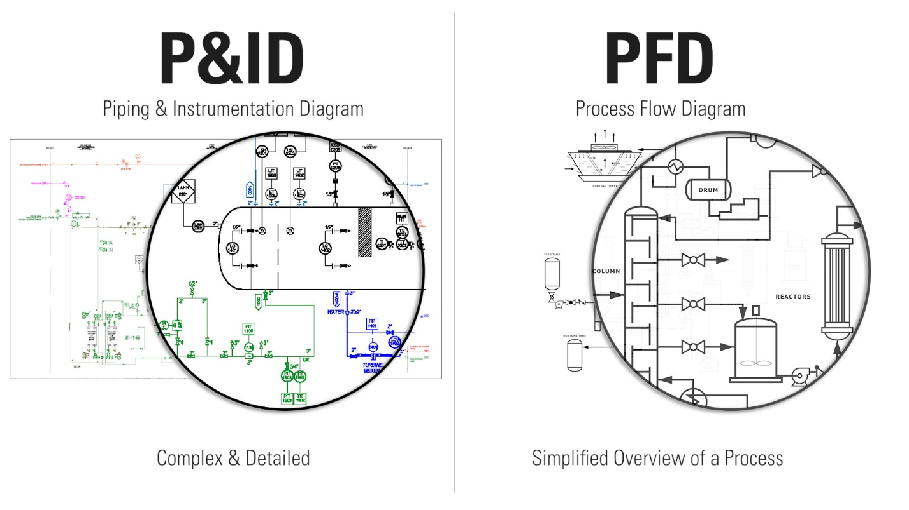

# «Схемотехника»: представление метода работы графом потоков.

А дальше можно сразу обратиться к традиционному представлению методов в виде функциональной диаграммы, часто называемой принципиальной схемой. Такие диаграммы разбирались в руководстве по системному мышлению: предметы метода текут/flow между создателями, которые меняют их состояния. Если это непрерывные потоки (поток/flow — это идентификация объекта на основе сохранения маршрута/пути, определение из ISO 81346:2022), то примеры сразу очевидны — методологи там называются «схемотехники», они строят принципиальные (принципиальность — это указание на функциональность, «метод работы», а не конструктивность) электрические схемы, радиотехнические схемы, но могут быть также и гидравлические схемы, и кинематические схемы и самые разные другие схемы.

* Так что очевидный следующий шаг в выражении методов — сразу пройти весь путь: от последовательностей/chains (последовательности методов, например, «стек» тут тоже последовательность вложений или последовательность использования, да и «шкала» — последовательность, упорядоченность в ряду объектов)
* к деревьям/trees (хорошо представимы разными MindMaps, которые легко сводимы к аутлайнам/outlines, по факту это «хорошо структурированное оглавление», где в листьях этого оглавления могут лежать какие-то более подробные описания, фреймворк Gielingh с диаграммами гамбургера как раз такой граф «почти дерева»),
* и далее к графам/graph как общей форме представления потоков чего бы то ни было — в том числе предметов метода между ролями, задействующими метод.

Примеры графовых визуальных представлений функционального (методов работы, время эксплуатации) описания системы были приведены в руководстве по системному мышлению. Прикладных методологов самых разных предметных областей учат разрабатывать такого сорта визуальные представления, «принципиальные схемы». В электронике даже выделяют отдельную специальность «схемотехника»[^r7-1], ибо речь идёт об электронных схемах и устройствах, описываемых такими схемами.

Потоковые (движение предметов метода по каким-то путям) представления, удобно представимые графом, распространены и в менеджменте. Фон Берталанфи выделял исследование потоковых представлений систем как «исследование операций» (operations research), речь шла о времени эксплуатации (operations) — и эта дисциплина легла затем в основу операционного менеджмента, логистики, теории массового обслуживания. Конечно, в исследованиях операций в основе лежали «работы», речь шла прежде всего о потоках ресурсов между рабочими станциями. Но это можно было представить и как специфически функциональное представление: «рабочая станция» — это ведь роль, её могут выполнять разные конструктивы, она может действовать разными методами (прикладными методами операционного управления!). Опять мы попадаем в то, что методология — фундаментальная дисциплина, и даже если речь идёт об управлении работами по методу, то это рассмотрение может быть функциональным, и тут методология будет задействована для разбирательства с работами и работниками как прикладная методология операционного менеджмента — несмотря на все предупреждения «не путать метод работы и работы по методу». Методы исследования операций, методы проектного управления работами, методы операционного управления — это всё методы, только ими занимается прикладная методология этих предметных областей.

С графами, которые описывают работы каких-то подсистем одного системного уровня по их взаимоувязанным методам (разложение методов одного системного уровня), есть разные ситуации их использования:

* Вы смотрите на них, как на «пассивную модель». Это означает, что интерпретатором модели является «тот, кто смотрит», алгоритм в вашей голове в виде программы «мастерство рассмотрения принципиальной схемы», а граф — данные для этой программы. Помним из руководства по рациональной работе, что модель — это программа, она исполняется, чтобы получить результат моделирования. Исполнитель программы, даже если он «просто смотрит на диаграмму» — тот, кто смотрит на эту диаграмму, и он также проводит с помощью диаграммы рассуждение, получает результат моделирования. Если нет рассуждения по диаграмме, то диаграмма не нужна. Когда вы пытаетесь разобраться в ходе ремонта «почему не работает», это как раз такая работа с графовым представлением разложения методов. Ваше мастерство проделывает рассуждения с описанием системы как графа связанных какими-то потоками предметов методов подсистем. Каждая из подсистем выполняет какие-то преобразования предметов метода, проводит их по состояниям, чтобы получить какой-то результат. Скажем, в логистической схеме — это работы по методам транспортировки и хранения предметов работ, а также работы по заказам партий предметов работ.
* Эта диаграмма — лишь визуальное представление графа потоков предметов методов, а вообще-то этот набор потоков представляется программой, решающей набор дифференциальных уравнений, описывающих взаимодействие подсистем в этом графе — «физику процесса». Расчёт по этой программе может провести компьютерная программа, «прогонять программу» (выполнять вычисления по алгоритму программы) будет уже компьютер, у которого эта программа — его «мастерство». Человеку остаётся лишь наблюдать результат прогона.
* В современных системах AI может быть ещё проще: вы можете показать компьютеру визуальную функциональную/принципиальную схему/диаграмму с заданными на ней какими-то функциональными характеристиками (скажем, на радиосхеме — входными напряжениями, номиналами резисторов и конденсаторов, транзисторов и катушек), а потом компьютер сам переведёт визуальную нотацию в программный код, отражающий какую-то систему дифференциальных уравнений и посчитает значения нужных характеристик (например, выходную мощность).

Увы, в материалах (учебных курсах, корпусах знаний, регламентах и стандартах) для архитекторов метод работы системы (в том числе системы-создателя) описывается в целом, без выделения специфической методологической/функциональной части. Да и в материалах для проектировщиков/designers не так много говорится про работу с функциями/методами, разве что упоминается, что проектирование надо начинать с работы с функциональными диаграммами. При этом функциональные диаграммы трудны для понимания, в них всё происходит как бы «одновременно», там законы типа закона Кирхгофа для электрических цепей. Помним, что разложения метода/функции тоже надо понимать, как работающие «одновременно». Но могут быть и всякие задержки и лаги (реактивные сопротивления в электроцепях, задержки на производство и логистику с момента выдачи заказа в цепях поставки, время продажи партии в розничных/retail сетях/chains).

В непрерывном производстве (нефтехимия, энергетика) функциональные диаграммы часто гибридны, в них приводится результат методологической работы (выбор метода) и одновременно указываются и результат проектирования: элементы конструкции. Это оформляется как P&ID диаграммы, piping and instrumentation diagram и PFD, process flow diagram диаграммами[^r7-2].

Каждый отдельный тип конструктива из крупной «нарезки на модули» архитекторами проектировщики будут потом в концепции системы упоминать не просто сам по себе, а как реализующий какую-то подсистему в её роли в системе.

Концепция системы часто представляется в форме какой-то гибридной диаграммы. В её основе часто — функциональная диаграмма (в системах функциональность — первична), но для функциональных объектов указано, какие конструктивные объекты будут играть эти роли, часто это делается «аннотированием» обозначений на «принципиальной схеме» указанием на то, какие конструктивы будут задействованы для воплощения этих функциональных объектов. Какого-то специального представления «отображения» функционального представления на конструктивное представление системы, например, таблицы соответствия, не делается. Иногда функциональные диаграммы в форме принципиальной схемы гибридизируются каким-то указанием разнесения её элементов на модули («функциональный насос» реализован «тремя конструктивными насосами и системой управления для них», это сделано для повышения надёжности), и часто ещё указывается и компоновка в пространстве, поэтому обозначение каких-то элементов делается состоящим сразу из нескольких имён, если это возможно: функциональное, конструктивное, пространственное и так далее (стандарт ISO 81346 как раз про правила такого именования, обозначений/designations).

Так что большая часть методологической работы часто делается сегодня в формате графовых представлений «принципиальных схем». Расчёты по таким функциональным диаграммам потоков жидкостей, электрического тока, энергии, даже денег, предметов работ, пассажиропотоков, а ещё потоков информации и т.д. учитывают «одномоментность во времени» и называются 1D-моделированием, ибо это одномерное представление — какая-то характеристика в каждом месте диаграммы разворачивается во времени.

Такое функциональное (это потоки в ходе функционирования моделируемой системы, функциональное представление — это ответ на вопрос «как работают в момент эксплуатации») моделирование чаще всего делают при помощи систем дифференциальных уравнений, учитывающих «одномоментность». Иногда такое физическое 1D моделирование называют **системным** **моделированием**, ибо речь идёт о моделировании работы системы как функционального объекта в целом на основе понимания того, как именно работают отдельные подсистемы.

В менеджменте такое моделирование чаще всего делают средствами **системной динамики**[^r7-3] — и это хорошо, только не надо считать, что это будет единственное моделирование в ходе проекта по созданию системы. Нет, это только 1D-моделирование, но будут ещё и другие. Более того, сегодня **системным моделированием** чаще называют 1D-моделирование не только упрощёнными дифференциальными уравнениями системной динамики (там очень ограниченный набор элементов модели и допустимых видов уравнений в системе дифференциальных уравнений), но и полноценным физическим описанием системы. В **физическом системном моделировании**(physical systems modeling), узко понимаемом как численное 1D моделирование, конкурируют каузальное моделирование с системой уравнений из обычных дифференциальных уравнений (ODE) и акаузальное моделирование с системой из алгебраических дифференциальных уравнений (ADE). Каузальное моделирование требует указывать порядок решения системы уравнений, а акаузальное моделирование — нет, систему уравнений решает сам компьютер, тренд при этом — переход от каузального моделирования к акаузальному.

[^r7-1]: <https://ru.wikipedia.org/wiki/Схемотехника>

[^r7-2]: <https://kimray.com/training/how-read-oil-and-gas-pid-symbols>

[^r7-3]: <https://systemdynamics.org/>
