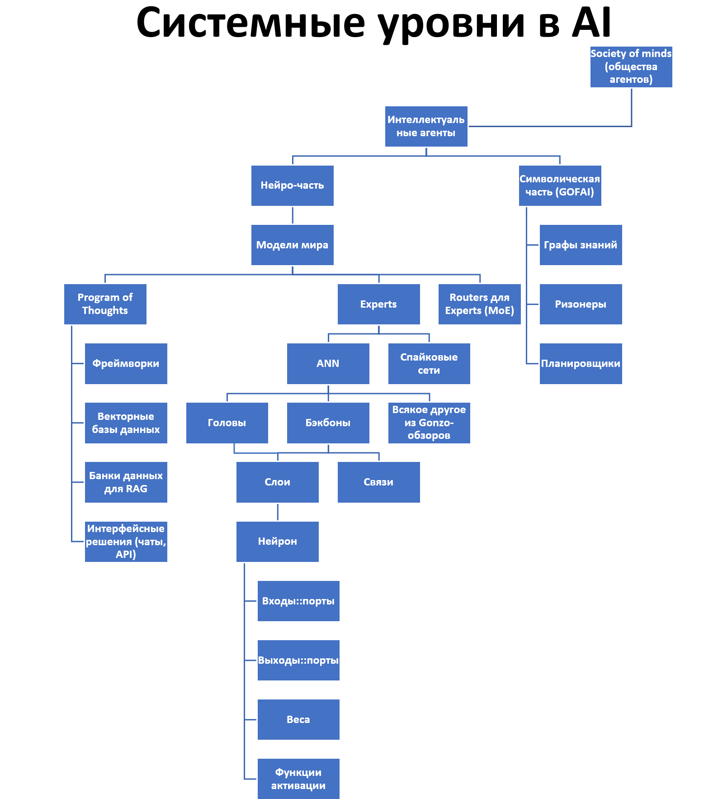
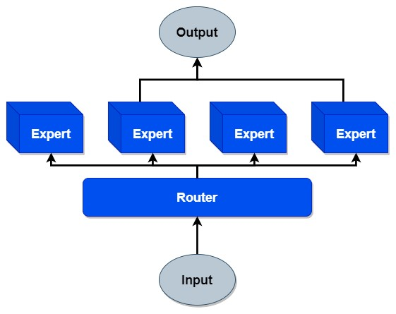
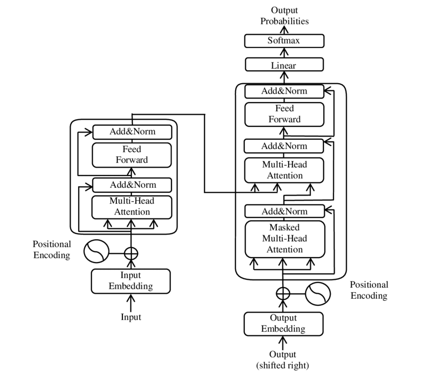
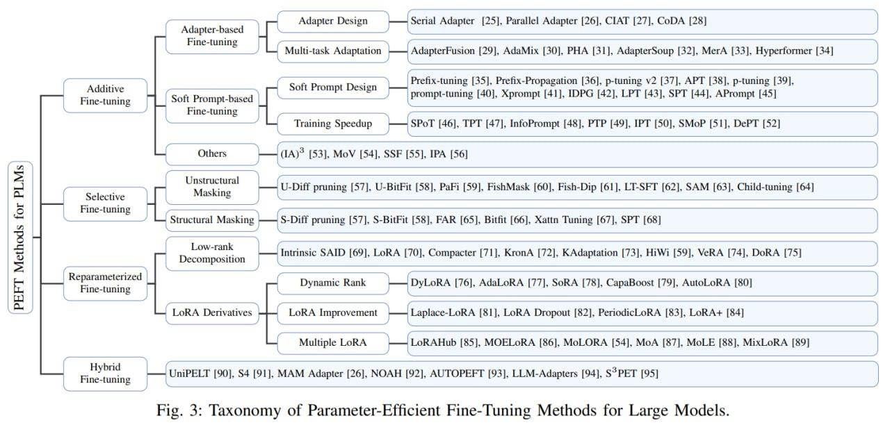
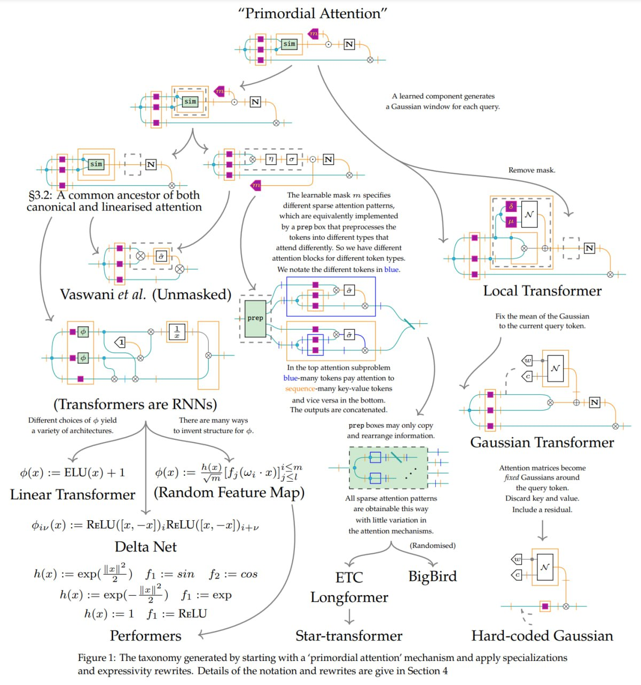

# Пример: методы создания систем AI

То, что было рассказано в предыдущем разделе, конечно, применимо не только к «железным» системам, требующим физического моделирования. В качестве примера рассмотрим функциональные описания (то есть описания ролей и методов их работы) в прикладной методологии систем AI. Конечно, если вы никогда не сталкивались с предметной областью разработки систем AI, вам трудно будет понять этот текст в части его содержания. Но **вы можете обращать внимание не на собственно содержание (что там говорится про сами системы** **AI), а обращать внимание на форму того** **(мета-мета-модельфундаментальной методологии, а не мета-модель методологии систем** **AI), что о них говорится** — какие там используются диаграммы, что рассказывается про сами методы, на какие особенности использования терминологии обращено внимание. Это примерно как логиков тренируют на тексты про сепульки: смысл непонятен, но логические ошибки могут быть очевидны. Вот так и тут: обращайте внимание на то, что говорится про методологию и методы, а термины для самих методов и ролей могут быть загадочны.

Главный посыл этого подраздела: наставления руководства по методологии приложимы к созданию систем самой разной природы. При этом мы признаём, что начиная со следующего раздела мы главным образом будем рассказывать про методологию в её версии для методов работы систем-создателей в графах создателей каких-то систем. Но вот первый раздел показывает, что методология вполне приложима как метод мышления о не слишком интеллектуальных «железных» агентах, хотя там термин больше используется не «метод», а «функция». Методология приложима и к методам/функциям работы таких «не совсем пока интеллектуальным» агентов, как нынешние системы AI.

Сегодня (а про завтра ничего сказать пока нельзя) центральное место в функциональной декомпозиции систем AI занимают искусственные нейронные сети. Поглядим на очень грубо составленное дерево/аутлайн системных уровней систем AI:

Стек тут — любой проход по одной вертикали в этом дереве, но помним о сложностях разложения методов в дерево. Есть сложности моделирования разбиения функциональных объектов — роли ведь тоже можно декомпозировать по-разному, трудности разложения в спектр их методов работы тут проявляются в полной мере. Так, обратите внимание, что слои есть и у голов, и у бэкбонов как частей ANN, ибо «слой» из «нейронов» вроде как составная часть ANN, но верхние слои — это «головы» (их может быть и несколько), а нижние слои — бэкбоны. Как мы и говорили, очень трудно представить «чистый стек», но и «чистое дерево» представить тоже трудно, и то же самое будет даже с графами. В следующих разделах мы покажем, как многие такие представления конвертировать в табличные, но содержательно это не убавит проблем. При разузловке/разбиении и синтезе что ролей, что их методов, придётся каждый раз в каждом проекте включать голову — и думать.

На диаграмме представлено функциональное разбиение системы, то есть дерево ролей (подсистемы, функциональные объекты). Но надо понимать, что речь идёт в том числе и о функциях этих ролей, за каждой ролью может быть множество видов методов, которые могла бы выполнять роль (помним, что в актуальной системе метод уже обычно выбран, но вот в момент проектирования системы — ещё нет, обсуждаем множество методов).

В текущем подразделе мы приводим пример разговора про методы работы систем AI: что там делают подсистемы и подсистемы подсистем, обмениваясь данными, это dataflow представление. Центральное место в функциональном разбиении системы AI занимает искусственная нейронная сеть (ANN, artificial neural network), подсистема системы экспертов (несколько нейронных систем объединяются как «эксперты» в смеси экспертов, MoE, mixture of experts)[^r7-1]:

В суперупрощённом виде мы видим функциональную диаграмму: какая-то входная информация даётся на вход маршрутизатора, который выбирает пару экспертов из четырёх возможных, а затем ответы этих экспертов как-то замешиваются в выходную информацию. Вот эти «эксперты» обычно — искусственные нейронные, ANN, artificial neural network сети с классической декомпозицией на «слои» из вычислительных «нейронов»[^r7-2]. Вот типичная функциональная диаграмма для ANN (традиция называет такие диаграммы «архитектурами», но в этой «архитектуре» ни слова не говорится о конструктивах, это в других предметных областях было бы «принципиальная схема»), на ней представлен трансформер/transformer[^r7-3] как вид ANN, отвечающий подобного сорта функциональной диаграмме, эта «принципиальная схема» была предложена в 2017 году:

Стрелки тут обозначают движение потоков данных (dataflow), а блоки — обработчики данных (функциональные объекты, выполняющие обработки каждый по своим методам). Обработчики данных представляют по факту как-то модифицированные «слои» из отдельных «нейронов», плотно перевязанных связями.

Обзором техноэволюции ANN занимается прикладной методолог систем AI Григорий Сапунов в канале «Gonzo-обзоры ML статей»[^r7-4]. Основное содержание его обзоров много лет было как раз посвящено модификациям принципиальных схем ANN. В Gonzo-обзорах первый раз слово «метод» встречается 25 февраля 2019 в обзоре работы «AET vs. AED: Unsupervised Representation Learning by Auto-Encoding Transformations rather than Data»[^r7-5], там фраза «Дальше в работе рассматривают только параметрические преобразования. Это типа проще реализовывать, а также проще сравнивать с другими unsupervised методами». Онтологически из фразы следует, что «unsupervised learning»::метод — это род методов, в котором есть множество видов методов. Обратите внимание, что методы — это поведение, а до этого в подразделе мы обсуждали вроде как функциональные разбиения ролей на подроли (систем на подсистемы, в функциональном рассмотрении — разбиение функциональных объектов, а не поведения). Вот эта связанность роли и метода должна как-то удерживаться, нельзя думать про одно без другого: не может «никто» делать что-то, и «кто-то» не может ничего не делать! Опять же, роль может работать по какой-то сигнатуре метода, а там внутри можно даже менять методы в их разложении для этой сигнатуры, а роль поможет удерживать внимание на результирующем методе, абстрагируясь от его разложения.

Если продолжить читать текст статьи, пытаясь найти там «методы», то придётся признать, что в статье они обсуждаются, но называются крайне разнообразно — и меньше всего словами, которые у нас в руководстве даны как синонимы слова «метод». В статье «метод» обозначен то как «подход», то как «архитектура», и даже «efforts» как метонимия усилий команды, разработавшей метод, в фразах типа «Among the efforts on unsupervised learning methods, the most representative ones are Auto-Encoders and Generative Adversarial Nets (GANs)». Всё наше руководство посвящено тому, что мы под всеми этими именами выявляем/распознаем метод::тип — и с этого момента всё содержание нашего руководства по методологии приложимо к этим «подходам», «архитектурам» и даже «efforts». Заодно заметьте, что слово representative в текущей фразе не имеет отношения к representation learning, хотя, казалось бы, могло бы и иметь. Со всем этим можно разобраться из контекста, как это и наставлялось в руководстве по рациональной работе.

Помянутые методы «Auto-Encoders and Generative Adversarial Nets» (ещё раз внимание: методы называют как функциональные объекты, «автоэнкодеры» и «сети», а не поведения!) в их совокупности называют вместе родом Auto-Encoding Data (AED) как выучивание распределения по данным (выучивание — глагол, «выучивание распределения по данным» — это таки метод), и вводят ещё один род на этом же уровне: Auto-Encoding Transformations (AET, и transformations — это опять-таки отглагольное существительное, метод), где могут быть ещё и виды таких трансформаций: large variety of transformations can be easily incorporated into the AET formulation. Так, виды будут — параметрические преобразования::метод (Parameterized Transformations, как подвиды там пример — афинные и проективные), а ещё GAN (generative adversarial network — сеть, неожиданно существительное, то есть роль, а не способ работы, имеется в виду метонимия — «преобразования, которые производят GAN») и непараметрические преобразования.

Преобразования — это transformations, в русском тексте gonzo-обзора синонимизируются трансформации и преобразования. Вопрос, преобразования чего — какой предмет метода? Ведь «данные» — это явно совсем высокий уровень мета-моделирования, надо всегда стараться слова «информация» и «данные» как слишком общие типы мета-мета-модели в предметной области заменять на типы мета-модели (в руководстве по системному мышлению специально подчёркивалось, что сверхобобщения — вредны). В статье речь идёт о данных изображений, ибо текст 2019 года обсуждает главным образом распознавание изображений на тестах типа CIFAR-10[^r7-6].

Статья, несмотря на всё разнообразие используемой терминологии по части методов, следует давней традиции: роды самых разных методов называют именно «методом», а всё более мелкое в видах методов и разложениях выбранного вида метода называют «как бог на душу положит», и только иногда — методом, рабочим процессом, культурой, практикой и т.д. В обсуждаемой статье supervised learning консистентно называют «метод машинного обучения» (то есть вид «машинного обучения»::метод работы какой-то «статистической модели»::«функциональный объект», познающей/выучивающей/learn какое-то статистическое распределение), а вот виды этого метода как рода (то есть разные варианты supervised learning, из которых в конечном итоге будет выбран только какой-то один) и методы в разложениях этих видов (составляющие метода, которые будут задействованы «одновременно», отражены одной принципиальной схемой) называются уж как придётся. Но мы-то знаем, что всё это методы! Поэтому наше мышление тут работает одинаковыми ходами, чему и посвящены руководства программы рабочего развития инженеров-менеджеров. Вы можете не быть большим специалистом в машинном обучении — но если вы читаете статью про машинное обучение, то сможете разобраться, как минимум, какие типы объектов там рассматриваются и как они соотносятся друг с другом. Это существенно помогает разбираться с новыми предметными областями.

Как же выглядит разложение методов работы нейросетей? Когда вы смотрите на диаграммы «архитектуры нейросетей», то вы должны понимать, что это функциональные диаграммы, которые по принципу мало отличаются от принципиальной схемы холодильной установки. Эта «принципиальная схема»/«функциональная диаграмма»/«dataflow diagram», показывающая потоки данных примерно так же, как электрическая принципиальная схема показывает потоки электрического тока, а гидравлическая схема показывает потоки жидкости — это и есть один из способов показать работу ролей по их методам работы, разложение метода, ответ на вопрос «как оно работает».

С показом разложения метода обычно никаких затруднений не бывает. Но бывают затруднения с методами в их родо-видовых отношениях, они показываются как классификаторы. По большому счёту родо-видовые отношения задаются произвольно, а спор о том, как мы определяем род и вид конкретного объекта — это обычно «спор о терминах», онтологический спор, который непродуктивен. Но делать нечего, работаем с ламаркианскими классификаторами, как биологи работали со своими классификаторами до той поры, когда разобрались в генетике. Так что мы вынуждены будем разбираться в меметике AI-систем, ибо речь идёт о техно-эволюции со smart mutations (если вам эти термины показались незнакомы, попробуйте вспомнить руководство по системному мышлению, это всё там обсуждалось).

Пробегаем Gonzo-обзоры до 30 апреля 2024, когда там[^r7-7] появилась ссылка на обзор PEFT (Parameter-Efficient Fine-Tuning) алгоритмов для LLM. Смотрим на то, как употреблено слово «алгоритм» — ах, это те же методы! Как проверить? Берём картинку из статьи[^r7-8] и видим типичную ламаркианскую классификацию родов-видов именно методов, причём картинка названа именно классификаторски, «таксономией», аж на пять уровней:

Но если мы поглядим на то, что же такое PEFT даже не в самой статье, а просто аннотации, то увидим, что слово «метод» употребляется не как объект первого класса, а как что-то литературно-художественное, что тоже требует синонимизации, для пущей выразительности, термином авторы «метод» не считают: один раз это род разных видов «процессов» (но из нашего руководства мы знаем, что «процесс» — это тоже часто синоним «метода», а уж «рабочий процесс» — это точно «метод», только в менеджменте), а вот в другой раз — это род алгоритмов. Как это читать? А так и читать: алгоритм/теория/объяснение описывает метод (а чтобы не было сомнений, что теория и алгоритм — это одно и то же, то можно вспомнить про соответствие Curry-Howard — императивные и логические программы суть одно и то же, математические доказательства — это программы). Метод — это то, что делают в жизни нейросетки, проявляя «мастерство выполнения метода», а алгоритм — это то, что было взято для реализации этого мастерства для программирования вычислителя, проявляющего затем метод.

Если попытаться формализовать методологическую работу для систем AI, то от простых dataflow диаграмм можно перейти к псевдокоду, используя парадигму функционального программирования, а потом и просто к программному коду (возможно, уже мультипарадигмальному) — и там кодировать алгоритм метода с точностью, достаточной для машинного исполнения этого кода. Но если пытаться строже формализовать описание методов работы систем AI, не погружаясь в детальные описания на языках программирования, на помощь приходит теория категорий, дающая удобный формализм для математического описания методов/функций, в том числе и дающая диаграммную нотацию. Примером тут может служить работа «On the Anatomy of Attention»[^r7-9], где приводится диаграммная теоркатегорная нотация для методов работы систем AI, при этом особое внимание уделяется методам внимания. Вот пример диаграммы таксономии методов из этой работы:

Отдельно заметим, что в тексте текущего подраздела ничего не говорилось про конструктивы систем AI: мы понимаем, что алгоритмы, описывающие методы работы нейросетей реализуются на каких-то вычислителях, и эти вычислители — физические устройства со своими ограничениями. Например, где-то может быть ограничение по размеру памяти, и нужно будет выбрать вид метода, который даёт нужные результаты, но задействует немного памяти. А где-то будет достаточно памяти, но важна будет латентность: сколько времени будет занимать обработка входной информации, сколько ждать результата. И надо будет выбирать метод, дающий меньшую латентность. Ну, или оставлять тот же метод, только поручая выполнение алгоритма этого метода какому-нибудь более быстрому ускорителю вычислений методов в его разложении — то есть используя специальный инструментарий. Об этом иногда говорят как hardware aware architectures. Тут архитектура уже не совсем «принципиальная/функциональная схема», «алгоритм работы», ибо хоть как-то упомянуто и конструктивное/материальное описание системы, зацеплена работа современного архитектора, предписывающего ограничения на конструктивы и способы их взаимодействия.

[^r7-1]: <https://www.linkedin.com/pulse/mixture-experts-yacine-bouaouni-ehc5c/>

[^r7-2]: <https://en.wikipedia.org/wiki/Neural_network_(machine_learning)>

[^r7-3]: <https://en.wikipedia.org/wiki/Transformer_(deep_learning_architecture)>

[^r7-4]: <https://t.me/gonzo_ML>

[^r7-5]: <https://t.me/gonzo_ML/2>, далее обсуждаемая статья — <https://arxiv.org/abs/1901.04596>

[^r7-6]: <https://www.cs.toronto.edu/~kriz/cifar.html>

[^r7-7]: <https://t.me/gonzo_ML/2580>

[^r7-8]: <https://arxiv.org/abs/2403.14608>

[^r7-9]: <https://arxiv.org/abs/2407.02423>
