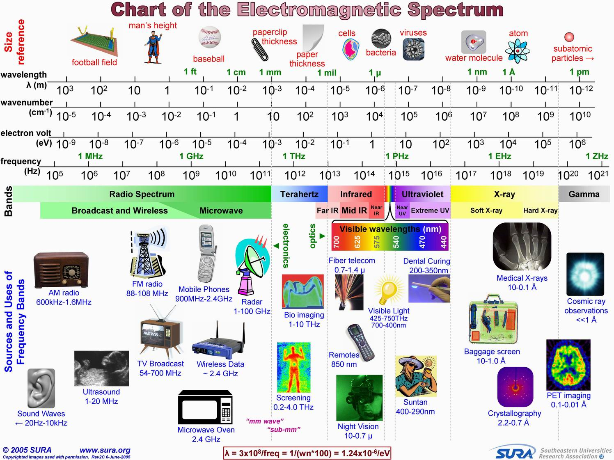
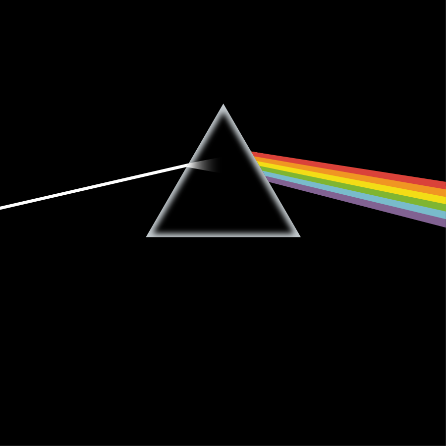
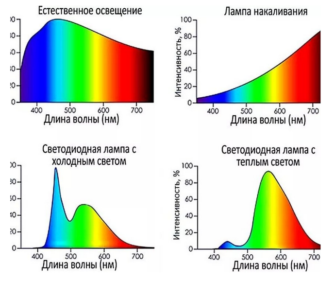
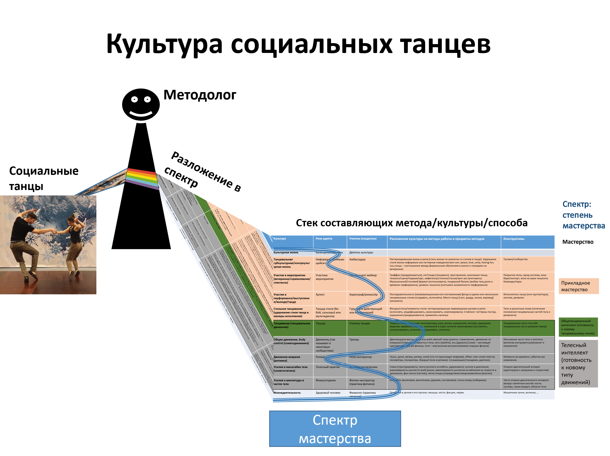
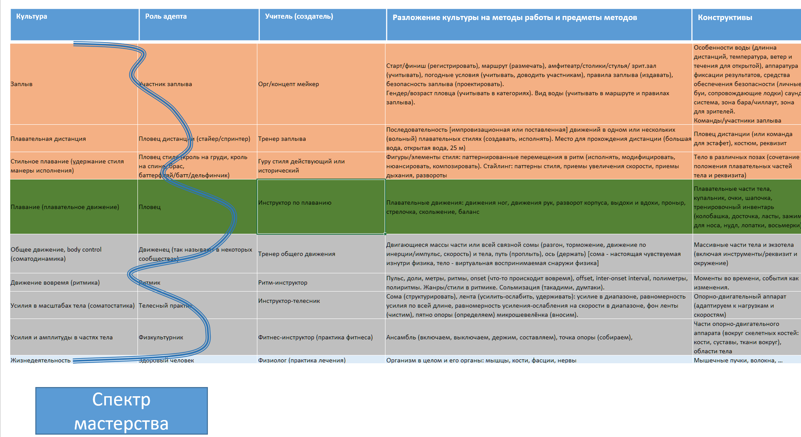
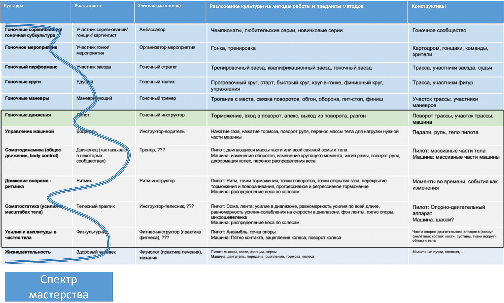
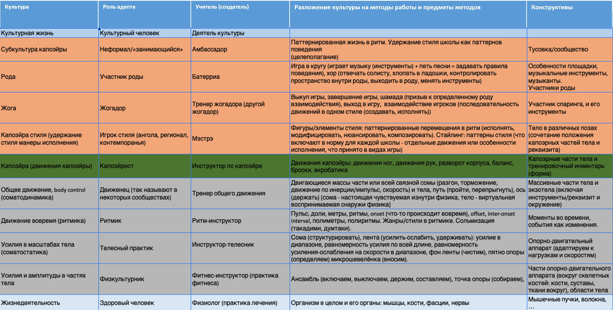

# Метафора разложения метода в стек. Спектр мастерства по стеку методов как спектральной шкале.

Есть множество трудностей с пониманием самого понятия метода работы — очень трудно представить себе, что же это такое. Так, легко представить себе бегуна, но если попробовать представить бег этого бегуна, то представится опять-таки бегун, хотя и «развёрнутым видео бегуна в движении», без бегуна представить бег сложно, это ведь поведение без того, кто как-то себя ведёт. Похоже на попытки обсуждения Чеширского кота: улыбка кота есть, а самого кота нет. В 4D экстенсионализме это нормально, это подробно разбиралось в руководстве по системному мышлению.

Но вот дальше проблемы: надо как-то рассматривать/моделировать бег как метод работы бегуна, и тем самым надо выдавать его разложение на составляющие — как работают мышцы, как происходит дыхание, какие позы принимает всё тело, маршрут движения тела из точки А в точку Б в ходе бега и т.д. А уж если попробовать представить разные виды (тут часто используется ещё один синоним метода: «техники») бега как альтернативные варианты разложения сигнатуры метода «бег» на составляющие — это будет очень проблемно, но именно этим занимаются тренеры лёгкой атлетики. Основной способ разбираться с каким-то объектом — это разбираться с его составляющими. Но если части и целые собираются в систему, то с поведением всё не так. Составляющие метода не представляют собой части и целые, они сосуществуют вместе, сплетаются, выдают целостное поведение в весьма хитром их соединении.

Одна из трудностей тут — путаница между:

* самим методом как тем, что происходит в жизни в ходе работы,
* описанием метода,
* методом обучения мастерству выполнения метода (в том числе описание метода путают с описанием метода обучения мастерству выполнения метода).

Скажем, когда пловец участвует в заплыве, то он одновременно дышит по какому-то методу, гребёт руками по какому-то методу, выполняет правила заплыва, то есть участвует в соревнованиях — и эта «одновременность» характеризует сам метод в момент его выполнения. А вот как это обсуждать? Обсуждаем описание — и отдельно обсуждаем метод дыхания как составляющую метода плавания, который сам будет составляющей метода участия в заплыве, метод выполнения гребков, методы участия в заплывах. А как это описывать — описывать это «одновременно» не получится, ибо всего много, всё слишком запутанно. А вот по-отдельности — описывать можно. При этом не забывать, что описания раздельны, а в момент выполнения метода — всё происходит одномоментно, причём порядок и самого описывания/моделирования, и затем чтения модели не соответствует происходящему: моделирование и чтение моделей составляющих последовательны, а в жизни составляющие происходят одновременно.

Иногда при описании идут ещё дальше и дают не собственно описание метода, а описывают метод обучения: например, не могут рассказать, как же происходит дыхание — но могут дать десяток «подводящих упражнений», после которых налаживается дыхание по нужному культурному методу, а не дыхание по «дикому» методу, о котором никто не думал. Мы бы рекомендовали всё-таки иметь отдельно описание метода и отдельно — описание методов обучения методу, чтобы иметь возможность для какого-то метода предложить множество **методик обучения** (иногда методы обучения называют методиками).

А ещё при обсуждении метод путают с мастерством его выполнения. Мастерство — это «контроллер», выполняющий метод, и вот если это выполнение оказывается не соответствующим методу, то даже непонятно, как это обсуждать. Понятно, что можно обсуждать частный вариант метода, который выполняется недообученным агентом с частичным мастерством, но хотелось бы уметь как-то оценивать составляющие и мастерства тоже — например, в плавании это могло бы быть мастерство дыхания, мастерство выполнения гребков, мастерство участия в заплывах. Конкретный метод работы агента (работа плавания) по всем этим составляющим мастерства плавания проявляется одновременно, но хорошо бы как-то структурировать обсуждение, чтобы обсуждать (и для этого — описывать) составляющие мастерства и **степень мастерства**, то есть степень, в которой достигнуто выполнение SoTA метода этого мастерства — «не знаю о методе», «знаю, но не умею», «умею, но делаю новичковые ошибки», «умею, но в сложных случаях не справляюсь», «умею», «умею и могу развивать метод».

Проще всего разобраться с тем, как думать о составляющих (намеренно не пишем «частях», у поведения нет частей в привычном понимании, метод как поведение системы — это не система!) метода можно, если использовать аналогии, прежде всего наглядные аналогии из физики, а не математики.

Роман Варьянко предложил метафору не математического «разложения функции в ряд», а «разложение света в спектр», что выполняет примерно ту же функцию разложения сложного объекта не-вещи на составляющие.

В головах людей со словом «спектр» ассоциируется «радиочастотный спектр», который во всех учебниках иллюстрируется не двумерными картинками именно **спектра** (распределение мощности электромагнитного излучения по разным частотным диапазонам), а одномерными картинками **шкалы спектра**, то есть картинками частотных диапазонов, или диапазонов длин волн.

Спектр — это результат разложения чего-то сложного и составного (намеренно избегаем говорить «целое», ибо разложение не на части этого целого) на составляющие, отвечающие местам на шкале. Поэтому спектр какого-то света от конкретного источника — это разложение сложного света по длинам волн, и там совсем другая картинка, и главное для нас там — видеть этот начальный сложный объект и его «разложение», как на вот этой картинке разложения света от его источника призмой[^r7-1]

С одной стороны белый свет воспринимается как «белый» (это сигнатура, «свет»), с другой — в нём оказывается множество составляющих его цветных отдельных лучей, но главное — все эти лучи не части входного пучка от источника, но всё-таки каким-то образом входной пучок света составлен из эти составляющих.

Вот именно спектры от разных источников света:

Дальше надо бы рассмотреть много терминологических нюансов. Например, разложение в спектр света на английском — dispersion/дисперсия, ибо так это назвал Ньютон. Бывают и разложения в спектр не света или электромагнитных колебаний по длинам. Можно брать масс-спектры, где линии спектра соответствуют отношению массы к заряду иона (характеризуют природу иона, разные ионы имеют разные отношения массы к заряду), а высота линии — соответствует концентрации иона. Там тоже смесь ионов существует как одно целое и происходит разложение для понимания, из каких ионов составлен раствор. Но в растворе нельзя как-то выявить один вид ионов как его истинную часть, они же там все перемешаны, нет границы между ионами разной природы в их растворе! Иногда разложение даётся как spectral decomposition, таки «разложение», а вот разложение в ряд в математике — это расширение (expansion series).

В любом случае, спектр должен иметь какой-то объект, для описания поведения или свойств которого мы измеряем спектр как интенсивности или другие свойства, распределённые по какой-то шкале другого свойства.

Для методов мы будем раскладывать сами методы в какой-то стек по относительным «размерам» их частей. Так, заплыв — это метод большого «размера», а вот собственно плавание — метод «поменьше» (работы плавания входят в число работ участия в заплыве), дыхание в ходе плавания — это тоже «размером» поменьше, чем плавание. Можно тем самым предложить условную шкалу из разложения методов в стек по их размерам — «участие в заплыве — плавание — дыхание». А дальше предлагать оценить мастерство на каждом уровне (при этом понимая, что мастерство участия в заплыве включает в себя мастерство плавания, в свою очередь мастерство плавания включает в себя мастерство дыхания). Тут сразу непреодолимые сложности, ибо в таком простом способе описания метода как стека составляющих по их относительным размерам (что там является составляющим чего — по размеру, как на шкалах для спектров) и оценки мастерства по такому стеку как по шкале даже в этом простейшем примере уже непонятно, что делать: куда тут поместить гребок рукой так, чтобы было удобно оценивать степень мастерства по каждой составляющей культуры плавания (назовём всё происходящее в этом стеке одновременно культурой, один из синонимов метода)? На том же уровне стека, где дыхание, но как тогда быть с формой «стека», можно ли много составляющих включать в один уровень (как много длин волн включают в «диапазон» шкалы электромагнитного спектра)? Или гребок где-то на уровне выше или ниже дыхания?

В «Системном мышлении» у нас давался для понимания системного мышления пример танцев, где подчёркивалось выделение каких-то темпоральных функциональных частей системы вниманием, чтобы предотвратить представление систем в виде «взрыв-диаграммы» или представление о поведении системы в её разных частях как пошагово последовательных. Танцоры танцевали в клубе — и вниманием можно было выделить и физиологию работы их тел, и мышечные усилия в телесной работе, и следование стилю определённого танца, и сам танцевальный перформанс, но и дальше, на более длинных промежутках времени — мероприятие в клубе, посещение школ танцев и клубных вечеринок, бытование в культуре социальных танцев. А рядом с агентами, которые танцевали, мы описывали роли создателей — врачей, тренеров, хореографов, организаторов вечеринки.

Вернёмся к этому примеру и представим его в виде спектра степени мастерства танцоров по шкале из разложения методов в некоторый стек составляющих методов, разве что заменим «метод» словом «культура» — это синоним «метода», означающий, что метод получил распространение:

Онтологически различаем разные типы, которые тут отображены:

* Разные культуры/методы, это актуальные «шаблоны/паттерны поведения», они в жизни — хотя представлены, конечно, не экземпляры, а типы. Надо понимать, что говоря о культуре, мы имеем в виду «предельное, лучше из известных» исполнение метода (SoTA), для каждого конкретного агента с его мастерством будет степень реализации метода зависеть от степени мастерства этого агента (поэтому «метод вообще, как должно бы быть в идеале» тут выступает в качестве «шкалы культурного спектра», а степень мастерства изображается как спектр по этой «шкале спектра»).
* Предметы метода — функциональные объекты, предметы работы — конструктивные объекты (которые тоже могут быть заданы типами). Помним, что нам желательно заземлять все предметы методов, ибо в конечном итоге нам надо изменить физический мир, но предметы метода в общем случае могут быть и описаниями.
* Культуры характеризуются их теориями/объяснениями/алгоритмами, но это знания, которые только описывают поведение точно так же, как алгоритм описывает вычисление по нему, он сам — не вычисление. Один алгоритм описывает множество вычислений, которые можно выполнить над самыми разными входными данными этого алгоритма. Метод — это «обобщённое вычисление как преобразование/transformation входов в выходы, в том числе обобщённое на объекты реального мира», производимое какой-то программой как «алгоритмом, по которому идёт обобщённый вычислитель как создатель/constructor».
* Составляющие для культуры социальных танцев — это отдельные культуры, каждая работающая со своими предметами методов. Эти культуры и будут «шкалой спектра» для мастерства отдельного агента. Её можно считать как-то упорядоченной в «стек» методов, аналогичный в каком-то смысле платформенному стеку, об этом чуть ниже.
* Агенты, которые практикуют социальные танцы, задействуют для этого своё мастерство, имеют степень мастерства (от «не знаю, не практикую» до «знаю, практикую, не делаю грубых ошибок, развиваю метод»). Эта степень мастерства условно показана не «в целом для социальных танцев как культуры», но по каждой из культур разложения танцевальной культуры на её составляющие — и вот это будет культурным спектром их мастерства социального танцевания, разные степени мастерства для разных составляющих стека всей культуры социальных танцев показаны синей линией.

Хотя мы легко могли бы предложить и другие варианты спектрального представления (кроме спектра мастерства в выполнении метода, тут «культурного мастерства») для метода, разложенного в этот же стек:

* спектр общепринятости (распространённости этой культуры среди населения),
* спектр универсальности (тут мы касаемся «стековости» представления — ожидаем, что нижние уровни стека более распространены, чем верхние, то есть телесные практики будут задействованы и в спектре культуры социальных танцев, и в спектре культуры лёгкой атлетики, и в спектре культуры восточных единоборств),
* спектр документированности (где есть отчуждаемые от носителей культуры описания знаний, а где до сих пор «традиция устной передачи», на предприятиях это уровень документирования рабочих процессов. Помним, что один из синонимов для «метода» — это «рабочий процесс»).

Шкала разложения методов для спектра мастерства по ним нами представлена как «стек методов», аналогично платформенному стеку — и тут примерно те же ограничения (начиная с того, что платформенный стек не столько стек, сколько «дерево», об этом скажем чуть позже). В социальных танцах на верхнем уровне мы можем говорить об их общей культуре, в серединке — культуре отдельных танцевальных стилей, внизу — о каких-то телесных практиках, нужных для танцевания. Можно говорить о «стеке», если обсуждаем разложение разных методов. Если делаем замер мастерства — о том же «стеке» говорим как о «шкале спектра».

Если это мастерство разбираться с чем-то новым, ранее не виденным, то его мы называем интеллектом — для прикладных методов это будет прикладной интеллект. Грубо говоря, в ПТУ учат действовать в хорошо известной ситуации, дают мастерство, а в университете — учат действовать в новых ситуациях, дают интеллект. Подробнее — в руководствах по инженерии личности и интеллект-стеку.

В случае плавания можно говорить и «культура плавания», и «методы плавания», и «практики плавания», помним о синонимии. Не будем уже показывать пловцов, «призму», рисовать спектр мастерства какого-то агента по разным составляющим этой культуры, назовём их субкультурами (осторожно применим «суб-», понимая, что речь идёт о составляющих метода, проявляющихся одновременно в каком-то исполнении метода мастерством какого-то уровня). Это не «части культуры», а «составляющие культуры», причём в случае культурного спектра не просто составляющие шкалы, а значения мастерства в каких-то субкультурах как составляющие цвета в спектре какого-то белого луча света от его источника являются составляющими «мастерства свечения» этого агента. И мы не говорим о «частях», это не отношение часть-целое, речь-то не о вещах — кроме, конечно, мастерства, которое считаем вещью.

Но проиллюстрируем идею «стека» как шкалы для разложения мастерства плавания. Вот вам табличка для разложения в стек культуры плавания (авторство Юлии Чайковской). Посмотрите, насколько сложней реальный пример того учебного примера, который мы рассмотрели в начале подраздела.

Хорошо видно, что по сравнению с танцами низ стека культур не отличается — методы телесной работы и движения одни и те же, но вот начиная с зелёным выделенного «плавания» (плавательного движения, в танцах это было также выделенное зелёным «танцевание», танцевальное движения) и выше — всё другое.

Дальше, если вы пловец — вы можете оценить по этой табличке свою культуру плавания, сравнить метод, который проявляет ваше мастерство и ваш инструментарий (тело, экипировка, водоём заплыва) с SoTA, можно очень грубо построить спектр мастерства.

«Оценить культуру плавания» — это частый способ говорить об общем мастерстве в самых разных культурах, в которые разлагается культура плавания. Или даже не просто мастерстве, о его высшем виде мастерства — прикладном плавательном интеллекте, если речь идёт о решении проблем в самых разных новых ситуациях, в которых приходится плыть. Для этого вы можете оценить свой уровень владения каким-то из упомянутых в табличке методов из «плавательного стека», и построить ваш спектр мастерства.

Дальше вы можете каким-то образом **стратегировать** (выбирать метод в ситуации, когда непонятно, что делать) развитие, то есть обучение мастерству плавания, продвигать его по состояниям к «умею и могу развивать метод». Результатом стратегирования будет стратегия (синоним метода) ваших тренировок, затем следует планировать тренировки (планировать трату ресурсов на тренировки), затем обязательно переходить к выполнению плана — демонстрировать собранность, неутерю внимания к выполнению метода (то есть выполнению стратегии тренировок) на длинных интервалах времени.

Вы в этой стратегии можете усиливать свои сильные стороны (то есть тренировать то, в чём у вас и так есть мастерство, чтобы обойти в этом конкурентов), подтягивать слабые стороны (то есть тренировать те составляющие, где мастерство особо слабо — чтобы не проиграть конкурентам), решить, что вообще займётесь чем-то другим — поменяете метод (скажем, замените плавание картингом, сохранив при этом всё ваше телесное мастерство, в бизнесе это обсуждается как вираж/pivot).

Вот практики (возьмём ещё один синоним) картинга на базе того же разложения телесной культуры, которое мы использовали для танцев и плавания[^r7-2]:

Вот капоэйра в таком же представлении, уберём оттуда линию спектра мастерства[^r7-3]:

Ещё тут можно обратить внимание на пример того, что «стиль» относится к довольно частным составляющим разложения метода. В принципе, можно говорить о танцах, плавании, капоэйре как о стилях движения, но чаще о танцах, плавании и капоэйре говорят, подразумевая их широкую распространённость, поэтому термин не «стили движения», а «культуры движения», а вот стили — это уже «внутри» больших культур, причём в этих строчках можно будет найти альтернативные стили. Скажем, в плавании вы плывёте или брассом, или кролем, и даже одним из многочисленных его подстилей, или баттерфляем, или на спине, или «по-собачьи» — и когда вы выбираете метод в ходе стратегирования, то из всех возможных вариантов выберете или даже создадите какой-то один стиль и потом будете оттачивать ваше мастерство именно в этом варианте стиля, возможно, чередуя его с другими стилями. В восточных единоборствах принято отточить своё мастерство в одном из стилей, затем в паре-тройке стилей, а затем создать свой собственный уникальный стиль — это связывают с ростом мастерства следования культуре единоборств в целом.

Эти таблички демонстрируют два вполне совместимых взгляда на разложение метода/культуры/инженерии/практики работы:

* объяснение того, что в одной и той же работе какой-то системы (в том числе системы-создателя, работе агента) можно увидеть много разных шаблонов/методов, как много разных «частных» цветов можно увидеть в белом «полном» свете (много частей спектра[^r7-4] можно разглядеть в полном спектре, «разглядеть» тут — буквально, spectrum — это «видение» от латинского spectare, «смотреть»). Говорим о шкале.
* объяснение того, что мы можем переиспользовать какую-то часть разложения метода как «методы платформы», «основание стека методов», а другую — заменять. Говорим не столько о шкале, сколько о «стеке».

[^r7-1]: Обложка альбома The Dark Side of The Moon группы Pink Floyd, <https://ru.wikipedia.org/wiki/The_Dark_Side_of_the_Moon>

[^r7-2]: <https://systemsworld.club/t/topic/4319>

[^r7-3]: <https://systemsworld.club/t/post-na-pomidorku-kapoejra/12031>

[^r7-4]: <https://ru.wikipedia.org/wiki/Спектр>
