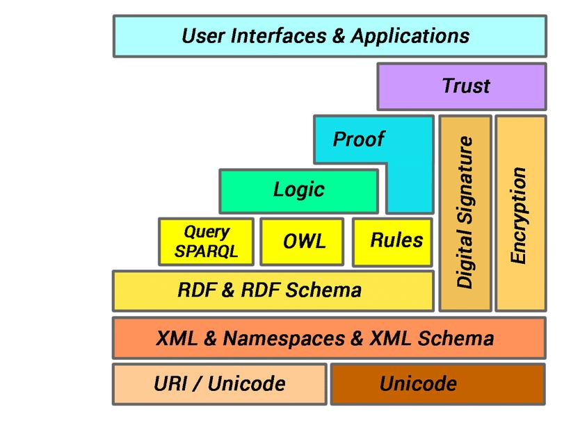
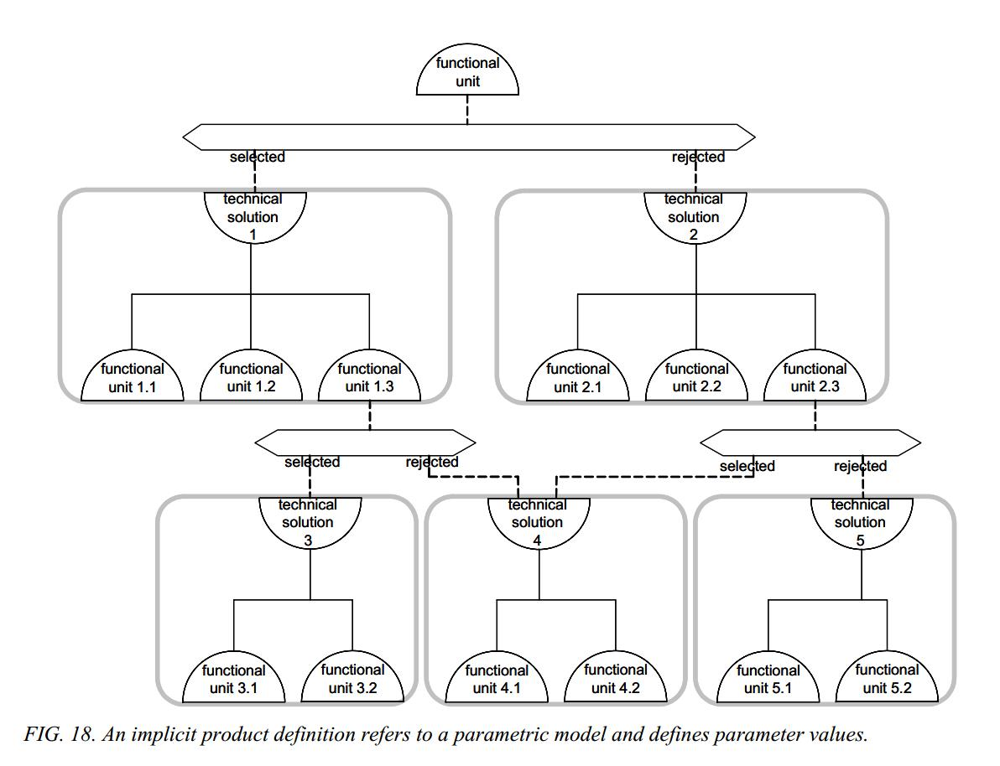
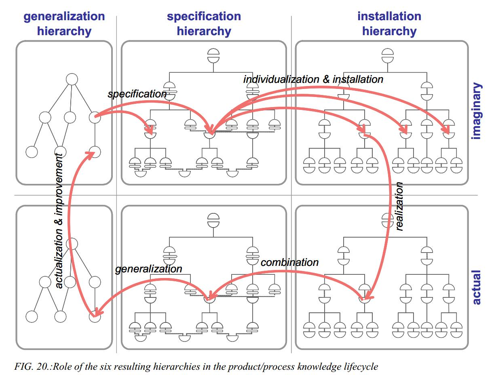

# Представление разложения метода деревом

Метафоры спектра и стека, конечно, не полные представления о методе, они одномерные и поэтому крайне невыразительные. А ещё все эти «стеки», конечно, ни разу не линейные стеки, а графы-деревья, их трудно представлять стеком. Всё то же самое, что и с системными уровнями: вроде как платформенные уровни выглядят «уровнями стека» и подразумевается «матрёшка», но нет, там много разных матрёшек внутри каждой матрёшки.

Так, semantic web technology stack легко гуглится, он также называется semantic web layer cake, но слои в нём весьма и весьма условны (более того, ещё и на разных картинках разных авторов их число и состав разнится). Вот только один из вариантов изображения этого «слоёного пирога», обратите внимание, что там отнюдь не только плоские «блины» в этом пироге, не получается чистой «стопки», это и есть беда всех «стеков» в платформах и разложениях методов:

Кроме «разложения в спектр» или «разложения в стек» нужно добавить ещё наличие альтернативных вариантов (и, соответственно, их разложений) для какой-то сигнатуры. Мы тут обсуждали варианты брасса, кроля, баттерфляя: методолог рассмотрит их все, выберет один из них — и дальше будет использоваться только один из этих вариантов. Это общее рассуждение и для методов работы создателей, и для функций систем — но такое представление для методолога оказывается ещё более сложным, ибо для каждого разложения на составляющие нужно учитывать и альтернативы. А с учётом того, что для концепции системы надо указывать и конструктивы, и там тоже некоторая иерархия — всё становится ещё более запутанным.

Всё это моделирование не только многоуровнево по его точности-подробности (перечисление методов путём перечисления ролей, разложение методов с представлением в виде каких-то деревьев разбиений ролей, представление в виде функциональных диаграмм), но оно будет ещё и многоуровнево в части системных уровней: моделирование пойдёт на каждом уровне в системной иерархии: самолёт-двигатель-топливный насос тут пример киберфизической системы, но для системы AI мышление о разбиении функциональных объектов (ролей в надсистеме) будет таким же — сообщество агентов (не все из них даже AI-агенты), один AI-агент, в нём «большая языковая модель», в ней отдельно устройство «многоголового внимания», и везде вы будете рисовать какие-то диаграммы потоков информации между частями этих программ-систем. У танцоров мы тоже будем описывать методы, которыми практикуется каждая отдельная культура из спектра разложения культур, и тоже будем говорить о декомпозиции ролей — в агенте будем выделять роли участника вечеринки, в участнике вечеринки выделять танцора танцевального стиля, в танцоре танцевального стиля будем выделять «просто танцора», и каждого со своими методами/культурами/стилями/практиками/технологиями работы и своими специализированными создателями. В «Системном мышлении» мы обсуждали, что это выделение частей может быть контринтуитивным, например, «просто танцор» может быть частью «танцора стиля», потому как танцор стиля характеризуется мастерством и просто танцора, и ещё знает много другого про его танцевальный стиль, а сама эта роль (функциональный объект) будет частью участника вечеринки, ибо участник вечеринки имеет мастерство не только стильного танцевания, но знает и многое другое — как попасть на вечеринку, как одеться на вечеринку, как приглашать на отдельный танец-перформанс.

Прикладная методология подразумевает, что каждый участник проекта владеет фундаментальной методологией, чтобы обсуждать выбор лучших методов в какой-то предметной области, но кроме того — хорошо знает методы и предметы методов самой предметной области, чтобы выбирать из уже известных методов лучшие.

В старом понятии архитектуры (примерно до 2017 года, когда именно архитекторы создавали концепцию системы в целом как «самые опытные разработчики») это означает, что функциональные описания в рамках разработки архитектуры делают разработчики-проектировщики. Вот доклад 2021 года одного из главных архитекторов крупной (единорог) компании, который так и изображает эту проблему в заголовке: «как из одного архитектора вырастить 100+ архитекторов»[^r7-1]. В самом докладе говорится главным образом о том, как сделать, чтобы разработкой функциональных описаний (методов, которыми работает система) занимались 100+ сотрудников, которых мы сейчас назвали бы **прикладными методологами** своих частей проекта общего проекта создания системы. А современное понятие архитектора подразумевает как раз разбиение системы на модули такое, чтобы прикладные методологи были по возможности автономны в своих решениях. В разработке каждого «микросервиса» в инженерии корпоративных программных систем надо определить его функцию и сделать так, чтобы все предложенные функции микросервисов укладывались в предложенный архитектором способ разбиения на части конструкции из микросервисов и способы организации коммуникации между этими частями конструкции. Это нужно для того, чтобы достичь удовлетворительных значений каких-то архитектурных характеристик «-остей», например, малое время отклика (малая латентность), высокие показатели доступности, высокие показатели в наработке на отказ (надёжность).

Если в порядке разделения труда для роли разработчика выделить роль методолога, владеющего методами работы предметной области и роль проектировщика, который задействует результаты методологической и архитектурной работы для разработки и реализации концепции системы — этот доклад смотрелся бы совсем по-другому.

Предлагаемое прикладным методологом функционально-платформенное описание методов предметной области (функциональное разложение/синтез с возможностями альтернативного выбора видов из родов) должно быть как-то сочетано проектировщиком с реальным конструктивно-платформенным представлением, то есть архитектурным в его новом значении: нарезка на конструктивы в каком-то фреймворке. Это всё будет подробно рассказано в руководстве по системной инженерии и даны примеры специализации системной инженерии до инженерии личности и системного менеджмента в руководствах по методам работы в этих предметных областях.

Прикладной методолог должен ориентироваться в методологическом разнообразии своей предметной области, чтобы подобрать SoTA методы для своей ситуации, а разработчик (неважно чего разработчик — робота как «железной системы», программной системы AI-агента, мастерства или даже интеллекта каких-то людей, разработчик оргвозможностей в организации) должен обладать недюжинным кругозором, чтобы сделать «изобретение» — предложить самые эффективные для реализации функциональных объектов конструктивные объекты, удовлетворив и методологов («всё будет работать в соответствии с расчётами») и архитектора («это не ухудшит архитектурные характеристики»).

Есть множество методов (в том числе методов описания системы, удобных для применения этих методов) ведения методической, методологической и архитектурной работы в их взаимоувязке. Для примера мы можем использовать классический фреймворк Wim Gielingh из работы «A Theory for The Modelling of Complex and Dynamic Systems»[^r7-2], он был использован как один из источников идей для семейства стандартов описания систем STEP, ISO 15926 и далее BIM.

Gielingh вводит понятия functional unit (функциональный объект, «роль» — то, что будет задействовать метод) и technical solution (конструктивный объект, который выбран как аффорданс для реализации роли, то есть выполнения работы функции/метода) и показывает концепцию системы в ходе её эволюции, то есть создания и развития: каким образом происходит совместный функциональный синтез/декомпозиция и модульный/конструктивный синтез/декомпозиция. Если смотреть на диаграммы снизу вверх — синтез, «разработка снизу вверх», bottom-up. Если смотреть на диаграммы сверху вниз — декомпозиция, «разработка сверху вниз», top-down. В реальности же рекомендуемый метод разработки — «изнутри среднего уровня наружу вверх и вниз, inside out»). Вот предложенная нотация концепции системы для определения системных уровней с учётом отношений род-вид и выбора вида:

Такая нотация называется гамбургер-диаграмма, где указывается множество кандидатур методов в разложении для какой-то сигнатуры (обсуждение ведётся не в терминах самих методов, а в терминах ролей, работающих по этим методам, Functional Units, FU) и дальше метод назначается какому-то типу конструктивов (Technical Solution), чтобы разобраться с модульностью в порядке формирования концепции системы. «Гамбургер» тут — половинки булки, между которыми «начинка» — это выбор назначений технических решений (конструктивы) на функциональные единицы (роли). В нотации предложено принимать решения по модульности на каждом уровне функциональной декомпозиции, чтобы поощрить выделение модулей в целях унификации. Но современные архитекторы сказали бы, что такой принудительный ход на унификацию модулей — способ ввести межмодульные зависимости, поэтому подход Gielingh не получил особого распространения, умер вместе с очень популярной в 90х годах идеей разработки модулей с повторной используемостью, reuse. Это подход второго поколения системного мышления, где система разрабатывалась как экземпляр, но не как развивающийся вид, не было «непрерывного всего», разработка мыслилась итеративной, но однократной.

Фреймворк от Gielingh важен тем, что различает generalization hierarchy (иерархия сигнатур), specification hierarchy (выбор вида из рода) и installation hierarchy — уже выбранное по типу и инсталлированное как экземпляры в целевой системе, работающее — и делает это на уровне проектирования («воображаемый проект») и конфигурации конечной воплощённой системы (as built). Вот шесть иерархий, служащих предметами рассмотрения во фреймворке Gielingh — верхний ряд это «воображаемый проект» в его общем/генерализованном виде, а нижний ряд — это с конкретными расчётными функциями и указанными уже моделями конструктивов, самого Gielingh тут интересовала знаниевая работа над проектом, уточнение ролей с какими-то их методами работы и их поддержки со стороны конструктивов:

Эта диаграмма характеризует важное для методолога, разработчика и архитектора:

* Методологу надо рассмотреть альтернативы разложения метода для какой-то сигнатуры. Если у вас в системе предусмотрен метод «чистка зубов», то вам надо рассмотреть варианты еды на ночь семян кунжута (удивительно хорошая очистка!), использования зубной нити, зубочистки, зубной щётки или ультразвуковой щётки с выбором из многих видов зубной пасты и вариантами щёток (например, V-образная зубная щётка, если у вас брекеты), задействование ирригатора (чистка водой под давлением), и т.д.. Каждый метод обладает своими плюсами и минусами, а если это верхнеуровневый метод, то может быть реализован очень по-разному, его составляющие будут иметь в свою очередь, разные разбиения — и надо будет опять выбирать, и там, скорее всего, будут какие-то другие предметные области. Это и есть работа. По большому счёту, именно методолог делает «разузловку», разбиение системы на функциональные единицы. Понятно, что в силу разделения труда это очень плохо делать «сверху вниз», ибо ключевое понимание того, как же именно работает система, будет на нижних уровнях. Но это уже нюансы, о которых будет в руководстве по системной инженерии.
* Архитектор будет следить, чтобы в конструктивах, реализующих функциональные объекты с предложенными функциями/методами работы, не было лишних зависимостей и соблюдались приемлемые значения важных общесистемных архитектурных характеристик. Так, если коммуникация в организации идёт «через верх» (каскадирование: CEO сказал что-то замам, те выдали начальникам дирекций, те выдали начальникам отделов, те выдали начальникам секторов, те уже не стали подключать сотрудников и сами что-то сделали, потом пошло согласование этих предложений снизу вверх), то это будет дико медленно — цикл стратегирования, бюджетирования и т.д. будет легко длиться больше года, и когда будет какой-нибудь валютный или кадровый кризис, организация банально не сможет быстро отреагировать. Архитектор вмешается, заставит разработчиков организовать потоки работ как-то другим способом, методологи должны будут предложить методы стратегирования и бюджетирования, которые не будут подразумевать каскадирования (подробней об этом в руководстве по системному менеджменту).
* Проектировщик/designer будет принимать решение по тому, что же из имеющегося в культуре разнообразия видов методов работы (и, соответственно, разнообразия ролей), предлагаемых методологом, должно войти в разрабатываемую систему, и какими видами конструктивов с их интерфейсами, удовлетворяющих ограничениям, полученным от архитектора, это может быть реализовано — и он также собирает и другие ограничения (технология изготовления, общая стоимость владения, компоновка и т.д.), чтобы выдать многоуровневое «изобретение».

Современная инженерия сложна, поэтому и происходит разделение труда: много лет назад все эти работы выполнялись (часто неосознанно) одной ролью «инженер» (или «менеджер», или «учитель» — названия тут могут быть самыми разными в зависимости от типа систем). А сегодня чаще всего в крупных проектах эти роли раздаются разным людям, при этом роль архитектора уже более-менее выделилась из роли разработчика, а вот роль методолога от роли проектировщика у разработчика только-только начала отделяться.

[^r7-1]: <https://www.youtube.com/watch?v=JlXeQxAkDf0>

[^r7-2]: <https://www.researchgate.net/profile/Wim-Gielingh/publication/228797525_A_theory_for_the_modelling_of_complex_and_dynamic_systems/links/00b7d516e525eab19e000000/A-theory-for-the-modelling-of-complex-and-dynamic-systems.pdf>
