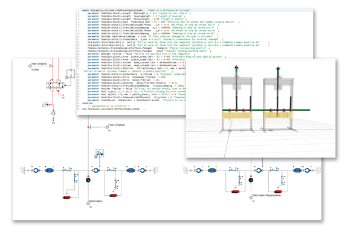
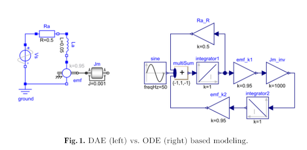
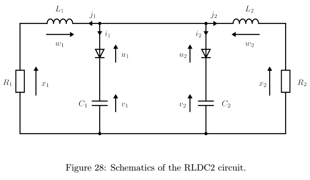

# Виды физического системного моделирования: функциональные диаграммы есть, но вместо них может быть компьютерный код

Текущий текст подраздела предназначен главным образом для «технарей», его может быть трудно одолеть людям, которые не имеют высшего инженерного образования. Но если вы «технарь», а текст плохо понятен — попробуйте пройтись по ссылкам на оригинальную литературу и хотя бы чуть-чуть её полистать. Всё-таки инженеров такому должны учить, и освежить эти знания никогда не поздно. Руководство по методологии предназначено для инженеров-менеджеров, оно подразумевает хорошее образование у тех, кто его осваивает, делать из него «попсовое руководство» без отсылок к физике и математике — неправильно.

1D-моделирование довольно долго делалось на акаузальных языках моделирования, например, Modelica[^r7-1], одновременно с графическим и текстовым представлением систем алгебраических дифференциальных уравнений. В физическом системном моделировании учитывается уже более-менее разная физика системы (механика, гидравлика, энерготеплопереносы и т.д.) или какие-то её другие свойства (например, умение производить работы, пропускать через себя поток предметов работ — иногда это называют даже factory physics). Но это всё моделирование функционирования, по факту — это моделирование метода работы системы. Вот пример представления модели на Modelica[^r7-2]:

Мы видим на картинке 3D-модель системы «как в САПР», а также её функциональную графическую модель (диаграмму), а также программный код, соответствующий этой диаграмме. Диаграммное представление «наглядно», но с ним очень трудно работать — при росте размера диаграммы и увеличении числа «аннотаций» каждого элемента диаграммы (по факту «аннотации» — это текст, описывающий элементы диаграммы и связи — никогда не забываем, что любую картинку надо объяснять, и к картинкам для полной понятности мы «приговариваем» большое количество текста) модель, то есть систему дифференциальных уравнений, становится удобней представлять в виде текста на языке программирования. «Резистор» становится не схемным изображением на диаграмме, а текстом программы.

По итогам эксплуатации многочисленных систем с Modelica оказалось, что диаграммное представление функциональных схем менее удобно в работе: модельеры-проектировщики проводят много времени в текстовых представлениях, а диаграммы используют главным образом в «презентациях», для красоты, которую называют «наглядностью». Любые изменения-исправления, вставки и удаления, предложение альтернатив и комментарии делаются в текстовой форме, она банально удобнее. Поэтому современные средства 1D-моделирования по факту представляют собой пакеты численного моделирования для обычных языков программирования, например, один из самых мощных таких пакетов — JuliaSim[^r7-3]. Отсутствие «визуальности» функционального моделирования с лихвой компенсируется удобством использования: тексты менять в ходе разработки много быстрее, чем диаграммы. И тексты можно пересылать друг другу, легко комментировать, чего не сделаешь с диаграммами — учитывая ещё и то, что откомментировать фрагмент текста программы функциональной модели можно и в чате, а вот с диаграммами всё не так просто, нужны специальные дорогие программы для работы с диаграммами, и они должны быть установлены у всех участников проекта, что обычно невозможно.

Тем самым мы от ограниченного диаграммного языка описания методов в их разложении перешли к описанию разложения метода алгоритмом, что ярко проявляется в функциональном физическом моделировании.

Инженеры в ходе проектирования обсчитывали принципиальные и технологические схемы, иногда называя это одноразмерным/1D моделированием, чтобы противопоставить трёхмерному прочностному и тепловому моделированию — речь-то идёт о функциональных описаниях, и тут у математиков, системных инженеров, программистов и всех остальных терминология существенно различается. Это как раз наша задача — ввести какой-то общий язык описания этого моделирования и этих вычислений, привязав эту терминологию и способы моделирования к современным методам разработки. «Хитрая физика» в функциональном физическом моделировании ведёт к «хитрой математике», которая ведёт к «хитрым языкам моделирования», которые реализуются достаточно необычными приёмами в разработке компиляторов и библиотек, поддерживающих моделирование в конкретных областях физики (электротехника, оптика, теплоперенос), но и не только физики — речь идёт вообще о моделировании мира в момент работы системы.

В традиционной «железной» инженерии принято было использование MatLab (более удобен для вычислительных задач, чем Фортран) и SimuLink для создания имитационных моделей, программные среды для вычислений с ODE (odinary differential equations in state space form — дифференциальные уравнения для пространства состояний входов и выходов). Это стало мейнстримом, но оказалось, что сопровождать модели в такой форме невозможно: для типовых случаев нельзя сделать библиотеки отдельных функциональных элементов, которые присутствуют в системе, и приходится каждый раз понимать, куда и как вписать очередное уточнение модели, или куда и как вписать очередное изменение модели.

Потому моделированию в ODE было противопоставлено акаузальное моделирование/acausal modeling с использованием DAE (differential algebraic equations) с алгебраическими переменными, которым a priori не могло быть придано никакого входного или выходного статуса — порядок вычислений не мог быть предсказан, ибо непонятно заранее, где у какого-то резистора вход, а где выход в составе модели.

Но как же проходит такой трюк с переходом от ODE к DAE? А вот так: разные уравнения собираются в большую систему из сотен, или даже тысяч (а в последнее время речь идёт и о миллионах) дифференциальных уравнений, и дальше решением этой огромной системы уравнений занимается компьютер (или даже суперкомпьютер, если система реально большая). Вот сравните удобство для инженеров моделирования электрического мотора с учётом инерции его вращения при представлении модели в DAE и ODE формах в их диаграммном виде[^r7-4]:

Первые принципы физики естественным образом приводят к рассмотрению акаузальных моделей с алгебраическими дифференциальными уравнениями (DAE), таких как на рис. 1 слева. Например, рассмотрим случай электрических цепей. Законы цепей, такие как законы Кирхгофа, естественно выражаются в виде уравнений баланса: алгебраическая сумма токов в сети проводников, встречающихся в одной точке, равна нулю; или сумма всех напряжений в петле равна нулю. Это верно будет и для операционного менеджмента (потоки работ, денег, материалов в сетях/цепях поставки), в любых других системах, в которых что-то «течёт» (в том числе и «текут данные»).

Аналогичным образом некоторые компоненты (например, резисторы или конденсаторы) имеют заранее определенную ориентацию входа/выхода. В одной и той же схеме можно назначить разный статус входа/выхода её переменным, в зависимости от того, какие из них объявлены источниками. Такая же ситуация возникает в механике или термодинамике, везде, где нужно функциональное моделирование значений каких-то характеристик во времени. Кроме того, добавление ещё одного физического компонента в принципиальную схему не представляет сложности, тогда как для «вычислительной блок-схемы» на рисунке справа может потребоваться полная переработка.

И в итоге были предложены специальные акаузальные (не требующие учёта порядка влияния друг на друга элементов через входы и выходы) языки программирования и вычислительные среды для них. Компания MathWorks к SimuLink с его ODE добавила SimScape с DAE, компания Siemens предлагает Amesim, но де-факто стандартом и экспериментальной средой для отработки новых идей стал язык акаузального имитационного моделирования мультифизики Modelica (https://modelica.org/), для которого было разработано полдюжины компиляторов самыми разными фирмами и университетами. На смену Modelica сейчас приходит проект JuliaSim с акаузальным инструментарием ModelingToolkit.jl[^r7-5].

Modelica с годами распухала: кроме мультифизики в него был добавлен аппарат моделирования машины состояний, и стало возможным выражать на нём и логику управления (кибер-часть функционального моделирования), то же самое происходило с другими системами моделирования.

А поскольку разнородных средств физического/имитационного моделирования оказалось очень много, для объединения самых разных моделей на уровне обмена данных между их входами и выходами был предложен стандарт FMI[^r7-6] (functional mock-up interface — он поддерживается более чем 150 программными инструментами для моделирования).

Но и DAE/acausal моделирование оказалось с проблемами. Главная проблема тут — невозможность использования Multi-Mode DAE Models (mDAE). **Multi-modemodels—** **это моделирование режимов, связанных с разными структурами одной и той же системы. Если у вас летит ракета с тремя ступенями, потом с двумя, потом с одной ступенью—** **моделировать это нужно по-разному, это же будут лететь совсем разные ракеты, у которых только название общее, а физика совсем разная! Если у вас моделируется атомный реактор в ходе его нормальной работы, то там одна физическая модель. А если он уже начал плавиться—** **то моделировать его плавление нужно по-другому, прошлая модель реактора не будет работать.** Это явление носит разные имена, Multi-mode DAE models только одно из них, в математике и физике используют и другие, например, VSS (variable structure system, — и они тоже имеют много разных подвариантов, «частных случаев»)[^r7-7]. Есть и другие имена, разные группы исследователей приходят к этой проблеме учёта изменения структуры модели вслед за структурой моделируемой физической системы в разных исследовательских ситуациях и подчёркивают в имени разные аспекты проблемы.

Математика mDAE хитра, и языки акаузального физического моделирования и их компиляторы должны учитывать эту хитрость математики, иначе результаты моделирования будут кривые. Вот одна из работ 2020 года, проясняющая трудности: «The Mathematical Foundations of Physical Systems Modeling Languages»[^r7-8]. Трудности там демонстрируются на вот таком простом примере, с которым не справляются нынешние компиляторы Modelica, и дело там не только в computer science (плохом языке моделирования и плохом его компиляторе), но и в математической-физической стороне вопроса:

Схема выглядит очень просто, но её модель должна содержать по факту описание четырёх режимов работы — для ситуаций, когда диоды оказываются закрыты или открыты в разных сочетаниях. Поэтому существующие компиляторы на таких схемах спотыкаются — они часто интерпретируют их как «один режим работы», когда их там четыре.

После того, как разобрались с физикой и описывающей её математикой, подключается computer science, ибо нужно теперь создать язык с нужной для этой математики операционной семантикой и (оптимизирующий!) компилятор для него. Это оказывается в случае mDAE не так легко, ибо уже не хватает уровня продвинутости человечества в computer science. Исследования (computer science) и разработки (software engineering) для акаузального мультифизического моделирования идут по вот этим основным линиям, а основное развитие сейчас происходит в ModelingToolkit.jl[^r7-9] в проекте JuliaSim[^r7-10].

В какой-то мере этот тренд с использованием «языка» mDAE вместо ODE для физического моделирования похож на создание разных языков программирования для решения expression problem в самой computer science[^r7-11]. Суть этой expression problem ровно в том же: **разработка библиотек универсальных вычислительных элементов требует от языков программирования и реализующих их компиляторов** **возможности добавлять новые объекты для старых операций и новые операции для старых объектов, чтобы не нужно было переписывать весь код программы.** Обратите внимание, что в предыдущем предложении мы по факту говорим, что языки программирования и языки моделирования — это одно и то же, функциональное моделирование делается на языке программирования. Это отдельная долгая история, ибо на самой заре программирования «языки высокого уровня» как раз и считались языками моделирования (например, Simula[^r7-12], первая версия которой появилась в 1962 году, это был первый объект-ориентированный язык). Это лишний раз подтверждает, что моделирование может и должно делаться не только на специализированных упрощённых языках моделирования, но и на самых обычных языках программирования общего назначения — но оно предъявляет специальные требования к этим языкам.

В mDAE против ODE мы расширяем expression problem с обсуждения только программных объектов и операций до обсуждения описания/моделирования физических сущностей: или ты делаешь язык, на котором разные функциональные объекты описываются разными наборами уравнений (декларативно), и просто добавляешь эти модели друг ко другу, или в языке у тебя такой возможности нет, и ты вынужден каждый раз переделывать программу при малейших изменениях моделируемой системы или малейших изменениях в идеях самого моделирования.

Если ты не решил эту «model expression problem», то тебе нельзя сделать стандартные библиотеки, оформляющие стандартные поведения функциональных объектов. Знания моделей становятся плохо переносимыми между моделями, модели плохо модифицируемыми — каждый раз при внесении изменений нужно переписывать и перекомпилировать всю модель.

Есть ещё и многомасштабность моделирования: объединение моделей разных системных уровней, разных масштабов времени, тут тоже свои математические и выразительные трудности в языках программирования[^r7-13], — и там тоже проблемы с ODE против DAE, плюс много чего собственного, и для этого тоже может потребоваться учёт в языках программирования/моделирования. Увы, языки программирования/моделирования не системны/многомасштабны «из коробки».

Для моделирования в реальном времени (цифровой двойник/digital twin, скорость моделирования имеет значение, проблемы алгоритмики как алгоритмов, дающих при заданной точности вычислений максимальную скорость счёта, тут всплывают в полной мере) тоже есть множество проблем, например, высокая скорость получается за счёт различных суррогатов[^r7-14] моделей (быстрых аппроксиматоров сложных функций, например, нейросуррогаты получаются на базе нейронных сетей). No free lunch theorem гласит, что нет универсально быстрых алгоритмов: алгоритм, хороший для одной задачи будет плох для другой, и наоборот. И в каждом «общем решении» всё равно будут возникать (сотнями, тысячами!) многочисленные «частные случаи», требующие отдельных способов решения. Обсуждение качественного имитационного/simulations моделирования обычно связывают с суперкомпьютерами, это не случайно. Для удешевления и ускорения моделирования нужно делать прорывы в алгоритмике, менять физику компьютера (например, переходить к оптическим или квантовым вычислениям).

Когда директор стадиона обсуждает цифрового двойника для своего стадиона, хорошо бы, чтобы он понимал SoTA в области моделирования. А то ему теоретики-математики без понимания сути computer science намоделируют так, что мало никому не покажется — моделирование тут похоже на безопасность, про него ведь можно легко сказать «моделирования много не бывает», и тогда оно может съесть все деньги и ничего не дать взамен, как и излишняя безопасность. Лекарство легко может стать болезнью.

[^r7-1]: <https://modelica.org/>

[^r7-2]: <https://www.digitalengineering247.com/article/a-case-for-merging-system-modeling-and-finite-element-analysis/>

[^r7-3]: <https://juliahub.com/products/juliasim>

[^r7-4]: <https://www.researchgate.net/publication/336846217_Multi-Mode_DAE_Models_-_Challenges_Theory_and_Implementation>

[^r7-5]: Causal vs Acausal Modeling By Example: Why Julia ModelingToolkit.jl Scales (Chris Rackauckas, SciML) — <https://www.youtube.com/watch?v=ZYkojUozeC4>

[^r7-6]: <https://fmi-standard.org/>

[^r7-7]: <https://en.wikipedia.org/wiki/Variable_structure_system>

[^r7-8]: <https://arxiv.org/abs/2008.05166>, раздел 12

[^r7-9]: <https://docs.sciml.ai/ModelingToolkit/stable/>

[^r7-10]: <https://help.juliahub.com/juliasim/stable/>

[^r7-11]: <https://en.wikipedia.org/wiki/Expression_problem>, <https://eli.thegreenplace.net/2016/the-expression-problem-and-its-solutions>, объяснение "на пальцах" <https://arstechnica.com/science/2020/10/the-unreasonable-effectiveness-of-the-julia-programming-language/>

[^r7-12]: <https://en.wikipedia.org/wiki/Simula>

[^r7-13]: <https://en.wikipedia.org/wiki/Multiscale_modeling>

[^r7-14]: <https://docs.sciml.ai/Surrogates/dev/>
