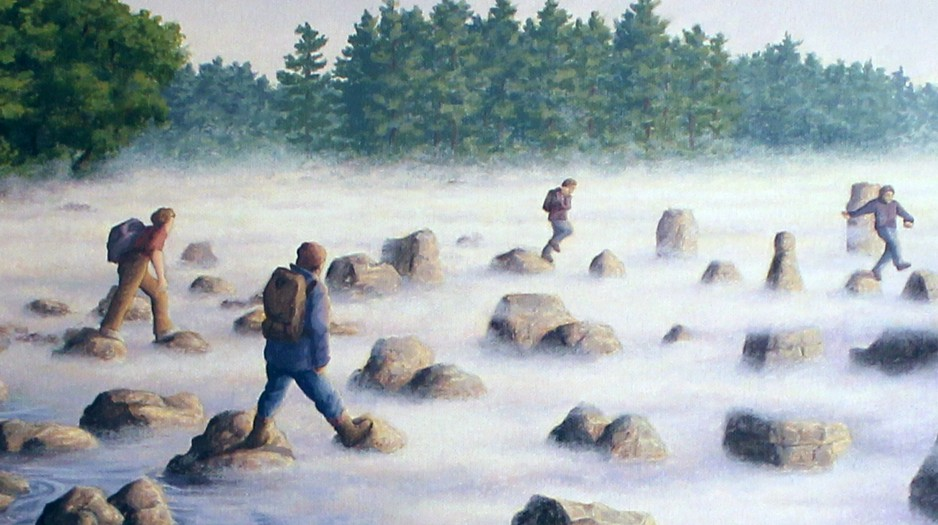
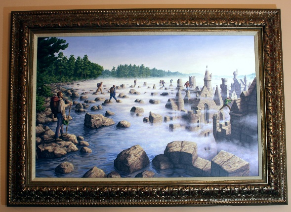

# Не шагай в туман, не надейся на «авось»!

Самая подробная книжка на тему «бесцельного» фланирования против достигательства далёких заранее намеченных целей — Kennet Stanley, Joel Lehman, «Why Greatness Cannot Be Planned: The Myth of the Objective»[^r7-1].

Однократное раннее стратегирование (целеполагание) типа «мечта» объявляется в этой книге цивилизационным пороком. Мечта — это стратегия, рассчитанная на долгий срок её реализации, с отсутствием на момент её создания понимания, какие для предложенной сигнатуры метода существуют понятные варианты разложения метода, ибо эволюция ещё не предоставила набор технологий для разложения стратегии на понятные методы, все экспоненты подрыва ещё не отработали (то есть для концепции использования нет понимания концепции системы: какие физические объекты нужно взять, чтобы из их взаимодействия получить требуемую в использовании функцию). Если вместо сигнатуры метода как стратегии говорить про «цель», то можно сказать, что «цель есть, средства достижения ещё неизвестны или заведомо не могут существовать в обозримый период».

Мечта/утопия получить микроволновку в 19 веке, смартфон во времена изобретения радио, возвращаемую на землю ракету в двадцатом веке. **Утопия — это всегда красиво, романтично, но гибельно.**

Правильная жизнь по версии книжки Stanley и Lehman — это не страстное преследование мечты, не ввязывание в утопический проект длиною в жизнь, а поиск сокровищ (treasure hunt), который может продолжаться вечно. **Реализация мечты, решение проблемы — однократно, оно имеет конец во времени и амбициях. Развитие может быть вечным по времени и бесконечным по амбициям!**

Книжка вводит понятие **шагов бесконечного развития как череды проектов, имеющих разные целевые системы (а не как череды проектов по достижению одной общей цели, «взбираясь на верхушки всё более высоких деревьев, в какой-то момент достанем до Луны»).** Каждый проект — это **ступеньки/stepping stone**. Эти stepping stones — камушки, по которым переходят ручейки или лужи. На русском устойчивого эквивалента нет, но мы будем называть их «ступеньки» (то, на что наступают в каждом очередном шаге) или даже ещё проще — «камушки».

В стратегировании ты видишь варианты стратегий ближайших к тебе проектов, ближайших камушков-ступенек, на которые понятно как перескочить из твоего текущего состояния. И на этой новой ступеньке может оказаться сокровище, выигрыш — удачный бизнес: обнаружится понятная целевая система, которую понятно как можно успеть сделать и удачно продать в обозримое время. Или сокровище там может не оказаться, туман будущего не позволяет это разглядеть наверняка — пошли в проект, а он «не выстрелил». Ну что же, убытки списываем и забываем о них, будем прыгать по камешкам-проектам дальше.

Остальные ступеньки подальше во времени (или даже рядом, но о которых мало что понятно) — в тумане будущего, их вообще не видно, где они, эти стратегии пока даже нельзя сформулировать, эти цели пока даже нельзя поставить, в такие проекты непонятно даже как входить. Метафора подходит и для описания занятий бесконечным развитием какой-то одной системы, где каждая новая фича, каждый вариант архитектуры — это вначале гипотеза, которая может и не оправдаться, и проект в целом выглядит как перескакивание с камушка на камушек, где в любой момент может не хватить денежного потока от клиентов скакать дальше, так и для ситуации с виражами/pivot, когда каждый камешек — это проект по созданию и развитию совсем нового вида целевой системы, совсем новая ситуация.

В книге говорится, что ввязываться в проект, то есть вкладывать ресурсы/инвестировать, можно только для видной тебе ступеньки с понятной стратегией, а не той, которая в тумане. Планировать (говорить, какие ресурсы нужны для каких работ по каким методам) шаг смены проекта можно только тогда, когда видишь, куда шагать, вероятность выигрыша велика.

Когда сделаешь шаг — то дальше планируй делать следующий шаг на ту ступеньку, которая открылась с только что достигнутого. Многоходовые стратегии и многошаговые планы, составленные up-front — не работают, работает только пошаговое «на лету» и стратегирование, и планирование.

Если нет идеи, как реализовать стратегию («придумал скатерть-самобранку, продаваться будет на-ура по цене не выше тысячи долларов за штуку, осталось придумать, как она должна быть устроена, на это у нас целая команда лучших инженеров»), не инвестируй в неё, не ввязывайся.

**Не шагай в туман, не надейся на «авось»!** На каждой ступеньке сокровище или высоковероятно есть, или всё-таки после того, как мы вна эту ступеньку-проект придём, его не обнаружится. Где-то там, через много-много ступенек может быть большое сокровище, другой берег, ты на него придёшь раньше конкурентов и вытопчешь себе и всем твоим сотрудникам огромную полянку. А потом? А потом полянка окажется вытоптана, и ты опять куда-то будешь скакать по камням, заниматься догадками об умных мутациях каких-то систем — дадут ли эти мутации бизнес, или нет (т.е. выгодно ли будет заниматься этими новыми системами).

Вот так это примерно выглядит, это фрагмент картины Rob Gonsalves «Stepping Stones»[^r7-2]. Сама картина примерно это и показывает: камушки-ступеньки, прикрытые туманом будущего. Kennet Stanley и Joel Lehman дают именно такую картинку, в которой другого берега вообще не видно, и непонятно поэтому, на какой камушек прыгать, чтобы добраться туда быстрее. **Задним числом придут историки и биографы, туман будущего для них отсутствует, и всё это путешествие к успеху для немногих прорвавшихся будет описано как очевидный «прорыв к** **успеху», как будто было понятно куда и как прыгать, и нужно было только упорство в прыжках, это «ретроспективное придание смысла»:**

Правда же в том, что полная картина без тумана доступна только потом, когда развеется туман будущего. А прыгать приходится тогда, когда не очень понятно, какой камушек ведёт к другому берегу кратчайшим путём.

**Совет у авторов книги тут один: прыгайте в тот проект, которым ещё никто не занимался** **(новые** **типы систем, новые методы создания), новизна важна.** Как узнать новизну? Мнения экспертов (например, какого-нибудь инвестиционного комитета) разделятся:

* половина будут кричать, что там смерть,
* половина признают, что там успешный успех.

Это означает, что эксперты ничего понять не могут, вы на новой полянке. У вас есть шанс крупного выигрыша. И если вы не будете делать явных ошибок, что-нибудь может выгореть. Или не выгореть. При этом наличие комитета (коллегиальность решения) не позволит вам прыгнуть: если вероятность того, что 10 членов комитета каждый проголосует «за» рисковый проект будет 50%, то вероятность того, что инвестиция будет получена, будет ничтожна (вероятности-то перемножаются!). В ситуациях, когда никто ничего не понимает, коллективное принятие решений голосованием не будет работать, вероятности ведь перемножаются. Комитеты не позволят рискнуть!

А если эксперты и друзья кричат хором, что проект неудачный? Так и есть, вы попали в хорошо известную им область. Будет неудача, не ввязывайтесь. А если эксперты и друзья кричат хором, что это гениальная идея, советуют немедленно идти в этот проект? Это опасно, потому как область знакомая, и если там и впрямь так хорошо, то вы встретите жесточайшую конкуренцию, и вас быстро вышибут более богатые, умные и шустрые (ибо их эксперты и друзья тоже им советуют ввязаться в этот проект). Так что **новизна — ваш шанс (но не более чем шанс!) и потенциальная защита**. В случае успеха, пока богатые и шустрые развернутся и начнут с вами конкурировать, вы и/или ваша компания успеете что-то сделать, что-то заработать в этом проекте и тоже станете богатыми в достаточной мере, чтобы не проигрывать другим богатым из-за отсутствия ресурсов. Скорость и новизна важны.

Из мечтателя в реализации одной далёкой идеи с непонятным приходом сбоку какого-то инженерного решения по концепции системы (изобретения нельзя планировать, а если и планировать, то изобретение может оказаться не вашим, а ваших конкурентов — изобретения главным образом «приходят сбоку», исключения редки) нужно стать **коллекционером проектов** (stepping stone collector) — собирать прохождение ступенек, на которых лежат сокровища/ресурсы/бизнес, и с которых что-то видно дальше (умные мутации, которые могут дать успех бизнесу). Коллекционирование тут как метафора выбрано потому, что оно никогда не заканчивается, это не цель, это условие игры, архистратегия.

Нахождение сокровищ в каждом даже вроде понятном проекте не гарантируется, но шанс всегда есть. Выбирайте проекты на границе тумана — с понятными стратегиями, а не с непонятными, то есть выбирайте проекты, в которых вы знаете, как их реализовать — у вас есть гипотеза о том, какую конструкцию нужно сделать, чтобы получить требуемую функцию, какими методами работать, чтобы это было выгодно.

Скажем, если у вас есть идея сделать скатерть-самобранку, это отличная «мечта»! Не занимайтесь ей, если у вас нет гипотезы, какая конструкция будет у этой скатерти-самобранки и каким методом вы её получите («нанять лучших инженеров — этот метод не сработает). Но если есть идея по поводу конструкции системы и того, как вы будете работать — смело занимайтесь!

Бывает наоборот: у вас понятная идея, как сделать *супер-пупер-генератор-чанста*! Непонятно только, будет ли он хорошо продаваться по той цене, которая даст выгоду при его продажах. Это тоже «мечта», не занимайтесь им, пока не будет понятно, кому и как пригодится эта конструкция: будут ли люди готовы заплатить за её функции больше, чем вы потратите на создание конструкции этого *генератора-чанста*. Помним, что до 2007 года iPhone был невозможным: он был бы слишком дорогим, чтобы проект имел успех. В 2007 году туман будущего рассеялся, как сделать работающий смартфон за вменяемые деньги стало абсолютно понятно (точнее, это стало понятно чуть раньше: разработка iPhone, конечно, началась раньше 2007 года — но не сильно раньше).

Если вы наметите какую-то точку в тумане, где проект не имеет внятной стратегии и пойдёте туда, то вся затея гарантированно провалится, **цели в тумане предают, они призрачно выгодны—** **но в реальности там** **с высокой степенью вероятности пустота. Вас туда могут заманивать тем, что вы и должны сделать из пустоты что-то стоящее—** **идите смело, если у вас на эту тему есть идея. Но если вы хотите всё время чувствовать себя обманутыми, ставьте** **(или принимайте от сладкоречивых других людей) стратегии, которые вам сразу не видно, как** **реализовать— и** **дальше** **упорствуйте, как вас и просят в классической литературе, как вас и учат.** **Поломанная жизнь гарантирована.**

В книжке «Why Greatness Cannot Be Planned: The Myth of the Objective» чётко говорится: живите не «великим достижением», но вечным «поиском». Всю жизнь вы будете развиваться сами, выполнять самые разные проекты, создавать и развивать целевые и создающие системы одна сложней другой — техно-эволюция бесконечна.

Но вы сделали шаг, занялись новым проектом. Граница тумана отодвинулась. Что не было видно при вчерашнем стратегировании, стало видно сегодня — и нужно просто это учесть. И двинуться вперёд с обновлённой стратегией.

Важна не сама текущая стратегия, важно стратегирование как постоянный пересмотр текущей стратегии, чтобы учитывать постоянно меняющийся мир и постоянно меняющегося себя. Стратегия не подразумевает клятвы её придерживаться без изменений много лет или даже месяцев, это рабочий метод. Какое бы описание стратегии вы ни сделали, правильно считать его черновиком. Если что-то по-крупному пошло не так, меняем стратегию, даже не пытаемся продолжать действовать по-прежнему! Стратегия ничто, стратегирование — всё. Более того, многоуровневая (помним о многоуровневом разложении метода!) стратегия ничто, многоуровневое стратегирование — всё!

[^r7-1]: <https://www.amazon.com/Why-Greatness-Cannot-Planned-Objective-ebook/dp/B00X57B4JG/>

[^r7-2]: Original Painting on Canvas, 2001
