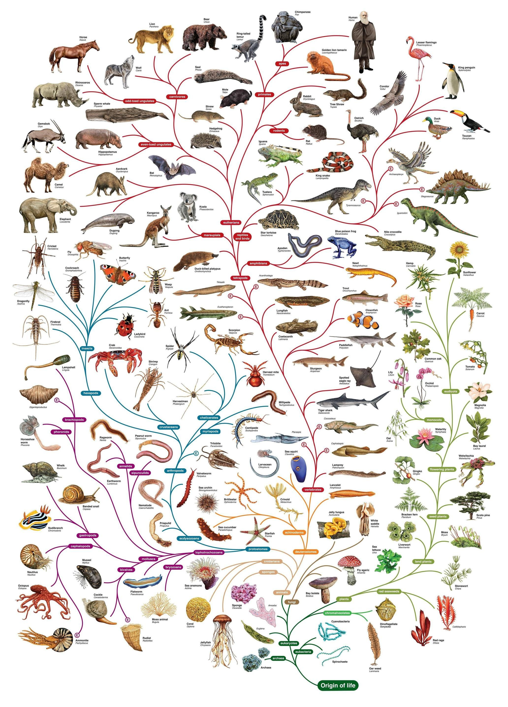
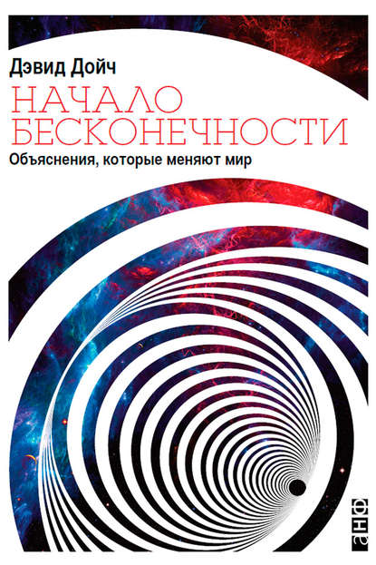
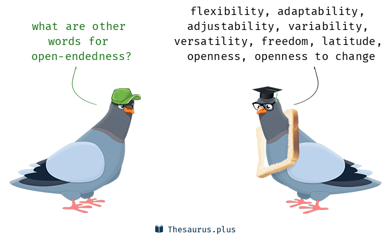

# Бесконечное развитие (open-endedness)

Бесконечное развитие (open-endedness) — это идея, которая позволяет в разы компактней и точнее (т.е. с использованием формальных математических моделей) говорить про сложные вопросы «прогресса», «развития», «целеполагания», «эволюции», «вечного обучения», «постоянной инновации» и т.д. Идея бесконечного развития помогает отбросить бессмысленные споры по вопросам типа «труба ржавеет: можно ли сказать, что она развивается? Что будет прогрессом для трубы?».

Под словами «бесконечное развитие» сегодня скрывается более общий концепт, чем даже дарвиновская биологическая эволюция или техно-эволюция, которые будут тут только частными случаями. Речь идёт об алгоритмах, исполнение которых порождает всё более и более сложные объекты. Это алгоритмы вечно непрекращающегося творчества. Конечно, речь идёт не только об алгоритмах вычислений, но и об алгоритмах физических трансформаций, которые будут использованы универсальными создателями (в том числе для создания каких-то других универсальных создателей).

О чём угодно «лучшем» можно говорить как о «лучшем известном на сегодня», state-of-the-art (SoTA). Завтра лучшее будет другим, SoTA всегда имеет дату. Лучшая теория гравитации в 1600 году не включала силы гравитации, в 1800 году гравитация объяснялась как сила притяжения массивных тел, в 2000 году лучшая теория гравитации (теория относительности) говорит об искривлениях пространства-времени, и гравитация не является силой! SoTA в науке, инженерии и много чём другом меняется со временем, и это будет бесконечно.

Open-endedness переводится обычно как «открытость» или в крайнем случае «незавершённость», и весь аромат английского слова немедленно теряется. Поскольку это применяется к алгоритмам, которые по идее бесконечно (open-ended) научаются делать что-то новое, развиваются, то это мы будем переводить как **бесконечное развитие**. Это «что-то новое» в подобных алгоритмах и называется stepping stone/ступенька, но декларируется, что алгоритм должен быть такой, чтобы порождать новое бесконечно. Этим новым может быть биологический вид в эволюции, вид продукта или сервиса в техно-эволюции, или даже отдельная «фича» в продукте, вид мастерства в эволюции деятельности.

И как растёт видовое разнообразие и сложность организмов в биологической эволюции (напомним физическое обоснование для роста сложности, работу «Physical foundations of biological complexity»[^r7-1]), растёт разнообразие и сложность продуктов и сервисов в технологической эволюции, растёт разнообразие и сложность их функций (задействуемых методов работы) и тем самым разнообразность и сложность мастерства в этих деятельностях. В бизнесе это идея «непрерывного всего» (continuous everything — непрерывная разработка, непрерывное тестирование, непрерывное развёртывание у клиента, непрерывное введение в эксплуатацию).

Люди на Земле владеют всё более и более разными видами мастерства (углубление разделения труда), и эти виды мастерства всё более сложно освоить, для надлежащего уровня какого-то сложного метода с нетривиальным разложением на составляющие и большой вариативностью требуется 4-10 тыс. часов прохождения ступенек в мастерстве от «полный новичок» через «иногда получается» до «настоящий мастер». Компании для выпуска хорошего продукта нужно обучить самым разным видам мастерства иногда одного человека, а иногда и десятки тысяч людей. Развитие целевых систем по факту означает и развитие создающих систем, которые познают/learn новые методы работы по созданию новых и новых версий развиваемых систем и приобретают мастерство в этих новых методах работы. Бесконечность развития целевых систем в ходе бизнес-проектов означает в том числе и бесконечность развития бизнеса, бесконечность прибыльности.

Базовый текст декабря 2017 года «Open-endedness: The last grand challenge you’ve never heard of»[^r7-2] написан в соавторстве с Lisa Soros теми же Kenneth O.Stanley и Joel Lehman, которые в 2015 году написали книжку про важность новизны, «Why Greatness Cannot Be Planned: The Myth of the Objective».

**В соответствии с подходом бесконечного развития, нужно не просто решать проблемы — ибо сложность и** **элегантность/изящество решения при этом ограничены** **сложностью проблемы.** **Для того, чтобы бесконечно поднимать мастерство решения проблем, нужно** **не просто уметь решать проблемы, но и уметь порождать более сложные проблемы. Мало находить методы решения сложных проблем, надо находить методы** **порождения** **более сложных проблем!**

Всё более и более сложные проблемы, которые агенты решают в ходе бесконечного своего развития, должны быть не любые, а находящиеся **в зоне «ближнего развития»** — ни слишком трудные для решения, ни слишком лёгкие (тут в английском используется ещё одно плохо переводящееся слово: **goldilocks**, означающее в том числе «не горячее, и не холодное, а в самый раз»). Бесконечное развитие требует ступенек-проектов, ни слишком близких и очевидных, ни слишком далёких в тумане. Скажем, основная идея концепции системы у вас есть, и моделирование показывает, что эта идея могла бы быть воплощена, но пока непонятно, кто бы мог её реализовать достаточно дёшево — и можно попробовать решить эту проблему, найти создателей.

В январе 2019 года Stanley (он сейчас возглавляет лабораторию искусственного интеллекта в OpenAI) и Lehman сделали один из вариантов алгоритма бесконечного развития, алгоритм POET[^r7-3]. В марте 2020 года этот алгоритм был усилен, получен алгоритм Enhanced POET[^r7-4]. Алгоритм демонстрирует основные идеи бесконечного развития: порождает своей стратегирующей частью всё более и более сложные рельефы местности (даёт параметры генератору рельефов: «ставит цель»), а затем его решающая часть-робот решает эти проблемы, то есть учится проходить заданные частью целеполагания рельефы. Выработка всё новых и новых вариантов универсальной стратегии (в английском — policy) как метода преодоления самых разных препятствий и есть цель работы. Что надо делать, чтобы метод улучшался бесконечно?

Оказалось, что постепенно наученные через «проблемы в зоне ближнего развития» агенты-роботы могут проходить в конечном итоге самые сложные среды, а попытки просто «решить проблему» без этих промежуточных научений, просто «научиться с нуля», без stepping stones/ступенек — проваливаются. **Оказывается, без эволюции, без промежуточных ступенек** **агенты** **не могут** **научиться чему-то сложному! Обучение какой-то деятельности должно быть многоступенчатым, развитие должно проходить через ступеньки, находящиеся на границе тумана — ни слишком трудные (тогда научение невозможно), ни слишком лёгкие (тогда не будет накоплен опыт).**

Скажем, в Tesla была проблема получить корпус автомобиля за один проход пресса. Это на момент формулирования проблемы как приоритетной для решения считалось невозможным, были посланы коммерческие предложения 16 фирмам, которые делали достаточно большие и сложные прессы, чтобы реализовать идею. 15 фирм отказались, одна взялась попробовать. И всё получилось, после чего к этой фирме в очередь выстроились все остальные автомобильные концерны. Почему? До этого корпуса собирались из примерно 40 деталей. А тут ничего не надо собирать — хлоп, и готово. Это очень дёшево, конкуренты не могут себе позволить не делать так же. Но у одной из 16 фирм уже были идеи, как такой пресс сделать, было понимание технической возможности. Это и есть «проблемы из зоны ближнего развития» этой фирмы. Но это были проблемы, недоступные для решения другими фирмами, поэтому «взять и решить» эту проблему не удавалось.

Примерно такая же история была с повторно используемыми ракетами, впервые это удалось сделать фирме SpaceX, но сначала SpaceX научилась просто надёжно запускать одноразовые ракеты. Вряд ли SpaceX удалось бы разработать повторно используемые ракеты «с нуля», без промежуточной ступеньки надёжного запуска одноразовых ракет.

Для алгоритма бесконечного развития (наша вселенная реализует именно такой алгоритм, и рыночная экономика тоже реализует такой алгоритм в техно-эволюции) нужно достаточное время, и мы получим удивительные результаты. Эволюция на Земле получила удивительный результат, ибо она как раз реализует такой алгоритм: условия существования Земли предъявляют всё более и более разнообразные и сложные проблемы развивающимся на ней животным и растительным видам, а эти виды достигают удивительного мастерства и универсальности в решении этих проблем. Интересные моменты тут — это развитие линии быстрого обучения, перехода от биологической эволюции к техно-эволюции: сначала получение биологического интеллекта дарвиновской эволюцией, затем интеллекта человека как вершины этой эволюции, затем развитие письменности как памяти для описаний методов и развитие интеллекта цивилизации в целом в ходе техно-эволюции, а сейчас и получение машинного интеллекта.

Человечество ставит и ставит себе всё более и более сложные проблемы, и научается эти проблемы решать. **Эволюция и техно-эволюция описываются не столько как «появление новых и новых видов», сколько как «решение новых и новых проблем».**

Этот алгоритм реализуется не только всей Землёй вместе со всей её биосферой (дарвиновская эволюция), не только всей цивилизацией со всеми её людьми и их компьютерами (техно-эволюция), но даже в одном мозге (это тоже своего рода эволюция). Автор когда-то задавал вопрос проф. John Grinder (одному из основоположников нейролингвистического программирования), считает ли он перспективными «остановку внутреннего диалога» и прочие средства обеспечения «единства сознания», «недуальности». John Grinder отвечал, что не считает: для развития всегда должно быть некоторое противоборство: порождение новых гипотез и их критика, а хоть и в одном мозге. Единство — это путь к стагнации, а не к развитию/эволюции/прогрессу, как это ни назови. Поэтому даже в одном и том же мозге постановщик проблем должен всё время предлагать проблемы к решению, а решатель проблем должен выдвигать гипотезы, чтобы научиться их преодолевать — и так развиваться до бесконечности. Никакой остановки, никакой стагнации, никакого успокоения при достижении «конечной цели». Каждая новая проблема для решения берётся не «любая», а выбирается или даже сочиняется/разрабатывается так, чтобы каждая новая ступень мастерства решения проблем была сложней предыдущей, цепочка этих ступеней никогда не заканчивается, это и есть бесконечное развитие. В технологиях это и есть «непрерывное всё».

В науке всё то же самое: наука ищет всё более и более точные объяснения того, как устроен мир и это никогда не закончится. SoTA в научных объяснениях постоянно меняется. И эти изменения будут бесконечны. Люди не знали о существовании микробов и вирусов, и поэтому смертность от инфекционных заболеваний (родильная горячка, например, как первое, с чем сталкивались буквально при рождении) была запредельно высока. Затем появились объяснения, которые рассказали о микробах и вирусах и их связи с заболеваниями, на основе этих объяснений были выработаны простые, но контринтуитивные предложения стратегий/методов борьбы с болезнями.

Родильную горячку победило мытьё рук! Этот метод «мойте руки, и не будет родильной горячки» был совсем, совсем неочевиден, пока не было объяснения причин: не рассматривались микробы как причина болезни. А теперь производством моющих средств (и отдельно — антисептиков) занято огромное количество людей, это огромный бизнес.

Но можно ли сказать, что всё уже известно про инфекционные болезни? Конечно, нет! Пример пандемии показывает, что неизвестного ещё много, в том числе неизвестного в том, какими методами избегать известных болезней. Или даже по-другому: неизвестно, что из известного действительно известно и какие методы действительно работают! Может быть, SoTA в знаниях об эпидемиях уже есть, но конкурирующие теории ещё не опровергнуты (или об их опровержении ещё не догадываются, не признают этого, обычное ведь дело в истории!), поэтому текущее SoTA не позволяет выработать хорошие предложения.

Так что защита от эпидемий ограничивается всё тем же мытьём рук и бессмысленными ритуалами типа поливания тротуаров хлоркой (что приносит вред здоровью и честно квалифицируется политиками не как защитная мера, а как «психологический сигнал гражданам о том, что намерения правительства серьёзны»). Наука игнорируется, ибо сама суть науки — это свободное обсуждение теорий для того, чтобы найти в них ошибки, но теории эпидемий обсуждать свободно сегодня нельзя — признанные госчиновниками теории считаются дальше безошибочными.

Например, SoTA в прививках от гриппа и коронавирусов говорит, что ввиду большой изменчивости штаммов прививки для этих классов вирусов оказываются неэффективны, хотя для других могут быть эффективны[^r7-5]. Фармакологические компании, понятно, с этим не согласны. Кто победит в дискуссии, если одной из сторон рты затыкают не учёные своими аргументами и экспериментами, а власти и даже частные СМИ? И ещё в этом участвуют не просто деньги, а очень большие деньги фармацевтического лобби? Увы, рациональное обсуждение этой темы пока невозможно: пыль от пандемии пока не осела, запреты на критику как теорий, так и действий госорганов ещё действуют.

Идея о том, что у природы нет злого умысла, а для избегания неприятных сюрпризов (болезней, ураганов, голода и т.д.) не хватает лишь знаний — это идея **оптимизма**, о ней подробней говорится в первом же разделе руководства по интеллект-стеку.

Двигаясь по этой линии развития методов избегания неприятностей, основанных на всё лучших и лучших объяснениях (включая тем самым и объяснение болезней) можно надеяться на достаточный объем знаний для методов получения людьми биологического бессмертия. А дальше уже понятно, что можно будет менять и саму природу человека, почему бы и нет! Для этого сегодня просто не хватает знаний, а их получение — то же бесконечное развитие, в том числе создание методов получения новых знаний (например, автоматизация науки с задействованием методов искусственного интеллекта и роботов, которая обсуждалась в текущем разделе). Всё это — возможные темы для продуктов, выбираемых визионерами и для бизнесов, выбираемых бизнесменами в ходе стратегирования.

Существование звёзд-квазаров тоже было абсолютно неочевидно, объяснение того, что с ними происходит, было невозможно в рамках ньютоновской физики. Появилась эйнштейновская физика, которая разбирается с искривлениями пространства-времени в присутствии больших масс, и она решила много космологических загадок. Квантовая физика по историческим меркам появилась очень недавно, но она уже объяснила многое из происходящего на другом конце спектра размеров — поведение фотонов управляется её законами. А дальше? Бесконечное развитие: остаётся проблема квантовой гравитации, хотя и к этой проблеме есть уже подходы[^r7-6], тоже нещадно критикуемые — пока какой-то вариант не выживет. Поиск новых научных проблем и последующее их решение, приводящее к постановке новых проблем, будет вечным. Мы исторически находимся в самом начале этого бесконечного развития, наука ещё очень и очень молода, если рассматривать её существование во вселенском масштабе времени.

Книжка оптимиста Дэвида Дойча о бесконечном росте знания, бесконечном росте человечества так и называется «Начало бесконечности. Объяснения, которые меняют мир»[^r7-7].

Эта книжка подробно объясняет, как устроена современная наука. Наука даёт знания, помогающие устранять зло. Вводимое ей понятие рационального (а не слепого!) оптимизма сводится к тому, что «всё зло в мире объясняется недостатком знаний». Если не мешать предлагать новое знание и критиковать и новое, и старое так, что в области знаний SoTA будет постоянно и быстро меняться, можно постепенно преодолевать самое разное зло. При этом будет меняться и понимание зла, и понимание того, каких знаний недостаёт, и понимание того, что такое объяснения. Оптимизм в том, что рост знаний будет делать жизнь лучше, и мы в начале бесконечного роста знаний: оптимизм в том, что почти все неблагоприятные исходы и почти все благоприятные у нас ещё впереди, мы как человечество находимся в самом начале бесконечного роста знаний. Нужно только не мешать этим знаниям расти, для этого поддерживать выдвижение новых и новых универсальных объяснений, получение новой и новой критики этих объяснений.

Мы предлагаем считать эту книгу частью руководства по методологии, которая описывает стратегирование, появление новых идей о том, как решать проблемы.

Неопровергнутые лучшие объяснения на каждый момент составляют SoTA науки, лучшее известное на сегодня научное знание. Оно будет бесконечно расти, давая при этом бесконечное число способов бороться со злом: смертью, болезнями, несправедливостью, глупостью и всем остальным, что только можно представить плохого. Люди (и их организации) готовы заплатить за системы и сервисы, реализующие это знание.

Лучшее на сегодняшний день понимание и науки (получение всё более и более точных и универсальных объяснений, порождающих/generative моделей мира), и инженерии (создание и бесконечное развитие целевых систем) и менеджмента (в части бизнеса как вложение ресурсов в проекты создания и развития систем создания) основано на двух идеях, подробнее разбираемых в руководстве по интеллект-стеку:

* Эволюционной эпистемологии (научное, инженерное, менеджерское и т.д. знание/episteme развивается в ходе бесконечной/open-endedness эволюции и техно-эволюции, непрерывного выдвижения новых идей).
* Критического рационализма (имеющееся знание критикуется на основе принципов рационального, то есть основанного на логике, следующего каким-то правилам, а не произвольного рассуждения, и эти рассуждения проверяются ещё и экспериментами в физическом мире, а не только мыслительными экспериментами). И помним, что речь идёт не только о «мышлении», но и действии, мышление деятельно, рационализм тем самым подразумевает действия, в него входит в том числе и теория решений.

**Пользуемся тем знанием о мире, о целевых системах (продуктах), об агентах-создателях** **(людях, системах** **AI,** **их коллективах), которое лучше другого знания прошло критику логическую и экспериментальную/«проверку жизнью»: оно рационально. Принимаем это знание всерьёз, то есть кладём в основу тех методов, по которым мы собираемся работать. Но поскольку время от времени выдвигаются новые идеи, которые трудней критиковать, чем предыдущие идеи, переходим к использованию** **нового знания. Старое забываем, принимаем всерьёз уже новое знание, основываем свои стратегии** **дальше** **на новом знании—** **и так меняем свои знания, то есть учимся/познаём до бесконечности.**

Бесконечное развитие (open-endedness), «непрерывное всё» и свобода выдвижения гипотез и их критики пронизывают всю жизнь, происходят на всех системных уровнях — и в науке, и в искусстве, и в инженерии, и в бизнесе/менеджменте, и в создании сообществ, и в политике.

Выдвижение визионерских и бизнес-гипотез (для себя лично, или для небольшого стартапа, или даже для большой транснациональной корпорации) не особо отличается от выдвижения научных гипотез. И проверяется похожим способом: часть этих гипотез можно отвергнуть простой проверкой их логики, а часть приходится проверять ещё и экспериментально. И ещё все эти гипотезы приходится согласовывать между собой. Методы многоуровневы, их задействование требует обширных знаний — и лучше бы эти знания были согласованы между собой, чтобы давать надёжное предсказание, и основанные на этих знаниях методы имели шанс достигать ожидаемого результата.

Детёныши млекопитающих сами ставят себе цепочку усложняющихся проблем, сами их решают в ходе своего обучения — это игры. В этих играх они учатся двигаться, учатся добывать пищу. По факту они тестируют, насколько сильно их влияние на окружение, где это ещё «они двигают собой», а где это уже «окружение двигает их». Иногда детёнышам помогают взрослые особи, но это происходит отнюдь не всегда. Дальше детёныши вырастают, и просто имеют какой-то уровень мастерства (знания и тренированное под специфические нагрузки тело и под специфическое внимание органы восприятия окружения и своего тела), уж какой позволяет их биологическая природа. Бесконечного развития не происходит, они перестают играть, они научились — и просто живут. Мастер-гепард умеет бегать, мастер-попугай умеет кого-то передразнить. И это на всю жизнь.

У людей и их организаций ситуация другая: детёныши людей и молодые стартапы тоже играют, в ходе игры находят себе проблемы сами — и сами научаются эти проблемы решать. Но значительную часть проблем ставят перед детьми взрослые, а для стартапов акселераторы, серийные предприниматели, менторы. Так, для детей взрослые предлагают некоторый обязательный (обязательное школьное образование! И даже вузовское образование такое же) учебный план/curriculum. А потом эти поставленные кем-то учебные проблемы заканчиваются — и развитие опять переходит к бывшему ученику. Школьные и вузовские «проблемы» — это больше не проблемы, а «задачи», но жизнь ведь будет подкидывать не эти задачи с выученными способами их решения, а новые проблемы. Дальше всё зависит от выпускника школы или вуза: «взрослые» из образовательных учреждений могут сказать о мире не больше, чем бывший ученик и сам уже знает.

Освоение новых видов мастерства этот бывший ученик себе может не запланировать, и его текущие знания и умения тогда быстро устареют, он рискует остаться на обочине жизни (всегда помним, что не нужно волноваться: котят и морских свинок кормят повсеместно, а уж человеку точно не дадут от голода помереть, если тот будет достаточно ласков с другими людьми. А вот компании дадут умереть, это ж не люди!). В другом варианте стратегом выступит начальник: на работе сотруднику будут ставить проблемы из ближней зоны развития, и развитие случится. Если же на работе будут одни и те же однотипные задачи, а не проблемы (**проблемы** — это когда неизвестен метод решения, для **задач** метод известен, надо просто выполнить работу по методу, **интеллект** превращает проблемы в задачи) — развития не будет. Ещё возможно, что человек после первичного обучения возьмёт ответственность за собственное развитие на себя — сам будет ставить перед собой всё более и более сложные и разнообразные проблемы, а потом учиться их решать. И так всю жизнь, а если это компания, то более сложные и разнообразные проблемы будет ставить перед компанией менеджмент этой компании, причём всё время существования компании, а не только в момент её создания.

Никого не волнует, научились ли вы решать какие-то проблемы сами, или вас кто-то научил. Волнует, что вы эти проблемы решать умеете. И помним, что «научить с нуля» делать что-то сложное невозможно, обязательно нужен опыт решения более лёгких проблем, чтобы приступать к более сложным проблемам. Развитие идёт по ступенькам, и перескочить через много ступенек одним учебным усилием невозможно. Поэтому **не расслабляйтесь: берите стратегирование на себя, всегда имейте достойную проблему для решения, достойный проект — не слишком лёгкий, но и не невозможный. Имейте всегда цель на границе тумана, двигайтесь за горизонт.**

[^r7-1]: <https://www.pnas.org/doi/10.1073/pnas.1807890115>

[^r7-2]: <https://www.oreilly.com/ideas/open-endedness-the-last-grand-challenge-youve-never-heard-of>

[^r7-3]: <https://eng.uber.com/poet-open-ended-deep-learning/>

[^r7-4]: <https://eng.uber.com/enhanced-poet-machine-learning/>

[^r7-5]: Уже через три месяца эффективность аденовирусной вакцины AstraZeneca становилась жестко отрицательной (т.е. привитые начинали попадать в больницу и умирать от ковида чаще, чем непривитые), <https://academic.oup.com/ije/advance-article/doi/10.1093/ije/dyac199/6770060>. И таких работ всё больше и больше.

[^r7-6]: <https://www.sciencedirect.com/science/article/pii/S0927650524001130?via%3Dihub>

[^r7-7]: <https://www.litres.ru/devid-doych/nachalo-beskonechnosti-obyasneniya-kotorye-menyaut-mir/chitat-onlayn/>
