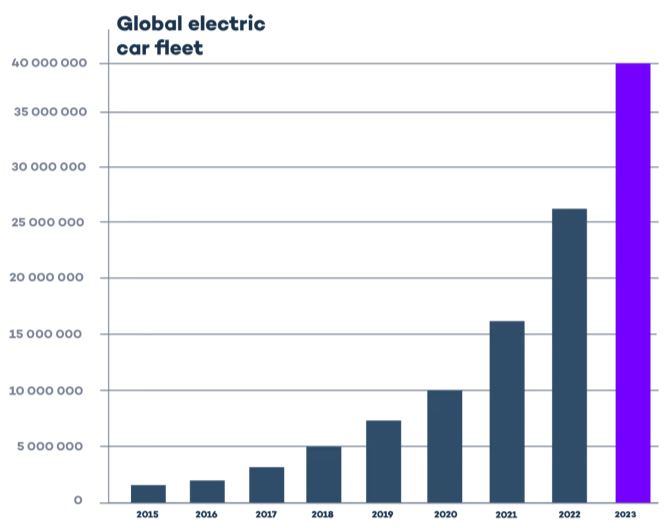
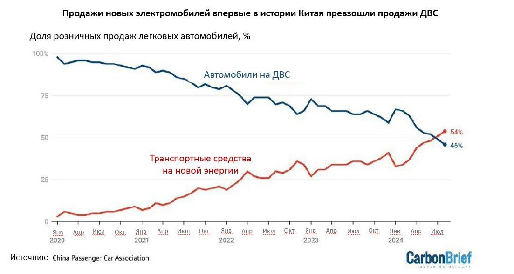
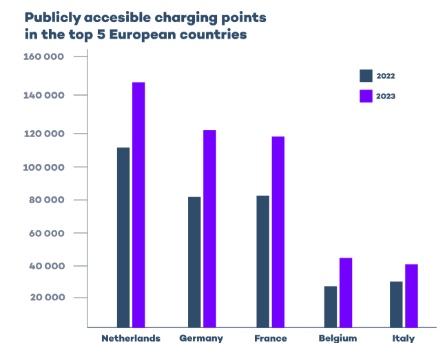

# Пример подрыва: электромобили уже сейчас дешевле бензиновых автомобилей и их продаётся больше

В своих презентациях (например, по транспорту 22 апреля 2020 года[^r7-1]) Tony Seba рассказывает, что по итогам «чистого подрыва» с 2025 года все новые автомобили будут электрическими, и (с учётом задержек из-за пандемийных и деглобализационных ограничений) этот прогноз выглядит как до сих пор актуальный. Вот график роста числа электромобилей[^r7-2], там хорошо видна экспонента, а в 2024 году ожидается, что 20% проданных автомобилей будут уже электромобилями:

Уже сегодня несколько китайских производителей имеют электромобили со стоимостью до $30тыс. при батарее с дальностью поездки от 300 километров. В 2021 году стоимость бензинового и электрического автомобилей из расчёта жизненного цикла на километр пробега сравнялись. Переход на электромобили стал чисто экономическим решением, например в расчёте на три года владения автомобилем и 12 тыс. миль пробега ежегодно в UK нужно платить за электромобиль 67 пенсов за милю, а за бензиновый автомобиль 74 пенса за милю, это уже сегодня[^r7-3]. Скоро разница будет настолько ощутима, что бензиновые автомобили просто перестанут покупать даже «по привычке» (при этом учитываем, что затраты на разные виды автомобилей никто не считает! Смотрят на совсем другие факторы, но эти факторы учитываются в конечном итоге в цене).

Ещё одна технология — это технология «беспилотности», которая обеспечивается компьютерным инструментарием: нужны дешёвые энергоэффективные суперкомпьютеры, которые могут быть размещены в автомобиле. Тут тоже экспонента: NVIDIA выпустила автомобильные компьютеры Orin в 2021 году, а в 2024 году новые автомобили (например, Volvo Cars EX90 SUV)[^r7-4] комплектуются компьютерами Thor, которые вчетверо более производительные, чем Orin, и всемеро более энергоэффективные.

А дальше будут нелинейные эффекты от сочетания быстро проходящих свои стадии развития технологий: обычный легковой автомобиль 96% времени простаивает, и только 4% времени находится в движении. Автономный электромобиль, предоставляемый как сервис по вызову такси, будет в работе весь день. Иметь собственный автомобиль станет невыгодным. Стоимость поездки резко упадёт, и можно будет покупать абонемент на поездки за цену существенно меньшую, чем стоимость обслуживания и страховки собственного автомобиля. Это уже происходит с сервисами car sharing (аренда автомобиля на одну поездку, при этом ты сам его ведёшь) в крупных городах. Дело тут не в правительственных субсидиях на электромобили, вопрос чисто экономический, субсидии могут только двигать момент выгодности покупки электромобиля или покупки сервиса электророботакси на год-другой, эти субсидии представляют только маленькую часть цены.

Меньше автомобилей обслужат больше жителей, и они не будут долго стоять. 80% парковочного места освободятся. Электромобили экономичны, и нефти для автотранспорта потребуется меньше, цена нефти резко упадёт, этому помогает ещё и солнечная энергетика плюс наличие дешёвых аккумуляторных батарей (а дешевизна аккумуляторов объясняется в том числе и тем, что они нужны прежде всего для электромобилей, но их с удовольствием используют и для солнечных и ветровых электростанций).

Там будет и много других чудесных следствий — но тут главное в скорости, с какой изменится мир уже в ближайшее время. Точка перегиба S-образной кривой автономного электротранспорта на быстрый взлёт уже была — это 2021 год, до этого момента изменения были практически незаметны, а после — неизбежно стремительны, и всяческие «энергокризисы» этому будут только способствовать.

Новость 2024 года: в Китае (самый конкурентный и большой рынок автомобилей в мире) продано в июле больше электромобилей (51.1%), чем автомобилей с двигателем внутреннего сгорания — при этом продажи электромобилей (NEV, new energy vehicles — чистые электромобили и гибриды, заряжаемые от сети) выросли на 28.6% за год[^r7-5].

Но это Китай, а вот что в Европе: в Норвегии NEV заняли 91.5% рынка, при этом только чисто аккумуляторные (а не гибриды) машины заняли почти 90% от всех NEV[^r7-6]. Подчеркнём, что гибриды вы тоже можете зарядить на электрозаправке — и поехать.

Похоже, что к 2030 году автомобили с бензиновым двигателем будут как гужевой транспорт в 1930 году. Для этого не хватает только инфраструктуры «электрозаправок», но она появляется очень быстро, у всех ведущих автопроизводителей есть планы на этот счёт[^r7-7]:

Переход на электромобили — это не единственный тренд, который изменит городской транспорт. Удалённая работа больше не считается чем-то неправильным (и дело тут даже не в экспериментах на живых людях, которые провели правительства всех стран в 2020 году, пандемия ковида просто немного ускорила ход событий в этой сфере). Сервисы доставки продемонстрировали, что они реально экономят время на походы в магазины, доставка до двери уже через пять лет вряд ли будет делаться людьми (уже сейчас роботы-доставщики Яндекса заметны в Москве, и даже голосом просят прохожих нажать кнопку на светофоре, чтобы перейти дорогу — сами пока они эту кнопку нажать не могут, но это же только самое начало тренда). Конечно, возврат людей в «оффлайн» на рабочие места и магазины после пандемии произошёл, но это не стало возвратом к старому «доковидному» состоянию.

Электросамокаты и электровелосипеды стали массовыми буквально за пять лет, они порождение того же тренда на экспоненциальное уменьшение цены аккумуляторов, а прокат их растёт в связи с доступностью безналичных расчётов через смартфоны.

Мир неузнаваемо изменится за ближайшие даже не десять, а пять лет, и продолжит меняться так же быстро и дальше. Бояться этого не нужно, нужно радоваться. Человечество за это время станет:

* более здорово
* более сыто
* более недовольно происходящим, ибо кто был никем, тот станет всем, и наоборот.

Вывод: менять работу и образ жизни придётся практически всем, а то и по нескольку раз за десяток лет. Это относится и к людям, и к организациям. Учитывать это надо и в личном стратегировании, и в организационном.

[^r7-1]: <https://www.youtube.com/watch?v=O-kbzfWzvSI>

[^r7-2]: <https://www.virta.global/global-electric-vehicle-market>

[^r7-3]: <https://www.buyacar.co.uk/cars/economical-cars/electric-cars/650/cost-of-running-an-electric-car>

[^r7-4]: <https://blogs.nvidia.com/blog/volvo-cars-accelerated-computing-ai/>

[^r7-5]: <https://technode.com/2024/08/09/evs-overtake-monthly-gasoline-car-sales-for-first-time-in-china/>

[^r7-6]: <https://alternative-fuels-observatory.ec.europa.eu/general-information/news/norwegian-ev-market-surges-915-market-share-setting-sustainable-example>

[^r7-7]: <https://www.virta.global/global-electric-vehicle-market>
