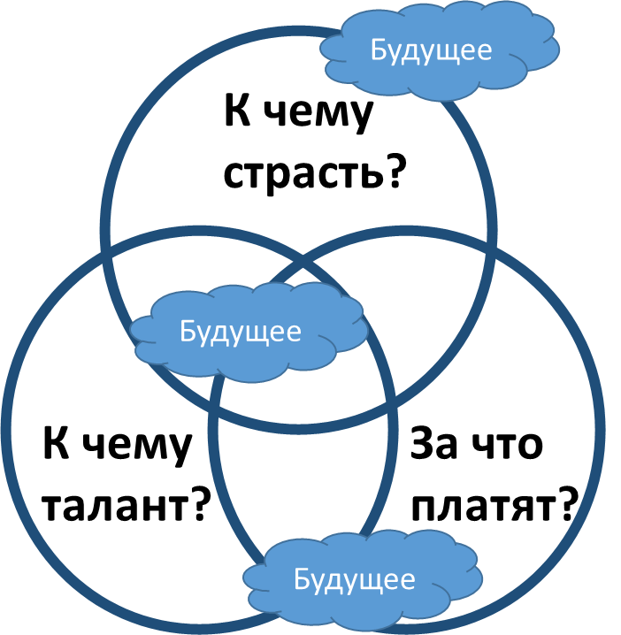

# Архистратегии ежа и лисы

Корпоративное стратегирование (оргстратегирование) по большому счёту идентично личному, разница только в том, что пока сервис-ориентация (подробней об этом было в «Системном мышлении») не победила окончательно, компании могут ориентироваться на выпуск систем-продуктов, а личность всё-таки ориентируется на приложение своего мастерства как оказание сервиса. Помним при этом, что сервис — это синоним метода создателя-провайдера, только применяемого для изменения состояния внешних предметов метода, в том числе внешних систем (но могут быть и варианты, например, предметом метода может быть описание системы, но мысль провайдера в этом случае всё равно должна дотягиваться до физического мира и интересоваться тем, как будет использовано описание для изменения состояния каких-то систем).

Джим Коллинз в материалах своего сайта[^r7-1] для книжки по корпоративной стратегии «От хорошего к великому»[^r7-2] (2001 год) предложил вариант нахождения своего «призвания» (иногда сегодня это называют японским словом «икигай»[^r7-3] — то, для чего вы просыпаетесь утром и вытаскиваете себя из постели).

При этом он неявно исходил из того, что в своей книжке назвал архистратегией (архистратегия — общий тип стратегии) ежа. Ёж использует один и тот же метод реагирования на неизвестную ему ситуацию: чуть что, он сворачивается в клубочек и выставляет миру свои иголки. Одно и то же действие в ответ на любое изменение вовне — каждый раз. И это ежа почти каждый раз спасает, стратегия оказывается эффективна.

Поэтому Коллинз предлагает в личном стратегировании найти эту стратегию ежа, найти своё главное преимущество, главное дело жизни. И дальше развивать это преимущество, сделать это своей профессией. В бизнесе это примерно соответствовало очень модному в 20 веке SWOT (Strengths, Weaknesses, Opportunities, and Threats)-анализу[^r7-4].

В личном стратегировании Коллинз предлагал написать на трех разных листах бумаги списки деятельностей, которые а) вы делаете страстно, б) которые вы делаете лучше всех, в) за которые вы могли бы получать оплату.

После чего вам надо отдать эти листки вашим друзьям, чтобы не вы, а они обобщили то, что объединяет эти списки. Этим общим (тем, к чему у вас страсть, к чему есть талант, и за что платят) и занимайтесь, это и есть ваш личный икигай. Друзьям отдать списки надо, ибо у вас самих «глаз замылен», вы можете не заметить общее между пунктами в этих списках. Сегодня можно было бы отдать такие списки AI-ассистенту (заодно заметим, что ещё не каждый найдёт три листа бумаги для того, чтобы сделать эти списки по методу, предложенному Коллинзом всего четверть века назад).

**Мы** **живём даже не во время перемен, а во время перемен перемен (меняется уже способ, которым проходят сами перемены), стратегия ежа сегодня перестала срабатывать! Коллинза критикуют, его теории стратегирования** **и** **для компаний, и для людей** **оказались не работающими!**

Почему его способ не срабатывает даже для личного стратегирования? Все пункты в трёх списках закрываются туманом будущего. Меняется то, к чему у нас страсть (мы ещё не знаем, от чего будем без ума через пару месяцев, оно просто ещё не открыто, а к чему страсть была, к тому мы охладеваем — надоедает!), меняется то, к чему талант (мы тоже можем не знать об этой деятельности, но завтра выяснится, что у нас к ней талант!), а уж за что платят — так это и так очевидно, что существенно меняется каждые несколько лет.

Всё покрыто облачками тумана будущего, и поэтому приходится прибегать к другой архистратегии — архистратегии лисы. Лиса (недаром она считается «хитрой») каждый раз делает что-то новое при встрече с проблемой (которую пока неизвестно, как превратить в задачу, решаемую известным методом): то хвостом помашет, то засаду устроит, то тявкать начнёт, то побежит со всех ног, и всё это в зависимости от обстоятельств.

Лиса тоже добивается успеха во многих случаях, но в совсем новых обстоятельствах у неё появляется шанс угадать подходящее действие — этого шанса уже нет у ежа, он новое угадать не может, он гарантированно проиграет. Преимущество ежа пропадает, если изменения происходят быстро и изменения различны по своей природе. Какой выход? Просто **выполняйте практику, предложенную Коллинзом, регулярно! Это не «определение вашего призвания в жизни». Это определение интересного, выгодного и посильного дела «на сейчас».** **Стратегия лисы—** **это просто «ситуативная стратегия ежа», которая выполняется не один раз, а ритмично, регулярно. Стратегия—** **это ничто, стратегирование—** **всё, каждый раз вы заканчиваете очередной такт стратегирования новой стратегией.**

Все эти рассуждения идентичны для личного, командного (внутри крупной компании), корпоративного стратегирования.

Туман будущего не позволяет поставить какую-то долгосрочную цель, не позволяет долго использовать единожды выбранную **стратегию ежа: быть меднолобым упёртым фанатиком, делающим одно и то же независимо от стремительно меняющихся обстоятельств.** Если цель хорошо видна (то есть у вас есть концепция целевой системы, изобретение сделано, осталось только немного доработать идею до реализации), то она уже не в далёком будущем и поэтому не может считаться «мечтой». У вас будет просто рабочий проект, очередной шаг в жизни. **Не романтично,** **ибо без «мечты»,** **но** **зато** **работает!**

Что же делать? Разве не стыдно не быть романтиком (хоть человеку, хоть компании — рассуждения тут похожи), не иметь какой-то очень далёкой и плохо сформулированной в далёком детстве цели существования?! Ежу-человеку или ежу-компании легче рассказывать о себе, ему не нужно думать: у него стратегический день сурка. Как жить, когда тебя с детства учат, что в плане мечты ты должен устроить себе этот день сурка, но обстоятельства жизни меняются с такой скоростью, что невозможность многолетнего преследования одной цели в резко изменяющихся обстоятельствах становится очевидной? «Если не можешь бежать в направлении цели, не можешь идти, то хотя бы лежи в направлении цели» — это враньё, поэтический язык, манипулирование.

**Что делать с этой романтикой, с этой утопией вечной мечты, к которой тебя приучают с детства, но которая очевидно не работает — ибо реализуешь давнюю мечту не ты, и не твоя компания, а те, кто придут в эту мечту сбоку, из совсем других предметных областей?** **Ничего не делать, просто постоянно стратегировать: вовремя менять мечту. Новые обстоятельства—** **новая мечта, только и всего.**

Интересно, что есть метод **ретроспективного придания смысла**, суть которого — замаскировать стратегию лисы под стратегию ежа, выдать более-менее случайный успех за тщательно спланированную удачу, результат выполнения какой-то долгосрочной стратегии. Про придание смысла довольно часто говорят в организационном развитии, ибо людям трудно признать, что большинство наблюдаемых событий являются не результатом реализации чьих-то стратегий и выполнения тщательно составленных планов, а результатом эволюции, одновременно реализующихся в условиях жёсткой конкуренции за ресурсы самых разных методов. Какие из них приведут к удаче обычно трудно предположить, но если не игнорировать эту удачу, то можно попробовать «придать смысл» задним числом, ретроспективно. Особенно этим славилась фирма IBM, которая в конце 20 века ставила довольно много разных экспериментов в части продукта, но во всех пресс-релизах по поводу выпуска удачных продуктов она писала, что «данный продукт стал итогом реализации дерзких стратегических планов наших учёных и инженеров», дальше выдавалась какая-то последовательность событий, в которой и впрямь можно было углядеть, что это были логичные шаги. Другое дело, что эти цепочки событий, которые и впрямь случались, не были запланированными, их не было предусмотрено в стратегиях. Поэтому не путайте стратегии, которые вы только что выбрали из многочисленного числа кандидатов и будете реализовывать (гипотезы о том, что метод сработает) и стратегии, полученные как «ретроспективное придание смысла» как попытку выдать какие-то результаты как мудрость стратегов, которые их предусмотрели.

Если вам в жизни что-то удалось, то довольно легко описать этот успех и сказать, что «я с детства об этом мечтал» — тогда все ваши проекты будут выглядеть как тщательная подготовка к успеху, долгий и трудный путь к успеху, результат собранности на реализации мечты. Не путайте «ретроспективное придание смысла» и стратегирование.

[^r7-1]: <https://www.jimcollins.com/concepts/the-hedgehog-concept.html>

[^r7-2]: <https://www.amazon.com/От-хорошего-великому-компании-совершают-прорыв-ebook/dp/B06XP1H8LQ/>

[^r7-3]: <https://ru.wikipedia.org/wiki/Икигаи>

[^r7-4]: <https://en.wikipedia.org/wiki/SWOT_analysis> и там приведено ещё несколько аналогичных методов в разделе ограничений и альтернатив.
