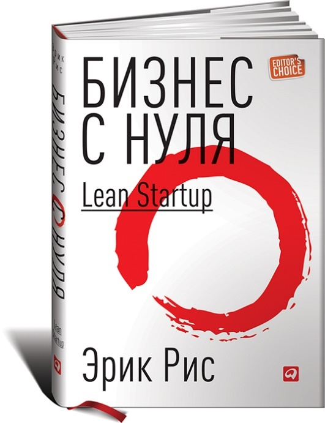
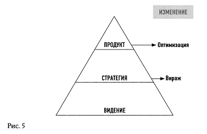
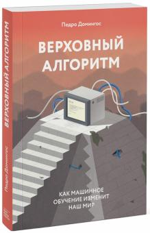

# В конкуренции побеждает самый быстроменяющийся

**В конкуренции побеждает не самый дешёвый, самый лучший и т.д. Побеждает самый быстроменяющийся: нужно выдержать много раундов** **изменений** **и в продукте или сервисе, и даже изменений вида продукта и сервиса.** **Выбор ступеньки — шаг** **на неё, выбор** **следующей** **ступеньки — шаг** **на неё, и чем быстрее, тем лучше, чем больше ступенек попробуете, тем больше вероятность, что сработает «штанга» Талеба.**

Много-много раундов, которые не слишком удачны, и которые хорошо бы проходить как можно быстрее. И в какой-то момент следующая ступенька оказывается фантастически удачной, а конкурентам до неё быстро не добраться: вы успели измениться, успели заняться новым делом быстрее, чем они. **Побеждает скорость, это универсальное конкурентное преимущество. Вы можете выйти в гонку вторым (идея может быть вами подсмотрена — куда прыгать в тумане узнаете по тому, куда прыгают соседи), но если вы двигаетесь быстро,** **то** **победите, станете** **в этом типе проектов первым.**

Но и тут задержаться не придётся: нужно бежать со всех ног, чтобы только-только остаться на месте. Стратегировать надо не раз в год, даже не раз в полгода, стратегировать надо постоянно.

**Вираж (коренное изменение стратегии, замена сигнатуры метода—** **полная смена продукта или сервиса) — это просто часть стратегирования как постоянной деятельности.«Целеустремлённость» как приверженность стремительно устаревающей стратегии — это синоним меднолобости, путь к провалу.** **А поскольку методы имеют многоуровневое разложение, то стратегирование может быть многоуровневым, виражи могут быть на каких-то достаточно глубоких уровнях разложения инженерного процесса большого проекта, а также многоуровневой может быть и «целеустремлённость». Имейте решимость делать вираж на любом из уровней, включая самый высокий: стратегию (метод работы) проекта в целом.**

Фокус тут в том, что вы не знаете, какой сорт успеха вас может ожидать в новом проекте. Цели «добыть то-то и то-то», «победить вон того босса» у вас нет. Речь тут идёт об участии в техно-эволюции (книжка написана исследователями эволюции, занимающимися машинным интеллектом), а у эволюции содержательной цели нет, если не считать реализацию физического принципа минимума свободной энергии путём попыток найти всё более и более усложняющиеся конструкции систем самых разных системных уровней, появляющиеся в ходе этой вселенской (в буквальном смысле слова) оптимизации. Каждое техническое (по целевой системе) и бизнес (по системе создания) решение будет квазиоптимальным, у конкурентов будут абсолютно другие решения, но тоже не слишком оптимальные — близкие к вашим.

Время от времени будут происходить большие эволюционные переходы (major evolutionary transitions), когда вы или конкуренты будете находить решения, приводящие к уменьшению конфликтов между системами разных системных уровней, неустроенности/frustrations будут меньше. Эволюция будет находить всё более и более сложные и универсальные (хорошо адаптирующиеся к самым разным ситуациям) формы систем, отражающие всё больше и больше аспектов мира и позволяющие системам и создающим их бизнесам выживать во всё большем и большем разнообразии ситуаций. Это будет происходить и в том числе за счёт конвергенции (множество разных технологий, задействованных в одной системе), примерно так же, как конвергенция огромного числа химических реакций даёт в итоге одноклеточную, а затем и многоклеточную жизнь.

Если у вас есть мечта, и понятно, как её достичь — смело выполняйте проект по её достижению. Если непонятно, меняйте мечту. Мечта не обязана быть на всю жизнь. Меняйте мечту хоть каждый день, меняйте концепцию романтической утопии на концепцию бесконечного развития. **Мечту вполне можно иметь. На мечте просто нельзя застревать.**

Идея о том, что можно перед выполнением проекта сначала поставить цель, затем составить план по её достижению, потом получить деньги, затем выполнить проект строго по плану и достичь тем самым успеха в виде достигнутой цели — вредная, утопичность её уже давно очевидна, мы разбирали её во втором и третьем разделах нашего руководства. В инженерии и менеджменте против такой идеи выступило движение agile, где сама постановка цели как концепции системы выглядела как непрерывно уточняющаяся, равно как признавалось, что нельзя точно спланировать достижение этой непрерывно меняющейся цели (нельзя точно и однозначно навсегда указать концепцию системы, определить архитектурные решения, ибо концепция использования меняется по ходу проекта). Но в agile-движении поначалу тоже была заложена просто идея «уточнения постановки цели по ходу проекта», но не идея «непрерывного всего», включая смену целей проекта. Поначалу agile-движение выглядело как итеративный способ достичь конца проекта (однократного прохождения жизненного цикла), но не как вечное удержание системы и развивающего её бизнеса на плаву инкрементальными изменениями, которые сначала задумываются как гипотезы по улучшению продукта, а затем требуют подтверждения жизнью.

«Lean Startup»[^r7-1] (2011), написанная Eric Ries книжка по современному бизнесу, которую изучают практически во всех бизнес-школах, рассказывает ту же идею: **непрерывно экспериментируй с продуктом, фланируй, а если всё-таки «не взлетает», то делай крутой вираж/pivot, т.е. пробуй совсем другой продукт. И продолжай эксперименты, пока к тебе не повернётся лицом удача — не упирайся, не долбись в одну точку, не ставь все средства на заведомо неверную идею, получай знания на каждом шаге, в каждом эксперименте. Учись, учись, учись — ищи, ищи, ищи. Бесконечно в цикле новых возможностей (цикл! Нет надежды на одну попытку!) развивай свой продукт или сервис, бесконечно в цикле продуктов развивай свою компанию.**

«Стартапом» в этой книжке называют какое угодно оргзвено, ибо в любой момент оказывается, что оргзвено/организация начинает новое дело — в непрерывном стратегировании ты всё время в ситуации, когда только-только выкинул старую стратегию, и начинаешь новое дело (а старые дела приносишь в жертву, они уже не соответствуют новой стратегии). Это у Эрика Риса и группа из пяти-шести человек, которая только-только образовала новое предприятие, и команда нового проекта на пару сотен человек, который стартует в большом предприятии, и даже большой холдинг, который меняет профиль своей деятельности. Основной посыл книги: **нет надежды на одну попытку, одну версию выигрышной стратегии и её плановую реализацию с успехом в конце проекта.**

В книге описано, что крутятся два цикла: совершенствования продукта (новые и новые фичи, эволюция продукта) и резкой смены продукта (вираж/pivot, организация при этом претерпевает существенные изменения, научается делать новый продукт — ибо старый продукт оказался бесперспективным).

А вот «видение» (у Эрика Риса это примерное понимание, чем занимается предприятие — блины печёт или ракеты в космос запускает, близко к пониманию стратегии как чисто сигнатуры метода) остаётся более-менее стабильным. Сейчас есть множество примеров, показывающих, что и этот «общий тип продукта» тоже существенно меняется. Фирма Tesla вроде как занимается электромобилями, и была создана для этого, но по факту выпускает и аккумуляторы для энергосети PowerWall[^r7-2], и довольно активно готовится продавать человекоподобного робота Optimus[^r7-3].

Принципы стратегирования, которые предлагает Eric Ries в своей книге:

* Тестируй твои предположения (имей численные оценки)
* Фокусируйся на том, чего хочет клиент
* Уменьшай время цикла (но их там два!)
* Меньше документируй, больше делай (прямая отсылка к agile-манифесту, легко её понять неправильно как «вообще не документируй», но моделирование оказывается более чем важным)
* Правильные действия в правильные моменты (это так Рис говорит о lean/элегантности ведения работ организацией/стартапом как недопустимости потерь на ненужную работу/waste/muda/rework + «удавливание» многозадачности, об этом уже говорилось в руководстве по рациональной работе и будет ещё говориться в руководстве по системному менеджменту в разделе, рассказывающем об операционном менеджменте).

После того, как вся эта «целеустремлённость, несдавательность» и «благородная на всю жизнь мечтательность» в вашей голове будет проблематизирована, вы не только избавитесь от предрассудков и чувства собственной неполноценности, но и станете выделять паттерны бесконечного развития в разных других школах мысли.

Так, «недеяние» (у-вэй[^r7-4]) из восточных философий — оно оказывается про то же, про непостановку длинных целей. Вроде как «неделание», оно оказывается на поверку жутко деятельным, оно очень активно следует цепочкой дел за сиюминутной (привязанной к текущему знанию) интуицией о том, к чему нужно стремиться вот прямо сейчас. Прямо сейчас в каждый момент времени, но не всю жизнь. Нет долгосрочных установок на достижение какой-то мечты, в этом и есть плохо понимаемый западным умом секрет «деятельного недеяния».

Но «западный научный ум» никак нельзя недооценивать. По мере активно ведущихся компьютерных экспериментов с эволюцией и обучением, растёт понимание ситуации переоценки долгосрочного планирования.

Ещё одна книжка, в которой техно-эволюции в постоянном развитии методов посвящён довольно большой кусок, написана Pedro Domingos, исследователем машинного интеллекта — «The Master Algorithm: How the Quest for the Ultimate Learning Machine Will Remake Our World» (2015)[^r7-5].

Эволюция преподносится там не как поиск/search в возможном «пространстве решений», а как вариант обучения/learn, что ближе к постановке оптимизационной задачи. Можно считать, что ты учишься сложности мира, то есть предсказанию поступающих от мира сюрпризов — в том числе учишься без учителя (unsupervised learning), или выступаешь учителем самому себе (self-supervised learning), давая самому себе задания и пытаясь их выполнять. Про это же самое можно рассказывать и как о «поиске сокровищ».

Бесконечное развитие можно обсуждать и как бесконечный поиск, и как бесконечное обучение (людей и организаций, Peter Senge говорит об «обучающейся организации», об этом будет позже): поиск бизнес-сокровищ в длинной череде проектов подразумевает обучение справляться с заранее неизвестными проблемами этих проектов. В машинном интеллекте парадигма бесконечного развития, бесконечного (life-long learning) обучения решать всё новые и новые проблемы вместо «решения одной хорошо поставленной проблемы» стремительно набирает вес.

Проектов создания и развития каких-то систем (и целевых, и систем создания, и даже системы «я, любимый») хватит для всех, особенно если учитывать критерий новизны при выборе проекта. Исследуйте новое на самой границе известного, это на долгих периодах окупается! И каждый шаг развития, каждый удачный бизнес (то есть создание и развитие какой-то целевой системы, предоставление сервисов для этого) позволит вам увидеть что-то ещё, шагнуть дальше.

Если не ходить проторенными туристическими тропами, на которых уже давно все сокровища расхватаны, то вам этих сокровищ на жизнь хватит. Главное — не загадывать заранее, какими должны быть эти новые камушки, новые проекты, какие именно сокровища там должны быть. Главное — не загадывать заранее мечту-утопию. В мечте будет встреча с изумрудом, а встретится вам алмаз. Не проходите мимо алмаза!

В австрийской школе экономики показывают, почему не может работать госплан[^r7-6] — невозможно рационально вычислить потребности большого числа людей, да ещё и на достаточно длительном интервале времени в будущем. Сколько каких продуктов производить, и по какой цене, вычислить рационально не удастся. Будущее покрыто туманом, и мы ничего не можем сказать о будущих продуктах, поэтому не можем знать, сколько каких деталей нужно произвести для того, чтобы собрать эти будущие продукты. Мы не знаем, сколько морковных пирогов захотят съесть потребители в будущем году, поэтому не знаем, сколько моркови надо выращивать сейчас, чтобы учесть этот будущий спрос.

Рыночная экономика — это процесс техно-эволюции, он подразумевает бесконечное создание и развитие всё новых и новых продуктов, появление всё новых и новых сервисов. Какие-то из них будут быстро отмирать, другие жить долгие и долгие годы, всё как в биологической эволюции, только быстрее.

Нет никакой «божественной миссии», «смысла жизни», есть вот эта техно-эволюция, которая детерминистична (то есть не случайна! Все события имеют физические причины!), но принципиально непредсказуема в силу квантовой природы физического мира[^r7-7].

Смело планируйте шаги на границу тумана будущего, ставьте абсолютно приземлённую цель — на один шаг развития, не на всю вашу жизнь, не на весь срок существования организации. Используйте интуицию — машинное обучение даёт абсолютно рациональные ей объяснения (и даже моделирует в глубоких нейронных сетях, человек и коллективы людей — это неплохие квантовоподобные вычислители). Маршрут на несколько шагов неизвестно куда в туман будущего (то есть когда непонятна концепция системы, нет идеи, как можно реализовать привлекательную концепцию использования) заведомо не получится ни реализовать, ни реалистично планировать: будущее непредсказуемо ни для человека, ни для компьютера, ни для большой организации из людей, компьютеров и самого разного другого оборудования.

**Установка на достигательство** **во что бы то ни стало, установка на** **и мечтательность входит в мозг с младых ногтей, и трудно рационально её преодолевать. Но тренд налицо: вопрос** **ненужного** **упорства в достижении целей поднят,** **активно** **обсуждается, меднолобым фанатам с их «главное — в себя поверить» и «главное — не сдаваться, несмотря ни на что» начинают выставляться рациональные аргументы.** **В бизнес-школах уже рутинно учат быстро пробовать и отбрасывать неудачные корпоративные стратегии, то же самое надо бы учиться делать и с личными стратегиями.**

[^r7-1]: <https://www.amazon.com/Бизнес-нуля-быстрого-тестирования-бизнес-модели-ebook/dp/B00K4YYUHG/>

[^r7-2]: <https://en.wikipedia.org/wiki/Tesla_Powerwall>

[^r7-3]: <https://en.wikipedia.org/wiki/Optimus_(robot)>

[^r7-4]: <https://ru.wikipedia.org/wiki/У-вэй>

[^r7-5]: <http://www.amazon.com/dp/0465065708/>

[^r7-6]: <https://ru.wikipedia.org/wiki/Калькуляционный_аргумент>

[^r7-7]: Различение детерминистичности и непредсказуемости <https://royalsocietypublishing.org/doi/10.1098/rspa.2015.0883>
