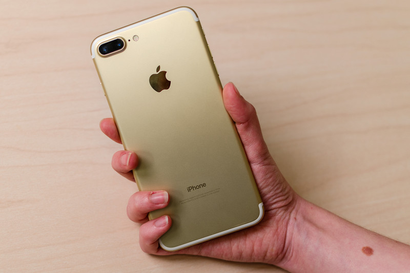
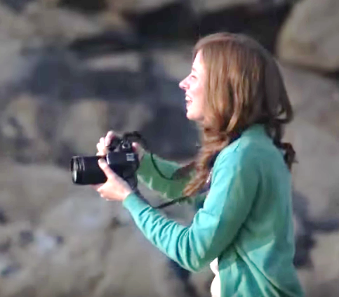
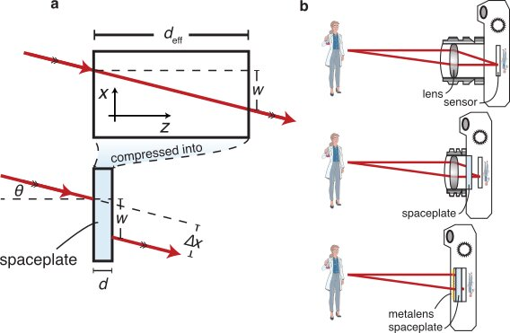
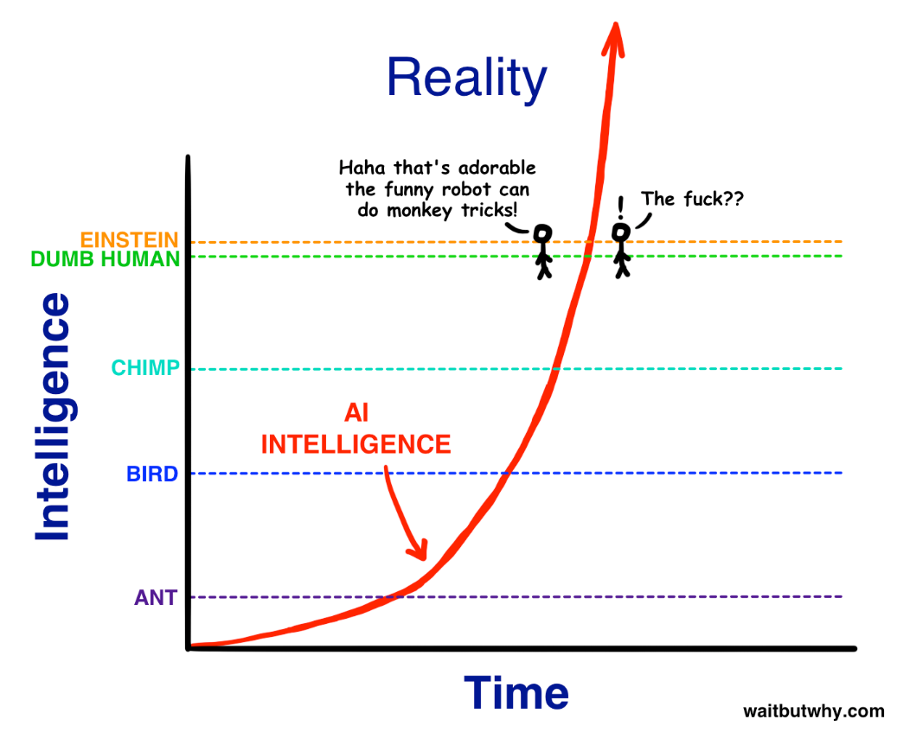

# Инновации: всегда сбоку

**Инновации** — это не любые технологии, а только те, системы и сервисы для которых сумели выйти на рынок и продаются с прибылью.

Большие эволюционные переходы в технологиях называют **подрывом/disruption**: появление инновации, заставляющей производителей продуктов-конкурентов делать «вираж» или вообще исчезать с рынка. Скажем, появление автомобиля подорвало всю гужевую («лошадиную») инфраструктуру: сделать «вираж» или вообще уйти с рынка вынуждены были поставщики подков, кнутов, карет, конезаводчики.

**Прорыв/breakthrough** — это когда появилась инновация, которую способны повторить участники рынка, что даёт возможность этим участникам не исчезнуть. Обычно речь идёт о каком-то развитии технологии, но не её смене. Так, прорывом был переход от германиевых транзисторов к кремниевым: это резко удешевило производство и подняло характеристики. Но переход на кремний не привёл к подрыву каких-то бизнес-эко-систем, не заставил какие-то фирмы делать «виражи» или вообще разоряться.

Проблема с непредсказуемостью будущих технологий как прорывных или даже подрывных в том, что **все прорывные и подрывные инновации происходят** **не из тех отраслей, где они** **реализуются— поэтому-то их и невозможно предвидеть, раннее их развитие невозможно отследить.** Конечно, можно найти какие-то контрпримеры для использованного квантора всеобщности «все», но это будут, скорее, исключения, чем правило.

Речь идёт об изобретении как результате стратегирования: есть какая-то недоступная функция/метод/технология гипотетической системы, надо придумать конструкцию из экономически оправданных аффордансов, которые выдадут в своём взаимодействии эту функцию системы. Если нашли — то вот она, инновация: подрыв или прорыв. Если не нашли, или даже нашли, но экономически пока это невыгодно — ищем дальше, инновации нет, даже если есть работающий прототип. Тут можно спорить, должен ли быть MVP или MAP (minimal awesome product) экономически выгоден, или он должен быть всего лишь «доказательством идеи» (proof of concept, PoC).

В любом случае, нужные аффордансы приходят «сбоку», из других предметных областей, нежели рынок целевой технологии. Микроволновку изобрели спецы по радарам, а не производители кухонного оборудования — мясорубок и холодильников. Компьютер на радиолампах изобрели радиоэлектронщики, а не математики. Самолёт — владельцы мотоциклетной мастерской братья Райт[^r7-1]. Роботами-юристами начали торговать в России провайдеры сотовой связи МТС и Мегафон[^r7-2]. Они же торгуют ещё и музыкой. Сбербанк уже тоже торгует музыкой[^r7-3], и он уже не «банк», а просто «Сбер». Рынок такси взрывает не только Uber, но в России это Яндекс.такси[^r7-4], ибо Яндекс уже не только интернет-поисковик.

**Откуда придёт подрыв вашей (личной или корпоративной, стратегирование в них имеет одну природу)** **технологии— непонятно, но чаще всего это будут «пришельцы сбоку».** Своих-то конкурентов вы отслеживаете, но что делать с тем, когда самые сильные конкуренты появляются стремительно «из ниоткуда», «сбоку»? Их не отследить, слишком много предметных областей надо отслеживать на предмет потенциальных изобретений, это нельзя спланировать.

Экспоненциальные технологии делают эти подрывы стремительными. Вот пример вычислительной оптики:

В иллюстрации[^r7-5] один из снимков сделан в сентябре 2016 году смартфоном iPhone 7 Plus, а другой — камерой-зеркалкой с большим объективом EOS650D. Вы можете угадать, какой снимок чем был сделан? Левый — смартфоном, правый — зеркалкой.

До сентября 2016 года было принято считать, что позиции производителей больших фотоаппаратов хорошо защищены законами физики: эффект bokeh[^r7-6] красивого размытия фона при чёткой фигуре на переднем плане мог проявляться только на фотоаппаратах с большими объективами.

Apple пришёл на фоторынок, где его никто не ждал, принёс вычислительную оптику, а не большой объектив. Экспоненциальные технологии сделали дешёвыми процессоры и маленькую точную механику — потребовались две дешёвые маленькие камеры, а не один большой дорогой объектив. На улице 2016 года тем временем соревновались хипстеры: у кого фотоаппарат больше, тот и победил в качестве снимков!

Дальше всё быстро: эффект bokeh в сентябре 2016 года был продемонстрирован на двух камерах iPhone 7 Plus, но уже в сентябре 2018 года цена опять упала, AI даёт тот же эффект на одном сенсоре — Google Pixel 2 series, Apple iPhone XR. Да ещё и телефоны с 3-5 камерами стали обыденными. Потребность в фотоаппаратах стала нишевой (и эта история произошла уже после того, как цифровая фотография вытеснила плёночную), продажи фотоаппаратов (включая цифровые) шли в 2023 уже на уровне 1977 года, причём эти цифры продолжают падать[^r7-7].

И это было не последней точкой в удешевлении. Во время перехода на удалённую работу практически все сервисы видеоконференций предоставили возможность не только размыть фон, но и вовсе его заменить. Речь идёт уже о супердешёвых веб-камерах на ноутбуках и в компьютерах, и не о неподвижных картинках, а о видео, и ещё об универсальных процессорах. Экспоненциальные технологии делают своё дело: что было диковинкой на самых дорогих моделях телефонов в 2017 году, стало дешёвым общим местом везде. Заодно люди, которые до этой технологии стеснялись своей домашней обстановки, просто перестали её показывать, они заменили её на выбранный ими фон — и сэкономили на интерьере. Наоборот, показать крутую домашнюю обстановку стало привилегией богатых! Повторяется история с нейлоновыми рубашками: сначала их носили только самые богатые, а затем их стали носить только самые бедные. Такое типично для экспоненциальных технологий.

Вычислительная оптика также помогла к 2021 году разобраться со съёмкой смартфонами в темноте, в том числе и съёмкой видео высокого разрешения с повышенным контрастом. Нужда в больших и дорогих фото- и видеокамерах с особыми их возможностями резко упала. Tony Seba приводит хорошие примеры, почему прогнозы не оправдываются. Они не учитывают экспоненциальных зависимостей! Пару десятков лет назад точно такой же переход шёл от плёночной фотографии к цифровой — и всё началось и закончилось за пяток лет. С фотоаппаратами как таковыми происходит всё то же самое.

Производители смартфонов, а теперь и производители ноутбуков пришли в сферу фотографии «сбоку» и буквально за несколько лет дали доступ к качественному фото и видео для практически всех жителей планеты. Это дало возможность необычным применениям фото: контроль качества работы удалёнными сотрудниками (они фотографируют результаты своей работы, это практически бесплатно), платёж по карте, когда не нужно вводить её номер, а он распознаётся автоматически, платежи по штрих-кодам и QR-кодам, автоматизация переводов надписей на иностранных языках, прокторинг[^r7-8] для онлайн-сдачи экзаменов. Идут пробы новых применений, например было массовое увлечение играми типа Pokemon Go, где изображение покемонов накладывается на изображение реального мира, но широкого распространения это не получило. Тем не мене, представьте, сколько людей приложили свои знания и умения, участвуя в этих изменениях. А ведь это только один из небольших сюжетов происходящих перемен! Фотография, бывшая уделом немногих, превратилось в видеографию, доступную практически всем. У каждого видеокамера в кармане, и даже не одна (в смартфоне есть и камера для селфи, и камера для съёмки, и встроенный микрофон для записи звука на видео, и можно сделать «захват экрана» для видео происходящего на экране). К этому добавьте возможности «нейрохудожников», сервисы по изготовлению персонализированных аватаров и эмотиконов для социальных сетей, сервисы редактирования фотографий, сервисы производства видео, сервисы «оживления фотографий», возможности тут бесконечны, и это всё уже можно купить, а кое-что из этого доступно и бесплатно.

Но и это ещё не конец истории про «физика не позволит сделать объектив меньше»! В 2021 году физиками был предложен новый оптический элемент: «пространственная пластина» (spaceplate), которая позволяет убрать пространство между линзой и матрицей. Если заменить линзу плоской металинзой, а необходимое пространство за этой линзой заменить пространственной пластиной, то можно сделать реально плоский объектив. Как пишут изобретатели, вполне можно всю заднюю стенку смартфона превратить в объектив, получив в 14 раз лучше разрешение и чувствительность при съемках в темноте, чем у больших фотоаппаратов с большими объективами[^r7-9].

Если перейти на подобную оптику, то можно получить плоские телескопы, плоские микроскопы, и никаких утолщений для камер на задней панели смартфонов — вопрос теперь только в том, чтобы это сделать коммерчески выгодным. В области микроволн такие устройства в составе аппаратуры (а не только в экспериментальной установке) уже сделали[^r7-10], в оптическом диапазоне — пока нет. Такая новая оптика придёт в классическую оптическую промышленность сбоку, производители телескопов и микроскопов никак не ожидают, что подобная новинка появилась не от конкурирующих производителей телескопов и микроскопов. Предыдущий тип оптического элемента «линза» был предложен 400 лет назад, и с тех пор не было новинок — до 2021 года! Изобретатели «пространственной пластины» пришли из лаборатории квантовой оптики, а завод-производитель пространственных пластин будет не заводом оптического оборудования с парком шлифующих стёкла станков, а заводом нанометаматериалов с абсолютно другим оборудованием!

Когда речь идёт об информационных технологиях, всё происходит ещё быстрее и неожиданней. На удалённую работу даже там, где это было нельзя себе представить, мир перетянулся разве что не за пару месяцев. MS Teams как средство удалённой работы (отнюдь не все пользуются Zoom) поднял пользовательскую базу с 0 до 18 миллионов человек за два года, а потом за три месяца пандемии дорастил её до 77 миллионов человек. Ещё через год в MS Teams было уже 145 млн. человек[^r7-11]. Много фирм буквально за пару месяцев начала пандемии сообразили, что дорогой офис — это не преимущество, а недостаток. И начали нанимать сотрудников по всему миру, а не только проживающих недалеко от офиса. Это означает, что рынок офисной недвижимости был по факту подорван софтверными фирмами, обеспечивающими сервисы удалённой работы[^r7-12], беда пришла «сбоку».

**Мир меняется от принципиально непредсказуемых факторов, которые приходят «сбоку», из неожиданных мест. Вы не можете предсказать изобретения 8 миллиардов человек (хотя в реальности немного меньше, вычтите детей и необразованное население отсталых стран). В том числе и «антиизобретения» законодателей, типа пандемических локдаунов как неконституционно вводимых ограничений на передвижение, или запрета каких-то вычислений типа вычислений для криптовалютного рынка или вычислений для показа вебсайта кем-то запрещённой социальной сети. Вы не можете предсказать войну. Эти непредсказуемые изменения распространяются по земному шару крайне быстро — речь идёт об экспоненциальных, и даже гиперэкспоненциальных изменениях, у которых нет единого руководящего центра. Это техно-эволюция.**

Примеры мы привели главным образом из производства, но примерно то же самое творится в науке. Современная лингвистика была закрыта буквально за несколько лет: много лет нарабатываемые лингвистами языковые модели оказались менее точными, и менее полезными на практике, чем языковые модели на основе нейронных сетей — и делали их отнюдь не лингвисты, а специалисты по машинному интеллекту. Математики, специалисты по архитектуре нейронных сетей, программисты для ускорителей матричных умножений (GPU) пришли в лингвистику «сбоку» — и они теперь на лингвистическом фронтире с момента появления архитектуры transformer[^r7-13] в 2017 году, а не лингвисты с их тысячелетним багажом знаний. А теперь появились на базе этих изменившихся представлений о естественном языке и его природе научные работы, где по-новому оценивается роль естественного языка по сравнению с использованием формального математического языка в логике[^r7-14].

Даже если брать математику в приложении к физике, то и тут всё быстро, и «классические учёные» могут уже не поспевать за прогрессом. Графовую нейронную сетку «дистиллировали» в алгебру, а затем подобрали в этой алгебре математическую форму (символьная регрессия[^r7-15], или выявление/discovery символьных моделей) для выражения закономерностей в физических наборах данных. Чтобы проверить подход, переоткрыли уравнения ньютоновской механики, переоткрыли гамильтониан из квантовой механики, и предложили закон (математическую формулу) для описания гало тёмной материи в космологии — чтобы продемонстрировать не «переоткрытие», а «открытие»[^r7-16]. Основная физическая интуиция как раз и берётся символьной регрессией, в основе которой эволюционный алгоритм. Лидер в этой области символьной регрессии вполне уже коммерциализован: эволюционный/генетический алгоритм символьной регрессии Eureqa, вошёл в состав DataRobot[^r7-17]. Новую физику теперь ждут из большой физической модели на нейросети, создаваемой по примеру большой языковой модели[^r7-18]. Эти примеры можно продолжать и продолжать: критики продолжают утверждать, что автоматизация творчества (ибо наука вся базируется на творчестве) невозможна, а инженеры просто автоматизируют и творчество тоже.

**По большому счёту всё равно: у вас предпринимательская гипотеза (концепция использования), научная гипотеза, инженерная гипотеза (концепция системы), бизнес-гипотеза (бизнес-модель): выдвижение гипотез и их** **рациональное оценивание** **относится к общим мыслительным умениям, хотя по-старинке называется «научным мышлением». Особо обратим внимание, что это мышление не одного человека, играющего роль учёного, разработчика, менеджера, продвиженца. Нет, это мышление безмасштабно** **и неантропоцентрично: реализуется и отдельными людьми с их компьютерами, и большими организациями с их компьютерами,** **и** **даже** **просто компьютерами с системами** **AI. Более того, это мышление выходит за рамки** **отдельных организаций в пределы сообществ и обществ (идёт обмен информацией).**

Выдвижением гипотез/догадок (каких-то объяснений, дающих предсказания будущего — порождающих/generative моделей) и их проверкой (логической и экспериментальной) занимаются ежедневно миллионы учёных, но также и миллиарды самых разных работников: инженеров, менеджеров, продвиженцев, учителей, чиновников, разглядывающих многочисленные данные по их предметам интереса. **Идеи для стратегирования — это гипотезы, догадки, они не научные гипотезы, но они одной природы с научными гипотезами, это догадки, которые должны выдержать проверку логикой, а затем и проверку жизнью (эксперимент)!**

Автоматизация предлагает в том числе облегчение труда (вплоть до полной замены этого труда) для самых разных людей, занимающихся выдвижением догадок/гипотез/guesses в самых разных деятельностях. Современные системы AI вроде ChatGPT уже могут выдвигать какие-то гипотезы, но таких сервисов много, они уже конкурируют, цена рациональных объяснений всё более и более сложных явлений будет падать. При этом цена самых трудных объяснений будет оставаться прежней и не падать, зато доступная для этой высокой цены трудность поиска и разнообразность доступных приёмов объяснения будет всё время расти.

Разработчики алгоритма Eureqa не имели какого-то отношения к физике, ко всей этой космологии и гамильтонианам, они просто «разрабатывали алгоритмы искусственного интеллекта», что бы это ни значило. Им всё равно, объяснять ли подобным алгоритмом движение планет, или объяснять движение курсов акций на фондовом рынке. Но они со своими объяснениями сначала пришли в науку, и продемонстрировали, что их алгоритм выдвигает гипотезы не хуже Кеплера. Их алгоритм реализует научное мышление.

Так что и классическая наука уже не будет прежней, к ней тоже пришли «сбоку»: к физикам пришли люди, занимающиеся нейронными сетями и символьной регрессией, а не физикой. К биологам (в том числе фармацевтам) пришли с решением задач складывания белка люди, которые отработали алгоритмы на играх, таких как игра Го[^r7-19].

Почему все эти вопросы обсуждаются в руководстве по методологии? Потому что стратегирование это всё должно учитывать, вы должны понимать, откуда в жизни берутся новые методы работы и поддерживающий их инструментарий.

Копают люди давно уже не руками, и не палкой-копалкой, и не лопатой, а экскаватором. Для вытаскивания законов природы из данных палка-копалка из нейронных сетей и символьной регрессии уже готова, опубликовано множество статей. А лет через пять ждём, что новые законы природы будут грести уже лопатой. Лет через десять можно ждать и «научного экскаватора». Просто удивительно, как мало людей, понимающих суть происходящих перемен. **Если вы занимаетесь личным или корпоративным стратегированием, ваш горизонт прогнозирования (и затем горизонт планирования) хотя бы пара-тройка лет (а иногда и больше), то вы не имеете права игнорировать эти тренды.**

В науке тоже всё новое приходит сбоку, и неудивительно, что «старые физики» не будут понимать (или уже не понимают), что происходит — как уже сейчас «старые лингвисты» не понимают, как устроены современные системы машинного перевода, которые вроде бы должны использовать разработанную классическими лингвистами теорию языка, но по факту они её не используют, поэтому огромное количество теорий языка в большинстве своём оказались невостребованными.

Искусственный (он же машинный) интеллект развивается сейчас особенно быстро, и Тим Урбан даже нарисовал про это иллюстрирующую экспоненциальные технологии картинку[^r7-20]:

Это картинка 2015 года. В то время трудно было представить, что робот-юрист возьмёт на себя 80% юридической работы в фирме, держащей миллионы контрактов. Или что AI победит чемпионов мира в Го, в StarCraft II — а потом эти алгоритмы будут использованы в промышленности. То, что GPT o1 будет отвечать на трудные вопросы на уровне докторов наук[^r7-21] (хотя иногда и откровенно ошибаться в лёгких вопросах), но ещё она будет общедоступна сразу после её анонсирования[^r7-22] — это тоже трудно было представить. Но это всё уже есть, и это только начало. Не верьте, когда говорят про принципиальные ограничения AI по сравнению с интеллектом людей — принципиальных ограничений нет. Да, искусственный интеллект может делать ошибки, и будет делать ошибки всегда. Но и люди тоже их делают.

**Машинный** **интеллект по сфере своего использования такой же, как естественный: он может применяться везде.** В том числе и в диджействе. Технология NeuralMix[^r7-23] может разделить трек на вокал, перкуссию, бас и всё остальное. Смешивать два трека диджею можно уже не целиком, а отдельно каждую из инструментальных частей трека. Тут нейронные сети не просто автоматизируют труд диджея, но делают то, что человек раньше делать не умел. А ведь диджейство по факту массовая профессия: раньше учились массово семь лет в музыкальной школе, а теперь учатся год в школе диджеев — и пультов диджеев продаётся уж не меньше, чем роялей, просто на это уже мало кто обращает внимания. Сочиняет ли компьютер музыку? Да, конечно, таких сервисов уже много. Сочиняет ли новую музыку, или только перемешивает в новых сочетаниях давно известное? Конечно, сочиняет. Ответ юристов музыкального сервиса Suno[^r7-24] на иск компании Sony в том, что в обучении были использованы треки этой компании был прост[^r7-25]: треки не копировались, а именно что были изучены, ровно как музыка изучается композитором. А потом неживой нейрокомпозитор сочиняет свою музыку, развивает музыкальную культуру. Он не копирует какие-то музыкальные произведения, он воспроизводит стили и жанры. Музыкальный AI моделирует методы, используемые музыкантами разных стилей и жанров, но не копирует произведения, там нет базы данных произведений! Есть знания о жанрах.

Последствия гиперэкспоненциального развития машинного интеллекта закрыты туманом будущего. Но уже сегодня понятно, что эти последствия будут весьма заметными для каждого человека на Земле. Масштабы? Например, **треть** **IT-бюджетов реального сектора сегодня направлены на проекты с** **AI, это неожиданный, но факт**[^r7-26]. Если вы занимаетесь стратегированием, учтите это!

Сегодняшние инвестиции дадут отдачу через пару лет, поэтому дайте время на разработку и запуск новых интеллектуальных IT-систем в производство. Жизнь на производстве будет меняться, и быстро: деньги-то в это изменение уходят не маленькие! Скажем, переход с плановых ремонтов (35% этих ремонтов «чинят не поломанное», то есть бесполезны) на ремонты по состоянию, моменты которых определяются программами AI, высвобождает в масштабах планеты огромное количество труда, который сейчас абсолютно бесполезен. Представляете, сколько это труда на планете — треть плановых ремонтов? **Плановые ремонты — это зло!** И победит их машинный интеллект. Дело не только в бесполезном труде людей. Если оборудование (например, турбину электростанции) не останавливать для ремонта, это дополнительный выигрыш. Человечество будет богаче. **Машинный интеллект выгоден.**

Машинный интеллект научился переводить с иностранных языков (включая самые экзотические) на уровне восьмиклассника (или уже десятиклассника? Или первокурсника? Или третьекурсника технического вуза? Качество перевода меняется так быстро, что не уследишь!). Профессиональные переводчики пока не потеряли работу, но изменения в мире оказались в другом — миллиарды людей получили доступ к плохому, но переводу через Гугл, Яндекс, и даже улучшенному качеству перевода через специализированный сервис DeepL[^r7-27] и отчуждённое от людей умение машины редактировать английский текст в соответствии с каким-то стилем в сервисе Grammarly[^r7-28]. И это существенно добавило возможностей этих миллиардов людей на рынке труда. Никаких людей-переводчиков и редакторов-корректоров не хватило бы на такой объём обслуживания. Конкуренция на рынке труда возросла для многих работ, языковой барьер с учётом машинного перевода для этих работ перестал быть существенным, можно с мая 2025 года в реальном времени беседовать по видео с синхронным автоматическим переводом[^r7-29].

А что с другими гиперэкспоненциальными технологиями? Там тоже всё интересно. Например, появились квантовые датчики, работающие на основе квантовой запутанности фотонов. И это даёт возможность построить новые типы микроскопов, которые могут изучать живые клетки в ходе их работы, не повреждая их лазерной подсветкой. Дальше появляется новый класс квантовых датчиков, и их цена тоже будет падать экспоненциально. Пульсоксиметры (измеряют как пульс, так и насыщение крови кислородом) в лучших моделях смартфонов появились ещё в 2015 году[^r7-30], а в июне 2021 (мотивированный COVID-пандемией спрос породил предложение!) их стало можно купить в Москве даже в отдельном корпусе-напальчнике один и тот же по цене от 250 рублей (включая батарейку) до 2500 рублей: продавцы не успевают обновлять цены, всё этими пульсоксиметрами затоварено, **цены упали за год практически вдесятеро — обнаруженная общая потребность так и работает: кратковременный всплеск цены и возгласы «дефицит», а затем современное производство мгновенно перестраивается, организует массовый выпуск и цены драматически падают. Это общий паттерн.**

Если рассматривать алгоритмику в сочетании с новыми видами компьютеров (квантовые компьютеры), то и тут есть прорывы — квантовыми алгоритмами почти не занимались, ибо не было доступности квантовых компьютеров. Но вот когда такие компьютеры появились, появились и новые алгоритмы. Например, оказалось, что для успешного решения задачи коммивояжёра может требоваться всего один кубит[^r7-31]. Получается, что алгоритмика получает новое дыхание не только от математиков, которые придумывают новые алгоритмы, но и от физиков, которые придумывают новые компьютеры — компьютерная наука (информатика, computer science) является экспериментальной естественной наукой (подробней об этом — в руководстве по интеллект-стеку).

**Время изменения** **массово используемых в мире технологий** **начинает быть более быстрым, чем время переобучения и человека, и отдельной организации, а затем и отдельных** **AI** **на** **задействование новых технологий.** **Люди не успевают переучиваться сами и не успевают переоснащать свои предприятия, чтобы успевать адаптироваться к новому быстро изменяющемуся миру. Вы можете пробовать переобучаться быстрее конкурентов, но они или начинают раньше, или сами учатся быстрее вас. Поэтому для выигрыша в конкуренции вам тоже приходится или начинать раньше, когда ситуация ещё малопонятна и надо рисковать, или переучиваться быстрее, когда ситуация уже понятна и риски не запредельны.**

[^r7-1]: <https://en.wikipedia.org/wiki/Wright_brothers> — и дело даже не в том, что они догадались поставить на самолёт лёгкий мотоциклетный двигатель, изготовленный в их мастерской. Они придумали проводить эксперименты в аэродинамической трубе, а ещё придумали систему управления самолёта по трём осям воздушными рулями. Но они не были «профессиональными авиаторами»!

[^r7-2]: Мегафон — <https://www.cnews.ru/news/top/2020-01-29_novyj_servis_megafona>, МТС — <https://rb.ru/news/mts-norma/>.

[^r7-3]: Сервис «Сбер-звук», <https://sber-zvuk.com/>

[^r7-4]: <https://www.rbc.ru/technology_and_media/07/02/2018/5a7b20d29a79473903543eaa>

[^r7-5]: <http://www.macdigger.ru/iphone-ipod/iphone-7-plus-protiv-zerkalki-canon-semka-fotografij-s-effektom-boke.html>

[^r7-6]: <https://en.wikipedia.org/wiki/Bokeh>

[^r7-7]: <https://www.cipa.jp/stats/documents/common/cr200.pdf>

[^r7-8]: <https://trends.rbc.ru/trends/education/5fa01fe49a794782c65b74f9>

[^r7-9]: <https://phys.org/news/2021-06-goodbye-camera-miniaturized-optics-counterpart.html>, <https://www.nature.com/articles/s41467-021-23358-8>, продолжение работ в 2024 году от других авторов <https://pubs.acs.org/doi/10.1021/acsphotonics.4c00086>

[^r7-10]: <https://arxiv.org/abs/2405.00043>

[^r7-11]: <https://venturebeat.com/2020/04/29/microsoft-teams-passes-75-million-daily-active-users/>, <https://www.statista.com/statistics/1033742/worldwide-microsoft-teams-daily-and-monthly-users/>

[^r7-12]: <https://vc.ru/office/127764-pochemu-my-reshili-dat-vozmozhnost-sotrudnikam-ostatsya-na-udalenke-navsegda>

[^r7-13]: <https://arxiv.org/abs/1706.03762>

[^r7-14]: <https://ailev.livejournal.com/1551283.html>

[^r7-15]: <https://en.wikipedia.org/wiki/Symbolic_regression>, <https://arxiv.org/abs/1912.04825>

[^r7-16]: <https://arxiv.org/abs/2006.11287>

[^r7-17]: <https://www.datarobot.com/nutonian/>

[^r7-18]: <https://ailev.livejournal.com/1723726.html>

[^r7-19]: <https://ailev.livejournal.com/1637656.html>

[^r7-20]: <https://waitbutwhy.com/2015/01/artificial-intelligence-revolution-1.html>

[^r7-21]: <https://openai.com/index/learning-to-reason-with-llms/>

[^r7-22]: <https://openai.com/index/introducing-openai-o1-preview/>

[^r7-23]: <https://openai.com/index/introducing-openai-o1-preview/>

[^r7-24]: <https://suno.com/>

[^r7-25]: <https://fingfx.thomsonreuters.com/gfx/legaldocs/zjvqymadevx/USA%20COURT%20MUSIC%20COPYRIGHTS%20sunoanswer.pdf>

[^r7-26]: <https://www.zdnet.com/article/manufacturers-allocate-one-third-of-overall-it-spend-to-ai-survey-shows/>

[^r7-27]: <https://www.deepl.com>

[^r7-28]: <https://www.grammarly.com/>

[^r7-29]: <https://workspace.google.com/blog/product-announcements/new-ways-to-do-your-best-work>

[^r7-30]: <https://www.youtube.com/watch?v=0XpRhQX7BpU>

[^r7-31]: <https://arxiv.org/abs/2407.17207>
