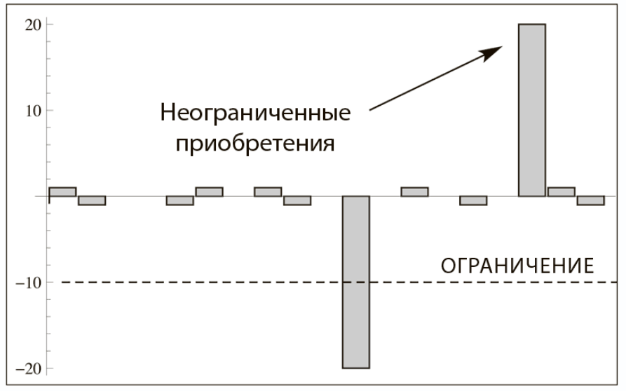
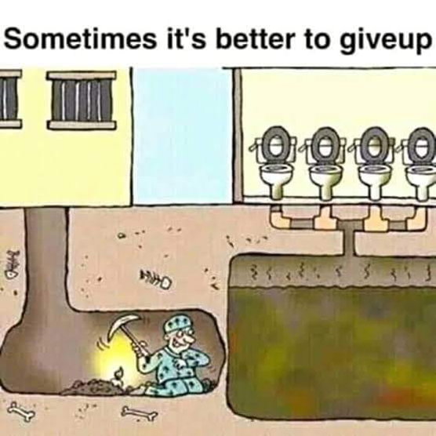

# Мечту вполне можно иметь. На мечте просто нельзя застревать.

Если вам стыдно, что вы ещё не нашли смысла жизни, у вас нет долгосрочных планов, вам трудно сформулировать мечту — познакомьтесь с литературой, обсуждающей порочность долгосрочного мечтательного стратегирования. Такой литературы сегодня много, и это счастье. Раньше таких книжек не было, всех поголовно уговаривали выбрать «дело жизни», желательно в раннем детстве, и вот литературы про пользу «мечтаний надолго» (что означает разовое раннее стратегирование, при этом почему-то даже признавалось, что up-front планирования сделать нельзя, но up-front стратегию сделать можно — agile планирование «на лету» ведь следует за agile стратегированием «на лету»). Конечно, у вас может быть и смысл жизни, и мечта, и даже какие-то планы, даже долгосрочные. Другое дело, что это текущий смысл жизни, текущая мечта, текущие планы — это совсем другое дело, вчера они были одни, завтра будут другими. Но если вы считаете, что всё это должно появляться где-то в раннем детстве или хотя бы в студенчестве, а потом не меняться всю жизнь — вы глубоко не правы. **Мечту можно иметь, но на мечте нельзя застревать.**

Люди страдали, если у них не обнаруживалось цели в жизни, или эту цель в жизни приходилось менять каждые несколько лет. Это сильно противоречит тому, что предлагалось классической литературой, советами родителей и учителей — тех, кто постарше, кто помнит о временах не то что «профессий», но вообще «династий» (когда несколько поколений семьи выбирали одну и ту же занятость). Страдать от отсутствия «одной большой цели в жизни» не нужно, это абсолютно нормально! Концепт «цель жизни» и для людей, и для компаний (только там говорят «цель существования», а не «жизни») — придуманный, он абсолютно искусственный, в нём нет ничего естественного. **В стратегировании вы должны вовремя замечать, что цели жизни у вас и цели существования компании неадекватны изменившейся ситуации — и** **после того, как заметили—** **вовремя** **заменить** **эти цели! Никаких «скреп», «заветов предков/основателей», «детской мечты», «столетней традиции». Жизнь изменилась** **так, что старые цели не работают—** **немедленно** **меняй цели, хоть личные, хоть корпоративные.**

Интуиция подсказывает, что **в текущей ситуации непрерывных технологических подрывов лучше долгосрочных целей не ставить, ибо это всё равно бесполезно, вы этих целей не достигнете, это будет источник постоянного расстройства.** Но художественная литература вроде как требует такие цели иметь. Что делать?

Тут ещё нужно сказать, что само понятие «цель» размыто в своём значении. Например, есть устойчивое сочетание «цели и задачи» — и пытаются изобрести, чем «цели» отличаются от «задач». Или чем «цели» отличаются от «миссии» и «видения». Или чем «цели» отличаются от стратегии (а задачи приписываются тогда к тактике).

Мы считаем, что тут говорим о долгосрочной стратегии как методе работы, которого мы придерживаемся на протяжении какого-то долгого (годы) времени. Наличие стратегии полезно, её можно описать в виде самых разных моделей. Это явное описание стратегии позволяет согласовать предметы интереса многих ролей внутри личности, если речь идёт о личном стратегировании, или внутри организации, если это корпоративное стратегирование.

Поэтому от невнятных «долгосрочных целей» переходим к разговору о стратегии. **Нужно часто обновлять (изменять частично, изменять полностью, то есть делать «вираж»/pivot) стратегию—** **метод, которым мы хотим изменить мир к лучшему, решить какую-то проблему. Стратегирование должно быть непрерывным, не прекращаться. Круто не меднолобо преследовать всю жизнь детскую мечту (личную или корпоративную), но всю жизнь развиваться самому и развивать мир вокруг себя, на многих системных уровнях. Бесконечно развиваться, преследуя самые разные цели развития — это много круче, чем быть романтиком-фанатиком и тем более пытаться сделать из компании романтика-фанатика, то есть слепо преследовать долгосрочную мечту!**

А как же с мечтой типа начальной «послать оранжерею на Марс», которую лелеет тот же Элон Маск? Это отнюдь не детская его мечта. Эта мысль у него появилась, когда он был уже миллионером. Более того, сейчас эта мысль подросла: он хочет уже не просто послать оранжерею на Марс, а переселить туда миллион человек, чтобы как-то защитить человечество от космических экзистенциальных рисков.

Эта «мечта» не мешает Элону Маску заниматься самыми разными проектами, которые подворачиваются под руку — и электромобилями, и человекоподобными роботами, и искусственным интеллектом, и социальными сетями, и транспортными туннелями, и солнечными панелями, и ракетостроением (вроде бы это и отвечает мечте), и спутниковой связью. Одно дело «нарисованный пиарщиками образ», другое дело — реальные дела. Тут тоже есть «схемы» (оформление в каком-то приемлемом вовне формализме того, что реально происходит. Например, схемы уменьшения налогообложения). То что реально происходит, и как это подаётся широкой публике могут разительно отличаться. Да, у Маска есть «хотелка» летать на Марс и даже переселить туда часть человечества. Одна из множества «хотелок», но отнюдь не всепоглощающая страсть, не единственная «мечта детства».

Так что не надо стыдиться разнообразия своих проектов, это нормально. Быть меднолобым фанатиком одной идеи — вот это неправильно. Успевайте заметить, что вы застряли на уже неактуальной стратегии, что застряла ваша организация — и срочно меняйте методы работы (включая сигнатуру: какие состояния каких объектов вы хотите изменить вашей работой по стратегии), то есть меняйте стратегию!

Пожалуй, самая известная книжка из литературы по постоянному стратегированию как постановке краткосрочных жизненных и корпоративных целей и избеганию долгосрочных — это «Антихрупкость» Нассима Талеба[^r7-1].

Описанный в книжке идеал — быть «рациональным фланёром[^r7-2]», который пересматривает свой маршрут на каждом шагу, чтобы сделать его зависимым от полученной новой информации. Это ключевой момент: никогда не стратегировать «на будущее». Методы не надо выбирать такие, которые подробно расписывают многолетние занятия. Не надо также ставить каких-то долгосрочных (на много лет) конкретных достигаемых тяжёлой работой целей, то есть не надо бежать «куда». Наоборот, нужно всегда бежать со всех ног «откуда», в любом направлении (а не в одном «целевом»!) от появляющихся неудовлетворённостей, отталкиваясь от того, что вам уже известно про себя и про мир на текущий момент. Через довольно короткое время после первых же действий по этому бегу «откуда» будет известно о ситуации больше (в том числе и то, что ситуация изменилась — это уже другая ситуация), поэтому надо будет менять стратегию, делать новые ставки на то, что новая стратегия будет успешна.

Это хорошо соответствует теории active/embodied inference, где агент (личность, организация, сообщество, что угодно) избегает неприятного сюрприза (выживает, старается быть стабильным), а не стремится к какой-то особой цели. Это даёт свободу: вы не как зомби идёте к какой-то конкретной цели, но вы выбираете из огромного числа методов, которые позволяют вам наоборот — уходить от каких-то состояний.

Если всё вокруг хорошо, то всё рассуждение по-прежнему применимо, ибо речь идёт о предсказании неудовлетворённости: надо изменить себя (в том числе улучшить модели себя для этого) и мир (в том числе улушить модели мира для этого) так, чтобы предсказание говорило, что всё будет хорошо и в будущем!

Такое стратегирование полностью соответствует тому, что говорит мизесовская праксеология: действовать человека заставляет чувство неудовлетворённости, беспокойства от текущих и возможных в будущем проблем. Жизнь меняется, меняются текущие проблемы и меняются предсказанные возможные в будущем проблемы, а также меняется **стратегия как** **предсказание лучшего способа ухода от этих проблем**, предсказание лучшего способа добычи ресурсов для ухода от текущих и будущих проблем. Поэтому стратегия будет меняться по мере изменения состояний себя и состояний мира!

Не нужно быть рабом собственной мечты и уверенности в её незыблемости. Долгосрочная мечта призрачна, она обманет. Не чувствуйте вины от того, что вы и/или ваша компания «поменяли мечту»[^r7-3]. Идите за **текущим** интересом, ибо ваш интерес тоже может меняться. **Фланируйте, доверяйте интуиции. Но фланировать нужно рационально, не делать очевидных ошибок.**

В книжке Талеб формулирует, что «ставить нужно на всё что угодно», ибо никто не знает, где лежит твоё счастье — будущее принципиально непредсказуемо. Но нужно быть «лохом»[^r7-4], чтобы ставить на реализацию мечты, которую можно осуществить только через много-много не просто рискованных, но вообще непонятных шагов: когда у вас нет никакой стратегической идеи (идеи о методе создания целевой системы) в части концепции системы, которую вы создаёте, то есть нет идеи о том, существует ли в мире аффорданс (конструктивная часть, которую вы можете использовать для реализации функции, без которой система не заработает). Помним, что легко продать за довольно большие деньги вечный двигатель, скатерть самобранку, суперинтеллект — если будет понятно, из чего можно такое сделать в обозримое время. То есть «хорошая маркетинговая идея, наличие рынка» не означает автоматически успеха в стратегии.

На рисунке 24 в книге Нассим Талеб приводит картинку «штанги» во временном ряду, как главного способа достижения успеха и заработка:

Основная идея в том, что **можно крупно выиграть в проекте один раз — и это покроет многочисленные убытки от прошлых проектов. Для этого нужно ограничивать величину убытка, и ввязываться в проекты, где не ограничен выигрыш. А дальше работает статистика: хотя бы один раз из многих проектов должно повезти, если не будете лохом, не наделаете ошибок, и не попадёте на неограниченный убыток. И этот один раз даст выигрыш во всей серии проектов. Проигрышей избежать не удастся: неожиданности всё равно будут, и плохие, и хорошие.**

На каждый десяток обычных ожидаемых белых (известных, это не обязательно «хорошие» события, могут быть и обычные ожидаемые плохие события) лебедей обязательно прилетит один чёрный полностью неожиданный (тоже необязательно плохой, но полностью неожиданный — в книге это символ неожиданности, хорошей или плохой, раньше ведь не знали о существовании чёрных лебедей, они водились только в южном полушарии).

**Главный вид ошибки: ставки, при которых можно проиграть неограниченно много. Такие ставки — ошибки, их просто не нужно делать.** Нужно блюсти асимметричность: если потери будут, то они не должны превышать заранее известного маленького размера, а если выигрыш — то по величине он может быть неограниченно большим. На этой асимметричности малого проигрыша и возможно огромного выигрыша можно получать прибыль чисто статистически, если хоть как-то оценивать вероятности. А средних ставок с «умеренным риском» делать не нужно, это разорительно. Талеб по основной своей специальности как раз был трейдер на рынке ценных бумаг, поэтому он свои примеры и образы главным образом брал оттуда.

Талеб предупреждает: если вы знаете, куда идёте, или считаете, что знаете, куда идут другие (внешне «целеустремлённые», но вы же не знаете, что у них там на самом деле в мыслях!), то это ваше телеологическое (связанное с целеполаганием) заблуждение. Не заблуждайтесь, **никакой разумной цели нет ни у вас, ни у других, честно фланируйте — рационально решайте куда идёте на каждом шагу,** **а не в начале пути,** **не стройте длинного маршрута заранее. И удача время от времени будет вам улыбаться, случай будет работать на вас.**

Проект, в котором вы не знаете какой-то верхнеуровневой концепции системы — очень, очень сомнителен. Если вы оказались в проекте по созданию вычислительной машины во времена Бэббиджа, то вам ещё ждать сотню лет, чтобы появились электронные лампы, технология которых будет отработана в усилительной аппаратуре телефонии, в радиоприёмниках и радиопередатчиках. Если ваш проект полагается на то, что вы как-то сделаете изобретение и у вас появится концепция системы — то самое время считать ваше поведение нерациональным, вам надо немедленно менять проект. Менять ли и стратегию тоже? Да, если вы поняли, что другого сорта проектов по этой стратегии не будет. Дайте себе три дня поизобретать, чтобы вы нашли что-то такое, что «придёт сбоку и позволит сделать проект». Если не изобрели — бросайте, не факт, что изобретёте именно вы и до того момента, как кончатся деньги ваши и других инвесторов.

Не жалейте уже потраченные средства на заведомо убыточные проекты. **Неудачи — они запланированы, просто списывайте затраты, и бросайте проект. Не будьте меднолобым достигателем несбыточных целей.**

Если вы понимаете, что проект «дохлый» (системное мышление — санитар леса, быстро помогает такие проекты обнаружить) — бросайте его немедленно, даже если вы (человек или компания) долго им занимались! О затратах просто забудьте, не умножайте их. Каждая новая вложенная в этот «дохлый» проект копейка, каждая новая вложенная в такой проект минута, каждое новое вложенное усилие — это чистые потери, они не вернутся! Потратьте ресурсы на поиск нового, более выгодного проекта! Переключайтесь немедленно!

Если лодка тонет, не тоните вместе с ней, тонуть долго и несчастливо — это не доблесть! «Крысы бегут с тонущего корабля» — они ведь правильно делают, если очевидно, что корабль уже не спасти! А кто остаётся на безнадёжно тонущем корабле — герой? Да, герой для рассказов об упёртых неудачниках, в назидание потомкам. Если есть возможность спасти проект — спасайте, но если нет такой возможности — не ждите, что «как-нибудь наладится». Не наладится! Бегите, и не жалейте об уже потраченных силах, времени, деньгах.

Когда тебе весь мир из каждого утюга говорит «напрягись и вот-вот тебе будет счастье!» — не верьте, что вы такой гений, не верьте, что ваша компания такая гениальная. Не верьте, что вы и даже целая большая компания сможете быстро что-то изобрести. Не впадайте в ошибку выжившего[^r7-5]: приводимые вам из каждого говорящего утюга примеры показывают только отдельных счастливчиков, избежавших неудачи. Не факт, что вы повторите судьбу этих счастливчиков и станете вторым Биллом Гейтсом или Элоном Маском. Миллионы и миллионы проигравших безвестны, вас поэтому никто не предупредит об огромной вероятности неудачи, а пример ничтожной вероятности удачи подвесят как морковку, повторят сотню-другую раз в день.

Если собака укусила человека — это не новость, новость — это когда человек укусил собаку! Если кто-то (или какая-то большая фирма) потерпел неудачу в своих инвестициях — это не новость, в СМИ это не напишут, в соцсетях не прокомментируют. Новость, если вдруг инвестиции принесли огромный доход, вот это точно попадёт в СМИ, это точно будет обсуждаться в соцсетях! Если вы ввяжетесь в авантюру с неограниченным проигрышем, то с огромной вероятностью пополните ряды безвестных неудачников. Пополнить компанию миллиардеров вы тоже можете, но с вероятностью чуда. Не верьте пропаганде упорства, не верьте пропаганде безусловного выигрыша, связанного с бизнесом. Работает не пропаганда, а статистика.

При этом нужно понимать, что уклониться от принятия бизнес-решений (решений по поводу того, чем же будет заниматься ваша фирма или вы, что поднимет стоимость вашей фирмы или вас лично) нельзя. Любое ваше действие — это ваш бизнес-выбор о том, куда инвестировать собственные (в том числе вашей компании, даже и не собственные) ресурсы: **вы выбрали делать именно то, что вы делаете, и тем самым выбрали не делать чего-то другого.** Вы не завели собственного дела, но поступили к кому-то на работу: это бизнес-решение. Если речь идёт о вас самих, то вы вложились собой, своим временем, в которое вы могли бы зарабатывать каким-то другим способом. Например, поступив на работу в другое место; или совершая какие-то торговые или даже чисто финансовые операции; или отдыхать и набираться сил для другой работы, которая будет более выгодна — отложить заработок; или учиться для другой работы — тоже отложенный заработок; или путешествовать автостопом и питаться объедками в столовой — это неявный заработок, но он есть; или жить в лесу и питаться как дикарь, что тоже приносит доход, которого едва хватает на жизнь, и он не выражен в деньгах; или ещё делать что-то, и при этом не голодать: люди удивительно изобретательны в выборе того, чем им заняться. К фирмам это относится в полной мере. Если был выбран для обслуживания этот продукт, этот клиент — это означает, что ресурсы (время сотрудников, деньги) были вложены в это, а не что-то другое. фирма не стала сама торговать в розницу, но продаёт свои товары и сервисы какой-то большой фирме, как единственному клиенту. Это то же самое, что «поступить на работу» для личности, мышление тут будет одинаковым.

**Уйти от принятия бизнес-решений** **(решений о том, что делать для того, чтобы поднялась стоимость вашей фирмы или вас лично)** **нельзя. Даже если вы будете ничего не делать, то это выбор: пробел тоже символ, ничегонеделание — это решение, избегание выбора — это ведь тоже выбор!**

Но приведёт ли следование рекомендации Нассима Талеба «рационально фланировать» к успеху? Он ведь попсовый писатель, говорит не столько верно, сколько красиво. Что на эту тему жизненного успеха говорит наука, а не поп-наука?

Наука вместе с Талебом по этой теме говорит, что вы не должны быть лохом (то есть должны быть минимально умны, чтобы не делать явных глупых ошибок), но вот всё остальное — и впрямь дело случая! Вы должны оказаться в правильное время на правильном месте, и быть минимально умны (то есть должны быть умней кошки, хотя и кошек кормят). Люди и компании различаются по их интеллекту и умениям по абсолютной шкале (по сравнению с теми же кошками или слонами или даже кошачьими стаями и стадами слонов) весьма незначительно, а богатство/капиталы их различаются в миллионы раз. Главный виновник этих различий не уровень работоспособности, прозорливость, мудрость и т.д., главный виновник тут случай. Этот «успех» был выражен количественно и проверен в компьютерных экспериментах в 2018 году, модель хорошо соответствует реальности[^r7-6]. Должно ли это нас смущать? Нет, не должно. Богатые тоже плачут, а бедные тоже смеются. Уровень удовлетворённости жизнью и богатство не так уж сильно связаны.

[^r7-1]: <https://www.amazon.com/Антихрупкость-извлечь-выгоду-Азбука-Бизнес-Russian-ebook/dp/B0156M8ISC/>

[^r7-2]: <https://ru.wikipedia.org/wiki/Фланёр> — городской тип, впервые отмеченный в Париже середины XIX века (также *boulevardier*). *Фланирование* означало гуляние по бульварам с целью развлечения и получения удовольствия от наблюдения городской жизни.

[^r7-3]: Вот мемуар, сделанный под влиянием предыдущей версии нашего руководства, <https://danielko.medium.com/musings-of-tech-space-enthusiast-part-i-428c28655b44>. Автор мемуара (Даниэль Корнев) радуется, что у него пропало чувство вины от того, что он недостаточно жёстко много лет преследует одну и ту же мечту. Оказывается, мечту просто можно время от времени менять, чтобы оставаться современным! И никакого чувства вины при этом, наоборот — радость от того, что остаёшься современным!

[^r7-4]: Слово, использованное в переводе книги, <https://ru.wikipedia.org/wiki/Лох_(жаргонизм)>

[^r7-5]: <https://ru.wikipedia.org/wiki/Систематическая_ошибка_выжившего>

[^r7-6]: <https://arxiv.org/abs/1802.07068>
