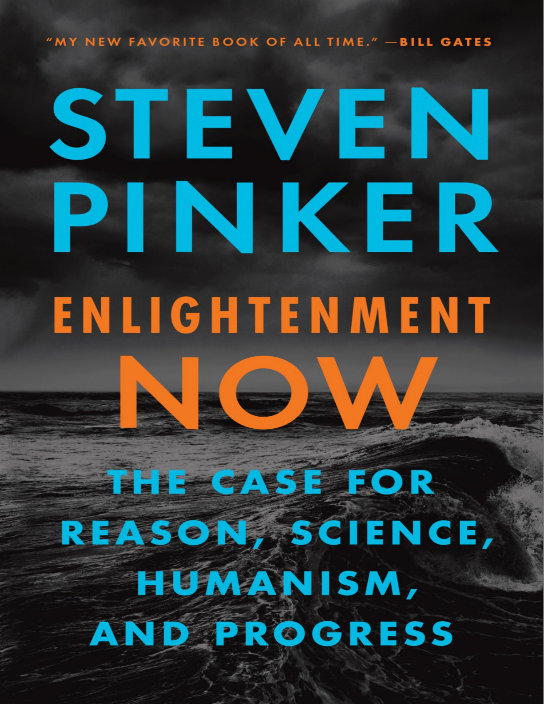
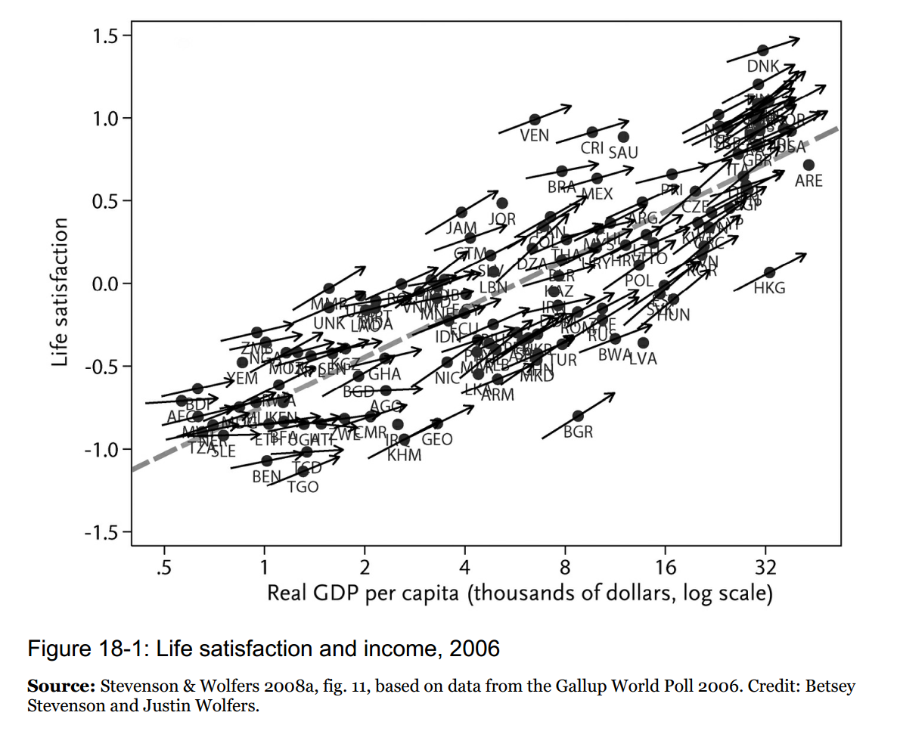
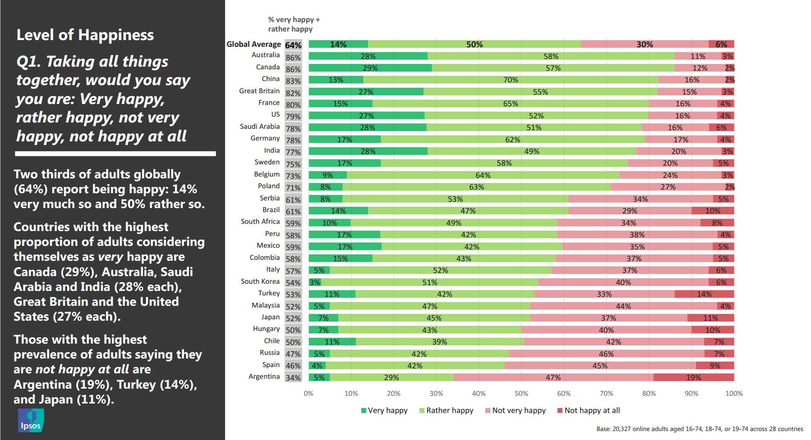
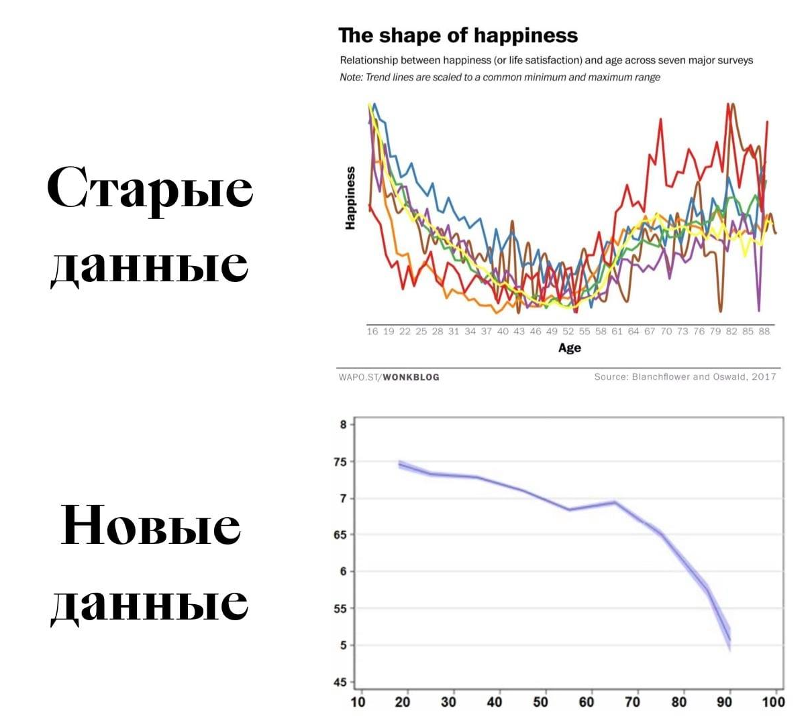

# Теории счастья и богатства

Может показаться, что в таком мире, где нужно ежедневно заново вырабатывать новую стратегию и тем самым выбирать, кем ты будешь (новый метод работы — новая роль, требует нового мастерства!), а большинство проектов ещё и будут заведомо провальны, жить будет невыносимо нервно и люди будут несчастливы. Это и так, и не так: **со счастьем субъективно будет «как всегда»**, но при этом общий уровень жизни будет расти! Посудите сами: «выгорание» ещё лет двадцать назад не существовало, это было просто «очень лень работать», а сегодня «выгорание» рассматривается как уважительная причина увольняться. Увольняться «в никуда» от нежелания работать на нелюбимой работе можно теперь себе позволить, этого массово раньше не было, мир стал неизмеримо богаче!

Научных исследований по счастью достаточно много. Подробный исторический обзор того, что происходит со счастьем в разных странах приводится в книге Стивена Пинкера 2018 года «Просвещение сегодня. В защиту разума, науки, гуманизма и прогресса»[^r7-1].

Основное содержание книги посвящено тому факту, что в эпоху Просвещения начался стремительный прогресс человечества, и он с тех пор не прекращался и привёл к существенному повышению уровня жизни человечества. Но принесло ли это счастье? Вот как там начинается глава 19, которая так и называется — «Счастье»:

*Американец в 2015 году по сравнению с аналогичным полвека назад живёт на девять лет дольше, образовывается на три года больше, получает дополнительных $33000 в год на члена семьи (только треть из которых, а не половина как раньше, уходит на необходимое для жизни) и имеет дополнительных восемь часов в неделю на досуг. Он или она могут провести это досуговое время читая интернет, слушая музыку на смартфоне, просматривая фильмы на телевизоре высокого разрешения, разговаривая с друзьями или родственниками по скайпу или обедая тайской едой вместо жареных мясных консервов.*

*Но если руководствоваться распространённым впечатлением, сегодняшние американцы не в полтора раза счастливей (как они могли бы быть, если бы счастье определялось по доходу), или на треть счастливей (если бы счастье определялось по образованию), или даже на восьмую часть счастливей (если счастье определялось бы по продолжительности жизни). Кажется, люди жалуются, стонут, плачут, придираются, ноют столько же, сколько всегда, а пропорция американцев, которые сообщают социологам, что они счастливы, остаётся постоянной десятилетиями.*

Дальше рассматривается само понятие «счастье», и оказывается, что оно само по себе довольно бессмысленно — усредняется по многим другим показателям, как «средняя температура по больнице», когда часть с нулевой температурой в морге, а часть в реанимации — но в целом температура нормальная! «Счастье» само по себе имеет мало смысла, нужно сразу уточнять, что имеется в виду. Так, слово «счастье» используется для сразу двух разных характеристик: обозначения кратковременного эмоционального состояния, настроения веселья и безмятежности, но также и для более-менее рациональной оценки долгосрочной (день или даже жизнь) характеристики качества жизни.

Социологи нашли, что люди плохо различают счастье, удовлетворённость жизнью, а также простое предпочтение широко понимаемой «жизни получше» против «жизни похуже», не говоря уже о wellbeing/благополучии, а то и вообще понимаемом как «самочувствие» или вовсе уж абстрактное «процветание». Да ещё оказывается, что долгие периоды качественной жизни, полной смысла и оцениваемой в этом плане очень положительно, не связаны с постоянным ощущением веселья и безмятежности, ибо какая уж тут безмятежность, когда ты тяжело работаешь? Зато потом есть что вспомнить, и это очень приятные воспоминания, ибо твоя жизнь в этим моменты была полна смысла, да ещё и принесла много важных результатов! А вот какая-нибудь вечеринка с друзьями, где ты вроде как бы был абсолютно счастлив несколько часов подряд — вот она даже не запомнилась, забыта через неделю!

Но и этих странностей мало для понятия «счастье». Пинкер приводит вот такой график:

На этом графике доход на душу населения в разных странах приводится по логарифмической шкале и очень чётко видно, что в каждой стране богатые счастливей бедных (угол наклона стрелки каждой страны показывает корреляцию), но уровень счастья в каждой стране сильно отличается, и люди с одинаковым доходом в разных странах счастливы абсолютно по-разному просто от того, что речь идёт о другой стране!

Оказывается, ответ на вопрос «счастливы ли вы» (и обратите внимание, что на графике речь идёт об «удовлетворении жизнью», это не совсем «счастье», меньше похоже на эмоцию) зависит больше от страны, в какой задаётся этот вопрос, чем от величины собственного богатства!

Вот ответ на вопрос о счастье в проведённом агентством Ipsos опросе по удовлетворённостью жизнью в 28 странах в августе 2019 года[^r7-2]:

В Австралии 86% чувствуют себя счастливыми, а вот в России — 47%, вдвое меньше. Но почему люди так себя ощущают? В разных странах в среднем по разным причинам. Во всех странах причиной ощущения счастья называют хорошее здоровье и физическую форму, наличие детей, отношения в супружестве, ощущение того, что жизнь имеет смысл, а также ощущение безопасности и защищённости от всяких рисков. Но в некоторых странах по-другому. Скажем, в Перу и Турции 87% населения считают, что источником счастья является признание тебя со стороны других людей успешным человеком. В Малайзии и Саудовской Аравии для 86% населения наибольшее ощущение счастья приходит от религии и духовных практик.

Важно, что благосостояние на Земле постоянно растёт. Люди со временем богатеют, и в последние годы человечество богатеет очень быстро. То есть жизнь ускоряется, люди при этом становятся богаче (впрочем, всё это ускорение как раз и приносит новые цивилизационные блага). Растёт здоровье людей, это во всех странах ведёт к большей удовлетворённости жизнью. Но вот даже наличие детей в одних странах коррелирует с тем, что человек-родитель чувствует себя более счастливым, чем бездетный, а в других странах — ровно наоборот!

Но и это не последняя проблема со «счастьем». Само понимание счастья раньше и сейчас изменилось, и что вам кажется «полным счастьем» сейчас, может не показаться счастьем в будущем. Раньше «я не могу себе позволить мобильник», а теперь «я не могу себе позволить быть без мобильника, это только по-настоящему богатые и беззаботные люди бравируют, что они могут не быть постоянно на связи» и вдруг это переходит в «я уже не делаю звонки, но вынужден быть постоянно на связи, сижу в чатах, просвета не видно, я устал». Сейчас добавляется ещё и нежелание ходить на работу, работать только удалённо, чтобы спокойно воспитывать детей и путешествовать, а не по восемь часов торчать в офисе, ещё час тратить на обед где-то далеко от дома и затем тратить ещё час-два на дорогу туда-назад.

Восприятие счастья меняется со временем, у разных поколений оно разное. Так, раньше самые разные исследования показывали, что с возрастом счастье растёт. Современные исследования показывают, что с возрастом счастья становится меньше[^r7-3]:

Как поднять счастье? В 2006 году было исследование[^r7-4], что уровень счастья не зависит от денег, начиная с какого-то не слишком высокого уровня дохода. Но в прошлом году провели ещё исследования, и выяснили, что чем больше денег, тем больше ощущение собственного благополучия[^r7-5]. И это тоже новый тренд, тут тоже всё меняется: в прошлом веке счастье действительно меньше зависело от дохода! И уже понятно, что ответ на вопрос зависит даже не от дохода, а от страны проживания и от возраста!

Так что понятие «счастье» меняется со временем, точно так же, как и понятие «здоровья» (медики давно уже признают, что «здоровье» определяется «социально-биологически», а не чисто «биологически», подробней об этом будет рассказано в руководстве по инженерии личности при обсуждении психологии и психотерапии).

Счастье зависит главным образом от генетических факторов (вообще восприятие мира существенно зависит от генетических факторов, поэтому восприятие неудовлетворённостей собой и миром тоже генетически определено[^r7-6]), но частично и от характера[^r7-7] (на 50%[^r7-8] или на 80%[^r7-9] — это не договорились). Характер тоже зависит от генетических факторов, особенно в детстве, но чем старше человек, тем больше этот характер можно менять — хороший характер, как ни странно, можно как-то выучить, хотя победить можно и не всё генетически заданное, и этот характер повиляет на ощущение счастья — не полностью, но всё-таки хоть как-то.

Но это всё статистика, «в среднем по планете», как ощущение счастья зависит от страны, возраста и дохода у вас, какие у вас убеждения по поводу счастья и что у вас с генетикой на этот счёт — неизвестно. Но **легко предположить: если вы ничего не будете делать, ничего существенного не будете предпринимать — у вас не будет ни дохода, ни счастья.**

Можно дальше обсуждать, насколько понятие «счастье» применимо к компаниям, к работающим в этих компаниях людям. Например, Amazon считается компанией, которая жёстко эксплуатирует своих сотрудников. Правда ли, что они от этого несчастны? А почему они, если всё так плохо, не уволятся? То есть сотрудники компании Amazon оценивают не-работу-в-ужасной компании как ситуацию более плохую. То есть они более счастливы в работе на «эксплуататора» Amazon, чем оценивают свою счастливость в ситуации, когда работать на Amazon не надо! Идеальной ситуацией для любого работника было бы просто получать деньги и ничего не делать (экономисты тут говорят об отрицательной пользе труда), но этого не бывает. Поэтому люди и их организации просто обязаны как-то рисковать на каждом такте бесконечного развития, прыгать с камушка на камушек с заранее неизвестным долгосрочным результатом, ввязываться в какие-то проекты, встраиваться в цепочки создания, что-то предпринимать, трудиться.

Без неизбежного принятия риска ввязывания в провальный проект и выполнения каких-то работ никакого счастья не получится, ибо будущее всегда покрыто туманом: заранее нельзя выяснить, успех или неудача, удовлетворение или разочарование будет в итоге любого вашего действия, всего на свете не просчитаешь. Но **если ничего не делать** **и «плыть по течению» лёжа в кровати, то гарантированно придёт неприятный сюрприз от окружающей среды, а ресурса на предотвращение его последствий не будет.**

Так что лучше не задаваться вопросом «буду ли я счастлив в будущем», а задаваться какими-то другими, более определёнными вопросами.

Так, во всех исследованиях счастья отмечается, что существенная составляющая ощущения удовлетворённости жизнью — это осмысленность существования, понимаемая чаще всего как преодоление каких-то неприятностей, помощь другим людям, достижение каких-то целей. Какие-то (понятные! достижимые!) цели нужно ставить, их нужно достигать — и это даст осмысленность жизни, что ведёт к долговременной составляющей ощущения счастья. Да, это не счастье-веселье, эйфория от момента. Но это счастье хорошо прожитой жизни, удовлетворённости жизнью. И эта цепочка проектов не обязана быть одним проектом, одним большим днём сурка. Вы вполне можете разнообразить жизнь, не застревать в одном деле (да вам жизнь и не даст застрять надолго). В некоторых культурах ценность жизни так и определяется — сколько разных впечатлений получил за жизнь человек. Если это не десятки лет самых разных трудовых впечатлений, а одно и то же впечатление, повторяющееся десятки лет — не факт, что это счастливая жизнь, хотя факт, что спокойная.

Если вы (и как человек, и как компания/организация) действуете, если ввязываетесь в разные проекты, то статистически время от времени вам должно везти, равно как часто будут и неудачи — как из-за ваших ошибок, так и просто из-за никак не зависящих от вас причин. При этом нельзя как ожидать, что вам удастся быть существенно счастливей, чем чувствуют себя люди в вашей стране, так и нельзя ожидать, что вы будете существенно несчастней!

Впрочем, можете постоянно бездельничать — выживают сейчас и неработающие нищие (бездельничать — это такая трудная, но работа!), и даже морские свинки, ибо они «миленькие» и их соглашаются кормить просто за то, что они есть, такие глупые и нелепые. Привыкнете и к одному, и к другому. Выбор за вами.

Но всё-таки: что с богатством? Как связано вечное развитие с богатством? **Вот вы развиваетесь, становитесь очень умным — станете ли вы богатым, и поднимет ли вследствие этого развитие уровень вашего счастья? Скорее всего — нет. Исследования (в том числе компьютерное моделирование)**[^r7-10] **показывают, что богатство таки даётся случаем, и если человек минимально умён, чтобы не профукать свой шанс, то он будет богатеть. Богатство людей различается в миллионы раз (сто миллиардов долларов против ста тысяч долларов — это ведь как раз миллион), а умность людей на сегодняшний день различается не так сильно (особенно если сравнивать с маленькими детьми или животными, не только образованных взрослых друг с другом).**

Вычислительные модели удивительно точно воспроизводят реальные данные, когда допускается влияние случая на успех или неуспех затеваемых людьми проектов. Самые богатые — это просто удачливые люди, которые оказались вовремя на нужном месте и не профукали свой шанс, возможно не профукали свой шанс неоднократно, они необязательно самые умные. Но они и не самые глупые. Самые глупые просто прозевают свою удачу, не заметят её. **Представьте, что вы выросли в джунглях и попали в современный город: вы не закончили школу, не закончили университет. И вы даже вождь** **племени! Станете ли вы богатым?! Вряд ли. Рецепт богатства в этом случае будет «сначала подучиться, а там посмотрим».**

И это **хороший ментальный приём: представлять себя дикарём только из джунглей** **(ваши знания десятилетней давности, они бесконечно стары!)** **пытаться сориентироваться — что сейчас происходит в мире, пока я был в джунглях? Что изменилось вокруг, пока я был погружён в** **джунгли** **текущего** **своего** **проекта** **и не успевал поднять голову и оглядеться? Что я не понимаю в происходящем, что нового умеют окружающие меня люди? Чем я мог бы в этом новом мире заняться, чтобы преуспеть?**

В любом случае: если вы не учитесь (не всему подряд! Только тому, что увеличивает дальше возможности!), то вряд ли станете миллионером. Хотя стать миллионером и даже миллиардером может помочь случай, например — получите наследство. Но если учитесь — вполне можете стать миллионером, заработать миллионы. Стать миллиардером, становясь умнее и умнее — это уже не получится, тут должна сопутствовать удача. **Миллиардеров довольно мало, а умных людей — очень много. Компаний-единорогов (с капитализацией выше миллиарда долларов) мало, а самых разных больших, средних и маленьких компаний с очень талантливым руководством — очень много. Трезво оценивайте свои шансы!**

[^r7-1]: <https://www.amazon.com/Enlightenment-Now-Science-Humanism-Progress-ebook/dp/B073TJBYTB/>

[^r7-2]: <https://www.ipsos.com/sites/default/files/ct/news/documents/2019-08/Happiness-Study-report-August-2019.pdf>

[^r7-3]: <https://www.facebook.com/kapterev/posts/10222689292514882>, <https://psyarxiv.com/d8f2z/>

[^r7-4]: <https://www.princeton.edu/news/2006/06/29/link-between-income-and-happiness-mainly-illusion>

[^r7-5]: <https://newscenter.sdsu.edu/sdsu_newscenter/news_story.aspx?sid=78079>

[^r7-6]: <https://www.tandfonline.com/doi/full/10.1080/17439760.2024.2387340#abstract>

[^r7-7]: <https://www.researchgate.net/publication/338635936_Predicting_psychological_and_subjective_well-being_from_personality_A_meta-analysis>

[^r7-8]: <https://replicationindex.com/2024/07/01/nuisances-in-personality-and-wellbeing-research/>

[^r7-9]: <https://psycnet.apa.org/doiLanding?doi=10.1037%2Fpspp0000501>

[^r7-10]: Talent vs. Luck: The Role of Randomness in Success and Failure, <http://arxiv.org/abs/1802.07068>
