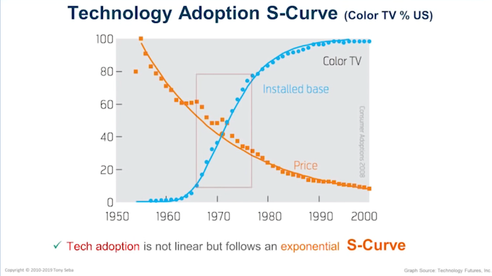
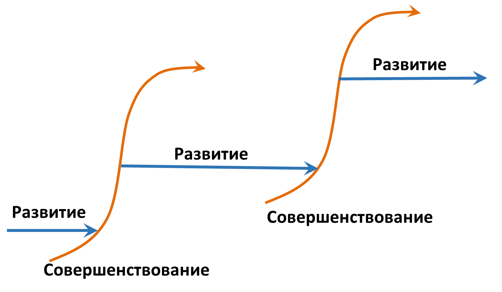
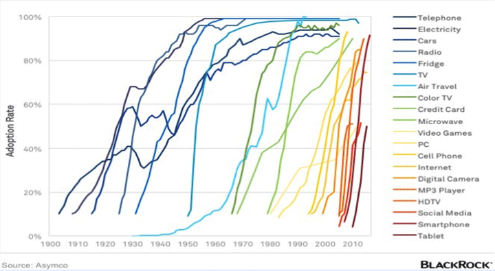

# Подрыв подо всей цивилизацией сразу: экспоненциальные технологии и конвергенция

Disruption technologies принято переводить как **подрывные технологии**[^r7-1] — это такие технологии (методы работы!), которые закрывают одни отрасли и открывают другие. Типичная такая цепочка — это технология проводного, а затем радио телеграфирования важной информации, которая была подорвана технологией проводной телефонии, которая был подорвана технологией сотовой телефонии, которая была подорвана технологией смартфона с упором не на звонки, а на передачу данных, а дальше через чаты происходит возврат к «телеграфу», звонки же всё больше — групповые видеозвонки. Восковые валики для записи звука заменились на виниловую аналоговую грамзапись, потом она стала записью на цифровые CD-диски, а потом и вовсе превратилась в сетевые музыкальные сервисы и соединилась с технологией сотовой уже не телефонии, а передачи данных на смартфонах. Гибкие магнитные диски появились, уступили место «флешкам» буквально на несколько лет, а затем и флешки исчезли из употребления, данные передаются через облачные сервисы.

Каждый такой «подрыв» — это исчезновение одних массовых видов работ, требующих мастерства в уходящей технологии и приход новых видов работ, требующих мастерства в приходящей технологии. Десятки и сотни тысяч людей, а то и миллионы занятых в подорванных технологиях вынуждены были переучиваться. Сейчас это происходит с нарастающим масштабом и увеличивающейся скоростью.

Кто помнит извозчиков? Буквально за 13 лет с 1900 по 1913 год гужевой транспорт в Нью-Йорке был заменён автоперевозками, с чего Tony Seba и начинает свою серию презентаций в 2014 году[^r7-2], которую потом он повторял и уточнял вплоть до 2020 года, когда тренд с электромобилями стал уже всем очевиден[^r7-3]. Но это в мегаполисе, в Нью-Йорке. А в целом по США с 1910 по 1920 всего за десять лет доля пассажиро-километров на автомобилях была поднята с 11% до 81%. Для этого была построена автомобильная промышленность, развёрнуты производство бензина и сеть автозаправок — и это в то время, когда страна отвлекала ресурсы на участие в первой мировой войне.

Лучшая на сегодня бизнес-теория техно-эволюции (то есть объяснение «где деньги во всём этом бурном прогрессе») создана Tony Seba. Вам нужно просмотреть его короткие видео, которые вышли в конце 2022 года[^r7-4], и дальше обратиться к его книгам (они упоминаются в этих видео, хотя не ожидайте там какого-то очень точного рассказа: как бы ни был прозорлив Tony Seba, предсказать будущее не может и он, тем более что затронуты оказываются все сферы жизни).

Истории подрыва/disruption можно рассказывать о секретарях-машинистках и машинописных бюро. Об операторах ЭВМ в эпоху мейнфреймов. Веб-мастера на старте интернета просуществовали буквально несколько лет. Из массовых профессий буквально сейчас стремительно уходит профессия кассира, магазины без кассы в мире уже появились и потихоньку распространяются, одновременно безналичные расчёты резко сократили затраты времени нынешних кассиров, стало больше «касс самообслуживания» — и кассиров на кассе теперь нужно меньше при сравнимой длине к ним очереди (очередь из трёх человек раньше в крупном магазине была к каждому из двадцати кассиров, а сейчас — к трём). Хотя и это меняется: если речь идёт о методах/технологиях/культуре торговли, то в крупных и даже мелких городах магазинная торговля постепенно перемещается в торговлю через маркетплейсы и службы доставки (в пункты доставки с примерочными, а то и сразу к двери — решена проблема «последней мили» в дистрибуции).

Так что мастерство телеграфистов, мастерство кассиров, как и мастерство работы по всем остальным методам оказывается применимым ограниченно по времени.

Можно ли назвать «профессией» занятость, приходящую и уходящую буквально за несколько лет? Скажем, в 2023 году начали говорить о профессии prompt engineering[^r7-5] как профессии создания запросов к несовершенным ещё системам AI. В 2024 году вышла ChatGPT o1, где прямо говорится, что не нужно заботиться о промптах — оказалось, что prompt engineering легко автоматизировать. Профессия умерла, просуществовав буквально год-другой. Мастерство prompt engineering оказалось не нужным, как и мастерство телеграфиста. Не все извозчики стали таксистами, да и жизнь таксистов сейчас резко меняется. Навигаторы и «уберизация» (маркетплейсы такси-сервисов) резко обесценили специфическое мастерство таксования, быть таксистом — это может быть уже не профессией на много лет, а просто «подработкой». А на горизонте уже роботакси, таксисты-люди оказываются не нужными.

Занятость каким-то делом, даже если речь идёт о мастерстве в этом деле, назвать «профессией» нельзя. Это просто «занятость», практикование какого-то мастерства, выполнение в течении какого-то времени (но не всю жизнь) работ по какому-то методу. В долгой жизни можно стать мастером во многих деятельностях, но необязательно каждый вид своего мастерства называть «профессией».

То же самое относится и к фирмам: ни одна фирма не может гарантировать себе «профессию» на долгие годы. Время от времени фирмы делают вираж/pivot, полностью меняя технологии, в которых они мастера. Для стартапов («молодых» фирм) этот «вираж» вроде как норма, но это же норма и для крупных фирм. Конечно, эти «виражи» болезненны: не факт, что новое мастерство окажется востребованным, а ещё коллектив фирмы, который хорош в одном уходящем в прошлое мастерстве, может иметь недостаточно хорошее мастерство, чтобы конкурировать на новом рынке. Kodak с фотоаппаратами, IBM с персональными компьютерами, Nokia с телефонами: все эти фирмы как-то выжили, но не смогли удержать лидерство в ходе перехода на новое поколение технологий.

Технологические подрывы и связанные с ними сценарии вынужденного переучивания миллионов людей, вызваны одной и той же причиной: экономикой экспоненциальных технологий. В **экспоненциальных технологиях** цена реализации технологии какой-то системой (технология — функция, реализует функцию какая-то система. Помним, что нет бега без бегуна) нелинейно (в полтора-два раза за год, что ведёт к эспоненте) падает.

Поскольку цена реализации какой-то функции (то есть цена соответствующих систем, реализовывающих функцию, а в случае сервиса — цена работы этого сервиса) падает по экспоненте, то изделия и сервисы, реализующие необходимую функцию/«метод работы»/технологию начинают покупать в больших масштабах. Если поездка на такси будет стоить вам месячной зарплаты — вы не поедете, разве что это будет вопрос жизни и смерти, ехать в больницу. Если поездка на такси будет даже дешевле, чем поездка на автобусе (а роботакси вроде как обещают именно такое) — то вы поедете на такси, а не на автобусе. Для дешёвых технологий находится неожиданно много применений: те, кто не пользовался ими задорого, вдруг готовы пользоваться, если они подешевели.

Распространённость новой технологии следует закону S-образной кривой, в которой есть участок буквально взрывного, экспоненциального роста распространённости — а потом просто становится некому продавать, все уже имеют эту технологию. Но тут обязательно появляется новый «неожиданный» подрыв — и всё повторяется: сначала дорого и у немногих, потом очень дёшево, при этом — у всех. Кривая падения цены — экспонента (всегда есть, куда падать в цене ещё ниже), а кривая распространения технологии — логистическая, она же S-curve (выходит на плато, ибо становится уже некому продавать — у всех, кому потенциально надо, доступ к технологии уже есть).

**Ничего линейного в будущем нет, это цепочка «неожиданных» (хотя** **вы должны это ожидать!) экспоненциальных подрывов — и в каждом таком подрыве есть период с «ничего вроде не происходит» с последующим периодом «неожиданно всё стремительно».** **Вкладываться в устаревшую технологию становится неправильно по чисто экономическим соображениям,** **и происходит шаг развития — переход к новой технологии, у которой совершенно другой потенциал развития.**

Это и есть техно-эволюция видов систем, причём всё происходит быстро за счёт того, что мемом (информационные модели систем для работы по новым технологиям, по этим информационным моделям в автоматическом режиме изготавливается огромное число воплощений описанных систем с определяемым этим мемомом феномом) отделён от целевой системы, и в нём идут умные мутации, а не происходит медленная дарвиновская биологическая эволюция.

Главное тут то, что самые разные «экспоненциальные технологии», каждая с каким-то своим «законом» (то есть коэффициентом к экспоненте, чаще всего этот «закон» называют по имени инженера, определившего этот коэффициент) кратного падения цены за год складываются вместе в одной результирующей технологии, и в этот момент начинается подрыв: эта технология стремительно распространяется, её использование в силу дешевизны вырастает кратно в год.

На картинке показана скорость распространения новых технологий. Видно, что чем позже появляется технология, тем быстрей она распространяется. Скажем, технология смартфонов от телефонов отличается тем, что главной становится передача данных, а не голосовая связь. Косвенный признак тут — смена тастатуры на дополнительную площадь экрана, при этом ещё и рост размера телефона, чтобы увеличить площадь экрана. Последние телефоны были «чем меньше, тем лучше», а смартфоны хорошо продавались большие, «лопаты».

Первый успешный смартфон (iPhone) появился в 2007 году. Первый планшет (iPad) — в 2010 году.

Почему iPhone появился в 2007 году и имел сразу такой успех? Потому что в этом продукте сошлись множество других экспоненциальных технологий (для каждой технологии говорим о системе, которая даёт эту технологию):

* экспоненциально падала стоимость технологии вычислений (транзистора в чипе — закон Мура[^r7-6]),
* хранения информации (бита во внешней памяти — закон Кридера[^r7-7]),
* цифровой фотосъёмки (числа пикселей в матрице камеры — закон Хенди[^r7-8]),
* передачи данных (закон Баттера[^r7-9]),
* а ещё дешёвый сенсорный экран высокого разрешения,
* дешёвые литий-ионные аккумуляторы (падение цены на 10-15% в год, это тоже экспонента),
* GPS (спутники в эксплуатации с 1978 года, но речь идёт о дешёвых чувствительных приёмниках),
* датчики акселерометра и гироскопа (акселерометр на лунном модуле Apollo весил 15кг, в смартфоне вес этих датчиков пренебрежимо мал).

И когда всё это стало достаточно дешёвым и слиплось в один продукт за $600, он «взлетел». Помним, что Apple пыталась запустить до iPhone абсолютно инновационный наладонный компьютер Newton, это был 1993 год[^r7-10]. Ничего не получилось: технологии уже все были в наличии, но слишком дорого стоили. Особенность тут в том, что в сложных новых продуктах стремительно дешевеющих систем, реализующих разные технологии — много. При этом дешевеют системы, но задействование метода, реализуемого системой тем самым становится дешевле. Поэтому говорят также и об экспоненциальном подешевении технологии. В какой-то момент цена самых разных систем для составляющих какой-то технологии падает в разы, так что стоимость итогового продукта для технологии падает (неожиданно для всех) в разы — и дешёвый продукт мгновенно разлетается по планете, делая «вдруг» доступной ранее повсеместно недоступную технологию.

Через пару лет после появления смартфона в 2009 году появился Uber, он предложил бизнес-модель заказа такси с использованием смартфона и облачных вычислений, и через 7 лет (в 2016 году) число заказов через Uber стало больше, чем во всех таксомоторных парках США. Через 8 лет (в 2017 году) Uber и Lyft с начального нуля получили 20% от всего объёма перевозок (в милях) в таких городах, как Сан-Франциско и Нью-Йорк. А в декабре 2020 Uber продал своё подразделение автопилотируемых автомобилей[^r7-11] — там уже несколько лет ожидалось экспоненциальное развитие, но его не случилось! Самоуправляемые/беспилотные/автономные автомобили находятся пока на начальной стадии S-образной кривой. А потом? А потом, через несколько лет будет традиционное — «ах, когда же это всё успело произойти?!». Разговоры вдруг станут реальностью, и ключевое тут будет слово «вдруг», ведь роботакси без водителя уже доступны широкой публике, но их распространение сдерживается именно тем, что они пока очень дорогие, их эксплуатировать невыгодно[^r7-12]. Но в какой-то момент они распространятся «вдруг», экспоненты работают «внезапно».

Эти нелинейности и неожиданности моментов использования одних технологий в составе других и последующего стремительного распространения появляются за счёт чисто экономических причин: экспоненциального падения стоимости новаций, и массовых закупок вдруг «внезапно» подешевевшей технологической роскоши. Тут нет никаких «планов развития инноваций» от правительств, или ещё каких-то других конспиративных теорий, реализации чьих-то долгосрочных планов. Кто мог предсказать появление смартфонов и дата-центров по приемлемой для широких масс цене? Кто мог без этих дешёвых смартфонов и дешёвых дата-центров сделать аналог Uber?

Никакие эксперты не в состоянии предсказать будущее: каждая из технологий неочевидным образом снижает цены и делает доступными огромному количеству людей те технологии, в состав которых они входят. А если и не снижается цена, то при той же цене можно получить характеристику в разы лучше. Пять лет назад за $2000 можно было купить ноутбук с 8Gb памяти, 4 ядрами процессора и FullHD дисплеем. Сегодня за ту же сумму можно купить ноутбук с 32Gb памяти, 8 ядрами процессора и 4К дисплеем. И ещё там будет 1Tb твёрдотельный «диск» (который уже давно не диск!) и отдельный ускоритель для графики и AI. Такие ноутбуки, какие были 5 лет назад, стоят $1000, вдвое дешевле, а то и меньше. «Вдвое за пару лет» гласит закон Мура по поводу числа транзисторов на микросхеме — это начальник службы исследований и разработки компании Fairchild Semiconductor Гордон Мур сформулировал ещё в 1975 году, он предположил тогда, что так будет ещё лет десять. Но это было полвека назад! Сейчас скорость падения цены по закону Мура немного уменьшилась, но закон до сих пор продолжает действовать. И даже «вдвое за четыре года» вместо «вдвое за два года» — это тоже экспонента, и это тоже очень быстро!

Tony Seba называет склейку разных экспонент в одном продукте **конвергенцией**.

**«Подрыв подо всей цивилизацией» происходит из-за конвергенции самых разных технологий в одной.** Так, в автомобилях происходит конвергенция

* технологии аккумуляторов с созданием гигафабрик для их выпуска (и поэтому становятся возможными электромобили),
* технологий автопилотирования, требующих развития как аппаратных средств искусственного интеллекта (специальные компьютеры с ускорителями для умножения матриц), так и развитых нейросетевых алгоритмов,
* технологий ориентации автомобиля в пространстве с задействованием лидаров,
* технологий замены алгоритмов автомобиля через интернет, не надо приезжать на станции техобслуживания.

Быстрое распространение подрывных технологий можно очень приблизительно разделить на следующие стадии[^r7-13]:

* **стандартизация** (standardization, возникновение промышленных стандартов, позволяющих организовать встраивание новой технологии во внешние системы). Если вы обнаружили перспективную технологию, в которой ещё нет стандартов, то вам повезло: вы близки к началу её распространения.
* **удобство использования** (usability, обеспечение удобного интерфейса к технологии, иногда речь идёт о «ключевом приложении», killer application)
* **переход в массовое потребление** (сonsumerization)
* **переход в инфраструктуру** (foundationalization, «изо всех утюгов», «потребление незаметно». Основная характеристика инфраструктуры — это повсеместность, доступность в любой точке, где возникла потребность).

В персональном компьютинге:

* сначала появились открытые архитектуры компьютеров (стандартизация),
* затем графические интерфейсы (удобство использования),
* потом они стали массовым потребительским товаром (доступны даже школьникам, новые форм-факторы — даже смартфон теперь компьютер),
* сейчас основной компьютинг идёт вообще в инфраструктурных организациях — дата-центрах.

Интернет в его современном понимании (как все его вебсайты, а не как сервера на протоколе TCP/IP):

* начался со стандарта HTML (стандартизация),
* затем появилось удобное его использование (разделение оформления и содержания страниц через стилевые описания CSS),
* затем появились социальные сети (Web 2.0),
* сейчас по факту интернет стал основой для большинства рабочих, промышленных и торговых коммуникаций, это инфраструктура, интернет повсеместен.

В AI:

* стандарты уже появились (первым был ONNX[^r7-14], сейчас их множество), удобство использования — это чат-интерфейсы и голосовые чат-интерфейсы (assistants), а также встроенность в различные специализированные моделеры (copilots).
* Массовое использование пока только намечается (по аналогии с интернетом это может быть ситуация, в которой специализированные AI создаются самими пользователями, а не специалистами, пока же это ещё очень дорогое занятие. Тем не менее, уже стали не нужны знания по prompt engineering),
* некоторое время ещё нужно ждать до инфраструктурности.

Эти все этапы довольно быстро (экспонента!) пробегаются самыми разными технологиями.

Какие факторы тут влияют на экспоненциальность? Разнонаправленные:

* Глобализация (обмен новостями через интернет, глобальные поисковые системы, свобода перемещений лиц и товаров, глобальные системы денежных расчётов, глобальный рынок инвестиций, наличие электронных переводчиков и так далее) существенно ускоряет распространение новых технологий в момент их появления.
* Деглобализация (Разделение интернета на анклавы, раздробление платёжных систем, закрытие рынков, ограничение транспортной доступности, ограничение доступа к SaaS и продукции отдельных фирм, ограничение на использование иностранных языков и так далее) замедляет распространение новых технологий в момент их появления. Этот тренд нельзя не учитывать, ибо архитектурно мир не может быть «всесвязным/безмодульным/однородным», это закроет дорогу к развитию мира. Мысль эта контринтуитивна, к ней сразу можно найти множество возражений, и речь идёт о каком-то оптимуме связности, а не полной противоположности (полной «развязанности», повсеместным «железным занавесам», ибо тогда не будет взаимодействия подсистем мира, не будет возможен системный эффект и его оптимизация). Это чисто архитектурное рассмотрение в его современном понимании, к нему надо отнестись серьёзно: подробности можно найти в наставлениях по архитектуре из руководства по системной инженерии: там рассказывается об архитектуре в её современном понимании, в том числе о необходимости нарезки системы на модули и оптимизации взаимозависимостей, и что бывает, если взаимозависимости не ограничивать. Увы, текущие ограничения глобализации не временные, они будут длиться неопределённо долго. Это не зависит от текущих конкретных горячих и холодных войн. Участники этих войн будут меняться, но вот хода на возврат к свободе перемещения товаров, информации, людей (глобализация) не будет. Нет, будут жёсткие интерфейсы с тщательными проверками того, что пересекает границы. Сами границы, конечно, будут меняться, там же конфликты между системными уровнями, как же без этого. Более подробное обсуждение можно найти в подразделах «Этические/политические проблемы естественной эволюции, которые можно решать инженерно» руководства по системной инженерии и «Системная этика» руководства по системному мышлению. Дополнительно надо посмотреть материалы об архитектуре сложных систем от John Doyle[^r7-15].

[^r7-1]: В отличие от breakthrough technologies, прорывных технологий, которые означают просто новинки, «то, чего раньше нельзя было сделать, и вот получилось».

[^r7-2]: Версия доклада 2018 года (видео 37 минут): <https://youtu.be/KVm74yE0aUE>, апдейт ситуации 2024 года в <https://ailev.livejournal.com/1723469.html>

[^r7-3]: А в 2021 году переключился на изменения в энергетике, они не менее драматические: на наших глазах стремительно исчезают угольные электростанции, шахтёры остаются без работы! Вот его видео: <https://www.youtube.com/user/tonyseba/videos>

[^r7-4]: <https://www.youtube.com/watch?v=z7vhMcKvHo8>, <https://www.youtube.com/watch?v=Vqs0_3M-18c>, <https://www.youtube.com/watch?v=fsnkPLkf1ao>, <https://www.youtube.com/watch?v=g6gZHbfK8Vo>

[^r7-5]: <https://en.wikipedia.org/wiki/Prompt_engineering>

[^r7-6]: <https://en.wikipedia.org/wiki/Moore's_law>

[^r7-7]: <https://www.scientificamerican.com/article/kryders-law/>

[^r7-8]: <http://llamasandmystegosaurus.blogspot.com/2014/05/hendys-law.html>

[^r7-9]: <https://en.wikipedia.org/wiki/Moore's_law> — на этой странице есть из закон Баттера, и ещё много подобных законов, похожих на закон Мура.

[^r7-10]: <https://ru.wikipedia.org/wiki/Apple_Newton>

[^r7-11]: <https://www.bbc.com/news/business-55224462>

[^r7-12]: <https://futurism.com/the-byte/waymo-not-profitable>

[^r7-13]: <https://arxiv.org/abs/1905.13178>

[^r7-14]: <https://onnx.ai/>

[^r7-15]: <https://ailev.livejournal.com/1622346.html>
