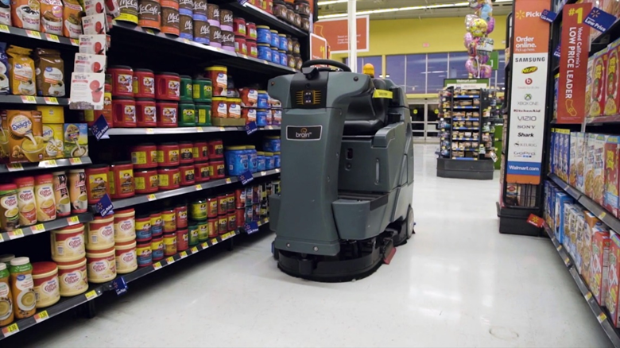
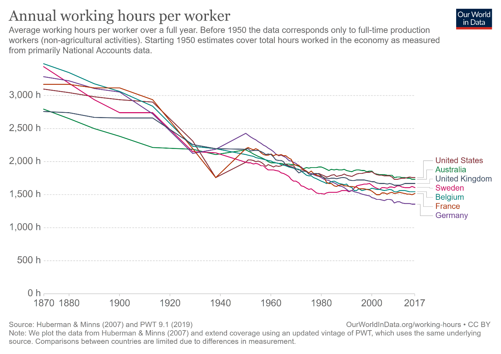

# Роботы заберут работу? Нет! Но работу/job/занятость надо будет менять часто.

Учитываем, что на первом месте отслеживаемых Tony Seba экспоненциальных подрывных технологий — машинный интеллект. Он занимает особое положение, потому как он может быть направлен на улучшение самого себя, «компьютерные программы, которые пишут компьютерные программы». После чего некоторые люди ожидают, что какие-то из этих улучшенных компьютерных программ могут получить самосознание «как у человека», но они будут умнее и одного человека, и даже всех вместе взятых людей, поэтому смогут «захватить мир». Многие даже разработчики систем AI включились в обсуждение возможных сценариев гибели цивилизации из-за слишком умного машинного интеллекта, правительства разных стран начали издавать законы, сдерживающие развитие технологий. Dell проектирует датацентры с ядерными реакторами для их запитывания, как раз под работу систем с искусственным интеллектом: ожидается нехватка электроэнергии для работы систем искусственного интеллекта, ибо чем больше времени и электроэнергии им дашь «на подумать», тем умнее они будут выдавать ответы — пока, как боятся некоторые разработчики (но не все!) не произойдёт гибели цивилизации. Элон Маск так вообще говорит, что люди не будут работать: любую их работу будут лучше делать роботы.

Мы даже не будем обсуждать тут вопросы безопасности систем AI, это всё равно как обсуждать вопросы безопасности людей: решения в этой сфере чаще всего иррациональны. Мы также не будем обсуждать типовое решение по «утрате работы людьми» — введение безусловного базового дохода (который понимается каждым произносящим этот термин по-разному, нет двух одинаковых пониманий, кроме того, что «откуда-то возьмутся деньги, их будут кому-то раздавать просто так»).

Tony Seba особо отмечает, что развитие машинного интеллекта не экспоненциально, а гиперэкспоненциально. Похоже, что он прав. **Использован машинный интеллект может быть так же, как и любой человеческий интеллект: везде, где используется интеллект людей. Интеллект универсален, нет закрытых от него сфер. Как эта гиперэкспоненциальная подрывная технология повлияет на мир, предсказать нельзя — как нельзя предсказать, как именно повлияет на мир интеллект естественный. Это покрыто туманом будущего.**

Изменения в мире произойдут стремительно. В древнем отчёте 2017 года от McKinsey в 2030 году ожидалось, что 400-800 млн. нынешних рабочих мест будут автоматизированы, труд на этих местах существенно изменится (читай: «исчезнет в его текущем виде»). Как раз о таких отчётах Tony Seba предупреждает в своих презентациях и книгах: **они недооценивают масштабы перемен в разы из-за неучёта экспоненциального характера затрагиваемых ими технологий.**

**Автоматизация к 2030 году коснётся миллиардов рабочих мест, хотя в мире население всего 8 млрд. человек. Помним, что в телефоны у миллиардов людей в кармане никто тоже не верил, в интернет у миллиардов людей в кармане тоже никто не верил, в автоматизацию труда миллиардов людей пока тоже не верят, а зря.** **Но проблески этой тотальной автоматизации видны уже сейчас.**

Важно, что автоматизация будет не только в области умственного труда (knowledge works), но и труда физического — грузчики, сборщики, водители, уборщики. Роботы готовятся сейчас двух видов: четвероногие (при этом вместо «головы» там может быть манипулятор) и антропоморфные, ибо вся сегодняшняя среда обитания приспособлена к физическим размерам человека. То, что роботов делают и четвероногих — это понятно, людям легче понимать, где и как могут быть задействованы такие роботы. Труднее сообразить, что дроны и «коптеры» — это тоже роботы. В этой области трудно приводить ссылки, ибо новости появляются практически ежедневно.

То, что сейчас говорят «цифровая трансформация», а иногда и «гиперавтоматизация», ничего не меняет: это всё маркетинговые замены термина, но суть дела остаётся: человеческий труд повсеместно заменяется машинным, как физический труд, так и умственный.

Скорость таких изменений надо учитывать и в личном стратегировании, и в корпоративном: если что-то связано с технологиями искусственного интеллекта, то развитие событий будет, скорее всего быстрее, чем ожидается.

Почему применяют роботов, а не людей? Часто не потому, что роботы не болеют, не уходят в отпуск, не спят, а работают быстрее. Нет, **роботы работают лучше, чем люди — часто настолько лучше, что делают недостижимое людьми (быстрее, точнее, меньше ошибок), плюс меньше отвлечений при решении рутинных задач и отсутствует время для отдыха. Это как замена землекопов экскаваторами, только в качестве землекопов выступают люди самых разных профессий.**

Вот уже довольно давняя история, января 2019. Тогда в Walmart вместо уборщиков вышли 360 роботов фирмы BrainOS, в апреле к ним добавили ещё 1500. **Эти роботы убирают лучше и быстрее, управляя обычными уборочными машинами**. Аргументы про то, что их не нужно часто нанимать и дополнительно учить (среди уборщиков в год меняется от 30% до 100% персонала. И всех этих новеньких нужно найти, нанять, обучить — с роботами этого не нужно, их покупка, ввод в эксплуатацию и настройка занимают меньше времени) оказываются вторичными! Ракеты не пилотируются людьми потому, что люди делают больше ошибок, а не потому, что автопилот не бастует и не болеет!

Чтобы покупатели не катались на автономных уборщиках Walmart, место водителя на них отгораживали в 2018 году жёлтыми ленточками[^r7-1]. А ещё 600 роботов BrainOS в 2022 вышли на работу по сканированию товарной выкладки[^r7-2]. Всего только на этой платформе роботов на конец 2023 года выпущено было 30 тысяч роботов-уборщиков, которые убирают площадь 3500 квадратных километров[^r7-3]. Если считать, что один робот заменяет одного человека (что не совсем так), то это небольшой городок уборщиков — но и убираемая площадь получается почти полторы Москвы (2511 кв. км), получается много, по 118000 кв. метров на одного робота. При этом на одной зарядке робот может убрать почти 3 тысячи квадратных метров. А ведь речь идёт только об одной робототехнической фирме и одном виде труда!

Уборщики — это далеко не единственный вид роботов в магазинах. Сами магазины становятся роботами (из них исчезают в том числе и кассиры, контролем наличия товара на полках занимаются роботы, и всё остальное тоже переходит к роботам)[^r7-4].

Это нормально, этого не нужно бояться. Ещё недавно 90% людей были заняты сельским хозяйством, а сегодня — именно благодаря машинам — осталось всего 3% «крестьян» (хотя работников современных ферм меньше можно назвать «крестьянами», они больше похожи на заводских работников по стилю их жизни и виду занятий). Несмотря на это, все высвободившиеся из сельского хозяйства люди оказались заняты, даже с учётом того, что число людей на Земле сильно подросло! Более того, и пролетариата, заводских рабочих, сегодня тоже не так много, как ещё полвека назад! А бедность, тем не менее, существенно в планетарных масштабах уменьшилась.

Основная ошибка рассуждений на тему «роботы отберут работу» в том, что **количество работы в мире не константа, постоянно появляется новая работа по мере вовлечения в деятельность людей всё новых ресурсов и бесконечного развития технологий.** Все эти заявления «роботы заберут работу у людей» — пугалки из ненаучной фантастики, фэнтези. Люди (а через некоторое время люди с машинами) придумывают себе и машинам всё новые и новые занятия вместо тех, от которых их освободили машины, сумма труда в мире с распространением каждой подрывной технологии только растёт. И прежде всего уходит самый тяжёлый, неблагодарный, опасный труд.

Есть ещё и резерв увеличения свободного времени, которое можно потратить и на просто отдых, и на развитие/образование: люди радуются, а не печалятся, что «электричество и машины отняли работу». Одну работу отняли, пять других дали!

Этот тренд на сокращение рабочих часов для нормальной жизни проявляется и в росте свободной занятости (freelance, gig economy, platform economy[^r7-5]) с использованием для поиска работы онлайн-платформ для самых разных видов мастерства. Есть даже платформы для оплаты меценатами чьих-то хобби (patronization). Если ты мастер в каком-то хобби, то тебе за это могут заплатить! Хобби и работа постепенно теряют чёткую границу между ними, спорт (демонстрация того, что человек не утратил качества обезьяны — быстро бегает, хорошо дерётся, далеко кидает тяжёлые предметы, умеет командой загнать никому не нужный мяч в ворота при противодействии другой команды, и т.д.) стал для профессиональных спортсменов работой, а для миллиардов людей развлечением — вместо чтения книг, просмотра художественных фильмов или хотя бы какой-то физической активности (бег трусцой, танцы). Киберспорт продолжает эту традицию и тоже стремительно профессионализуется. Шоу-бизнес — это тоже бизнес, это не художественная самодеятельность, это серьёзные деньги. Праздной публике в Риме, как мы помним, нужно было хлеба и зрелищ, игнорировать это нельзя. Чем больше избыток хлеба, тем (при отрицательной полезности труда, помним об этом из праксеологии как варианта методологии!) больше желание развлечений — и избыток средств люди будут тратить на это.

Сдвиги в занятости налицо, растёт сектор услуг — заговорили даже о «маникюрной экономике» (the manicure economy)[^r7-6], так назван очередной сдвиг массовых работ от офисной-распределительной к «грумингу»[^r7-7].

Это не первый такой сдвиг в занятости, мы уже упоминали, что раньше были сдвиги от заводской фабричной работы к современному состоянию увеличенной доли работы с высокой долей умственного труда, а ещё раньше — от крестьянской работы к заводской фабричной.

Количество маникюрщиц в мире за последние 20 лет увеличилось впятеро. Автоматизация потихоньку вытесняет текущие работы и уменьшает стоимость жизни. Люди могут позволить себе «выгорать» (то есть проявлять недовольство имеющейся у них работой настолько, что бросать её, не рискуя умереть с голоду) и заниматься тем самым грумингом как персонально оказываемыми услугами массажа, маникюра, банных и спа услугах, ароматерапии (при полном понимании, что это развлекательный ритуал и никто никого не лечит) и далее по всему списку подобных мероприятий. Массовое репетиторство тоже тут (а рынок ему создаёт, конечно, обязательный экзамен).

Маникюр начинает восприниматься как жизненная необходимость, причём он должен радовать, то есть быть разным. Надо иметь разнообразие лаков, но мелких упаковок «на один раз» нет, а кроме того, надо сошлифовывать предыдущий лак, что тоже делать самому неудобно, и вообще красить самому неудобно. Ногти быстро отрастают, раз в пару недель надо идти «на ногти» — и делать маникюр, при этом ещё и записываться, как к врачу, чтобы не стоять в очереди. Это породило даже мем:

Походы к психологу, массажисту, в спа — тот же тренд «персональных сервисов», люди делают груминг друг другу (в том числе и в мозгах). Есть несколько лет, чтобы рост маникюрной экономики продолжался, люди переходили с низкооплачиваемых работ, где контактируешь с оборудованием и материалом, но не людьми (типа «швея на фабрике» или вариант знаниевой работы «корректор в издательстве») на личное обслуживание друг друга. Только в США число рабочих мест в сфере ухода за кожей и профессионального макияжа выросло с примерно 14000 в начале нового тысячелетия до почти 70000 в 2023 году. Число рабочих мест в сфере маникюра выросло с менее чем 30000 до почти 150000.

В статье про маникюрную экономику дальше идёт список профессий с максимальным ростом занятости за двадцать лет. Там, конечно, есть машинисты метро и водители городских автобусов, равно как специалисты аэродромов и пилотов (транспортная сеть развивается), операторы по обслуживанию нефтяного и газового оборудования (нефть и газ всё-таки в основе энергетики, энерговооружённость растёт, в том числе и транспорта), и даже специалисты по надзору (compliance officers), но всё-таки это выглядит в табличке как исключение — они теряются среди массажистов, персональных финансовых советников и даже тренеров собак. По большому счёту, такси и курьеры — они тоже тут, работают по персональным заказам, «облечены доверием» и должны поддержать минимальную коммуникацию с клиентом, а не просто выполнить свою работу.

Этот тренд тоже недолгий, он будет перемолот двумя новыми технологиями:

* AI возьмёт на себя умственную часть работы, может даже развлекать клиента (разговоры с AI уже не редкость, рекомендательные системы для выбора сервиса делаются современными технологиями довольно просто — это проще, чем медицинская диагностика, а её делают уже не хуже врачей). С репетиторством тут ещё проще, эксперименты на эту тему идут вовсю, ибо программа экзаменов и что там нужно отвечать, хорошо известна, ошибки учеников тоже хорошо известны.
* роботы возьмут на себя физическую часть работы, в том числе и в маникюрном деле, при этом значительная часть работы уже выполняется даже не руками работника, а мелкими станочками, а маникюрные роботы[^r7-8] уже есть, им для распространения надо только подешеветь.

За среднеоплачиваемыми офисными работниками (в том числе линейными менеджерами) и даже высокоплачиваемыми инженерами тоже придут, конечно, но чуть попозже. Так, за двадцать лет потребность в работах вроде "бюджетный аналитик" уменьшилась на 40%, а в работах вроде авиационных и космических инженеров уменьшилась на 25% (данные из таблички всё в той же статье). Так что общий тренд тут — чем более высокооплачиваема работа, тем она оказывается стабильней (и часто она требует довольно плотных контактов с людьми), чем менее оплачиваема — тем больше от работы с чем-то неживым она оказывается переползающей к работе с людьми. Вот вам и рост soft skills — то есть умение не переругаться со всеми, а как-то наладить отношения.

Шутка: если вы занимаетесь личным стратегированием и пытаетесь понять, в получение какого мастерства вам надо инвестировать своё время, вам платят мало и вы мало общаетесь с другими людьми (скажем, вы сейчас инженер, который смотрит только в экран своего CAD), то подумайте о карьере массажиста, на некоторое время (пока не появится робот, который будет массажировать лучше вас, или другой инженер, который тоже переквалифицировался в массажиста, попутно получив медицинское образование) это поможет. И да, ещё надо будет научиться приятно общаться и самому хорошо выглядеть. При этом в этой шутке есть только доля шутки.

Чтобы в быстро меняющемся (иногда в корпоративном стратегировании говорят VUCA[^r7-9] — volatility, uncertainty, complexity, and ambiguity) мире найти своё место, надо понимать, как вообще устроены отношения людей по поводу коллективной работы. Много людей разных профессий и роботов с разными инструментами коллективно делают что-то чудесное, объединяя свои уникальные знания — как они договариваются? Как можно договариваться, а ещё лучше — договаривать всех этих людей между собой эффективней? Например, задействовать мастерство сильного мышления — мастерство рациональной работы, системного мышления, методологии, системной инженерии. Как быстро выучить себя и коллег новому мастерству? Задействовать мастерство инженерии личности. Как хоть что-то уже знать про устройство организаций и проектов, в которых надо будет участвовать, понимать происходящее не только на уровне ощущений и эмоций, но и хоть как-то рационально — это мастерство системного менеджмента. Да, это ровно содержание программы рабочего развития мастерской инженеров-менеджеров. Другое дело, что эта программа для тех, кто уже имеет высшее образование, а надо бы такому учить ещё в школе или (если уж в школе никак не получается) в вузе.

В любом случае, готовьтесь менять работы и проекты часто, это бег по тонкому льду, долго удержаться на одном месте уже невозможно, а будет ещё невозможней. Ещё пару десятков лет назад человека, который быстро перелетал с одной работы на другую, называли «летун». Сейчас такому уже никто не удивляется. Удачных проектов, которые развивают какие-то системы много лет — их мало, больше проектов, которые успевают выпустить лишь несколько версий удачной системы, и затем в эти проекты приходит сбоку новая технология, и либо проект разваливается, либо этим новым начинают заниматься новые люди (или новые роботы).

Главное мастерство (людей, роботов, организаций — это неважно) уже сейчас — выполнить стратегирование, найти и затем быстро освоить новый очередной вид работы (очередную технологию, метод, культуру, инженерный процесс, рабочий процесс). Тут надо ещё понимать, что кроме собственно инженерной части (уметь разобраться с каким-то станком/софтом, чтобы на нём получить нужный результат), надо будет становиться частью какой-то организации, много общаться — и с людьми, и с системами AI, и даже с целыми другими организациями (например, другими оргзвеньями, другими предприятиями, другими рабочими группами проекта) как целым. Ибо рабочие роли, где надо просто крутить ручку на знаниевом или физическом конвейере, не обращая внимания на происходящее вокруг с людьми и их постепенно автоматизируемым окружением, будут исчезать.

Людям придётся массово превращаться из условных одиноких волков в условных кошечек, которые вроде гордые и независимые, но зато крайне симпатичны и даже ласковы, чтобы их кормили. Кошечки, конечно, по большому счёту не нужны, это даже не собаки, которые могут быть служебными. Но без кота и без маникюрщицы жизнь не та, поэтому эти занятости востребованы. То есть достаточно быть ласковым и ухоженным, а также уметь ходить в туалет, а не под себя, чтобы быть прокормленным не хуже котов, а также быть прогулянным не хуже собак. Но **если хотите чего-то большего, придётся получить образование.**

**Образование** **(усиление интеллекта путём** **обученияинтеллект-стеку** **фундаментальных** **методов, мы** **занимаемся образованием и при обучении методологическому мышлению по нашему** **руководству)** **как подготовка к жизни означает не то, что вы получаете какую-то профессию (она всё одно пропадёт через год-другой), а то, что вы** **быстро** **справитесь со сменой** **занятости. Каждый год у вас будет как** **«выпускной»,** **снова «выход в жизнь»,** **снова «начинаем работать».**

При этом необразованных котов очень, очень неплохо кормят. И они крайне нужны, востребованы на рынке. Если верить данным производителя кормов и товаров для животных Mars Petcare, в 2021 году в России насчитывалось 40,8 млн домашних кошек и 22,6 млн собак. Такие животные были в 59% семей. А на маникюр и массаж ходят, даже если уже совсем сил не осталось, откуда и мем (хотя, конечно, не всё население ходит). Так что думайте: может быть, вам и не нужно хорошее образование с какими-то трудными hard skills типа умения разбираться с абстрактными неформальными и формальными описаниями методов (руководство по методологии). Классическое образование вообще когда-то учило мёртвым языкам, сейчас хотя бы живым языкам учат, хотя часть из них — языки программирования и моделирования. Эти языки программирования, моделирования, онтологизирования (иногда говорили «инженерии знаний») — про одно и то же, это языки описания алгоритмов, причём мы уже обсуждали, что алгоритмы выполнения компьютерами вычислений и алгоритмы выполнения создателями работ общего вида — это одни и те же алгоритмы. Получается, умение моделировать (в том числе моделировать методы/технологии/культуры) — это важнейшее умение, языками надо владеть в том числе и для того, чтобы выражать ими алгоритмы каких-то методов.

Но просто «быть умным» или даже «быть мудрым» явно не хватит для того, чтобы обрести стабильность. **Автоматизация и добычи хлеба, и добычи развлечений гарантирует вам частую смену работы: вам не удастся много и долго заниматься в жизни одним и тем же делом, даже если вы перешли работать из реального сектора в сферу развлечений, удерживаться на работе долго—** **это** **точно невозможно ни фирме, ни человеку!** Старая работа будет существовать некоторое время, а затем «неожиданно» подрываться и исчезать по самым разным причинам, приходящим «сбоку», поэтому и вам, и вашей (постоянно развивающейся, обучающейся новым рабочим процессам, новым технологиям, новым культурам производства, если она хочет уцелеть) компании нужно будет постоянно задействовать своё умение делать что-то новое.

**Нужно будет регулярно вписываться в новые проекты, занимать какое-то место в** **прежде чужих для вас графах** **создателей. Если вы этого не умеете, то придётся научиться, то есть приобрести какой-то уровень интеллекта как способности решать проблемы, которые раньше не встречались.** **Вы должны уметь разобраться со стратегией той организации, в которую попали и согласовать свою собственную стратегию с этой стратегией организации. И лучше бы вам это сделать как симбионту** **для этой организации, чем как паразиту.**

Подчеркнём ещё раз, что все эти рассуждения о неминуемой тотальной безработице и одновременно «многоработице» безмасштабны: они относятся к ролям личности, к личности в целом, а также к команде, коллективу (команде команд), организации в целом. Более того, это относится и к системам AI, и к роботам (проблемы роботов старых моделей, оказавшихся на свалке, очень частый сюжет в фантастике, но скоро это станет не фантастика. Сколько у вас дома оказалось вполне исправных телефонов и ноутбуков, которые просто устарели? Давно выкидывали последний такой? К вам и вашей организации это тоже относится: вы ведь тоже можете оказаться «старой моделью»).

Если организация вовремя не поменяла людей на машины, то конкуренты обязательно используют машины — и продукция организации будет или хуже, или более дорогой (или и хуже, и более дорогой одновременно). И при сопротивлении автоматизации (луддизм[^r7-10] разного сорта) людей всё равно придётся уволить, но уже может быть вообще всех в силу того, что компания разоряется и не может больше платить зарплату (в этот момент это «зряплата»), а не только тех, кого нужно было вовремя заменить роботами. **Если вы** **в компании** **много автоматизируете,** **причём** **больше, чем конкуренты, то парадоксально, но вы будете расти — скорее всего, вы будете не увольнять людей, а нанимать их.** **Но и это будет временно, вечный рост не гарантирован. В эволюции всегда так. Динозавры доминировали, но вымерли. Фирма** **Kodakбыла знаменитой, но сейчас она практически неизвестна.**

Если в организации в ходе автоматизации/«цифровой трансформации»/интеллектуализации высвобождаются люди, необязательно сохранять им рабочие места. Высвобожденные люди найдут себе новую работу, причём не обязательно внутри этой же организации. Может быть, они найдут себе работу/job/занятость даже лучше, чем она у них была. Но если организация быстро растёт в силу той же автоматизации, новую занятость люди найдут в той же организации. В любом случае, уволенные не останутся безработными! **Это не ответственность организации трудоустраивать всех высвободившихся работников, это ответственность** **работников** **находить себе работу/job/занятость** **и быть достаточно образованными** **для этого!**

[^r7-1]: <https://www.therobotreport.com/walmart-brainos-autonomous-scrubbers/>

[^r7-2]: <https://roboticsandautomationnews.com/2022/10/27/walmart-makes-brain-corp-the-worlds-largest-supplier-of-inventory-scanning-robots/55342/>

[^r7-3]: <https://www.braincorp.com/resources/brain-corp-announces-unprecedented-scale-for-autonomous-mobile-robots-in-2023-and-welcomes-accomplished-saas-leader-chris-lobdell-as-chief-revenue-officer>

[^r7-4]: <https://www.retailcustomerexperience.com/articles/robots-in-retail-automation-revolution-in-play/>

[^r7-5]: <https://en.wikipedia.org/wiki/Gig_worker>

[^r7-6]: <https://www.ft.com/content/f3cc3767-b0c3-4dd1-983a-6f158799b6c4>

[^r7-7]: grooming — the things that you do to make your appearance clean and neat, for example brushing your hair, or the things that you do to keep an animal's hair or fur clean and neat: She pays great attention to make-up, grooming and clothes. In general, women spend much longer on personal grooming than men. — <https://dictionary.cambridge.org/dictionary/english/grooming>.

[^r7-8]: <https://likeclockwork.com/>, <https://www.nimblebeauty.com/>, <https://www.10beauty.co/>

[^r7-9]: <https://en.wikipedia.org/wiki/VUCA>

[^r7-10]: <https://ru.wikipedia.org/wiki/Луддиты>
