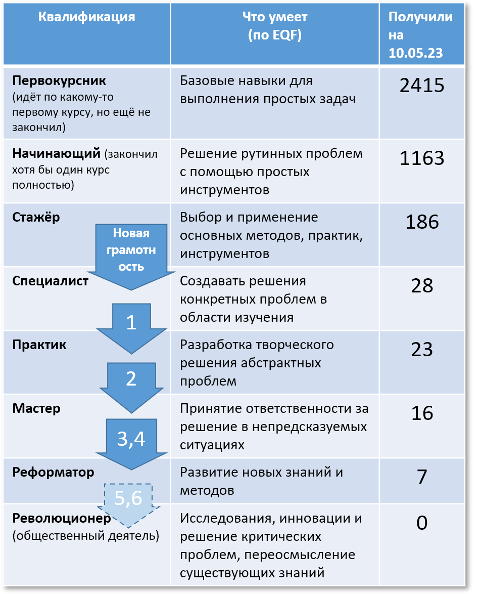

# Новации ШСМ в определении того, что она делает людей умнее

Оценка успешности выпускников есть, но она происходит не на задачах, которые даёт Школа, а на задачах, которые даёт жизнь. Берёшь в жизни рабочий проект (экзаменационный билет даёт не экзаменатор, а жизнь), делаешь, приносишь в Школу, рассказываешь об успехе. Если успех в плане решения проблем есть, растёт твоя агентность (адаптивность к изменяющимся обстоятельствам, инициативное нахождение и решение проблем), то у тебя рост квалификации.

Напомним: квалификации эти отличаются направленностью на изменения мира к лучшему (чем больше нацеленность на изменение не только собственной модели себя и модели мира, но и изменения самого себя и мира, тем больше агентность):

* специалист — "ах, какой я стал крутой, как круто работаю",
* практик — "вот тут мы с командой творим разное интересное, я сильно всем помогаю работать, договорился со всеми, вписался в мир",
* мастер — "я помогаю людям вокруг моей команды работать много круче, договорил их всех, вписал их в мир".

Квалификации выбраны не произвольно «из головы», а соответствуют уровням EQF, пост-блумовского[^r9-1] European qualifications framework[^r9-2], к которому Stephen Downes написал диаграмму-оглавление https://www.downes.ca/post/72420 и далее её перевела на русский язык Cветлана Панюкова[^r9-3].

Прохождению этих квалификационных ступенек содействует программа «Организационное развитие» (и перед ней программа «новая грамотность»). Вот в табличке показано, как семестры этой программы (номера семестров на стрелочках переходов между строчками таблицы) должны влиять на квалификацию в случае успешного прохождения:

На данный момент семестры программы «Организационное развитие» предусматривают следующий рост квалификации, который определяется содержанием учебной программы из шести семестров:

1. Моделирование и собранность

* Фундаментальный курс

2. Системный менеджмент и инженерия

* из инженеров в менеджеры
* из практиков в мастера

3. Объяснения и риторика

* Фундаментальный курс

4. Лидерство себя, коллектива, сообщества

* из менеджеров в агенты развития
* из мастеров в реформаторы

5. Образование для образованных

* Выход на фронтир в мировоззрении, умение обучать

6. Аналог учебной программы аспирантуры

* Исследовательский проект с прикладным результатом выхода на фронтир
* «диссертация» (учебная программа): документирование выхода на фронтир, а там как свезёт с выходом в «революционеры»

Предполагается, что на текущий момент позитивные результаты в виде поумнения от учебной программы ШСМ есть уже у всех «для личного пользования», только эти позитивные результаты надо дотащить от пользы для себя до пользы и для других людей. Поэтому попробуем распространить подход к оценке обучения как возможности менять мир вокруг себя не к внешнему миру личности, а к самой личности, зайдём «внутрь личности», на системный уровень ниже.

Квалифицируемая личность (то есть совокупность всех видов мастерства, которые её и представляют) тут выступает как раз в роли внешнего мира, а какой-нибудь Self или роль «развивающийся» (мастер развития личности, это внешняя роль в проекте обучения) в составе этой личности — носителем квалификации по изменению себя. Если есть какие-то понимания собственной личности, и дальше ничего не меняется в жизни личности, то это агент-специалист. Специалист себя верно оценивает, углубляет своё понимание себя, и на этом всё заканчивается. Если «развивающийся» продуктивно сотрудничает со своей личностью, «принимает и учитывает себя при планировании деятельности», сорганизовывается/собирается на выполнение какой-то уже известной агенту практики — это агент-практик. А «развивающийся меняет свою личность к лучшему» — это уже мастер по изменению себя, то есть развитию, понимаемому как обучение чему-то новому, новым видам мастерства, организации своей «внутренней команды» исполнителей разных личностных ролей.

Но «мастер» — это не конец линейки квалификаций. Дальше идёт «реформатор», по шкале EQF — это «развитие новых знаний и методов», при этом мы понимаем, что речь идёт о развитии знаний и методов уже не внутри личности, а за её пределами. Реформатор организует уже не только свою организацию, но и организации вокруг. В реформаторстве личности «личность, которая внутри себя устроена как команда вокруг Self/Самости/«Я»» тоже выходит за рамки организации себя, то есть начинает организовывать личности вокруг себя, учить людей вокруг себя новым практикам, менять личности вокруг себя к лучшему. Это означает, что личность, выходящая на уровень «реформатора личностей» должна быть готова занимать роли в проектах обучения других агентов (людей и не только людей).

В том же oNLP так и учили (по версии ABNLP, The American Board of Neuro Linguistic Programming)[^r9-4]: сначала научись отслеживать себя — это примерно наш «специалист по знанию себя, любимого», затем изменять себя — тут наши «практик по вписыванию в мир себя, любимого» и «мастер по изменению себя, любимого», потом помогать измениться другим (одному агенту-человеку или целой группе сразу, что требует немного других умений), имея опыт собственных изменений — тут наш «реформатор агентов вокруг».

Ещё раз отметим: степени квалификации «специалист», «практик», «мастер», «реформатор», «революционер» по отношению к одной личности (предмет нашего курса инженерии личности) и к организации (предмет программы «Организационное развитие») — разные, это лишь развитие идеи, которая постоянно повторялась в курсе «Системного менеджмента»: материал менеджмента вполне можно применять и для личности, помня, что это разные системные уровни, и поэтому там могут быть какие-то существенные различия. Обратное тут тоже верно: материал по обучению личности можно применять к организациям, они тоже «лица» — и тоже есть существенные различия. Так что квалификационные шкалы разные, но стоящие за ними идеи (и поэтому названия ступеней квалификации) — одинаковые.

То, что человек становится умнее, должен признать не сам провайдер обучения, не специально назначенная внешняя для провайдера комиссия, а какие-то внешние люди, которые видят эффективное решение выпущенными мастерами каких-то проблем. Работодатель, если это ситуация найма. Рынок, если ты бизнесмен. Коллеги-исследователи, если ты учёный. Если тебе начали замечать разные люди, что у тебя системное мышление (после прохождения курса системного мышления), значит, курс добился цели. Если у тебя за счёт использования материалов курсов вчетверо выросла зарплата за пару лет, то это косвенное признание того, что ты что-то стал делать лучше. И так далее. Начальные успехи многих выпускников ШСМ — это то, что они подуспокоились и начали спать по ночам, а их подчинённые перестали вызывать их из отпуска на третий день отсутствия. Это результат «поумнения», а не какие-то баллы за сданный экзамен или получение какого-то сертификата на официальном бланке. Польза сначала для себя! Успех разные люди трактуют по-разному, ибо решаются очень разные проблемы очень разных людей, играющих очень разные роли в очень разных проектах, и начинается это часто с решения личных проблем. Сначала починил себя, потом развил себя, потом чинишь окружение и развиваешь окружение.

ШСМ, как и другие провайдеры обучения, делает квалификации публичными, чтобы можно было брать широкую оценку от самых разных людей. Конечно, всегда будет какая-то критика, но тут как в науке и инженерии: публичность существенно снимает возможные вопросы к качеству оценок. Например, публикуются доклады об успехах выпускников[^r9-5], а в докладах указывается, что именно из материалов учебной программы было применено в успешных проектах. Для учительской команды полезно и то, что в подобных докладах рассказывается о встреченных мастером трудностях, «что не удалось» — и это позволяет подправить учебную программу, чтобы следующим мастерам это уже было легче, чтобы удавалось больше.

В любом случае, интеллект работает с чем-то новым, а эволюционный успех («революция»: существенное, то есть масштабное и массовое изменение текущей ситуации к лучшему в какой-то сфере) — это то, к чему следует стремиться. Выход успешных новаций за рамки одной организации тут хоть и слабый (ибо мы пока не знаем, это многоуровневая оптимизация свободной энергии, или нет — помним о материалах об эволюции в многочисленных курсах ШСМ), но критерий успешности. «Реформатор» по нашей шкале — это тот, кто сделал маленькую революцию, то есть реформу/трансформацию/оргизменения в крупной организации (а в случае инженерии личности — смог выйти за пределы изменения себя к лучшему на изменения к лучшему окружающих личностей). А вот «революционер» (он же «общественный деятель») — это тот, кто вышел за пределы организации, то есть инициировал и как-то возглавил постановку новой практики/деятельности в масштабах страны или даже планеты.

И ещё замечание про термин «мастер»: **1.** **«Мастер»** **в степенях квалификации выпускников** **ШСМ** **в части оргразвития, 2. «мастер» в степенях квалификации по изменению себя, любимого по шкале из текущего раздела, 3.** **«мастер» как состояние ученика (абитуриент, студент, мастер), освоившего** **какое-то мастерство—** **это разные словарные значения одного и того же слова. Какое именно значение имеется ввиду (мастер** **оргразвития, мастер личного саморазвития** **или мастер** **как закончивший обучение студент) определяйте из контекста, но не путайте.**

[^r9-1]: <https://www.simplypsychology.org/blooms-taxonomy.html>

[^r9-2]: <https://europa.eu/europass/en/description-eight-eqf-levels>

[^r9-3]: <https://www.facebook.com/groups/Teach4teach/posts/3183457131779315/>

[^r9-4]: <https://ailev.livejournal.com/1493105.html>

[^r9-5]: вот тут много таких докладов на видео, <https://www.youtube.com/channel/UCJ0Uq_WB7GLmY-NTz2oFoUQ/videos>, но немало таких материалов и в текстах, <https://systemsworld.club/>
