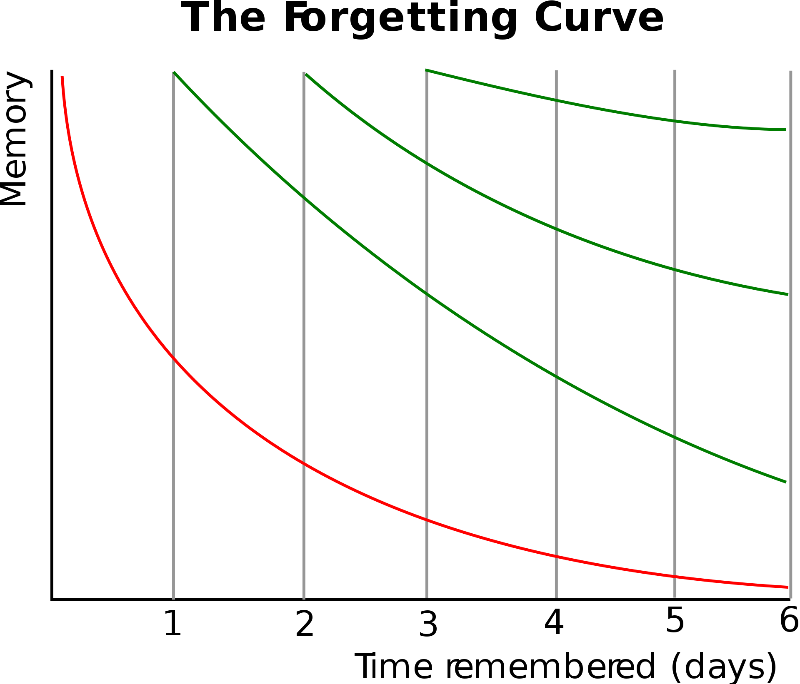

# Перенос в жизнь/transfer of learning

«Введение в использование/эксплуатацию мастерства»/transfer of learning/перенос мастерства/перенос в жизнь/перенос обучения/transfer of practice/teaching for transfer/обучение для переноса[^r9-1] в образовании и обучении как предметной области отличается по смыслу от transfer learning в машинном обучении[^r9-2]. В машинном обучении это означает передачу знания, полученного при выучивании ответов на один вопрос для ответов на другие вопросы, иногда это называют domain adaptation/адаптация к другой предметной области. Ещё есть knowledge transfer/распространение знаний[^r9-3] в организациях, там это означает распространение знаний по решению каких-то проблем среди сотрудников (по факту — массовое обучение сотрудников какой-то практике).

В обучении «перенос в жизнь» означает, что мастерство, которому учили, реально включается в подходящей ситуации и используется в жизни, а не просто было выучено и потом не было задействовано после окончания обучения, например, его просто не догадаются использовать, или посчитают, что выполнить дело надо каким-то другим способом, а не выученным. Скажем, вы долго учитесь плавать в школе плавания кролем, брассом, но потом оказываетесь в реке или море, и плаваете там по-собачьи. Причины разные, но введения в эксплуатацию выученного мастерства не произошло: просто не вспомнили, что можно плавать лучше, или настолько опостылело обучение, что неприятно воспроизводить своё умение, лишь бы не вспоминать об этой скуке, или выучился настолько плохо, что любым другим способом оказывается быстрее и проще, или есть боязнь, что окружающие сочтут «самым умным», или кажется, что ситуация не требует применения мастерства. Подставьте сюда ещё десяток причин.

Увы, проблема абсолютно общая и встречается очень часто. Причины разные, но освоенное мастерство отнюдь не всегда потом задействуется в реальных ситуациях, обучение по факту оказывается бесполезным. Поэтому методики обучения предусматривают специальные мероприятия по гарантированию переноса выученных навыков в рабочую среду: прежде всего, это попытки генерализовать контекст выполнения упражнений, чтобы рабочий контекст выглядел хоть как-то знакомым. По этой линии идут самые разные тренажёры, игры и хакатоны, стажировки, практики, рабочие проекты и прочие попытки хоть как-то сменить контекст/среду обучения с «учебного» на «почти рабочий». В психопрактиках всё то же самое: новое поведение предлагают вообразить в нескольких разных контекстах, в спорте — целевое движение повторить в разных ситуациях.

В нашем курсе мы уже несколько раз упоминали модель COIN[^r9-4]. Один из результатов этой модели — это исправление заблуждения, что «навык забывается, если его не употреблять в жизни» (в том числе «навык ошибочного действия»). Нет, оказалось, что просто (биологический) мозг считает, что контекст поменялся, и делает другие движения вместо давно вроде как забытого неправильного. А если мозг считает, что «ага, контекст прежний», то выскакивает какой-то старинный паттерн (например, паттерн давно уже исправленного ошибочного действия), как новенький, он не забылся.

То есть мозг, если решит, что контекст — это контекст инженерного проекта, то перенос мастерства в какой-то мыслительной операции после обсуждения её в контексте пяти разных проектов сокурсников перенесёт результаты обучения в жизнь, на свой шестой проект. уже рабочий, а не учебный. Но если мозг решит, что контекст «обсуждений в учебной группе» и контекст «реальной работы в проекте» — это разные контексты, то переноса в жизнь не будет, мастерство будет наличествовать, но не будет «введено в эксплуатацию». Модель COIN была проверена для управления движениями (motor learning), но вполне возможно её выводы распространять на обучение в целом чему бы то ни было.

Ещё одна полезная практика/стиль обучения, который будет способствовать переносу в жизнь — это использование domain randomization/вариативности предметной области[^r9-5]. В спорте ходит максима, приписываемая Брюсу Ли: «я не боюсь того, кто изучает 10000 ударов, я боюсь того, кто изучает один удар 10000 раз». Такое высказывание неверно: многократное повторение одного и того же действия в одном и том же контексте бесполезно. Но ситуация меняется, если мы каждый раз немного меняем это повторение, меняем контекст, заставляя пробовать немного разные модификации удара (или любой другой операции). Нейронная сеть (в мозге человека или в AI-агенте) как-то генерализует выполнение операции, подстраиваясь под неизбежную вариативность, отличающую реальную жизненную ситуацию от учебной: варианты происходящего будут восприниматься не как «новые ситуации, не знаю, что делать», а как «небольшие вариации известной ситуации, надо просто адаптироваться/подстроиться».

Это и есть основные практики обучения, способствующие переносу обучения в жизнь/рабочий контекст:

* Подстройка под изменения ситуации и генерализация практики при небольших изменениях контекста (domain randomization)
* Знакомство с разными контекстами, запоминание действий в разных контекстах (COIN)

Методист не должен надеяться на успех однократного предъявления учебного материала и однократного выполнения упражнения для какой-то изучаемой операции целевой практики. Такое вряд ли приведёт к надёжному обучению, понимаемому как надёжный перенос мастерства из учебных условий в рабочие. Надёжное обучение, гарантирующее перенос — это повторение в самых разных контекстах, максимально похожих на рабочий (COIN) и вариативное повторение (domain randomization), то есть «репетиции». Так что «повторение — мать учения», но оно должно быть не однообразным, а в разных контекстах и с мелкими вариациями в каждом контексте.

Ещё один важный принцип «репетиций»/повторения для переноса в жизнь — это повторение с перерывами/spaced repetition[^r9-6], основанный на учёте кривых забывания. Человеческий мозг обладает свойством забывания свежеусвоенного материала. Даже родной язык за много лет его неупотребления где-нибудь на чужбине вполне забывается, хотя им до этого пользуются много лет. Но свежеузнанное знание забывается более чем быстро, поэтому время от времени это знание требуется повторять, иначе мастерство в жизнь не доносится из-за банального забывания. Вот типичный график кривых забывания для практики повторения с перерывами/spacing/spaced repetition[^r9-7].

Последние исследования показывают, что «перечитать учебник ещё раз» не помогает запоминанию знаний и последующему переносу в жизнь, а помогают только какие-то мыслительные операции с запоминаемым материалом, эту практику называют active recall/retrieval practice/practice testing/test-enhanced learning/задействование testing effect[^r9-8]. Нужно с некоторыми интервалами (учёт кривых забывания) неоднократно решать задачи, отвечать на открытые или закрытые вопросы, выполнять какие-то моделирования, писать тексты («мышление письмом») на какую-то тему для того, чтобы повторение вело к надёжному запоминанию учебного материала и натренированных навыков, и это существенно повышает шансы на перенос выученных навыков в жизнь. Поэтому spaced repetition означает режим повторения каких-то операций, а не просто повторения чтения учебника (например, запоминание каких-то «карточек с текстами», как это было в начальной методике запоминания, основанной на кривых забывания).

**Итого:** **SoTA** **современной** **методикипроектирования** **обучения** **(instructionaldesign)предусматривает, что** **в учебной программе** **нужно постепенно подавать кусочки знания (учитывается в** **learningdesign),** **основываясь в каждый момент курса на уже имеющихся у студента знаниях (constructivism),** **требуя** **от студента** **выполнения работы** **с внешне проверяемым результатом** **(constructionism,** **activerecall), и не подряд, а через некоторые промежутки времени повторяя (spacedrepetition) эти работы в достаточном** **для надёжного усвоения материала** **количестве (masterylearning), с поддержкой мотивации (учитывается в** **motivationaldesign),** **с немного различающимися вариантами выполнения** **(domainrandomization) в разных ситуациях (contextinference), чтобы** **изучаемое** **мастерство было обобщено и дожило** **в памяти** **до момента его использования (transferoflearning), а ещё нужны дополнительные работы** **студента для научения** **пониманию, а не только навыкам.**

[^r9-1]: <https://en.wikipedia.org/wiki/Transfer_of_learning>

[^r9-2]: <https://en.wikipedia.org/wiki/Transfer_learning>

[^r9-3]: <https://en.wikipedia.org/wiki/Knowledge_transfer>

[^r9-4]: <https://github.com/jamesheald/COIN>

[^r9-5]: Пример domain randomization для обучения роботов: <https://docs.omniverse.nvidia.com/app_isaacsim/app_isaacsim/ext_omni_isaac_dr.html>

[^r9-6]: <https://en.wikipedia.org/wiki/Spaced_repetition>

[^r9-7]: <https://en.wikipedia.org/wiki/Forgetting_curve>

[^r9-8]: <https://en.wikipedia.org/wiki/Testing_effect>
