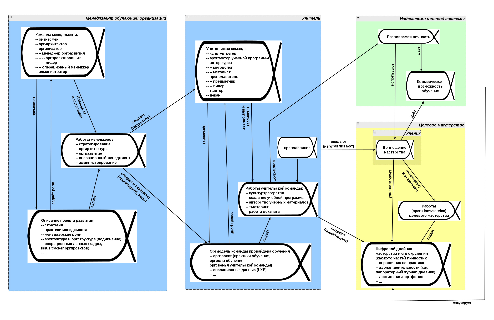

# Адаптация системной схемы проекта для проекта учебного курса

Труд обучения/teaching — это извод инженерного труда (а именно — инженерии личности, обучаем личность новому мастерству), он меняет физический мир (создаёт в нём мастерство, реализованное каким-то материальным агентом, меняющим своё поведение). Занимается этим трудом роль учителя/педагога/андрагога (и точно так же мы перетрактуем роль, например, психолога — это учитель нового поведения) как специализация роли инженера. Как и роль инженера, которая делится на подроли со своими уникальными практиками в большинстве проектов, так и роль учителя тоже делится на подроли со своими специфическими практиками. Напомним табличку соответствия ролей инженера, менеджера, учителя с их разбиением на подроли, которая приводилась в курсе системного менеджмента, а в нашем курсе инженерии личности мы дадим больше подробностей:

|  |  |  |  |  |  |  |  |  |
| --- | --- | --- | --- | --- | --- | --- | --- | --- |
| Роль создателя системы (из мета-мета-модели) | Инженер/деятель/создатель/constructor | | | | | | | |
| Стадия на V-диаграмме | Время замысливания/Conception time | Время проектирования/design-time | | | Время изготовления/ manufacturing time | | Время эксплуатации/operations time | Время проекта создания платформы разработки |
| Подроли создателя системы/роли команды организации создания (из мета-мета-модели) | Визионер/visionary | Архитектор/architect | Разработчик/developer | | | | | Инженер платформы разработки |
|  |  |  | Проектировщик/designer | | Технолог/manufacturing engineer | | Оператор/operator |  |
| Роль создателя целевой системы (из метаУ-модели, пример киберфизической системы) | Инженер целевой системы | | | | | | | |
| Подроли создателя целевой системы/роли команды организации создания (из метаУ-модели, пример киберфизической системы) | Визионер целевой системы | Архитектор целевой системы | Разработчик/developer целевой системы | | | | | Инженер платформы разработки целевой системы |
|  |  |  | Проектировщик | | Технолог | | Оператор |  |
| Роль создателя организации создания целевой системы (из метаУ-модели системного менеджмента) | Менеджер (в широком понимании)/инженер предприятия | | | | | | | |
| Подроли организации развития /Подроли команды менеджеров (из метаУ-модели системного менеджмента) | Бизнесмен | Орг-архитектор | Организатор | | | | | Администратор |
|  |  |  | Менеджер оргразвития | | | | Операционный менеджер |  |
|  |  |  | Орг-проектировщик | | Лидер/управляющий орг-изменениями | |  |  |
| Роль создателя клиентуры | Продвиженец | | | | | | | |
| Подроли создателя клиентуры/ организации продвижения (из метаУ-модели продвижения) | Разбиение, какое определено в учебнике по практике продвижения (маркетинга, рекламы и продаж) | | | | | | | |
| Роль создателя мастерства | Учитель | | | | | | | |
| Подроли «организации создания мастерства»/курсов, школы, факультета, кафедры (из метаУ-модели обучения) | Культуртрегер | Архитектор учебной программы/curriculum | Автор курса | | Преподаватель | | Тьютор | Декан |
|  |  |  | Методолог | Методист | Предметник | Лидер |  |  |
| Роль создателя инвестуры | Фандрайзер/fundraiser | | | | | | | |
| Подроли фандрайзера/создания инвестуры (из метаУ-модели инвестирования) | Разбиение, какое определено в учебнике по привлечению инвестиций | | | | | | | |

Учитель как верхнеуровневая роль провайдера обучения проектирует/design целевое мастерство (или занимается reverse-engineering: берёт «стихийного мастера» в жизни и восстанавливает проект/design мастерства из него), разрабатывает учебные материалы (объяснения, задачи), набирает из абитуриентов студенческую группу, проводит занятия куррикулума/учебной программы, помогает студенту с учебной нагрузкой, поддерживает администрирование учебного процесса.

Учитель — это тот же самый «инженер» (или даже в ходе непосредственного изготовления экземпляра мастерства — «рабочий»), только работающий не с железом или электроникой, а с людьми (помним, что для AI-агентов всё может быть тоже очень похоже, но роли и практики будут называться чуть по-другому, мы не будем в нашем курсе много уделять внимания обучению AI-агентов, будем говорить больше про обучение людей, но всё-таки будем учитывать и индивидуальных агентов-не-людей, «нежить»).

Для людей все учительские роли (включая составление программы курса!) для коротких небольших курсов может выполнять даже компьютер (довольно много работ по ChatGPT было посвящено тому, как превратить этого AI-агента в учителя[^r9-1]). Пока ещё нельзя полностью автоматизировать работу авторов более-менее длинных современных курсов, но эта ситуация быстро меняется.

А вот роль студента-человека AI-агент сыграть не может, автоматизировать работу студента по обучению нейросети его мозга нельзя.

Тем не менее, мы смотрим на создание мастерства как на обычную инженерную работу: авторы учебной программы и её частей (семестров, курсов, занятий) работают как бы в «конструкторском бюро» (делают «чертежи/информационные модели» мастерства, разрабатывают учебные и методические материалы), преподаватели как бы на «заводе», а деканат (инженеры внутренней платформы разработки/заводского конвейера) организуют «конструкторское бюро для мастерства» и «обучающий завод», поддерживая его сложное оборудование (прежде всего learning experience platform и клуб/социальную сеть, «станки» по изготовлению из студентов мастера и поддержке клуба/сообщества мастеров). Если думать по этой линии, то дальше будет происходить всё то же самое, что **везде в инженерии: рост сложности и полезности** **обучаемых («изготавливаемых»)** **систем** **(мастерства, а также сложности личности, в которой будет больше сложных видов мастерства)** **при общем снижении стоимости изготовления по мере развития способов производства, переход от изготовления и продажи мастерства как «разового изготовленного продукта» к «непрерывному обучению», то есть постановка мастерства на сопровождение по линии его непрерывного развития** **(при этом существенно вырастает роль клуба мастеров, который позволяет не терять связи с выпускниками).**

Если думать про обучение «как обычно», то ничего со снижением стоимости образования не происходит при примерно сравнимом уровне качества и сложности (это давно уже замечено, стоимость образования только растёт при сравнимых результатах в прошлом и настоящем, например, в США стоимость обучения в колледже увеличилось на 1200% с 1980 до 2021 года, а остальные цены от инфляции выросли на 236%[^r9-2]). Если думать «как инженеры», то обучение неизбежно будет дешевле и быстрее. Так, сдвиг к онлайн-образованию во время пандемии COVID-19, 2020 год стал годом с наименьшим ростом стоимости обучения. Можно дальше обсуждать, как и насколько в целом упало качество обучения, но и без онлайн-образования качество обучения отнюдь не везде было высоким.

На этом уровне рассмотрения неважно: целевое мастерство в одной мыслительной практике или практике ухода за собой (образование), или даже целевое мастерство тут жизненное мастерство с интеллектом как мыслительным мастерством по всем практикам интеллект-стека (образование как подвид обучения) и ещё владение многими практиками ухода за собой (например, практиками ЗОЖ), или целевое мастерство тут какое-то прикладное мастерство по одной из прикладных практик (прикладное обучение), или даже «новая фича старого мастерства» (повышение квалификации мастера). Неважно, учим ли мы чему-то, с чем сейчас идут к психологам (например, не бояться публичных выступлений), или учим следовать какой-то роли, не отвлекаясь (этому, например, в организациях учат лидеры, к которым ученики не идут, а лидеры сами приходят к ученикам, инициатива со стороны лидеров, а не со стороны учеников). Терминология учитель-ученик тут немного неуклюжа, но для наших целей пока её достаточно (при этом для нас термины неважны: в мета-мета-модели могут быть общие термины «учитель и ученик», а в метаУ-модели какого-то варианта образования может быть совсем другая терминология, например «лидер и сотрудник», а на конкретном предприятии и вообще в регламентах какая-то своя, ситуативная, терминология метаС-модели).

Также неважно, говорим о провайдинге курсов по одной небольшой дисциплине в виде онлайн-сервиса, или о какой-то длинной учебной программе из нескольких семестров, которые сами состоят из нескольких курсов, а курсы состоят из нескольких занятий. Рассуждение тут общее для всех этих случаев: надо изготовить мастерство (взять абитуриента и начать учить, вырастить в личности студента целевое мастерство, выпустить готового мастера и продолжать дальше обновлять версию этого мастерства, возвращая ученика из состояния мастера в состояние студента). Для этой цели мы проводим занятия (сеансы сервиса) в рамках проекта обучения как оказания обучающего сервиса, то есть проводим занятия в рамках куррикулума: учебной программы, семестра, курса или иных вариантов проведения обучения.

Так что мы должны просто взять системную схему (инженерного) проекта и адаптировать её для такого сервиса, как учебный курс. Вот вариант, при этом это «вариант из курса», так что для реального проекта обучения этот вариант должен быть адаптирован ещё раз. Обучение мастерству «не бояться пауков», то есть снятие фобии, и обучение мастерству «проектирование атомных реакторов» всё-таки устроены немного по-разному, и это обязательно нужно учитывать. На диаграмме только иллюстрирующий пример, если в вашем проекте будет ровно вот это, без доработок для условий вашей ситуации, то это «новичковая ошибка», она сразу будет видна:

Надо сразу считать, что разработка и проведение обучения (даже если начинает их один человек как «сам себе команда») — это коллективный проект. Поэтому сразу используем знания из курса «Системный менеджмент» по организационной инженерии, ибо создаём и развиваем коллективного учителя: организацию-провайдера обучения, которая занимается не только учительской деятельностью, но и привлекает инвесторов, обеспечивает продвижение своих сервисов, администрирует работу учительской команды.

Дальше как обычно: каждый объект внимания в проекте обучения (проекте проведения курса как оказания сервиса/услуги, меняющей состояние мастерства у студента) оформляется как предмет кейса, дальше этот предмет кейса ведут по состояниям при помощи различных практик. Это всё описано в курсах «Системное мышление» (понятие альфы как объекта внимания в проекте), «Методология» (как думать о практиках, меняющих состояния альф и как моделировать альфы), «Системная инженерия» (альфы инженерного проекта), «Системный менеджмент» (управление кейсами).

К понятию обучение/«учебный проект»/куррикулум/«учебная программа»/курс надо относиться внимательно, ибо разные люди имеют в виду разное, когда говорят эти слова. В нашем подходе обучение — это сервис, который оказывает учитель/провайдер обучения (создание и развитие какого-то мастерства, или даже отдельных частей этого мастерства). Полностью приложима онтика сервиса, рассказанная в «Системном мышлении»:

* Сервис как тип Работы (а не практики/деятельности/труда), выполняемой
* ПровайдеромСервиса (службой, сервером, это и есть СистемаСоздания)
* над Заготовкой будущей ГотовойСистемы (хотя сервис может и не давать полной готовности).
* в ходе ПрохожденияСервиса,
* которое состоит из отдельных Сеансов,
* Участниками которых являются Заготовки и взаимодействующий с ними через Интерфейс к Заготовке ПровайдерСервиса.

Для обучения (выбран был «курс» как единица сервиса) даже был пример использования этой онтики:

* Курс обучения — это сервис провайдера курса, который изготавливает мастерство в студенте::заготовка (тут тоже студент — надсистема-носитель для будущего мастера::ГотоваяСистема, носителя целевого для курса мастерства) в ходе ПрохожденияКурса/«курсового потока», состоящего из занятий::сеансов. Студент в 4D принимает участие (participation, специализация part\_of) в потоке, то есть наборе занятий, равно как и провайдер курса (подключаясь на интерфейсе к студенту) и другие студенты (если нет других студентов, то есть занятия::сеансы не групповые, то понятие «потока» не используется, говорят о «наборе занятий»). Будет ли агент, отыгрывающий роль студента переименован затем в мастера::ГотоваяСистема — точно так же зависит от того, последний ли это поток курса в какой-то их серии. В потоке агенты, отыгрывающие роли студентов::«заготовки мастера» взаимодействуют не только с преподавателем (или компьютером, к которому приписан преподаватель — если планируем автоматизацию и в конечном итоге убрать людей), но и друг с другом.

В нашем курсе инженерии личности добавляем: мы разбираемся ещё и с личностью (общее мастерство агента, проявляющееся во внешнем поведении, целевое мастерство тут — часть личности), а «студент» — это состояние не прямо агента, а ученика, который представляет собой функциональную часть личности, а личность представляет собой функциональную часть агента. Ещё мы различаем как минимум личность агента («software») и организм агента («hardware»). Скажем, особенности пищеварения агента нас в связи с личностью мало интересуют, хотя в составе личности может потребоваться какое-то особое мастерство питания, чтобы справиться с этими особенностями организма агента (мы отнесём это к мастерству ухода за собой, ведение здорового образа жизни, обучение этому — часть образования). Так что обучение идёт не организма агента («аппаратуры» агента), а его личности (софта): создаём новое или развиваем уже имеющееся в личности мастерство.

[^r9-1]: Типичный пример, хотя уже немного устаревший: <https://blog.alexanderfyoung.com/how-to-use-chatgpt-to-learn-any-skill/>

[^r9-2]: <https://www.visualcapitalist.com/rising-cost-of-college-in-u-s/>
