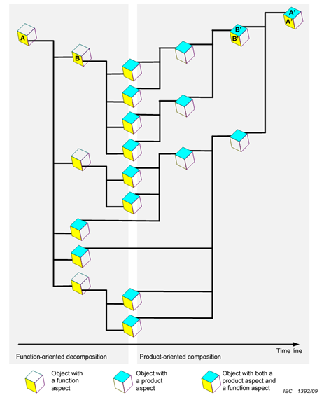
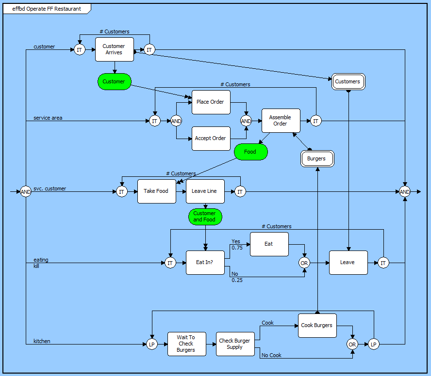
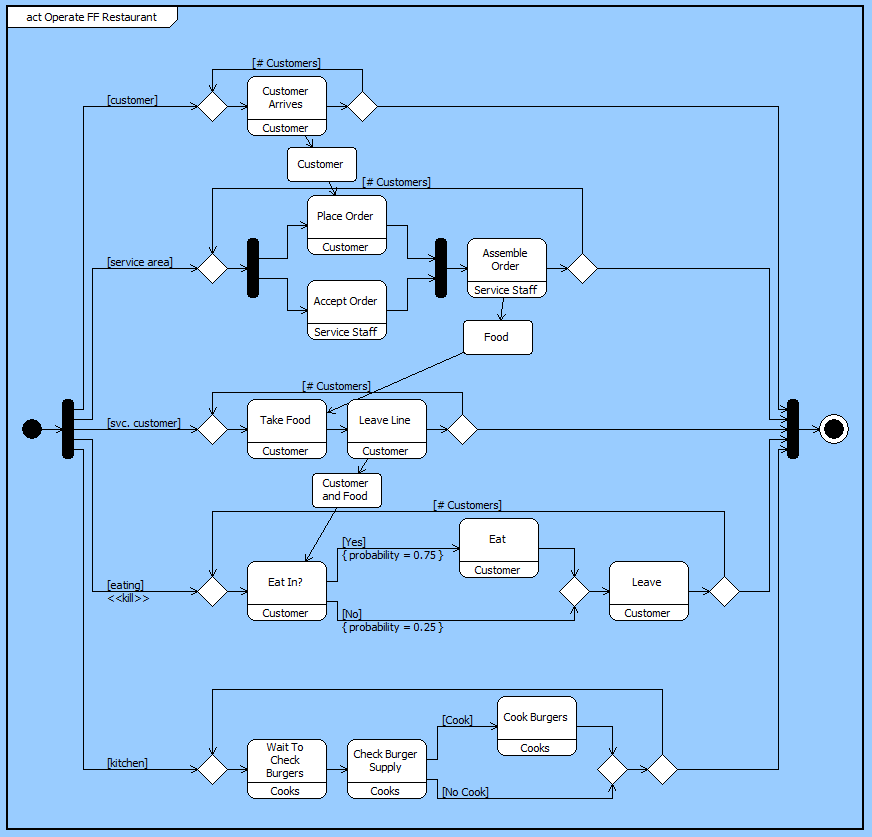
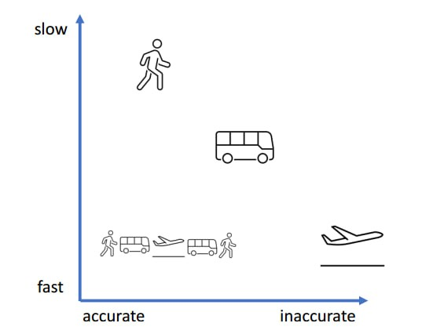
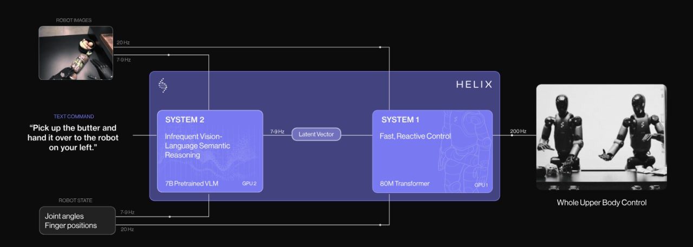

# Функциональное проектирование

В руководстве по методологии обсуждалось функционирование как работа по методу — какими методами работают создатели, меняя окружающий мир. Какая угодно система (в том числе целевая!) у нас — создатель, если мы будем рассматривать, как она меняет своё окружение. Не надо забывать, что создателем мы можем считать как разумного агента (агента в узком смысле слова), так и не слишком разумного — автомат или даже косное вещество, например, молоток, который заколачивает гвоздь. И в графе создателей одни создатели в ходе работы создают других создателей, для которых это будет время создания, а не время работы. Не будем это подробно обсуждать сейчас, подробности были в руководствах по системному мышлению и методологии.

Но вот чего в этих руководствах по системному мышлению и методологии ещё не было рассказано подробно, так это про роль прикладного методолога предметной области, хотя в общих чертах мы рассматривали именно эту роль в руководстве по методологии, в отличие от роли фундаментального методолога-исследователя. Эта прикладного методолога в инженерной команде имеет множество «синонимов с нюансами»: функциональный проектировщик/designer, функциональный архитектор, процессный инженер, инженер поведения системы (systems behavior engineer), проектировщик оргвозможности (capability designer), специалист системной динамики предметной области (systems dynamics specialist, в биологии проектирует метаболические пути), инженер операционного синтеза (operational synthesis engineer, на смарт фабриках проектирует автоматизированную сборочную линию), лидер оркестровки процессов (process orchestration lead, координирует рабочие процессы), архитектор хода работ (workflow architect, проектирует цепь поставок, supply chain), аналитик функциональных потоков (functional flow analyst, оптимизирует перетоки в электрических сетях — балансирует спрос и предложение) — это далеко не полный список названий инженерной роли для того агента (человека, AI, организации), что занимается вопросом «как оно будет работать», вопросом метода работы системы.

Как всегда, слова важны — и не важны, надо по контексту уметь определить, что речь идёт о проектировании функциональной организации системы. Главное тут — это определиться в отношениях с архитектором. Давайте вспомним основную диаграмму, которой определялась функциональная декомпозиция и модульный синтез, а потом покритикуем эту диаграмму:

Пару десятков лет назад эта диаграмма читалась как «мы декомпозируем исходный функциональный/ролевой объект А (систему) на его подобъекты-подсистемы, и делаем это на несколько уровней, пока не подберём такие низкоуровневые роли, которые исполняются известными нам модулями как частями конструкции. Эти модули мы синтезируем/собираем во всё большие подсборки и сборки, пока не получим на выходе целый модуль A’, реализующий целостный функциональный объект A».

Это представление в виде «функциональной декомпозиции, затем модульного синтеза» получено от людей, занимавшихся управлением конфигурацией, а не проектированием. Диаграмма эта из стандарта IEC 81346-1:2022 Industrial systems, installations and equipment and industrial products — Structuring principles and reference designations — Part 1: Basic rules используется для минимально необходимого описания структуры сложных инженерных объектов, задавая принципы обозначения систем и их частей. Это фундамент для управления конфигурацией в ходе эволюционной разработки. Стандарт различает три вида описаний: функциональное (functional), продуктовое (product) и мест (location), хотя и не затрагивает необходимость стоимостного (cost) описания, уже обязательного для сегодняшнего системного мышления. Ничего не говорится о поведении — о методах, функциях. В стандарте говорится об обозначениях/designations функциональных объектов, а не обозначениях их поведения. Поэтому на диаграмме (унаследованной этим стандартом из ещё более древнего стандарта IEC 1392/09) никак не отражается динамика времени работы, необходимая для рассмотрения методов/функций.

Рассмотрение неявно подразумевает то, что мы берём, например, автомобиль — и дальше выделяем в нём различные ролевые объекты (игнорируя их поведение!), декомпозируя «сверху вниз». И ведь правда, можно было считать, что «требования к автомобилю» определяют всё его поведение, вплоть до скорости нагрева сидений в зимнее время. От требований отказались: эволюционный (модульный!) архитектор нарезает систему на крупные куски-модули, стараясь, чтобы эти куски соответствовали каким-то предметным областям (domains, bounded contexts), а вот функциональное наполнение этих систем уже определяется в командах, которые ими занимаются. Подогрев сидений обсуждается теми, кто проектирует салон, появляется как «идея снизу», из предметной области, а не путём декомпозиции «удобно пассажиру», ибо на верхнем уровне никто не разбирается в том, что такое «удобно»! Какое-то детальное разбирательство с функциями появляется только на уровень ниже сигнатуры метода, ибо эмерджентные функции надо как-то собрать/синтезировать и это лучше бы делали владеющие предметной областью прикладные методологи, а не какой-то гипотетический «ответственный за все функции методолог проекта в целом». Ключевая операция тут оказывается — функциональный синтез, чтобы он «попал в сигнатуру». И это не зависит от природы системы, не зависит от системного уровня. В ходе функционального синтеза надо подобрать такие функциональные/ролевые объекты и так задать их взаимодействие, что

* эти функциональные объекты (роли) в своих взаимодействиях выдают на уровень выше требуемую на уровне сигнатуры функцию
* эти функциональные объекты (роли) могут быть реализованы какими-то конструктивными объектами (модулями).

И вот тут одна и та же суть дела излагается самыми разными словами. Например, часто архитектурой считают не только модульную структуру, но и функциональную организацию — и так и говорят:

* «функциональная/логическая архитектура» (иногда даже пытаясь разделить функциональную отдельно и логическую архитектуру отдельно), имея в виду динамические отношения между ролевыми объектами во время эксплуатации.
* «физическая архитектура» как конструкция, модульная структура системы.

Возражение было в том, что нельзя рассматривать их по отдельности, только вместе — как «архитектуру системы». Но жизнь всё время разводила функциональный синтез (его считали функциональной декомпозицией, ибо «так правильно, научно будет — сверху-вниз», это много позже будет признано неверным) и модульный синтез. А изобретение — это как раз совмещение функционального и модульного синтеза. Если надо вогнать гвоздь поглубже, мы имеем ролевой/функциональный объект «забивало» с функцией «забивания». Забивало должно быть в момент эксплуатации массивным и нехрупким, и дальше «изобретение» как выбор конструктивного объекта для выполнения роли — берём конструктив «микроскоп», который удовлетворяет спроектированным характеристикам «забивала». В архитектуре (общей! Понимаемой по-старинке, как функциональная и физическая архитектура вместе, а также размещение, стоимостные характеристики и другие верхнеуровневые описания. Сейчас это — концепция системы) надо учитывать ещё и стоимостные характеристики, и сложность изготовления, и много чего ещё, но плохой изобретатель может учитывать и меньше параметров. Микроскоп, как мы знаем, отлично подходит для забивания гвоздей — и если он не слишком дорогой и достаточно металлический, а ничего под рукой больше нет, то это хорошее изобретение, забивать гвозди микроскопом. Работа проектировщика системы (не функционального проектировщика, а «общего» для системы) как раз в том, чтобы указать для необходимой функции аффорданс, «подходяшку» конструктива, в данном случае это микроскоп: «за неимением молотка, о котором знаем, будем забивать гвозди микроскопом — ибо молоток получить сейчас дороже, чем задействовать микроскоп».

Примерно с 2017 года понятие «архитектуры» начало быстро меняться, появилась эволюционная архитектура, которая главным образом отвечает за модульный синтез на верхнем уровне (подробней мы коснёмся этого в следующем же разделе), а вот эволюционная прикладная методология предметной области — она как-то перестала рассматриваться, как ответственная за «функциональную архитектуру», поскольку речь шла уже не только о концепции системы, но и о детальном проектировании поведения, «проектировании как таковом». А ещё в новой архитектуре, которая оказалась главным образом «про модули», прилепилось определение «эволюционная», а в прикладной методологии (функциональном проектировании) этот аспект эволюционности, «непрерывности изменения функциональности» специально не обсуждался, разве что постулировалось то, что функциональность системы развивается: добавляются новые нужные функции/возможности/фичи, устраняются старые ненужные — и так всё время развития/эволюции системы. Функциональное проектирование тоже эволюционно, непрерывно.

Нынешний методолог предметной области (функциональный проектировщик, функциональный архитектор) проектирует набор связанных между собой функциональных объектов и их поведение, знает «принципиальные схемы» своей предметной области и языки их описания, владеет моделерами для этих языков. Это может быть язык P&ID диаграмм[^r8-1] для непрерывных производств (химия, нефть и газ), но это тоже частный случай — для радиотехники это могут быть радиосхемы на языке радиосхем (для радиоприёмника, например, будет выбор функциональной архитектуры из сверхрегенератора, супергетеродина и даже детекторного приёмника, в то время как проектировщик выбирает элементную базу радиоламп, дискретных транзисторов, интегральных радиосхем, software-defined radio)[^r8-2], а эволюционный архитектор нарезает конструкцию приёмника на какие-то модули, в том числе учитывающие элементную базу и предлагаемую функциональность (например, модули корпуса, интерфейса с пользователем, антенны, высокочастотной части, усилителя низких частот, блока питания и акустического тракта с громкоговорителем).

Есть, конечно, и более абстрактные описания функциональности, с попыткой абстрагироваться от специфики предметной области в рамках какого-то формализма. Каждый формализм поддерживается множеством нотаций, каждая нотация поддерживается множеством моделеров, например:

* Конечные автоматы (Finite State Machines)[^r8-3] представляют метод работы системы (тут чаще говорят «поведение», но это не включает работу, только метод работы, функционирование) как набор дискретных состояний и переходов между ними, вызываемых событиями наступления каких-то условий. Скажем, конечными автоматами моделируют дорожные светофоры, протоколы связи (например, интернет-протокол TCP, Transmission Control Protocol, управляет соединением между двумя устройствами, проходя через состояния вроде «закрыто», «установка соединения», «передача данных»), торговые автоматы (например, автомат для продажи кофе принимает монеты, выдаёт товар и возвращает сдачу, переходя между состояниями в зависимости от действий пользователя) и даже программируемые логические контроллеры, которые управляют производственными процессами, переключая состояния оборудования. В какой-то мере состояния альф из руководства по методологии, составляющие какой-то граф этих состояний с переходом между состояниями, которые обеспечиваются применением методов, тоже хорошо выразим конечными автоматами. Частая визуальная нотация — диаграммы состояний (state diagram)[^r8-4]. И не путайте с клеточными автоматами[^r8-5], которые тоже про состояния и переходы.
* Самые разные потоки работ (workflow), которые не столько про «работы», сколько про последовательности операций (последовательность шагов в методе). «Поток» тут означает просто зависимость следующей операции в потоке от успеха предыдущей операции, при этом могут быть ветвления потока, зависящие от результата предыдущей операции. Для изображения потоков работ используют или самые разные диаграммные представления, например, блоковые диаграммы функциональных потоков (FFBD, functional flow block diagram[^r8-6], диаграммы активности, activity diagram[^r8-7], этих диаграммных представлений огромное число самых разных), либо диаграммной нотацией, которая может быть машинно-исполняемым языком (таким языком, например, является BPMN 2.0, business process modeling notation 2.0[^r8-8], часто используется и EPC, event-driven process chain[^r8-9], и много других).
* Потоки данных (dataflow), описывают данные, которые проходят обработку самыми разными операциями. Мы уже приводили примеры «архитектуры нейронных сетей» в руководстве по методологии, которые являются как раз «функциональными архитектурами» и по сути изображают потоки данных, обрабатываемые разными вычислительными операциями. Когда говорят об «архитектуре программы», то иногда имеют в виду как раз dataflow «обработки данных» (data processing, организация обработок «как работает»), а иногда — современную эволюционную архитектуру как модульную структуру («из чего состоит»).
* Потоки/токи/перетоки массы и энергии (массоэнергоперенос в каких-нибудь тепловых машинах), электрические и гидравлические, но также денежные, операционные (исследование операций, операционный менеджмент, supply chain). Сейчас такие потоки моделируются чаще всего системой дифференциальных уравнений, называется это чаще всего «физическим моделированием» или 1D-моделированием (ибо моделируется чаще всего одна величина в развёртке по оси времени), описывается чаще всего на domain specific language — в инженерии это буквально вчера была Modelica[^r8-10], сегодня заменяется более общими системами мультифичического моделирования, например, JuliaSim[^r8-11]. Но когда-то потоки/токи/перетоки в сетях с обратными связями моделировались упрощённо, это называлось «системная динамика»[^r8-12] и было настолько распространено, что моделирование каких-то потоков методами системной динамики часто путалось с собственно системным мышлением.
* Сети Петри (Petri nets)[^r8-13], состоят из мест и переходов между ними, по переходам передаются какие-то токены, современные варианты добавляют в формализм цвета, данные и иерархию. Используются для описаний параллельного асинхронного распределённого поведения, например, Petri Net Plans[^r8-14] более выразительны, чем конечные автоматы для планирования поведения роботов.
* … и ещё множество таких формализмов описания процессов, поддержанных какими-то нотациями, которые поддержаны какими-то моделерами.

Важно понимать, что всё это поддержка работы прикладного методолога предметной области, который проектирует функциональную организацию системы. Вот пример FFBD представления процесса/метода в усиленном/enhanced варианте EFFBD[^r8-15]:

Вот ровно то же самое в представлении Activity Diagram из диаграммного языка SysML[^r8-16]:

Отличия больше нотационные, а не сущностные. Все эти нотации помогают выразить то, что на каком-то системном уровне функциональной системной иерархии

* есть функциональные объекты (создатели) как подсистемы какой-то системы, они выполняют

+ какие-то методы/операции над предметами своих методов,
+ эти предметы метода проходят как потоки (представление, удерживающее единство пути) в сети, где в узлах сети эти самые создатели, выполняющие операции/функции над своими предметами методов
+ взаимодействуя между собой через какие-то потоки (вещества, энергии, данных).

Дальше это можно моделировать дискретно, вводя состояния и переходы состояний, или непрерывно, отслеживая значения каких-то непрерывно меняющихся характеристик, или гибридно дискретно-непрерывно, с учётом или без учёта вероятностей и неопределённостей, вариантов тут масса — и в этом мастерство прикладного методолога, что он выбирает для себя адекватный метод моделирования из их множества. А для выбора надо понимать, что на более-менее высоком уровне абстракции всё это моделирование одного и того же — функциональной организации системы на каком-то из многочисленных системных уровней.

Функциональный архитектор, как и современный архитектор, занимающийся модульным синтезом (часто говорят о разбиении на модули, мы уже обсуждали, что это одно и то же), занимается модуляризацией системы в её функциональном представлении — и это часто представляется как задача оптимизации декомпозиции функциональных частей системы на так называемые слои, изредка даже называемые «функциональными модулями», для подчёркивания свойств автономности.

Если речь идёт о разложении метода и выявлении функциональных частей, выполняющих независимо какие-то составляющие метода, то это называется декомпозицией на (функциональные) слои. Термин «уровни» оставляют за конструктивным/физическим/хардверным/продуктовым разбиением.

Декомпозиция/разбиение на слои понимается как многоуровневая оптимизационная задача. В 2006 году в работе «Layering as Optimization Decomposition: A Mathematical Theory of Network Architectures»[^r8-17] были заложены основания для математического аппарата подобного разбиения для сетей связи, затем это были электрические сети, затем биологические регуляторные цепи — и дальше мы понимаем, что функциональные описания все устроены на высоком уровне абстракции одинаково, то есть речь идёт о некотором принципе построения функциональной архитектуры, который сводится к выделению слоёв, работающих каждый в своём масштабе времени (тут важна работа «Thinking Fast and Slow: Optimization Decomposition Across Timescales»[^r8-18] 2017 года) и преследующие свой критерий оптимизации на каждом уровне. Теория оптимизации разбиения системы на какие-то функциональные слои, каждый из которых выполняет свою оптимизационную задачу, развивалась в самых разных областях, очень часто такой областью была теория управления, решающая задачи «руления к цели в условиях самых разных возмущающих факторов».

Один из последних обзоров тут — «Towards a Theory of Control Architecture: A quantitative framework for layered multi-rate control»[^r8-19] (2024), претендующий на общий подход к функциональным архитектурам систем управления. В этой статье основное внимание уделяется теории многоуровневых архитектур управления (LCA) для сложных инженерных и естественных систем. Помните начальные претензии кибернетики как «науки об управлении в неживых и живых системах»? Кибернетика была очень популярна, её путали с системным мышлением, но она не оправдала ожиданий на всеохватность и полезность: её выводы были банальны, в инженерии она осталась в виде теорий автоматического управления и регулирования, это довольно узкая предметная область, и она точно не включала в себя заявку на объяснения управления в живых системах. Но вот теория слоёных функциональных архитектур претендует на то же — общая теория оптимального управления в таких разных системах, как как энергосистемы, сети связи, автономная робототехника, бактерии и сенсомоторное управление движением человека. Эта теория предполагает некоторый универсальный набор концепций, который вмещает необходимые специализации, специфичные для каждой конкретной прикладной области. Статья обращает внимание, что набор концепций отражает не только «придуманные» функциональные архитектуры, но и функциональные архитектуры живых природных систем, то есть отражает результаты эволюции. И статья предлагает брать эти принципы в качестве универсальных для работы функциональных архитекторов самых разных систем управления — но вполне можно обобщать эти принципы и до самых разных систем, не только систем управления.

Возьмём в качестве примера систему управления движением (неважно, каким! Даже неважно, речь идёт о движении в геометрическом трёхмерном пространстве или же движении в многомерном пространстве состояний какой-то системы!). Общий принцип тут — совместить высокую точность и высокую скорость, что в общем случае при сложных траекториях невозможно, если у вас один слой управления и один слой датчиков и эффекторов в вашей функциональной архитектуре:

Если вы хотите и быстро, и точно, то вам нужно совместить два-три-четыре (на рисунке — три) метода, быстрые и неточные с медленными точными.

В слоёных архитектурах предлагается использование для этого нескольких (три — это только пример, слоёв может быть и больше, и меньше) слоёв управления (верхний слой — самый медленный, нижний — самый быстрый):

* Слой стратегирования: выбор цели — предмета метода и его конечного состояния. Тут относительно медленно принимается дискретное решение о том, какой цели достигать: вырастить цветок из семечка или добраться до точки Б. Конечно, тут получается обратная связь от планирования траектории, если не удаётся следовать траектории настолько, что надо менять цель.
* Слой планирования траектории. Здесь предсказание траектории, нужной для достижения цели из той точки, где находимся. Это алгоритмы непрерывного планирования с какой-то средней частотой — чаще, чем принятие решения о цели, и реже, чем «кручение руля» в попытках преодолеть возмущения окружающего мира и неточности собственной аппаратуры. Тут работают оптимизационные методы предсказательного управления (predictive control[^r8-20]) и всякие «программирования» не из информатики, а из математики (то есть методы оптимизации, например, mixed integer programming[^r8-21]). Проблема тут в том, что согласно теореме бесплатного обеда, один алгоритм оптимизации не работает для всех ситуаций, поэтому надо подобрать для каждой конкретной ситуации свой алгоритм, их огромное множество (вот одна из самых обширных библиотек алгоритмов оптимизации с предметно-специфическим языком моделирования, на котором можно описать оптимизационную задачу, JuMP[^r8-22]). Конечно, это другая оптимизация, чем в предыдущем пункте. Тут оптимизируется время достижения цели. Конечно, тут используется обратная связь от следующего слоя.
* Слой управления/control с обратной связью (feedback, обратная связь — есть везде, но тут выделенное значение термина, это самое низкоуровневое управление, как в древней кибернетике и теории автоматического управления/регулирования, ТАУ/ТАР[^r8-23]), тут самая высокая частота и непосредственная работа с датчиками-эффекторами, отслеживающими движение по траектории без её перепланирования. Управляющие алгоритмы вроде proportional-integral-derivative controller, PID[^r8-24].

Вот пример даже не трёхслойной, а двуслойной архитектуры робота F02[^r8-25], где в качестве двух слоёв архитектуры Helix управления роботом используются две нейронные сети, одна из них работает медленно (работа с целями и построение траектории), а другая быстро (отслеживание обратной связи от множества датчиков и эффекторов, управление сложным движением). Конечно, каждый из двух слоёв в нейросети вполне может быть разбит на подслои, но мы тут этого не касаемся:

Методолог прикладной предметной области (тут — робототехники) должен хорошо понимать, что тут нарисована не уникальная функциональная архитектура (принципиальная схема системы управления роботом), а абсолютно типовое многослойное рассмотрение. И ещё понимать, что задействование нейросетей в таких многослойных архитектурах на нижних «высокочастотных» слоях — это заодно задейстование некоторых оптимизаций, которые могут быть «выучены» (Software 2.0, differentiable programming), а не «запрограммированы вручную» по каким-то алгоритмам.

Основная трудность тут в том, что работа функциональных проектировщиков только-только начинает рассматриваться как следующая какому-то методу и роль функционального проектировщика только-только начинает выделяться из общей роли «опытного инженера».

А теперь вернитесь и попробуйте прочесть содержание подраздела, заглядывая в первоисточники по ссылкам — или признайтесь себе, что этот подраздел вы «прошли мимо».

[^r8-1]: <https://en.wikipedia.org/wiki/Piping_and_instrumentation_diagram>

[^r8-2]: <https://en.wikipedia.org/wiki/Radio_receiver_design>

[^r8-3]: <https://ru.wikipedia.org/wiki/Клеточный_автомат>, <https://ru.wikipedia.org/wiki/Автоматное_программирование>

[^r8-4]: <https://en.wikipedia.org/wiki/State_diagram>

[^r8-5]: <https://ru.wikipedia.org/wiki/Клеточный_автомат>

[^r8-6]: <https://en.wikipedia.org/wiki/Functional_flow_block_diagram>

[^r8-7]: <https://en.wikipedia.org/wiki/Activity_diagram>

[^r8-8]: <https://en.wikipedia.org/wiki/Business_Process_Model_and_Notation>

[^r8-9]: <https://en.wikipedia.org/wiki/Event-driven_process_chain>

[^r8-10]: <https://modelica.org/>

[^r8-11]: <https://help.juliahub.com/juliasim/stable/>

[^r8-12]: <https://systemdynamics.org/>

[^r8-13]: <https://en.wikipedia.org/wiki/Petri_net>, <https://en.wikipedia.org/wiki/Coloured_Petri_net>

[^r8-14]: <https://sites.google.com/a/dis.uniroma1.it/petri-net-plans/>

[^r8-15]: <https://vitechcorp.com/resources/CORE/onlinehelp/desktop/Views/Enhanced_Function_Flow_Block_Diagram_(EFBD).htm>

[^r8-16]: <https://vitechcorp.com/resources/CORE/onlinehelp/desktop/Views/Activity_Diagram.htm>

[^r8-17]: <https://www.princeton.edu/~chiangm/layering.pdf>

[^r8-18]: <https://arxiv.org/abs/1704.07785>

[^r8-19]: <https://arxiv.org/abs/2401.15185>

[^r8-20]: <https://en.wikipedia.org/wiki/Model_predictive_control>

[^r8-21]: <https://en.wikipedia.org/wiki/Integer_programming>

[^r8-22]: <https://jump.dev/>

[^r8-23]: <https://en.wikipedia.org/wiki/Control_theory>

[^r8-24]: <https://en.wikipedia.org/wiki/Proportional%E2%80%93integral%E2%80%93derivative_controller>

[^r8-25]: <https://www.figure.ai/news/helix>
