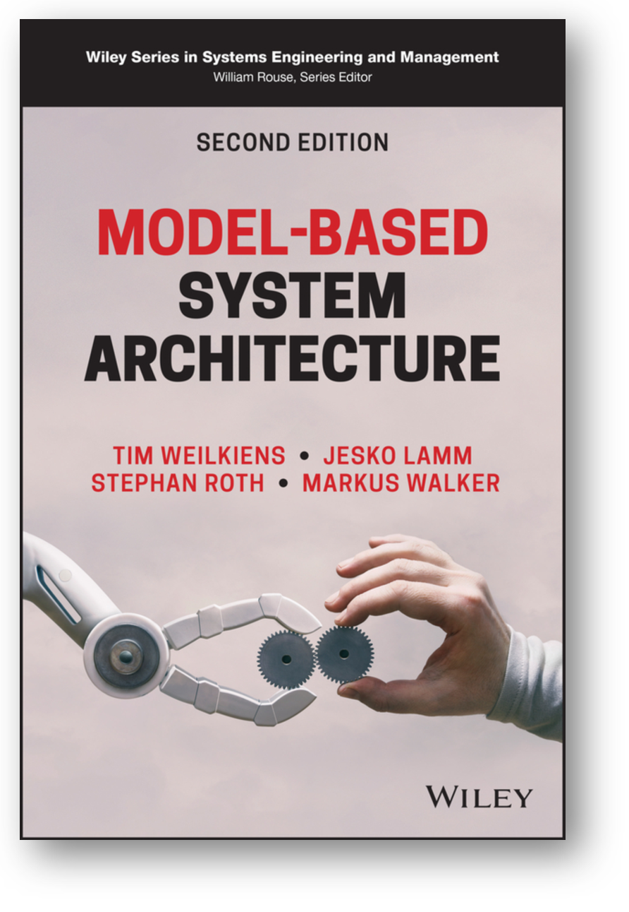
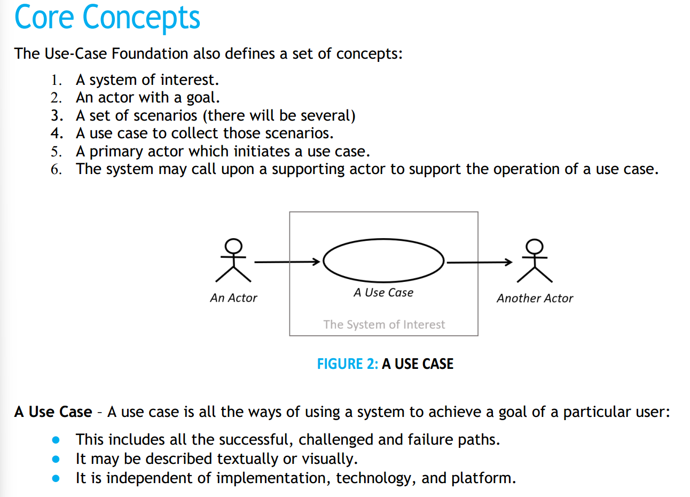
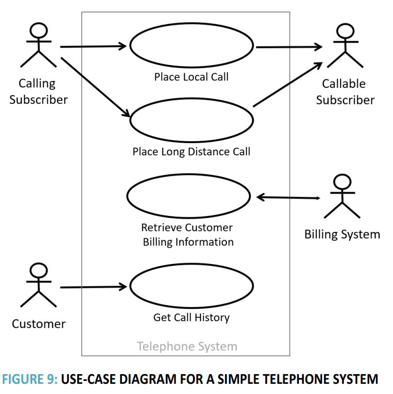
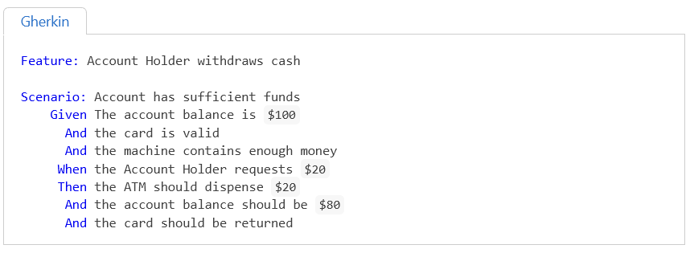
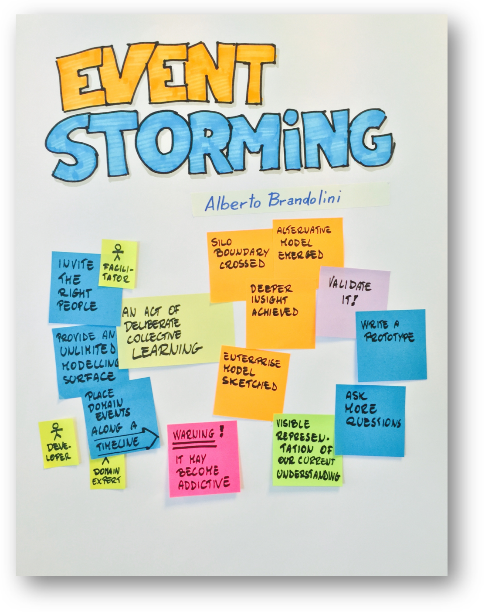
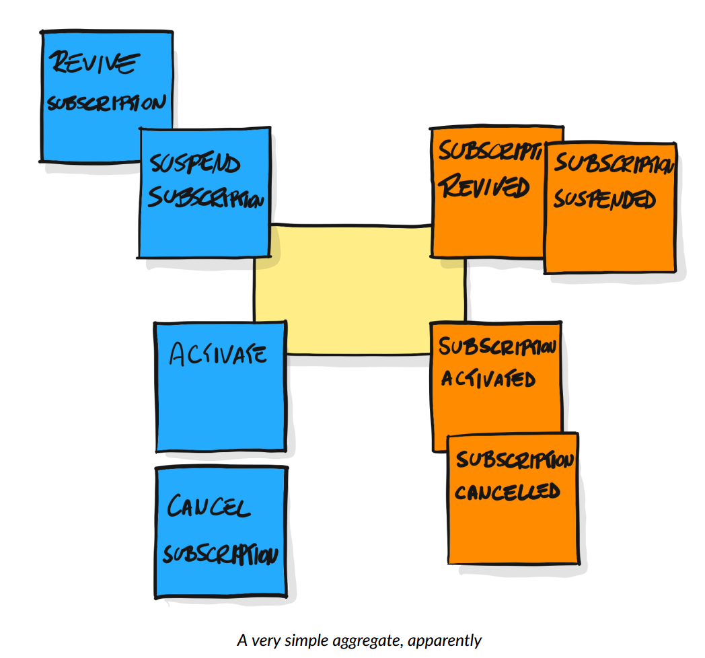
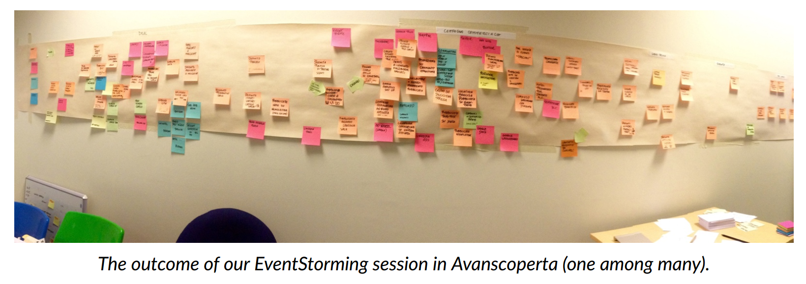
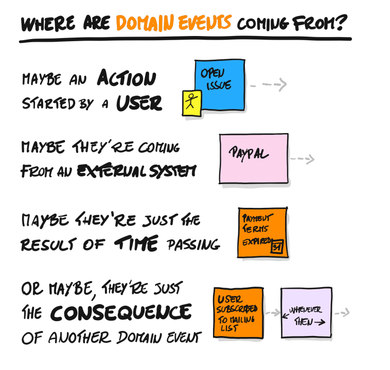

# Сценарии использования

Люди очень трудно учатся думать о функциях как поведении какого-то функционального объекта, ибо это требует абстрагирования от конструктивного объекта или их совокупности, которые играют роли функциональных объектов. В жизни мы наблюдаем «результаты изобретений», уже найденные аффордансы. Поэтому для нахождения в уже готовой системе функциональных объектов её надо как-то «разизобрести» в уме, «спроектировать назад» (reverse-engineering[^r8-1]). Если этого не сделать, то будет непонятно: продолжит ли система выполнять свою функцию, если в ней как-то «пошевелить» конструкцию, заменить какие-то одни аффордансы на другие. Скажем, вы слышите, что цитрусовые спасают экипажи парусных судов от цинги. Закупаете цитрусовые, плывёте — и понимаете, что цинга цитрусовыми не убирается. Это потому, что важна была функция цитрусовых в поставке организму витамина C, но содержание этого витамина в разных цитрусовых было разным. Поэтому кому-то с цитрусовыми и цингой везло, а кому-то — не везло, ибо не было понимания функционирования, мышление было только про конструктив — «цитрусовые». Эта история рассказана в книге «The Book of Why»[^r8-2], рассказывающей о рациональном причинно-следственном мышлении.

В руководстве по рациональной работе наставляется, как думать про причины-следствия. В работе функционального проектировщика (functional designer) вы как раз при описании будущей функциональности системы отвечаете на вопросы «почему система успешна (будет работать, как ожидается)», а после изготовления системы делаете reverse engineering для неудачных конфигураций воплощения системы (в том числе отладку/наладку/debug/troubleshooting) в порядке поиска неисправности: отвечаете на вопрос «почему система не успешна (не работает, как ожидается, и/или не будет работать, как ожидается)». Конечно, функциональный проектировщик занимается этим в ходе инженерных обоснований (об этом будет ещё раздел в нашем руководстве), но всё-таки его работа связана ещё и с формулированием того, каково же ожидается поведение системы в ходе её эксплуатации — и это будут как описания «чёрного ящика» (функциональность системы в целом), и как «прозрачного ящика» (функциональное описание динамики взаимодействия подсистем, часто на несколько системных уровней «вниз»).

В руководство по методологии было добавлено довольно много материала только для того, чтобы пояснить понятие «метод» как поведение организационной роли. Мы задаём очень абстрактную сигнатуру метода (что надо сделать с чем: какой предмет метода провести задействованием метода в какое состояние), идея приходит откуда угодно, одобрить её должен визионер, они с архитектором грубо определяют, какая предметная область важна для реализации требуемого метода. Если надо добыть огонь, то передадут химикам или физикам, если надо покрасить стену — малярам, если надо набрать клиентов — маркетологам. Затем прикладной методолог предметной области предлагает разложение метода: некоторый набор функций, который выдаёт требуемое сигнатурой поведение. Выполнять эти функции будут какие-то подсистемы (взятые как функциональные/ролевые объекты, мастера в выполнении функции/метода, их предложит методолог/«функциональный проектировщик»). А роли этих подсистем потом исполнят конструктивные объекты — механические детали, оборудование, живые организмы, люди и подразделения, их подберёт проектировщик, сообразуясь с архитектурными решениями, которые даст архитектор. Всё это примерно так происходит для многих уровней целевой системы вверх и вниз для самых разных систем этих уровней, говорят «рекурсивно». А ещё это работает итеративно, инкрементально (говорят про эволюционную/непрерывную разработку). И работают тут команды, в которых люди и их компьютеры выполняют разные роли для разных систем в составе целевой системы и её окружения, а также систем в графе создателей — поэтому даже нельзя говорить о чёткой специализации людей в команде.

Несмотря на то, что функциональное проектирование происходит отнюдь необязательно «сверху вниз» (декомпозицией сигнатуры функции всей системы, мы уже обсуждали, что это из области фантастики), и необязательно «снизу вверх» (чистый синтез, без шагов декомпозиции, это ведь тоже утопично), а по сложным траекториям в ходе эволюционной разработки, логически первым всё-таки определяется поведение системы как «чёрного ящика»: если вы не представляете, что будет делать ваша система, никакие идеи по её внутреннему устройству вам не помогут. Логически вначале вам надо иметь хоть какую-то концепцию использования, затем она будет уточняться по ходу разработки (в том числе продолжит уточняться и после начала эксплуатации!). Далее прорабатываем концепцию системы, чтобы убедиться в возможности выгодного воплощения системы (невыгодное — не делаем!).

По большому счёту, проработка концепции использования и концепции системы — это командная (часто даже нескольких команд) работа по одному и тому же методу на двух смежных системных уровнях, рекурсивное применение системного мышления. Поэтому дальше мы не будем уточнять, концепцию использования мы имеем в виду, говоря о функциональном проектировании, или концепцию системы. В одном случае нам нужно понимать, как устроена надсистема в части использования функциональности целевой системы, в другом — целевая система в части использования функциональности подсистем.

При создании концепции первая стадия — это определить функцию, которую потом нужно будет реализовывать конструкцией.

Понятие кейса (случая, дела, case) в инженерии идёт от судебных и медицинских дел/cases, отсюда же и «папка дела»/«case file», где ведётся журнал происходивших в ходе прохождения кейса событий. Кейсы — это работы, у них есть предмет, с которым они работают, кейсы называются по этому предмету (кейс пациента Васи, кейс поломанного автомобиля №5), иногда работа задаётся через сигнатуру метода плюс указание на экземпляр предмета, который методом доводится до конечного состояния (кейс лечения пациента Васи, кейс починки автомобиля №5). Понятие кейса — из управления работами, <strong>кейс—</strong> <strong>это</strong> <strong>экземпляр</strong> <strong>работы</strong>.

Но есть и <strong>использование понятия кейса</strong> <strong>для</strong> <strong>указания</strong> <strong>метода работы, называется тогда это</strong> <strong>«usecase»</strong> <strong>и перевод—</strong> <strong>«сценарий использования».</strong> «Сценарий» как раз указывает на паттернированность происходящего, то есть на метод, подразумевается прохождение множества работ по этому методу, описанному сценарием. Использование — это использование системы, которая является предметом метода. <strong>«Usecase» тут</strong> <strong>икак</strong> <strong>название метода описания методов работы системы с её окружением в момент эксплуатации/использования, так и указание на тип сигнатуры метода, описываемого соответствующим сценарием.</strong> Как всегда, определить значение словосочетания «use case» (методология описания самых разных методов использования самых разных систем или тип метода использования какой-то системы), можно из контекста. «Ivar Jacobson изобрёл сценарии использования», «в нашем проекте мы используем для описания концепции использования сценарии использования» — это про метод описания. «Сценарий использования дымогенератора», «сценарий использования вышивального станка» — это про целевой метод, описываемый при помощи метода use case.

Предмет метода для use case — это целевая система, определяемая как функциональный объект, который в мир демонстрирует какое-то поведение-функцию. Если мы говорим о кейсах/сценариях использования (use cases), то речь идёт об использовании какой-то системы в абстрагировании от её разбиения на части. <strong>В</strong> <strong>методахusecasesописание системы как чёрного ящика идёт в терминах действий самой системы, а окружающие систему предметы (и даже люди) выступают как пассивные (хотя они вполне могут вызывать какое-то поведение системы).</strong>

Например, человек-пользователь нажимает кнопку «пуск», система в ответ на это пускает дым (это может быть даже не шуткой: дымогенераторы массово используются как оборудование в танцзалах, барах, театрах). Вот это поведение пуска дыма системой и моделируется. <strong>Метод описания функциональностиusecase</strong> <strong>моделирует то, что делает система в ходе её использования, а не то, что делает пользователь (поведение пользователя важно только постольку, поскольку он влияет как-то на систему, а система влияет на него).</strong>

Далее можно обсуждать, греется ли после этого система, чтобы испарять какое-то вещество в качестве дыма, или взрывает источник дыма, или просто передаёт сигнал в какой-то внешний сервис, который вызовет дым, или ещё что там будет происходить. Это всё будут альтернативные сценарии, которые могут породить какие-то дополнительные особенности поведения системы, но для начала нужно всё-таки определиться, что нам нужно поведение какой-то системы-дымогенератора, нам нужно «дымить», это даст нам сигнатуру метода. Если нам нужно «вышивать гладью», то всё будет по-другому (можно будет думать о швее, автоматическом вышивальном станке, закупке всего вышитого и устройстве автомата по выдаче очередного уже готового изделия, 3D-печати рельефного изображения вышивки гладью и т.д.). Но сначала-таки — что и в каком окружении с чем делать (сигнатура), а потом уже варианты реализации (разложения метода на составляющие). Вот use case как раз используется для задания сигнатуры метода используемой системы (метода использования системы).

Несколько вариантов методов use case обсуждаются в книге «Model-Based System Architecture», второе издание 2022 года:

Методы описания сценариев использования используются в работе функциональных проектировщиков наравне с разными другими методами описания поведения, которые мы упоминали в предыдущем подразделе, но особенно они распространены в описании поведения разных гаджетов (платёжные терминалы) и программных приложений (телефонные приложения). Мы касаемся сценариев использования чуть более подробно просто потому, что они более-менее просты в освоении и поэтому крайне распространены среди программистов.

Функции концепций верхнего уровня (концепции использования для функций системы и концепции системы для функций подсистем), документированные в виде диаграмм use cases далее декомпозируются до так называемой «функциональной архитектуры» (или наоборот: функциональные архитекторы предлагают функциональную организацию системы, которая позволяет синтезировать функциональную архитектуру — мы уже много раз повторяли, что возможно и одно, и другое рассмотрение, но в целом там эволюционный процесс с шагами разной направленности).

В книге «Model-Based System Architecture» описан метод FAS (functional architecture for systems). Метод описан с прицелом именно на декомпозицию, классическое «описание сверху вниз», что более-менее утопично, но вроде как «золотой стандарт» старинной системной инженерии — и вот этот стандарт попал и в современную моделеориентированную системную инженерию.

В разных инженерных школах по-разному понимается, кто именно занимается этим функциональным разбиением: функциональные архитекторы (функциональные проектировщики), или все разработчики по-чуть-чуть, то ли те же самые инженеры, которые выполняют роль и архитекторов модульной структуры («опытные разработчики»). Про эволюционных архитекторов, которые занимаются модульной структурой — будет в следующем разделе.

Пока же укажем, что методов моделирования use case множество, и в указанной книжке кратко описываются в главе «10. Model-Based Requirements Engineering and Use Case Analysis» три, а заодно даётся краткий понятийный/онтологический анализ самого понятия use case. Но при их рассмотрении нужно учесть особенности книги, авторы которой придерживается классического «водопадного» взгляда на системную инженерию киберфизических систем.

В этой книге до сих пор признаётся важность требований, и use cases (сценарии использования) даются как функциональные описания, важные для разработки требований, а не сами по себе важные. В книге много исторических рассказов, много обсуждений разницы в употреблении терминов, но эти рассказы обрываются там, где заканчивается история «водопада», переход к современной гибкой разработке того типа, который повсеместно в развитых компаниях используется для программных систем в книге только-только намечается. Не то чтобы этого перехода не случилось, он случится, но как обычно: новые идеи разработки сначала обкатываются в программной инженерии, и только потом приходят в самые разные остальные виды инженерий.

В книге используется диаграммный язык моделирования SysML (в предыдущей цитируемой нами книге «Systems Architecture. Strategy and Product Development for Complex Systems» в качестве такого диаграммного языка моделирования выступал язык моделирования OPM). И SysML, и OPM — диаграммные нотации, «наскальные рисунки», простые для понимания «изображения охоты» на модульность и функциональность — но не слишком выразительные, а главное — не поддерживающие эволюционную разработку, их слишком сложно сопровождать, это действительно «наскальная живопись»: один раз нарисованное дальше очень трудно перерисовывать.

Вовсе необязательно пользоваться диаграммными нотациями, у них есть много недостатков по отношению к недиаграммным методам моделирования. Есть на эту тему целая книга «Визуальное мышление. Доклад о том, почему им нельзя обольщаться»[^r8-3]. В книгах диаграммные нотации оказываются удобны, ибо их там не предполагается часто менять и ещё проекты из книг очень небольшие. <strong>Но</strong> <strong>книга совсем не пример происходящего в реальном</strong> <strong>современном</strong> <strong>инженерном проекте!</strong> <strong>Диаграммные нотации хороши для однократного «постулирования», но не для постоянных изменений, которые предполагаются в эволюционной разработке, где система постепенно развивается/evolve</strong> <strong>и поэтому постепенно изменяют все её описания.</strong>

Сценарии/scenarios в книге вводятся отдельными понятиями, и они в книге считаются текстовыми, а сценарии использования/use cases выражаемыми в какой-то из диаграммных нотаций — и тут же признаётся, что <strong>сценарии тоже можно считать сценариями использования, дело не в нотациях. И разные «истории» (storyboards</strong>[^r8-4]<strong>,</strong> <strong>story-telling) тоже можно считать вариантом сценариев использования, они призваны держать разработчиков интерфейсов и ответственных за «опыт использования» (UI/UXdesigners) приземлёнными/grounded, то есть должны показывать</strong> <strong>картинки окружающего мира, чтобы те понимали, что работают не с описаниями, а с физической системой в физическом мире.</strong> <strong>Для разработчиков небольших телефонных приложений используются методики типа</strong> <strong>JTBD, где фокус перемещается с «хотелок» проектных ролей, выраженных в виде</strong> <strong>userstories,</strong> <strong>на контекст этих «хотелок», выраженных в виде</strong> <strong>jobsstories</strong>[^r8-5]<strong>.</strong> <strong>Мы тоже так считаем, смотреть нужно не на формат документирования</strong> <strong>(нотацию), а на объекты внимания для этих моделей.</strong>

Помним, что в книге предлагается три варианта метода use case, но вот изобретатель этого подхода моделирования Ivar Jakobson со товарищи предложил в 2024 году новую модификацию метода Use Case 3.0[^r8-6]. Этот метод Use case 3.0 предлагает делить use кейс на «кусочки»/slices, которые реализовывать по очереди, чтобы уменьшить размер одной работы и уйти от «водопада» если не в самой разработке (все эти кусочки кейса вам придётся всё равно готовить сразу!), то в реализации. Но более того, эта третья версия методологии расширяет метод описания поведения системы до урезанной, но всё-таки полноценной методологии разработки, ибо прописывает, как именно получаемые описания функциональности используются в полном инженерном процессе — и описывает инженерный процесс с использованием нотации OMG Essence.

В самом методе «от автора» применяется диаграммная нотация use case, но это совсем необязательно (можно использовать табличную нотацию).

Вот основные концепты Use Case 3.0 и вводимая им нотация:

Итак, use case — это способ собрать под одним именем набор сценариев (под сигнатурой метода собрать его разложение на набор составляющих сценариев). Если вы понимаете, что речь идёт просто о ещё одном мнгочисленном способе описания функций системы как функционального объекта, а также отслеживаете строгость типов в разговоре про use case, то уже легко разобраться.

Вот пример графического моделирования use case (пример тоже из документа, задающего метод Use Case 3.0), там система не показана вообще, зато показаны действия со стороны акторов окружающей среды, которые как-то упорядочены во времени, чтобы «рассказать историю». Предполагается, что система выдаёт во внешний мир функции, удовлетворяющее показанным воздействиям (они даются глаголом, указывают на метод актёра кейса, поддержанную целевой системой):

Методы для моделирования и документирования сценариев использования могут использоваться самые разные, и в каждом из них есть нюансы. Интересно, что описание всех этих методов — это небольшие статьи на десяток страниц. Но вы вряд ли сможете нормально воспользоваться этим десятком страниц, если не будете понимать роль и место этого десятка страниц описаний метода во всём инженерном процессе в целом.

Когда массово начали пользоваться use cases для разработки требований, стало понятно, что этот приём моделирования хорошо работает не только для описания поведения системы с людьми-пользователями, но и для выражения поведения системы в неживом окружении: акторы могли быть произвольными, не только людьми. Потом стало понятно, что это совершенно необязательно делать только для самого верхнего уровня системного разбиения (для целой системы), но метод отлично работает и для подсистем. Потом стало понятно, что проще с коллегами (внешними проектными ролями, разработчиками подсистем и т.д.) обсуждать эти сценарии использования, дополняя их деталями по мере проработки концепции (при каждом проектном выборе конструктивного решения появляются дополнительные вопросы: если мы выбрали чёрный корпус, то вдруг могут появиться вопросы к температуре корпуса и пожаробезопасности, ибо внутри кто-нибудь сделал печку с открытым пламенем для постоянного подкопчения корпуса — и в сценарии использования этот вариант не был предусмотрен!).

А требования? В use case проясняются важные предметы интереса всех проектных ролей, их интересы (куда двигаем значение важных характеристик), и пытаемся достичь возможного — предлагаем сразу решения проблем и говорим, насколько удовлетворяются интересы. Спецификаций требований как отдельного рабочего продукта не делаем, но продолжаем обсуждать сценарии использования как описание функциональности и проектные решения — концепции системы и частей системы. Делаем это и для самого верхнего уровня (стратегирование, «какую целевую систему хотим делать», «как хотим изменить мир»), и для более низких уровней, переходя к функциональным декомпозициям и дальше к учёту архитектурных характеристик.

Но и это не конец истории! Появляются DDD, TDD и BDD (это уже обсуждали в подразделе «Смерть инженерии требований» — и вместе с ними идея, что гипотезы о функциональности системы надо описывать сразу в том виде, в котором в изготовленной системе эту функциональность можно проверить/протестировать. Это означает, что описание функциональности надо делать сразу на языке тестирования, это SoTA. И (мы об этом уже писали) сценарии (которые, конечно, взяты из литературы по use cases) записываются не в графической нотации, которую нельзя использовать для проверок, а сразу на языке, подразумевающем проверки (в разработке программного обеспечения это чаще всего язык Gherkin, и уже предложены способы записи сценариев поведения системы, как тестируемых). Вот пример такого сценария, который описывает, что должна делать система — в форме, которая кладётся в основу тестов[^r8-7]:

А что с DDD? Для use cases предполагалось, что при их описании каким-то образом будут выявлены понятия (предметы и операции/методы/культура работы с этими предметами) предметной области, проведена работа прикладного методолога. В программной инженерии в уже упомянутой книге «Learning Domain-Driven Design. Aligning Software Architecture and Business strategy» говорится, что объекты предметной области предприятия можно перечислить в каком-то глоссарии, но этого знания будет совершенно недостаточно: не будет хватать информации о поведении этих объектов, их функциях. Для документирования этой информации тоже предлагались use cases. Но вот беда: начальные версии DDD тоже предполагали, что добытая информация о предметной области документируется в виде требований, это ведь уже довольно древний метод!

Нынешние варианты построения описаний говорят о важности предметных областей (domains, bounded contexts — основная идея DDD, равно как и идея о том, что программные средства моделируют эти предметные области и поэтому в моделях должны быть объекты, прямо соответствующие объектам предметной области). Для этих предметных областей предлагается находить события и методы, которые ведут к событиям как достижениям какими-то предметами методов их состояний. Для документирования систем как создателей с их методами/функциями, предметов этих методов в окружении создателей, событий с этими предметами, предлагается довольно большой выбор методов описания процессов/функций/методов/сценариев. В том числе это методы предыдущего подраздела, но и многие другие, включая методы описаний сценариев в виде наборов сценариев использования — тоже на самых разных языках. Скажем, в том же методе Use Case 3.0 говорят ещё и о нарративах, которые определяют цепочку событий — «рассказ о событиях». Скажем, наш граф состояний альф как объектов внимания в проекте, если рассматривать его как граф событий достижения этих состояний, можно назвать нарративом.

Но вот дальше вопрос: что делать с этими описаниями:

* Использовать для подготовки дублирующих описаний (требований). Это уже устарело.
* Использовать для проектирования, повышать детализацию до уровня, достаточного для изготовления и последующей наладки. Да, именно так.
* Использовать в том числе и для инженерных обоснований — да, для этого можно вернуться к предыдущему пункту и попросить сразу писать в таких нотациях, в которых будет удобно получать инженерные обоснования автоматически (пример с использованием языка Gherkin). Это соответствует behavior-driven development, BDD. Это SoTA.

А что же со «свежими» стандартами вроде Use Case 3.0? С этими стандартами сегодня проблемы, хотя их авторы и пытаются как-то идти в ногу со временем — и изобразить «гибкий водопад». Если вы хорошо понимаете материалы наших руководств по рабочему развитию инженеров-менеджеров, вы вполне можете разобраться с тем, что в этих стандартах можно вытащить в ваши проекты интересного, а что лучше не вытаскивать[^r8-8].

<strong>Итого: сначала нужно понять функцию системы, её поведение—</strong> <strong>в форме, которую легко потом проверить/протестировать. Рекомендуется всячески задержаться на этом уровне рассуждений, максимально отстраняясь от возможной реализации этого поведения какими-то конструктивными объектами, включая даже сам конструктив целевой системы.</strong> <strong>Сначала понять, какого хотим поведения системы, что она должна делать в окружении. Предложить вариант конструктива</strong> <strong>«чёрного ящика»</strong> <strong>системы, чтобы можно было</strong> <strong>как-то</strong> <strong>представить её в</strong> <strong>составе надсистемы</strong> <strong>как модуль. Узнать предельную стоимость, чтобы понимать, выгодно ли вообще заниматься созданием системы. Это всё—</strong> <strong>заниматься концепцией использования, «чёрный ящик» (ну, или «прозрачный ящик» для уровня надсистемы).</strong>

<strong>Потом (логически потом, ибо в жизни тут будет много итераций, циклов, ухода в другие инженерные методы, например, нужно будет рассматривать идеи «изобретения», поиска аффордансов—</strong> <strong>кроме функционального проектирования заниматься и</strong> <strong>классическим проектированием, кроме функциональной архитектурыещё и модульной архитектурой, и всё это эволюционно) надо будет разбираться с «прозрачным ящиком», то есть рассматривать функциональную организацию на уровне подсистем. И там всё то же самое—</strong> <strong>это часть разработки концепции системы. Но если не понимаешь, как система будет использоваться, хотя бы в общих чертах—</strong> <strong>непонятно, что там нужно иметь внутри системы, чтобы она была успешной. Поэтому будет</strong> <strong>множество уточнений, высказывания гипотез, критики гипотез, возвратов назад, генерации новых идей—</strong> <strong>ничего похожего на «сверху вниз» или «выполнение шагов алгоритма».</strong>

Мы тут много раз говорили о системной мантре, говорили о мантре элегантности/lean («распожаризация»), говорили об операционной мантре (поиск ограничений и подстройка под ограничения), будем говорить о мантре рациональности (принятия решений), но это «логические шаги». В жизни всегда эти шаги планируются и делаются в условиях недостатка информации, поэтому выполнение этих «алгоритмов» абсолютно нелинейно, не «пошагово» — но и не полностью беспорядочно. Повторим: если вы не понимаете, что ваша система делает с её окружением, вы не можете предложить конструкцию! Если вы понимаете конструкцию, то можете попробовать уточнить функцию — что там в жизни реально делать такой конструкцией, а что утопично (и надо или соглашаться с этой уточнённой функцией, или предлагать другую конструкцию). Это всё сокращённый разговор, более полный — надо понимать функцию, затем систему как функциональный объект с функциональной организацией, затем систему как конструкцию с конструктивной структурой. Ну, и помним, что там множество синонимов с нюансами, поэтому формулировка эта может быть записана самыми разными словами.

<strong>Если вы не знаете, что должна делать система, то вы не сможете</strong> <strong>изобретать, то есть разбираться с тем, как добиться</strong> <strong>желаемого</strong> <strong>поведения</strong> <strong>системы.</strong>

Кейсы/сценарии использования (use cases) как методы и кейсы как работы/дела (в управлении работами это будет кейс менеджмент, case management, управление «делами») в инженерии тесно связаны. В руководстве по системному менеджменту (инженерии предприятия, то есть системной инженерии в приложении для организаций) будет рассказано, что учёт работ/дел в фирме происходит как учёт «кейсов», которые обобщают процессное (используются шаблоны действий в методах) и проектное управление (используется предварительное планирование) на случай, когда ничего нельзя спланировать заранее в ситуации гибкой разработки (тогда просто планируется каждое следующее действие «на лету», а результаты записываются в папку «Дело №\_\_\_», то есть в case file).

Кейсом называются работы, которые делаются с каким-то предметом кейса как меняющей свои состояния в ходе работ альфой. Состояния альфы иногда плохо определимы, но мы можем о них судить по состояниям ряда рабочих продуктов. Работы переводят эту альфу из состояния в состояние, достижение состояний — событие, прохождение событий иногда называют нарративом/повествованием.

Когда альфа предмета кейса находится в первом состоянии (скажем, пациент больной), кейс открывается, а когда в последнем (пациент здоров или умер) — кейс закрывается. Помним, что граф состояний альфы может быть весьма запутанным. Каждое состояние характеризуется своим названием (дверь закрыта, самолёт летит) и контрольными вопросами его достижения, которые по сути «подсостояния», которых нужно достичь (кейс закрытия двери, предмет кейса и тем самым отслеживаемая альфа кейса — дверь, состояние «закрыта», подсостояния для контрольных вопросов чеклиста: щелей между дверью и косяком нет, замок заперт, ключ из замка вынут).

В руководстве по методологии говорилось, что методы — это способы работ по смене состояний каких-то альф, работы ведь всегда ведутся с предметами работ, которые меняют состояния. Эти работы и предметы работ ведутся какими-то методами с предметами этих методов. В системном менеджменте управляют работами как кейсами по изменению состояний рабочих продуктов, а работы эти идут по методам, которые меняют состояние альф.

Для управления работами нужно выявить (если эти работы уже происходят) или определить (если вы только проектируете деятельность) альфы и подальфы с их состояниями и контрольными вопросами, а также методы, которые переводят эти альфы из состояния в состояние. Если встречается что-то необычное, то эта работа по устранению необычности планируется «на лету», по мере открытия новых обстоятельств дела/case, ровно как в судебном деле: каждая новая улика может повернуть дело в совсем другом направлении, но в конечном итоге дело/case будет закрыто.

В программной инженерии корпоративного софта его концептуальное проектирование (нахождение функций, которые софт должен выполнять) предлагается делать в рамках предмето-ориентированного проектирования (DDD, domain-driven design) так, чтобы программное обеспечение непосредственно отражало структуру предметной области предприятия. В системном менеджменте это означает, что нужно выявить (в случае создания «с нуля» спроектировать, то есть предложить гипотезу/догадку и дальше её дорабатывать или менять на новую, пока не получится успешность, эволюционная fit/вписанность системы в окружение) альфы и подальфы в каждой области интереса графа создателей, изменяющие их методы, роли для этих методов и агентов/актёров, выполняющих эти роли.

Книга «Introducing EventStorm», 2021 (она остановилась в своём дописывании на 2021 годе, но до этого использовала continuous delivery, выходило множество версий/изданий, немного отличающихся друг от друга — не «первое, второе, третье», а просто с какими-то датами последних правок, это соответствует практике continuous delivery[^r8-9]) предлагает ровно такой подход, хотя и в немного другой терминологии, вам должно быть с этим уже довольно легко разобраться — если для каждого понятия, обозначаемого термином предметной области метаУ-модели EventStorm определять его тип мета-мета-модели из наших руководств для инженеров-менеджеров:

Можно смотреть на EventStorm и как на метод функционального обратного проектирования предприятия (а именно, выявление функциональных объектов и их оргфункций для уже работающего предприятия). Дальше это можно использовать и для проектирования организационных изменений (прямое проектирование инкремента, «выпуска» новой версии предприятия как создаваемой системы), а можно использовать как часть проектирования софта, поддерживающего работу предприятия (что, собственно, и предполагает метод EventStorm в его исходном виде, излагаемом в книге).

Метод EventStorm предлагает моделирование, в чём-то похожее на диаграммное, но всё-таки не совсем: в качестве элементов синтаксиса модели предлагаются не иконки на экране, которые потом свяжутся стрелочками, а липкие листочки с надписями (тип мета-мета-модели кодируется цветом листочка, а тип мета-модели из предметной области предприятия пишется на листочке).

Вот как выглядит представление альфы «Подписка/Subscription» (альфа как объект с отслеживаемым состоянием в EventStorm имеет тип aggregate и кодируется листочком жёлтого цвета, на картинке тип aggregate/alpha текстом не подписан, но цвет листочка — это и есть отображение типа):

Состояние альфы/aggregate кодируется оранжевыми листочками типа Event, но есть нюанс: листочки означают момент наступления состояния. Cобытие — это ситуация в момент времени, разделяющий прошлое состояние и будущее, например «подписка активирована» означает в EventStorm событие наступления состояния «подписка активирована», там страдательное причастие совершенного вида в названии. В английском это передаётся глаголом в прошедшем времени. Помним, что в use case предложено последовательность событий называть нарративом, но в EventStorm этот термин не используется.

Голубые листочки — это методы/функции/операции, которые ведут к изменениям состояния альфы («двигают повествование от события к событию»), в EventStorm это будут «команды/commands». Так что на стене вы получаете какую-то модель методов предприятия, где предметом методов будут альфы/агрегаты, меняющие свои состояния, будут исполняться какие-то методы/commands какими-то ролями в какой-то последовательности (сценарии/кейсы), выглядит эта модель в виде сгруппированных приблизительно по линии логического времени листочков на стене примерно так:

Методика моделирования делает акцент на то, что все события предметной области (domain events) случаются не сами по себе, а происходят по основным четырём причинам, и поэтому для каждого события (его легко обнаружить! «что-то изменилось в ситуации») нужно отмоделировать и причину события.

Таким образом мы получим более-менее полную модель, пригодную для case management, основной задачи, решаемой корпоративным софтом: управление конфигурацией работ предприятия: каждый кейс как метод/сценарий соответствует кейсам-работам по этому сценарию (напомним: case в use cases — это метод, в case management — работа по методу).

Конечно, результат EventStorm не слишком детален, чтобы служить хорошей концептуальной моделью. Например, в EventStorm не делается различий между альфами и рабочими продуктами, которые позволяют судить о состоянии альфы, то есть нет собственно «концепции» как описания связки между функциональностью и функциональными объектами, и конструктивными объектами, поэтому ситуации типа «ножницы из режущего блока и ручки и ножницы из двух половинок и винтика» моделируются исключительно плохо и криво. Но очень часто альфы и реализующие их рабочие продукты соответствуют 1:1 (скажем, член команды как альфа сотрудника и член команды как человек), хорошо спроектированные системы стремятся к такому, поэтому как начало моделирования EventStorm вполне подойдёт. Вы можете использовать оригинальную терминологию из EventStorm, можете использовать терминологию из нашего руководства по методологии (она взята главным образом из стандарта OMG Essence и системной инженерии киберфизических систем), можете как-то сами доработать и сам метод моделирования (вместо стены и листочков использовать универсальные LowCode моделеры типа notion.so, coda.io или подобные, или даже использовать таблицы в Excel). Главное, чтобы вы понимали, что делаете: вы работаете над концепцией предприятия (в том числе и концепцией использования, но и концепцией предприятия как системы) в части функционального проектирования, то есть выявляете/реверс-проектируете его поведение, его методы изменения состояния каких-то объектов, а также события изменения этих состояний. Реализуется это кейсами как работами/делами по сценариям использования (use case — слово case тут имеет разные типы для use case и case из case management). Эти дела/работы дальше в порядке управления кейсами отслеживаются/track в issue tracker.

Моделирование кейсов::работ для управления кейсами по факту не отличается от обычного описания «use case»::«методов работ», только меняется тип объекта и референтный индекс<strong>:</strong>

* <strong>Для</strong> <strong>usecaseсистема—</strong> <strong>это создатель в момент его эксплуатации, действует она, именно она изменяет мир своим поведением, а также реагирует на поведение мира своим поведением. Не пользователь жмёт кнопку системы, а наоборот—</strong> <strong>у системы пользователем нажимается кнопка. Описание ведётся со стороны системы, а не со стороны действий окружения системы.</strong>
* <strong>для кейс менеджмента</strong> <strong>мы чаще видим</strong> <strong>альфу</strong> <strong>из области интересов</strong> <strong>какой-то создаваемой системы, для</strong> <strong>изменения</strong> <strong>которой проводится работа какой-то другой системы-создателя</strong> <strong>из графа создателей,</strong> <strong>альфа этапассивно меняется под действием</strong> <strong>методов, выполняемых</strong> <strong>создателем в момент создания.</strong>

Понятно, что при этом речь может идти об одной и той же ситуации, только различаются способы моделирования для разных ролей с их разными интересами:

* В моделировании <strong>сценария использования/«usecase»</strong> я буду писать, что система «дверь» переходит при взаимодействии с ролью «закрыватель двери» в состояние «закрыта» после действия «закрыть дверь» (акцент на то, что будет должна делать дверь как целевая система, реагируя на воздействие окружающей среды).
* В моделировании метода дляописания <strong>кейса в</strong> <strong>casemanagement</strong>я буду писать, что систему «дверь» методом «закрытие» роль «закрыватель» перевела в состояние «закрыта» (акцент на то, что будет должен делать закрыватель двери, чтобы дверь перешла в ожидаемое состояние).

А как надо, какую позицию восприятия надо занять? Надо так, как вам удобнее для вашего проекта. Главное, чтобы вы понимали, что именно делаете, какой метод моделирования задействуете, и какие были ему альтернативы.

Моделирование работ по их методам/функциям для последующего управления работами/делами в варианте case management можно использовать отнюдь не только для case в менеджменте предприятия, эти cases/случаи/ситуации можно моделировать хоть в киберфизической системе, хоть в обществе, хоть в живом организме, хоть в личности: <strong>вы можете менять позицию восприятия с «с системой активные роли что-то делают в ходе её создания, она ещё сама ничего сделать не может» (кейс менеджмент, смотрим на работу и переходим на рассмотрения метода/способа работы) на «система что-то делает</strong> <strong>с окружением</strong> <strong>в ходе её эксплуатации» (сценарии использования).</strong> <strong>В любом случае обсуждаются ситуации</strong> <strong>*взаимо</strong><strong>*действия (готовой или ещё не готовой, это по ситуации) системы и её окружения.</strong>

Во многих методах моделирования в полной мере не доходят до чёткого представления обо всех полезных объектах внимания: система как функциональный объект в момент эксплуатации, альфы области интересов какой-то системы как отслеживаемые в проекте объекты, агент/актор/актёр как конструктивный объект живой или не очень живой как система в графе создателей или окружении, роль этого агента-создателя, рабочий продукт как конструктивный объект, и т.д.

Для того, чтобы детально отмоделировать сложную ситуацию, вам как функциональному проектировщику (прикладному методологу предметной области, функциональному архитектору, помним о множестве имён для роли) потребуется выявить (реверс-инженерия) или предложить (прямая инженерия) довольно много объектов в предметной области ситуации (мета-модель), соответствующих самым разным типам мета-мета-модели системной инженерии, даваемой в настоящем руководстве (понятия концепции системы, концепции использования, архитектуры и т.д.). И, конечно, <strong>вам нужно будет много общаться, чтобы договорить по поводу создаваемых вами функциональных описаний системы всех вокруг—</strong> <strong>и договорить внутренние/командные проектные роли, и внешние проектные роли.</strong>

[^r8-1]: <https://en.wikipedia.org/wiki/Reverse_engineering>

[^r8-2]: <https://en.wikipedia.org/wiki/The_Book_of_Why>

[^r8-3]: <https://ridero.ru/books/vizualnoe_myshlenie/>

[^r8-4]: <https://uxdesign.cc/17-reasons-to-use-a-storyboards-in-ux-design-2bc6fea73e20>

[^r8-5]: <https://tilda.education/articles-jobs-to-be-done>

[^r8-6]: <https://www.ivarjacobson.com/files/use-case_3_ebook.pdf>

[^r8-7]: <https://support.smartbear.com/cucumberstudio/docs/bdd/write-gherkin-scenarios.html>

[^r8-8]: <https://ailev.livejournal.com/1744571.html>

[^r8-9]: <https://leanpub.com/introducing_eventstorming>
