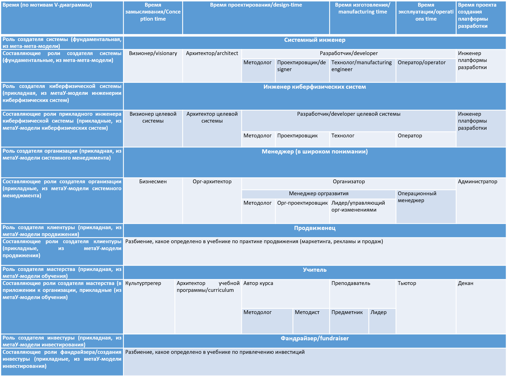
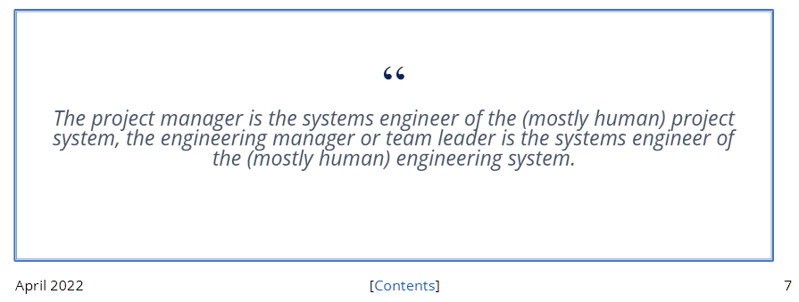

# Разделение инженерного труда

Все рассуждения про роли и создателей (из многочисленных синонимов-с-нюансами вроде агентов/IPU/«ренормализованных нейронов»/«единиц эволюции»/«систем» выберем тут создателя, подчёркивая аспект изменения окружающего мира без собственного разрушения, термин из constructor theory, мы рассматривали это в руководствах по системному мышлению и методологии) как инженеров полностью применимы к системным инженерам. Причём для системных инженеров как создателей будет два вида прикладной конкретизации в порядке «определения этой роли в жизни»/заземления/grounding:

* <strong>Конкретизация по линии</strong> <strong>масштабов и</strong> <strong>природы</strong> <strong>систем</strong> <strong>в каждом масштабе.</strong> *С<strong>истемный инженер* обычно занимается несколькими масштабами системы/продукта в её окружении, где на разных масштабах системы оказываются разной природы. Скажем, полупроводниковые чипы — ими занимаются электронщики, в полупроводниковом чипе на уровень ниже — IP как какие-то логические блоки на логических схемах, ими занимаются проектировщики микросхем, ещё ниже — транзисторы, которыми уже занимаются физики и химики, в самолёте тоже — уровнем ниже там двигатели, которыми занимаются двигателисты, и салон, который рассматривают по линии эргономики и эстетики. Вот системный инженер размышляет, как это всё собрать вместе в работающее целое. *П</strong>рикладные* *инженеры* по конкретным системам чаще всего занимаются каким-то одним видом системы, одной предметной областью, хотя при этом они хорошо знают уровень выше (в системы которого надо встроиться со своей системой) и уровень ниже (из систем которого собирают свою систему). То есть системный инженер на первом шаге конкретизируется по природе его целевой системы, например, в инженера-робототехника (скажем, должность «ведущий робототехник»), врача (инженера человеческого организма, чаще всего с проектами «ремонт», а в случае паталогоанатома — «вывод из эксплуатации»), инженер предприятия (скажем, на должности «директор по развитию» или «менеджер проекта»), инженер общества (скажем, должность «депутат Госдумы»). Эта конкретизация требует, конечно, обучения особенностям каких-то конкретных систем, в приведённых примерах нужно хорошо разбираться с дисциплинами, объясняющими работу роботов, предприятий, общества, с методами их создания и развития. Если ограничиваться только общими знаниями по безмасштабной эволюционной системной инженерии (например, знанием наставлений нашего руководства) и ничего не знать про особенности целевой системы, то будет «хотели как лучше, а получили как всегда». Уже давно нет «врачей вообще», ровно так же, как и «инженеров вообще» (хотя сто лет назад были и просто врачи, и просто инженеры) а есть врачи по отдельным подсистемам человеческого организма: отоларинголог, уролог, стоматолог, клинический психолог или даже психиатр. Ещё есть варианты тоже по линии изменения состояния целевой системы (педиатры, патологоанатомы). Вот это деление врачей по их целевым системам, как ни странно, ровно такое же, как и инженеров по их видам систем и подсистем: например, специалисты по фюзеляжам самолёта или инженеры-двигателисты в авиапромышленности. Врачи — это тоже инженеры, они тоже меняют физический мир к лучшему!
* <strong>Конкретизация по линии</strong> <strong>разных</strong> <strong>составляющих</strong> <strong>методов создания и развития</strong> <strong>одного и того же сорта систем</strong> —тут часто системными инженерами называют вполне прикладных архитекторов, занятых архитектурой системы в целом, а также инженеров внутренней платформы разработки (internal development platform), тоже вполне прикладных. Об архитекторах и инженерах внутренней платформы разработки тоже будут большие разделы руководства. Получается так, что «системным инженером» часто называют прикладного инженера, который занят увязыванием в одно целое работ многочисленных прикладных инженеров проекта. Это не случайно, ибо такой вроде бы прикладной инженер существенно задействует системное мышление. Интересно, что раньше сюда относили и инженера по требованиям — ибо требования вроде бы определяли всю систему в целом. Сейчас это не так, ибо сбор вместе всех требований оказался непродуктивным. Инженеры реализуют гипотезы по разным фичам/возможностям (в биологии это traits, признаки) системы, по возможности асинхронно друг от друга, это уже не требования, и согласования требований «всей пачкой» уже нет, об этом тоже будет рассказано. Деятельность методологов тоже не считается системной, ибо для разных фич/возможностей их функциональность обсуждается по-возможности независимо, а не совместно. Методологи поэтому «более прикладные» (хотя методология в целом, конечно, присутствует в мышлении всех инженеров — это же один из фундаментальных методов мышления в составе интеллект-стека).

У врачей тоже есть подобное разделение. Например, по типам методов вмешательства/«изготовления»: терапевт (неинвазивные вмешательства и сборка разных других видов вмешательств в работающее целое, «ввод в эксплуатацию»), хирург (инвазивные вмешательства), врач функциональной диагностики (нет вмешательства, только диагностика как часть проектирования будущего вмешательства). И тут обычно обязательно будет добавляться вид подсистемы системы (сердце, печень, мозг), ибо вид вмешательства/изготовления существенно может отличаться в зависимости от вида/природы системы. Так, хирург лет двести назад ещё не был ярко выраженной специализацией роли врача, а хирургия была просто одним из врачебных приёмов. Лет пятьдесят назад хирургия была уже отдельным методом в рамках врачебного разделения труда, а сейчас практически независимо практикуется нейрохирургия и кардиохирургия, да и в целом уже не встретишь «хирурга общего профиля», кроме самых захудалых сельских больниц. Конечно, на какой-нибудь подводной лодке можно встретить даже «врача» по всем вопросам, а в деревне «фельдшера» (даже не совсем врача, но тоже по всем вопросам), но это уже не типичная ситуация, не отражает «лучших известных на сегодня методов»/state-of-the-art (SoTA). В инженерных проектах по созданию киберфизических систем можно встретить инженера-электротехника, инженера-теплотехника, инженера-электронщика, но в маленьком стартапе на трёх человек можно встретить и просто «инженера», а исполнитель этой роли ещё будет прихватывать и другие роли — продавца, проектного менеджера и даже уборщика помещения. Так и в системной инженерии бывает «просто системный инженер», но сегодня чаще даже этот абстрактный метод изменения мира к лучшему разбивают на его составляющие — и для этих составляющих имеют разные роли. Вот эти роли[^r8-1]:

Тут хорошо видно, что роль системного инженера и составляющие этой роли — они фундаментальные, но вот прикладные роли для систем разной природы и составляющие этих ролей совпадают для киберфизических систем, но вот для систем другой природы названия существенно отличаются, хотя общая структура разделения труда остаётся.

Из руководства по методологии помним, что в случае методов работы плохо определяются части-целые (там функциональные описания, «функциональное программирование»), поэтому и для исполняющих эти методы ролей тоже трудно вводить иерархию частей-целых — хотя в системной инженерии часто делают упрощение и функциональные объекты-целые делят на части-подсистемы (функциональная декомпозиция), аналогично и роли-целые тоже делят на части-подроли, как и любые другие функциональные объекты, но это, конечно, упрощение. Поэтому мы сами иногда говорим «составляющие роли», а иногда — «подроли» (используя «под-» для указания не на специализацию или классификацию, но на композицию, «часть-целое», как в случае подсистемы).

Всё разнообразие прикладных ролей, которые получаются конкретизацией масштабов и видов/природы систем, а также составляющих их ролей, которые получаются конкретизацией методов создания и развития этих систем (то есть методов инженерии) будет выполняться какими-то создателями (агентами, обычно людьми и их организациями, но также и AI), имеющими должности или составляющими какие-то оргзвенья — функциональные объекты играются конструктивными объектами («наследующие» эволюционирующие/генеалогические/ролевые объекты играются устойчиво существующими экологическими объектами, мы в предыдущем разделе обсуждали биологические варианты функционального и конструктивного разбиений).

Не нужно думать, что «прикладной системный инженер» (мы говорили, что это прикладной инженер, который значительную часть времени озабочен удержанием целостности системы и её создателей, чаще всего это такие составляющие роли инженера, как архитектор и инженер платформы разработки) будет называться по должности именно так. Он может быть на должности «ведущий инженер», может называться «декан» в случае образовательных учреждений, может быть «координатором» в случае менеджеров крупного холдинга, смотреть нужно на содержание его работы, выполняемый им метод, оценивать процент времени, который он тратит на выполнение роли (или оценивать то, какую роль он выполняет прямо сейчас, по ситуации) — и уже дальше называть его роль по мета-мета-модели или по метаУ-модели. Обычно знание того, как роль называется в метаС-модели даёт не так много, надо таки «переводить на общий язык», чтобы разобраться. <strong>Думаем мы в терминах мета-мета-модели, метаУ-модели. Действуем и общаемся—</strong> <strong>в терминах метаС-модели, «по ситуации».</strong>

Чтобы сочетать самые разные составляющие роли самых разных инженеров, делают гибридные должности типа «продакт-менеджер» или сокращённо «продакт», который

* выполняет роль визионера, ответственного за реализацию бизнес-модели проекта (грубо говоря, «чтобы проект деньги зарабатывал, а не проедал»), но также
* выполняет роль операционного менеджера, принимающего решения по срокам развития систем (срокам разработки отдельных фич) и приоритетам работ по разным фичам.

Таких «гибридов» может быть множество. Так, регулярно совмещаются роли менеджерские и инженерные — в машиностроении часто начальник отдела не просто «менеджер, организующий работу инженеров», но ещё и методолог и архитектор, а также проектировщик систем, которые разрабатываются инженерами отделов — то есть принимает не только менеджерские, но и технические решения. А какой-нибудь технический директор кроме принятия решений по методам разработки (работа методолога) вполне может составлять планы работ по своим проектам (работа операционного менеджера).

Помним, что ни по поводу гибридных названий должностей, ни по поводу наименований типовых составляющих ролей инженера, менеджера, учителя, продвиженца и т.д. консенсуса нет, каждое сообщество имеет тут свои традиции. В разных организациях и разных предметных областях даже привычные наименования должностей и ролей означают совершенно разное. TeamLead в веб-разработке и где-нибудь в лесотехническом машиностроении может означать очень разные обязанности, ещё и существенно зависящие от страны и организации, а также от года, в котором ведётся обсуждение: в прикладных видах инженерии, включая инженерию предприятия всё стремительно меняется, включая «модные» и «локально правильные» названия типовых должностей. А ещё TeamLead — это должность (не роль!) «начальника», и мы помним, что заниматься на этой должности приходится чем угодно, роли начальника могут быть любыми, начальственные должности — это «джокеры» в смысле ролей. Конечно, начальники (по должности!) могут выполнять и роли инженеров организации-создателя (менеджеров), и прикладных инженеров каких-то создаваемых систем: киберфизических систем, мастерства, клиентуры и т.д.

Позиция единства инженерного взгляда как минимум на инженерию и менеджмент уже давно признаётся системными инженерами киберфизических систем (иногда их называют «классическими системными инженерами»). Вот в журнале «Project Performance Engineering Systems Engineering News» в апреле 2022 это даётся на седьмой странице обведённым в рамочку[^r8-2], чтобы классические системные инженеры об этом не забывали:

Человек на должности инженера может сутки напролёт играть роль менеджера, планируя работы, и наоборот, человек на должности менеджера может сутки напролёт разбираться в инженерных задачах. Элон Маск сообщает о себе, что 70% времени занят решением инженерных задач «по железу», то есть играет роль инженера киберфизических систем. Элон Маск — считается прежде всего менеджером, бизнесменом (он ведь CEO и в Tesla, и в SpaceX), но роль менеджера он исполняет меньше времени, чем роль инженера «по железу»! Да и эти 30% менеджмента оказываются инженерией — инженерией предприятий, то есть инженерией систем из всевозможных графов создателей.

Если вы понимаете, как устроена инженерия на самом высоком уровне абстракции (наше руководство как раз про это), вам будет легче разобраться в неизбежном разнообразии видов труда по созданию систем самой разной природы. Оказывается, все виды деятельности по созданию чего бы то ни было, а также созданию создателей этого «чего бы то ни было» в их длинном и запутанном графе, если брать их в более-менее SoTA (а не любом!) варианте, выдержавшем эволюционный отбор, похожи друг на друга: это просто варианты безмасштабной эволюционной/непрерывной системной инженерии, которую вы проходите в нашем руководстве. Те же объекты внимания, те же операции с ними, хотя конкретизированные и по-разному называемые. Это просто разные виды одного рода, у них «фамильное сходство»!

Вовсе не факт, что вы в жизни будете встречаться с классическими «железными» проектами инженерных систем или даже не такими классическими проектами программной инженерии. Но если вам встретится в жизни какой-нибудь детский садик Монтессори или организация выборов в какой-то профессиональной ассоциации или даже муниципалитете, вы сможете разобраться быстрее, если будете понимать, что это тоже проекты по изменению мира, то есть это тоже инженерные проекты. Методы работы, которые вы будете выполнять в этих «неинженерных» проектах — это инженерные методы работы, а не какие-то особые экзотические уникальные методы, которые дано понять только посвящённым людям. Даже если будет казаться, что проект состоит только из методов по описанию мира (реверс-инженерия уже существующей в мире системы в её окружении, или даже будущей системы, которую только потом нужно изготовить), а не изменению, это будет просто часть какого-то проекта по изменению мира, то есть часть какого-то инженерного проекта. В любом случае, вы сможете задать правильные вопросы к проекту, разобраться в происходящем.

<strong>Все</strong> <strong>сегодняшние</strong> <strong>проекты</strong> <strong>по изменению мира к лучшему различаются и по их форме, и по их</strong> <strong>содержанию, но</strong> <strong>одновременно</strong> <strong>и все проекты оказываются</strong> <strong>в чём-то</strong> <strong>одинаковыми: они являются разными вариантами инженерных проектов, проектами по созданию (часто не с нуля, но это дела не меняет) успешных систем.Если оказалось, что речь идёт не о проектах по изменению мира к лучшему (то есть</strong> <strong>не об инженерных работах), то такие</strong> <strong>проектывыполнять</strong> <strong>не</strong> <strong>нужно.</strong>

Скажем, инженерная ли работа, в которой я поднимаю штангу по вечерам? Да, это проект инженерии себя. Можно пообсуждать, как распределены инженерные роли между мной, врачом, тренером, диетологом и внешними проектными ролями — включая внешние проектные роли тех, кто воспользуется результатами этого инженерного проекта, в число этих людей можете попасть не только вы, но и члены вашей семьи, а если ваша работа связана с физической культурой, то и рабочее окружение. Если вы художник, или политик, или музыкант, то тоже полезно задумываться, что вы меняете в окружающем мире, и происходят ли эти изменения к лучшему. Никакие названия должностей, ролей (и связанные обычно с названиями ролей названия профессий и квалификации), названия методов и «исторически сложившиеся традиции» не должны препятствовать такому инженерному взгляду на мир.

Конечно, надо учитывать ещё и процесс эволюционного углубления разделения труда. Появляются всё новые и новые способы изменить мир к лучшему — инженеры придумывают всё новые и новые способы удовлетворять интересы, которых раньше и не было, это и есть эволюция. А разделение труда — это когда разные создатели/агенты исполняют разные составляющие какой-то роли, исполняемой ранее одним создателем.

Так, у неандертальцев не было интереса к мастерству системной инженерии, да и самой системной инженерии ещё не было. По мере развития человеческой цивилизации появилась «просто инженерия», потом в середине прошлого века вместе с появлением системного мышления первого поколения появилась системная инженерия, в конце 20 и начале 21 века она сосредоточилась на киберфизических системах («классическая системная инженерия»), а в последний десяток лет оказалось, что речь идёт об огромном разнообразии прикладных инженерных методов для систем самых разных масштабов и самой разной природы. Развилась методология, которая стала изучать разные виды инженерных процессов (процессов разработки, методов создания и развития систем) и стало очевидно, что все эти методы изменения мира к лучшему чем-то похожи (как минимум, все они нужны для создания и развития каких-то систем разной природы), но в чём-то и радикально непохожи (мастерству учат, а вот сталь — выплавляют).

Общие черты для их методов работы нашли и у «железных» инженеров, и у программных инженеров, и у врачей, и у деятелей искусства. Например, везде идёт углубление разделения труда — в коллективном труде участвуют создатели с самой разной специализацией. Достаточно посмотреть на титры какого-то кинофильма, чтобы оценить масштаб разделения труда в киноискусстве. Конечно, при создании «железных» систем разделение труда не меньше, просто не принято так подробно выписывать участников инженерной работы, как это принято в кинопроизводстве, «титры инженерного проекта» не встретишь.

Так что число инженерных методов и связанных с ними инженерных ролей будет продолжать непрерывно расти, но можно смело опустить слово «инженерных»: число методов (инженерных, то есть изменения мира) и связанных с ними ролей будет продолжать расти. Можно смело считать, что лучшим современным (SoTA) методом изменения мира к лучшему является системная инженерия, а все прикладные варианты инженерии являются или конкретизацией системной инженерии для какого-то сорта систем (скажем, селекция и производство коров как для производства молока, так и для производства мяса в политической оппозиции веганам — и в этой части это будет социальная инженерия), или приложением составляющих методов системной инженерии к каким-то системам (например, приложение методов архитектурной работы для систем AI, приложение методов создания внутренней платформы разработки для мастерства).

[^r8-1]: Картинка в высоком разрешении — <https://ic.pics.livejournal.com/ailev/696279/276990/276990_original.png>

[^r8-2]: <https://issuu.com/ppisyen/docs/ppi_syen_111_april_2022/29>
