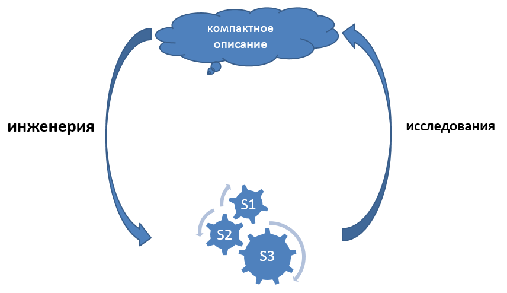
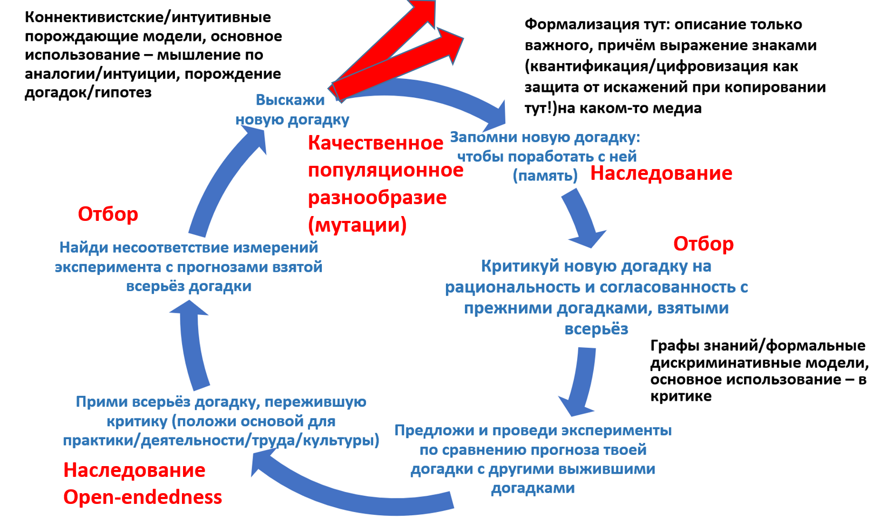
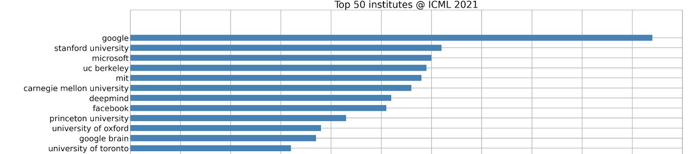

# Инженерия и наука

Нельзя путать роли инженера и исследователя. Мы тут говорим слово «исследователь», а не «учёный» главным образом потому, что научное/рациональное мышление как построение объяснительных (про причины-следствия) порождающих (generative, пригодных для «обратного моделирования», предсказания состояний мира, конкретизации/рендеринга) теорий сегодня используется отнюдь не только в «науке» как особой культуре «учёных», но повсеместно в самых разных культурах, в том числе инженерии.

Исследователи (это роли, а не люди!) ровно обратны инженерам: если инженеры делают реальные материальные вещи, опираясь на какие-то (необязательно «научные»!) описания, то исследователи делают объяснительные теории физической и абстрактной (математики как раз занимаются исследованием поведения абстрактных/ментальных объектов) реальности. Исследователи получают компактные, понятные и формальные описания действительности. Слово «реальность» тут означает именно физический и ментальный мир, а вот «действительность» — мир, преломлённый нашими понятиями, отражающими то, что нам об этом мире уже известно и что мы можем выразить по поводу этого мира (скажем, если человечество пару веков назад не знало о существовании электронов, то в реальности они были, а в действительности их не было).

Конечно, инженерия и исследования тесно переплетены:

* когда инженер получает инженерную систему, поведение которой не отвечает его замыслу, он исследует проблему: пытается найти наиболее компактное описание работы этой инженерной системы (модель/теорию/алгоритм), из которого было бы понятно, в чём он ошибся при замысле системы и её воплощении. Затем исправляет ошибку: меняет систему.
* когда исследователь моделирует мир, то есть придумывает новый способ его описания (новую модель, мета-модель, мета-мета-модель), более компактный и лучше объясняющий мир, чем предыдущие способы, то он прежде всего строит догадки о тех понятиях, которые помогут ему построить это описание. Затем критикует эти догадки, и в том числе проводит эксперименты. Отнюдь не все эксперименты «мысленные». Некоторые из них требуют создания весьма и весьма сложных инженерных систем (например, ускорители частиц — это одни из самых сложных на Земле инженерных систем, и их строят именно для проведения экспериментов в предметной области физики высоких энергий). Когда эксперимент проведён, исследователи корректируют свои объяснительные теории в зависимости от результатов эксперимента (выбирают лучшую из имеющихся, или модифицируют какую-то из них для лучшего соответствия их предсказаний с результатами эксперимента).

Тем самым инженерная и исследовательская деятельности оказываются связаны в цикл, и в каждом исследовательском или инженерном проекте обычно приходится много раз этот цикл повторять:

Как только мы что-то делаем в рамках какого-то метода, «выполняем инструкцию», результаты нашей работы очень скоро начинают расходиться с предсказаниями наших моделей «из учебника». В этот момент нужно «включать мозг» в плане силы его общего интеллекта, то есть переходить на использование интеллект-стека фундаментальных методов мышления. А поскольку наши модели мира несовершенны, а ещё каждый раз находится что-то, что меняет мир, меняет нас прямо по ходу наших занятий каким-то методом, то вот это несоответствие предсказаний мира моделями «из учебника» и реальной обнаруживаемой в ходе работы ситуацией происходит постоянно. Нужно постоянно разбираться, что происходит, поправлять наши модели мира. Исследования/познание оказываются вплетены в жизнь более тесно, чем можно себе представить. В учебнике написано — «ударить молотком три раза, и гвоздь будет забит!». Вы бьёте всего один раз — и попадаете не по гвоздю, а по пальцу, или гвоздь гнётся, или гвоздь забивается по самую шляпку сразу и молоток разбивает ещё и ту поверхность, куда забивается гвоздь, или оказывается, что вы пытаетесь вбить гвоздь в камень, или… этот список можно продолжать и продолжать, и это простейший метод! Хуже, когда вы даёте человеку лекарство, а оно работает совсем не так, как описано в инструкции по его применению. Вы должны стать исследователем, чтобы понять происходящее!

Главное тут — цель объемлющей деятельности, а не собственно сама работа «исследований» или «инженерии» и её отнесение к какому-то классу. Цель этой объемлющей деятельности обычно — изменение мира к лучшему, то есть либо появление какой-то материальной системы, приносящей пользу каким-то внешним проектным ролям, либо появление какого-то компактного описания/объяснения/«generative model» того, как устроен мир, чтобы на следующем шаге иметь возможность изменить этот мир к лучшему. В любом случае, либо инженерия оказывается спрятана в исследованиях/познании, либо познание/исследования спрятаны в инженерии. Они неразрывны. Познание деятельно, деятельность познающа.

Вот ещё раз тот же цикл, при этом инженерная часть — это там, где на основе выигравшей догадки делается «принятие всерьёз», теория берётся для действия. Если вы не можете опровергнуть, что с ростом ресурсов умность нейронной сетки растёт, вы собираете много миллиардов долларов от инвесторов и делаете условно-некоммерческую OpenAI — и да, вложение многих миллионов долларов в обучение большой языковой модели на основе нейросети приносит свои инженерные плоды, получаем ChatGPT[^r8-1]. Если вы не можете опровергнуть, что энергия равна массе, умноженной на скорость света в квадрате, то понимаете, что уменьшение массы урана за счёт ядерного распада должно давать огромное количество энергии — принимаете это всерьёз и организуете Манхэттенский проект, который на выходе дал работающую атомную бомбу.

Вот ещё одна, более подробная диаграмма кольца познания, оно же — кольцо инженерии. Это отражение теории эволюции, красные стрелочки показывают, что генерируется множество гипотез, и они могут дать старт новым подобным циклам. Теории эволюции знаний (включая эволюционную эпистемологию Karl Popper с доработками David Deutsch других исследователей эволюции знаний) очень похожи на любые другие эволюционные теории. После принятия всерьёз — как раз будет «выход в практику», «выход в инженерию»: создание инженерных систем на базе положений теории, но цикл продолжает крутиться!

Особо надо отметить, что нейросети (и мокрые, и сухие) тоже могут (хотя и крайне неэффективно!) выполнять роль критика: это универсальные алгоритмы, поэтому они вполне могут выполнять и операции сложения по очень хитрому тригонометрическому алгоритму[^r8-2] — это медленно, энергетически неэффективно, но возможно! Нейросети могут выполнять и длинные цепочки чисто логических рассуждений (собранность — удерживание во внимании длинных цепочек логических рассуждений), причём примерно одинаковая общая результативность собственно «нейросетевого» ассоциативного поиска новых идей как при удержании длинных цепочек логических рассуждений внутри нейросети, так и при сдвиге этих длинных цепочек логических рассуждений на внешние вычислители («киберсобранность», когда собранность кибер-нейросети удерживается сдвигом рассуждений на внешние классические, не нейросетевые логические вычислители), это проверено экспериментально[^r8-3]. Нейросети не слишком хороши в длинных логических и математических выкладках, их правильно сдвигать на классические компьютеры, математический софт. Но нейросети вполне могут делать эти выкладки, с трудом и ошибками. Так что опора инженерии на математику и физику поддерживается не просто «голым мозгом», она существенно поддерживается компьютерным инструментарием, и даже просто карандашом-бумажкой, как средством удержания собранности — сосредоточенности на ведении длинного рассуждения, многих оборотов цикла познания/learn/моделирования/обучения/исследований (синонимов с нюансами тут много). И в этом цикле есть один замечательный момент: наука/исследования/познания выходят в инженерию в момент «принятия всерьёз».

Перепутанность и неразрывность инженерии и науки отражается в жизни, с ними не нужно бороться:

* В большинстве мультфильмов «учёный» в белом халате меньше всего учёный-исследователь, это «инженер-изобретатель». Эти якобы «учёные» не ставят эксперименты: они придумывают какие-то необходимые для их целей системы, в быту называемые «inventions/изобретения» как синоним «будущего продукта», и затем воплощают эти системы в реальности как системы-прототипы или системы-опытные образцы. Это «лаборатории Эдисона», где «лаборатории» не столько исследовательские, сколько инженерные, в которых происходит возня/tinkering (другое название — trial and error method), инженерная работа путём проб и ошибок, инженеры пробуют свои разные «догадки» для физического состава системы так же, как исследователи пробуют свои «догадки» в части объяснительных моделей. Большинство не срабатывают, но некоторые — срабатывают, иногда сразу, иногда после существенных доработок. Это по факту эволюционный процесс руками инженеров, это не «наука», поскольку не производятся объяснения.
* «Прикладные исследования» (applied research, прикладная наука) тоже не «исследования», несмотря на явное употребление термина «исследования». Никаких объяснительных теорий от прикладных исследований ожидать не приходится, а результаты НИР (научно-исследовательских работ, но в ходе этих работ часто создаются не только какие-то описания, но и макеты изделий) и НИОКР (научных и опытно-конструкторских разработок, в ходе них создаются не просто макеты, но опытные образцы) нацелены на получение в конечном итоге «инноваций» как систем, которые определяются как новые системы, успешно выведенные на рынок, то есть достаточно конкурентноспособные, чтобы продаваться (а не просто любые «новые системы»). Между «работающим прототипом» и «выпускаемым продуктом» могут быть годы и годы разработки/development. И это рассуждение работает не только с системами уровня сложности косного вещества или киберфизическими системами, но и системами других уровней системной эволюционной сложности, хотя даже о сообществе не скажешь «вот мы тут сделали опытный образец, сейчас выведем его в серию», приходится адаптировать рассуждение к разным системным уровням.
* Очень часто прикладные исследования (research) и классическую разработку вообще не разделяют, отсюда устойчивое сокращение R&D (research and development). Есть ли разница? Есть: «лаборатории Эдисона» (лаборатория Bell Labs, лаборатория IBM и т.д.) всё-таки отличаются существенно по организации труда и проходящим в них работам от классической инженерной разработки в конструкторском бюро или проектном институте. Но они не отличаются принципиально! Оргинженерией (то есть менеджментом) R&D как раз и занимается метод technology and innovation management как метод инженерии организационной системы, занимающейся разработкой технологий и инновациями.

Настоящая «наука», исследования в чистом виде — это «basic research», которые ведутся в условных «лабораториях Эйнштейна». На выходе исследований не «опытные образцы», а объяснительные теории — компактные и довольно формальные описания физического мира/природы.

Но не всё так просто. Например, физики-экспериментаторы или биологи-экспериментаторы — это не «исследователи», а хорошие инженеры, их задача — придумать систему, которая позволит провести измерения (провести эксперимент) для выбора той или иной теории из множества кандидатов на лучше предсказывающих результаты этих измерений. По роду деятельности они как инженеры меняют физический мир (создают различные измерительные системы, в которых подготавливают измерение какого-то параметра какой-то системы в заданных условиях — типично инженерная задача), а как исследователи-физики или исследователи-биологи — проектируют целевое измерение (задают потребность в экспериментальной установке) и затем интерпретируют результаты эксперимента в части возможного опровержения какой-то теории, для чего этот эксперимент и задумывается.

Ровно из такого понимания двух ролей физика как инженера-исследователя «в одном теле» происходит высказывание Фарадея, что «настоящий физик должен уметь пилить буравом и буравить пилой», то есть настоящий исследователь должен уметь хорошо выполнять инженерную работу (во времена Фарадея инженер воспринимался не столько как проектировщик или конструктор, сколько непосредственный исполнитель метода изготовления, своими или чужими руками тут уже неважно, но подразумевалось, что всё-таки своими), и наоборот, настоящий инженер должен уметь исследовать (иметь естественнонаучное образование, как и все исследователи. Насколько «все»? Тут отдельно можно обсуждать, насколько изучение личности, организации, сообщества, общества может быть «естественнонаучным»).

Системная инженерия вполне может включать R&D, изобретения, создание прототипов. И в ходе занятий системной инженерией вполне можно ожидать проведения каких-то научных исследований, дающих результатом теорию. Скажем, в области искусственного интеллекта огромное число научных работ сейчас делается в лабораториях крупных инженерных фирм. Вот вывод AI report 2024[^r8-4]: в 2023 инженеры из коммерческих компаний выдали 51 значимую модель машинного обучения, а университеты выдали только 15. И ещё была 21 значимая модель как результат коллаборации между инженерами и учёными.

Это просто продолжение тренда ухода исследований из университетов в промышленность в самых острых направлениях. Вот что было на пару лет раньше, посмотрите, как соотносилось число докладов от университетов и от коммерческих компаний на конференции ICML по искусственному интеллекту в 2021 году[^r8-5]:

Мы хотим создать более-менее формальное (позволяющее логически рассуждать и находить противоречия в этих рассуждениях) компактное объяснительное описание самой системной инженерии как культуры создания успешных систем (без выделения специальной роли системного инженера, занимающегося системой в целом). Это обычная задача методологии как фундаментального учения о методах. **Конкретизация методологии, занимающаяся** **инженерией как** **методами** **создания и развития** **успешных** **систем,часто** **называется «инженерная наука»** **(engineering science).**

Другие предметы и другие науки описывают поведение инженерных объектов, то есть как именно они будут работать, будучи устроены таким или иным образом: механические устройства, электрические схемы, компьютерные программы. Обращаем внимание, что мы различаем:

* метод самой инженерии (engineering, что делают создатели целевой системы), которую изучает «инженерная наука» и
* методы мышления для описания объектов инженерии, поддержанные соответствующими инструментами в виде разного сорта моделеров — методы механики, электрики, информатики/компьютерной науки/computer science и т.д., то есть методы описания поведения не создателей, а самой целевой системы.

Наиболее просто понять разницу между такой «наукой про инженерный объект» и самой «инженерной наукой» можно на примере computer science (компьютерной науки) и software engineering (программной инженерии). В одном из блогов была замечательная история, как его автор, отличник по computer science, пошёл после вуза покорять софтверную компанию. Но там ему буквально за два дня объяснили, что он (может быть) умеет программировать, но совершенно точно не умеет работать: нужно было разбираться с тем, как поставить задачу на разработку, писать нужно было не столько какой-то хитрый алгоритм, сколько крохотную заплатку к уже написанному многими людьми коду на миллион строк, нужное место для его заплатки в этом коде нужно было как-то найти, кроме этого нужно было разобраться с управлением конфигурацией (версионированием), наладить отношения с менеджерами и специалистами по безопасности, разобраться с ограничениями архитектуры, понять суть принятой в проекте методологии разработки, вписаться в команду и т.д. — при этом ничему этому в вузе не учили.

Работа «программного инженера» оказалась совсем не тем, чему учили, совсем не «использованием знаний компьютерной науки в инженерном проекте»: огромное количество времени уходит на общение с коллегами и выяснение того, что где взять и куда положить, а не на «думание про научно-обоснованные алгоритмы». Время решения задачи оказывается не «сколько нужно для идеального научного решения», а «сколько отведено графиком работы». Учили computer science (ключевые слова: алгоритм, оценка скорости выполнения алгоритма, нотация, грамматика, реляционная модель данных) и не учили software engineering (ключевые слова: концепция использования, архитектура, тестирование, версионирование, ввод в эксплуатацию).

Точно так же инженера-механика могут научить работать с прочностью, формой, скоростями, трением с использованием всяческих теорий, но могут не научить выяснять особенности заказа с представителями заказчика, не познакомят с архитектурой, документированием инженерных обоснований. Именно поэтому хороший физик (человек, который имеет квалификацию выполнять роль физика-исследователя, владеет методом физического исследования) может быть хорошим специалистом по сопротивлению материалов, но не быть хорошим инженером — у него знания про объекты, которыми занимаются инженеры, но не про саму инженерию как метод.

Особенностью сегодняшней инженерии будет то, что она претендует не только на описание методов создания механических или киберфизических (механических с универсальным компьютером в их составе) систем, но и вообще любых систем, включая и общества, и даже человечество: утверждается, что методы создания этих систем на самом абстрактном уровне одинаковы, то есть все эти системы (или модификации этих систем, если речь идёт о brownfield, то есть доработках уже существующих систем) создателями в их графах создаются и развиваются в постоянной адаптации к изменениям в окружении и целевой системы (часто прямо по ходу эксплуатации), и в самой целевой системе (автомобиль ломается потому как в нём происходят изменения, не предусмотренные инженерами), и даже в организациях графа создателей (люди и AI там получают новые знания, им становится доступно новое оборудование, или наоборот — неожиданно заканчиваются ресурсы). Для всех таких проектов надо готовить концепцию использования, концепцию системы, архитектуру системы, непрерывно их уточнять, готовить конвейер/завод/«внутреннюю платформу разработки»/«internal development platform»/pipeline для непрерывного введения в эксплуатацию релизов/инкрементов системы, которые одобряют визионеры, а готовят разработчики под надзором архитекторов. Разница в масштабах систем, конкретных методах работы, разнообразии дисциплин, описывающих системы той или иной природы, особенностях скоростей их эволюции, а разница терминологии не должна заслонять этой общности.

Обучить инженерному делу как таковому (именно это цель настоящего руководства, хотя руководство делает это на кругозорном, весьма абстрактном уровне) — это обучить тому, как устроен ход эволюционной (другой уже сегодня не бывает) инженерной разработки, какие основные понятия предметной области самой инженерии (а не предметной области, описывающей физику и алгоритмику создаваемого инженерного объекта): как устроен инженерный проект в целом и как разворачивается во времени проектирование/конструирование/программирование, изготовление и ввод в эксплуатацию целевой системы, а не только как устроена создаваемая система.

**Методология предлагает как результат «инженерной науки» описание разных вариантов инженерного процесса и связанного с ним разделения труда—** **SoTAи не очень, в том числе объясняет разницу: почему одни методы лучше (SoTA,** **state-of-the-art, «лучшие из известных на текущий момент времени»), а другие хуже.**

**Если мы теперь говорим, что «результат инженерной науки надо брать всерьёз и строить метод инженерии как описанный этой** **наукой** **SoTAметод», то это будет уже не «объяснения того, как бывает», а «предписание того, как надо делать»—** **и тогда мы говорим, что методология как «инженерная наука» является нормативной наукой**[^r8-6]**.**

[^r8-1]: <https://en.wikipedia.org/wiki/OpenAI>

[^r8-2]: <https://arxiv.org/abs/2502.00873>

[^r8-3]: <https://arxiv.org/abs/2409.12183>

[^r8-4]: <https://aiindex.stanford.edu/report/>, 2024

[^r8-5]: <https://www.vinai.io/an-overview-of-icml-2021s-publications/>

[^r8-6]: <https://en.wikipedia.org/wiki/Normative_science>
