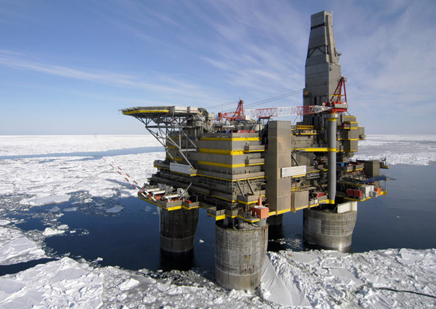

# Роль системного инженера в её отличии от роли прикладного инженера

Ответственность за всю систему на многих уровнях как целое (whole system) и связанная c этим фундаментальность/трансдисциплинарность/transdisciplinarity подхода к прикладным инженериям (механической, электрической, программной, предприятия и т.д.) отличают системную инженерию от всех её частных/предметных/domain конкретизаций. Представим себе ледовую буровую платформу:

Сотни тысяч тонн металла, бетона, пластмассы, компьютеров (самих по себе сложно устроенных) и оптоволокна, необходимых расходных материалов, обученная вахта должны собраться вместе далеко в море среди льда. В строго определённый момент эта огромная конструкция должна начать согласованно работать — и не просто работать, а приносить прибыль и обеспечивать безопасность в части загрязнения окружающей среды и здоровья находящейся на платформе вахты, а также в чётком согласовании со службами берегового обеспечения (нефтепереработка, провайдеры связи, метеорологические службы, государственные надзоры по самым разным линиям и т.д.). В течение долгих лет потом живые люди ещё должны постепенно заменяться роботами (человекоподобными, нечеловекоподобными и даже программными, чаще всего с AI, но и это не обязательно — иногда хватает простого автомата).

Какой метод работы должен учесть результаты работ самых разных агентов в ролях прикладных инженеров, работающих на самых разных системных уровнях — собрать в единое целое данные ледовой обстановки, санитарных норм в помещениях для обслуживающего персонала, обеспечение электричеством попавших туда компьютерных серверов, необходимые характеристики этих серверов и программное обеспечение с нужными функциями и нужной надёжностью? Кто озаботится учётом в конструкции платформы изменений в длине металлоконструкций за счёт разницы суточных температур и одновременно установкой акустических датчиков на трубах, которые прослушивают шорох песка, чтобы по этому шороху нейросетевые алгоритмы определяли износ труб и предлагали редкий и нужный «ремонт по состоянию» вместо относительно частого и бесполезного «планового/профилактического ремонта»? **Методом работы, который** **ответствен за обеспечение целостности** **системы и её графа создателейв инженерном проекте** **является системная инженерия.**

Инженеры нефтяной платформы в их самых разных ролях создают (проектируют и изготавливают) и развивают нефтяную платформу как изменяющее мир к лучшему или хотя бы просто успешное (безопасное, надёжное, прибыльное, ремонтопригодное и т.д. — разным внешним проектным ролям нужно от этой платформы разное) целое, в том числе отдают части этой работы каким-то инженерам, которые специализируются на прикладных видах инженерии каких-то подсистем, входящих в нефтяную платформу (инженерам-строителям, машиностроителям, инженерам-электрикам, компьютерщикам/айтишникам и т.д.) и собирают результаты их работ так, чтобы удерживать успешность нефтяной платформы в течение многих лет. Агенты, исполняющие как роли инженеров нефтяной платформы, так и роли прикладных инженеров самых разных специализаций, по факту владеют на каком-то кругозорном уровне и системной инженерией, чтобы понимать происходящее в проекте как в части его целевой системы, так и в части организации проектной работы. **Именно системная инженерия помогает договориться, как в целом создать и развивать успешную систему и как в целом разделить труд в команде создателей этой системы.**

В тот момент, когда инженеры заняты удержанием целостности и успешности целевой системы, какой бы природы она ни была, они — системные инженеры. Василий Петрович как инженер в проекте выполняет тем самым две роли: системного инженера целевой системы (когда заботится об успешности проекта в целом) и прикладного инженера, когда размышляет об успешности какой-то системы в графе создателей — например, заботится об успешности сетей компьютерной связи на нефтяной платформе, или успешности команды изготовителей металлоконструкций.

Это главный признак, отличающий **системных** инженеров «по роли» от всех других **прикладных** инженеров: они отвечают за целевую систему в целом, как в части деталей-частей (разные системные уровни требуют разных методов для работы с типовыми для них системами — с микросхемами работают не так, как с компьютерами, а с компьютерами не так, как с системами управления, в состав которых входят компьютеры), так и в части использования детальных знаний отдельных инженерных методов (разные свойства систем какого-то типа требуют знания разных методов: если вам нужно сделать корпус компьютера, то нужны и знания инженера-механика, чтобы корпус был прочным и лёгким, и знания инженера-теплотехника, чтобы компьютер не перегревался и корпус обеспечивал достаточную вентиляцию). Главная задача создателя в роли системного инженера — чтобы не было пропущено какой-нибудь мелочи, ведущей к провалу.

Авиалайнер — это много-много кусков металла и пластика, синхронно летящих вместе с людскими телами и чемоданами на скорости 900км/час (0.85 от скорости звука, это типовая скорость Boeing 787 Dreamliner) на высоте 11км. Системный инженер в его прикладной специализации «авиационный инженер» — это тот::роль, кто озабочен их надёжным и экономичным совместным полётом, озабочен увязкой самых разных интересов самых разных ролей (грузоподъёмность, расход топлива, дальность полёта, шум при взлёте и посадке, ограничения по длине разбега и посадки, необходимость лёгкого обслуживания на земле, отсутствие обледенения, безопасность людей на борту, и т.д. и т.п.). Эти интересы отстаиваются самыми разными исполнителями внешних проектных ролей, представляющими самые разные профессиональные и общественные группы исполнителей тех или иных методов (экологи, военные, урбанисты, коммерсанты, и т.д., и т.п.), но если не удастся договорить их всех, проект будет неуспешен.

Для авиалайнера примерно шесть миллионов деталей замысливаются, проектируются, именуются, изготавливаются, проверяются, доставляются в одно место, собираются в одно изделие, принимаются как целый авиалайнер и продаются, в аэропорту эти собранные детали как одно целое обслуживаются, заправляются топливом и едой, заполняются пассажирами и грузом, диспетчируются на взлёт — и вот эти шесть миллионов деталей летят, обеспечивая комфорт пассажирам и прибыль владельцам, но на этом проект не заканчивается — в проект вносятся какие-то изменения, и очередной экземпляр лайнера выходит немного другим (нет двух одинаковых конфигураций, выходящих из завода!), а кроме этого ещё и обсуждается проект новой базовой модели — авиационная инженерия тоже эволюционная.

Это даже не вся история: авиазавод тоже надо создать и развивать как успешную систему в графе создателей авиалайнера — и это тоже требует задействования инженерами этого завода методов работы системных инженеров. Более того, ключевыми тут будут как раз инженеры внутренней платформы разработки — в ответственности которых инструментарий непрерывной разработки в частях как замысливания и проектирования, так и изготовления. В идеале завод (инструментарий изготовления) — это инструмент-автомат, там нет людей, это «тёмная холодная фабрика», потому и тёмная и холодная, что освещать и отапливать ввиду отсутствия людей её не надо. Это идеал, но к этому идеалу человечество движется довольно быстро.

Элон Маск не боится компаний, которые делают прототипы электромобилей. Для автомобилей создать массовое производство автомобилей в сто раз трудней, чем создать автомобиль[^r8-1]. Для ракет, для чего угодно: создать рентабельное серийное производство ракет и чего угодно вдесятеро или даже в сто раз трудней, чем создать саму ракету. Безопасные бритвы получили широкое распространение только после того, как Жиллет наладил массовое производство дешёвых одноразовых лезвий, которые были острыми (то есть были массово изготовлены с большой точностью), но их можно было просто выбросить после использования[^r8-2].

Можно создать восхитительный проект компьютерного чипа силами десяти человек и пары искусственных интеллектов, а вот чтобы изготовить этот чип, потребуется завод чипов, для этого завода потребуется оборудование для изготовления чипов — и тут выяснится, что чипы могут разработать инженеры почти в каждой стране мира, но разработать оборудование для производства и построить завод для современных чипов, а не чипов двадцатилетней давности могут буквально в нескольких странах. Компания ASML[^r8-3] является много лет почти полным монополистом в производстве оборудования для современных, а не давно устаревших микросхем, и эта ситуация не спешит меняться.

Заводы тоже строят создатели/инженеры, находящиеся в двух инженерных ролях: прикладных методов работы для систем той природы, которыми занимается завод (скажем, машиностроение::метод, если на заводе выпускают машины, менеджмент::метод для тех «заводов», которые выпускают организации из людей), и роли системного инженера — когда надо удерживать целостность целевой системы, целостность систем из графа создателей (в том числе целостность завода, как одного из создателей в этом графе). Хотя ролей даже не две, а больше — если учесть, что любой метод работы можно раскладывать на составляющие довольно глубоко (в приближение иерархического представления, подробней об этом в руководстве по методологии), то ролей можно получить заведомо больше, чем число участников проекта.

Как об этом думать? Традиционно: как о разделении труда, причём часть труда — это мышление, оно трансдисциплинарно. Какой-то человек (или даже AI) когда думает о своём проекте, выполняет огромное число ролей:

* Прикладного инженера, который озабочен методами работы для конкретного вида систем (механика, электрика, авиация, обучение). Стишок про «мамы разные нужны, мамы разные важны»[^r8-4] как раз про это. Возможно, одному агенту нужно будет играть даже роли разных прикладных инженеров.
* Системного инженера, который озабочен успешностью системы в целом, успешностью графа создателей в целом.
* Самые разные другие роли, прежде всего роли из интеллект-стека: например, роль совести, поскольку в любом проекте приходится сталкиваться с этическими проблемами, роль разума, поскольку надо принимать рациональные решения, и так далее.

Поскольку речь идёт о разных ролях, то велика вероятность существенного конфликта интересов (напомним, что термин маркирует ситуацию, когда два интереса по одному и тому же предмету у двух ролей противоположны и эти роли играет один агент). Так, роли инженера-технолога, предлагающего новую технологию производства и специалиста по оценке эффективности этой технологии, если они исполняются одним человеком, в конфликте интересов. Одна роль заинтересована в демонстрации преимуществ предлагаемой технологии, что может побуждать эту роль занижать или даже полностью игнорировать возможные эксплуатационные риски и недостатки. Однако роль визионера, который должен оценить, выгодно ли задействовать эту технологию, требует наоборот — выявления всех возможных рисков, причём не только сиюминутных, но и возможных к появлению в будущем. Какая роль «победит»? Возможно, в этот момент надо подключать мышление ролей рациональности (рациональное принятие решений в условиях неопределённости) и совести (оценка своего конфликта интересов).

При этом нельзя считать, что конфликт интересов фатален, ибо всегда можно найти конфликт интересов ввиду разнообразия ролей, которые приходится исполнять одним и тем же людям (в том числе конфликт интересов роли «совесть» и всех остальных инженерных, например, когда инженер знает, что проект «дохлый» и лишь расходует деньги инвесторов, которые могли бы быть потрачены на другие, более успешные проекты). Есть и парадоксальные результаты. Например, дальше в нашем руководстве будет рассмотрено (и дана литература), что в современной программной инженерии функциональные тесты пишет не независимый агент-тестировщик, а тот же агент, который выполняет роль разработчика — и экспериментально показано, что качество программы при таком подходе не ниже (хотя и не выше), чем в ситуации, когда тестирование проводится независимыми разработчиками.

Но всё-таки большие инженерные проекты делаются не одним человеком, который исполняет все проектные роли, а коллективами с разделением труда по созданию систем самой разной природы в составе целевой системы и систем в графе создателей. Кроме того, в любом проекте обычно находятся множество агентов, которые исполняют внешние проектные роли — и часто не только число внешних проектных ролей начинается от пятнадцати, как обсуждалось в руководстве по системному мышлению, и всегда есть минимум одна не выявленная роль, но и число отдельных агентов, играющих (или представляющих в проекте — если, скажем, в игровом проекте роль игрока играют 40 тысяч человек, представлять все эти 40 тысяч человек может один агент, человек или AI) эти роли, легко может быть тоже от пятнадцати уже не ролей, а человек — ещё и по нескольку человек могут играть одну внешнюю проектную роль, и между ними могут быть даже разногласия по предпочтениям.

Для любого производства киберфизической системы нужно учесть потребности внешних проектных ролей, разработать концепцию использования и концепцию системы, принять архитектурные решения, создать информационную модель с детальностью, достаточной для изготовления, далее выполнить все закупки комплектующих, выбрать или даже построить завод как производственную платформу, запустить/наладить его оборудование, нанять и обучить людей, потом управлять тем, чтобы этот завод работал «как машина» (несмотря на то, что работают на нём не только машины, но и люди), и делать это для системы-как-вида, с учётом постоянных изменений в окружении целевой системы в ходе её эксплуатации, постоянных изменений в предложениях конкурентов, постоянных изменений в потребностях, постоянных изменений в методах производства и используемых материалах, постоянных изменений в команде. Это всё требует многоуровневого (системного) учёта мельчайших деталей всех систем — и целевой системы с её окружением, и систем графа создателей с их окружением.

Если где-то на конвейере завода неудачно выпадет винтик из-за того, что что-то там было плохо спроектировано, потом плохо смонтировано, поломка плохо диагностирована, может неожиданно остановиться весь завод. Если архитектор не справился со своей работой и внести новую фичу/возможность в систему можно только путём «разработки с нуля, перенастройки производства с нуля», то может неожиданно остановиться весь проект. Ну, или работники завода могут забывать вести учёт изменений оборудования этого завода (провалено управление конфигурацией завода) — и будет непонятно уже, какое там стоит оборудование, и как его ремонтировать. Или производство организовано так, что оно разбито на отдельные более-менее автономные участки с уникальным оборудованием и мало уже кто знает, какое именно там оборудование на соседних участках — и это хорошо, это позволяет быстрее выполнить переналадку производства на новый инженерный процесс (так работают, например, производство автомобилей Tesla — но это требует особой организации сборки автомобилей, причём эта организация учитывает эволюцию самого хода сборки, равно как эволюцию проекта/design автомобиля).

Проблема организации труда инженерной бригады в целом — это проблема менеджмента, причём менеджмент тут оказывается тоже инженерией, просто это инженерия уже не целевой системы, а инженерия предприятия как системы в графе создателей. Это «организационный менеджмент» в части создания и модификации/модернизации организации, «операционный менеджмент» в части эксплуатации созданной организации. И инженерия киберфизических систем (роботов — больших вроде стадиона, самолёта, автомобиля, ракеты, и маленьких, вроде человекоподобных роботов и роботов-собак, промышленных роботов), и менеджмент — это всё прикладные инженерии, конкретизации лучшего известного человечеству способа делать успешные системы, менять физический мир к лучшему — прикладные конкретизации системной инженерии.

Наше руководство в основном будет основано на примере такой конкретизации в части киберфизических систем (иногда это называют «классическая системная инженерия»), а также программных систем, это программная инженерия (software engineering). Мы не слишком много будем давать примеров «нежелезных» и «непрограммных» систем, но всё излагаемое приложимо и к ним. Мы уже смотрели на «мастерство» как пример такой системы. Но это же работает и с биологическими системами, а также системами «на грани неживого», например, вирусами (они как раз занимают пограничное положение между «живым» и «неживым», нет однозначного их отнесения к одному из этих классов).

Скажем, если вы работаете с генной инженерией, то как раз будете заниматься вирусами. Это означает, что вам нужно соответствующим образом простроить работу исследовательской лаборатории (инженеры-разработчики), работу производственных мощностей (выпуск вируса), организовать работу с персоналом и ещё отвечать на многочисленные вопросы по биоэтике, а также делать это достаточно долго: проект не должен закончиться первым же генным продуктом, будь он удачным, или даже не очень удачным — надо будет выпускать новые и новые вирусы. То есть работать нужно отнюдь не только с самими вирусами! Какая роль удерживает все эти различные системы, над которыми надо работать, в их сложных взаимосвязях, договаривает всех вокруг по поводу взаимодействия всех этих систем? Это роль (не должность!) системного инженера.

В крупных проектах подобную роль «удержания целого» могут выполнять десятки людей в качестве основного времени их занятости, а не в приложении к занятости как прикладного инженера и сопутствующей их занятости как «мыслителя» в части интеллект-стека фундаментальных методов мышления. И их могут называть по этой обобщённой «архироли» — системные инженеры, даже если они занимаются только частью методов системной инженерии: только методологией, только архитектурой, только созданием концепции системы или только эксплуатацией. Со стороны люди отмечают, что «он занят системой в целом, проектом в целом» — и дальше уже не разбираются в деталях, маркируют как исполнение роли системного инженера, не выделяя составляющие этой роли.

Системный инженер держит все (и в целевой системе, и в её окружении, и в графе создателей) системы в проекте взаимоувязанными, ибо именно у него (тут может путаться роль и исполнители роли — могут говорить «у него», если один агент, или «у них», если проект большой и исполнителей этой роли несколько) в голове и компьютерах (основной инструмент — моделер для системного моделирования) метод раскладки всей сложной системы в её окружении на уровни, а также раскладки рассмотрения разных интересов в рамках одного уровня на разные методы, многоуровневой оптимизации решений для удовлетворения всех интересов (конфликтов/противоречий между решениями разных уровней избежать нельзя, нужно проявлять изобретательность, и всё равно в результате будет неустроенность/неустаканенность в конструкции системы, будет проявляться субоптимальность в решении этих конфликтов), а ещё он будет заниматься также системами в графе создателей — ибо чаще всего это не биология и система не создаёт себя сама (не жизненный, не цикл), её создают создатели в их графе. Системная инженерия — это как раз способ думать о том, как создавать и развивать самые разные системы и создателей этих систем.

В помощь людям, которые играют роль системных инженеров тут прежде всего их коллеги (включая AI, а не только людей), прикладные инженеры (тоже необязательно живые, и речь тут о разделении труда и разделении работ — проекты коллективны!), а также «просто компьютеры», позволяющие удерживать всю эту сложность в их человеческой, но усиленной компьютером памяти, проводить имитационное моделирование для экономии времени и материалов по сравнению с пробами и ошибками в реальной жизни. Компьютеры помогают удерживать коллективную собранность в коллективах, где много людей: проявлять коллективное внимание к каждой мелочи нижних уровней разбиения систем, удерживать типы объектов для избегания ошибок. Компьютеры (в том числе и AI-системы, но необязательно) дают моделеры, удерживающие от утери коллективного внимания ко всему огромному целому на верхних его уровнях, заходящих в нижние уровни окружения. Это коллективное внимание будет удерживаться компьютерами также и на этих верхних, надсистемных уровнях окружения, а также по необходимости на всех уровнях систем и их окружения в графе создателей. Именно роль системного инженера (коротко говорим, опуская тип «роль» — «именно системный инженер») организует коллективное многоуровневое внимание к самым разным системам. «Системный» тут не случайно. Как всегда в случае системного подхода, это термин отсылает к безмасштабности и абстрактности внимания, в отличие от более узкого внимания прикладных инженеров к одной предметной области какого-то одного системного уровня для систем какого-то одного вида.

[^r8-1]: "It's relatively easy to make a prototype but extremely difficult to mass manufacture a vehicle reliably at scale. Even for rocket science, it's probably a factor of 10 harder to design a manufacturing system for a rocket than to design the rocket. For cars it's maybe 100 times harder to design the manufacturing system than the car itself. The issue is not about coming up with a car design — it's absolutely about the production system," Musk said. "You want to have a good product to build, but that's basically the easy part. The factory is the hard part." — <https://www.businessinsider.com/elon-musk-says-building-factory-100-times-harder-than-making-car-2019-3>

[^r8-2]: <https://ru.wikipedia.org/wiki/Жиллетт,_Кинг_Кэмп>.

[^r8-3]: <https://www.asml.com/en>

[^r8-4]: <https://www.culture.ru/poems/45234/a-chto-u-vas-delo-bylo-vecherom-delat-bylo-nechego>
